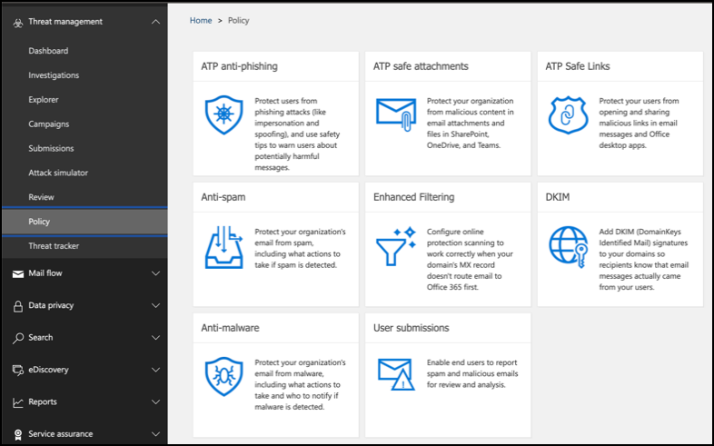

# Konfigurera skydd mot Microsoft Threat för utvärderings labbet eller pilot miljönConfigure Microsoft Threat Protection pillars for your trial lab or pilot environment

[!INCLUDE [Microsoft 365 Defender rebranding](../includes/microsoft-defender.md)]

**Gäller för:****Applies to:**
- Microsoft HotskyddMicrosoft Threat Protection

Att skapa ett utvärderings labb för Microsoft Threat-eller pilot miljö och distribuera det är en process i tre steg:Creating a Microsoft Threat Protection trial lab or pilot environment and deploying it is a three-phase process:

 
<table border="0" width="100%" align="center">
  <tr style="text-align:center;">
    <td align="center" style="width:25%; border:0;" >
      <a href= "https://docs.microsoft.com/microsoft-365/security/mtp/prepare-mtpeval?view=o365-worldwide"> 
        
       Fas 1: förbereda </a>Phase 1: Prepare </a> 
    </td>
     <td align="center">
      <a href="https://docs.microsoft.com/microsoft-365/security/mtp/setup-mtpeval?view=o365-worldwide">
        
       Fas 2: konfiguration </a>Phase 2: Setup </a> 
    </td>
    <td align="center" bgcolor="#d5f5e3">
      <a href="https://docs.microsoft.com/microsoft-365/security/mtp/config-mtpeval?view=o365-worldwide">
        
       Steg 3: Konfigurera & inbyggt </a>Phase 3: Configure & Onboard </a> 
</td>

  </tr>
</table>

Du är för närvarande i konfigurations fasen.You're currently in the configuration phase.

Förberedelsen är viktig för eventuell distribution.Preparation is key to any successful deployment. I den här artikeln ska du vägleda dig på de Points du måste tänka på när du förbereder dig för att distribuera Microsoft Defender ATP.In this article, you'll be guided on the points you'll need to consider as you prepare to deploy Microsoft Defender ATP.

## Microsoft Threat Protection-pelareMicrosoft Threat Protection pillars
Microsoft Threat Protection består av fyra pelare.Microsoft Threat Protection consists of four pillars. Även om en pelare redan kan ge ett värde till din nätverks organisations säkerhet, ger det fyra till gång till din organisation flest värde.Although one pillar can already provide value to your network organization's security, enabling the four Microsoft Threat Protection pillars will give your organization the most value.
 
  

I det här avsnittet får du hjälp att konfigurera:This section will guide you to configure:
-   Office 365 Avancerat skyddOffice 365 Advanced Threat Protection
-   Azure Advanced Threat ProtectionAzure Advanced Threat Protection 
-   Microsoft Cloud App SecurityMicrosoft Cloud App Security
-   Microsoft Defender Avancerat skyddMicrosoft Defender Advanced Threat Protection

## Konfigurera Office 365 Avancerat skyddConfigure Office 365 Advanced Threat Protection
>[!NOTE]
>Hoppa över det här steget om du redan har aktiverat Office 365 Avancerat skydd.Skip this step if you've already enabled Office 365 Advanced Threat Protection. 

Det finns en PowerShell-modul som heter *Office 365 Advanced Threat Protection (Orca)* som hjälper dig att avgöra vissa av de här inställningarna.There's a PowerShell Module called the *Office 365 Advanced Threat Protection Recommended Configuration Analyzer (ORCA)* that helps determine some of these settings. När du kör som administratör i klient organisationen kan du med ORCAReport få en utvärdering av skräp post, anti-Phish och andra inställningar för meddelande hygien.When run as an administrator in your tenant, get-ORCAReport will help generate an assessment of the anti-spam, anti-phish, and other message hygiene settings. Du kan hämta den här modulen från https://www.powershellgallery.com/packages/ORCA/ .You can download this module from https://www.powershellgallery.com/packages/ORCA/. 

1. Navigera till [Office 365-säkerhets &](https://protection.office.com/homepage)  >  policy för**hantering**av villkor för efterlevnad  >  **Policy**.Navigate to [Office 365 Security & Compliance Center](https://protection.office.com/homepage) > **Threat management** > **Policy**.
  
 
2. Klicka på **ATP-nätfiske**och välj **skapa** och fyll i Principens namn och beskrivning.Click **ATP anti-phishing**, select **Create** and fill in the policy name and description. Klicka på **Nästa**.Click **Next**.
  

>[!NOTE]
>Redigera din avancerade policy för ATP-anti-phishing.Edit your Advanced ATP anti-phishing policy. Ändra den **avancerade nät fiske tröskeln** till **2-aggressivt**.Change **Advanced Phishing Threshold** to **2 - Aggressive**.
 

3. Klicka på den nedrullningsbara menyn **Lägg till en villkors** lista och välj din domän (er) som mottagar domän.Click the **Add a condition** drop-down menu and select your domain(s) as recipient domain. Klicka på **Nästa**.Click **Next**.
  
 
4. Granska dina inställningar.Review your settings. Klicka på **skapa den här principen** för att bekräfta.Click **Create this policy** to confirm. 
  
 
5. Markera alternativet för **säker säkerhet för ATP** och välj alternativ **för att aktivera ATP för SharePoint, OneDrive och Microsoft Teams** .Select **ATP Safe attachments** and select the **Turn on ATP for SharePoint, OneDrive, and Microsoft Teams** option.  
  

6. Klicka på ikonen + för att skapa en ny princip för säker bifogad fil, tillämpa den som mottagar domän i domänerna.Click the + icon to create a new safe attachment policy, apply it as recipient domain to your domains. Klicka på **Spara**.Click **Save**.
  
 
7. Välj sedan policyn för **Safet ATP-länkar** och klicka sedan på Penn ikonen för att redigera standard principen.Next, select the **ATP Safe Links** policy, then click the pencil icon to edit the default policy.

8. Kontrol lera att alternativet **Spåra inte när användare klickar på säkra länkar** inte är markerat, medan resten av alternativen är markerade.Make sure that the **Do not track when users click safe links** option is not selected, while the rest of the options are selected. Se [Inställningar för Safe Links](https://docs.microsoft.com/microsoft-365/security/office-365-security/recommended-settings-for-eop-and-office365-atp) .See [Safe Links settings](https://docs.microsoft.com/microsoft-365/security/office-365-security/recommended-settings-for-eop-and-office365-atp) for details. Klicka på **Spara**.Click **Save**. 
  

9. Välj sedan standard principen för att förhindra **mot skadlig program vara** och välj sedan Penn ikonen.Next select the **Anti-malware** policy, select the default, and choose the pencil icon.

10. Klicka på **Inställningar** och välj **Ja och Använd standard meddelande texten** för att aktivera **identifiering av skadlig program vara**.Click **Settings** and select **Yes and use the default notification text** to enable **Malware Detection Response**. Aktivera **filtret vanliga typer av bifogade filer** .Turn the **Common Attachment Types Filter** on. Klicka på **Spara**.Click **Save**.
   
  
11. Navigera till [Office 365-säkerhets & Compliance Center](https://protection.office.com/homepage)  >  **Sök**efter  >  **gransknings loggs ökning** och aktivera granskning.Navigate to [Office 365 Security & Compliance Center](https://protection.office.com/homepage) > **Search** > **Audit log search** and turn Auditing on.  
  

12. Integrera Office 365 ATP med Microsoft Defender ATP.Integrate Office 365 ATP with Microsoft Defender ATP. Navigera till [Office 365-säkerhets &](https://protection.office.com/homepage)  >  **hanterings**Center för regelefterlevnad  >  **Explorer** och välj **WDATP inställningar** i det övre högra hörnet av skärmen.Navigate to [Office 365 Security & Compliance Center](https://protection.office.com/homepage) > **Threat management** > **Explorer** and select **WDATP Settings** on the upper right corner of the screen. I dialog rutan Microsoft Defender ATP-anslutning aktiverar **du Anslut till Windows ATP**.In the Microsoft Defender ATP connection dialog box, turn on **Connect to Windows ATP**.
  

## Konfigurera Avancerat skydd för AzureConfigure Azure Advanced Threat Protection
>[!NOTE]
>Hoppa över det här steget om du redan har aktiverat Azure Avancerat skyddSkip this step if you've already enabled Azure Advanced Threat Protection

1. Gå till [Microsoft 365-säkerhets Center](https://security.microsoft.com/info) > Välj **fler resurser**  >  **Azure Avancerat skydd**.Navigate to [Microsoft 365 Security Center](https://security.microsoft.com/info) > select **More Resources** > **Azure Advanced Threat Protection**.
  

2. Klicka på **skapa** för att starta guiden Avancerat skydd för Azure.Click **Create** to start the Azure Advanced Threat Protection wizard. 
   

3. Välj **ge ett användar namn och lösen ord för att ansluta till Active Directory-skogen**.Choose **Provide a username and password to connect to your Active Directory forest**.  
  

4. Ange lokala inloggnings uppgifter för Active Directory.Enter your Active Directory on-premises credentials. Det kan vara vilket användar konto som helst som har Läs åtkomst till Active Directory.This can be any user account that has read access to Active Directory.
  

5. Välj sedan **Ladda ned sensor konfiguration** och överföra fil till domänkontrollanten.Next, choose **Download Sensor Setup** and transfer file to your domain controller. 
  

6. Kör installations programmet för Azure ATP och börja följa guiden.Execute the Azure ATP Sensor Setup and begin following the wizard.
   
 
7. Klicka på **Nästa** på sensor distributions typen.Click **Next** at the sensor deployment type.
   
 
8. Kopiera snabb tangenten eftersom du måste ange den intill i guiden.Copy the access key because you need to enter it next in the Wizard.
  
 
9. Kopiera till guiden och klicka på **Installera**.Copy the access key into the Wizard and click **Install**. 
   

10. Grattis! du har konfigurerat Azure Avancerat skydd för din domänkontrollant.Congratulations, you've successfully configured Azure Advanced Threat Protection on your domain controller.
  
 
11. Under Inställningar för [Azure Azure ATP](https://go.microsoft.com/fwlink/?linkid=2040449) väljer du **Windows Defender ATP**och aktiverar sedan växlings knappen.Under the [Azure Azure ATP](https://go.microsoft.com/fwlink/?linkid=2040449) settings section, select **Windows Defender ATP**, then turn on the toggle. Klicka på **Spara**.Click **Save**. 
  

>[!NOTE]
>Windows Defender ATP har ändrats som Microsoft Defender ATP.Windows Defender ATP has been rebranded as Microsoft Defender ATP. Att ändra dina ändringar i alla portaler blir då mer konsekvens.Rebranding changes across all of our portals are being rolled out the for consistency.

## Konfigurera säkerhet för Microsoft Cloud AppConfigure Microsoft Cloud App Security
>[!NOTE]
>Hoppa över det här steget om du redan har aktiverat säkerhet för Microsoft Cloud App.Skip this step if you've already enabled Microsoft Cloud App Security. 

1. Navigera till [Microsoft 365 säkerhets Center](https://security.microsoft.com/info)  >  **fler resurser**  >  **Microsoft Cloud App-säkerhet**.Navigate to [Microsoft 365 Security Center](https://security.microsoft.com/info) > **More Resources** > **Microsoft Cloud App Security**.
  

2. Välj **Aktivera Azure ATP-data integrering**i informations meddelandet om du vill integrera Azure ATP.At the information prompt to integrate Azure ATP, select **Enable Azure ATP data integration**. 
   

>[!NOTE]
>Om du inte ser den här uppmaningen kan det betyda att din Azure ATP-data integrering redan har Aktiver ATS.If you don’t see this prompt, it might mean that your Azure ATP data integration has already been enabled. Om du är osäker kontaktar du IT-administratören för att bekräfta.However, if you are not sure, contact your IT Administrator to confirm. 

3. Gå till **Inställningar**, aktivera **integreringen av Azure ATP** och klicka sedan på **Spara**.Go to **Settings**, turn on the **Azure ATP integration** toggle, then click **Save**. 
  
>[!NOTE]
>För nya Azure ATP-instanser är denna växel växling automatiskt aktive rad.For new Azure ATP instances, this integration toggle is automatically turned on. Kontrol lera att din Azure ATP-integrering har Aktiver ATS innan du går vidare till nästa steg.Confirm that your Azure ATP integration has been enabled before you proceed to the next step.
 
4. Under Inställningar för moln identifiering väljer du **Microsoft Defender ATP-integrering**och aktiverar integrationen.Under the Cloud discovery settings, select **Microsoft Defender ATP integration**, then enable the integration. Klicka på **Spara**.Click **Save**.
Click save.](../../media/mtp-eval-56.png)  

5. Under Inställningar för moln identifiering väljer du **användar upplevelse**och aktiverar integrationen med Azure Active Directory.Under Cloud discovery settings, select **User enrichment**, then enable the integration with Azure Active Directory.
  

## Konfigurera Microsoft Defender Avancerat skyddConfigure Microsoft Defender Advanced Threat Protection
>[!NOTE]
>Hoppa över det här steget om du redan har aktiverat Microsoft Defender Avancerat skydd.Skip this step if you've already enabled Microsoft Defender Advanced Threat Protection.

1. Gå till [Microsoft 365 säkerhets Center](https://security.microsoft.com/info)  >  **fler resurser**  >  **Microsoft Defender säkerhets Center**.Navigate to [Microsoft 365 Security Center](https://security.microsoft.com/info) > **More Resources** > **Microsoft Defender Security Center**. Klicka på **Öppna**.Click **Open**.
   
 
2. Följ guiden för avancerat skydd mot Microsoft Defender.Follow the Microsoft Defender Advanced Threat Protection wizard. Klicka på **Nästa**.Click **Next**. 
   

3. Välj baserat på din önskade lagrings plats för data, bevarande princip för data, organisations storlek och val för förhands gransknings funktioner.Choose based on your preferred data storage location, data retention policy, organization size, and opt-in for preview features. 
 Click next when you're done selecting.](../../media/mtp-eval-60.png)  
>[!NOTE]
>Du kan inte ändra vissa inställningar, till exempel data lagrings plats, efteråt.You cannot change some of the settings, like data storage location, afterwards. 
 

Klicka på **Nästa**.Click **Next**. 

4. Klicka på **Fortsätt** så etableras din Microsoft Defender ATP-klient.Click **Continue** and it will provision your Microsoft Defender ATP tenant.
   

5. Ta fram dina slut punkter via grup principer, Microsoft slut punkts hanteraren eller genom att köra ett lokalt skript till Microsoft Defender ATP.Onboard your endpoints through Group Policies, Microsoft Endpoint Manager or by running a local script to Microsoft Defender ATP. För enkelhetens skull använder den här guiden det lokala skriptet.For simplicity, this guide uses the local script.

6. Klicka på **Ladda ned paket** och kopiera registrerings skriptet till din slut punkt (er).Click **Download package** and copy the onboarding script to your endpoint(s).  
   

7. Kör skriptet som administratör på slut punkten och välj Y.On your endpoint, run the onboarding script as Administrator and choose Y.
   

8. Grattis! du har öppnat din första slut punkt.Congratulations, you've onboarded your first endpoint.  
   

9. Kopiera – klistra in identifierings testet från guiden Microsoft Defender ATP.Copy-paste the detection test from the Microsoft Defender ATP wizard.
   

10. Kopiera PowerShell-skriptet till en upphöjd kommando tolk och kör det.Copy the PowerShell script to an elevated command prompt and run it. 
   

11. Välj **börja använda Microsoft Defender ATP** från guiden.Select **Start using Microsoft Defender ATP** from the Wizard.
   
 
12. Gå till [Microsoft Defender säkerhets Center](https://securitycenter.windows.com/).Visit the [Microsoft Defender Security Center](https://securitycenter.windows.com/). Gå till **Inställningar** och välj sedan **avancerade funktioner**.Go to **Settings** and then select **Advanced features**. 
   

13. Aktivera integrationen med **Avancerat Azure-skyddat skydd**.Turn on the integration with **Azure Advanced Threat Protection**.  
   

14. Aktivera integrationen med **Office 365 Threat Intelligence**.Turn on the integration with **Office 365 Threat Intelligence**.
   

15. Aktivera integrering med **säkerhet för Microsoft Cloud App**.Turn on integration with **Microsoft Cloud App Security**.
   

16. Rulla nedåt och klicka på **Spara inställningar** för att bekräfta de nya integreringarna.Scroll down and click **Save preferences** to confirm the new integrations.
   

## Starta tjänsten Microsoft Threat ProtectionStart the Microsoft Threat Protection service
>[!NOTE]
>Från och med den 1 juni 2020 aktive ras Microsoft automatiskt skydds funktioner för alla kvalificerade klient organisationer.Starting June 1, 2020, Microsoft automatically enables Microsoft Threat Protection features for all eligible tenants. Mer information finns i den här [artikeln i Microsoft Tech community](https://techcommunity.microsoft.com/t5/security-privacy-and-compliance/microsoft-threat-protection-will-automatically-turn-on-for/ba-p/1345426) .See this [Microsoft Tech Community article on license eligibility](https://techcommunity.microsoft.com/t5/security-privacy-and-compliance/microsoft-threat-protection-will-automatically-turn-on-for/ba-p/1345426) for details. 
 

Gå till [Microsoft 365 säkerhets Center](https://security.microsoft.com/homepage).Go to [Microsoft 365 Security Center](https://security.microsoft.com/homepage). Navigera till **Inställningar** och välj sedan **Microsoft Threat Protection**.Navigate to **Settings** and then select **Microsoft Threat Protection**.
   

Mer omfattande vägledning finns i [Aktivera skydd mot Microsoft Threat](mtp-enable.md).For a more comprehensive guidance, see [Turn on Microsoft Threat Protection](mtp-enable.md). 

Grattis!Congratulations! Du har just skapat ett utvärderings labb för Microsoft Threat Protection eller pilot miljö!You've just created your Microsoft Threat Protection trial lab or pilot environment! Nu kan du bekanta dig med användar gränssnittet för Microsoft Threat Protection!Now you can familiarize yourself with the Microsoft Threat Protection user interface! Se vad du kan lära dig från och hur du använder varje instrument panel för din dagliga säkerhets åtgärd: [Microsoft Threat Protection interaktiv guide](https://aka.ms/MTP-Interactive-Guide).See what you can learn from and know how to use each dashboard for your day-to-day security operation tasks: [Microsoft Threat Protection interactive guide](https://aka.ms/MTP-Interactive-Guide).

Sedan kan du simulera en attack och se hur funktionerna för kors produkten identifieras, skapa aviseringar och automatiskt svara på en fillös attack på en slut punkt.Next, you can simulate an attack and see how the cross product capabilities detect, create alerts, and automatically respond to a fileless attack on an endpoint.

## Nästa stegNext step
|  [Fasen för attack simuleringAttack simulation phase](mtp-pilot-simulate.md) | Kör angrepps simuleringen för din pilot miljö för Microsoft Threat Protection.Run the attack simulation for your Microsoft Threat Protection pilot environment.
|:-------|:-----|
