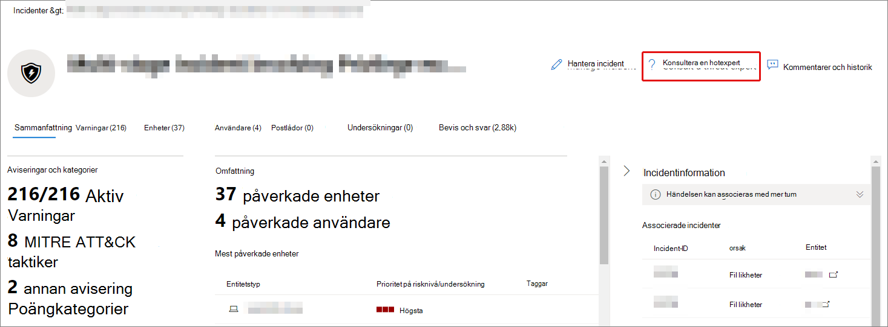

# Konfigurera och hantera Microsoft Threat Experts-funktioner via Microsoft 365 DefenderConfigure and manage Microsoft Threat Experts capabilities through Microsoft 365 Defender

[!INCLUDE [Microsoft 365 Defender rebranding](../includes/microsoft-defender.md)]

**Gäller för:****Applies to:**

- [Microsoft 365 DefenderMicrosoft 365 Defender](https://go.microsoft.com/fwlink/?linkid=2118804)
- [Microsoft Defender för EndpointMicrosoft Defender for Endpoint](https://go.microsoft.com/fwlink/p/?linkid=2146631)

[!INCLUDE [Prerelease](../includes/prerelease.md)]

## Innan du börjarBefore you begin

> [!IMPORTANT]
> Innan du ansöker kontrollerar du att du tar upp behörighetskraven för Microsoft Threat Experts – Targeted Attack Notifications som hanteras av din Microsoft Technical Service-leverantör och ditt kontoteam.Before you apply, make sure to discuss the eligibility requirements for the Microsoft Threat Experts – Targeted Attack Notifications managed threat hunting service with your Microsoft Technical Service provider and account team.

Om du vill ta emot riktade attackmeddelanden måste du ha Microsoft 365 Defender distribuerat med registrerade enheter.To receive targeted attack notifications, you'll need to have Microsoft 365 Defender deployed with devices enrolled. Skicka sedan ett program via M365-portalen för Microsoft Threat Experts – Riktade attackmeddelanden.Then, submit an application through the M365 portal for Microsoft Threat Experts - Targeted Attack Notifications.

Kontakta ditt kontoteam eller din Microsoft-representant för att prenumerera på Microsoft Threat Experts – Experts on Demand.Contact your account team or Microsoft representative to subscribe to Microsoft Threat Experts - Experts on Demand. Med experter på begäran kan du rådgöra med våra hotexperter om hur du skyddar organisationen från relevanta identifieringar och adversaries.Experts on Demand lets you consult with our threat experts on how to protect your organization from relevant detections and adversaries.

## Sök efter Microsoft Threat Experts – riktad tjänst för attackmeddelandenApply for Microsoft Threat Experts - Targeted Attack Notifications service

Om du redan har Microsoft Defender för Endpoint och Microsoft 365 Defender kan du ansöka om Microsoft Threat Experts – Targeted Attack Notifications via Microsoft 365 Defender-portalen.If you already have Microsoft Defender for Endpoint and Microsoft 365 Defender, you can apply for Microsoft Threat Experts – Targeted Attack Notifications through their Microsoft 365 Defender portal.  Riktade attackmeddelanden ger dig särskilda insikter och analyser som hjälper dig att identifiera de viktigaste hoten för din organisation, så att du kan svara på dem snabbt.Targeted attack notifications grant you special insight and analysis to help identify the most critical threats to your organization, so you can respond to them quickly.

1. I navigeringsfönstret går du till Inställningar **> slutpunkter > Allmänna > avancerade > Microsoft Threat Experts – Riktade attackmeddelanden.**From the navigation pane, go to **Settings > Endpoints > General > Advanced features > Microsoft Threat Experts - Targeted Attack Notifications**.

2. Välj **Använd**.Select **Apply**.

    

3. Ange ditt namn och din e-postadress så att Microsoft kan kontakta dig om programmet.Enter your name and email address so that Microsoft can contact you about your application.

    

4. Läs [sekretesspolicyn](https://privacy.microsoft.com/en-us/privacystatement)och välj sedan **Skicka** när du är klar.Read the [privacy statement](https://privacy.microsoft.com/en-us/privacystatement), then select **Submit** when you're done. Du får ett välkomstmeddelande via e-post när din ansökan har godkänts.You'll receive a welcome email once your application is approved.

    

5. När du får välkomstmeddelandet får du automatiskt riktade attackmeddelanden.After you receive your welcome email, you'll automatically start receiving targeted attack notifications.

6. Du kan kontrollera din status genom att gå **till Inställningar > Slutpunkter > Allmänt > Avancerade funktioner.**You can verify your status by visiting **Settings > Endpoints > General > Advanced features**. När den godkänts **kommer Microsoft Threat Experts – Targeted Attack Notification-knappen** att visas och vara **påslagen.**Once approved, the **Microsoft Threat Experts - Targeted Attack Notification** toggle will be visible and switched **On**.

## Var du ser riktade attackmeddelanden från Microsoft Threat ExpertsWhere you'll see the targeted attack notifications from Microsoft Threat Experts

Du kan få riktade attackmeddelanden från Microsoft Threat Experts via följande medium:You can receive targeted attack notification from Microsoft Threat Experts through the following mediums:

- Sidan Incidenter på Microsoft 365 **Defender-portalen**The Microsoft 365 Defender portal's **Incidents** page
- Instrumentpanelen Aviseringar på Microsoft 365 **Defender-portalen**The Microsoft 365 Defender portal's **Alerts** dashboard
- OData-avisering för [API](https://docs.microsoft.com/windows/security/threat-protection/microsoft-defender-atp/get-alerts) och [REST API](https://docs.microsoft.com/windows/security/threat-protection/microsoft-defender-atp/pull-alerts-using-rest-api)OData alerting [API](https://docs.microsoft.com/windows/security/threat-protection/microsoft-defender-atp/get-alerts) and [REST API](https://docs.microsoft.com/windows/security/threat-protection/microsoft-defender-atp/pull-alerts-using-rest-api)
- [DeviceAlertEvents-tabell](https://docs.microsoft.com/windows/security/threat-protection/microsoft-defender-atp/advanced-hunting-devicealertevents-table) i Avancerad sökning[DeviceAlertEvents](https://docs.microsoft.com/windows/security/threat-protection/microsoft-defender-atp/advanced-hunting-devicealertevents-table) table in Advanced hunting
- Din inkorg om du väljer att få riktade attackmeddelanden skickade till dig via e-post.Your inbox, if you choose to have targeted attack notifications sent to you via email. Se Skapa [en regel för e-postavisering](#create-an-email-notification-rule) nedan.See [Create an email notification rule](#create-an-email-notification-rule) below.

### Skapa en regel för e-postaviseringCreate an email notification rule

Du kan skapa regler för att skicka e-postaviseringar för aviseringsmottagare.You can create rules to send email notifications for notification recipients. Fullständig information finns i Konfigurera  [aviseringsmeddelanden för](https://docs.microsoft.com/windows/security/threat-protection/microsoft-defender-atp/configure-email-notifications) att skapa, redigera, ta bort eller felsöka e-postaviseringar.For full details, see  [Configure alert notifications](https://docs.microsoft.com/windows/security/threat-protection/microsoft-defender-atp/configure-email-notifications) to create, edit, delete, or troubleshoot email notification.

## Visa riktade attackmeddelandenView targeted attack notifications

Du kommer att få riktade attackmeddelanden från Microsoft Threat Experts i e-postmeddelandet när du har konfigurerat ditt system för att ta emot e-postaviseringar.You'll start receiving targeted attack notification from Microsoft Threat Experts in your email after you have configured your system to receive email notification.

1. Välj länken i e-postmeddelandet för att gå till motsvarande aviseringskontext i instrumentpanelen som är märkt **med hotexperter.**Select the link in the email to go to the corresponding alert context in the dashboard tagged with **Threat experts**.

2. Välj  samma aviseringsavsnitt på sidan Aviseringar som i e-postmeddelandet om du vill visa mer information.From the **Alerts** page, select the same alert topic as the one you received in the email, to view further details.

## Prenumerera på Microsoft Threat Experts – experter på begäranSubscribe to Microsoft Threat Experts - Experts on Demand

Om du redan är Microsoft Defender för Endpoint-kund kan du kontakta din Microsoft-representant för att prenumerera på Microsoft Threat Experts – Experts on Demand.If you're already a Microsoft Defender for Endpoint customer, you can contact your Microsoft representative to subscribe to Microsoft Threat Experts - Experts on Demand.

## Kontakta en Microsoft-expert om misstänkt cybersäkerhet i din organisationConsult a Microsoft threat expert about suspicious cybersecurity activities in your organization

Du kan kontakta Microsoft Threat Experts inifrån Microsoft 365 Defender-portalen.You can contact Microsoft Threat Experts from inside the Microsoft 365 Defender portal. Experter kan hjälpa dig att förstå komplexa hot och riktade attackmeddelanden.Experts can help you understand complex threats and targeted attack notifications. Samarbeta med experter för mer information om aviseringar och incidenter, eller råd om hantering av komprometteringar.Partner with experts for further details about alerts and incidents, or advice on handling compromise. Få insyn i det hotinformationssammanhang som beskrivs av din portalinstrumentpanel.Gain insight into the threat intelligence context described by your portal dashboard.

> [!NOTE]
>
> - Aviseringsförfrågningar som rör din organisations anpassade hotinformation stöds inte för närvarande.Alert inquiries related to your organization's customized threat intelligence data are not currently supported. Kontakta din säkerhets- eller svarsgrupp för incidenter för mer information.Consult with your security operations or incident response team for details.
> - Du måste ha  behörigheten Hantera säkerhetsinställningar i Säkerhetscenter i Microsoft 365 Defender-portalen för att skicka en förfrågan via Formuläret Konsultera en expert **på** hot.You need to have the **Manage security settings in Security Center** permission in the Microsoft 365 Defender portal to submit an inquiry through the **Consult a threat expert** form.

1. Gå till portalsidan som är relaterad till den information som du vill **undersöka:** till exempel **Enhet,** **Avisering** eller Incident.Navigate to the portal page related to the information that you'd like to investigate: for example, **Device**, **Alert**, or **Incident**. Kontrollera att portalsidan som är relaterad till din förfrågan visas innan du skickar en undersökningsförfrågan.Make sure that the portal page related to your inquiry is in view before you send an investigation request.

2. I den översta menyn väljer du **? Kontakta en hotexpert**.From the top menu, select **? Consult a threat expert**.

    

    En utfälld skärm öppnas.A flyout screen will open.

    Sidhuvudet anger om du använder en utvärderingsprenumeration eller en komplett Microsoft Threat Experts – Experts on-Demand-prenumeration.The header will indicate if you are on a trial subscription, or a full Microsoft Threat Experts - Experts on-Demand subscription.

    

    Fältet **Undersökningsämne** innehåller redan länken till den aktuella sidan för din begäran.The **Investigation topic** field will already be populated with the link to the relevant page for your request.

3. I nästa fält bör du ge Microsoft Threat Experts tillräckligt med information för att starta undersökningen.In the next field, provide enough information to give the Microsoft Threat Experts enough context to start the investigation.

4. Ange den e-postadress som du vill använda för att stämma av med Microsoft Threat Experts.Enter the email address that you'd like to use to correspond with Microsoft Threat Experts.

> [!NOTE]
> Om du vill spåra status för ärenden av den tekniska experten på begäran via Microsoft Services Hub kan du kontakta din tekniska kontohanterare.If you would like to track the status of your Experts on Demand cases through Microsoft Services Hub, reach out to your technical account manager.

Titta på den här videon för en snabb överblick över Microsoft Services-hubben.Watch this video for a quick overview of the Microsoft Services Hub.

> [!VIDEO https://www.microsoft.com/videoplayer/embed/RE4pk9f]

## Exempel på undersökningsavsnittSample investigation topics

### AviseringsinformationAlert information

- Vi såg en ny typ av varning för en binär bo-off-the-land binär.We saw a new type of alert for a living-off-the-land binary. Vi kan ange aviserings-ID:t.We can provide the alert ID. Kan du berätta mer om den här aviseringen och hur vi kan undersöka den ytterligare?Can you tell us more about this alert and how we can investigate it further?
- Vi har observerat två liknande attacker som båda försöker köra skadliga PowerShell-skript men generera olika aviseringar.We've observed two similar attacks, which both try to execute malicious PowerShell scripts but generate different alerts. Den ena är "Misstänkt PowerShell-kommandorad" och den andra är "En skadlig fil upptäcktes baserat på indikering från O365".One is "Suspicious PowerShell command line" and the other is "A malicious file was detected based on indication provided by O365". Vad är skillnaden?What is the difference?
- Vi fick en udda avisering idag om ett felaktigt antal misslyckade inloggningar från en användares enhet.We received an odd alert today about an abnormal number of failed logins from a high profile user’s device. Vi hittar inga ytterligare bevis för försöken.We can't find any further evidence for these attempts. Hur kan Microsoft 365 Defender se de här försöken?How can Microsoft 365 Defender see these attempts? Vilken typ av inloggning övervakas?What type of logins are being monitored?
- Kan du ge mer kontext eller information om aviseringen, "Misstänkt beteende av ett systemverktyg har observerats"?Can you give more context or insight about the alert, "Suspicious behavior by a system utility was observed"?
- Jag har sett en avisering med namnet "Skapande av vidare vidarebefordran/omdirigeringsregel".I observed an alert titled "Creation of forwarding/redirect rule". Jag tror att aktiviteten är sann.I believe the activity is benign. Kan du berätta varför jag fick en avisering?Can you tell me why I received an alert?

### Möjlig datorkomprometteringPossible machine compromise

- Kan du hjälpa dig att förklara varför vi ser ett meddelande eller en avisering om att "okänd process observeras" på många enheter i vår organisation?Can you help explain why we see a message or alert for "Unknown process observed" on many devices in our organization? Vi uppskattar eventuella synpunkter för att klargöra om det här meddelandet eller aviseringen är relaterat till skadlig aktivitet.We appreciate any input to clarify whether this message or alert is related to malicious activity.
- Kan du verifiera en möjlig kompromett på följande system, från förra veckan?Can you help validate a possible compromise on the following system, dating from last week? Det fungerar ungefär som en tidigare identifiering av skadlig programvara på samma system för sex månader sedan.It's behaving similarly as a previous malware detection on the same system six months ago.

### Information om hotinformationThreat intelligence details

- Vi har upptäckt ett nätfiskemeddelande som levererade ett skadligt Word-dokument till en användare.We detected a phishing email that delivered a malicious Word document to a user. Dokumentet orsakade en serie misstänkta händelser, vilket utlöste flera aviseringar för en viss skadlig programvara-familj.The document caused a series of suspicious events, which triggered multiple alerts for a particular malware family. Har du någon information om den här skadlig programvara?Do you have any information on this malware? Om ja, kan du skicka oss en länk?If yes, can you send us a link?
- Vi såg nyligen ett blogginlägg om ett hot som riktar sig till vår bransch.We recently saw a blog post about a threat that is targeting our industry. Kan du hjälpa oss att förstå vilket skydd Microsoft 365 Defender ger mot den här hot aktören?Can you help us understand what protection Microsoft 365 Defender provides against this threat actor?
- Vi har nyligen observerat en nätfiskekampanj som utförts mot vår organisation.We recently observed a phishing campaign conducted against our organization. Kan du tala om för oss om detta var specifikt riktat till vårt företag eller lodrätt?Can you tell us if this was targeted specifically to our company or vertical?

### Aviseringsmeddelanden från Microsoft Threat ExpertsMicrosoft Threat Experts’ alert communications

- Kan ditt svarsteam för incidenter hjälpa oss att hantera det riktade attackmeddelandet vi fick?Can your incident response team help us address the targeted attack notification that we got?
- Vi har fått den här riktade attackmeddelandet från Microsoft Threat Experts.We received this targeted attack notification from Microsoft Threat Experts. Vi har inte vårt eget svarsteam för incidenter.We don’t have our own incident response team. Vad kan vi göra nu och hur kan vi begränsa händelsen?What can we do now, and how can we contain the incident?
- Vi har fått en riktad attackavisering från Microsoft Threat Experts.We received a targeted attack notification from Microsoft Threat Experts. Vilka data kan du ge oss som vi kan skicka till vårt svarsteam för incidenter?What data can you provide to us that we can pass on to our incident response team?

> [!NOTE]
> Microsoft Threat Experts är en hanterad tjänst för hot efter hot och inte en svarstjänst för incidenter.Microsoft Threat Experts is a managed threat hunting service and not an incident response service. Vid behov kan experterna vid behov smidigt gå över undersökningen till TJÄNSTEN Microsoft Cybersecurity Solutions Group (CSG) för tjänsten Detection and Response Team (PHOTOSHOP).However, the experts can seamlessly transition the investigation to Microsoft Cybersecurity Solutions Group (CSG)'s Detection and Response Team (DART) services, when necessary. Du kan också välja att kommunicera med din egen svarsgrupp för incidenter för att åtgärda problem som kräver ett incidentsvar.You can also opt to engage with your own incident response team to address issues that requires an incident response.

## ScenarioScenario

### Få en förloppsrapport om din förfrågan om hanterad förfråganReceive a progress report about your managed hunting inquiry

Svaret från Microsoft Threat Experts varierar beroende på din förfrågan.The response from Microsoft Threat Experts will vary according to your inquiry. I allmänhet får du något av följande svar:You'll generally receive one of the following responses:

- Mer information krävs för att fortsätta med undersökningenMore information is needed to continue with the investigation
- Det krävs en eller flera filexempel för att avgöra det tekniska sammanhangetA file or several file samples are needed to determine the technical context
- Undersökning kräver mer tidInvestigation requires more time
- Den inledande informationen var tillräcklig för att slutföra undersökningenInitial information was enough to conclude the investigation

Om en expert begär mer information eller filprov är det centralt att svara snabbt för att hålla undersökningen igång.If an expert requests more information or file samples, it's crucial to respond quickly to keep the investigation moving.

## Se ävenSee also

- [Översikt över Microsoft Threat ExpertsMicrosoft Threat Experts overview](microsoft-threat-experts.md)
