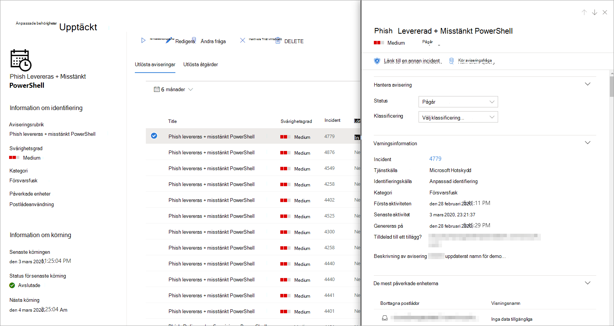

# <a name="create-and-manage-custom-detections-rules"></a><span data-ttu-id="61271-104">Skapa och hantera regler för anpassade identifieringar</span><span class="sxs-lookup"><span data-stu-id="61271-104">Create and manage custom detections rules</span></span>

<span data-ttu-id="61271-105">**Gäller:**</span><span class="sxs-lookup"><span data-stu-id="61271-105">**Applies to:**</span></span>
- <span data-ttu-id="61271-106">Microsofts hotskydd</span><span class="sxs-lookup"><span data-stu-id="61271-106">Microsoft Threat Protection</span></span>

[!INCLUDE [Prerelease information](../includes/prerelease.md)]

<span data-ttu-id="61271-107">Med anpassade identifieringsregler som skapats från [avancerade jaktfrågor](advanced-hunting-overview.md) kan du proaktivt övervaka olika händelser och systemtillstånd, inklusive misstänkt överträdelseaktivitet och felkonfigurerade slutpunkter.</span><span class="sxs-lookup"><span data-stu-id="61271-107">Custom detection rules built from [Advanced hunting](advanced-hunting-overview.md) queries let you proactively monitor various events and system states, including suspected breach activity and misconfigured endpoints.</span></span> <span data-ttu-id="61271-108">Du kan ställa in dem så att de körs med jämna mellanrum, generera aviseringar och vidta svarsåtgärder när det finns matchningar.</span><span class="sxs-lookup"><span data-stu-id="61271-108">You can set them to run at regular intervals, generating alerts and taking response actions whenever there are matches.</span></span>

## <a name="required-permissions-for-managing-custom-detections"></a><span data-ttu-id="61271-109">Nödvändiga behörigheter för att hantera anpassade identifieringar</span><span class="sxs-lookup"><span data-stu-id="61271-109">Required permissions for managing custom detections</span></span>

<span data-ttu-id="61271-110">Om du vill hantera anpassade identifieringar måste du tilldelas en av dessa roller:</span><span class="sxs-lookup"><span data-stu-id="61271-110">To manage custom detections, you need to be assigned one of these roles:</span></span>

- <span data-ttu-id="61271-111">**Säkerhetsadministratör** – säkerhetsadministratören eller säkerhetsadministratörsrollen är en [Azure Active Directory-roll](https://docs.microsoft.com/azure/active-directory/users-groups-roles/directory-assign-admin-roles#security-administrator) för att hantera olika säkerhetsinställningar i Microsoft 365-säkerhetscenter och olika portaler och tjänster.</span><span class="sxs-lookup"><span data-stu-id="61271-111">**Security administrator** — the security administrator or security admin role is an [Azure Active Directory role](https://docs.microsoft.com/azure/active-directory/users-groups-roles/directory-assign-admin-roles#security-administrator) for managing various security settings in Microsoft 365 security center and various portals and services.</span></span>

- <span data-ttu-id="61271-112">**Säkerhetsoperatör** – säkerhetsoperatörsrollen är en [Azure Active Directory-roll](https://docs.microsoft.com/azure/active-directory/users-groups-roles/directory-assign-admin-roles#security-administrator) för att hantera aviseringar och har global skrivskyddad åtkomst på säkerhetsrelaterade funktioner, inklusive all information i Microsoft 365-säkerhetscenter.</span><span class="sxs-lookup"><span data-stu-id="61271-112">**Security operator** —  the security operator role is an [Azure Active Directory role](https://docs.microsoft.com/azure/active-directory/users-groups-roles/directory-assign-admin-roles#security-administrator) for managing alerts and has global read-only access on security-related features, including all information in Microsoft 365 security center.</span></span> <span data-ttu-id="61271-113">Den här rollen är endast tillräcklig för att hantera anpassade identifieringar om rbac (Role-based Access Control) är inaktiverat i Microsoft Defender ATP.</span><span class="sxs-lookup"><span data-stu-id="61271-113">This role is sufficient for managing custom detections only if role-based access control (RBAC) is turned off in Microsoft Defender ATP.</span></span> <span data-ttu-id="61271-114">Om du har konfigurerat RBAC behöver du också behörigheten **hantera säkerhetsinställningar** för Microsoft Defender ATP.</span><span class="sxs-lookup"><span data-stu-id="61271-114">If you have RBAC configured, you also need the **manage security settings** permission for Microsoft Defender ATP.</span></span>

<span data-ttu-id="61271-115">För att hantera nödvändiga behörigheter kan en **global administratör** göra följande:</span><span class="sxs-lookup"><span data-stu-id="61271-115">To manage required permissions, a **global administrator** can do the following:</span></span>

- <span data-ttu-id="61271-116">Tilldela **säkerhetsadministratören** eller **säkerhetsoperatörsrollen** i [Microsoft 365-administrationscentret](https://admin.microsoft.com/) under**Rollsäkerhetsadministratör** **Roles** > .</span><span class="sxs-lookup"><span data-stu-id="61271-116">Assign the **security administrator** or **security operator** role in [Microsoft 365 admin center](https://admin.microsoft.com/) under **Roles** > **Security admin**.</span></span>
- <span data-ttu-id="61271-117">Kontrollera RBAC-inställningarna för Microsoft Defender ATP i [Microsoft Defender Security Center](https://securitycenter.windows.com/) under Roller för **inställningar** > **behörigheter** > **.**</span><span class="sxs-lookup"><span data-stu-id="61271-117">Check RBAC settings for Microsoft Defender ATP in [Microsoft Defender Security Center](https://securitycenter.windows.com/) under **Settings** > **Permissions** > **Roles**.</span></span> <span data-ttu-id="61271-118">Välj motsvarande roll om du vill tilldela behörigheten **hantera säkerhetsinställningar.**</span><span class="sxs-lookup"><span data-stu-id="61271-118">Select the corresponding role to assign the **manage security settings** permission.</span></span>

> [!NOTE]
> <span data-ttu-id="61271-119">För att hantera anpassade identifieringar behöver **säkerhetsoperatörer** behörigheten **hantera säkerhetsinställningar** i Microsoft Defender ATP om RBAC är aktiverat.</span><span class="sxs-lookup"><span data-stu-id="61271-119">To manage custom detections, **security operators** will need the **manage security settings** permission in Microsoft Defender ATP if RBAC is turned on.</span></span>

## <a name="create-a-custom-detection-rule"></a><span data-ttu-id="61271-120">Skapa en anpassad identifieringsregel</span><span class="sxs-lookup"><span data-stu-id="61271-120">Create a custom detection rule</span></span>
### <a name="1-prepare-the-query"></a><span data-ttu-id="61271-121">1. Förbered frågan.</span><span class="sxs-lookup"><span data-stu-id="61271-121">1. Prepare the query.</span></span>

<span data-ttu-id="61271-122">I Microsoft 365 security center går du till **Avancerad jakt** och väljer en befintlig fråga eller skapar en ny fråga.</span><span class="sxs-lookup"><span data-stu-id="61271-122">In Microsoft 365 security center, go to **Advanced hunting** and select an existing query or create a new query.</span></span> <span data-ttu-id="61271-123">När du använder en ny fråga kör du frågan för att identifiera fel och förstå möjliga resultat.</span><span class="sxs-lookup"><span data-stu-id="61271-123">When using a new query, run the query to identify errors and understand possible results.</span></span>

#### <a name="required-columns-in-the-query-results"></a><span data-ttu-id="61271-124">Obligatoriska kolumner i frågeresultatet</span><span class="sxs-lookup"><span data-stu-id="61271-124">Required columns in the query results</span></span>
<span data-ttu-id="61271-125">Om du vill skapa en anpassad identifieringsregel måste frågan returnera följande kolumner:</span><span class="sxs-lookup"><span data-stu-id="61271-125">To create a custom detection rule, the query must return the following columns:</span></span>

- `Timestamp`
- <span data-ttu-id="61271-126">En av följande enhets-, användar- eller postlådekolumner:</span><span class="sxs-lookup"><span data-stu-id="61271-126">One of the following device, user, or mailbox columns:</span></span>
    - `DeviceId`
    - `DeviceName`
    - `RemoteDeviceName`
    - `RecipientEmailAddress`
    - <span data-ttu-id="61271-127">`SenderFromAddress`(kuvertavsändare eller Retursökvägsadress)</span><span class="sxs-lookup"><span data-stu-id="61271-127">`SenderFromAddress` (envelope sender or Return-Path address)</span></span>
    - <span data-ttu-id="61271-128">`SenderMailFromAddress`(avsändaradress visas av e-postklienten)</span><span class="sxs-lookup"><span data-stu-id="61271-128">`SenderMailFromAddress` (sender address displayed by email client)</span></span>
    - `RecipientObjectId`
    - `AccountSid`
    - `InitiatingProcessAccountSid`
    - `InitiatingProcessAccountUpn`
    - `InitiatingProcessAccountObjectId`
>[!NOTE]
><span data-ttu-id="61271-129">Stöd för ytterligare entiteter läggs till när nya tabeller läggs till i det [avancerade jaktschemat](advanced-hunting-schema-tables.md).</span><span class="sxs-lookup"><span data-stu-id="61271-129">Support for additional entities will be added as new tables are added to the [advanced hunting schema](advanced-hunting-schema-tables.md).</span></span>

<span data-ttu-id="61271-130">Enkla frågor, till exempel de som `project` inte `summarize` använder operatorn eller för att anpassa eller aggregera resultat, returnerar vanligtvis dessa vanliga kolumner.</span><span class="sxs-lookup"><span data-stu-id="61271-130">Simple queries, such as those that don't use the `project` or `summarize` operator to customize or aggregate results, typically return these common columns.</span></span>

<span data-ttu-id="61271-131">Det finns olika sätt att se till att mer komplexa frågor returnerar dessa kolumner.</span><span class="sxs-lookup"><span data-stu-id="61271-131">There are various ways to ensure more complex queries return these columns.</span></span> <span data-ttu-id="61271-132">Om du till exempel föredrar att aggregera `DeviceId`och räkna efter `Timestamp` entitet under en kolumn, `DeviceId`till exempel, kan du fortfarande returnera den genom att hämta den från den senaste händelsen som involverar varje unik .</span><span class="sxs-lookup"><span data-stu-id="61271-132">For example, if you prefer to aggregate and count by entity under a column such as `DeviceId`, you can still return `Timestamp` by getting it from the most recent event involving each unique `DeviceId`.</span></span>

<span data-ttu-id="61271-133">Exempelfrågan nedan räknar antalet unika`DeviceId`datorer ( ) med antivirusidentifieringar och använder det här antalet för att bara hitta datorer med mer än fem identifieringar.</span><span class="sxs-lookup"><span data-stu-id="61271-133">The sample query below counts the number of unique machines (`DeviceId`) with antivirus detections and uses this count to find only the machines with more than five detections.</span></span> <span data-ttu-id="61271-134">För att `Timestamp`returnera det `summarize` senaste `arg_max` använder den operatorn med funktionen.</span><span class="sxs-lookup"><span data-stu-id="61271-134">To return the latest `Timestamp`, it uses the `summarize` operator with the `arg_max` function.</span></span>

```kusto
DeviceEvents
| where Timestamp > ago(7d)
| where ActionType == "AntivirusDetection"
| summarize Timestamp = max(Timestamp), count() by DeviceId
| where count_ > 5
```
### <a name="2-create-new-rule-and-provide-alert-details"></a><span data-ttu-id="61271-135">2. Skapa ny regel och ge varningsinformation.</span><span class="sxs-lookup"><span data-stu-id="61271-135">2. Create new rule and provide alert details.</span></span>

<span data-ttu-id="61271-136">Med frågan i frågeredigeraren väljer du **Skapa identifieringsregel** och anger följande varningsinformation:</span><span class="sxs-lookup"><span data-stu-id="61271-136">With the query in the query editor, select **Create detection rule** and specify the following alert details:</span></span>

- <span data-ttu-id="61271-137">**Identifieringsnamn** – namnet på identifieringsregeln</span><span class="sxs-lookup"><span data-stu-id="61271-137">**Detection name** — name of the detection rule</span></span>
- <span data-ttu-id="61271-138">**Frekvens** – intervall för att köra frågan och vidta åtgärder.</span><span class="sxs-lookup"><span data-stu-id="61271-138">**Frequency** — interval for running the query and taking action.</span></span> [<span data-ttu-id="61271-139">Se ytterligare vägledning nedan</span><span class="sxs-lookup"><span data-stu-id="61271-139">See additional guidance below</span></span>](#rule-frequency)
- <span data-ttu-id="61271-140">**Varningstitel** – titel som visas med aviseringar som utlöses av regeln</span><span class="sxs-lookup"><span data-stu-id="61271-140">**Alert title** — title displayed with alerts triggered by the rule</span></span>
- <span data-ttu-id="61271-141">**Allvarlighetsgrad** – potentiell risk för den komponent eller aktivitet som identifierats i regeln</span><span class="sxs-lookup"><span data-stu-id="61271-141">**Severity** — potential risk of the component or activity identified by the rule</span></span>
- <span data-ttu-id="61271-142">**Kategori** – hotkomponent eller hotaktivitet som identifierats i regeln</span><span class="sxs-lookup"><span data-stu-id="61271-142">**Category** — threat component or activity identified by the rule</span></span>
- <span data-ttu-id="61271-143">**MITRE ATT&CK-teknik** – en eller flera angreppstekniker som identifierats i regeln enligt beskrivningen i [MITRE ATT-&CK-ramverket](https://attack.mitre.org/)</span><span class="sxs-lookup"><span data-stu-id="61271-143">**MITRE ATT&CK techniques** — one or more attack techniques identified by the rule as documented in the [MITRE ATT&CK framework](https://attack.mitre.org/)</span></span>
- <span data-ttu-id="61271-144">**Beskrivning** – mer information om den komponent eller aktivitet som identifieras i regeln</span><span class="sxs-lookup"><span data-stu-id="61271-144">**Description** — more information about the component or activity identified by the rule</span></span> 
- <span data-ttu-id="61271-145">**Rekommenderade åtgärder** – ytterligare åtgärder som de som svarar på en avisering</span><span class="sxs-lookup"><span data-stu-id="61271-145">**Recommended actions** — additional actions that responders might take in response to an alert</span></span>

#### <a name="rule-frequency"></a><span data-ttu-id="61271-146">Regelfrekvens</span><span class="sxs-lookup"><span data-stu-id="61271-146">Rule frequency</span></span>
<span data-ttu-id="61271-147">När den sparas körs en ny eller redigerad anpassad identifieringsregel omedelbart och söker efter matchningar från de senaste 30 dagarnas data.</span><span class="sxs-lookup"><span data-stu-id="61271-147">When saved, a new or edited custom detection rule immediately runs and checks for matches from  the past 30 days of data.</span></span> <span data-ttu-id="61271-148">Regeln körs sedan igen med fasta intervall och tillbakablickslängder baserat på den frekvens du väljer:</span><span class="sxs-lookup"><span data-stu-id="61271-148">The rule then runs again at fixed intervals and lookback durations based on the frequency you choose:</span></span>

- <span data-ttu-id="61271-149">**Var 24:e timme** – körs var 24:e timme, kontrollerar data från de senaste 30 dagarna</span><span class="sxs-lookup"><span data-stu-id="61271-149">**Every 24 hours** — runs every 24 hours, checking data from the past 30 days</span></span>
- <span data-ttu-id="61271-150">**Var 12:e timme** – körs var 12:e timme, kontrollerar data från de senaste 24 timmarna</span><span class="sxs-lookup"><span data-stu-id="61271-150">**Every 12 hours** — runs every 12 hours, checking data from the past 24 hours</span></span>
- <span data-ttu-id="61271-151">**Var tredje timme** – körs var tredje timme, kontrollerar data från de senaste 6 timmarna</span><span class="sxs-lookup"><span data-stu-id="61271-151">**Every 3 hours** — runs every 3 hours, checking data from the past 6 hours</span></span>
- <span data-ttu-id="61271-152">**Varje timme** – går varje timme, kontrollerar data från de senaste 2 timmarna</span><span class="sxs-lookup"><span data-stu-id="61271-152">**Every hour** — runs hourly, checking data from the past 2 hours</span></span>

<span data-ttu-id="61271-153">Välj den frekvens som matchar hur nära du vill övervaka identifieringar och tänk på organisationens förmåga att svara på aviseringarna.</span><span class="sxs-lookup"><span data-stu-id="61271-153">Select the frequency that matches how closely you want to monitor detections, and consider your organization's capacity to respond to the alerts.</span></span>

### <a name="3-choose-the-impacted-entities"></a><span data-ttu-id="61271-154">3. Välj de påverkade enheterna.</span><span class="sxs-lookup"><span data-stu-id="61271-154">3. Choose the impacted entities.</span></span>
<span data-ttu-id="61271-155">Identifiera kolumnerna i frågeresultaten där du förväntar dig att hitta de viktigaste berörda eller påverkade entiteten.</span><span class="sxs-lookup"><span data-stu-id="61271-155">Identify the columns in your query results where you expect to find the main affected or impacted entity.</span></span> <span data-ttu-id="61271-156">En fråga kan till exempel`SenderFromAddress` returnera `SenderMailFromAddress`avsändaradresser ( eller ) och mottagare (`RecipientEmailAddress`).</span><span class="sxs-lookup"><span data-stu-id="61271-156">For example, a query might return sender (`SenderFromAddress` or `SenderMailFromAddress`) and recipient (`RecipientEmailAddress`) addresses.</span></span> <span data-ttu-id="61271-157">Identifiera vilka av dessa kolumner som representerar de viktigaste påverkade entiteten hjälper tjänsten att aggregera relevanta aviseringar, korrelera incidenter och målsvarsåtgärder.</span><span class="sxs-lookup"><span data-stu-id="61271-157">Identifying which of these columns represent the main impacted entity helps the service aggregate relevant alerts, correlate incidents, and target response actions.</span></span>

<span data-ttu-id="61271-158">Du kan bara välja en kolumn för varje entitetstyp (postlåda, användare eller enhet).</span><span class="sxs-lookup"><span data-stu-id="61271-158">You can select only one column for each entity type (mailbox, user, or device).</span></span> <span data-ttu-id="61271-159">Kolumner som inte returneras av frågan kan inte markeras.</span><span class="sxs-lookup"><span data-stu-id="61271-159">Columns that are not returned by your query can't be selected.</span></span>

### <a name="3-specify-actions-on-files-or-machines"></a><span data-ttu-id="61271-160">3. Ange åtgärder på filer eller datorer.</span><span class="sxs-lookup"><span data-stu-id="61271-160">3. Specify actions on files or machines.</span></span>
<span data-ttu-id="61271-161">Din anpassade identifieringsregel kan automatiskt vidta åtgärder på filer eller datorer som returneras av frågan.</span><span class="sxs-lookup"><span data-stu-id="61271-161">Your custom detection rule can automatically take actions on files or machines that are returned by the query.</span></span>

#### <a name="actions-on-machines"></a><span data-ttu-id="61271-162">Åtgärder på maskiner</span><span class="sxs-lookup"><span data-stu-id="61271-162">Actions on machines</span></span>
<span data-ttu-id="61271-163">Dessa åtgärder tillämpas på `DeviceId` datorer i kolumnen i frågeresultaten:</span><span class="sxs-lookup"><span data-stu-id="61271-163">These actions are applied to machines in the `DeviceId` column of the query results:</span></span>
- <span data-ttu-id="61271-164">**Isolera datorn** – använder Microsoft Defender ATP för att tillämpa fullständig nätverksisolering, vilket förhindrar att datorn ansluter till alla program eller tjänster.</span><span class="sxs-lookup"><span data-stu-id="61271-164">**Isolate machine** — uses Microsoft Defender ATP to apply full network isolation, preventing the machine from connecting to any application or service.</span></span> [<span data-ttu-id="61271-165">Läs mer om isolering av Microsoft Defender ATP-datorer</span><span class="sxs-lookup"><span data-stu-id="61271-165">Learn more about Microsoft Defender ATP machine isolation</span></span>](https://docs.microsoft.com/windows/security/threat-protection/microsoft-defender-atp/respond-machine-alerts#isolate-machines-from-the-network)
- <span data-ttu-id="61271-166">**Samla in undersökningspaket** – samlar in maskininformation i en ZIP-fil.</span><span class="sxs-lookup"><span data-stu-id="61271-166">**Collect investigation package** — collects machine information in a ZIP file.</span></span> [<span data-ttu-id="61271-167">Läs mer om microsoft Defender ATP-undersökningspaketet</span><span class="sxs-lookup"><span data-stu-id="61271-167">Learn more about the Microsoft Defender ATP investigation package</span></span>](https://docs.microsoft.com/windows/security/threat-protection/microsoft-defender-atp/respond-machine-alerts#collect-investigation-package-from-machines)
- <span data-ttu-id="61271-168">**Kör antivirussökning** – utför en fullständig Windows Defender Antivirus-genomsökning på datorn</span><span class="sxs-lookup"><span data-stu-id="61271-168">**Run antivirus scan** — performs a full Windows Defender Antivirus scan on the machine</span></span>
- <span data-ttu-id="61271-169">**Inleder utredning** – inleder en [automatiserad utredning](mtp-autoir.md) av maskinen</span><span class="sxs-lookup"><span data-stu-id="61271-169">**Initiate investigation** — initiates an [automated investigation](mtp-autoir.md) on the machine</span></span>

#### <a name="actions-on-files"></a><span data-ttu-id="61271-170">Åtgärder på filer</span><span class="sxs-lookup"><span data-stu-id="61271-170">Actions on files</span></span>
<span data-ttu-id="61271-171">När det här alternativet är markerat `SHA1`utförs `InitiatingProcessSHA1` `SHA256` `InitiatingProcessSHA256` **karantänfilåtgärden** på filer i , , eller kolumnen i frågeresultaten.</span><span class="sxs-lookup"><span data-stu-id="61271-171">When selected, the **Quarantine file** action is taken on files in the `SHA1`, `InitiatingProcessSHA1`, `SHA256`, or `InitiatingProcessSHA256` column of the query results.</span></span> <span data-ttu-id="61271-172">Den här åtgärden tar bort filen från den aktuella platsen och placerar en kopia i karantän.</span><span class="sxs-lookup"><span data-stu-id="61271-172">This action deletes the file from its current location and places a copy in quarantine.</span></span>

> [!NOTE]
> <span data-ttu-id="61271-173">Tillåt- eller blockeringsåtgärder för anpassade identifieringsregler stöds för närvarande inte på Microsoft Threat Protection.</span><span class="sxs-lookup"><span data-stu-id="61271-173">The allow or block action for custom detection rules is currently not supported on Microsoft Threat Protection.</span></span>

### <a name="4-set-the-rule-scope"></a><span data-ttu-id="61271-174">4. Ställ in regelomfattningen.</span><span class="sxs-lookup"><span data-stu-id="61271-174">4. Set the rule scope.</span></span>
<span data-ttu-id="61271-175">Ange omfånget för att ange vilka enheter som omfattas av regeln.</span><span class="sxs-lookup"><span data-stu-id="61271-175">Set the scope to specify which devices are covered by the rule.</span></span> <span data-ttu-id="61271-176">Omfattningen påverkar regler som kontrollerar enheter och påverkar inte regler som bara kontrollerar postlådor och användarkonton eller identiteter.</span><span class="sxs-lookup"><span data-stu-id="61271-176">The scope influences rules that check devices and doesn't affect rules that check only mailboxes and user accounts or identities.</span></span>

<span data-ttu-id="61271-177">När du ställer in scopet kan du välja:</span><span class="sxs-lookup"><span data-stu-id="61271-177">When setting the scope, you can select:</span></span>

- <span data-ttu-id="61271-178">Alla enheter</span><span class="sxs-lookup"><span data-stu-id="61271-178">All devices</span></span>
- <span data-ttu-id="61271-179">Specifika enhetsgrupper</span><span class="sxs-lookup"><span data-stu-id="61271-179">Specific device groups</span></span>

<span data-ttu-id="61271-180">Endast data från enheter i omfånget kommer att efterfrågas.</span><span class="sxs-lookup"><span data-stu-id="61271-180">Only data from devices in scope will be queried.</span></span> <span data-ttu-id="61271-181">Dessutom kommer åtgärder endast att vidtas på dessa enheter.</span><span class="sxs-lookup"><span data-stu-id="61271-181">Also, actions will be taken only on those devices.</span></span>

### <a name="5-review-and-turn-on-the-rule"></a><span data-ttu-id="61271-182">5. Granska och slå på regeln.</span><span class="sxs-lookup"><span data-stu-id="61271-182">5. Review and turn on the rule.</span></span>
<span data-ttu-id="61271-183">När du har granskat regeln klickar du på **Skapa** för att spara den.</span><span class="sxs-lookup"><span data-stu-id="61271-183">After reviewing the rule, click **Create** to save it.</span></span> <span data-ttu-id="61271-184">Den anpassade identifieringsregeln körs omedelbart.</span><span class="sxs-lookup"><span data-stu-id="61271-184">The custom detection rule immediately runs.</span></span> <span data-ttu-id="61271-185">Den körs igen baserat på konfigurerad frekvens för att söka efter matchningar, generera aviseringar och vidta svarsåtgärder.</span><span class="sxs-lookup"><span data-stu-id="61271-185">It runs again based on configured frequency to check for matches, generate alerts, and take response actions.</span></span>

## <a name="manage-existing-custom-detection-rules"></a><span data-ttu-id="61271-186">Hantera befintliga anpassade identifieringsregler</span><span class="sxs-lookup"><span data-stu-id="61271-186">Manage existing custom detection rules</span></span>
<span data-ttu-id="61271-187">Du kan visa listan över befintliga anpassade identifieringsregler, kontrollera deras tidigare körningar och granska de aviseringar som de har utlöst.</span><span class="sxs-lookup"><span data-stu-id="61271-187">You can view the list of existing custom detection rules, check their previous runs, and review the alerts they have triggered.</span></span> <span data-ttu-id="61271-188">Du kan också köra en regel på begäran och ändra den.</span><span class="sxs-lookup"><span data-stu-id="61271-188">You can also run a rule on demand and modify it.</span></span>

### <a name="view-existing-rules"></a><span data-ttu-id="61271-189">Visa befintliga regler</span><span class="sxs-lookup"><span data-stu-id="61271-189">View existing rules</span></span>

<span data-ttu-id="61271-190">Om du vill visa alla befintliga anpassade identifieringsregler navigerar du till **Jakt** > **anpassade identifieringar**.</span><span class="sxs-lookup"><span data-stu-id="61271-190">To view all existing custom detection rules, navigate to **Hunting** > **Custom detections**.</span></span> <span data-ttu-id="61271-191">På sidan visas alla regler med följande körinformation:</span><span class="sxs-lookup"><span data-stu-id="61271-191">The page lists all the rules with the following run information:</span></span>

- <span data-ttu-id="61271-192">**Senaste körningen** – när en regel senast kördes för att söka efter frågematchningar och generera aviseringar</span><span class="sxs-lookup"><span data-stu-id="61271-192">**Last run** — when a rule was last run to check for query matches and generate alerts</span></span>
- <span data-ttu-id="61271-193">**Senaste körningsstatus** – om en regel har körts</span><span class="sxs-lookup"><span data-stu-id="61271-193">**Last run status** — whether a rule ran successfully</span></span>
- <span data-ttu-id="61271-194">**Nästa körning** – nästa schemalagda körning</span><span class="sxs-lookup"><span data-stu-id="61271-194">**Next run** — the next scheduled run</span></span>
- <span data-ttu-id="61271-195">**Status** – om en regel har aktiverats eller inaktiverats</span><span class="sxs-lookup"><span data-stu-id="61271-195">**Status** — whether a rule has been turned on or off</span></span>

### <a name="view-rule-details-modify-rule-and-run-rule"></a><span data-ttu-id="61271-196">Visa regelinformation, ändra regel och kör regel</span><span class="sxs-lookup"><span data-stu-id="61271-196">View rule details, modify rule, and run rule</span></span>

<span data-ttu-id="61271-197">Om du vill visa omfattande information om en anpassad identifieringsregel väljer du namnet på regeln i listan över regler i **Jakt** > **anpassade identifieringar**.</span><span class="sxs-lookup"><span data-stu-id="61271-197">To view comprehensive information about a custom detection rule, select the name of rule from the list of rules in **Hunting** > **Custom detections**.</span></span> <span data-ttu-id="61271-198">Då öppnas en sida om den anpassade identifieringsregeln med allmän information om regeln, inklusive information om aviseringen, körstatusen och scopet.</span><span class="sxs-lookup"><span data-stu-id="61271-198">This opens a page about the custom detection rule with general information about the rule, including the details of the alert, run status, and scope.</span></span> <span data-ttu-id="61271-199">Den innehåller också en lista över utlösta aviseringar och utlösta åtgärder.</span><span class="sxs-lookup"><span data-stu-id="61271-199">It also provides the list of triggered alerts and triggered actions.</span></span>

<span data-ttu-id="61271-200"></span><span class="sxs-lookup"><span data-stu-id="61271-200"></span></span><br>
<span data-ttu-id="61271-201">*Information om anpassad identifieringsregel*</span><span class="sxs-lookup"><span data-stu-id="61271-201">*Custom detection rule details*</span></span>

<span data-ttu-id="61271-202">Du kan också vidta följande åtgärder på regeln från den här sidan:</span><span class="sxs-lookup"><span data-stu-id="61271-202">You can also take the following actions on the rule from this page:</span></span>

- <span data-ttu-id="61271-203">**Kör** – kör regeln omedelbart.</span><span class="sxs-lookup"><span data-stu-id="61271-203">**Run** — run the rule immediately.</span></span> <span data-ttu-id="61271-204">Detta återställer också intervallet för nästa körning.</span><span class="sxs-lookup"><span data-stu-id="61271-204">This also resets the interval for the next run.</span></span>
- <span data-ttu-id="61271-205">**Redigera** – ändra regeln utan att ändra frågan</span><span class="sxs-lookup"><span data-stu-id="61271-205">**Edit** — modify the rule without changing the query</span></span>
- <span data-ttu-id="61271-206">**Ändra fråga** – redigera frågan i avancerad jakt</span><span class="sxs-lookup"><span data-stu-id="61271-206">**Modify query** — edit the query in advanced hunting</span></span>
- <span data-ttu-id="61271-207">**Aktivera**Inaktivera – aktivera regeln eller stoppa den från att köras**Turn off**  / </span><span class="sxs-lookup"><span data-stu-id="61271-207">**Turn on** / **Turn off** — enable the rule or stop it from running</span></span>
- <span data-ttu-id="61271-208">**Ta bort** – inaktivera regeln och ta bort den</span><span class="sxs-lookup"><span data-stu-id="61271-208">**Delete** — turn off the rule and remove it</span></span>

### <a name="view-and-manage-triggered-alerts"></a><span data-ttu-id="61271-209">Visa och hantera utlösta aviseringar</span><span class="sxs-lookup"><span data-stu-id="61271-209">View and manage triggered alerts</span></span>

<span data-ttu-id="61271-210">På skärmen Regelinformation (**Jakt** > **anpassade identifieringar** > **[Regelnamn]**) går du till **Utlösta aviseringar** för att visa listan över aviseringar som genereras av matchningar till regeln.</span><span class="sxs-lookup"><span data-stu-id="61271-210">In the rule details screen (**Hunting** > **Custom detections** > **[Rule name]**), go to **Triggered alerts** to view the list of alerts generated by matches to the rule.</span></span> <span data-ttu-id="61271-211">Välj en avisering om du vill visa detaljerad information om aviseringen och vidta följande åtgärder för den aviseringen:</span><span class="sxs-lookup"><span data-stu-id="61271-211">Select an alert to view detailed information about that alert and take the following actions on that alert:</span></span>

- <span data-ttu-id="61271-212">Hantera aviseringen genom att ange dess status och klassificering (sann eller falsk avisering)</span><span class="sxs-lookup"><span data-stu-id="61271-212">Manage the alert by setting its status and classification (true or false alert)</span></span>
- <span data-ttu-id="61271-213">Länka aviseringen till en incident</span><span class="sxs-lookup"><span data-stu-id="61271-213">Link the alert to an incident</span></span>
- <span data-ttu-id="61271-214">Kör frågan som utlöste aviseringen vid avancerad jakt</span><span class="sxs-lookup"><span data-stu-id="61271-214">Run the query that triggered the alert on advanced hunting</span></span>

### <a name="review-actions"></a><span data-ttu-id="61271-215">Granska åtgärder</span><span class="sxs-lookup"><span data-stu-id="61271-215">Review actions</span></span>
<span data-ttu-id="61271-216">På skärmen Regelinformation (**Hunting** > **Custom detections** > **[Rule name]**) går du till **Utlösta åtgärder** för att visa listan över åtgärder som vidtagits baserat på matchningar till regeln.</span><span class="sxs-lookup"><span data-stu-id="61271-216">In the rule details screen (**Hunting** > **Custom detections** > **[Rule name]**), go to **Triggered actions** to view the list of actions taken based on matches to the rule.</span></span>

>[!TIP]
><span data-ttu-id="61271-217">Om du snabbt vill visa information och vidta åtgärder för ett objekt i en tabell använder du markeringskolumnen [&#10003;] till vänster i tabellen.</span><span class="sxs-lookup"><span data-stu-id="61271-217">To quickly view information and take action on an item in a table, use the selection column [&#10003;] at the left of the table.</span></span>

## <a name="related-topic"></a><span data-ttu-id="61271-218">Relaterat ämne</span><span class="sxs-lookup"><span data-stu-id="61271-218">Related topic</span></span>
- [<span data-ttu-id="61271-219">Översikt över anpassade identifieringar</span><span class="sxs-lookup"><span data-stu-id="61271-219">Custom detections overview</span></span>](custom-detections-overview.md)
- [<span data-ttu-id="61271-220">Avancerad jaktöversikt</span><span class="sxs-lookup"><span data-stu-id="61271-220">Advanced hunting overview</span></span>](advanced-hunting-overview.md)
- [<span data-ttu-id="61271-221">Lär dig det avancerade jaktfrågespråket</span><span class="sxs-lookup"><span data-stu-id="61271-221">Learn the advanced hunting query language</span></span>](advanced-hunting-query-language.md)
