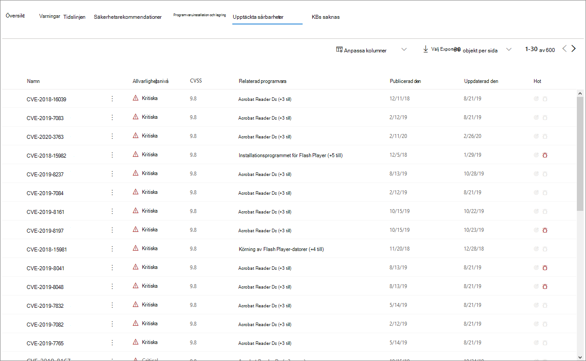

# Sidan Enhetsprofil

Microsoft 365-säkerhetsportalen ger dig enhetsprofilsidor, så att du snabbt kan bedöma hälsotillståndet och statusen för enheter i nätverket.

> [!IMPORTANT]
> Enhetsprofilsidan kan se lite annorlunda ut, beroende på om enheten är registrerad i Microsoft Defender ATP, Azure ATP eller båda.

Om enheten är registrerad i Microsoft Defender ATP kan du också använda enhetsprofilsidan för att utföra några vanliga säkerhetsuppgifter.

## Navigera på enhetsprofilsidan

Profilsidan är uppdelad i flera breda avsnitt.

Sidofältet (1) listar grundläggande detaljer om enheten.

Huvudinnehållsområdet (2) innehåller flikar som du kan växla igenom för att visa olika typer av information om enheten.

Om enheten är registrerad i Microsoft Defender ATP visas också en lista över svarsåtgärder (3). Med svarsåtgärder kan du utföra vanliga säkerhetsrelaterade uppgifter.

## Sidofältet

Bredvid huvudinnehållsområdet på enhetens profilsida finns sidofältet.

Sidofältet listar enhetens fullständiga namn och exponeringsnivå. Det ger också några viktiga grundläggande information i små underavsnitt som kan växlas öppna eller stängda, till exempel:

* **Taggar** – Alla Microsoft Defender ATP-, Azure ATP- eller anpassade taggar som är associerade med enheten. Taggar från Azure ATP kan inte redigeras.
* **Säkerhetsinformation** - Öppna incidenter och aktiva aviseringar. Enheter som är registrerade i Microsoft Defender ATP visar också exponeringsnivå och risknivå.

> [!TIP]
> Exponeringsnivån relaterar till hur mycket enheten följer säkerhetsrekommendationer, medan risknivån beräknas baserat på ett antal faktorer, inklusive typer och allvarlighetsgrad för aktiva aviseringar.

* **Enhetsinformation** - Domän, OS, tidsstämpel för när enheten först sågs, IP-adresser, resurser. Enheter som är registrerade i Microsoft Defender ATP visar också hälsotillstånd. Enheter som registrerats i Azure ATP visar SAM-namn och en tidsstämpel för när enheten först skapades.
* **Nätverksaktivitet** - Tidsstämplar för första gången och sista gången enheten sågs i nätverket.
* **Katalogdata** (*endast för enheter som är registrerade i Azure ATP*) - [UAC-flaggor,](https://docs.microsoft.com/windows/security/identity-protection/user-account-control/user-account-control-overview) [SPN](https://docs.microsoft.com/windows/win32/ad/service-principal-names)och gruppmedlemskap.

## Svarsåtgärder

Svarsåtgärder erbjuder ett snabbt sätt att försvara sig mot och analysera hot.

> [!IMPORTANT]
> * [Svarsåtgärder](https://docs.microsoft.com/windows/security/threat-protection/microsoft-defender-atp/respond-machine-alerts) är endast tillgängliga om enheten är registrerad i Microsoft Defender ATP.
> * Enheter som är registrerade i Microsoft Defender ATP kan visa olika antal svarsåtgärder, baserat på enhetens operativsystem och versionsnummer.

Åtgärder som är tillgängliga på enhetens profilsida är:

* **Hantera taggar** – Uppdaterar anpassade taggar som du har använt på den här enheten.
* **Isolera enheten** – isolerar enheten från organisationens nätverk samtidigt som den är ansluten till Microsoft Defender Advanced Threat Protection. Du kan välja att låta Outlook, Teams och Skype för företag köras medan enheten är isolerad, i kommunikationssyfte.
* **Åtgärdscenter** - Visa status för inskickade åtgärder. Endast tillgänglig om en annan åtgärd redan har valts.
* **Begränsa appkörning** - Förhindrar att program som inte är signerade av Microsoft körs.
* **Kör antivirussökning** - Uppdaterar Windows Defender Antivirus definitioner och omedelbart kör en antivirussökning. Välj mellan Snabbsökning eller Fullständig genomsökning.
* **Samla in undersökningspaket** - Samlar in information om enheten. När undersökningen är klar kan du hämta den.
* **Initiera live-svarssession** - Laddar ett fjärrskal på enheten för [djupgående säkerhetsutredningar](https://docs.microsoft.com/windows/security/threat-protection/microsoft-defender-atp/live-response).
* **Initiera automatisk undersökning** - [Undersöker och åtgärdar automatiskt hot](https://docs.microsoft.com/microsoft-365/security/office-365-security/office-365-air). Även om du manuellt kan utlösa automatiska undersökningar för att köras från den här sidan utlöser [vissa varningsprinciper](https://docs.microsoft.com/microsoft-365/compliance/alert-policies?view=o365-worldwide#default-alert-policies) automatiska undersökningar på egen hand.
* **Åtgärdscenter** - Visar information om eventuella svarsåtgärder som körs för tillfället.

## Avsnittet Flikar

Med enhetsprofilflikarna kan du växla igenom en översikt över säkerhetsinformation om enheten och tabeller som innehåller en lista med aviseringar.

Enheter som är registrerade i Microsoft Defender ATP visar också flikar som har en tidslinje, en lista över säkerhetsrekommendationer, en programvaruinventering, en lista över upptäckta säkerhetsproblem och saknade KBs (säkerhetsuppdateringar).

### Fliken Översikt

Standardfliken är **Översikt**. Det ger en snabb titt på det viktigaste säkerhetsfaktat om enheten.

Här kan du få en snabb titt på enhetens aktiva aviseringar och alla som för närvarande är inloggade på användare.

Om enheten är registrerad i Microsoft Defender ATP ser du även enhetens risknivå och alla tillgängliga data om säkerhetsbedömningar. Säkerhetsbedömningarna beskriver enhetens exponeringsnivå, ger säkerhetsrekommendationer och listar programvara som påverkas och upptäcker sårbarheter.

### Fliken Aviseringar

Fliken **Aviseringar** innehåller en lista över aviseringar som har höjts på enheten, från både Azure ATP och Microsoft Defender ATP.

Du kan anpassa antalet objekt som visas, samt vilka kolumner som visas för varje objekt. Standardbeteendet är att lista trettio objekt per sida.

Kolumnerna på den här fliken innehåller information om allvarlighetsgraden för det hot som utlöste aviseringen, samt status, undersökningstillstånd och vem aviseringen har tilldelats.

Kolumnen *påverkade entiteter* refererar till den enhet (entitet) vars profil du för närvarande visar, plus alla andra enheter i nätverket som påverkas.

Om du väljer ett objekt i den här listan öppnas ett utfällbart objekt som innehåller ännu mer information om den valda aviseringen.

Den här listan kan filtreras efter allvarlighetsgrad, status eller vem aviseringen har tilldelats.

### Fliken Tidslinje

Fliken **Tidslinje** innehåller ett interaktivt, kronologiskt diagram över alla händelser som utlöses på enheten. Genom att flytta det markerade området i diagrammet åt vänster eller höger kan du visa händelser över olika tidsperioder. Du kan också välja ett anpassat datumintervall från rullgardinsmenyn mellan det interaktiva diagrammet och listan över händelser.

Nedanför diagrammet finns en lista över händelser för det valda datumintervallet.

Antalet objekt som visas och kolumnerna i listan kan båda anpassas. Standardkolumnerna listar händelsetid, aktiv användare, åtgärdstyp, entiteter (processer) och ytterligare information om händelsen.

Om du väljer ett objekt i den här listan öppnas ett utfällbart objekt som visar ett diagram över en entiteter för händelser som visar de överordnade och underordnade processer som är involverade i händelsen.

Listan kan filtreras efter den specifika typen av händelse. till exempel registerhändelser eller smartskärmshändelser.

Listan kan också exporteras till en CSV-fil, för nedladdning. Även om filen inte begränsas av antalet händelser, är det maximala tidsintervallet du kan välja att exportera sju dagar.

### Fliken Säkerhetsrekommendationer

På fliken **Säkerhetsrekommendationer** visas åtgärder som du kan vidta för att skydda enheten. Om du väljer ett objekt i den här listan öppnas ett utfällbart objekt där du kan få instruktioner om hur du tillämpar rekommendationen.

Precis som med föregående flikar kan antalet objekt som visas per sida, samt vilka kolumner som är synliga, anpassas.

Standardvyn innehåller kolumner som beskriver de säkerhetsbrister som åtgärdats, det associerade hotet, den relaterade komponenten eller programvaran som påverkas av hotet med mera. Artiklar kan filtreras efter rekommendationens status.

### Inventering av programvara

På fliken **Programvaruinventering** visas programvara som är installerad på enheten.

Standardvyn visar programvaruleverantören, installerat versionsnummer, antal kända programvarubrister, hotinsikter, produktkod och taggar. Antalet objekt som visas och vilka kolumner som visas kan båda anpassas.

Om du väljer ett objekt från den här listan öppnas ett utfällbart objekt som innehåller mer information om den valda programvaran, samt sökvägen och tidsstämpeln för den senaste gången programvaran hittades.

Den här listan kan filtreras efter produktkod.

### Fliken Upptäckta säkerhetsproblem

På fliken **Identifierade säkerhetsproblem** visas alla vanliga sårbarheter och är änder (CVE) som kan påverka enheten.

Standardvyn visar allvarlighetsgraden för CVE, CVS (Common Vulnerability Score), programvaran som är relaterad till CVE, när CVE publicerades, när CVE senast uppdaterades och hot som är associerade med CVE.

Precis som med föregående flikar kan antalet objekt som visas och vilka kolumner som är synliga anpassas.

Om du väljer ett objekt i den här listan öppnas ett utfällbart objekt som beskriver CVE.

### KBs saknas

På fliken **Saknade KBs** visas alla Microsoft-uppdateringar som ännu inte har tillämpats på enheten. De "KBs" i fråga är [Knowledge Base artiklar](https://support.microsoft.com/help/242450/how-to-query-the-microsoft-knowledge-base-by-using-keywords-and-query) som beskriver dessa uppdateringar; till exempel [KB4551762](https://support.microsoft.com/help/4551762/windows-10-update-kb4551762).

Standardvyn visar bulletinen som innehåller uppdateringar, OS-version, berörda produkter, CVEs-adresserade, KB-numret och taggarna.

Antalet objekt som visas per sida och vilka kolumner som visas kan anpassas.

Om du väljer ett objekt öppnas ett utfällbart objekt som länkar till uppdateringen.

## Relaterade ämnen

* [Översikt över Microsofts hotskydd](microsoft-threat-protection.md)
* [Aktivera Microsoft Threat Protection](mtp-enable.md)
* [Undersöka entiteter på enheter med hjälp av live-svar](https://docs.microsoft.com/windows/security/threat-protection/microsoft-defender-atp/live-response)
* [Automatisk undersökning och svar (AIR) i Office 365](https://docs.microsoft.com/microsoft-365/security/office-365-security/office-365-air)
