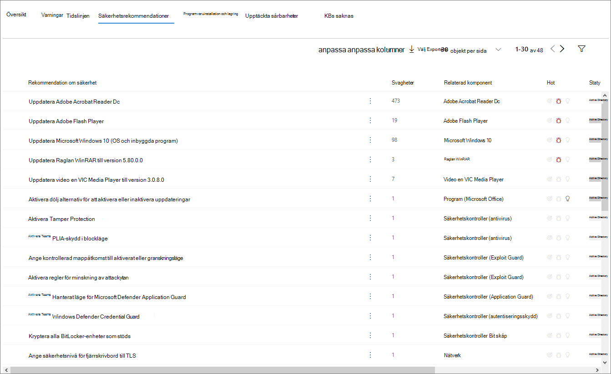

# Profilsida för enhet

[!INCLUDE [Microsoft 365 Defender rebranding](../includes/microsoft-defender.md)]

På Microsoft 365-säkerhetsportalen får du sidor med enhetsprofil så att du snabbt kan bedöma hälsotillståndet och status för enheter i nätverket.

> [!IMPORTANT]
> Sidan med enhetsprofilen kan se något annorlunda ut beroende på om enheten är registrerad i Microsoft Defender för Endpoint, Microsoft Defender för identitet eller båda.

Om enheten är registrerad i Microsoft Defender för Endpoint kan du också använda sidan med enhetsprofilen till att utföra några vanliga säkerhetsuppgifter.

## Navigera på enhetens profilsida

Profilsidan är uppdelad i flera breda avsnitt.

I sidofältet (1) finns grundläggande information om enheten.

Huvudinnehållsområdet (2) innehåller flikar som du kan växla mellan för att visa olika typer av information om enheten.

Om enheten är registrerad i Microsoft Defender för Endpoint visas även en lista över svarsåtgärder (3). Med svarsåtgärder kan du utföra vanliga säkerhetsrelaterade uppgifter.

## Sidofält

Bredvid huvudinnehållsområdet på enhetens profilsida finns sidofältet.

I sidofältet visas enhetens fullständiga namn och exponeringsnivå. Den innehåller även viktig grundläggande information i små delavsnitt som kan vara öppna eller stängda, till exempel:

* **Taggar** – Alla Microsoft Defender för Slutpunkt, Microsoft Defender för identitet eller anpassade taggar som är kopplade till enheten. Taggar från Microsoft Defender för identitet kan inte redigeras.
* **Säkerhetsinformation** – Öppna incidenter och aktiva aviseringar. Enheter som är registrerade i Microsoft Defender för Endpoint visar också exponeringsnivå och risknivå.

> [!TIP]
> Exponeringsnivån relaterar till hur mycket enheten uppfyller säkerhetsrekommendationer, medan risknivån beräknas utifrån ett antal faktorer, inklusive typer och allvarlighetsgrad för aktiva varningar.

* **Enhetsinformation** – domän, OS, tidsstämpel för när enheten först sågs, IP-adresser, resurser. Enheter som är registrerade i Microsoft Defender för Slutpunkt visar även hälsotillstånd. Enheter som är registrerade i Microsoft Defender för identitet visar SAM-namn och en tidsstämpel för när enheten skapades första gången.
* **Nätverksaktivitet** – Tidsstämplar för första och senaste gången enheten sågs i nätverket.
* **Katalogdata** *(endast för enheter som är registrerade* i Microsoft Defender för identitet) – [UAC-flaggor,](https://docs.microsoft.com/windows/security/identity-protection/user-account-control/user-account-control-overview) [SPN:er](https://docs.microsoft.com/windows/win32/ad/service-principal-names)och gruppmedlemskap.

## Svarsåtgärder

Svarsåtgärder är ett snabbt sätt att försvara sig mot och analysera hot.

> [!IMPORTANT]
> * [Svarsåtgärder](https://docs.microsoft.com/windows/security/threat-protection/microsoft-defender-atp/respond-machine-alerts) är bara tillgängliga om enheten är registrerad i Microsoft Defender för Slutpunkt.
> * Enheter som är registrerade i Microsoft Defender för Endpoint kan visa olika antal svarsåtgärder, baserat på enhetens operativsystem och versionsnummer.

Åtgärder som är tillgängliga på enhetens profilsida är:

* **Hantera taggar** – Uppdaterar anpassade taggar som du har tillämpat på den här enheten.
* **Identifiera enhet** – Isolerar enheten från organisationens nätverk samtidigt som den är ansluten till Microsoft Defender för Endpoint. Du kan välja att tillåta att Outlook, Teams och Skype för företag körs medan enheten är isolerad, i kommunikationssyfte.
* **Åtgärdscenter** – visa status för skickade åtgärder. Endast tillgängligt om en annan åtgärd redan har valts.
* **Begränsa programkörning** – Förhindrar att program som inte är signerade av Microsoft körs.
* **Kör antivirussökning** – Uppdaterar definitioner för Windows Defender Antivirus och kör omedelbart en antivirussökning. Välj mellan Snabbsökning eller Fullständig sökning.
* **Samla in undersökningspaket** – Samlar in information om enheten. När undersökningen har slutförts kan du ladda ned den.
* **Starta Live Response-session** – Läser in ett fjärrgränssnitt på enheten [för ingående säkerhetsundersökning.](https://docs.microsoft.com/windows/security/threat-protection/microsoft-defender-atp/live-response)
* **Initiera automatisk undersökning** – [undersöker och åtgärdar hot automatiskt.](https://docs.microsoft.com/microsoft-365/security/office-365-security/office-365-air) Även om du manuellt kan utlösa automatiska undersökningar från den här sidan utlöser vissa [aviseringsprinciper](https://docs.microsoft.com/microsoft-365/compliance/alert-policies?view=o365-worldwide#default-alert-policies) automatiska undersökningar på egen hand.
* **Åtgärdscenter** – Visar information om alla svarsåtgärder som körs.

## Avsnittet Flikar

Med hjälp av enhetsprofilflikarna kan du växla mellan en översikt över säkerhetsinformation om enheten och tabeller som innehåller en lista med aviseringar.

Enheter som är registrerade i Microsoft Defender för Endpoint visar även flikar som innehåller en tidslinje, en lista med säkerhetsrekommendationer, en inventering av programvara, en lista över identifierade svagheter och saknade KBs (säkerhetsuppdateringar).

### Fliken Översikt

Standardfliken är **Översikt.** Det ger en snabb översikt över den viktigaste säkerhets information om enheten.

Här kan du få en snabb översikt över enhetens aktiva aviseringar och de användare som är inloggade.

Om enheten är registrerad i Microsoft Defender för Endpoint visas även enhetens risknivå och alla tillgängliga data i säkerhetsutvärderingar. Säkerhetsutvärderingarna beskriver enhetens exponeringsnivå, ger säkerhetsrekommendationer och listar påverkade program och upptäckta svagheter.

### Fliken Aviseringar

Fliken **Aviseringar** innehåller en lista med aviseringar som har höjts på enheten från både Microsoft Defender för identitet och Microsoft Defender för slutpunkt.

Du kan anpassa antalet objekt som visas och vilka kolumner som visas för varje objekt. Standardbeteendet är att lista trettio objekt per sida.

Kolumnerna på den här fliken innehåller information om allvarlighetsgraden för det hot som utlöste aviseringen, samt status, undersökningstillstånd och vem som aviseringen har tilldelats.

Kolumnen *påverkade enheter* refererar till den enhet (entitet) vars profil du visar för närvarande, plus alla andra enheter i nätverket som påverkas.

Om du väljer ett objekt i den här listan öppnas en utfäll tillgänglig meny med ännu mer information om den markerade aviseringen.

Listan kan filtreras efter allvarlighetsgrad, status eller vem aviseringen har tilldelats.

### Fliken Tidslinje

Fliken **Tidslinje** innehåller ett interaktivt, kronologiskt diagram över alla händelser som upphöjts på enheten. Genom att flytta det markerade området i diagrammet åt vänster eller höger kan du visa händelser över olika tidsperioder. Du kan också välja ett anpassat datumintervall i den nedrullningsbara menyn mellan det interaktiva diagrammet och listan med händelser.

Under diagrammet finns en lista över händelser för det valda datumintervallet.

Antalet objekt som visas och kolumnerna i listan kan båda anpassas. I standardkolumnerna visas händelsetiden, aktiv användare, åtgärdstyp, enheter (processer) och ytterligare information om händelsen.

Om du väljer ett objekt i den här listan öppnas en utfällsymbol som visar en diagram över händelseenheter, som visar de överordnade och underordnade processerna som ingår i händelsen.

Listan kan filtreras efter den specifika typen av händelse. Till exempel registerhändelser eller smartskärmshändelser.

Listan kan också exporteras till en CSV-fil för nedladdning. Även om filen inte begränsas av antalet händelser är det maximala tidsperioden du kan välja att exportera sju dagar.

### Fliken Säkerhetsrekommendationer

Fliken **Säkerhetsrekommendationer** innehåller åtgärder du kan vidta för att skydda enheten. Om du markerar ett objekt i den här listan öppnas en utfäll fri meny där du hittar anvisningar om hur du använder rekommendationen.

Precis som på föregående flikar går det att anpassa antalet objekt som visas per sida och vilka kolumner som visas.

Standardvyn innehåller kolumner som beskriver säkerhetsbristerna, de associerade hoten, den relaterade komponent eller programvara som påverkas av hotet och mycket mer. Objekt kan filtreras efter rekommendationens status.

### Programvaruinventering

På **fliken för programvaruinventering** visas programvara som är installerad på enheten.

I standardvyn visas programvaruleverantören, installerat versionsnummer, antal kända programvarubrister, hotinsikter, produktkod och taggar. Antalet objekt som visas och vilka kolumner som visas kan båda anpassas.

Om du väljer ett objekt i den här listan öppnas en utfällväg med mer information om den valda programvaran samt sökväg och tidsstämpel för den senaste gången programvaran hittades.

Den här listan kan filtreras efter produktkod.

### Fliken Upptäckta svagheter

På **fliken Identifierade svagheter** finns en lista över vanliga säkerhetsproblem och sårbarheter (CVEs) som kan påverka enheten.

I standardvyn visas allvarlighetsgraden för CVE, COMMON Vulnerability Score (CVS), programvaran som är relaterad till CVE, när CVE publicerades, när CVE uppdaterades senast och hot kopplade till CVE.

Precis som med föregående flikar kan antalet objekt som visas och vilka kolumner som visas anpassas.

Om du väljer ett objekt i listan öppnas en utfälltext som beskriver CVE-objektet.

### Saknade KBs

På **fliken saknade KBS** visas alla Microsoft-uppdateringar som ännu inte har tillämpats på enheten. De "KBs" som är i fråga [är Knowledge Base-artiklar](https://support.microsoft.com/help/242450/how-to-query-the-microsoft-knowledge-base-by-using-keywords-and-query) som beskriver dessa uppdateringar. till exempel [KB4551762.](https://support.microsoft.com/help/4551762/windows-10-update-kb4551762)

I standardvyn visas en anslagstavla med information om uppdateringar, OS-version, produkter som påverkas, adresserade CV:er, KB-nummer och taggar.

Antalet objekt som visas per sida och vilka kolumner som visas kan anpassas.

Om du markerar ett objekt öppnas en utfällblad som länkar till uppdateringen.

## Relaterade ämnen

* [Översikt över Microsoft 365 Defender](microsoft-threat-protection.md)
* [Aktivera Microsoft 365 Defender](mtp-enable.md)
* [Undersök enheter på enheter med live-svar](https://docs.microsoft.com/windows/security/threat-protection/microsoft-defender-atp/live-response)
* [Automatiserad undersökning och svar (AIR) i Office 365](https://docs.microsoft.com/microsoft-365/security/office-365-security/office-365-air)
