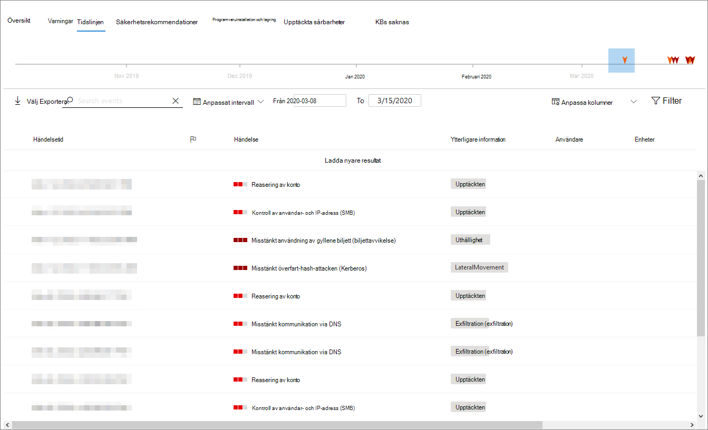

# Sidan enhets profil

[!INCLUDE [Microsoft 365 Defender rebranding](../includes/microsoft-defender.md)]

Med Microsoft 365-säkerhetsportalen får du en enhets profil sida så att du snabbt kan bedöma hälsa och status för enheter i nätverket.

> [!IMPORTANT]
> Enhets profil sidan kan verka lite annorlunda, beroende på om enheten är registrerad i Microsoft Defender för slut punkt, Microsoft Defender för identitet eller både och.

Om enheten är registrerad i Microsoft Defender för slut punkten kan du också använda sidan enhets profil för att utföra vanliga säkerhets uppgifter.

## Gå till sidan enhets profil

Profil sidan är uppdelad i flera breda avsnitt.

Marginal listen (1) visar grundläggande information om enheten.

Huvud innehålls området (2) innehåller flikar som du kan växla mellan för att visa olika typer av information om enheten.

Om enheten är registrerad i Microsoft Defender för slut punkt visas även en lista med svars åtgärder (3). Med svars åtgärder kan du utföra vanliga säkerhetsrelaterade uppgifter.

## Sido fältet

Bredvid huvud innehålls området på sidan enhets profil visas marginal listen.

I list rutan visas enhetens fullständiga namn och exponerings nivå. Den innehåller också viktig grundläggande information i små underavsnitt som kan växlas öppen eller stängd, till exempel:

* **Taggar** – alla Microsoft Defender för slut punkter, Microsoft Defender för identiteter och anpassade taggar som är associerade med enheten. Taggar från Microsoft Defender för identitet är inte redigerbara.
* **Säkerhets information** – öppna incidenter och aktiva aviseringar. Enheter som är registrerade i Microsoft Defender för slut punkter visar även exponerings nivå och risk nivå.

> [!TIP]
> Exponerings nivå handlar om hur mycket enheten uppfyller säkerhets rekommendationerna, samtidigt som risk nivån beräknas baserat på ett antal faktorer, bland annat typer och allvarlighets grad för aktiva varningar.

* **Enhets uppgifter** – domän, OS, tidsstämpel för när enheten först visades, IP-adresser, resurser. Enheter som är registrerade i Microsoft Defender för slut punkter visar också hälso tillstånd. Enheter som är registrerade i Microsoft Defender för identitet visar SAM-namn och en tidstämpel för när enheten först skapades.
* **Nätverks aktivitet** -tidsstämplar för första gången och när enheten senast visades i nätverket.
* **Katalog data** ( *endast för enheter som är registrerade i Microsoft Defender för identitet* )- [UAC](https://docs.microsoft.com/windows/security/identity-protection/user-account-control/user-account-control-overview) -flaggor, [SPN](https://docs.microsoft.com/windows/win32/ad/service-principal-names)och grupp medlemskap.

## Svars åtgärder

Svars åtgärder är ett snabbt sätt att försvara sig mot och analysera hot.

> [!IMPORTANT]
> * [Svars åtgärder](https://docs.microsoft.com/windows/security/threat-protection/microsoft-defender-atp/respond-machine-alerts) är bara tillgängliga om enheten är registrerad i Microsoft Defender för slut punkten.
> * Enheter som är registrerade i Microsoft Defender för slut punkter kan visa olika antal svars åtgärder baserat på enhetens operativ system och versions nummer.

Tillgängliga åtgärder på enhets profil sidan är bland annat:

* **Hantera Taggar** – uppdaterar anpassade taggar som du har använt på den här enheten.
* **Isolera enhet** -isolerar enheten från organisationens nätverk samtidigt som den hålls ansluten till Microsoft Defender för slut punkten. Du kan välja att tillåta att Outlook, teams och Skype för företag körs medan enheten är isolerad, i syfte att kommunicera.
* **Åtgärds Center** – Visa statusen för skickade åtgärder. Endast tillgängligt om en annan åtgärd redan har valts.
* **Begränsa program körning** -förhindrar att program som inte är signerade av Microsoft körs.
* **Kör antivirus genomsökning** -uppdatera definitioner för Windows Defender Antivirus och kör en virus genomsökning omedelbart. Välj mellan snabb sökning eller fullständig sökning.
* **Samla in undersöknings paket** – samlar in information om enheten. När undersökningen är klar kan du ladda ned den.
* **Starta Live-svarsomgången** -laddar ett fjärrgränssnitt på enheten för [djupgående säkerhets undersökningar](https://docs.microsoft.com/windows/security/threat-protection/microsoft-defender-atp/live-response).
* **Starta automatisk undersökning** – [undersöker och reparerar hot](https://docs.microsoft.com/microsoft-365/security/office-365-security/office-365-air)automatiskt. Även om du manuellt kan utlösa automatiska utredningar att köra från den här sidan, Utlös [vissa notifieringsregler](https://docs.microsoft.com/microsoft-365/compliance/alert-policies?view=o365-worldwide#default-alert-policies) automatiska utredningar.
* **Åtgärds Center** – visar information om alla svars åtgärder som körs för närvarande.

## Avsnittet flikar

Med flikarna för enhets profil kan du växla via en översikt över säkerhets information om enheten och tabeller som innehåller en lista med aviseringar.

Enheter som är registrerade i Microsoft Defender för slut punkter visar även flikar som innehåller en tids linje, en lista över säkerhets rekommendationer, en program inventering, en lista över upptäckta säkerhets problem och saknade KBs (säkerhets uppdateringar).

### Fliken Översikt

Standard-fliken är **Översikt**. Det ger en snabb överblick över de viktigaste säkerhets faktumet på enheten.

Här kan du få en snabb överblick över enhetens aktiva aviseringar och alla användare som är inloggade.

Om enheten är registrerad i Microsoft Defender för slut punkten kan du även se enhetens risk nivå och alla tillgängliga data om säkerhets utvärderingar. Säkerhets utvärderingarna beskriver enhetens exponerings nivå, tillhandahåller säkerhets rekommendationer och visar en lista över program vara och upptäckta säkerhets problem.

### Fliken aviseringar

Fliken **aviseringar** innehåller en lista med aviseringar som har upphöjts till enheten från både Microsoft Defender för identitet och Microsoft Defender för slut punkten.

Du kan anpassa hur många objekt som visas och vilka kolumner som ska visas för varje objekt. Standardinställningen är att lista halv objekt per sida.

Kolumnerna på den här fliken innehåller information om hur allvarligt hotet som utlöste aviseringen, samt status, undersöknings status och vem som har tilldelats notifieringen.

Kolumnen *påverkade entiteter* refererar till den enhet (entitet) vars profil du för tillfället visar, samt eventuella andra enheter i nätverket som påverkas.

Om du väljer ett objekt från listan öppnas en utfällbar lista med mer information om den valda aviseringen.

Den här listan kan filtreras efter allvarlighets grad, status eller vem notifieringen har tilldelats.

### Fliken tids linje

Fliken **tids linje** innehåller ett interaktivt, kronologiskt diagram över alla händelser som är aktiverade på enheten. Genom att flytta det markerade området i diagrammet åt vänster eller höger kan du Visa händelser under olika tids perioder. Du kan också välja ett eget datum intervall i den nedrullningsbara menyn mellan det interaktiva diagrammet och listan med händelser.

Under diagrammet finns en lista över händelser för det markerade datum intervallet.

Antalet objekt som visas och kolumnerna i listan kan båda anpassas. I standard kolumnerna listas händelse tid, aktiv användare, åtgärds typ, enheter (processer) och ytterligare information om händelsen.

Om du väljer ett objekt från den här listan öppnas en utfällbar diagram som visar de överordnade och underordnade processerna i händelsen.

Listan kan filtreras efter den speciella typen av händelse; till exempel register händelser eller händelser för smart skärm.

Listan kan också exporteras till en CSV-fil för nedladdning. Även om filen inte begränsas av antalet händelser är det maximala tidsintervallet du kan välja att exportera sju dagar.

### Fliken säkerhets rekommendationer

På fliken **säkerhets rekommendationer** visas de åtgärder du kan vidta för att skydda enheten. Om du markerar ett objekt i den här listan öppnas en utfällbar lista där du kan få anvisningar om hur du använder rekommendationen.

Precis som med föregående flikar kan du anpassa antalet objekt som visas per sida samt vilka kolumner som ska visas.

Standardvyn innehåller kolumner med information om säkerhets svagheter, tillhör ande hot, den relaterade komponenten eller program varan som påverkas av hotet och mycket mer. Objekt kan filtreras enligt rekommendationens status.

### Program varu inventering

På fliken **program varu inventering** visas program vara installerat på enheten.

I standardvyn visas program varu leverantören, det installerade versions numret, antalet kända program svagheter, Hot insikter, produkt kod och taggar. Antalet objekt som visas och vilka kolumner som visas kan båda anpassas.

Om du väljer ett objekt från den här listan öppnas en utfällbar lista med mer information om den valda program varan samt sökväg och tidsstämpel för den senaste gången program varan hittades.

Den här listan kan filtreras efter produkt kod.

### Fliken upptäckta säkerhets problem

Fliken **upptäckta säkerhets problem** visar eventuella vanliga säkerhets problem och utnyttjanden (CVEs) som kan påverka enheten.

I standardvyn visas allvarlighets graden för CVE, det vanligaste säkerhets problemet (CVS), program varan som är relaterad till CVE, när CVE publicerades, när CVE senast uppdaterades och hot kopplade till CVE.

Precis som med föregående flikar kan du anpassa antalet objekt som visas och vilka kolumner som ska visas.

Om du väljer ett objekt i den här listan öppnas en utfällare som beskriver CVE.

### KBs saknas

I den **saknade KBS** -fliken visas alla uppdateringar som ännu inte har installerats på enheten. "KBs" i fråga är [kunskaps bas artiklar](https://support.microsoft.com/help/242450/how-to-query-the-microsoft-knowledge-base-by-using-keywords-and-query) som beskriver dessa uppdateringar. till exempel [KB4551762](https://support.microsoft.com/help/4551762/windows-10-update-kb4551762).

I standardvyn visas den bulletin som innehåller uppdateringarna, OS-versionen, de produkter som påverkas, CVEs adresser, KB-nummer och taggar.

Antalet objekt som visas per sida och vilka kolumner som visas kan anpassas.

Om du markerar ett objekt öppnas en utfällbar länk till uppdateringen.

## Relaterade ämnen

* [Översikt över Microsoft 365 Defender](microsoft-threat-protection.md)
* [Aktivera Microsoft 365 Defender](mtp-enable.md)
* [Undersök enheter på enheter, med Live Response](https://docs.microsoft.com/windows/security/threat-protection/microsoft-defender-atp/live-response)
* [Automatisk undersökning och svar (AIR) i Office 365](https://docs.microsoft.com/microsoft-365/security/office-365-security/office-365-air)
