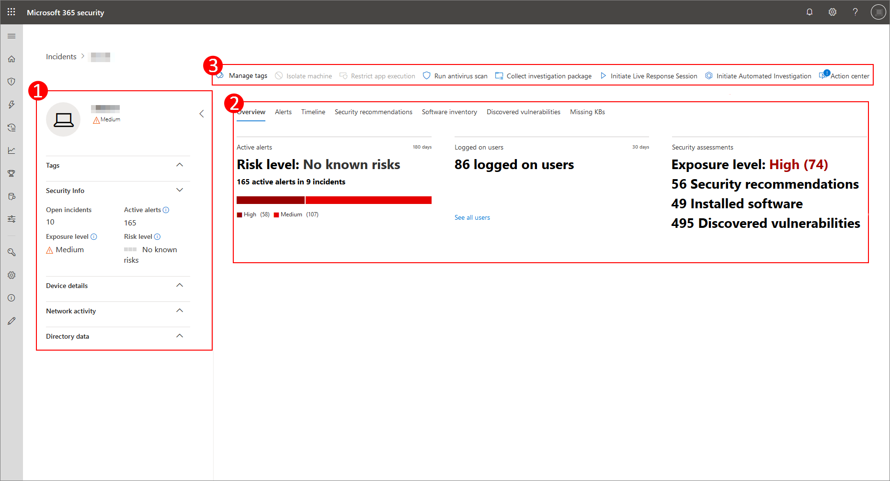
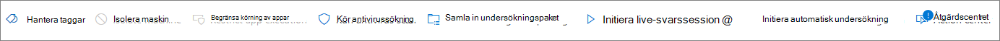
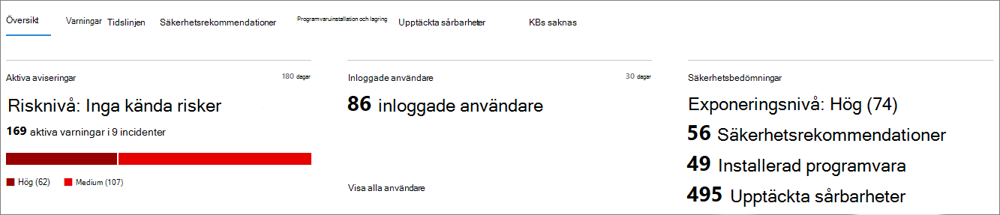
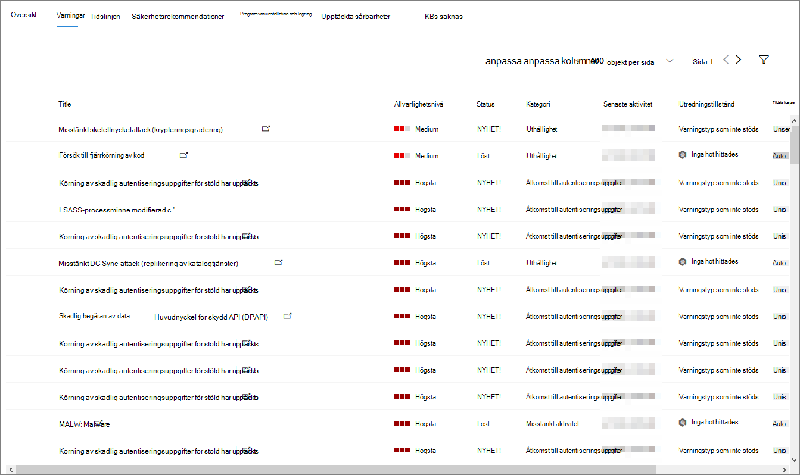

# Sidan enhets profilDevice profile page

[!INCLUDE [Microsoft 365 Defender rebranding](../includes/microsoft-defender.md)]

Med Microsoft 365-säkerhetsportalen får du en enhets profil sida så att du snabbt kan bedöma hälsa och status för enheter i nätverket.The Microsoft 365 security portal provides you with device profile pages, so you can quickly assess the health and status of devices on your network.

> [!IMPORTANT]
> Enhets profil sidan kan verka lite annorlunda, beroende på om enheten är registrerad i Microsoft Defender för slut punkt, Microsoft Defender för identitet eller både och.The device profile page may appear slightly different, depending on whether the device is enrolled in Microsoft Defender for Endpoint, Microsoft Defender for Identity, or both.

Om enheten är registrerad i Microsoft Defender för slut punkten kan du också använda sidan enhets profil för att utföra vanliga säkerhets uppgifter.If the device is enrolled in Microsoft Defender for Endpoint, you can also use the device profile page to perform some common security tasks.

## Gå till sidan enhets profilNavigating the device profile page

Profil sidan är uppdelad i flera breda avsnitt.The profile page is broken up into several broad sections.

Marginal listen (1) visar grundläggande information om enheten.The sidebar (1) lists basic details about the device.

Huvud innehålls området (2) innehåller flikar som du kan växla mellan för att visa olika typer av information om enheten.The main content area (2) contains tabs that you can toggle through to view different kinds of information about the device.

Om enheten är registrerad i Microsoft Defender för slut punkt visas även en lista med svars åtgärder (3).If the device is enrolled in Microsoft Defender for Endpoint, you will also see a list of response actions (3). Med svars åtgärder kan du utföra vanliga säkerhetsrelaterade uppgifter.Response actions allow you to perform common security-related tasks.

## Sido fältetSidebar

Bredvid huvud innehålls området på sidan enhets profil visas marginal listen.Beside the main content area of the device profile page is the sidebar.

I list rutan visas enhetens fullständiga namn och exponerings nivå.The sidebar lists the device's full name and exposure level. Den innehåller också viktig grundläggande information i små underavsnitt som kan växlas öppen eller stängd, till exempel:It also provides some important basic information in small subsections which can be toggled open or closed, such as:

* **Taggar** – alla Microsoft Defender för slut punkter, Microsoft Defender för identiteter och anpassade taggar som är associerade med enheten.**Tags** - Any Microsoft Defender for Endpoint, Microsoft Defender for Identity, or custom tags associated with the device. Taggar från Microsoft Defender för identitet är inte redigerbara.Tags from Microsoft Defender for Identity are not editable.
* **Säkerhets information** – öppna incidenter och aktiva aviseringar.**Security info** - Open incidents and active alerts. Enheter som är registrerade i Microsoft Defender för slut punkter visar även exponerings nivå och risk nivå.Devices enrolled in Microsoft Defender for Endpoint will also display exposure level and risk level.

> [!TIP]
> Exponerings nivå handlar om hur mycket enheten uppfyller säkerhets rekommendationerna, samtidigt som risk nivån beräknas baserat på ett antal faktorer, bland annat typer och allvarlighets grad för aktiva varningar.Exposure level relates to how much the device is complying with security recommendations, while risk level is calculated based on a number of factors, including the types and severity of active alerts.

* **Enhets uppgifter** – domän, OS, tidsstämpel för när enheten först visades, IP-adresser, resurser.**Device details** - Domain, OS, timestamp for when the device was first seen, IP addresses, resources. Enheter som är registrerade i Microsoft Defender för slut punkter visar också hälso tillstånd.Devices enrolled in Microsoft Defender for Endpoint also display health state. Enheter som är registrerade i Microsoft Defender för identitet visar SAM-namn och en tidstämpel för när enheten först skapades.Devices enrolled in Microsoft Defender for Identity will display SAM name and a timestamp for when the device was first created.
* **Nätverks aktivitet** -tidsstämplar för första gången och när enheten senast visades i nätverket.**Network activity** - Timestamps for the first time and last time the device was seen on the network.
* **Katalog data** ( *endast för enheter som är registrerade i Microsoft Defender för identitet* )- [UAC](https://docs.microsoft.com/windows/security/identity-protection/user-account-control/user-account-control-overview) -flaggor, [SPN](https://docs.microsoft.com/windows/win32/ad/service-principal-names)och grupp medlemskap.**Directory data** ( *only for devices enrolled in Microsoft Defender for Identity* ) - [UAC](https://docs.microsoft.com/windows/security/identity-protection/user-account-control/user-account-control-overview) flags, [SPNs](https://docs.microsoft.com/windows/win32/ad/service-principal-names), and group memberships.

## Svars åtgärderResponse actions

Svars åtgärder är ett snabbt sätt att försvara sig mot och analysera hot.Response actions offer a quick way to defend against and analyze threats.

> [!IMPORTANT]
> * [Svars åtgärder](https://docs.microsoft.com/windows/security/threat-protection/microsoft-defender-atp/respond-machine-alerts) är bara tillgängliga om enheten är registrerad i Microsoft Defender för slut punkten.[Response actions](https://docs.microsoft.com/windows/security/threat-protection/microsoft-defender-atp/respond-machine-alerts) are only available if the device is enrolled in Microsoft Defender for Endpoint.
> * Enheter som är registrerade i Microsoft Defender för slut punkter kan visa olika antal svars åtgärder baserat på enhetens operativ system och versions nummer.Devices that are enrolled in Microsoft Defender for Endpoint may display different numbers of response actions, based on the device's OS and version number.

Tillgängliga åtgärder på enhets profil sidan är bland annat:Actions available on the device profile page include:

* **Hantera Taggar** – uppdaterar anpassade taggar som du har använt på den här enheten.**Manage tags** - Updates custom tags you have applied to this device.
* **Isolera enhet** -isolerar enheten från organisationens nätverk samtidigt som den hålls ansluten till Microsoft Defender för slut punkten.**Isolate device** - Isolates the device from your organization's network while keeping it connected to Microsoft Defender for Endpoint. Du kan välja att tillåta att Outlook, teams och Skype för företag körs medan enheten är isolerad, i syfte att kommunicera.You can choose to allow Outlook, Teams, and Skype for Business to run while the device is isolated, for communication purposes.
* **Åtgärds Center** – Visa statusen för skickade åtgärder.**Action center** - View the status of submitted actions. Endast tillgängligt om en annan åtgärd redan har valts.Only available if another action has already been selected.
* **Begränsa program körning** -förhindrar att program som inte är signerade av Microsoft körs.**Restrict app execution** - Prevents applications that are not signed by Microsoft from running.
* **Kör antivirus genomsökning** -uppdatera definitioner för Windows Defender Antivirus och kör en virus genomsökning omedelbart.**Run antivirus scan** - Updates Windows Defender Antivirus definitions and immediately runs an antivirus scan. Välj mellan snabb sökning eller fullständig sökning.Choose between Quick scan or Full scan.
* **Samla in undersöknings paket** – samlar in information om enheten.**Collect investigation package** - Gathers information about the device. När undersökningen är klar kan du ladda ned den.When the investigation is completed, you can download it.
* **Starta Live-svarsomgången** -laddar ett fjärrgränssnitt på enheten för [djupgående säkerhets undersökningar](https://docs.microsoft.com/windows/security/threat-protection/microsoft-defender-atp/live-response).**Initiate Live Response Session** - Loads a remote shell on the device for [in-depth security investigations](https://docs.microsoft.com/windows/security/threat-protection/microsoft-defender-atp/live-response).
* **Starta automatisk undersökning** – [undersöker och reparerar hot](https://docs.microsoft.com/microsoft-365/security/office-365-security/office-365-air)automatiskt.**Initiate automated investigation** - Automatically [investigates and remediates threats](https://docs.microsoft.com/microsoft-365/security/office-365-security/office-365-air). Även om du manuellt kan utlösa automatiska utredningar att köra från den här sidan, Utlös [vissa notifieringsregler](https://docs.microsoft.com/microsoft-365/compliance/alert-policies?view=o365-worldwide#default-alert-policies) automatiska utredningar.Although you can manually trigger automated investigations to run from this page, [certain alert policies](https://docs.microsoft.com/microsoft-365/compliance/alert-policies?view=o365-worldwide#default-alert-policies) trigger automatic investigations on their own.
* **Åtgärds Center** – visar information om alla svars åtgärder som körs för närvarande.**Action center** - Displays information about any response actions that are currently running.

## Avsnittet flikarTabs section

Med flikarna för enhets profil kan du växla via en översikt över säkerhets information om enheten och tabeller som innehåller en lista med aviseringar.The device profile tabs allow you to toggle through an overview of security details about the device, and tables containing a list of alerts.

Enheter som är registrerade i Microsoft Defender för slut punkter visar även flikar som innehåller en tids linje, en lista över säkerhets rekommendationer, en program inventering, en lista över upptäckta säkerhets problem och saknade KBs (säkerhets uppdateringar).Devices enrolled in Microsoft Defender for Endpoint will also display tabs that feature a timeline, a list of security recommendations, a software inventory, a list of discovered vulnerabilities, and missing KBs (security updates).

### Fliken ÖversiktOverview tab

Standard-fliken är **Översikt**.The default tab is **Overview**. Det ger en snabb överblick över de viktigaste säkerhets faktumet på enheten.It provides a quick look at the most important security fact about the device.

Här kan du få en snabb överblick över enhetens aktiva aviseringar och alla användare som är inloggade.Here, you can get a quick look at the device's active alerts, and any currently logged on users.

Om enheten är registrerad i Microsoft Defender för slut punkten kan du även se enhetens risk nivå och alla tillgängliga data om säkerhets utvärderingar.If the device is enrolled in Microsoft Defender for Endpoint, you will also see the device's risk level and any available data on security assessments. Säkerhets utvärderingarna beskriver enhetens exponerings nivå, tillhandahåller säkerhets rekommendationer och visar en lista över program vara och upptäckta säkerhets problem.The security assessments describe the device's exposure level, provide security recommendations, and list affected software and discovered vulnerabilities.

### Fliken aviseringarAlerts tab

Fliken **aviseringar** innehåller en lista med aviseringar som har upphöjts till enheten från både Microsoft Defender för identitet och Microsoft Defender för slut punkten.The **Alerts** tab contains a list of alerts that have been raised on the device, from both Microsoft Defender for Identity and Microsoft Defender for Endpoint.

Du kan anpassa hur många objekt som visas och vilka kolumner som ska visas för varje objekt.You can customize the number of items displayed, as well as which columns are displayed for each item. Standardinställningen är att lista halv objekt per sida.The default behavior is to list thirty items per page.

Kolumnerna på den här fliken innehåller information om hur allvarligt hotet som utlöste aviseringen, samt status, undersöknings status och vem som har tilldelats notifieringen.The columns in this tab include information on the severity of the threat that triggered the alert, as well as status, investigation state, and who the alert has been assigned to.

Kolumnen *påverkade entiteter* refererar till den enhet (entitet) vars profil du för tillfället visar, samt eventuella andra enheter i nätverket som påverkas.The *impacted entities* column refers to the device (entity) whose profile you are currently viewing, plus any other devices in your network that are affected.

Om du väljer ett objekt från listan öppnas en utfällbar lista med mer information om den valda aviseringen.Selecting an item from this list will open a flyout containing even more information about the selected alert.

Den här listan kan filtreras efter allvarlighets grad, status eller vem notifieringen har tilldelats.This list can be filtered by severity, status, or who the alert has been assigned to.

### Fliken tids linjeTimeline tab

Fliken **tids linje** innehåller ett interaktivt, kronologiskt diagram över alla händelser som är aktiverade på enheten.The **Timeline** tab includes an interactive, chronological chart of all events raised on the device. Genom att flytta det markerade området i diagrammet åt vänster eller höger kan du Visa händelser under olika tids perioder.By moving the highlighted area of the chart left or right, you can view events over different periods of time. Du kan också välja ett eget datum intervall i den nedrullningsbara menyn mellan det interaktiva diagrammet och listan med händelser.You can also choose a custom range of dates from the dropdown menu in between the interactive chart and the list of events.

Under diagrammet finns en lista över händelser för det markerade datum intervallet.Below the chart is a list of events for the selected range of dates.

Antalet objekt som visas och kolumnerna i listan kan båda anpassas.The number of items displayed and the columns on the list can both be customized. I standard kolumnerna listas händelse tid, aktiv användare, åtgärds typ, enheter (processer) och ytterligare information om händelsen.The default columns list the event time, active user, action type, entities (processes), and additional information about the event.

Om du väljer ett objekt från den här listan öppnas en utfällbar diagram som visar de överordnade och underordnade processerna i händelsen.Selecting an item from this list will open a flyout displaying an Event entities graph, showing the parent and child processes involved in the event.

Listan kan filtreras efter den speciella typen av händelse; till exempel register händelser eller händelser för smart skärm.The list can be filtered by the specific kind of event; for example, Registry events or Smart Screen Events.

Listan kan också exporteras till en CSV-fil för nedladdning.The list can also be exported to a CSV file, for download. Även om filen inte begränsas av antalet händelser är det maximala tidsintervallet du kan välja att exportera sju dagar.Although the file is not limited by number of events, the maximum time range you can choose to export is seven days.

### Fliken säkerhets rekommendationerSecurity recommendations tab

På fliken **säkerhets rekommendationer** visas de åtgärder du kan vidta för att skydda enheten.The **Security recommendations** tab lists actions you can take to protect the device. Om du markerar ett objekt i den här listan öppnas en utfällbar lista där du kan få anvisningar om hur du använder rekommendationen.Selecting an item on this list will open a flyout where you can get instructions on how to apply the recommendation.

Precis som med föregående flikar kan du anpassa antalet objekt som visas per sida samt vilka kolumner som ska visas.As with the previous tabs, the number of items displayed per page, as well as which columns are visible, can be customized.

Standardvyn innehåller kolumner med information om säkerhets svagheter, tillhör ande hot, den relaterade komponenten eller program varan som påverkas av hotet och mycket mer.The default view includes columns that detail the security weaknesses addressed, the associated threat, the related component or software affected by the threat, and more. Objekt kan filtreras enligt rekommendationens status.Items can be filtered by the recommendation's status.

### Program varu inventeringSoftware inventory

På fliken **program varu inventering** visas program vara installerat på enheten.The **Software inventory** tab lists software installed on the device.

I standardvyn visas program varu leverantören, det installerade versions numret, antalet kända program svagheter, Hot insikter, produkt kod och taggar.The default view displays the software vendor, installed version number, number of known software weaknesses, threat insights, product code, and tags. Antalet objekt som visas och vilka kolumner som visas kan båda anpassas.The number of items displayed and which columns are displayed can both be customized.

Om du väljer ett objekt från den här listan öppnas en utfällbar lista med mer information om den valda program varan samt sökväg och tidsstämpel för den senaste gången program varan hittades.Selecting an item from this list opens a flyout containing more details about the selected software, as well as the path and timestamp for the last time the software was found.

Den här listan kan filtreras efter produkt kod.This list can be filtered by product code.

### Fliken upptäckta säkerhets problemDiscovered vulnerabilities tab

Fliken **upptäckta säkerhets problem** visar eventuella vanliga säkerhets problem och utnyttjanden (CVEs) som kan påverka enheten.The **Discovered vulnerabilities** tab lists any Common Vulnerabilities and Exploits (CVEs) that may affect the device.

I standardvyn visas allvarlighets graden för CVE, det vanligaste säkerhets problemet (CVS), program varan som är relaterad till CVE, när CVE publicerades, när CVE senast uppdaterades och hot kopplade till CVE.The default view lists the severity of the CVE, the Common Vulnerability Score (CVS), the software related to the CVE, when the CVE was published, when the CVE was last updated, and threats associated with the CVE.

Precis som med föregående flikar kan du anpassa antalet objekt som visas och vilka kolumner som ska visas.As with the previous tabs, the number of items displayed and which columns are visible can be customized.

Om du väljer ett objekt i den här listan öppnas en utfällare som beskriver CVE.Selecting an item from this list will open a flyout that describes the CVE.

### KBs saknasMissing KBs

I den **saknade KBS** -fliken visas alla uppdateringar som ännu inte har installerats på enheten.The **Missing KBs** tab lists any Microsoft Updates that have yet to be applied to the device. "KBs" i fråga är [kunskaps bas artiklar](https://support.microsoft.com/help/242450/how-to-query-the-microsoft-knowledge-base-by-using-keywords-and-query) som beskriver dessa uppdateringar. till exempel [KB4551762](https://support.microsoft.com/help/4551762/windows-10-update-kb4551762).The "KBs" in question are [Knowledge Base articles](https://support.microsoft.com/help/242450/how-to-query-the-microsoft-knowledge-base-by-using-keywords-and-query) which describe these updates; for example, [KB4551762](https://support.microsoft.com/help/4551762/windows-10-update-kb4551762).

I standardvyn visas den bulletin som innehåller uppdateringarna, OS-versionen, de produkter som påverkas, CVEs adresser, KB-nummer och taggar.The default view lists the bulletin containing the updates, OS version, products affected, CVEs addressed, the KB number, and tags.

Antalet objekt som visas per sida och vilka kolumner som visas kan anpassas.The number of items displayed per page and which columns are displayed can be customized.

Om du markerar ett objekt öppnas en utfällbar länk till uppdateringen.Selecting an item will open a flyout that links to the update.

## Relaterade ämnenRelated topics

* [Översikt över Microsoft 365 DefenderMicrosoft 365 Defender overview](microsoft-threat-protection.md)
* [Aktivera Microsoft 365 DefenderTurn on Microsoft 365 Defender](mtp-enable.md)
* [Undersök enheter på enheter, med Live ResponseInvestigate entities on devices, using live response](https://docs.microsoft.com/windows/security/threat-protection/microsoft-defender-atp/live-response)
* [Automatisk undersökning och svar (AIR) i Office 365Automated investigation and response (AIR) in Office 365](https://docs.microsoft.com/microsoft-365/security/office-365-security/office-365-air)
