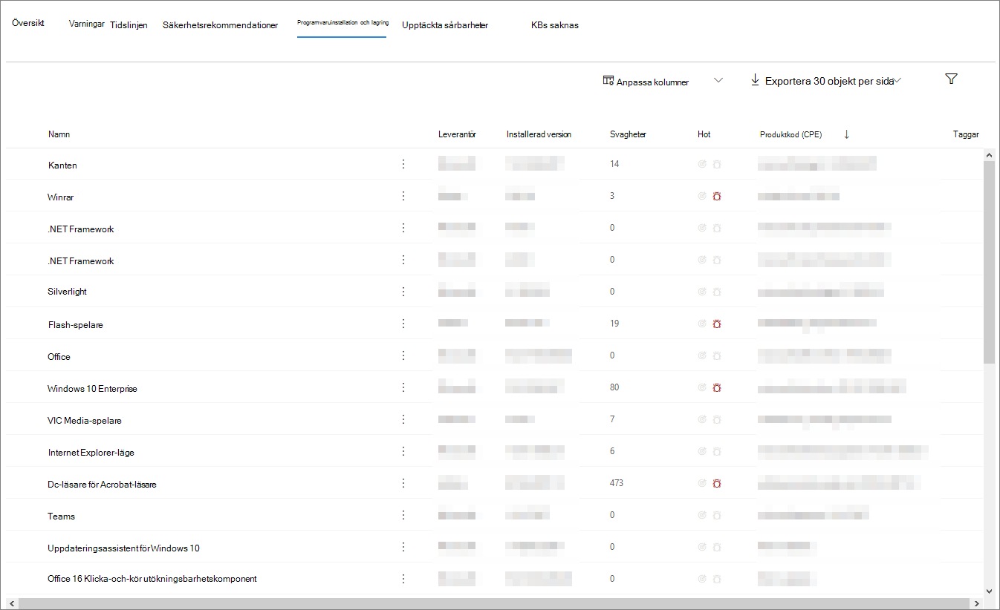

# Sidan EnhetsprofilDevice profile page

Microsoft 365-säkerhetsportalen ger dig enhetsprofilsidor, så att du snabbt kan bedöma hälsotillståndet och statusen för enheter i nätverket.The Microsoft 365 security portal provides you with device profile pages, so you can quickly assess the health and status of devices on your network.

> [!IMPORTANT]
> Enhetsprofilsidan kan se lite annorlunda ut, beroende på om enheten är registrerad i Microsoft Defender ATP, Azure ATP eller båda.The device profile page may appear slightly different, depending on whether the device is enrolled in Microsoft Defender ATP, Azure ATP, or both.

Om enheten är registrerad i Microsoft Defender ATP kan du också använda enhetsprofilsidan för att utföra några vanliga säkerhetsuppgifter.If the device is enrolled in Microsoft Defender ATP, you can also use the device profile page to perform some common security tasks.

## Navigera på enhetsprofilsidanNavigating the device profile page

Profilsidan är uppdelad i flera breda avsnitt.The profile page is broken up into several broad sections.

Sidofältet (1) listar grundläggande detaljer om enheten.The sidebar (1) lists basic details about the device.

Huvudinnehållsområdet (2) innehåller flikar som du kan växla igenom för att visa olika typer av information om enheten.The main content area (2) contains tabs that you can toggle through to view different kinds of information about the device.

Om enheten är registrerad i Microsoft Defender ATP visas också en lista över svarsåtgärder (3).If the device is enrolled in Microsoft Defender ATP, you will also see a list of response actions (3). Med svarsåtgärder kan du utföra vanliga säkerhetsrelaterade uppgifter.Response actions allow you to perform common security-related tasks.

## SidofältetSidebar

Bredvid huvudinnehållsområdet på enhetens profilsida finns sidofältet.Beside the main content area of the device profile page is the sidebar.

Sidofältet listar enhetens fullständiga namn och exponeringsnivå.The sidebar lists the device's full name and exposure level. Det ger också några viktiga grundläggande information i små underavsnitt som kan växlas öppna eller stängda, till exempel:It also provides some important basic information in small subsections which can be toggled open or closed, such as:

* **Taggar** – Alla Microsoft Defender ATP-, Azure ATP- eller anpassade taggar som är associerade med enheten.**Tags** - Any Microsoft Defender ATP, Azure ATP, or custom tags associated with the device. Taggar från Azure ATP kan inte redigeras.Tags from Azure ATP are not editable.
* **Säkerhetsinformation** - Öppna incidenter och aktiva aviseringar.**Security info** - Open incidents and active alerts. Enheter som är registrerade i Microsoft Defender ATP visar också exponeringsnivå och risknivå.Devices enrolled in Microsoft Defender ATP will also display exposure level and risk level.

> [!TIP]
> Exponeringsnivån relaterar till hur mycket enheten följer säkerhetsrekommendationer, medan risknivån beräknas baserat på ett antal faktorer, inklusive typer och allvarlighetsgrad för aktiva aviseringar.Exposure level relates to how much the device is complying with security recommendations, while risk level is calculated based on a number of factors, including the types and severity of active alerts.

* **Enhetsinformation** - Domän, OS, tidsstämpel för när enheten först sågs, IP-adresser, resurser.**Device details** - Domain, OS, timestamp for when the device was first seen, IP addresses, resources. Enheter som är registrerade i Microsoft Defender ATP visar också hälsotillstånd.Devices enrolled in Microsoft Defender ATP also display health state. Enheter som registrerats i Azure ATP visar SAM-namn och en tidsstämpel för när enheten först skapades.Devices enrolled in Azure ATP will display SAM name and a timestamp for when the device was first created.
* **Nätverksaktivitet** - Tidsstämplar för första gången och sista gången enheten sågs i nätverket.**Network activity** - Timestamps for the first time and last time the device was seen on the network.
* **Katalogdata** (*endast för enheter som är registrerade i Azure ATP*) - [UAC-flaggor,](https://docs.microsoft.com/windows/security/identity-protection/user-account-control/user-account-control-overview) [SPN](https://docs.microsoft.com/windows/win32/ad/service-principal-names)och gruppmedlemskap.**Directory data** (*only for devices enrolled in Azure ATP*) - [UAC](https://docs.microsoft.com/windows/security/identity-protection/user-account-control/user-account-control-overview) flags, [SPNs](https://docs.microsoft.com/windows/win32/ad/service-principal-names), and group memberships.

## SvarsåtgärderResponse actions

Svarsåtgärder erbjuder ett snabbt sätt att försvara sig mot och analysera hot.Response actions offer a quick way to defend against and analyze threats.

> [!IMPORTANT]
> * [Svarsåtgärder](https://docs.microsoft.com/windows/security/threat-protection/microsoft-defender-atp/respond-machine-alerts) är endast tillgängliga om enheten är registrerad i Microsoft Defender ATP.[Response actions](https://docs.microsoft.com/windows/security/threat-protection/microsoft-defender-atp/respond-machine-alerts) are only available if the device is enrolled in Microsoft Defender ATP.
> * Enheter som är registrerade i Microsoft Defender ATP kan visa olika antal svarsåtgärder, baserat på enhetens operativsystem och versionsnummer.Devices that are enrolled in Microsoft Defender ATP may display different numbers of response actions, based on the device's OS and version number.

Åtgärder som är tillgängliga på enhetens profilsida är:Actions available on the device profile page include:

* **Hantera taggar** – Uppdaterar anpassade taggar som du har använt på den här enheten.**Manage tags** - Updates custom tags you have applied to this device.
* **Isolera enheten** – isolerar enheten från organisationens nätverk samtidigt som den är ansluten till Microsoft Defender Advanced Threat Protection.**Isolate device** - Isolates the device from your organization's network while keeping it connected to Microsoft Defender Advanced Threat Protection. Du kan välja att låta Outlook, Teams och Skype för företag köras medan enheten är isolerad, i kommunikationssyfte.You can choose to allow Outlook, Teams, and Skype for Business to run while the device is isolated, for communication purposes.
* **Åtgärdscenter** - Visa status för inskickade åtgärder.**Action center** - View the status of submitted actions. Endast tillgänglig om en annan åtgärd redan har valts.Only available if another action has already been selected.
* **Begränsa appkörning** - Förhindrar att program som inte är signerade av Microsoft körs.**Restrict app execution** - Prevents applications that are not signed by Microsoft from running.
* **Kör antivirussökning** - Uppdaterar Windows Defender Antivirus definitioner och omedelbart kör en antivirussökning.**Run antivirus scan** - Updates Windows Defender Antivirus definitions and immediately runs an antivirus scan. Välj mellan Snabbsökning eller Fullständig genomsökning.Choose between Quick scan or Full scan.
* **Samla in undersökningspaket** - Samlar in information om enheten.**Collect investigation package** - Gathers information about the device. När undersökningen är klar kan du hämta den.When the investigation is completed, you can download it.
* **Initiera live-svarssession** - Laddar ett fjärrskal på enheten för [djupgående säkerhetsutredningar](https://docs.microsoft.com/windows/security/threat-protection/microsoft-defender-atp/live-response).**Initiate Live Response Session** - Loads a remote shell on the device for [in-depth security investigations](https://docs.microsoft.com/windows/security/threat-protection/microsoft-defender-atp/live-response).
* **Initiera automatisk undersökning** - [Undersöker och åtgärdar automatiskt hot](https://docs.microsoft.com/microsoft-365/security/office-365-security/office-365-air).**Initiate automated investigation** - Automatically [investigates and remediates threats](https://docs.microsoft.com/microsoft-365/security/office-365-security/office-365-air). Även om du manuellt kan utlösa automatiska undersökningar för att köras från den här sidan utlöser [vissa varningsprinciper](https://docs.microsoft.com/microsoft-365/compliance/alert-policies?view=o365-worldwide#default-alert-policies) automatiska undersökningar på egen hand.Although you can manually trigger automated investigations to run from this page, [certain alert policies](https://docs.microsoft.com/microsoft-365/compliance/alert-policies?view=o365-worldwide#default-alert-policies) trigger automatic investigations on their own.
* **Åtgärdscenter** - Visar information om eventuella svarsåtgärder som körs för tillfället.**Action center** - Displays information about any response actions that are currently running.

## Avsnittet FlikarTabs section

Med enhetsprofilflikarna kan du växla igenom en översikt över säkerhetsinformation om enheten och tabeller som innehåller en lista med aviseringar.The device profile tabs allow you to toggle through an overview of security details about the device, and tables containing a list of alerts.

Enheter som är registrerade i Microsoft Defender ATP visar också flikar som har en tidslinje, en lista över säkerhetsrekommendationer, en programvaruinventering, en lista över upptäckta säkerhetsproblem och saknade KBs (säkerhetsuppdateringar).Devices enrolled in Microsoft Defender ATP will also display tabs that feature a timeline, a list of security recommendations, a software inventory, a list of discovered vulnerabilities, and missing KBs (security updates).

### Fliken ÖversiktOverview tab

Standardfliken är **Översikt**.The default tab is **Overview**. Det ger en snabb titt på det viktigaste säkerhetsfaktat om enheten.It provides a quick look at the most important security fact about the device.

Här kan du få en snabb titt på enhetens aktiva aviseringar och alla som för närvarande är inloggade på användare.Here, you can get a quick look at the device's active alerts, and any currently logged on users.

Om enheten är registrerad i Microsoft Defender ATP ser du även enhetens risknivå och alla tillgängliga data om säkerhetsbedömningar.If the device is enrolled in Microsoft Defender ATP, you will also see the device's risk level and any available data on security assessments. Säkerhetsbedömningarna beskriver enhetens exponeringsnivå, ger säkerhetsrekommendationer och listar programvara som påverkas och upptäcker sårbarheter.The security assessments describe the device's exposure level, provide security recommendations, and list affected software and discovered vulnerabilities.

### Fliken AviseringarAlerts tab

Fliken **Aviseringar** innehåller en lista över aviseringar som har höjts på enheten, från både Azure ATP och Microsoft Defender ATP.The **Alerts** tab contains a list of alerts that have been raised on the device, from both Azure ATP and Microsoft Defender ATP.

Du kan anpassa antalet objekt som visas, samt vilka kolumner som visas för varje objekt.You can customize the number of items displayed, as well as which columns are displayed for each item. Standardbeteendet är att lista trettio objekt per sida.The default behavior is to list thirty items per page.

Kolumnerna på den här fliken innehåller information om allvarlighetsgraden för det hot som utlöste aviseringen, samt status, undersökningstillstånd och vem aviseringen har tilldelats.The columns in this tab include information on the severity of the threat that triggered the alert, as well as status, investigation state, and who the alert has been assigned to.

Kolumnen *påverkade entiteter* refererar till den enhet (entitet) vars profil du för närvarande visar, plus alla andra enheter i nätverket som påverkas.The *impacted entities* column refers to the device (entity) whose profile you are currently viewing, plus any other devices in your network that are affected.

Om du väljer ett objekt i den här listan öppnas ett utfällbart objekt som innehåller ännu mer information om den valda aviseringen.Selecting an item from this list will open a flyout containing even more information about the selected alert.

Den här listan kan filtreras efter allvarlighetsgrad, status eller vem aviseringen har tilldelats.This list can be filtered by severity, status, or who the alert has been assigned to.

### Fliken TidslinjeTimeline tab

Fliken **Tidslinje** innehåller ett interaktivt, kronologiskt diagram över alla händelser som utlöses på enheten.The **Timeline** tab includes an interactive, chronological chart of all events raised on the device. Genom att flytta det markerade området i diagrammet åt vänster eller höger kan du visa händelser över olika tidsperioder.By moving the highlighted area of the chart left or right, you can view events over different periods of time. Du kan också välja ett anpassat datumintervall från rullgardinsmenyn mellan det interaktiva diagrammet och listan över händelser.You can also choose a custom range of dates from the dropdown menu in between the interactive chart and the list of events.

Nedanför diagrammet finns en lista över händelser för det valda datumintervallet.Below the chart is a list of events for the selected range of dates.

Antalet objekt som visas och kolumnerna i listan kan båda anpassas.The number of items displayed and the columns on the list can both be customized. Standardkolumnerna listar händelsetid, aktiv användare, åtgärdstyp, entiteter (processer) och ytterligare information om händelsen.The default columns list the event time, active user, action type, entities (processes), and additional information about the event.

Om du väljer ett objekt i den här listan öppnas ett utfällbart objekt som visar ett diagram över en entiteter för händelser som visar de överordnade och underordnade processer som är involverade i händelsen.Selecting an item from this list will open a flyout displaying an Event entities graph, showing the parent and child processes involved in the event.

Listan kan filtreras efter den specifika typen av händelse. till exempel registerhändelser eller smartskärmshändelser.The list can be filtered by the specific kind of event; for example, Registry events or Smart Screen Events.

Listan kan också exporteras till en CSV-fil, för nedladdning.The list can also be exported to a CSV file, for download. Även om filen inte begränsas av antalet händelser, är det maximala tidsintervallet du kan välja att exportera sju dagar.Although the file is not limited by number of events, the maximum time range you can choose to export is seven days.

### Fliken SäkerhetsrekommendationerSecurity recommendations tab

På fliken **Säkerhetsrekommendationer** visas åtgärder som du kan vidta för att skydda enheten.The **Security recommendations** tab lists actions you can take to protect the device. Om du väljer ett objekt i den här listan öppnas ett utfällbart objekt där du kan få instruktioner om hur du tillämpar rekommendationen.Selecting an item on this list will open a flyout where you can get instructions on how to apply the recommendation.

Precis som med föregående flikar kan antalet objekt som visas per sida, samt vilka kolumner som är synliga, anpassas.As with the previous tabs, the number of items displayed per page, as well as which columns are visible, can be customized.

Standardvyn innehåller kolumner som beskriver de säkerhetsbrister som åtgärdats, det associerade hotet, den relaterade komponenten eller programvaran som påverkas av hotet med mera.The default view includes columns that detail the security weaknesses addressed, the associated threat, the related component or software affected by the threat, and more. Artiklar kan filtreras efter rekommendationens status.Items can be filtered by the recommendation's status.

### Inventering av programvaraSoftware inventory

På fliken **Programvaruinventering** visas programvara som är installerad på enheten.The **Software inventory** tab lists software installed on the device.

Standardvyn visar programvaruleverantören, installerat versionsnummer, antal kända programvarubrister, hotinsikter, produktkod och taggar.The default view displays the software vendor, installed version number, number of known software weaknesses, threat insights, product code, and tags. Antalet objekt som visas och vilka kolumner som visas kan båda anpassas.The number of items displayed and which columns are displayed can both be customized.

Om du väljer ett objekt från den här listan öppnas ett utfällbart objekt som innehåller mer information om den valda programvaran, samt sökvägen och tidsstämpeln för den senaste gången programvaran hittades.Selecting an item from this list opens a flyout containing more details about the selected software, as well as the path and timestamp for the last time the software was found.

Den här listan kan filtreras efter produktkod.This list can be filtered by product code.

### Fliken Upptäckta säkerhetsproblemDiscovered vulnerabilities tab

På fliken **Identifierade säkerhetsproblem** visas alla vanliga sårbarheter och är änder (CVE) som kan påverka enheten.The **Discovered vulnerabilities** tab lists any Common Vulnerabilities and Exploits (CVEs) that may affect the device.

Standardvyn visar allvarlighetsgraden för CVE, CVS (Common Vulnerability Score), programvaran som är relaterad till CVE, när CVE publicerades, när CVE senast uppdaterades och hot som är associerade med CVE.The default view lists the severity of the CVE, the Common Vulnerability Score (CVS), the software related to the CVE, when the CVE was published, when the CVE was last updated, and threats associated with the CVE.

Precis som med föregående flikar kan antalet objekt som visas och vilka kolumner som är synliga anpassas.As with the previous tabs, the number of items displayed and which columns are visible can be customized.

Om du väljer ett objekt i den här listan öppnas ett utfällbart objekt som beskriver CVE.Selecting an item from this list will open a flyout that describes the CVE.

### KBs saknasMissing KBs

På fliken **Saknade KBs** visas alla Microsoft-uppdateringar som ännu inte har tillämpats på enheten.The **Missing KBs** tab lists any Microsoft Updates that have yet to be applied to the device. De "KBs" i fråga är [Knowledge Base artiklar](https://support.microsoft.com/help/242450/how-to-query-the-microsoft-knowledge-base-by-using-keywords-and-query) som beskriver dessa uppdateringar; till exempel [KB4551762](https://support.microsoft.com/help/4551762/windows-10-update-kb4551762).The "KBs" in question are [Knowledge Base articles](https://support.microsoft.com/help/242450/how-to-query-the-microsoft-knowledge-base-by-using-keywords-and-query) which describe these updates; for example, [KB4551762](https://support.microsoft.com/help/4551762/windows-10-update-kb4551762).

Standardvyn visar bulletinen som innehåller uppdateringar, OS-version, berörda produkter, CVEs-adresserade, KB-numret och taggarna.The default view lists the bulletin containing the updates, OS version, products affected, CVEs addressed, the KB number, and tags.

Antalet objekt som visas per sida och vilka kolumner som visas kan anpassas.The number of items displayed per page and which columns are displayed can be customized.

Om du väljer ett objekt öppnas ett utfällbart objekt som länkar till uppdateringen.Selecting an item will open a flyout that links to the update.

## Relaterade ämnenRelated topics

* [Översikt över Microsofts hotskyddMicrosoft Threat Protection overview](microsoft-threat-protection.md)
* [Aktivera Microsoft Threat ProtectionTurn on Microsoft Threat Protection](mtp-enable.md)
* [Undersöka entiteter på enheter med hjälp av live-svarInvestigate entities on devices, using live response](https://docs.microsoft.com/windows/security/threat-protection/microsoft-defender-atp/live-response)
* [Automatisk undersökning och svar (AIR) i Office 365Automated investigation and response (AIR) in Office 365](https://docs.microsoft.com/microsoft-365/security/office-365-security/office-365-air)
