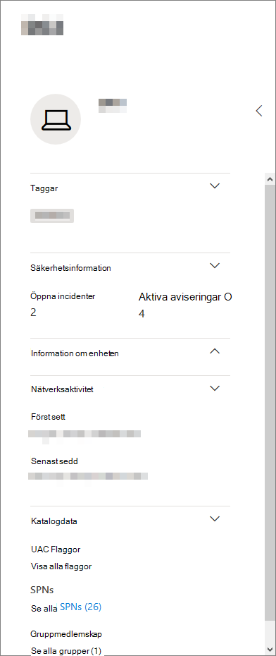

# Profilsida för enhetDevice profile page

[!INCLUDE [Microsoft 365 Defender rebranding](../includes/microsoft-defender.md)]

På Microsoft 365-säkerhetsportalen får du sidor med enhetsprofil så att du snabbt kan bedöma hälsotillståndet och status för enheter i nätverket.The Microsoft 365 security portal provides you with device profile pages, so you can quickly assess the health and status of devices on your network.

> [!IMPORTANT]
> Sidan med enhetsprofilen kan se något annorlunda ut beroende på om enheten är registrerad i Microsoft Defender för Endpoint, Microsoft Defender för identitet eller båda.The device profile page may appear slightly different, depending on whether the device is enrolled in Microsoft Defender for Endpoint, Microsoft Defender for Identity, or both.

Om enheten är registrerad i Microsoft Defender för Endpoint kan du också använda sidan med enhetsprofilen till att utföra några vanliga säkerhetsuppgifter.If the device is enrolled in Microsoft Defender for Endpoint, you can also use the device profile page to perform some common security tasks.

## Navigera på enhetens profilsidaNavigating the device profile page

Profilsidan är uppdelad i flera breda avsnitt.The profile page is broken up into several broad sections.

I sidofältet (1) finns grundläggande information om enheten.The sidebar (1) lists basic details about the device.

Huvudinnehållsområdet (2) innehåller flikar som du kan växla mellan för att visa olika typer av information om enheten.The main content area (2) contains tabs that you can toggle through to view different kinds of information about the device.

Om enheten är registrerad i Microsoft Defender för Endpoint visas även en lista över svarsåtgärder (3).If the device is enrolled in Microsoft Defender for Endpoint, you will also see a list of response actions (3). Med svarsåtgärder kan du utföra vanliga säkerhetsrelaterade uppgifter.Response actions allow you to perform common security-related tasks.

## SidofältSidebar

Bredvid huvudinnehållsområdet på enhetens profilsida finns sidofältet.Beside the main content area of the device profile page is the sidebar.

I sidofältet visas enhetens fullständiga namn och exponeringsnivå.The sidebar lists the device's full name and exposure level. Den innehåller även viktig grundläggande information i små delavsnitt som kan vara öppna eller stängda, till exempel:It also provides some important basic information in small subsections which can be toggled open or closed, such as:

* **Taggar** – Alla Microsoft Defender för Slutpunkt, Microsoft Defender för identitet eller anpassade taggar som är kopplade till enheten.**Tags** - Any Microsoft Defender for Endpoint, Microsoft Defender for Identity, or custom tags associated with the device. Taggar från Microsoft Defender för identitet kan inte redigeras.Tags from Microsoft Defender for Identity are not editable.
* **Säkerhetsinformation** – Öppna incidenter och aktiva aviseringar.**Security info** - Open incidents and active alerts. Enheter som är registrerade i Microsoft Defender för Endpoint visar också exponeringsnivå och risknivå.Devices enrolled in Microsoft Defender for Endpoint will also display exposure level and risk level.

> [!TIP]
> Exponeringsnivån relaterar till hur mycket enheten uppfyller säkerhetsrekommendationer, medan risknivån beräknas utifrån ett antal faktorer, inklusive typer och allvarlighetsgrad för aktiva varningar.Exposure level relates to how much the device is complying with security recommendations, while risk level is calculated based on a number of factors, including the types and severity of active alerts.

* **Enhetsinformation** – domän, OS, tidsstämpel för när enheten först sågs, IP-adresser, resurser.**Device details** - Domain, OS, timestamp for when the device was first seen, IP addresses, resources. Enheter som är registrerade i Microsoft Defender för Slutpunkt visar även hälsotillstånd.Devices enrolled in Microsoft Defender for Endpoint also display health state. Enheter som är registrerade i Microsoft Defender för identitet visar SAM-namn och en tidsstämpel för när enheten skapades första gången.Devices enrolled in Microsoft Defender for Identity will display SAM name and a timestamp for when the device was first created.
* **Nätverksaktivitet** – Tidsstämplar för första och senaste gången enheten sågs i nätverket.**Network activity** - Timestamps for the first time and last time the device was seen on the network.
* **Katalogdata** *(endast för enheter som är registrerade* i Microsoft Defender för identitet) – [UAC-flaggor,](https://docs.microsoft.com/windows/security/identity-protection/user-account-control/user-account-control-overview) [SPN:er](https://docs.microsoft.com/windows/win32/ad/service-principal-names)och gruppmedlemskap.**Directory data** (*only for devices enrolled in Microsoft Defender for Identity*) - [UAC](https://docs.microsoft.com/windows/security/identity-protection/user-account-control/user-account-control-overview) flags, [SPNs](https://docs.microsoft.com/windows/win32/ad/service-principal-names), and group memberships.

## SvarsåtgärderResponse actions

Svarsåtgärder är ett snabbt sätt att försvara sig mot och analysera hot.Response actions offer a quick way to defend against and analyze threats.

> [!IMPORTANT]
> * [Svarsåtgärder](https://docs.microsoft.com/windows/security/threat-protection/microsoft-defender-atp/respond-machine-alerts) är bara tillgängliga om enheten är registrerad i Microsoft Defender för Slutpunkt.[Response actions](https://docs.microsoft.com/windows/security/threat-protection/microsoft-defender-atp/respond-machine-alerts) are only available if the device is enrolled in Microsoft Defender for Endpoint.
> * Enheter som är registrerade i Microsoft Defender för Endpoint kan visa olika antal svarsåtgärder, baserat på enhetens operativsystem och versionsnummer.Devices that are enrolled in Microsoft Defender for Endpoint may display different numbers of response actions, based on the device's OS and version number.

Åtgärder som är tillgängliga på enhetens profilsida är:Actions available on the device profile page include:

* **Hantera taggar** – Uppdaterar anpassade taggar som du har tillämpat på den här enheten.**Manage tags** - Updates custom tags you have applied to this device.
* **Identifiera enhet** – Isolerar enheten från organisationens nätverk samtidigt som den är ansluten till Microsoft Defender för Endpoint.**Isolate device** - Isolates the device from your organization's network while keeping it connected to Microsoft Defender for Endpoint. Du kan välja att tillåta att Outlook, Teams och Skype för företag körs medan enheten är isolerad, i kommunikationssyfte.You can choose to allow Outlook, Teams, and Skype for Business to run while the device is isolated, for communication purposes.
* **Åtgärdscenter** – visa status för skickade åtgärder.**Action center** - View the status of submitted actions. Endast tillgängligt om en annan åtgärd redan har valts.Only available if another action has already been selected.
* **Begränsa programkörning** – Förhindrar att program som inte är signerade av Microsoft körs.**Restrict app execution** - Prevents applications that are not signed by Microsoft from running.
* **Kör antivirussökning** – Uppdaterar definitioner för Windows Defender Antivirus och kör omedelbart en antivirussökning.**Run antivirus scan** - Updates Windows Defender Antivirus definitions and immediately runs an antivirus scan. Välj mellan Snabbsökning eller Fullständig sökning.Choose between Quick scan or Full scan.
* **Samla in undersökningspaket** – Samlar in information om enheten.**Collect investigation package** - Gathers information about the device. När undersökningen har slutförts kan du ladda ned den.When the investigation is completed, you can download it.
* **Starta Live Response-session** – Läser in ett fjärrgränssnitt på enheten [för ingående säkerhetsundersökning.](https://docs.microsoft.com/windows/security/threat-protection/microsoft-defender-atp/live-response)**Initiate Live Response Session** - Loads a remote shell on the device for [in-depth security investigations](https://docs.microsoft.com/windows/security/threat-protection/microsoft-defender-atp/live-response).
* **Initiera automatisk undersökning** – [undersöker och åtgärdar hot automatiskt.](https://docs.microsoft.com/microsoft-365/security/office-365-security/office-365-air)**Initiate automated investigation** - Automatically [investigates and remediates threats](https://docs.microsoft.com/microsoft-365/security/office-365-security/office-365-air). Även om du manuellt kan utlösa automatiska undersökningar från den här sidan utlöser vissa [aviseringsprinciper](https://docs.microsoft.com/microsoft-365/compliance/alert-policies?view=o365-worldwide#default-alert-policies) automatiska undersökningar på egen hand.Although you can manually trigger automated investigations to run from this page, [certain alert policies](https://docs.microsoft.com/microsoft-365/compliance/alert-policies?view=o365-worldwide#default-alert-policies) trigger automatic investigations on their own.
* **Åtgärdscenter** – Visar information om alla svarsåtgärder som körs.**Action center** - Displays information about any response actions that are currently running.

## Avsnittet FlikarTabs section

Med hjälp av enhetsprofilflikarna kan du växla mellan en översikt över säkerhetsinformation om enheten och tabeller som innehåller en lista med aviseringar.The device profile tabs allow you to toggle through an overview of security details about the device, and tables containing a list of alerts.

Enheter som är registrerade i Microsoft Defender för Endpoint visar även flikar som innehåller en tidslinje, en lista med säkerhetsrekommendationer, en inventering av programvara, en lista över identifierade svagheter och saknade KBs (säkerhetsuppdateringar).Devices enrolled in Microsoft Defender for Endpoint will also display tabs that feature a timeline, a list of security recommendations, a software inventory, a list of discovered vulnerabilities, and missing KBs (security updates).

### Fliken ÖversiktOverview tab

Standardfliken är **Översikt.**The default tab is **Overview**. Det ger en snabb översikt över den viktigaste säkerhets information om enheten.It provides a quick look at the most important security fact about the device.

Här kan du få en snabb översikt över enhetens aktiva aviseringar och de användare som är inloggade.Here, you can get a quick look at the device's active alerts, and any currently logged on users.

Om enheten är registrerad i Microsoft Defender för Endpoint visas även enhetens risknivå och alla tillgängliga data i säkerhetsutvärderingar.If the device is enrolled in Microsoft Defender for Endpoint, you will also see the device's risk level and any available data on security assessments. Säkerhetsutvärderingarna beskriver enhetens exponeringsnivå, ger säkerhetsrekommendationer och listar påverkade program och upptäckta svagheter.The security assessments describe the device's exposure level, provide security recommendations, and list affected software and discovered vulnerabilities.

### Fliken AviseringarAlerts tab

Fliken **Aviseringar** innehåller en lista med aviseringar som har höjts på enheten från både Microsoft Defender för identitet och Microsoft Defender för slutpunkt.The **Alerts** tab contains a list of alerts that have been raised on the device, from both Microsoft Defender for Identity and Microsoft Defender for Endpoint.

Du kan anpassa antalet objekt som visas och vilka kolumner som visas för varje objekt.You can customize the number of items displayed, as well as which columns are displayed for each item. Standardbeteendet är att lista trettio objekt per sida.The default behavior is to list thirty items per page.

Kolumnerna på den här fliken innehåller information om allvarlighetsgraden för det hot som utlöste aviseringen, samt status, undersökningstillstånd och vem som aviseringen har tilldelats.The columns in this tab include information on the severity of the threat that triggered the alert, as well as status, investigation state, and who the alert has been assigned to.

Kolumnen *påverkade enheter* refererar till den enhet (entitet) vars profil du visar för närvarande, plus alla andra enheter i nätverket som påverkas.The *impacted entities* column refers to the device (entity) whose profile you are currently viewing, plus any other devices in your network that are affected.

Om du väljer ett objekt i den här listan öppnas en utfäll tillgänglig meny med ännu mer information om den markerade aviseringen.Selecting an item from this list will open a flyout containing even more information about the selected alert.

Listan kan filtreras efter allvarlighetsgrad, status eller vem aviseringen har tilldelats.This list can be filtered by severity, status, or who the alert has been assigned to.

### Fliken TidslinjeTimeline tab

Fliken **Tidslinje** innehåller ett interaktivt, kronologiskt diagram över alla händelser som upphöjts på enheten.The **Timeline** tab includes an interactive, chronological chart of all events raised on the device. Genom att flytta det markerade området i diagrammet åt vänster eller höger kan du visa händelser över olika tidsperioder.By moving the highlighted area of the chart left or right, you can view events over different periods of time. Du kan också välja ett anpassat datumintervall i den nedrullningsbara menyn mellan det interaktiva diagrammet och listan med händelser.You can also choose a custom range of dates from the dropdown menu in between the interactive chart and the list of events.

Under diagrammet finns en lista över händelser för det valda datumintervallet.Below the chart is a list of events for the selected range of dates.

Antalet objekt som visas och kolumnerna i listan kan båda anpassas.The number of items displayed and the columns on the list can both be customized. I standardkolumnerna visas händelsetiden, aktiv användare, åtgärdstyp, enheter (processer) och ytterligare information om händelsen.The default columns list the event time, active user, action type, entities (processes), and additional information about the event.

Om du väljer ett objekt i den här listan öppnas en utfällsymbol som visar en diagram över händelseenheter, som visar de överordnade och underordnade processerna som ingår i händelsen.Selecting an item from this list will open a flyout displaying an Event entities graph, showing the parent and child processes involved in the event.

Listan kan filtreras efter den specifika typen av händelse. Till exempel registerhändelser eller smartskärmshändelser.The list can be filtered by the specific kind of event; for example, Registry events or Smart Screen Events.

Listan kan också exporteras till en CSV-fil för nedladdning.The list can also be exported to a CSV file, for download. Även om filen inte begränsas av antalet händelser är det maximala tidsperioden du kan välja att exportera sju dagar.Although the file is not limited by number of events, the maximum time range you can choose to export is seven days.

### Fliken SäkerhetsrekommendationerSecurity recommendations tab

Fliken **Säkerhetsrekommendationer** innehåller åtgärder du kan vidta för att skydda enheten.The **Security recommendations** tab lists actions you can take to protect the device. Om du markerar ett objekt i den här listan öppnas en utfäll fri meny där du hittar anvisningar om hur du använder rekommendationen.Selecting an item on this list will open a flyout where you can get instructions on how to apply the recommendation.

Precis som på föregående flikar går det att anpassa antalet objekt som visas per sida och vilka kolumner som visas.As with the previous tabs, the number of items displayed per page, as well as which columns are visible, can be customized.

Standardvyn innehåller kolumner som beskriver säkerhetsbristerna, de associerade hoten, den relaterade komponent eller programvara som påverkas av hotet och mycket mer.The default view includes columns that detail the security weaknesses addressed, the associated threat, the related component or software affected by the threat, and more. Objekt kan filtreras efter rekommendationens status.Items can be filtered by the recommendation's status.

### ProgramvaruinventeringSoftware inventory

På **fliken för programvaruinventering** visas programvara som är installerad på enheten.The **Software inventory** tab lists software installed on the device.

I standardvyn visas programvaruleverantören, installerat versionsnummer, antal kända programvarubrister, hotinsikter, produktkod och taggar.The default view displays the software vendor, installed version number, number of known software weaknesses, threat insights, product code, and tags. Antalet objekt som visas och vilka kolumner som visas kan båda anpassas.The number of items displayed and which columns are displayed can both be customized.

Om du väljer ett objekt i den här listan öppnas en utfällväg med mer information om den valda programvaran samt sökväg och tidsstämpel för den senaste gången programvaran hittades.Selecting an item from this list opens a flyout containing more details about the selected software, as well as the path and timestamp for the last time the software was found.

Den här listan kan filtreras efter produktkod.This list can be filtered by product code.

### Fliken Upptäckta svagheterDiscovered vulnerabilities tab

På **fliken Identifierade svagheter** finns en lista över vanliga säkerhetsproblem och sårbarheter (CVEs) som kan påverka enheten.The **Discovered vulnerabilities** tab lists any Common Vulnerabilities and Exploits (CVEs) that may affect the device.

I standardvyn visas allvarlighetsgraden för CVE, COMMON Vulnerability Score (CVS), programvaran som är relaterad till CVE, när CVE publicerades, när CVE uppdaterades senast och hot kopplade till CVE.The default view lists the severity of the CVE, the Common Vulnerability Score (CVS), the software related to the CVE, when the CVE was published, when the CVE was last updated, and threats associated with the CVE.

Precis som med föregående flikar kan antalet objekt som visas och vilka kolumner som visas anpassas.As with the previous tabs, the number of items displayed and which columns are visible can be customized.

Om du väljer ett objekt i listan öppnas en utfälltext som beskriver CVE-objektet.Selecting an item from this list will open a flyout that describes the CVE.

### Saknade KBsMissing KBs

På **fliken saknade KBS** visas alla Microsoft-uppdateringar som ännu inte har tillämpats på enheten.The **Missing KBs** tab lists any Microsoft Updates that have yet to be applied to the device. De "KBs" som är i fråga [är Knowledge Base-artiklar](https://support.microsoft.com/help/242450/how-to-query-the-microsoft-knowledge-base-by-using-keywords-and-query) som beskriver dessa uppdateringar. till exempel [KB4551762.](https://support.microsoft.com/help/4551762/windows-10-update-kb4551762)The "KBs" in question are [Knowledge Base articles](https://support.microsoft.com/help/242450/how-to-query-the-microsoft-knowledge-base-by-using-keywords-and-query) which describe these updates; for example, [KB4551762](https://support.microsoft.com/help/4551762/windows-10-update-kb4551762).

I standardvyn visas en anslagstavla med information om uppdateringar, OS-version, produkter som påverkas, adresserade CV:er, KB-nummer och taggar.The default view lists the bulletin containing the updates, OS version, products affected, CVEs addressed, the KB number, and tags.

Antalet objekt som visas per sida och vilka kolumner som visas kan anpassas.The number of items displayed per page and which columns are displayed can be customized.

Om du markerar ett objekt öppnas en utfällblad som länkar till uppdateringen.Selecting an item will open a flyout that links to the update.

## Relaterade ämnenRelated topics

* [Översikt över Microsoft 365 DefenderMicrosoft 365 Defender overview](microsoft-threat-protection.md)
* [Aktivera Microsoft 365 DefenderTurn on Microsoft 365 Defender](mtp-enable.md)
* [Undersök enheter på enheter med live-svarInvestigate entities on devices, using live response](https://docs.microsoft.com/windows/security/threat-protection/microsoft-defender-atp/live-response)
* [Automatiserad undersökning och svar (AIR) i Office 365Automated investigation and response (AIR) in Office 365](https://docs.microsoft.com/microsoft-365/security/office-365-security/office-365-air)
