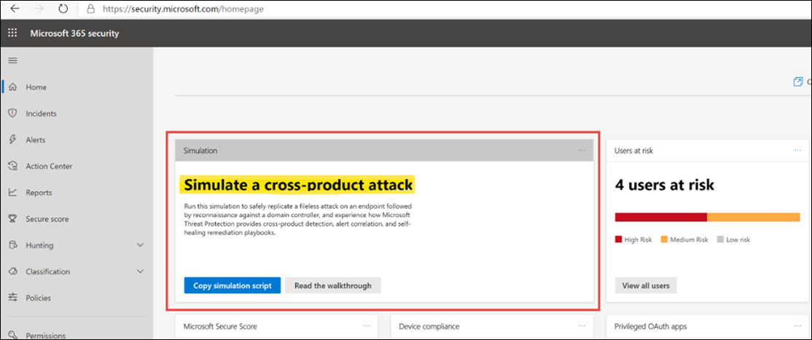

# Skapa en test avisering i utvärderings labb för Microsoft 365 DefenderGenerate a test alert in your Microsoft 365 Defender evaluation lab  

[!INCLUDE [Microsoft 365 Defender rebranding](../includes/microsoft-defender.md)]

**Gäller för:****Applies to:**
- Microsoft 365 DefenderMicrosoft 365 Defender

Nu när du har slutfört installationen och konfigurationen av utvärderings laboratoriet för Microsoft 365 Defender kan du köra en simulering av en hot attack för att få identifiering, varnings korrelation och själv återställnings funktioner i den integrerade säkerhets lösningen.Now that you've completed your Microsoft 365 Defender evaluation lab setup and configuration, you can run a threat attack simulation to experience the detection, alert correlation, and self-healing remediation capabilities of the integrated security solution.  

1. Logga in på https://security.microsoft.comLog on to https://security.microsoft.com
2. Leta reda på en panel med rubriker på Start **sidan.**On the Home page, look for a tile titled **Simulation**.  Läs igenom anvisningarna för att skapa en test incident i Microsoft 365 Defender.Review the walkthrough guide for steps to create a test incident in Microsoft 365 Defender.
   

## Nästa stegNext steps

Bläddra igenom [Microsoft 365-lösning och-arkitektur Center](https://docs.microsoft.com/microsoft-365/solutions/solution-architecture-center) för att förstå hur du utformar lösningen och arkitekturen som passar din organisation.Browse through the [Microsoft 365 solution and architecture center](https://docs.microsoft.com/microsoft-365/solutions/solution-architecture-center) to understand how to design the solution and architecture that is right for your organization.

