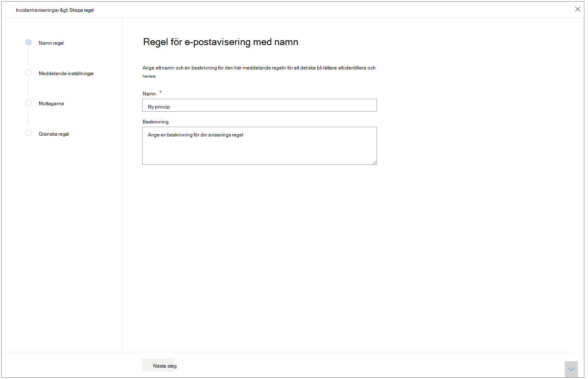
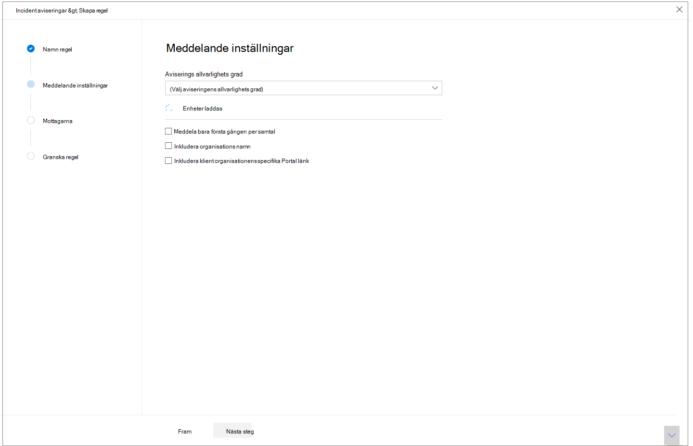
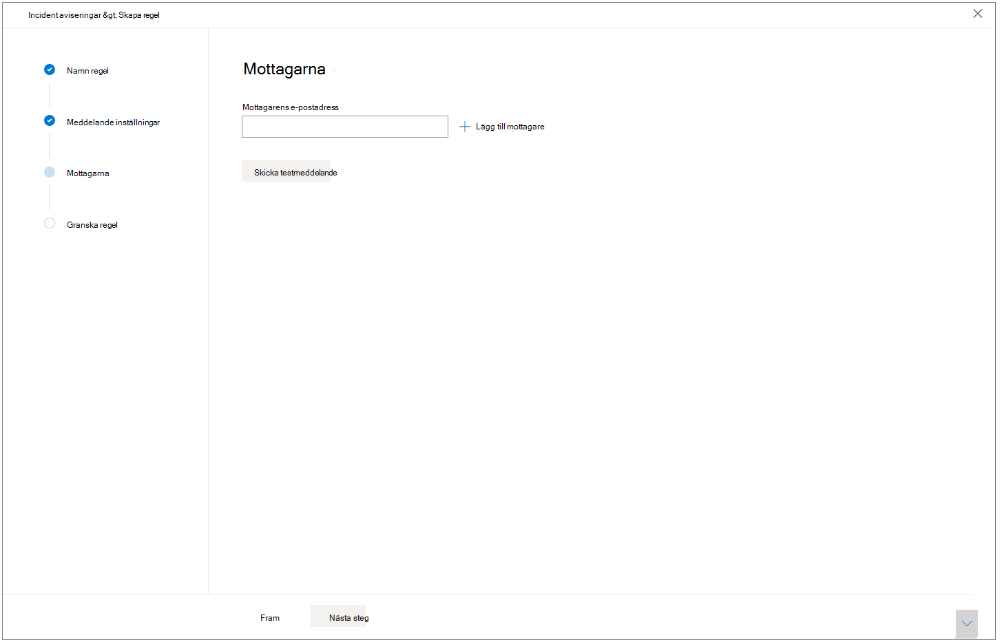

# Få incidentaviseringar via e-post

[!INCLUDE [Microsoft 365 Defender rebranding](../includes/microsoft-defender.md)]

**Gäller för:**
- Microsoft 365 Defender

Du kan konfigurera Microsoft 365 Defender så att du får ett e-postmeddelande varje gång det finns nya incidenter eller nya uppdateringar av befintliga incidenter. 

Du kan välja att få aviseringar utifrån allvarlighetsgrad eller enhetsgrupp. Du kan också välja att bara få ett meddelande vid den första uppdateringen per incident.

Du kan lägga till eller ta bort mottagare i e-postaviseringarna. Nyligen tillagda mottagare får ett meddelande om incidenter när de har lagts till. 

E-postmeddelandet innehåller viktig information om incidenten, bland annat incidentens namn, allvarlighetsgrad och kategorier. Du kan också gå direkt till incidenterna så att du kan börja din undersökning direkt. Mer information om hur du undersöker incidenter [finns i Undersöka incidenter i Microsoft 365 Defender.](./investigate-incidents.md)

>[!NOTE]
>Du behöver behörigheten Hantera säkerhetsinställningar för att konfigurera inställningar för e-postaviseringar. Om du har valt att använda grundläggande behörighetshantering kan användare med roller som säkerhetsadministratör eller global administratör konfigurera e-postaviseringar åt dig.    
På samma sätt kan du, om din organisation använder rollbaserad åtkomstkontroll (RBAC), bara skapa, redigera, ta bort och ta emot meddelanden baserat på enhetsgrupper som du har behörighet att hantera.

## Skapa regler för incidentmeddelanden

Om du vill konfigurera din första e-postavisering för incidenter skapar du en ny regel och anpassar inställningarna för e-postaviseringar.

1. Välj Inställningar Incident-e-postaviseringar   >  **i navigeringsfönstret.**
2. Välj **Lägg till objekt.**
3. Ge regeln ett namn i **Namn och** ange en **beskrivning**.

     
4. Välj **Nästa för** att gå till **Meddelandeinställningar**. Här kan du ange:
    - **Aviserings allvarlighetsgrad** – Välj den aviserings allvarlighetsgrad som utlöser en incidentavisering. Om du till exempel bara vill informeras om incidenter med hög allvarlighetsgrad väljer du Hög.
    - **Enhetsgruppomfattning** – I den här listrutan visas alla enhetsgrupper som användaren kan komma åt. Välj vilken enhetsgrupper du skapar aviseringsregler för.
    - **Meddela endast vid första förekomsten per incident** – Om du väljer det här alternativet skickas bara en e-postavisering i den första aviseringen som matchar dina andra val. Senare uppdateringar eller aviseringar relaterade till händelsen utlöser inte någon avisering.
    - **Inkludera organisationsnamn** – anger om kundnamnet visas i e-postmeddelandet eller inte.
    - **Inkludera klientspecifik portallänk – Lägger** till en länk med klientorganisations-ID:t för att tillåta åtkomst till en viss klientorganisation.
    
    
5. Välj **Nästa** för att gå **till avsnittet** Mottagare. Här kan du ange e-postadresser som ska ta emot e-postaviseringarna. Välj **Lägg till en mottagare när** du har skrivit varje e-postadress.

     

6. Välj Nästa **för att** gå till Granska regel **så** att du kan se alla inställningar som är kopplade till den nya regeln. Mottagarna får incidentaviseringar via e-post baserat på inställningarna.

## Se även
- [Översikt över incidenter i Microsoft 365 Defender](./incidents-overview.md)
- [Prioritera incidenter i Microsoft 365 Defender](./incident-queue.md)
- [Undersöka incidenter i Microsoft 365 Defender](./investigate-incidents.md)