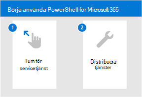

# Komma igång med Microsoft 365 för DefenderGet started with Microsoft 365 for Defender

[!INCLUDE [Microsoft 365 Defender rebranding](../includes/microsoft-defender.md)]

**Gäller för:****Applies to:**
- Microsoft 365 DefenderMicrosoft 365 Defender

[!INCLUDE [Prerelease](../includes/prerelease.md)]

Microsoft 365 Defender är en enhetlig upplevelse där du kan övervaka och hantera säkerhet i hela företaget.Microsoft 365 Defender is a unified experience where you can monitor and manage security across your enterprise. Med integrerade aviseringar för identiteter, slutpunkter, data, appar, e-post och samarbetsverktyg – undersöker och svarar på hot sker det nu på en central plats.With the integrated alerts across identities, endpoints, data, apps, email, and collaboration tools - investigating and responding to threats now happen in a central location. 

I det här avsnittet får du de enkla steg du behöver vidta för att komma igång med Microsoft 365 Defender, oavsett om du är nybörjare i Microsoft-paketet med säkerhetsprodukter eller känner till de enskilda arbetsflödena.Whether you're new to the Microsoft suite of security products or familiar with individual workflows, this topic will guide you in the simple steps you need to take to get started with Microsoft 365 Defender.

I allmänhet måste du vidta följande steg för att komma igång:In general, you'll need to take the following steps to get started:

- **[Steg 1: Aktivera Microsoft 365 Defender](mtp-enable.md)****[Step 1: Turn on Microsoft 365 Defender](mtp-enable.md)**  
    Först måste du aktivera tjänsten genom att kontrollera att du har rätt licens och att roller har tilldelats så att du kan komma åt portalen.You'll first need to turn on the service by making sure you have the right license in place and roles are assigned so that you can access the portal. 

    Sedan går du igenom några enkla inställningar och sedan kan du bekräfta att tjänsten är på.You'll then go through some simple settings and then you can confirm that the service is on.

- **[Steg 2: Distribuera tjänster som stöds](deploy-supported-services.md)****[Step 2: Deploy supported services](deploy-supported-services.md)**  
    När du har slutfört de första stegen måste du distribuera de tjänster som stöds som följer med Microsoft 365 Defender.After completing the initial steps, you'll need to deploy the supported services that come with Microsoft 365 Defender. När du distribuerar tjänster syns signalerna från tillgångar i nätverket mer effektivt.Deploying services effectively increases your visibility in the signals from assets across your network.

## Viktiga funktionerKey capabilities
Om du slår på Microsoft 365 Defender och distribuerar tjänster får du tillgång till följande nyckelfunktioner:Turning on Microsoft 365 Defender and deploying services will give you access to the following key capabilities:

| FunktionCapability | BeskrivningDescription |
| ------ | ------ |
| Microsoft Defender för EndpointMicrosoft Defender for Endpoint | Slutpunktsskyddssvit som är uppbyggd kring kraftfulla funktionsintelligenser, molnanalyser och hotinformationEndpoint protection suite built around powerful behavioral sensors, cloud analytics, and threat intelligence |
|Microsoft Defender för Office 365Microsoft Defender for Office 365 | Avancerat skydd för appar och data i Office 365, inklusive e-post och andra samarbetsverktygAdvanced protection for your apps and data in Office 365, including email and other collaboration tools |
| Microsoft Defender for IdentityMicrosoft Defender for Identity | Försvara sig mot avancerade hot, komprometterade identiteter och skadliga insiders med korrelerade Active Directory-signalerDefend against advanced threats, compromised identities, and malicious insiders using correlated Active Directory signals |
| Microsoft Cloud App SecurityMicrosoft Cloud App Security | Identifiera och bekämpa cyberhot med Microsofts och tredjepartsmolntjänsterIdentify and combat cyberthreats across your Microsoft and third-party cloud services |

