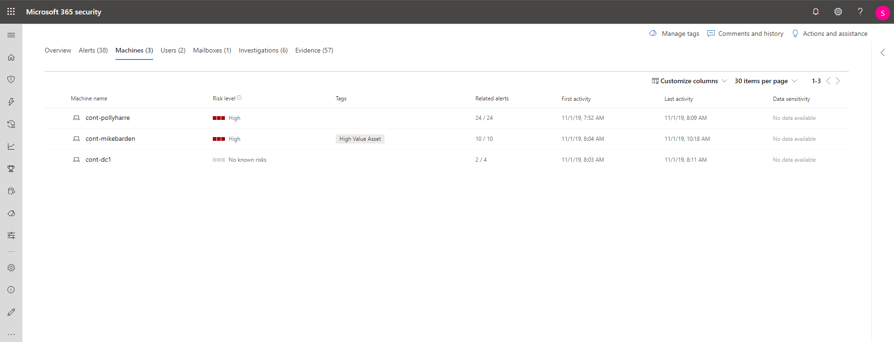

# Undersök incidenter i skydd mot Microsoft ThreatInvestigate incidents in Microsoft Threat Protection

[!INCLUDE [Microsoft 365 Defender rebranding](../includes/microsoft-defender.md)]

**Gäller för:****Applies to:**

- Microsoft HotskyddMicrosoft Threat Protection

Microsoft Threat Protection aggregerar alla relaterade aviseringar, till gångar, undersökningar och fakta från enheter, användare och post lådor för att ge dig en omfattande titt på hela bredden på en attack.Microsoft Threat Protection aggregates all related alerts, assets, investigations and evidence from across your devices, users, and mailboxes to give you a comprehensive look into the entire breadth of an attack.

Undersök vilka aviseringar som påverkar ditt nätverk, förstå vad de betyder och samla in bevis som är kopplade till incidenterna så att du kan utforma en effektiv reparations plan.Investigate the alerts that affect your network, understand what they mean, and collate evidence associated with the incidents so that you can devise an effective remediation plan.

## Undersök en olyckaInvestigate an incident

1. Välj en incident från incident kön.Select an incident from the incident queue.   Då öppnas en sido panel med en förhands granskning av viktig information som status, allvarlighets grad, kategorier och berörda enheter.This opens a side panel and gives a preview of important information such as status, severity, categories, and the impacted entities.

    

2. Välj **Open incident-sida**.Select **Open incident page**.   Då öppnas sidan incident där du hittar mer information om incidenter, kommentarer och åtgärder, flikar (översikt, notifieringar, enheter, användare, undersökningar, bevis).This opens the incident page where you'll find more information incident details, comments and actions, tabs (overview, alerts, devices, users, investigations, evidence).

3. Granska aviseringar, enheter, användare, andra enheter inblandade i incidenten.Review the alerts, devices, users, other entities involved in the incident.

## Incident översiktIncident overview

Med översikts sidan kan du snabbt och enkelt se en ögonblicks bild.The overview page gives you a snapshot glance into the top things to notice about the incident.

I angrepps kategorierna får du visuell och numerisk vy av hur Avancerat angreppet har framskridit mot Kill-kedjan.The attack categories give you visual and numeric view of how advanced the attack has progressed against the kill chain. Precis som med andra Microsoft-säkerhetsprodukter är skydd mot Microsoft Threat det [Mitre för&CK &trade; ](https://attack.mitre.org/) -ramverk.As with other Microsoft security products, Microsoft Threat Protection is aligned to the [MITRE ATT&CK&trade;](https://attack.mitre.org/) framework.

I avsnittet omfattning får du en lista över de mest berörda till gångarna som är en del av den här incidenten.The scope section gives you a list of top impacted assets that are part of this incident. Om det finns specifik information om den här till gången, till exempel risk nivå, undersöknings prioritet och eventuella taggning på till gångar, visas även i det här avsnittet.If there is specific information regarding this asset, such as risk level, investigation priority as well as any tagging on the assets this will also surface in this section.

Tids linjen för påminnelser ger en förhandstitt på den kronologiska ordning i vilken aviseringarna inträffade, samt orsakerna till att dessa varningar är länkade till denna incident.The alerts timeline provides a sneak peek into the chronological order in which the alerts occurred, as well as the reasons that these alerts linked to this incident.

Och sist-beviset visar en sammanfattning av hur många olika artefakter som ingår i incidenten och deras reparations status, så att du omedelbart kan avgöra om en åtgärd krävs för ditt slut.And last - the evidence section provides a summary of how many different artifacts were included in the incident and their remediation status, so you can immediately identify if any action is needed on your end.

Denna översikt kan hjälpa till med den inledande postsortering av incidenten genom att ge insyn i de viktigaste egenskaperna hos den olycka som du bör vara medveten om.This overview can assist in the initial triage of the incident by providing insight to the top characteristics of the incident that you should be aware of.

## VarningarAlerts

Du kan visa alla aviseringar som rör incidenten och annan information om dem, till exempel allvarlighets grad, enheter som ingick i aviseringen, källan till aviseringarna (Azure ATP, Microsoft Defender ATP, Office 365 ATP) och anledningen till att de sammanlänkade.You can view all the alerts related to the incident and other information about them such as severity, entities that were involved in the alert, the source of the alerts (Azure ATP, Microsoft Defender ATP , Office  365 ATP) and the reason they were linked together.

Som standard ordnas aviseringarna kronologiskt, så att du kan se hur angreppet spelas upp med tiden.By default, the alerts are ordered chronologically, to allow you to first view how the attack played out over time. Om du klickar på varje varning kommer du till relevant aviserings sida där du kan genomföra en djupgående undersökning av den aviseringen.Clicking on each alert will lead you to the relevant alert page where you can conduct an in depth investigation of that alert.

## AnordningarDevices

På fliken enheter visas alla enheter där aviseringar som rör händelsen är synliga.The devices tab lists all the devices where alerts related to the incident are seen.

Om du klickar på namnet på den dator där angreppet har gjorts navigerar du till dess dator sida där du kan se de meddelanden som utlöstes med den och relaterade händelser för att under lätta undersökningen.Clicking the name of the machine where the attack was conducted navigates you to its Machine page where you can see alerts that were triggered on it and related events provided to ease investigation.

Om du väljer fliken tids linje kan du bläddra igenom datorns tids linje och Visa alla händelser och funktioner som observerats på datorn i kronologisk ordning, direkt med aviseringar.Selecting the Timeline tab enables you to scroll through the machine timeline and view all events and behaviors observed on the machine in chronological order, interspersed with the alerts raised.

## AnvändareUsers

Se vilka användare som har identifierats som en del av eller är relaterade till en viss olycka.See users that have been identified to be part of, or related to a given incident.

Om du klickar på användar namnet navigerar du till användarens moln program säkerhets sida där ytterligare undersökningar kan genomföras.Clicking the username navigates you to the user's Cloud App Security page where further investigation can be conducted.

## Post lådorMailboxes

Undersök brev lådor som har identifierats som en del av eller är relaterade till en olycka.Investigate mailboxes that's been identified to be part of, or related to an incident. Om du vill göra ytterligare utrednings arbete genom att välja e-postrelaterad varning öppnas Office 365 Avancerat skydd där du kan utföra reparations åtgärder.To do further investigative work, selecting the mail related alert will open Office 365 Advanced Threat Protection where you can take remediation actions.

## UtredningarInvestigations

Välj **undersökningar** för att se alla automatiserade utredningar som utlöstes av notifieringar under den här incidenten.Select **Investigations** to see all the automated investigations triggered by alerts in this incident. Undersökningen utför reparations åtgärder eller väntar på att godkänna godkännande av åtgärder, beroende på hur du har konfigurerat dina automatiserade utredningar att köra i Microsoft Defender ATP och Office 365 Avancerat skydd.The investigations will perform remediation actions or wait for analyst approval of actions, depending on how you configured your automated investigations to run in Microsoft Defender ATP and Office 365 Advanced Threat Protection.

Välj en undersökning för att gå till sidan med gransknings informationen för att få fullständig information om undersökningen och reparations status.Select an investigation to navigate to the Investigation details page to get full information on the investigation and remediation status. Om det finns några åtgärder som väntar på godkännande som en del av undersökningen kommer de att synas på fliken väntande åtgärder. Vidta en åtgärd som en del av incident åtgärden.If there are any actions pending for approval as part of the investigation they will appear in the Pending actions tab. Take action as part of incident remediation.

## LäggsEvidence

Microsoft Threat Protection undersöker automatiskt alla händelser och misstänkta enheter som stöds av incidenter och ger dig automatiskt svar och information om viktiga filer, processer, tjänster, e-postmeddelanden och annat.Microsoft Threat Protection automatically investigates all the incidents' supported events and suspicious entities in the alerts, providing you with auto-response and information about the important files, processes, services, emails, and more. Det gör det enkelt att upptäcka och blockera potentiella hot i olyckan.This helps quickly detect and block potential threats in the incident.

Alla analyserade enheter markeras med en Verdict (skadlig, misstänkt, ren) och en reparations status.Each of the analyzed entities will be marked with a verdict (Malicious, Suspicious, Clean) as well as a remediation status. Det här hjälper dig att förstå reparations status för hela incidenten och vilka som är nästa steg som kan åtgärdas.This assists you in understanding the remediation status of the entire incident and what are the next steps that can be taken to further remediate.

## Relaterade ämnenRelated topics

- [Incident översiktIncidents overview](incidents-overview.md)
- [Prioritera incidenterPrioritize incidents](incident-queue.md)
- [Hantera incidenterManage incidents](manage-incidents.md)

