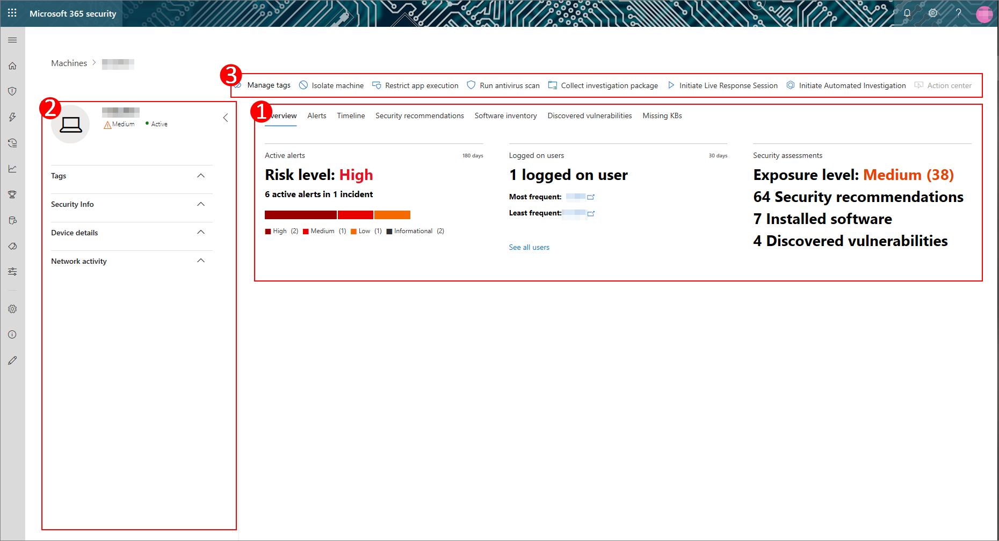
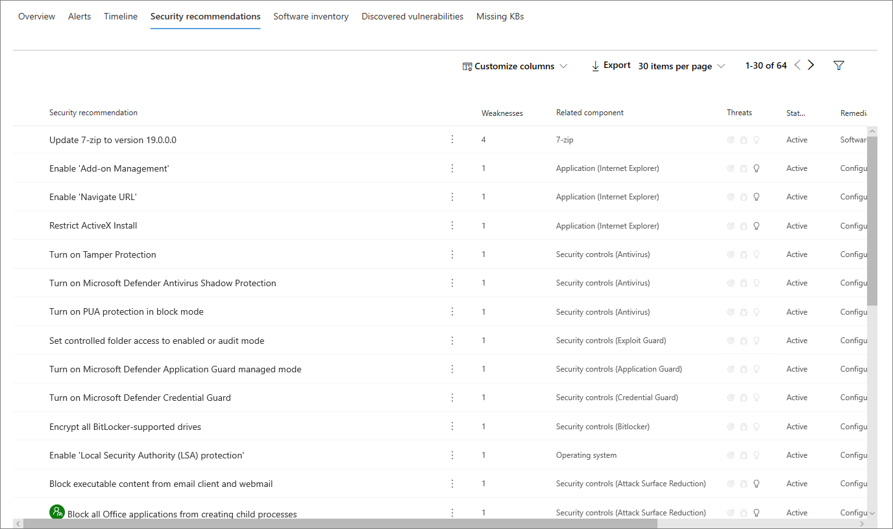
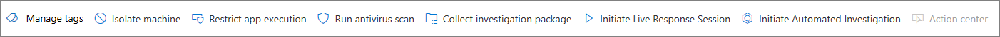

# Sidan Maskinprofil

Microsoft 365-säkerhetsportalen ger dig datorprofilsidor, så att du kan bedöma hälsotillståndet och statusen för enheter i nätverket. Varje datorprofilsida innehåller en mängd information om enheten.

Du kan granska djupgående information om vilken programvara den kör, eventuella tidigare och nuvarande säkerhetshändelser eller varningar och hitta länkar till relevanta programkorrigeringar.

Du kan också använda datorprofilen för att utföra vanliga säkerhetsrelaterade uppgifter och snabbt granska grundläggande information om enheten.

## Navigera på profilsidan För maskin

Maskinprofilsidan är uppdelad i tre sektioner.

Huvudinnehållsområdet (1) innehåller sju flikar som du kan växla igenom för att visa olika typer av information om maskinen.

Sidofältet (2) listar grundläggande detaljer om maskinen.

Det finns också svarsåtgärder som är tillgängliga i ett sidhuvud (3) före sidofältet och huvudinnehållsavsnitten. Du kan använda åtgärderna i det här huvudet för att utföra vanliga säkerhetsrelaterade uppgifter.

## Avsnittet Flikar

Med flikarna Maskinprofil kan du växla genom en översikt över säkerhetsinformation om datorn och tabeller som innehåller en lista med aviseringar, en tidslinje, en lista över säkerhetsrekommendationer, en programvaruinventering, en lista över identifierade sårbarheter och saknas KBs (säkerhetsuppdateringar).

### Fliken Översikt

Standardfliken är **Översikt**. Det ger en snabb titt på det viktigaste säkerhetsfaktat om enheten.

Här kan du hitta ett diagram över enhetens risknivå och aktiva varningar, alla som för närvarande är inloggade på användare, en kort lista över de flesta och minst frekventa användare och säkerhetsbedömningar som beskriver enhetens exponeringsnivå, säkerhetsrekommendationer, påverkad programvara och upptäckta sårbarheter.

### Fliken Aviseringar

Fliken **Aviseringar** innehåller en lista över aviseringar som har rapporterats på enheten.

Du kan anpassa antalet objekt som visas, samt vilka kolumner som visas för varje objekt. Standardbeteendet är att lista 30 objekt per sida och att 11 kolumner växlas på att visas.

Kolumnerna på den här fliken innehåller information om allvarlighetsgraden för det hot som utlöste aviseringen, samt status, undersökningstillstånd och vem om någon aviseringen har tilldelats.

Kolumnen *påverkade entiteter* refererar till den dator (entitet) vars profil du för närvarande visar, plus alla andra datorer i nätverket som påverkas.

Om du väljer ett objekt i den här listan öppnas en länk till den valda aviseringen.

Den här listan kan filtreras efter allvarlighetsgrad, status eller mottagare.

### Fliken Tidslinje

Fliken **Tidslinje** innehåller ett interaktivt, kronologiskt diagram över händelser som lyfts upp på enheten. Genom att flytta det markerade området i diagrammet kan du visa händelser över olika tidsperioder. Du kan också skriva in ett anpassat datumintervall.

Nedanför diagrammet finns en lista över händelser för det valda datumintervallet.

Antalet objekt som visas och kolumnerna i listan kan båda anpassas. Standardkolumnerna listar händelsetid, aktiv användare, åtgärdstyp, entiteter (processer) och ytterligare information om händelsen.

Om du väljer ett objekt i listan öppnas ett utfällbart objekt som visar ett diagram över en entiteter för händelser som visar de överordnade och underordnade processer som utlöste händelsen.

Den här listan kan filtreras efter den specifika typen av händelse. till exempel registerhändelser eller smartskärmshändelser.

### Fliken Säkerhetsrekommendationer

På fliken **Säkerhetsrekommendationer** visas åtgärder som du kan vidta för att skydda enheten. Om du väljer ett objekt i den här listan öppnas ett utfällbart objekt där du kan få instruktioner om hur du tillämpar rekommendationen.

Precis som med föregående flikar kan antalet objekt som visas per sida och vilka kolumner som är synliga anpassas.

Standardvyn innehåller kolumner som beskriver de säkerhetsbrister som åtgärdats, det associerade hotet, den relaterade komponenten eller programvaran som påverkas av hotet med mera. Artiklar kan filtreras efter rekommendationens status.

### Inventering av programvara

På fliken **Programvaruinventering** visas programvara som är installerad på enheten.

Standardvyn visar programvaruleverantören, installerat versionsnummer, antal kända programvarubrister, hotinsikter, produktkod och taggar. Antalet objekt som visas och vilka kolumner som visas kan båda anpassas.

Om du väljer ett objekt från den här listan öppnas ett utfällbart objekt som innehåller mer information om den valda programvaran, samt sökvägen och tidsstämpeln för den senaste gången programvaran hittades.

Den här listan kan filtreras efter produktkod.

### Fliken Upptäckta säkerhetsproblem

På fliken **Identifierade säkerhetsproblem** visas alla vanliga sårbarheter och är änder (CVE) som kan påverka enheten.

Standardvyn visar allvarlighetsgraden för CVE, CVS (Common Vulnerability Score), programvaran som är relaterad till CVE, när CVE publicerades, när CVE senast uppdaterades och hot som är associerade med CVE.

Precis som med föregående flikar kan antalet objekt som visas och vilka kolumner som är synliga anpassas.

Om du väljer ett objekt i den här listan öppnas ett utfällbart objekt som beskriver CVE.

### KBs saknas

På fliken **Saknade KBs** visas alla Microsoft-uppdateringar som ännu inte har tillämpats på datorn. De "KBs" i fråga är [Knowledge Base artiklar](https://support.microsoft.com/help/242450/how-to-query-the-microsoft-knowledge-base-by-using-keywords-and-query) som beskriver dessa uppdateringar; till exempel [KB4551762](https://support.microsoft.com/help/4551762/windows-10-update-kb4551762).

Standardvyn visar bulletinen som innehåller uppdateringar, OS-version, berörda produkter, CVEs-adresserade, KB-numret och taggarna.

Antalet objekt som visas per sida och vilka kolumner som visas kan anpassas.

Om du väljer ett objekt öppnas ett utfällbart objekt som länkar till uppdateringen.

## Sidofältet

Bredvid huvudinnehållsområdet på sidan Maskinprofil är sidofältet.

Sidofältet ger viktig grundläggande information i små underavsnitt som kan växlas öppna eller stängda:

* **Taggar** - Alla taggar som är associerade med enheten
* **Säkerhetsinformation** - Öppna incidenter, aktiva varningar, exponeringsnivå och risknivå
* **Enhetsinformation** - Domän-, OS-, tillgångsgrupp, hälsotillstånd, datakänslighet och IP-adresser
* **Nätverksaktivitet** - Tidsstämplar för första gången och sista gången enheten sågs i nätverket

Det här avsnittet innehåller också enhetens namn och exponeringsnivå och en ikon som anger om den för närvarande är aktiv i nätverket.

## Svarsåtgärder

Svarsåtgärder erbjuder ett snabbt sätt att försvara sig mot och analysera hot.

De svarsåtgärder som är tillgängliga för dig här inkluderar:

* **Hantera taggar** – Uppdaterar anpassade taggar som du har använt på den här enheten.
* **Isolera datorn** – isolerar datorn från organisationens nätverk samtidigt som den är ansluten till Microsoft Defender Advanced Threat Protection. Du kan välja att låta Outlook, Teams och Skype för företag köras medan maskinen är isolerad, i kommunikationssyfte.
* **Begränsa appkörning** - Förhindrar att program som inte är signerade av Microsoft körs
* **Kör antivirussökning** - Uppdaterar Windows Defender Antivirus definitioner och omedelbart kör en antivirussökning. Välj mellan Snabbsökning eller Fullständig genomsökning.
* **Samla in undersökningspaket** - Samlar in information om maskinen. När undersökningen är klar kan du hämta den.
* **Initiera livesvarssession** - Laddar ett fjärrskal på maskinen för [djupgående säkerhetsutredningar](https://docs.microsoft.com/windows/security/threat-protection/microsoft-defender-atp/live-response).
* **Initiera automatisk undersökning** - [Undersöker och åtgärdar automatiskt hot](https://docs.microsoft.com/microsoft-365/security/office-365-security/office-365-air). Även om du manuellt kan utlösa automatiska undersökningar för att köras från den här sidan utlöser [vissa varningsprinciper](https://docs.microsoft.com/microsoft-365/compliance/alert-policies?view=o365-worldwide#default-alert-policies) automatiska undersökningar på egen hand.
* **Åtgärdscenter** - Visa status för inskickade åtgärder. Endast tillgänglig om en annan åtgärd redan har valts.

## Relaterade ämnen

* [Översikt över Microsofts hotskydd](microsoft-threat-protection.md)
* [Aktivera Microsoft Threat Protection](mtp-enable.md)
* [Undersök entiteter på datorer med live-svar](https://docs.microsoft.com/windows/security/threat-protection/microsoft-defender-atp/live-response)
* [Automatisk undersökning och svar (AIR) i Office 365](https://docs.microsoft.com/microsoft-365/security/office-365-security/office-365-air)
