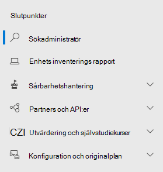

# Microsoft Defender för slutpunkt i Säkerhetscenter för Microsoft 365Microsoft Defender for Endpoint in the Microsoft 365 security center

[!INCLUDE [Microsoft 365 Defender rebranding](../includes/microsoft-defender.md)]

[!INCLUDE [Prerelease](../includes/prerelease.md)]

**Gäller för:****Applies to:**

- [Microsoft 365 DefenderMicrosoft 365 Defender](https://go.microsoft.com/fwlink/?linkid=2118804)
- [Microsoft Defender för EndpointMicrosoft Defender for Endpoint](https://go.microsoft.com/fwlink/p/?linkid=2146631)
- [Microsoft Defender för Office 365Microsoft Defender for Office 365](https://go.microsoft.com/fwlink/?linkid=2148715)

Det förbättrade [säkerhetscentret i Microsoft 365](overview-security-center.md) kombinerar säkerhetsfunktioner som skyddar, identifierar, undersöker och svarar på e-post, samarbete, identitet [https://security.microsoft.com](https://security.microsoft.com) och enhetshot.The improved [Microsoft 365 security center](overview-security-center.md) at [https://security.microsoft.com](https://security.microsoft.com) combines security capabilities that protect, detect, investigate, and respond to email, collaboration, identity, and device threats. I det här säkerhetscentret samlas funktioner från befintliga Microsoft-säkerhetsportaler, bland annat Microsoft Defender Säkerhetscenter och Office 365 Säkerhets- & Efterlevnadscenter.This security center brings together functionality from existing Microsoft security portals, including Microsoft Defender Security Center and the Office 365 Security & Compliance center.

Om du är bekant med Microsoft Defender Säkerhetscenter beskriver den här artikeln några av de ändringar och förbättringar som har gjorts i det förbättrade säkerhetscentret i Microsoft 365.If you're familiar with the Microsoft Defender Security Center, this article helps describe some of the changes and improvements in the improved Microsoft 365 security center. Det finns dock några nya och uppdaterade element som du bör känna till.However there are some new and updated elements to be aware of.

Microsoft Defender [Säkerhetscenter har historiskt varit](https://docs.microsoft.com/windows/security/threat-protection/microsoft-defender-atp/portal-overview) ett hem för Microsoft Defender för Endpoint.Historically, the [Microsoft Defender Security Center](https://docs.microsoft.com/windows/security/threat-protection/microsoft-defender-atp/portal-overview) has been the home for Microsoft Defender for Endpoint. Enterprise security teams have used it to monitor and help responding to alerts of potential advanced persistent threat activity or data breaches.Enterprise security teams have used it to monitor and help responding to alerts of potential advanced persistent threat activity or data breaches. För att minska antalet portaler är Microsoft 365 säkerhetscenter ett hem för övervakning och hantering av säkerhet i dina Microsoft-identiteter, data, enheter, appar och infrastruktur.To help reduce the number of portals, the Microsoft 365 security center will be the home for monitoring and managing security across your Microsoft identities, data, devices, apps, and infrastructure.

> [!IMPORTANT]
> Vad du ser i Microsoft 365 säkerhetscenter beror på dina aktuella prenumerationer.What you see in the Microsoft 365 security center depends on your current subscriptions. Om du till exempel inte har en licens för Microsoft Defender för Office 365 visas inte avsnittet & e-postsamarbete.For example, if you don't have a license for Microsoft Defender for Office 365, then the Email & Collaboration section will not be shown.

Ta en titt på det förbättrade säkerhetscentret i Microsoft 365: [https://security.microsoft.com](https://security.microsoft.com) .Take a look at the improved Microsoft 365 security center: [https://security.microsoft.com](https://security.microsoft.com).

Läs mer om fördelarna: [Översikt över Säkerhetscenter i Microsoft 365](overview-security-center.md)Learn more about the benefits: [Overview of the Microsoft 365 security center](overview-security-center.md)

## Vad har ändratsWhat's changed

Den här tabellen är en snabbreferens över ändringarna mellan Microsoft Defender Säkerhetscenter och Microsoft 365 säkerhetscenter.This table is a quick reference of the changes between the Microsoft Defender Security Center and the Microsoft 365 security center.

### Varningar och åtgärderAlerts and actions

|**Område****Area**  |**Beskrivning av ändring****Description of change**  |
|---------|---------|
| [Incidenter & aviseringarIncidents & alerts](incidents-overview.md)  | I Säkerhetscenter för Microsoft 365 kan du hantera incidenter och aviseringar för alla slutpunkter, e-post och identiteter.In the Microsoft 365 security center, you can manage incidents and alerts across all of your endpoints, email, and identities. Vi har konvergerat upplevelsen för att lättare hitta relaterade händelser.We've converged the experience to help you find related events more easily. Mer information finns i [Incidentöversikt.](incidents-overview.md)For more information, see [Incidents Overview](incidents-overview.md).   |
| [JägningHunting](advanced-hunting-overview.md)  |  Om du ändrar anpassade identifieringsregler som skapats i Microsoft Defender för Endpoint för att inkludera identitets- och e-posttabeller flyttas de automatiskt till Microsoft 365 Defender.Modifying custom detection rules created in Microsoft Defender for Endpoint to include identity and email tables automatically moves them to Microsoft 365 Defender. Motsvarande aviseringar visas också i Microsoft 365 Defender.Their corresponding alerts will also appear in Microsoft 365 Defender. Mer information om dessa ändringar finns i [Migrera regler för anpassad identifiering.](advanced-hunting-migrate-from-mdatp.md#migrate-custom-detection-rules)For more details about these changes, read [Migrate custom detection rules](advanced-hunting-migrate-from-mdatp.md#migrate-custom-detection-rules). Tabellen `DeviceAlertEvents` för avancerad sökning finns inte i Microsoft 365 Defender.The `DeviceAlertEvents` table for advanced hunting isn't available in Microsoft 365 Defender. Om du vill fråga om enhetsspecifik aviseringsinformation i Microsoft 365 Defender kan du använda tabellerna och tabellerna för att få plats med ännu mer information från `AlertInfo` `AlertEvidence` en rad olika källor.To query device-specific alert information in Microsoft 365 Defender, you can use the `AlertInfo` and `AlertEvidence` tables to accommodate even more information from a diverse set of sources. Skapa nästa enhetsrelaterade fråga genom att följa [skrivfrågor utan DeviceAlertEvents.](advanced-hunting-migrate-from-mdatp.md#write-queries-without-devicealertevents)Craft your next device-related query by following [Write queries without DeviceAlertEvents](advanced-hunting-migrate-from-mdatp.md#write-queries-without-devicealertevents).|
|[ÅtgärdscenterAction center](mtp-action-center.md)    | Listor med väntande och slutförda åtgärder som utförts efter automatiserade undersökningar och åtgärdsåtgärder.Lists pending and completed actions that were taken following automated investigations and remediation actions. Åtgärdscenter i Microsoft Defender Säkerhetscenter listade väntande och slutförda åtgärder för åtgärder som vidtas endast på enheter, medan automatiserade undersökningar listade varningar och status.Formerly, the Action center in the Microsoft Defender Security Center listed pending and completed actions for remediation actions taken on devices only, while Automated investigations listed alerts and status. I det förbättrade säkerhetscentret i Microsoft 365 sammanför åtgärdscenter åtgärder och undersökningar för e-post, enheter och användare – allt på en plats.In the  improved Microsoft 365 security center, the Action center brings together remediation actions and investigations across email, devices, and users—all in one location.  |
| [Analys av hotThreat analytics](threat-analytics.md) |  Flyttades högst upp i navigeringsfältet för enklare identifiering och användning.Moved to the top of the navigation bar for easier discovery and use. Innehåller nu information om hot för både slutpunkter och e-post och samarbete.Now includes threat information for both endpoints and email and collaboration.    |

### SlutpunkterEndpoints

|**Område****Area**  |**Beskrivning av ändring****Description of change**  |
|---------|---------|
|SökSearch   |  I stället för att vara i rubriken flyttas microsoft Defender för slutpunktssökfältet under avsnittet Slutpunkter.Instead of being in the heading, Microsoft Defender for Endpoint search bar is moving under the Endpoints section. Du kan fortsätta att söka efter enheter, filer, användare, URL:er, IP-adresser, svagheter, programvara och rekommendationer.You can continue to search for devices, files, users, URLs, IPs, vulnerabilities, software, and recommendations.  |
|[InstrumentpanelenDashboard](https://docs.microsoft.com/windows/security/threat-protection/microsoft-defender-atp/security-operations-dashboard)   |  Det här är instrumentpanelen för säkerhetsåtgärder.This is your security operations dashboard. Se en översikt över hur många aktiva aviseringar som utlöstes, vilka enheter som är i riskzonen, vilka användare som är på risknivå och allvarlighetsnivå för aviseringar, enheter och användare.See an overview of how many active alerts were triggered, which devices are at risk, which users are at risk, and severity level for alerts, devices, and users. Du kan också se om några enheter har sensorproblem, din allmänna tjänsthälsa och hur omatchade aviseringar har upptäckts.You can also see if any devices have sensor issues, your overall service health, and how any unresolved alerts were detected. |
|EnhetsinventeringDevice inventory | Inga ändringar.No changes. |
|[SårbarhetshanteringVulnerability management](https://docs.microsoft.com/windows/security/threat-protection/microsoft-defender-atp/next-gen-threat-and-vuln-mgt)    |    Namnet förkortades så att det passar i navigeringsfönstret.Name was shortened to fit in the navigation pane. Det är samma som avsnittet om hantering av hot och sårbarhet, med alla sidor undertill.It's the same as the threat and vulnerability management section, with all the pages underneath.     |
| Partner och API:erPartners and APIs | Inga ändringar.No changes. |
| Utvärderingar & självstudiekurserEvaluations & tutorials    |     Nya test- och inlärningsfunktioner.New testing and learning capabilities.     |
| KonfigurationshanteringConfiguration management   |  Inga ändringar.No changes.  |

> [!NOTE]
> **Automatisk undersökning och åtgärd är** nu en del av incidenter.**Automatic investigation and remediation** is now a part of  incidents. Du kan se händelser för automatisk undersökning och åtgärd på fliken **> Incidentundersökning.**You can see Automated  investigation and remediation events in the **Incident > Investigation** tab.

### Access och rapporteringAccess and reporting

|**Område****Area**  |**Beskrivning av ändring****Description of change**  |
|---------|---------|
| RapporterReports  | Se rapporter för slutpunkter och e-& samarbete, inklusive skydd mot hot, enhetens hälsa och efterlevnad och sårbara enheter.See reports for endpoints and email & collaboration, including Threat protection, Device health and compliance, and Vulnerable devices. |
| HälsaHealth  |  Länkar för närvarande ut till sidan Tjänstens hälsa i administrationscentret för [Microsoft 365.](https://admin.microsoft.com/)Currently links out to the "Service health" page in the [Microsoft 365 admin center](https://admin.microsoft.com/). |
| InställningarSettings |  Hantera dina inställningar för Microsoft 365 säkerhetscenter, Microsoft 365 Defender, slutpunkter, e-& samarbete, identiteter och enhetsidentifiering.Manage your settings for the Microsoft 365 security center, Microsoft 365 Defender, Endpoints, Email & collaboration, Identities, and Device discovery.   |

## Säkerhetsnavigering och funktioner i Microsoft 365Microsoft 365 security navigation and capabilities

Det vänstra navigeringsfältet, eller snabbstartfältet, ser bekant ut.The left navigation, or quick launch bar, will look familiar. Det finns dock några nya och uppdaterade element i det här säkerhetscentret.However, there are some new and updated elements in this security center.

### Incidenter och aviseringarIncidents and alerts

Sammanför incidenter och aviseringshantering i din e-post, dina enheter och identiteter.Brings together incident and alert management across your email, devices, and identities. På aviseringssidan får du fullständig kontext till aviseringen genom att kombinera attacksignaler för att skapa en detaljerad berättelse.The alert page provides full context to the alert by combining attack signals to construct a detailed story. En ny enhetlig upplevelse sammanför nu en enhetlig vy av aviseringar för alla arbetsbelastningar.A new, unified experience now brings together a consistent view of alerts across workloads. Du kan snabbt ändra, undersöka och vidta effektiva åtgärder.You can quickly triage, investigate, and take effective action.

- [Läs mer om incidenterLearn more about incidents](incidents-overview.md)
- [Läs mer om att hantera aviseringarLearn more about managing alerts](investigate-alerts.md)

### JägningHunting

Proaktivt söka efter hot, skadlig programvara och skadlig aktivitet i slutpunkter, Office 365-postlådor och mycket mer med hjälp av avancerade [sökningsfrågor.](advanced-hunting-overview.md)Proactively search for threats, malware, and malicious activity across your endpoints, Office 365 mailboxes, and more by using [advanced hunting queries](advanced-hunting-overview.md). Dessa kraftfulla frågor kan användas för att hitta och granska hotindikatorer och -enheter för både kända och potentiella hot.These powerful queries can be used to locate and review threat indicators and entities for both known and potential threats.

[Anpassade identifieringsregler kan](custom-detection-rules.md) byggas från avancerade sökfrågor för att hjälpa dig att proaktivt hålla utkik efter händelser som kan vara misslyckad av intrångsaktivitet och felkonfigurerade enheter.[Custom detection rules](custom-detection-rules.md) can be built from advanced hunting queries to help you proactively watch for events that might be indicative of breach activity and misconfigured devices.

### ÅtgärdscenterAction center

I åtgärdscenter visas undersökningar som skapats med automatisk undersökning och svarsfunktioner.Action center shows you the investigations created by automated investigation and response capabilities. Den här automatiska självbetjäningsprocessen i Microsoft 365 Defender kan hjälpa säkerhetsteam genom att automatiskt svara på specifika händelser.This automated, self-healing in Microsoft 365 Defender can help security teams by automatically responding to specific events.

[Läs mer om ÅtgärdscenterLearn more about the Action center](mtp-action-center.md)

### HotanalysThreat Analytics

Få information om hot från en expert på Microsoft-säkerhet.Get threat intelligence from expert Microsoft security researchers. Hotanalys hjälper säkerhetsteam att bli effektivare när de står inför nya hot.Threat Analytics helps security teams be more efficient when facing emerging threats. Hotanalys omfattar:Threat Analytics includes:

- E-postrelaterade identifieringar och åtgärder från Microsoft Defender för Office 365.Email-related detections and mitigations from Microsoft Defender for Office 365. Detta är utöver de slutpunktsdata som redan är tillgängliga från Microsoft Defender för Slutpunkt.This is in addition to the endpoint data already available from Microsoft Defender for Endpoint.
- Vyn Incidenter som är relaterad till hoten.Incidents view related to the threats.
- Förbättrad upplevelse för att snabbt identifiera och använda användbar information i rapporterna.Enhanced experience for quickly identifying and using actionable information in the reports.

Du kan komma åt hotanalyser antingen från det övre vänstra navigeringsfältet i Säkerhetscenter för Microsoft 365 eller från ett dedikerat instrumentpanelskort som visar de viktigaste hoten för din organisation.You can access threat analytics either from the upper left navigation bar in the Microsoft 365 security center, or from a dedicated dashboard card that shows the top threats for your organization.

Läs mer om hur du [spårar och svarar på nya hot med hotanalyser](https://docs.microsoft.com/microsoft-365/security/mtp/threat-analytics)Learn more about how to [track and respond to emerging threats with threat analytics](https://docs.microsoft.com/microsoft-365/security/mtp/threat-analytics)

### Avsnittet SlutpunkterEndpoints section

Visa och hantera säkerheten för slutpunkter i din organisation.View and manage the security of endpoints in your organization. Om du har använt Microsoft Defender Säkerhetscenter ser det bekant ut.If you've used the Microsoft Defender Security Center, it will look familiar.

### Access och rapporterAccess and reports

Visa rapporter, ändra dina inställningar och ändra användarroller.View reports, change your settings, and modify user roles.

### SIEM API-anslutningarSIEM API connections

Om du använder [Defender för Slutpunkt SIEM API](/windows/security/threat-protection/microsoft-defender-atp/enable-siem-integration.md)kan du fortsätta att göra det.If you use the [Defender for Endpoint SIEM API](/windows/security/threat-protection/microsoft-defender-atp/enable-siem-integration.md), you can continue to do so. Vi har lagt till nya länkar i API-nyttolasten som pekar på aviseringssidan eller incidentsidan i Microsoft 365-säkerhetsportalen.We’ve added new links on the API payload that point to the alert page or the incident page in the Microsoft 365 security portal. Nya API-fält innehåller LinkToMTP och IncidentLinkToMTP.New API fields include LinkToMTP and IncidentLinkToMTP. Mer information finns i Omdirigera [konton från Microsoft Defender för Slutpunkt till Säkerhetscenter för Microsoft 365.](/microsoft-365/security/mtp/microsoft-365-security-mde-redirection.md)For more information, see [Redirecting accounts from Microsoft Defender for Endpoint to the Microsoft 365 security center](/microsoft-365/security/mtp/microsoft-365-security-mde-redirection.md).

### E-postaviseringarEmail alerts

Du kan fortsätta att använda e-postaviseringar för Defender för Endpoint.You can continue to use email alerts for Defender for Endpoint. Vi har lagt till nya länkar i e-postmeddelanden som pekar på aviseringssidan eller incidentsidan i Säkerhetscenter i Microsoft 365.We've added new links in the emails that point to the alert page or the incident page in the Microsoft 365 security center. Mer information finns i Omdirigera [konton från Microsoft Defender för Slutpunkt till Säkerhetscenter för Microsoft 365.](/microsoft-365/security/mtp/microsoft-365-security-mde-redirection.md)For more information, see [Redirecting accounts from Microsoft Defender for Endpoint to the Microsoft 365 security center](/microsoft-365/security/mtp/microsoft-365-security-mde-redirection.md).

## Relaterad informationRelated information

- [Microsoft 365 SäkerhetscenterMicrosoft 365 security center](overview-security-center.md)
- [Microsoft Defender för slutpunkt i Säkerhetscenter för Microsoft 365Microsoft Defender for Endpoint in the Microsoft 365 security center](microsoft-365-security-center-mde.md)
- [Omdirigera konton från Microsoft Defender för Slutpunkt till Säkerhetscenter för Microsoft 365Redirecting accounts from Microsoft Defender for Endpoint to the Microsoft 365 security center](microsoft-365-security-mde-redirection.md)
