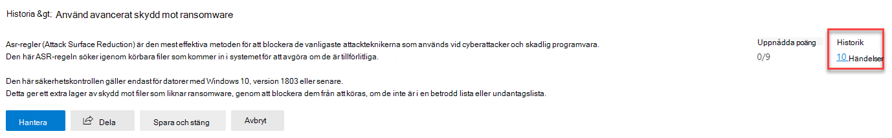
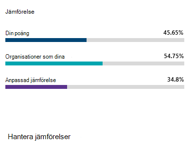
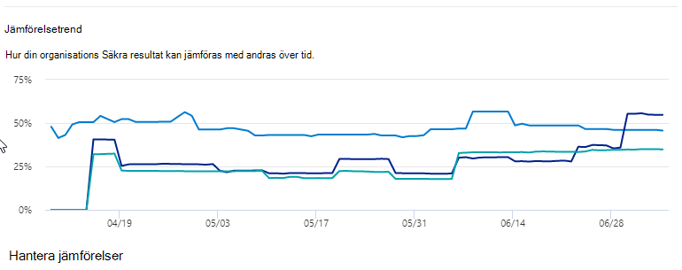

# Spåra din Microsoft säkra Poäng historik och uppfylla målen

[!INCLUDE [Microsoft 365 Defender rebranding](../includes/microsoft-defender.md)]

[Microsoft Secure score](microsoft-secure-score.md) är ett mått på en organisations säkerhets Posture, med ett högre nummer som indikerar fler förbättrings åtgärder. Den finns https://security.microsoft.com/securescore i [säkerhets Center för Microsoft 365](overview-security-center.md).

## Få information som har påverkat poängen

Visa ett diagram över din organisations poäng över tiden på fliken **Historik** .

Under diagrammet visas en lista över alla åtgärder som utförs under det valda tidsintervallet och deras attribut, till exempel resulterande Poäng och kategori. Du kan anpassa ett datum intervall och filtrera efter kategori.

Om du väljer förbättrings åtgärden som är kopplad till en aktivitet visas den utfällbara åtgärden fullständig förbättring.

Om du vill visa all historik för den specifika förbättrings åtgärden väljer du länken historik i utfälld.

## Upptäck trender och ställa in mål

På fliken **mått & trender** finns det flera diagram för att du ska få mer insyn i trender och ställa in mål. Du kan ange datum intervall för hela sidan av visualiseringar. Visualiseringarna inkluderar:

* **Din säkra Poäng zon** – anpassad baserat på organisationens mål och definitioner av bra, OK och dåliga poäng områden.
* **Regressions trend** – en tids linje med punkter som har regressed på grund av ändringar av konfiguration, användare eller enhet.  
* **Jämförelse trend** – hur din organisations säkra Poäng jämförs med andra med över tiden. I den här vyn kan du inkludera rader som representerar medelvärdet av organisationer med liknande antal och en anpassad jämförelse vy som du kan ange.
* **Trend** -och tids linje för att acceptera riskerna.
* **Poäng ändringar** -antalet poäng uppnåddes, Points regressed och ändrade Poäng i angivet datum intervall.

### Jämför poängen med dina organisationer som dina

Det finns två platser för att se hur poängen jämförs med organisationer som liknar dig. I båda diagrammen kan du välja **Hantera jämförelser** för att visa och redigera din organisations information. Du kan också skapa en anpassad jämförelse utifrån bransch, organisationens storlek, licenser och regioner.

#### Jämförelse stapeldiagram

Jämförelse fönstret är fliken **Översikt** . Hovra över diagrammet för att Visa poängen och poängen. Jämförelse data är anonymiserad så vi vet inte exakt vilka andra innehavare är i blandningen.

- **Organisationer** som du vill: ett genomsnittligt antal andra innehavare (förutsatt att vi har minst fem eller fler klient organisationer) som uppfyller följande kriterier:
    1. Samma bransch
    2. Samma organisations storlek
    3. Alla regioner
    4. Microsoft-produkter som används är 80% liknande
    5. Affärs möjlighet (högsta poäng som kan uppnås genom aktuell licens) inom 20% från klient organisationen

- **Anpassad jämförelse**: måste ställas in genom att välja **Hantera jämförelse** utifrån följande kriterier:
    1. Valda branscher
    2. Vald organisations storlek
    3. Markerade regioner
    4. Valda licenser
    5. Microsoft-produkter som används är 80% liknande
    6. Affärs möjlighet (högsta poäng som kan uppnås genom aktuell licens) inom 20% från klient organisationen

Om du har gjort en anpassad markering men resultatet har färre än fem andra klient organisationer som vi kan jämföra med visas "inte tillgängligt på grund av begränsat data".

#### Jämförelse trend

På fliken **mått & trender** kan du se hur organisationens säkra Poäng jämförs med andra med över tiden.

## Vi vill höra från dig

Om du har några problem kan du meddela oss genom att publicera det i [säkerhets-, integritets &](https://techcommunity.microsoft.com/t5/Security-Privacy-Compliance/bd-p/security_privacy) community. Vi övervakar communityn och ger hjälp.

## Relaterade resurser

- [Översikt över Microsofts säkra Poäng](microsoft-secure-score.md)
- [Utvärdera säkerhets genom övergå molnet](microsoft-secure-score-improvement-actions.md)
- [Kommer snart](microsoft-secure-score-whats-coming.md)
- [Nyheter](microsoft-secure-score-whats-new.md)
