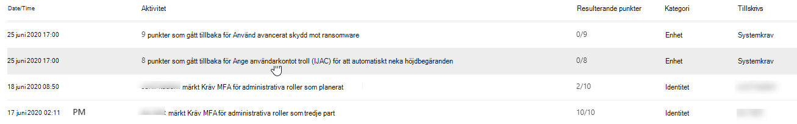

# Spåra din Microsoft Secure Score-historik och uppnå målTrack your Microsoft Secure Score history and meet goals

[Microsoft Secure Score](microsoft-secure-score.md) är ett mått på en organisations säkerhetsposition, med ett högre antal som anger fler förbättringsåtgärder som vidtas.[Microsoft Secure Score](microsoft-secure-score.md) is a measurement of an organization's security posture, with a higher number indicating more improvement actions taken. Den finns https://security.microsoft.com/securescore på i Microsoft [365 security center](overview-security-center.md).It can be found at https://security.microsoft.com/securescore in the [Microsoft 365 security center](overview-security-center.md).

## Få insikter om aktivitet som har påverkat dina poängGain insights into activity that has affected your score

Visa ett diagram över organisationens poäng över tid på fliken **Historik.**View a graph of your organization's score over time in the **History** tab.

Under diagrammet finns en lista över alla åtgärder som vidtagits i det valda tidsintervallet och deras attribut, till exempel resulterande punkter och kategori.Below the graph is a list of all the actions taken in the selected time range and their attributes, such as resulting points and category. Du kan anpassa ett datumintervall och filtrera efter kategori.You can customize a date range and filter by category.

Om du väljer förbättringsåtgärden som är associerad med en aktivitet visas den fullständiga förbättringsåtgärdens utfällbara åtgärd.If you select the improvement action associated with an activity, the full improvement action flyout will appear.

Om du vill visa all historik för den specifika förbättringsåtgärden väljer du historiklänken i utfällbara.To view all history for that specific improvement action, select the history link in the flyout.

## Upptäck trender och sätta upp målDiscover trends and set goals

På fliken **Mått & trender** finns det flera diagram som ger dig större insyn i trender och sätta upp mål.In the **Metrics & trends** tab, there are several graphs and charts to give you more visibility into trends and set goals. Du kan ange datumintervallet för hela sidan med visualiseringar.You can set the date range for the whole page of visualizations. Visualiseringarna inkluderar:The visualizations include:

* **Zonen Secure Score** – Anpassad baserat på organisationens mål och definitioner av bra, okej och dåliga resultatintervall.**Your Secure Score zone** — Customized based on your organization's goals and definitions of good, okay, and bad score ranges.
* **Regressionstrend** – En tidslinje med punkter som har gått tillbaka på grund av konfiguration, användar- eller enhetsändringar.**Regression trend** — A timeline of points that have regressed due to configuration, user, or device changes.  
* **Jämförelsetrend** – Hur organisationens säkra resultat kan jämföras med andras över tid.**Comparison trend** — How your organization's Secure Score compares to others' over time. Den här vyn kan innehålla rader som representerar poänggenomsnittet för organisationer med liknande platsantal och en anpassad jämförelsevy som du kan ange.This view can include lines representing the score average of organizations with similar seat count and a custom comparison view that you can set.
* **Risk acceptans trend** - Tidslinje för förbättringsåtgärder markerade som "risk accepteras."**Risk acceptance trend** — Timeline of improvement actions marked as "risk accepted."
* **Poängändringar** – Antalet uppnådda poäng, poäng som gått tillbaka, tillsammans med den efterföljande poängändringen, i det angivna datumintervallet.**Score changes** — The number of points achieved, points regressed, along with the subsequent score change, in the specified date range.

### Jämför dina poäng med organisationer som dinCompare your score to organizations like yours

Det finns två plats där du kan se hur dina poäng kan jämföras med organisationer som liknar dig.There are two place to see how your score compares to organizations that are similar to you.

Den första platsen finns på fliken **Översikt,** där du kan se ett jämförelsefältsdiagram.The first place is in the **Overview** tab, where you will be able to see a comparison bar graph. Hovra över diagrammet för att visa poäng- och poängmöjligheten.Hover over the chart to view the score and score opportunity.

Den andra platsen finns på fliken **Mått & trender,** där du kan visa hur organisationens säkra resultat kan jämföras med andras över tid.The second place is in the **Metrics & trends** tab, where you can view how your organization's Secure Score compares to others' over time.

I båda diagrammen kan du välja **Hantera jämförelser** för att visa och redigera organisationens information.In both charts, you can select **Manage comparisons** to view and edit your organization's information. Du kan också skapa en anpassad jämförelse baserat på bransch, organisationsstorlek, licenser och regioner.You can also create a custom comparison based on industry, organization size, licenses, and regions. 

## Vi vill höra från digWe want to hear from you

Om du har några problem, vänligen meddela oss genom att publicera i [security, privacy & Compliance](https://techcommunity.microsoft.com/t5/Security-Privacy-Compliance/bd-p/security_privacy) community.If you have any issues, please let us know by posting in the [Security, Privacy & Compliance](https://techcommunity.microsoft.com/t5/Security-Privacy-Compliance/bd-p/security_privacy) community. Vi övervakar samhället och kommer att ge hjälp.We're monitoring the community and will provide help.

## Relaterade resurserRelated resources

- [Översikt över Microsoft Secure ScoreMicrosoft Secure Score overview](microsoft-secure-score.md)
- [Bedöm din säkerhetspositionAssess your security posture](microsoft-secure-score-improvement-actions.md)
- [Kommer snartWhat's coming](microsoft-secure-score-whats-coming.md)
- [NyheterWhat's new](microsoft-secure-score-whats-new.md)