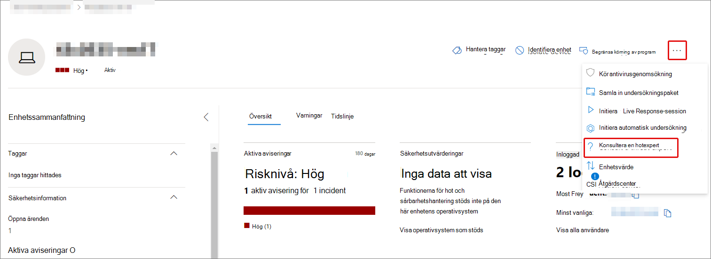
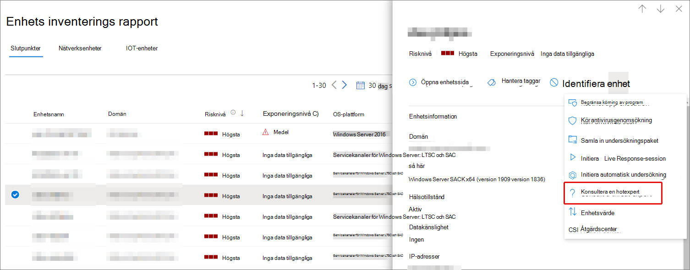
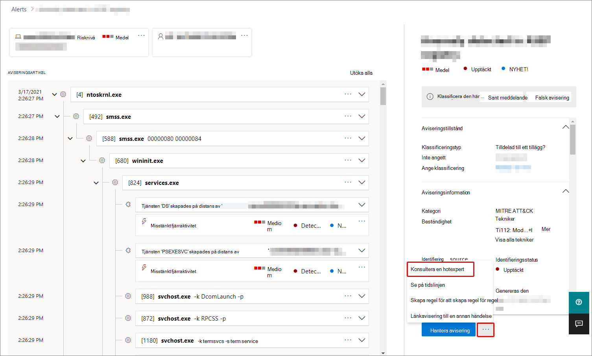

# Översikt över Microsoft Threat Experts i Microsoft 365

[!INCLUDE [Microsoft 365 Defender rebranding](../includes/microsoft-defender.md)]

**Gäller för:**

- [Microsoft 365 Defender](https://go.microsoft.com/fwlink/?linkid=2118804)
- [Microsoft Defender för Endpoint](https://go.microsoft.com/fwlink/p/?linkid=2154037)

[!INCLUDE [Prerelease](../includes/prerelease.md)]

Microsoft Threat Experts – Riktade attackmeddelanden är en hanterad tjänst för hot efter hot. När du har ansökt och godkänts får du riktade attackmeddelanden från Microsofts experter på hot så att du inte missar viktiga hot i din miljö. Dessa meddelanden hjälper dig att skydda din organisations slutpunkter, e-post och identiteter.
Microsoft Threat Experts – Experter på begäran ger dig expertråd om hot som din organisation står inför. Du kan kontakta om du behöver hjälp med hot som din organisation står inför. Det är tillgängligt som en prenumerationstjänst.

## Sök efter Microsoft Threat Experts – riktade attackmeddelanden

> [!IMPORTANT]
> Innan du tillämpar bör du diskutera kraven för berättigande till Microsoft Threat Experts – Riktade attackmeddelanden med din Microsoft-leverantör och ditt kontoteam.

Om du redan har Microsoft Defender för Endpoint och Microsoft 365 Defender kan du ansöka om Microsoft Threat Experts – Targeted Attack Notifications via Microsoft 365 Defender-portalen. Gå till **Inställningar > slutpunkter > allmänt > avancerade funktioner > Microsoft Threat Experts – Riktade attackmeddelanden** och välj **Använd.** Se [Konfigurera Microsoft Threat Experts-funktioner](./configure-microsoft-threat-experts.md) för en fullständig beskrivning.

När din ansökan har godkänts kommer du att börja ta emot riktade attackmeddelanden när Threat Experts upptäcker ett hot mot din miljö.

## Prenumerera på Microsoft Threat Experts – experter på begäran

Kontakta din Microsoft-representant om du vill prenumerera på Experter på begäran.  Mer [information finns i Konfigurera Microsoft Threat Experts-funktioner.](./configure-microsoft-threat-experts.md)

## Ta emot riktad attackavisering

Microsoft Threat Experts – targeted attack notification capability provides proactive hunting for the most important threats to your network. Våra hotexperter söker efter mänskliga adversära intrång, hand-på-tangentbordsattacker och avancerade attacker, till exempel cybersäkerhet. Dessa meddelanden visas som en ny avisering. Den hanterade servicen för servicen omfattar:

- Övervaka och analysera hot, minska invånartiden och risken för ditt företag
- Person med utbildning om artificiell intelligens som identifierar och riktar sig mot både kända attacker och nya hot
- Identifiering av de mest relevanta riskerna, vilket hjälper soc att maximera effektiviteten
- Hjälp till att använda informationsomfång kompromettera och skapa så mycket kontext som kan levereras snabbt för att möjliggöra ett SWIFT-SOC-svar.

## Samarbeta med experter på begäran

Du kan också kontakta Microsofts hotexperter direkt från Microsoft 365-säkerhetsportalen för att få ett snabbt och korrekt svar på hot.  Experter kan ge insikter för att bättre förstå de komplexa hot din organisation kan möta.  Kontakta en expert för att:

- Samla in ytterligare information om aviseringar och incidenter, inklusive rotorsaker och omfattning
- Få klarhet i misstänkta enheter, aviseringar och incidenter och få nästa steg vid en avancerad attack
- Fastställa risker och tillgängliga skydd i samband med attackerare, kampanjer eller nya attackertekniker

Alternativet att Kontakta **en expert på hot** finns på flera platser i portalen:

- <i>**Menyn Enhet sidåtgärder**</i> 

- <i>**Utfällmenyn för enhetsinventeringssida**</i> 

- <i>**Den utfällmenyn på sidan Aviseringar**</i> 

- <i>**Menyn Åtgärder på sidan Incidenter**</i> 

- <i>**Sidan Lager för incidenter**</i> 

> [!NOTE]
> Om du har en Premier Support-prenumeration mappad till din Microsoft Defender för Office 365-licens kan du spåra status för dina experter på begäran via Microsoft Services Hub.

Titta på den här videon för en snabb överblick över Microsoft Services-hubben.

> [!VIDEO https://www.microsoft.com/videoplayer/embed/RE4pk9f]

## Se även

- [Konfigurera microsoft Threat Experts-funktioner](./configure-microsoft-threat-experts.md)
