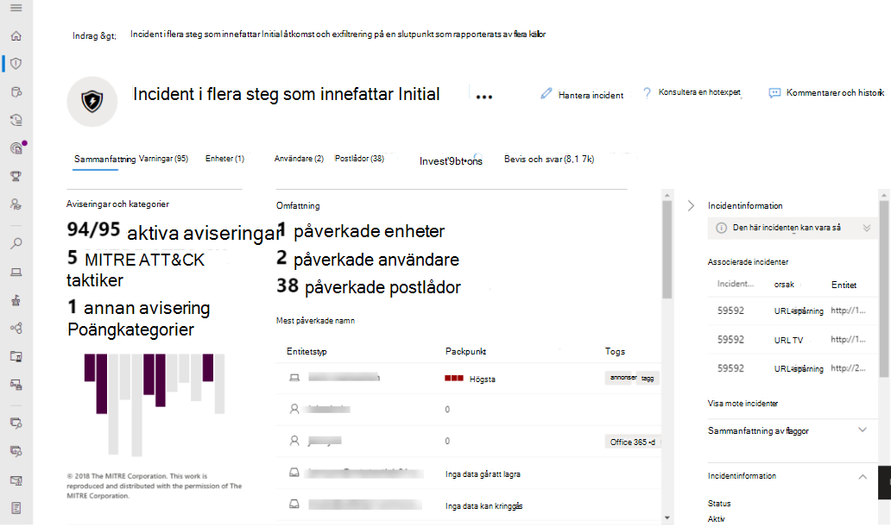

# Microsoft HotskyddMicrosoft Threat Protection

**Gäller:****Applies to:**
- Microsoft HotskyddMicrosoft Threat Protection

Microsoft Threat Protection är en enhetlig företagsförsvarssvit före och efter överträdelsen som samordnar identifiering, förebyggande, utredning och svar över slutpunkter, identiteter, e-post och program för att ge integrerat skydd mot avancerade attacker.Microsoft Threat Protection is a unified pre- and post-breach enterprise defense suite that natively coordinates detection, prevention, investigation, and response across endpoints, identities, email, and applications to provide integrated protection against sophisticated attacks.

Med den integrerade Microsoft Threat Protection-lösningen kan säkerhetspersonal sy ihop de hotsignaler som var och en av dessa produkter tar emot och avgöra hotets fulla omfattning och inverkan. hur den kom in i miljön, vad den påverkas och hur den för närvarande påverkar organisationen.With the integrated Microsoft Threat Protection solution, security professionals can stitch together the threat signals that each of these products receive and determine the full scope and impact of the threat; how it entered the environment, what it's affected, and how it's currently impacting the organization. Microsoft Threat Protection vidtar automatiska åtgärder för att förhindra eller stoppa angrepp och självläker affected postlådor, slutpunkter och användaridentiteter.Microsoft Threat Protection takes automatic action to prevent or stop the attack and self-heal affected mailboxes, endpoints, and user identities.  

<h2>Microsofts tjänster för skydd av hot
Microsoft Threat Protection services
</h2>
<table><tr><td>
<b><a href="https://docs.microsoft.com/windows/security/threat-protection/microsoft-defender-atp/microsoft-defender-advanced-threat-protection"><b>Microsoft Defender avancerat hotskydd</b>

<b><a href="https://docs.microsoft.com/windows/security/threat-protection/microsoft-defender-atp/microsoft-defender-advanced-threat-protection"><b>Microsoft Defender Advanced Threat Protection</b>
</a></td>
<td>
<b><a href="https://docs.microsoft.com/office365/securitycompliance/office-365-atp"><b>Avancerat hotskydd i Office 365</b>

<b><a href="https://docs.microsoft.com/office365/securitycompliance/office-365-atp"><b>Office 365 Advanced Threat Protection</b>
</a></td>
<td>
<b><a href="https://docs.microsoft.com/azure-advanced-threat-protection/"><b>Azure avancerat hotskydd</b></a>

<b><a href="https://docs.microsoft.com/azure-advanced-threat-protection/"><b>Azure Advanced Threat Protection</b></a>
</td>
<td>
<b><a href="https://docs.microsoft.com/cloud-app-security/"><b>Säkerhet för Microsoft Cloud-appar</b></a>

<b><a href="https://docs.microsoft.com/cloud-app-security/"><b>Microsoft Cloud App Security</b></a>
</td>
</tr>
</table>
 

>[!TIP]
>Kolla in den [här interaktiva guiden Microsoft Threat Protection](https://aka.ms/MTP-Interactive-Guide).Check out this [Microsoft Threat Protection interactive guide](https://aka.ms/MTP-Interactive-Guide).

Microsoft Threat Protection suite skyddar:Microsoft Threat Protection suite protects: 
- **Slutpunkter med Microsoft Defender ATP** - Microsoft Defender ATP är en enhetlig slutpunktsplattform för förebyggande skydd, identifiering efter överträdelse, automatisk undersökning och svar.**Endpoints with Microsoft Defender ATP** - Microsoft Defender ATP is a unified endpoint platform for preventative protection, post-breach detection, automated investigation, and response. 
- **E-post och samarbete med Office 365 ATP** – Office 365 ATP skyddar organisationen mot skadliga hot som orsakas av e-postmeddelanden, länkar (webbadresser) och samarbetsverktyg.**Email and collaboration with Office 365 ATP** - Office 365 ATP safeguards your organization against malicious threats posed by email messages, links (URLs) and collaboration tools. 
- **Identiteter med Azure ATP och Azure AD Identity Protection** – Azure ATP använder Active Directory-signaler för att identifiera, identifiera och undersöka avancerade hot, komprometterade identiteter och skadliga insideråtgärder som riktas mot din organisation.**Identities with Azure ATP and Azure AD Identity Protection** - Azure ATP uses Active Directory signals to identify, detect, and investigate advanced threats, compromised identities, and malicious insider actions directed at your organization. 
- **Program med Microsoft Cloud App-säkerhet** – Microsoft Cloud App security är en omfattande cross-SaaS-lösning som ger djup synlighet, starka datakontroller och förbättrat hotskydd för dina molnappar.**Applications with Microsoft Cloud App security** - Microsoft Cloud App security is a comprehensive cross-SaaS solution bringing deep visibility, strong data controls, and enhanced threat protection to your cloud apps. 

Microsoft Threat Protections unika lager över flera produkter förstärker de enskilda svitkomponenterna till:Microsoft Threat Protection's unique cross-product layer augments the individual suite components to:
- Skydda dig mot attacker och samordna defensiva svar över hela sviten genom signaldelning och automatiserade åtgärderHelp protect against attacks and coordinate defensive responses across the suite through signal sharing and automated actions
- Berätta hela historien om attacken över produktvarningar, beteenden och sammanhang för säkerhetsteam genom att gå med i data på varningar, misstänkta händelser och påverkade tillgångar till "incidenter"Narrate the full story of the attack across product alerts, behaviors, and context for security teams by joining data on alerts, suspicious events and impacted assets to 'incidents'
- Automatisera svar på kompromisser genom att utlösa självläkning för påverkade tillgångar genom automatisk reparationAutomate response to compromise by triggering self-healing for impacted assets through automated remediation
- Gör det möjligt för säkerhetsteam att utföra detaljerad och effektiv hotjakt över slutpunkts- och Office-dataEnable security teams to perform detailed and effective threat hunting across endpoint and Office data

  
Incident mellan produkter (översikt)Cross-product incident (Overview)

 
Alla relaterade aviseringar i svitprodukterna korrelerade samman till en enda incident (varningsvy)All related alerts across the suite products correlated together into a single incident (alerts view)

 
Frågebaserad jakt ovanpå rådata för e-post och slutpunktQuery-based hunting on top of email and endpoint raw data

Funktioner för flera produkter från Microsoft Threat Protection är:Microsoft Threat Protection cross-product features include: 
- **En korsproduktsingruta** med en bildruta – Central visa all information för identifieringar, påverkade tillgångar, automatiserade åtgärder som vidtagits och relaterade bevis i en enda kö och en enda ruta i [security.microsoft.com](https://security.microsoft.com).**Cross-product single pane of glass** - Central view all information for detections, impacted assets, automated actions taken, and related evidence in a single queue and a single pane in [security.microsoft.com](https://security.microsoft.com). 
- **Kombinerad incidentkö** - För att hjälpa säkerhetspersonal att fokusera på vad som är kritiskt genom att säkerställa att hela angreppsomfattningen, påverkade tillgångar och automatiserade åtgärder för reparation grupperas tillsammans och visas i tid.**Combined incidents queue** - To help security professionals focus on what is critical by ensuring the full attack scope, impacted assets and automated remediation actions are grouped together and surfaced in a timely manner. 
- **Automatisk reaktion på hot** – Information om kritiska hot delas i realtid mellan Microsoft Threat Protection-produkterna för att stoppa utvecklingen av en attack.**Automatic response to threats** - Critical threat information is shared in real time between the Microsoft Threat Protection products to help stop the progression of an attack. Om till exempel en skadlig fil identifieras på en slutpunkt som skyddas av Microsoft Defender ATP, instrueras Office 365 ATP att skanna och ta bort filen från alla e-postmeddelanden.For example, if a malicious file is detected on an endpoint protected by Microsoft Defender ATP, it will instruct Office 365 ATP to scan and remove the file from all e-mail messages. Filen kommer att blockeras på sikt av hela Microsoft 365 säkerhetssvit.The file will be blocked on sight by the entire Microsoft 365 security suite.
- **Självläkande för komprometterade enheter, användaridentiteter och postlådor** – Microsoft Threat Protection använder AI-drivna automatiska åtgärder och spelböcker för att åtgärda påverkade tillgångar tillbaka till ett säkert tillstånd.**Self-healing for compromised devices, user identities, and mailboxes** - Microsoft Threat Protection uses AI-powered automatic actions and playbooks to remediate impacted assets back to a secure state. Microsoft Threat Protection utnyttjar automatiska reparationsfunktioner för svitprodukterna för att säkerställa att alla påverkade tillgångar som är relaterade till en incident automatiskt åtgärdas där det är möjligt.Microsoft Threat Protection leverages automatic remediation capabilities of the suite products to ensure all impacted assets related to an incident are automatically remediated where possible.
- **Cross-produkt hot jakt** - Säkerhetsteam kan utnyttja sina unika organisatoriska kunskaper för att jaga efter tecken på kompromiss genom att skapa sina egna anpassade frågor över rådata som samlats in av de olika skyddsprodukter.**Cross-product threat hunting** - Security teams can leverage their unique organizational knowledge to hunt for signs of compromise by creating their own custom queries over the raw data collected by the various protection products. Microsoft Threat Protection ger frågebaserad åtkomst till 30 dagar med historiska råsignaler och varningsdata över slutpunkts- och Office 365 ATP-data.Microsoft Threat Protection provides query-based access to 30 days of historic raw signals and alert data across endpoint and Office 365 ATP data. 

## Komma igångGet started
Licenskraven för Microsoft Threat Protection måste uppfyllas innan du kan aktivera tjänsten i Microsoft 365-säkerhetscentret på [security.microsoft.com](https://security.microsoft.com).Microsoft Threat Protection licensing requirements must be met before you can enable the service in the Microsoft 365 security center at [security.microsoft.com](https://security.microsoft.com). För mer information, läs:For more information, read:
- [LicenskravLicensing requirements](prerequisites.md#licensing-requirements)
- [Aktivera Microsoft HotskyddTurn on Microsoft Threat Protection](mtp-enable.md)
