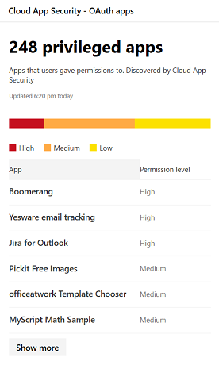

# Program övervakning och rapportering i säkerhets Center för Microsoft 365App monitoring and reporting in the Microsoft 365 security center

[!INCLUDE [Microsoft 365 Defender rebranding](../includes/microsoft-defender.md)]

Rapporterna visar mer information om hur molnappar används i din organisation.These reports provide more insight into how cloud apps are being used in your organization. Inkluderar olika typer av appar, deras risk nivå och aviseringar.Includes different kinds of apps, their level of risk, and alerts.

## Övervaka e-postkontonMonitor email accounts at risk

**E-postskydd** visar e-postkonton med risk.**Email protection** shows email accounts at risk. Du kan välja ett konto att undersöka i Microsoft Defender säkerhets Center.You can select an account to investigate further in Microsoft Defender Security Center.

## Övervaka program behörigheter som beviljats av användareMonitor app permissions granted by users

**Cloud App-säkerhet – appar för OAuth-appar** som identifieras av Cloud App Security som har beviljats behörigheter av användare.**Cloud App Security - OAuth apps** lists apps discovered by Cloud App Security that have been granted permissions by users. Cloud App Security-risk katalogen inkluderar över 16 000-program som utvärderas med över 70-riskfaktorer.Cloud App Security's risk catalog includes over 16,000 apps that are assessed using over 70 risk factors.

Riskfaktorerna börjar med allmän information, till exempel program utgivaren.The risk factors start from general information, such as the app publisher. Därefter flyttas den till säkerhets åtgärder och kontroller, till exempel om appen stöder kryptering på andra eller om det finns en Gransknings logg för användar aktivitet.It then moves to security measures and controls, such as whether the app supports encryption at rest or provides an audit log of user activity.

## Övervaka användar konton för moln programMonitor cloud app user accounts

**Cloud App-konton för gransknings** listor konton som kan behöva åtgärdas.**Cloud app accounts for review** lists accounts that may require attention.

## Förstå vilka molnappar som användsUnderstand which cloud apps are used

**Upptäckta moln program (kategorier)** visar vilka typer av program som används i din organisation.**Discovered cloud apps (categories)** show what kinds of apps are being used in your organization. Den länkar till moln identifierings instrument panelen i Cloud App Security.It links to the Cloud Discovery dashboard in Cloud App Security. Mer information finns i [snabb start: arbeta med upptäckta appar](https://docs.microsoft.com/cloud-app-security/discovered-apps).For more information, see [Quickstart: Work with discovered apps](https://docs.microsoft.com/cloud-app-security/discovered-apps).  

## Övervaka var användare kommer åt molnapparMonitor where users access cloud apps

**Cloud App Activity locations** visar var användarna kan komma åt molnappar.**Cloud app activity locations** show where users are accessing cloud apps.

## Övervaka hälsa för infrastruktur arbets belastningarMonitor health for infrastructure workloads

**Infrastruktur hälsa** visar hälso status varningar för infrastruktur arbets belastning i Azure Security Center.**Infrastructure health** shows health status alerts for infrastructure workloads in Azure Security Center.

Med Azure Security Center får du enhetlig säkerhets hantering och Avancerat skydd för lokala och moln arbets belastningar.Azure Security Center provides unified security management and advanced threat protection across on-premises and cloud workloads. Du kan samla in, söka efter och analysera säkerhets data från olika källor, bland annat brand väggar och andra partner lösningar.You can collect, search, and analyze security data from different sources, including firewalls and other partner solutions.

Mer information finns i [dokumentationen för Azure säkerhets Center](https://docs.microsoft.com/azure/security-center/).For more information, see [Azure Security Center Documentation](https://docs.microsoft.com/azure/security-center/).

