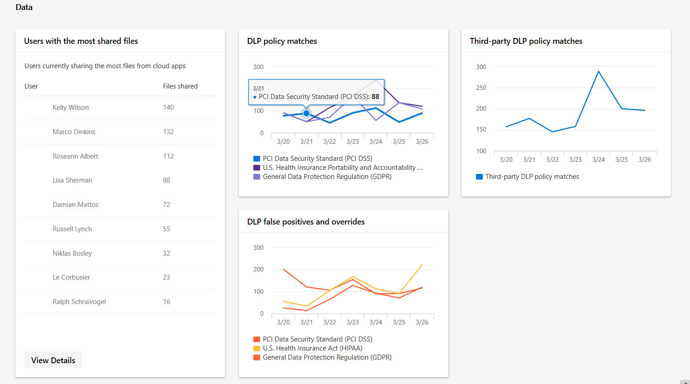

# Data övervakning och rapportering i säkerhets Center för Microsoft 365Data monitoring and reporting in the Microsoft 365 security center

**Data** kategorin hjälper till att spåra användar aktivitet som kan leda till att obehöriga data lämnas ut.The **Data** category helps track user activity that could lead to unauthorized data disclosure. De håller på att arbeta med befintliga DLP policy-rapporter samt en matchnings rapport från tredje part.They are the rework of existing DLP policy reports plus a third-party DLP policy match report.

Du kan se:You can see:

- Användare som delar de flesta filer från molnapparUsers who share the most files from cloud apps
- Hur många matchningar av DLP-principer som uppstårHow many DLP policy matches occurred
- Hur många DLP-principer som åsidosätter eller falsk identifiering rapporterasHow many DLP policies overrides or false positives are reported
- Hur många olika DLP-principer som görs i moln tjänster från tredje part via Microsoft Cloud App SecurityHow many DLP policy matches happened in third-party cloud services via Microsoft Cloud App Security

