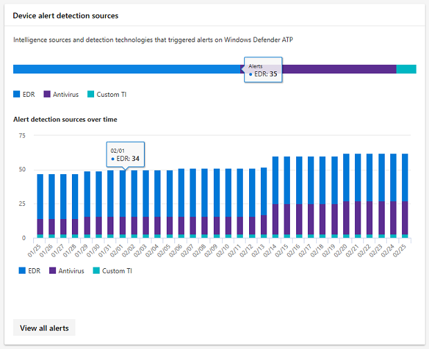
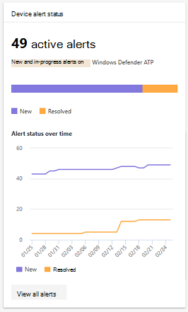
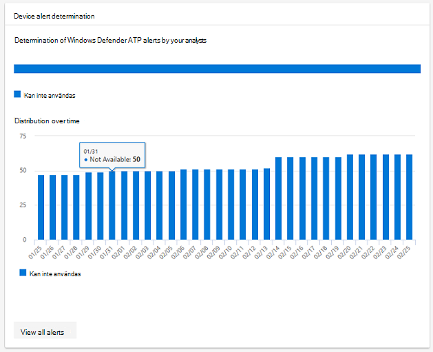
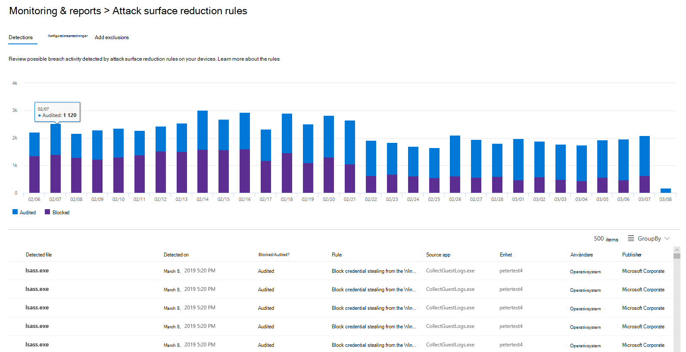

# <a name="device-monitoring-and-reporting-in-the-microsoft-365-security-center"></a><span data-ttu-id="c93fe-104">Enhets övervakning och rapportering i säkerhets Center för Microsoft 365</span><span class="sxs-lookup"><span data-stu-id="c93fe-104">Device monitoring and reporting in the Microsoft 365 security center</span></span>

[!INCLUDE [Microsoft 365 Defender rebranding](../includes/microsoft-defender.md)]


<span data-ttu-id="c93fe-105">Håll enheterna säkra, uppdaterade och håll potentiella hot i Microsoft 365 Security Center.</span><span class="sxs-lookup"><span data-stu-id="c93fe-105">Keep your devices secure, up-to-date, and spot potential threats in the Microsoft 365 security center.</span></span>

## <a name="view-device-alerts"></a><span data-ttu-id="c93fe-106">Visa enhets aviseringar</span><span class="sxs-lookup"><span data-stu-id="c93fe-106">View device alerts</span></span>

<span data-ttu-id="c93fe-107">Få uppdaterade meddelanden om intrång och andra hot på dina enheter från Microsoft Defender ATP (tillgängligt med en E5-licens).</span><span class="sxs-lookup"><span data-stu-id="c93fe-107">Get up-to-date alerts about breach activity and other threats on your devices from Microsoft Defender ATP (available with an E5 license).</span></span> <span data-ttu-id="c93fe-108">I Microsoft 365 säkerhets Center övervakas de här aviseringarna på en hög nivå med önskat arbets flöde.</span><span class="sxs-lookup"><span data-stu-id="c93fe-108">Microsoft 365 security center effectively monitors these alerts at a high level using your preferred workflow.</span></span>

### <a name="monitor-high-impact-alerts"></a><span data-ttu-id="c93fe-109">Övervaka varnings aviseringar</span><span class="sxs-lookup"><span data-stu-id="c93fe-109">Monitor high-impact alerts</span></span>

<span data-ttu-id="c93fe-110">Varje Microsoft Defender ATP-varning har en motsvarande allvarlighets grad (hög, medium, Low eller information).</span><span class="sxs-lookup"><span data-stu-id="c93fe-110">Each Microsoft Defender ATP alert has a corresponding severity (high, medium, low, or informational).</span></span> <span data-ttu-id="c93fe-111">Det här är en potentiell påverkan på nätverket om det inte finns någon.</span><span class="sxs-lookup"><span data-stu-id="c93fe-111">It indicates potential impact to your network if left unattended.</span></span>  

<span data-ttu-id="c93fe-112">Använd kortet med **allvarlighets grad för enhet** för att fokusera specifikt på meddelanden som är mer svåra och kan behöva svar direkt.</span><span class="sxs-lookup"><span data-stu-id="c93fe-112">Use the **Device alert severity** card to focus specifically on alerts that are more severe and might require immediate response.</span></span> <span data-ttu-id="c93fe-113">Från det här kortet kan du läsa mer i Microsoft Defender Security Center-portalen.</span><span class="sxs-lookup"><span data-stu-id="c93fe-113">From this card, you can view more information on the Microsoft Defender Security Center portal.</span></span>


### <a name="understand-sources-of-alerts"></a><span data-ttu-id="c93fe-115">Förstå aviserings källor</span><span class="sxs-lookup"><span data-stu-id="c93fe-115">Understand sources of alerts</span></span>

<span data-ttu-id="c93fe-116">Microsoft Defender ATP utnyttjar data från ett brett utbud av säkerhets sensorer och informations källor för att generera aviseringar.</span><span class="sxs-lookup"><span data-stu-id="c93fe-116">Microsoft Defender ATP leverages data from a broad range of security sensors and intelligence sources to generate alerts.</span></span> <span data-ttu-id="c93fe-117">Den kan till exempel använda identifierings information från Microsoft Defender Antivirus och oberoende virus kontroll från tredje part.</span><span class="sxs-lookup"><span data-stu-id="c93fe-117">For example, it can use detection information from Microsoft Defender Antivirus and third-party antimalware.</span></span> <span data-ttu-id="c93fe-118">Den kan även använda din egen anpassade Threat-information via webb tjänstens API.</span><span class="sxs-lookup"><span data-stu-id="c93fe-118">It can also use your own custom threat intelligence provided through the web service API.</span></span>

<span data-ttu-id="c93fe-119">Kortet för **identifiering av enhets aviseringar** visar distributionen av aviseringar per källa.</span><span class="sxs-lookup"><span data-stu-id="c93fe-119">The **Device alert detection** sources card shows the distribution of alerts by source.</span></span> <span data-ttu-id="c93fe-120">Spåra aktivitet relaterade till vissa källor, särskilt dina anpassade källor.</span><span class="sxs-lookup"><span data-stu-id="c93fe-120">Track activity related to certain sources, particularly your custom sources.</span></span> <span data-ttu-id="c93fe-121">Du kan också använda kortet för att fokusera på aviseringar som kommer från sensorer som inte är konfigurerade för automatisk blockering av skadlig aktivitet eller komponenter.</span><span class="sxs-lookup"><span data-stu-id="c93fe-121">You can also use the card to focus on alerts coming from sensors that aren't configured to automatically block malicious activity or components.</span></span>



<span data-ttu-id="c93fe-123">Från det här kortet kan du läsa mer i Microsoft Defender Security Center-portalen.</span><span class="sxs-lookup"><span data-stu-id="c93fe-123">From this card, you can view more information on the Microsoft Defender Security Center portal.</span></span>

### <a name="understand-the-types-of-threats-that-trigger-alerts"></a><span data-ttu-id="c93fe-124">Förstå vilka typer av hot som utlöser aviseringar</span><span class="sxs-lookup"><span data-stu-id="c93fe-124">Understand the types of threats that trigger alerts</span></span>

<span data-ttu-id="c93fe-125">Microsoft Defender ATP sorterar varje varning i en kategori som representerar ett visst Stadium i angrepps kedjan eller typen av hot komponent.</span><span class="sxs-lookup"><span data-stu-id="c93fe-125">Microsoft Defender ATP sorts each alert into a category representing a certain stage in the attack chain or type of threat component.</span></span> <span data-ttu-id="c93fe-126">En upptäckt hot-aktivitet kan till exempel kategoriseras som "sido rörelse" för att indikera att det fanns ett försök att nå andra enheter i nätverket.</span><span class="sxs-lookup"><span data-stu-id="c93fe-126">For example, a detected threat activity might be categorized as "lateral movement" to indicate there was an attempt to reach other devices on the network.</span></span> <span data-ttu-id="c93fe-127">Aktiviteten har troligt vis uppstått efter att angriparen fått ett inledande foothold.</span><span class="sxs-lookup"><span data-stu-id="c93fe-127">The activity has likely occurred after attackers gained an initial foothold.</span></span> <span data-ttu-id="c93fe-128">När en hot komponent identifieras kan den klassificeras brett som skadlig program vara eller specifikt som en viss hot-typ.</span><span class="sxs-lookup"><span data-stu-id="c93fe-128">When detected, a threat component might be classified broadly as malware or specifically as a specific threat type.</span></span> <span data-ttu-id="c93fe-129">Vissa specifika uppgifter är utpressnings tro Jan, autentiseringsuppgiften stjäla eller andra typer av skadlig eller oönskad program vara.</span><span class="sxs-lookup"><span data-stu-id="c93fe-129">Specifics include ransomware, credential stealing, or other types of malicious or unwanted software.</span></span>

<span data-ttu-id="c93fe-130">Kortet **enhets hot kategori** visar fördelningen av aviseringar i dessa kategorier.</span><span class="sxs-lookup"><span data-stu-id="c93fe-130">The **Device threat categories** card shows the distribution of alerts into these categories.</span></span> <span data-ttu-id="c93fe-131">Använd den här informationen för att identifiera hot aktivitet, till exempel försök att stjäla autentiseringsuppgiften, som vanligt vis har högre påverkan än sociala teknik försök.</span><span class="sxs-lookup"><span data-stu-id="c93fe-131">Use this information to identify threat activity, such as credential theft attempts, that usually have higher impact than social engineering attempts.</span></span> <span data-ttu-id="c93fe-132">Du kan också övervaka för potentiellt destruktiva hot som utpressnings tro Jan program vara.</span><span class="sxs-lookup"><span data-stu-id="c93fe-132">You can also to monitor for potentially destructive threats like ransomware.</span></span>


### <a name="monitor-active-alerts"></a><span data-ttu-id="c93fe-134">Övervaka aktiva aviseringar</span><span class="sxs-lookup"><span data-stu-id="c93fe-134">Monitor active alerts</span></span>

<span data-ttu-id="c93fe-135">Status kortet för **enhets aviseringar** anger antalet aviseringar som inte har lösts och kan kräva en åtgärd.</span><span class="sxs-lookup"><span data-stu-id="c93fe-135">The **Device alert status** card indicates the number of alerts that haven't been resolved and may require attention.</span></span> <span data-ttu-id="c93fe-136">Från det här kortet kan du läsa mer i Microsoft Defender Security Center-portalen.</span><span class="sxs-lookup"><span data-stu-id="c93fe-136">From this card, you can view more information on the Microsoft Defender Security Center portal.</span></span>



### <a name="monitor-classification-of-resolved-alerts"></a><span data-ttu-id="c93fe-138">Övervaka klassificering av lösta varningar</span><span class="sxs-lookup"><span data-stu-id="c93fe-138">Monitor classification of resolved alerts</span></span>

<span data-ttu-id="c93fe-139">När du löser en Microsoft Defender ATP-avisering kan din säkerhets personal ange om en avisering har verifierats som:</span><span class="sxs-lookup"><span data-stu-id="c93fe-139">When resolving a Microsoft Defender ATP alert, your security staff can specify whether an alert has been verified as:</span></span>

* <span data-ttu-id="c93fe-140">En verklig avisering som identifierar faktiska brott mot aktivitets-eller hot komponenter</span><span class="sxs-lookup"><span data-stu-id="c93fe-140">A true alert that identifies actual breach activity or threat components</span></span>
* <span data-ttu-id="c93fe-141">En falsk varning som felaktigt upptäckte normal aktivitet</span><span class="sxs-lookup"><span data-stu-id="c93fe-141">A false alert that has incorrectly detected normal activity</span></span>

<span data-ttu-id="c93fe-142">**Klassificerings kortet för enhets aviseringar** visar om dina lösta meddelanden har klassificerats som sant eller falsk.</span><span class="sxs-lookup"><span data-stu-id="c93fe-142">The **Device alert classification** card shows whether your resolved alerts have been classified as true or false alerts.</span></span> <span data-ttu-id="c93fe-143">Från det här kortet kan du läsa mer i Microsoft Defender Security Center-portalen.</span><span class="sxs-lookup"><span data-stu-id="c93fe-143">From this card, you can view more information on the Microsoft Defender Security Center portal.</span></span>

<span data-ttu-id="c93fe-144">Obs! i vissa fall är klassificerings informationen inte tillgänglig för vissa aviseringar.</span><span class="sxs-lookup"><span data-stu-id="c93fe-144">Note: In some cases, classification information is unavailable for certain alerts.</span></span>


### <a name="monitor-determination-of-resolved-alerts"></a><span data-ttu-id="c93fe-146">Övervaka fast ställande av lösta varningar</span><span class="sxs-lookup"><span data-stu-id="c93fe-146">Monitor determination of resolved alerts</span></span>

<span data-ttu-id="c93fe-147">Tillsammans med klassificering av om en avisering är sann eller falsk under upplösningen kan din säkerhets personal ge en kontroll.</span><span class="sxs-lookup"><span data-stu-id="c93fe-147">Along with classifying whether an alert is true or false during resolution, your security staff can provide a determination.</span></span> <span data-ttu-id="c93fe-148">En bestämning anger typen av normal eller skadlig aktivitet som hittades när aviseringen verifierades.</span><span class="sxs-lookup"><span data-stu-id="c93fe-148">A determination indicates the type of normal or malicious activity that was found while validating the alert.</span></span>

<span data-ttu-id="c93fe-149">**Enhetens** uppställnings kort visar vilken bestämning som tillhandahålls för varje avisering.</span><span class="sxs-lookup"><span data-stu-id="c93fe-149">The **Device alert determination** card shows the determination provided for each alert.</span></span>

* <span data-ttu-id="c93fe-150">**Apt**: Avancerat, beständiga hot, som indikerar att den identifierade aktivitetens eller hot komponentens komponenter är en del av ett avancerat brott som är utformat för att få en foothold i det berörda nätverket</span><span class="sxs-lookup"><span data-stu-id="c93fe-150">**APT**: advanced persistent threat, indicating that the detected activity or threat component is part of a sophisticated breach designed to gain a foothold in the affected network</span></span>  
* <span data-ttu-id="c93fe-151">**Skadlig program vara**: skadlig fil eller kod</span><span class="sxs-lookup"><span data-stu-id="c93fe-151">**Malware**: malicious file or code</span></span>
* <span data-ttu-id="c93fe-152">**Säkerhets personal**: normal aktivitet genomförd av säkerhets personal</span><span class="sxs-lookup"><span data-stu-id="c93fe-152">**Security personnel**: normal activity performed by security staff</span></span>
* <span data-ttu-id="c93fe-153">**Säkerhets testning**: aktivitet eller komponenter som utformats för att simulera faktiska hot och förväntas utlösa säkerhets sensorer och generera aviseringar</span><span class="sxs-lookup"><span data-stu-id="c93fe-153">**Security testing**: activity or components designed to simulate actual threats and expected to trigger security sensors and generate alerts</span></span>
* <span data-ttu-id="c93fe-154">**Oönskad program vara**: appar och annan program vara som inte betraktas som skadlig, men på annat sätt strider mot policy eller acceptabla användnings standarder</span><span class="sxs-lookup"><span data-stu-id="c93fe-154">**Unwanted software**: apps and other software that are not considered malicious, but otherwise violate policy or acceptable use standards</span></span>
* <span data-ttu-id="c93fe-155">**Andra**: alla andra bestämningar som inte faller under de tillhandahållna typerna</span><span class="sxs-lookup"><span data-stu-id="c93fe-155">**Others**: any other determination that doesn't fall under the provided types</span></span>

<span data-ttu-id="c93fe-156">Från det här kortet kan du läsa mer i Microsoft Defender säkerhets Center.</span><span class="sxs-lookup"><span data-stu-id="c93fe-156">From this card, you can view more information in Microsoft Defender Security Center.</span></span>



### <a name="understand-which-devices-are-at-risk"></a><span data-ttu-id="c93fe-158">Förstå vilka enheter som är utsatta för risk</span><span class="sxs-lookup"><span data-stu-id="c93fe-158">Understand which devices are at risk</span></span>

<span data-ttu-id="c93fe-159">**Enhets skydd** visar risk nivå för enheter.</span><span class="sxs-lookup"><span data-stu-id="c93fe-159">**Device protection** shows the risk level for devices.</span></span> <span data-ttu-id="c93fe-160">Risk nivån baseras på faktorer som typ och allvarlighets grad för aviseringar på enheten.</span><span class="sxs-lookup"><span data-stu-id="c93fe-160">The risk level is based on factors such as the type and severity of alerts on the device.</span></span>


## <a name="monitor-and-report-status-of-intune-managed-devices"></a><span data-ttu-id="c93fe-162">Övervaka och rapportera status för Intune-hanterade enheter</span><span class="sxs-lookup"><span data-stu-id="c93fe-162">Monitor and report status of Intune-managed devices</span></span>

<span data-ttu-id="c93fe-163">Följande rapporter innehåller data från enheter som registrerats i Intune.</span><span class="sxs-lookup"><span data-stu-id="c93fe-163">The following reports contain data from devices enrolled in Intune.</span></span> <span data-ttu-id="c93fe-164">Data från oregistrerade enheter ingår inte.</span><span class="sxs-lookup"><span data-stu-id="c93fe-164">Data from unenrolled devices isn't included.</span></span> <span data-ttu-id="c93fe-165">Endast globala administratörer kan visa dessa kort.</span><span class="sxs-lookup"><span data-stu-id="c93fe-165">Only Global Administrators can view these cards.</span></span>

<span data-ttu-id="c93fe-166">Intune registrerade enhets data inkluderar:</span><span class="sxs-lookup"><span data-stu-id="c93fe-166">Intune enrolled device data includes:</span></span>

* <span data-ttu-id="c93fe-167">Kompatibilitet med enheter</span><span class="sxs-lookup"><span data-stu-id="c93fe-167">Device compliance</span></span>
* <span data-ttu-id="c93fe-168">Enheter med aktiv skadlig program vara</span><span class="sxs-lookup"><span data-stu-id="c93fe-168">Devices with active malware</span></span>
* <span data-ttu-id="c93fe-169">Typer av skadlig program vara på enheter</span><span class="sxs-lookup"><span data-stu-id="c93fe-169">Types of malware on devices</span></span>
* <span data-ttu-id="c93fe-170">Skadlig kod på enheter</span><span class="sxs-lookup"><span data-stu-id="c93fe-170">Malware on devices</span></span>
* <span data-ttu-id="c93fe-171">Enheter med identifiering av skadlig program vara</span><span class="sxs-lookup"><span data-stu-id="c93fe-171">Devices with malware detections</span></span>
* <span data-ttu-id="c93fe-172">Användare med identifiering av skadlig program vara</span><span class="sxs-lookup"><span data-stu-id="c93fe-172">Users with malware detections</span></span>

### <a name="monitor-device-compliance"></a><span data-ttu-id="c93fe-173">Övervaka kompatibilitet med enheter</span><span class="sxs-lookup"><span data-stu-id="c93fe-173">Monitor device compliance</span></span>

<span data-ttu-id="c93fe-174">**Enhetens efterlevnad** visar hur många enheter som är registrerade i Intune med konfigurations principer.</span><span class="sxs-lookup"><span data-stu-id="c93fe-174">**Device compliance** shows how many devices that are enrolled in Intune comply with configuration policies.</span></span>


### <a name="discover-devices-with-malware-detections"></a><span data-ttu-id="c93fe-176">Upptäck enheter med identifiering av skadlig program vara</span><span class="sxs-lookup"><span data-stu-id="c93fe-176">Discover devices with malware detections</span></span>

<span data-ttu-id="c93fe-177">**Identifiering av enhetens skadlig kod** anger antalet Intune-registrerade enheter med skadlig kod som inte har lösts helt.</span><span class="sxs-lookup"><span data-stu-id="c93fe-177">**Device malware detections** provide the number of Intune enrolled devices with malware that hasn't been fully resolved.</span></span> <span data-ttu-id="c93fe-178">En brist på upplösning kan bero på att du har väntande åtgärder, en omstart, en fullständig genomsökning, manuella användar åtgärder eller om åtgärds åtgärden inte lyckades.</span><span class="sxs-lookup"><span data-stu-id="c93fe-178">A lack of resolution can be because of pending actions, a restart, a full scan, manual user actions, or if the remediation action was not successfully completed.</span></span>


### <a name="understand-the-types-of-malware-detected"></a><span data-ttu-id="c93fe-180">Förstå vilka typer av skadlig program vara som identifieras</span><span class="sxs-lookup"><span data-stu-id="c93fe-180">Understand the types of malware detected</span></span>

<span data-ttu-id="c93fe-181">**Typer av skadlig program vara på enheter** visar olika typer av skadlig program vara som har identifierats på enheter som har registrerats i Intune.</span><span class="sxs-lookup"><span data-stu-id="c93fe-181">**Types of malware on devices** show different kinds of malware that have been detected on devices enrolled in Intune.</span></span> <span data-ttu-id="c93fe-182">Du kan undersöka varje typ i säkerhets Center för Microsoft 365.</span><span class="sxs-lookup"><span data-stu-id="c93fe-182">You can investigate each type in the Microsoft 365 security center.</span></span>


### <a name="understand-the-specific-malware-detected-on-your-devices"></a><span data-ttu-id="c93fe-184">Förstå vilken skadlig program vara som identifieras på dina enheter</span><span class="sxs-lookup"><span data-stu-id="c93fe-184">Understand the specific malware detected on your devices</span></span>

<span data-ttu-id="c93fe-185">**Skadlig program vara på enheter** ger en lista över det specifika skadlig program vara som identifieras på dina enheter.</span><span class="sxs-lookup"><span data-stu-id="c93fe-185">**Malware on devices** provides a list of the specific malware detected on your devices.</span></span>


### <a name="understand-which-devices-have-the-most-malware"></a><span data-ttu-id="c93fe-187">Förstå vilka enheter som har flest skadligt</span><span class="sxs-lookup"><span data-stu-id="c93fe-187">Understand which devices have the most malware</span></span>

<span data-ttu-id="c93fe-188">**Enheter med identifiering av skadlig kod** visar vilka enheter som har flest identifiering av skadlig kod.</span><span class="sxs-lookup"><span data-stu-id="c93fe-188">**Devices with malware detections** show which devices have the most malware detections.</span></span> <span data-ttu-id="c93fe-189">i säkerhets Center för Microsoft 365 kan du undersöka om skadlig kod är aktiv, vem som använder enheten och dess hanterings status i Intune.</span><span class="sxs-lookup"><span data-stu-id="c93fe-189">in the Microsoft 365 security center, you can investigate whether malware is active, who uses the device, and its management status in Intune.</span></span>


### <a name="understand-which-users-have-devices-with-the-most-malware"></a><span data-ttu-id="c93fe-191">Förstå vilka användare som har enheter med flest skadligt</span><span class="sxs-lookup"><span data-stu-id="c93fe-191">Understand which users have devices with the most malware</span></span>

<span data-ttu-id="c93fe-192">**Användare med identifiering av skadlig kod** visar användare med enheter som hade flest identifierings program.</span><span class="sxs-lookup"><span data-stu-id="c93fe-192">**Users with malware detections** show users with devices that had the most malware detections.</span></span> <span data-ttu-id="c93fe-193">I Microsoft 365 säkerhets Center kan du se hur många enheter som har tilldelats till varje användare och mer information om varje enhet och typen av skadlig program vara.</span><span class="sxs-lookup"><span data-stu-id="c93fe-193">In the Microsoft 365 security center, you can see how many devices are assigned to each user and more information about each device and the type of malware.</span></span>


## <a name="monitor-and-manage-attack-surface-reduction-rule-deployment-and-detections"></a><span data-ttu-id="c93fe-195">Övervaka och hantera distribution och identifiering av attack ytans reducerings regler</span><span class="sxs-lookup"><span data-stu-id="c93fe-195">Monitor and manage attack surface reduction rule deployment and detections</span></span>

<span data-ttu-id="c93fe-196">[Reglerna för att minska attack ytan (ASR)](https://docs.microsoft.com/windows/security/threat-protection/microsoft-defender-atp/attack-surface-reduction) hjälper till att förhindra åtgärder och program som vanligt vis används av skadlig program vara för att infektera enheter.</span><span class="sxs-lookup"><span data-stu-id="c93fe-196">[Attack Surface Reduction (ASR) rules](https://docs.microsoft.com/windows/security/threat-protection/microsoft-defender-atp/attack-surface-reduction) help prevent actions and apps that are typically used by exploit-seeking malware to infect devices.</span></span> <span data-ttu-id="c93fe-197">Dessa regler bestämmer när och hur körbara filer kan köras.</span><span class="sxs-lookup"><span data-stu-id="c93fe-197">These rules control when and how executables can run.</span></span> <span data-ttu-id="c93fe-198">Du kan till exempel förhindra att Java Script eller VBScript startar en Hämtad körbar fil, blockerar Win32 API-samtal från Office-makron eller blockerar processer som körs från USB-enheter.</span><span class="sxs-lookup"><span data-stu-id="c93fe-198">For example, you can prevent JavaScript or VBScript from launching a downloaded executable, block Win32 API calls from Office macros, or block processes that run from USB drives.</span></span>


<span data-ttu-id="c93fe-200">Ett kort med **regler för reducering av attack ytan** ger en översikt över drift sättningen av regler på dina enheter.</span><span class="sxs-lookup"><span data-stu-id="c93fe-200">The **Attack surface reduction rules** card provides an overview of the deployment of rules across your devices.</span></span>

<span data-ttu-id="c93fe-201">I det övre fältet på kortet visas det totala antalet enheter i följande distributions lägen:</span><span class="sxs-lookup"><span data-stu-id="c93fe-201">The top bar on the card shows the total number of devices that are in the following deployment modes:</span></span>

* <span data-ttu-id="c93fe-202">**Blockeringsregler**: enheter med minst en regel konfigurerad för att blockera upptäckta aktiviteter</span><span class="sxs-lookup"><span data-stu-id="c93fe-202">**Block mode**: devices with at least one rule configured to block detected activity</span></span>
* <span data-ttu-id="c93fe-203">**Gransknings läge**: enheter utan regler som ställts in på blockera upptäckta aktiviteter, men har minst en regel inställd på att granska upptäckta aktiviteter</span><span class="sxs-lookup"><span data-stu-id="c93fe-203">**Audit mode**: devices with no rules set to block detected activity, but has at least one rule set to audit detected activity</span></span>  
* <span data-ttu-id="c93fe-204">**Av**: enheter där alla ASR-regler är inaktiverade</span><span class="sxs-lookup"><span data-stu-id="c93fe-204">**Off**: devices with all ASR rules turned off</span></span>

<span data-ttu-id="c93fe-205">I den nedre delen av det här kortet visas inställningar efter linje på dina enheter.</span><span class="sxs-lookup"><span data-stu-id="c93fe-205">The lower part of this card shows settings by rule across your devices.</span></span> <span data-ttu-id="c93fe-206">Varje stapel visar antalet enheter som är inställda på att blockera, granska identifiering eller låta regeln vara avaktiverad.</span><span class="sxs-lookup"><span data-stu-id="c93fe-206">Each bar indicates the number of devices that are set to block, audit detection, or have the rule completely turned off.</span></span>

### <a name="view-asr-detections"></a><span data-ttu-id="c93fe-207">Visa ASR-identifieringar</span><span class="sxs-lookup"><span data-stu-id="c93fe-207">View ASR detections</span></span>

<span data-ttu-id="c93fe-208">Om du vill visa detaljerad information om identifieringar av ASR-regler i nätverket väljer du **Visa identifieringar** på kortet för **reducerings regler för attack ytan** .</span><span class="sxs-lookup"><span data-stu-id="c93fe-208">To view detailed information about ASR rule detections in your network, select **View detections** on the **Attack surface reduction rules** card.</span></span> <span data-ttu-id="c93fe-209">Fliken **identifieringar** på sidan detaljerad rapport öppnas.</span><span class="sxs-lookup"><span data-stu-id="c93fe-209">The **Detections** tab in the detailed report page will open.</span></span>



<span data-ttu-id="c93fe-211">Diagrammet högst upp på sidan visar identifieringar som antingen blockerades eller granskats.</span><span class="sxs-lookup"><span data-stu-id="c93fe-211">The chart at the top of the page shows detections over time stacking detections that were either blocked or audited.</span></span> <span data-ttu-id="c93fe-212">Tabellen längst ned visar de senaste identifieringarna.</span><span class="sxs-lookup"><span data-stu-id="c93fe-212">The table at the bottom lists the most recent detections.</span></span> <span data-ttu-id="c93fe-213">Använd följande information om tabellen för att förstå vad identifieringarna är:</span><span class="sxs-lookup"><span data-stu-id="c93fe-213">Use the following information on the table to understand the nature of the detections:</span></span>

* <span data-ttu-id="c93fe-214">**Identifierad fil**: filen, vanligt vis ett skript eller dokument, vars innehåll utlöste den misstänkta angrepps aktiviteten</span><span class="sxs-lookup"><span data-stu-id="c93fe-214">**Detected file**: the file, typically a script or document, whose contents triggered the suspected attack activity</span></span>
* <span data-ttu-id="c93fe-215">**Regel**: namn som beskriver de angrepps aktiviteter som regeln har utformats för att fånga.</span><span class="sxs-lookup"><span data-stu-id="c93fe-215">**Rule**: name describing the attack activities the rule is designed to catch.</span></span> <span data-ttu-id="c93fe-216">Läsa om befintliga ASR-regler</span><span class="sxs-lookup"><span data-stu-id="c93fe-216">Read about existing ASR rules</span></span>
* <span data-ttu-id="c93fe-217">**Käll program**: programmet som läste in eller utförde innehåll utlöste den misstänkta angrepps aktiviteten.</span><span class="sxs-lookup"><span data-stu-id="c93fe-217">**Source app**: the application that loaded or executed content triggering the suspected attack activity.</span></span> <span data-ttu-id="c93fe-218">Det kan vara ett legitimt program, till exempel en webbläsare, ett Office-program eller ett system verktyg som PowerShell</span><span class="sxs-lookup"><span data-stu-id="c93fe-218">It could be a legitimate application, such as web browser, an Office application, or a system tool like PowerShell</span></span>
* <span data-ttu-id="c93fe-219">**Utgivare**: den leverantör som släppte källmappen</span><span class="sxs-lookup"><span data-stu-id="c93fe-219">**Publisher**: the vendor that released the source app</span></span>

### <a name="review-device-asr-rule-settings"></a><span data-ttu-id="c93fe-220">Granska inställningar för enhet i ASR-regler</span><span class="sxs-lookup"><span data-stu-id="c93fe-220">Review device ASR rule settings</span></span>

<span data-ttu-id="c93fe-221">Gå till fliken **konfiguration** och granska regel inställningar för enskilda enheter på sidan för **reducerings regler för attack yta** .</span><span class="sxs-lookup"><span data-stu-id="c93fe-221">In the **Attack surface reduction rules** report page, go to the **Configuration** tab to review rule settings for individual devices.</span></span> <span data-ttu-id="c93fe-222">Välj en enhet för att få detaljerad information om huruvida varje regel är i spärr läge, gransknings läge eller inaktive rad.</span><span class="sxs-lookup"><span data-stu-id="c93fe-222">Select a device to get detailed information about whether each rule is in block mode, audit mode, or turned off entirely.</span></span>


<span data-ttu-id="c93fe-224">Microsoft Intune tillhandahåller hanterings funktioner för dina ASR-regler.</span><span class="sxs-lookup"><span data-stu-id="c93fe-224">Microsoft Intune provides management functionality for your ASR rules.</span></span> <span data-ttu-id="c93fe-225">Om du vill uppdatera dina inställningar väljer du **komma igång** under **Konfigurera enheter** på fliken för att öppna enhets hantering för Intune.</span><span class="sxs-lookup"><span data-stu-id="c93fe-225">If you want to update your settings, select **Get started** under **Configure devices** in the tab to open device management on Intune.</span></span>

### <a name="exclude-files-from-asr-rules"></a><span data-ttu-id="c93fe-226">Utesluta filer från ASR-regler</span><span class="sxs-lookup"><span data-stu-id="c93fe-226">Exclude files from ASR rules</span></span>

<span data-ttu-id="c93fe-227">I Microsoft 365 säkerhets Center samlas namnen på de [filer som du vill ska undantas](https://docs.microsoft.com/windows/security/threat-protection/microsoft-defender-atp/enable-attack-surface-reduction#exclude-files-and-folders-from-asr-rules) från identifiering av regler för reducering av attack ytan.</span><span class="sxs-lookup"><span data-stu-id="c93fe-227">Microsoft 365 security center collects the names of the [files you might want to exclude](https://docs.microsoft.com/windows/security/threat-protection/microsoft-defender-atp/enable-attack-surface-reduction#exclude-files-and-folders-from-asr-rules) from detections by attack surface reduction rules.</span></span> <span data-ttu-id="c93fe-228">Genom att utesluta filer kan du minska falska positiva identifieringar och mer säkert distribuera regler för begränsning av attack ytan i block läge.</span><span class="sxs-lookup"><span data-stu-id="c93fe-228">By excluding files, you can reduce false positive detections and more confidently deploy attack surface reduction rules in block mode.</span></span>

<span data-ttu-id="c93fe-229">Undantagen hanteras i Microsoft Intune, men i säkerhets Center för Microsoft 365 finns ett analys verktyg som hjälper dig att förstå filerna.</span><span class="sxs-lookup"><span data-stu-id="c93fe-229">The exclusions are managed on Microsoft Intune, but Microsoft 365 security center provides an analysis tool to help you understand the files.</span></span> <span data-ttu-id="c93fe-230">Om du vill börja samla in filer som ska uteslutas går du till fliken **Lägg till undantag** på sidan **reducerings regler för attack yta** .</span><span class="sxs-lookup"><span data-stu-id="c93fe-230">To start collecting files for exclusion, go to the **Add exclusions** tab in the **Attack surface reduction rules** report page.</span></span>

>[!NOTE]  
><span data-ttu-id="c93fe-231">Med verktyget analyseras eventuella reducerings regler för attack ytan, men [endast vissa regler stöder undantag](https://docs.microsoft.com/windows/security/threat-protection/microsoft-defender-atp/troubleshoot-asr).</span><span class="sxs-lookup"><span data-stu-id="c93fe-231">The tool analyzes detections by all attack surface reduction rules, but [only some rules support exclusions](https://docs.microsoft.com/windows/security/threat-protection/microsoft-defender-atp/troubleshoot-asr).</span></span>


<span data-ttu-id="c93fe-233">I tabellen visas alla fil namn som identifieras av reglerna för reducering av attack ytan.</span><span class="sxs-lookup"><span data-stu-id="c93fe-233">The table lists all the file names detected by your attack surface reduction rules.</span></span> <span data-ttu-id="c93fe-234">Du kan välja filer för att se hur utesluta dem:</span><span class="sxs-lookup"><span data-stu-id="c93fe-234">You can select files to review the impact of excluding them:</span></span>

* <span data-ttu-id="c93fe-235">Hur många färre identifieringar</span><span class="sxs-lookup"><span data-stu-id="c93fe-235">How many fewer detections</span></span>
* <span data-ttu-id="c93fe-236">Hur många färre enheter rapporterar identifieringen</span><span class="sxs-lookup"><span data-stu-id="c93fe-236">How many fewer devices report the detections</span></span>

<span data-ttu-id="c93fe-237">Om du vill ha en lista över de markerade filerna med deras fullständiga sökvägar, väljer du **Hämta undantags Sök vägar**.</span><span class="sxs-lookup"><span data-stu-id="c93fe-237">To get a list of the selected files with their full paths for exclusion, select **Get exclusion paths**.</span></span>

<span data-ttu-id="c93fe-238">Loggar för automatisk uppdatering av ASR **-regel blocket som stjälas från Windows lokala säkerhets auktoritets under system (lsass.exe)** Hämta käll programmet **lsass.exe**.</span><span class="sxs-lookup"><span data-stu-id="c93fe-238">Logs for the ASR rule **Block credential stealing from the Windows local security authority subsystem (lsass.exe)** capture the source app **lsass.exe**.</span></span> <span data-ttu-id="c93fe-239">Det är en normal system fil, men den identifieras som den upptäckta filen.</span><span class="sxs-lookup"><span data-stu-id="c93fe-239">It is a normal system file, but captured as the detected file.</span></span> <span data-ttu-id="c93fe-240">Det innebär att den genererade listan med undantags Sök vägar inkluderar den här filen.</span><span class="sxs-lookup"><span data-stu-id="c93fe-240">As a result, the generated list of exclusion paths will include this file.</span></span> <span data-ttu-id="c93fe-241">Om du vill utesluta filen som utlöste den här regeln i stället för **lsass.exe**använder du sökvägen till käll programmet i stället för den identifierade filen.</span><span class="sxs-lookup"><span data-stu-id="c93fe-241">To exclude the file that triggered this rule instead of **lsass.exe**, use the path to the source app instead of the detected file.</span></span>

<span data-ttu-id="c93fe-242">Om du vill leta reda på käll programmet kör du följande frågor för den här [frågan](https://docs.microsoft.com/windows/security/threat-protection/microsoft-defender-atp/advanced-hunting) (identifieras enligt regel-ID 9e6c4e1f-7d60-472f-ba1a-a39ef669e4b2):</span><span class="sxs-lookup"><span data-stu-id="c93fe-242">To locate the source app, run the following [advanced hunting query](https://docs.microsoft.com/windows/security/threat-protection/microsoft-defender-atp/advanced-hunting) for this specific rule (identified by rule ID 9e6c4e1f-7d60-472f-ba1a-a39ef669e4b2):</span></span>

```kusto
DeviceEvents
| where Timestamp > ago(7d)
| where ActionType startswith "Asr"
| where AdditionalFields contains "9e6c4e1f-7d60-472f-ba1a-a39ef669e4b2"
| project InitiatingProcessFolderPath, InitiatingProcessFileName
```

#### <a name="check-files-for-exclusion"></a><span data-ttu-id="c93fe-243">Kontrol lera filer för uteslutning</span><span class="sxs-lookup"><span data-stu-id="c93fe-243">Check files for exclusion</span></span>

<span data-ttu-id="c93fe-244">Innan du utesluter en fil från ASR rekommenderar vi att du kontrollerar filen för att ta reda på om den inte är skadlig.</span><span class="sxs-lookup"><span data-stu-id="c93fe-244">Before excluding a file from ASR, we recommend that you inspect the file to determine if it's indeed not malicious.</span></span>

<span data-ttu-id="c93fe-245">Om du vill granska en fil använder du [fil informations sidan](https://docs.microsoft.com/windows/security/threat-protection/microsoft-defender-atp/investigate-files) i Microsoft Defender säkerhets Center.</span><span class="sxs-lookup"><span data-stu-id="c93fe-245">To review a file, use the [file information page](https://docs.microsoft.com/windows/security/threat-protection/microsoft-defender-atp/investigate-files) on Microsoft Defender Security Center.</span></span> <span data-ttu-id="c93fe-246">Sidan visar information om förvalen och VirusTotal Antivirus täckning.</span><span class="sxs-lookup"><span data-stu-id="c93fe-246">The page provides prevalence information and the VirusTotal antivirus detection ratio.</span></span> <span data-ttu-id="c93fe-247">Du kan också använda sidan för att skicka filen för djup analys.</span><span class="sxs-lookup"><span data-stu-id="c93fe-247">You can also use the page to submit the file for deep analysis.</span></span>

<span data-ttu-id="c93fe-248">Leta reda på en identifierad fil i Microsoft Defender säkerhets Center genom att söka efter alla ASR-identifieringar med följande avancerade jakt frågor:</span><span class="sxs-lookup"><span data-stu-id="c93fe-248">To locate a detected file in Microsoft Defender Security Center, search for all ASR detections using the following advanced hunting query:</span></span>

```kusto
MiscEvents
| where EventTime > ago(7d)
| where ActionType startswith "Asr"
| project FolderPath, FileName, SHA1, InitiatingProcessFolderPath, InitiatingProcessFileName, InitiatingProcessSHA1
```

<span data-ttu-id="c93fe-249">Använd **SHA1** eller **InitiatingProcessSHA1** i resultaten för att söka efter filen med hjälp av det universella Sök fältet i Microsoft Defender säkerhets Center.</span><span class="sxs-lookup"><span data-stu-id="c93fe-249">Use the **SHA1** or the **InitiatingProcessSHA1** in the results to search for the file using the universal search bar in Microsoft Defender Security Center.</span></span>
