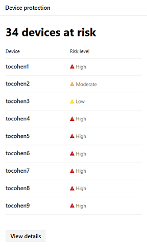

# <a name="device-monitoring-and-reporting-in-the-microsoft-365-security-center"></a><span data-ttu-id="7346e-104">Enhetsövervakning och rapportering i Microsoft 365-säkerhetscentret</span><span class="sxs-lookup"><span data-stu-id="7346e-104">Device monitoring and reporting in the Microsoft 365 security center</span></span>

<span data-ttu-id="7346e-105">Skydda dina enheter, uppdaterade och upptäck potentiella hot i säkerhetscentret Microsoft 365.</span><span class="sxs-lookup"><span data-stu-id="7346e-105">Keep your devices secure, up-to-date, and spot potential threats in the Microsoft 365 security center.</span></span>

## <a name="view-device-alerts"></a><span data-ttu-id="7346e-106">Visa enhetsaviseringar</span><span class="sxs-lookup"><span data-stu-id="7346e-106">View device alerts</span></span>

<span data-ttu-id="7346e-107">Få aktuella aviseringar om intrångsaktivitet och andra hot på dina enheter från Microsoft Defender ATP (tillgängligt med en E5-licens).</span><span class="sxs-lookup"><span data-stu-id="7346e-107">Get up-to-date alerts about breach activity and other threats on your devices from Microsoft Defender ATP (available with an E5 license).</span></span> <span data-ttu-id="7346e-108">Microsoft 365-säkerhetscenter övervakar effektivt dessa aviseringar på en hög nivå med hjälp av ditt önskade arbetsflöde.</span><span class="sxs-lookup"><span data-stu-id="7346e-108">Microsoft 365 security center effectively monitors these alerts at a high level using your preferred workflow.</span></span>

### <a name="monitor-high-impact-alerts"></a><span data-ttu-id="7346e-109">Övervaka varningar med hög genomslagskraft</span><span class="sxs-lookup"><span data-stu-id="7346e-109">Monitor high-impact alerts</span></span>

<span data-ttu-id="7346e-110">Varje Microsoft Defender ATP-avisering har en motsvarande allvarlighetsgrad (hög, medel, låg eller informativ) som anger dess potentiella inverkan på nätverket om den lämnas obevakad.</span><span class="sxs-lookup"><span data-stu-id="7346e-110">Each Microsoft Defender ATP alert has a corresponding severity (high, medium, low, or informational) that indicates its potential impact to your network if left unattended.</span></span>  

<span data-ttu-id="7346e-111">Använd **allvarlighetsgradkortet för enhetsavisering** för att specifikt fokusera på aviseringar som är allvarligare och som kan kräva omedelbara svar.</span><span class="sxs-lookup"><span data-stu-id="7346e-111">Use the **Device alert severity** card to focus specifically on alerts that are more severe and might require immediate response.</span></span> <span data-ttu-id="7346e-112">På det här kortet kan du visa mer information på Microsoft Defender Security Center-portalen.</span><span class="sxs-lookup"><span data-stu-id="7346e-112">From this card, you can view more information on the Microsoft Defender Security Center portal.</span></span>


### <a name="understand-sources-of-alerts"></a><span data-ttu-id="7346e-114">Förstå källor till varningar</span><span class="sxs-lookup"><span data-stu-id="7346e-114">Understand sources of alerts</span></span>

<span data-ttu-id="7346e-115">Microsoft Defender ATP utnyttjar data från ett brett spektrum av säkerhetssensorer och underrättelsekällor för att generera aviseringar.</span><span class="sxs-lookup"><span data-stu-id="7346e-115">Microsoft Defender ATP leverages data from a broad range of security sensors and intelligence sources to generate alerts.</span></span> <span data-ttu-id="7346e-116">Den kan till exempel använda identifieringsinformation från Windows Defender Antivirus och antimalware från tredje part, samt din egen anpassade hotinformation som tillhandahålls via webbtjänst-API:et.</span><span class="sxs-lookup"><span data-stu-id="7346e-116">For example, it can use detection information from Windows Defender Antivirus and third-party antimalware, as well as your own custom threat intelligence provided through the web service API.</span></span>

<span data-ttu-id="7346e-117">Kortet För identifiering av **enhetsaviseringsidentifiering** visar distributionen av aviseringar efter källa.</span><span class="sxs-lookup"><span data-stu-id="7346e-117">The **Device alert detection** sources card shows the distribution of alerts by source.</span></span> <span data-ttu-id="7346e-118">Det här kortet kan hjälpa dig att spåra aktivitet som är relaterad till vissa källor, särskilt dina anpassade källor.</span><span class="sxs-lookup"><span data-stu-id="7346e-118">This card can help you track activity related to certain sources, particularly your custom sources.</span></span> <span data-ttu-id="7346e-119">Du kan också använda detta för att fokusera på aviseringar som kommer från sensorer som inte är konfigurerade för att automatiskt blockera skadlig aktivitet eller komponenter.</span><span class="sxs-lookup"><span data-stu-id="7346e-119">You can also use this to focus on alerts coming from sensors that are not configured to automatically block malicious activity or components.</span></span>


<span data-ttu-id="7346e-121">På det här kortet kan du visa mer information på Microsoft Defender Security Center-portalen.</span><span class="sxs-lookup"><span data-stu-id="7346e-121">From this card, you can view more information on the Microsoft Defender Security Center portal.</span></span>

### <a name="understand-the-types-of-threats-that-trigger-alerts"></a><span data-ttu-id="7346e-122">Förstå vilka typer av hot som utlöser aviseringar</span><span class="sxs-lookup"><span data-stu-id="7346e-122">Understand the types of threats that trigger alerts</span></span>

<span data-ttu-id="7346e-123">Microsoft Defender ATP sorterar varje avisering i en kategori som representerar ett visst stadium i attackkedjan eller en typ av hotkomponent.</span><span class="sxs-lookup"><span data-stu-id="7346e-123">Microsoft Defender ATP sorts each alert into a category representing a certain stage in the attack chain or a type of threat component.</span></span> <span data-ttu-id="7346e-124">En identifierad hotaktivitet kan till exempel kategoriseras som "lateral rörelse" för att indikera att det gjordes ett försök att nå andra enheter i nätverket.</span><span class="sxs-lookup"><span data-stu-id="7346e-124">For example, a detected threat activity might be categorized as "lateral movement" to indicate that there was an attempt to reach other devices on the network.</span></span> <span data-ttu-id="7346e-125">Aktiviteten har också sannolikt inträffat efter att angripare fått ett första fotfäste.</span><span class="sxs-lookup"><span data-stu-id="7346e-125">The activity has also likely occurred after attackers gained an initial foothold.</span></span> <span data-ttu-id="7346e-126">När en hotkomponent upptäcks kan den antingen klassificeras som skadlig kod eller mer specifikt som ransomware, stöld av autentiseringsuppgifter eller andra typer av skadlig eller oönskad programvara.</span><span class="sxs-lookup"><span data-stu-id="7346e-126">When detected, a threat component might either be classified broadly as malware, or more specifically as ransomware, credential stealing, or other types of malicious or unwanted software.</span></span>

<span data-ttu-id="7346e-127">Kortet **Enhetshotkategorier** visar fördelningen av aviseringar i dessa kategorier.</span><span class="sxs-lookup"><span data-stu-id="7346e-127">The **Device threat categories** card shows the distribution of alerts into these categories.</span></span> <span data-ttu-id="7346e-128">Du kan använda den här informationen för att identifiera hotaktivitet, till exempel stöldförsök, som kan ha större inverkan jämfört med sociala ingenjörsförsök.</span><span class="sxs-lookup"><span data-stu-id="7346e-128">You can use this information to identify threat activity, such as credential theft attempts, that can have higher impact compared to social engineering attempts.</span></span> <span data-ttu-id="7346e-129">Du kan också använda den här informationen för att övervaka potentiellt destruktiva hot som ransomware.</span><span class="sxs-lookup"><span data-stu-id="7346e-129">You can also use this information to monitor for potentially destructive threats like ransomware.</span></span>


### <a name="monitor-active-alerts"></a><span data-ttu-id="7346e-131">Övervaka aktiva aviseringar</span><span class="sxs-lookup"><span data-stu-id="7346e-131">Monitor active alerts</span></span>

<span data-ttu-id="7346e-132">**Statuskortet för enhetsavisering** anger antalet aviseringar som inte har lösts och som kan kräva uppmärksamhet.</span><span class="sxs-lookup"><span data-stu-id="7346e-132">The **Device alert status** card indicates the number of alerts that have not been resolved and might require attention.</span></span> <span data-ttu-id="7346e-133">På det här kortet kan du visa mer information på Microsoft Defender Security Center-portalen.</span><span class="sxs-lookup"><span data-stu-id="7346e-133">From this card, you can view more information on the Microsoft Defender Security Center portal.</span></span>


### <a name="monitor-classification-of-resolved-alerts"></a><span data-ttu-id="7346e-135">Övervaka klassificering av lösta aviseringar</span><span class="sxs-lookup"><span data-stu-id="7346e-135">Monitor classification of resolved alerts</span></span>

<span data-ttu-id="7346e-136">När du löser en Microsoft Defender ATP-avisering kan säkerhetspersonalen ange om en avisering har verifierats som:</span><span class="sxs-lookup"><span data-stu-id="7346e-136">When resolving a Microsoft Defender ATP alert, your security staff can specify whether an alert has been verified as:</span></span>

* <span data-ttu-id="7346e-137">En sann avisering som identifierar faktisk intrångsaktivitet eller hotkomponenter</span><span class="sxs-lookup"><span data-stu-id="7346e-137">A true alert that identifies actual breach activity or threat components</span></span>
* <span data-ttu-id="7346e-138">En falsk avisering som felaktigt har upptäckt normal aktivitet</span><span class="sxs-lookup"><span data-stu-id="7346e-138">A false alert that has incorrectly detected normal activity</span></span>

<span data-ttu-id="7346e-139">**Klassificeringskortet för enhetsvarningar** visar om dina lösta aviseringar har klassificerats som sanna eller falska aviseringar.</span><span class="sxs-lookup"><span data-stu-id="7346e-139">The **Device alert classification** card shows whether your resolved alerts have been classified as true or false alerts.</span></span> <span data-ttu-id="7346e-140">På det här kortet kan du visa mer information på Microsoft Defender Security Center-portalen.</span><span class="sxs-lookup"><span data-stu-id="7346e-140">From this card, you can view more information on the Microsoft Defender Security Center portal.</span></span>

<span data-ttu-id="7346e-141">I vissa fall är klassificeringsinformation inte tillgänglig för vissa aviseringar.</span><span class="sxs-lookup"><span data-stu-id="7346e-141">Note: In some cases, classification information is unavailable for certain alerts.</span></span>


### <a name="monitor-determination-of-resolved-alerts"></a><span data-ttu-id="7346e-143">Övervaka bestämning av lösta aviseringar</span><span class="sxs-lookup"><span data-stu-id="7346e-143">Monitor determination of resolved alerts</span></span>

<span data-ttu-id="7346e-144">Förutom att klassificera om en avisering är sann eller falsk under upplösningen kan säkerhetspersonalen ange vilken typ av normal eller skadlig aktivitet som hittades när aviseringen validerades.</span><span class="sxs-lookup"><span data-stu-id="7346e-144">In addition to classifying whether an alert is true or false during resolution, your security staff can provide a determination, indicating the type of normal or malicious activity that was found while validating the alert.</span></span>

<span data-ttu-id="7346e-145">**Bestämningskortet för enhetsvarning** visar den bestämning som anges för varje varning.</span><span class="sxs-lookup"><span data-stu-id="7346e-145">The **Device alert determination** card shows the determination provided for each alert.</span></span>

* <span data-ttu-id="7346e-146">**APT**: avancerat beständigt hot, vilket indikerar att den upptäckta aktiviteten eller hotkomponenten är en del av en sofistikerad överträdelse som är utformad för att få fotfäste i det berörda nätverket</span><span class="sxs-lookup"><span data-stu-id="7346e-146">**APT**: advanced persistent threat, indicating that the detected activity or threat component is part of a sophisticated breach designed to gain a foothold in the affected network</span></span>  
* <span data-ttu-id="7346e-147">**Skadlig kod:** skadlig fil eller kod</span><span class="sxs-lookup"><span data-stu-id="7346e-147">**Malware**: malicious file or code</span></span>
* <span data-ttu-id="7346e-148">**Säkerhetspersonal**: normal verksamhet utförd av säkerhetspersonal</span><span class="sxs-lookup"><span data-stu-id="7346e-148">**Security personnel**: normal activity performed by security staff</span></span>
* <span data-ttu-id="7346e-149">**Säkerhetstestning:** aktivitet eller komponenter som utformats för att simulera faktiska hot och förväntas utlösa säkerhetssensorer och generera varningar</span><span class="sxs-lookup"><span data-stu-id="7346e-149">**Security testing**: activity or components designed to simulate actual threats and expected to trigger security sensors and generate alerts</span></span>
* <span data-ttu-id="7346e-150">**Oönskad programvara:** appar och annan programvara som inte anses vara skadlig, men som på annat sätt bryter mot policy- eller godtagbara användningsstandarder</span><span class="sxs-lookup"><span data-stu-id="7346e-150">**Unwanted software**: apps and other software that are not considered malicious, but otherwise violate policy or acceptable use standards</span></span>
* <span data-ttu-id="7346e-151">**Övrigt:** varje annan bestämning som inte omfattas av de angivna typerna</span><span class="sxs-lookup"><span data-stu-id="7346e-151">**Others**: any other determination that does not fall under the provided types</span></span>

<span data-ttu-id="7346e-152">På det här kortet kan du visa mer information i Microsoft Defender Security Center.</span><span class="sxs-lookup"><span data-stu-id="7346e-152">From this card, you can view more information in Microsoft Defender Security Center.</span></span>


### <a name="understand-which-devices-are-at-risk"></a><span data-ttu-id="7346e-154">Förstå vilka enheter som är i riskzonen</span><span class="sxs-lookup"><span data-stu-id="7346e-154">Understand which devices are at risk</span></span>

<span data-ttu-id="7346e-155">**Enhetsskydd** visar risknivån för enheter.</span><span class="sxs-lookup"><span data-stu-id="7346e-155">**Device protection** shows the risk level for devices.</span></span> <span data-ttu-id="7346e-156">Risknivån baseras på faktorer som typ och allvarlighetsgrad för aviseringar på enheten.</span><span class="sxs-lookup"><span data-stu-id="7346e-156">The risk level is based on factors such as the type and severity of alerts on the device.</span></span>



## <a name="monitor-and-report-status-of-intune-managed-devices"></a><span data-ttu-id="7346e-158">Övervaka och rapportera status för Intune-hanterade enheter</span><span class="sxs-lookup"><span data-stu-id="7346e-158">Monitor and report status of Intune-managed devices</span></span>

<span data-ttu-id="7346e-159">Följande rapporter innehåller data från enheter som registrerats i Intune.</span><span class="sxs-lookup"><span data-stu-id="7346e-159">The following reports contain data from devices enrolled in Intune.</span></span> <span data-ttu-id="7346e-160">Data från ej registrerade enheter ingår inte.</span><span class="sxs-lookup"><span data-stu-id="7346e-160">Data from unenrolled devices is not included.</span></span> <span data-ttu-id="7346e-161">Endast globala administratörer kan visa dessa kort.</span><span class="sxs-lookup"><span data-stu-id="7346e-161">Only Global Administrators can view these cards.</span></span>

<span data-ttu-id="7346e-162">Intune-registrerade enhetsdata omfattar:</span><span class="sxs-lookup"><span data-stu-id="7346e-162">Intune enrolled device data includes:</span></span>

* <span data-ttu-id="7346e-163">Enhetsefterlevnad</span><span class="sxs-lookup"><span data-stu-id="7346e-163">Device compliance</span></span>
* <span data-ttu-id="7346e-164">Enheter med aktiv skadlig kod</span><span class="sxs-lookup"><span data-stu-id="7346e-164">Devices with active malware</span></span>
* <span data-ttu-id="7346e-165">Typer av skadlig kod på enheter</span><span class="sxs-lookup"><span data-stu-id="7346e-165">Types of malware on devices</span></span>
* <span data-ttu-id="7346e-166">Skadlig kod på enheter</span><span class="sxs-lookup"><span data-stu-id="7346e-166">Malware on devices</span></span>
* <span data-ttu-id="7346e-167">Enheter med identifiering av skadlig programvara</span><span class="sxs-lookup"><span data-stu-id="7346e-167">Devices with malware detections</span></span>
* <span data-ttu-id="7346e-168">Användare med upptäckt av skadlig programvara</span><span class="sxs-lookup"><span data-stu-id="7346e-168">Users with malware detections</span></span>

### <a name="monitor-device-compliance"></a><span data-ttu-id="7346e-169">Övervaka enhetens efterlevnad</span><span class="sxs-lookup"><span data-stu-id="7346e-169">Monitor device compliance</span></span>

<span data-ttu-id="7346e-170">**Enhetsefterlevnad** visar hur många enheter som är registrerade i Intune följer konfigurationsprinciper.</span><span class="sxs-lookup"><span data-stu-id="7346e-170">**Device compliance** shows how many devices that are enrolled in Intune comply with configuration policies.</span></span>


### <a name="discover-devices-with-malware-detections"></a><span data-ttu-id="7346e-172">Upptäck enheter med identifiering av skadlig programvara</span><span class="sxs-lookup"><span data-stu-id="7346e-172">Discover devices with malware detections</span></span>

<span data-ttu-id="7346e-173">**Identifiering av skadlig programvara** för enhet ger antalet Intune-registrerade enheter med skadlig kod som inte har lösts helt.</span><span class="sxs-lookup"><span data-stu-id="7346e-173">**Device malware detections** provide the number of Intune enrolled devices with malware that have not been fully resolved.</span></span> <span data-ttu-id="7346e-174">Detta kan bero på väntande åtgärder, en omstart, en fullständig genomsökning, manuella användaråtgärder eller om reparationsåtgärden inte slutfördes.</span><span class="sxs-lookup"><span data-stu-id="7346e-174">This can be due to pending actions, a restart, a full scan, manual user actions, or if the remediation action did not complete successfully.</span></span>


### <a name="understand-the-types-of-malware-detected"></a><span data-ttu-id="7346e-176">Förstå vilka typer av skadlig kod som har upptäckts</span><span class="sxs-lookup"><span data-stu-id="7346e-176">Understand the types of malware detected</span></span>

<span data-ttu-id="7346e-177">**Typer av skadlig kod på enheter** visar olika typer av skadlig kod som har upptäckts på enheter som registrerats i Intune.</span><span class="sxs-lookup"><span data-stu-id="7346e-177">**Types of malware on devices** show different kinds of malware that have been detected on devices enrolled in Intune.</span></span> <span data-ttu-id="7346e-178">Du kan undersöka varje typ i Microsoft 365-säkerhetscentret.</span><span class="sxs-lookup"><span data-stu-id="7346e-178">You can investigate each type in the Microsoft 365 security center.</span></span>


### <a name="understand-the-specific-malware-detected-on-your-devices"></a><span data-ttu-id="7346e-180">Förstå den specifika skadlig kod som upptäckts på dina enheter</span><span class="sxs-lookup"><span data-stu-id="7346e-180">Understand the specific malware detected on your devices</span></span>

<span data-ttu-id="7346e-181">**Skadlig kod på enheter** innehåller en lista över den specifika skadlig kod som har upptäckts på dina enheter.</span><span class="sxs-lookup"><span data-stu-id="7346e-181">**Malware on devices** provide a list of the specific malware detected on your devices.</span></span>


### <a name="understand-which-devices-have-the-most-malware"></a><span data-ttu-id="7346e-183">Förstå vilka enheter som har mest skadlig kod</span><span class="sxs-lookup"><span data-stu-id="7346e-183">Understand which devices have the most malware</span></span>

<span data-ttu-id="7346e-184">**Enheter med identifiering av skadlig programvara** visar vilka enheter som har flest identifieringar av skadlig kod.</span><span class="sxs-lookup"><span data-stu-id="7346e-184">**Devices with malware detections** show which devices have the most malware detections.</span></span> <span data-ttu-id="7346e-185">I Säkerhetscentret Microsoft 365 kan du undersöka om skadlig kod är aktiv, vem som använder enheten och dess hanteringsstatus i Intune.</span><span class="sxs-lookup"><span data-stu-id="7346e-185">in the Microsoft 365 security center, you can investigate whether malware is active, who uses the device, and its management status in Intune.</span></span>


### <a name="understand-which-users-have-devices-with-the-most-malware"></a><span data-ttu-id="7346e-187">Förstå vilka användare som har enheter med mest skadlig kod</span><span class="sxs-lookup"><span data-stu-id="7346e-187">Understand which users have devices with the most malware</span></span>

<span data-ttu-id="7346e-188">**Användare med identifiering av skadlig programvara** visar användare med enheter som hade flest identifieringar av skadlig kod.</span><span class="sxs-lookup"><span data-stu-id="7346e-188">**Users with malware detections** show users with devices that had the most malware detections.</span></span> <span data-ttu-id="7346e-189">I säkerhetscentret Microsoft 365 kan du se hur många enheter som tilldelas varje användare och mer information om varje enhet och vilken typ av skadlig kod som ska utföras.</span><span class="sxs-lookup"><span data-stu-id="7346e-189">In the Microsoft 365 security center, you can see how many devices are assigned to each user and more information about each device and the type of malware.</span></span>


## <a name="monitor-and-manage-asr-rule-deployment-and-detections"></a><span data-ttu-id="7346e-191">Övervaka och hantera ASR-regeldistribution och identifieringar</span><span class="sxs-lookup"><span data-stu-id="7346e-191">Monitor and manage ASR rule deployment and detections</span></span>

<span data-ttu-id="7346e-192">[Asr-regler (Attack Surface Reduction)](https://docs.microsoft.com/windows/security/threat-protection/microsoft-defender-atp/attack-surface-reduction) förhindrar åtgärder och appar som vanligtvis används genom att använda skadlig kod för att infektera enheter.</span><span class="sxs-lookup"><span data-stu-id="7346e-192">[Attack Surface Reduction (ASR) rules](https://docs.microsoft.com/windows/security/threat-protection/microsoft-defender-atp/attack-surface-reduction) help prevent actions and apps that are typically used by exploit-seeking malware to infect devices.</span></span> <span data-ttu-id="7346e-193">Dessa regler styr när och hur körbara filer kan köras.</span><span class="sxs-lookup"><span data-stu-id="7346e-193">These rules control when and how executables can run.</span></span> <span data-ttu-id="7346e-194">Du kan till exempel förhindra att JavaScript eller VBScript startar en nedladdad körbar, blockerar Win32 API-anrop från Office-makron eller blockerar processer som körs från USB-enheter.</span><span class="sxs-lookup"><span data-stu-id="7346e-194">For example, you can prevent JavaScript or VBScript from launching a downloaded executable, block Win32 API calls from Office macros, or block processes that run from USB drives.</span></span>


<span data-ttu-id="7346e-196">Attack **surface reduction rules-kortet** ger en översikt över distributionen av regler på dina enheter.</span><span class="sxs-lookup"><span data-stu-id="7346e-196">The **Attack surface reduction rules** card provides an overview of the deployment of rules across your devices.</span></span>

<span data-ttu-id="7346e-197">Det övre fältet på kortet visar det totala antalet enheter som finns i följande distributionslägen:</span><span class="sxs-lookup"><span data-stu-id="7346e-197">The top bar on the card shows the total number of devices that are in the following deployment modes:</span></span>

* <span data-ttu-id="7346e-198">**Blockläge:** enheter med minst en regel konfigurerad för att blockera upptäckt aktivitet</span><span class="sxs-lookup"><span data-stu-id="7346e-198">**Block mode**: devices with at least one rule configured to block detected activity</span></span>
* <span data-ttu-id="7346e-199">**Granskningsläge:** enheter utan regler inställda på att blockera upptäckt aktivitet, men har minst en regel inställd på granskning av upptäckt aktivitet</span><span class="sxs-lookup"><span data-stu-id="7346e-199">**Audit mode**: devices with no rules set to block detected activity, but has at least one rule set to audit detected activity</span></span>  
* <span data-ttu-id="7346e-200">**Av**: enheter med alla ASR-regler avstängda</span><span class="sxs-lookup"><span data-stu-id="7346e-200">**Off**: devices with all ASR rules turned off</span></span>

<span data-ttu-id="7346e-201">Den nedre delen av det här kortet visar inställningar efter regel på dina enheter.</span><span class="sxs-lookup"><span data-stu-id="7346e-201">The lower part of this card shows settings by rule across your devices.</span></span> <span data-ttu-id="7346e-202">Varje stapel anger antalet enheter som är inställda på att blockera eller granska identifiering eller har regeln helt avstängd.</span><span class="sxs-lookup"><span data-stu-id="7346e-202">Each bar indicates the number of devices that are set to block or audit detection or have the rule completely turned off.</span></span>

### <a name="view-asr-detections"></a><span data-ttu-id="7346e-203">Visa ASR-identifieringar</span><span class="sxs-lookup"><span data-stu-id="7346e-203">View ASR detections</span></span>

<span data-ttu-id="7346e-204">Om du vill visa detaljerad information om ASR-regelidentifieringar i nätverket väljer du **Visa identifieringar** på **attacksäkerhetsdeduktionsregelkortet.**</span><span class="sxs-lookup"><span data-stu-id="7346e-204">To view detailed information about ASR rule detections in your network, select **View detections** on the **Attack surface reduction rules** card.</span></span> <span data-ttu-id="7346e-205">Fliken **Identifieringar** på den detaljerade rapportsidan öppnas.</span><span class="sxs-lookup"><span data-stu-id="7346e-205">The **Detections** tab in the detailed report page will open.</span></span>


<span data-ttu-id="7346e-207">Diagrammet högst upp på sidan visar identifieringar över tid som stackningsidentifieringar som antingen blockerades eller granskades.</span><span class="sxs-lookup"><span data-stu-id="7346e-207">The chart at the top of the page shows detections over time stacking detections that were either blocked or audited.</span></span> <span data-ttu-id="7346e-208">Tabellen längst ned visar de senaste identifieringarna.</span><span class="sxs-lookup"><span data-stu-id="7346e-208">The table at the bottom lists the most recent detections.</span></span> <span data-ttu-id="7346e-209">Använd följande information i tabellen för att förstå vilken typ av identifieringar:</span><span class="sxs-lookup"><span data-stu-id="7346e-209">Use the following information on the table to understand the nature of the detections:</span></span>

* <span data-ttu-id="7346e-210">**Upptäckt fil:** filen, vanligtvis ett skript eller ett dokument, vars innehåll utlöste den misstänkta attackaktiviteten</span><span class="sxs-lookup"><span data-stu-id="7346e-210">**Detected file**: the file, typically a script or a document, whose contents triggered the suspected attack activity</span></span>
* <span data-ttu-id="7346e-211">**Regel**: namn som beskriver attacken aktiviteter regeln är utformad för att fånga.</span><span class="sxs-lookup"><span data-stu-id="7346e-211">**Rule**: name describing the attack activities the rule is designed to catch.</span></span> <span data-ttu-id="7346e-212">Läs om befintliga ASR-regler</span><span class="sxs-lookup"><span data-stu-id="7346e-212">Read about existing ASR rules</span></span>
* <span data-ttu-id="7346e-213">**Källapp:** programmet som läste in eller utförde innehåll som utlöser den misstänkta attackaktiviteten.</span><span class="sxs-lookup"><span data-stu-id="7346e-213">**Source app**: the application that loaded or executed content triggering the suspected attack activity.</span></span> <span data-ttu-id="7346e-214">Detta kan vara ett legitimt program, till exempel webbläsare, ett Office-program eller ett systemverktyg som PowerShell</span><span class="sxs-lookup"><span data-stu-id="7346e-214">This could be a legitimate application, such as web browser, an Office application, or a system tool like PowerShell</span></span>
* <span data-ttu-id="7346e-215">**Utgivare**: leverantören som släppte källappen</span><span class="sxs-lookup"><span data-stu-id="7346e-215">**Publisher**: the vendor that released the source app</span></span>

### <a name="review-device-asr-rule-settings"></a><span data-ttu-id="7346e-216">Granska asr-regelinställningar för enheten</span><span class="sxs-lookup"><span data-stu-id="7346e-216">Review device ASR rule settings</span></span>

<span data-ttu-id="7346e-217">På rapportsidan **Attack surface reduction rules** går du till fliken **Konfiguration** för att granska regelinställningar för enskilda enheter.</span><span class="sxs-lookup"><span data-stu-id="7346e-217">In the **Attack surface reduction rules** report page, go to the **Configuration** tab to review rule settings for individual devices.</span></span> <span data-ttu-id="7346e-218">Välj en enhet för att få detaljerad information om huruvida varje regel är i blockläge, granskningsläge eller helt avstängd.</span><span class="sxs-lookup"><span data-stu-id="7346e-218">Select a device to get detailed information about whether each rule is in block mode, audit mode, or turned off entirely.</span></span>


<span data-ttu-id="7346e-220">Microsoft Intune tillhandahåller hanteringsfunktioner för ASR-reglerna.</span><span class="sxs-lookup"><span data-stu-id="7346e-220">Microsoft Intune provides management functionality for your ASR rules.</span></span> <span data-ttu-id="7346e-221">Om du vill uppdatera inställningarna väljer du **Kom igång** under **Konfigurera enheter** på fliken för att öppna enhetshanteringen på Intune.</span><span class="sxs-lookup"><span data-stu-id="7346e-221">If you want to update your settings, select **Get started** under **Configure devices** in the tab to open device management on Intune.</span></span>

### <a name="exclude-files-from-asr-rules"></a><span data-ttu-id="7346e-222">Exkludera filer från ASR-regler</span><span class="sxs-lookup"><span data-stu-id="7346e-222">Exclude files from ASR rules</span></span>

<span data-ttu-id="7346e-223">Microsoft 365 security center samlar in namnen på de [filer som du kanske vill utesluta](https://docs.microsoft.com/windows/security/threat-protection/microsoft-defender-atp/enable-attack-surface-reduction#exclude-files-and-folders-from-asr-rules) från identifieringar genom regler för att minska angreppsytan.</span><span class="sxs-lookup"><span data-stu-id="7346e-223">Microsoft 365 security center collects the names of the [files you might want to exclude](https://docs.microsoft.com/windows/security/threat-protection/microsoft-defender-atp/enable-attack-surface-reduction#exclude-files-and-folders-from-asr-rules) from detections by attack surface reduction rules.</span></span> <span data-ttu-id="7346e-224">Genom att utesluta filer kan du minska falska positiva identifieringar och mer säkert distribuera regler för att minska angreppsytan i blockläge.</span><span class="sxs-lookup"><span data-stu-id="7346e-224">By excluding files, you can reduce false positive detections and more confidently deploy attack surface reduction rules in block mode.</span></span>

<span data-ttu-id="7346e-225">Undantagen hanteras på Microsoft Intune, men Microsoft 365 security center tillhandahåller ett analysverktyg som hjälper dig att förstå filerna.</span><span class="sxs-lookup"><span data-stu-id="7346e-225">The exclusions are managed on Microsoft Intune, but Microsoft 365 security center provides an analysis tool to help you understand the files.</span></span> <span data-ttu-id="7346e-226">Om du vill börja samla in filer för uteslutning går du till fliken **Lägg till undantag** på rapportsidan Attack surface reduction **rules.**</span><span class="sxs-lookup"><span data-stu-id="7346e-226">To start collecting files for exclusion, go to the **Add exclusions** tab in the **Attack surface reduction rules** report page.</span></span>

>[!NOTE]  
><span data-ttu-id="7346e-227">Verktyget analyserar identifieringar av alla regler för att minska angreppsytan, men [endast vissa regler stöder undantag](https://docs.microsoft.com/windows/security/threat-protection/microsoft-defender-atp/troubleshoot-asr).</span><span class="sxs-lookup"><span data-stu-id="7346e-227">The tool analyzes detections by all attack surface reduction rules, but [only some rules support exclusions](https://docs.microsoft.com/windows/security/threat-protection/microsoft-defender-atp/troubleshoot-asr).</span></span>


<span data-ttu-id="7346e-229">I tabellen visas alla filnamn som identifieras av reglerna för att minska angreppsytan.</span><span class="sxs-lookup"><span data-stu-id="7346e-229">The table lists all the file names detected by your attack surface reduction rules.</span></span> <span data-ttu-id="7346e-230">Du kan välja filer för att granska effekten av att utesluta dem:</span><span class="sxs-lookup"><span data-stu-id="7346e-230">You can select files to review the impact of excluding them:</span></span>

* <span data-ttu-id="7346e-231">Hur många färre identifieringar</span><span class="sxs-lookup"><span data-stu-id="7346e-231">How many fewer detections</span></span>
* <span data-ttu-id="7346e-232">Hur många färre enheter rapporterar identifieringarna</span><span class="sxs-lookup"><span data-stu-id="7346e-232">How many fewer devices report the detections</span></span>

<span data-ttu-id="7346e-233">Om du vill hämta en lista över de markerade filerna med fullständiga sökvägar för uteslutning väljer du **Hämta uteslutningssökvägar**.</span><span class="sxs-lookup"><span data-stu-id="7346e-233">To get a list of the selected files with their full paths for exclusion, select **Get exclusion paths**.</span></span>

<span data-ttu-id="7346e-234">Loggar för ASR-regeln **Blockera autentiseringsuppgifter stjäla från Windows lokala säkerhetsmyndigheten undersystem (lsass.exe)** fånga källappen **lsass.exe**, en normal systemfil, som den identifierade filen.</span><span class="sxs-lookup"><span data-stu-id="7346e-234">Logs for the ASR rule **Block credential stealing from the Windows local security authority subsystem (lsass.exe)** capture the source app **lsass.exe**, a normal system file, as the detected file.</span></span> <span data-ttu-id="7346e-235">Därför innehåller den genererade listan över uteslutningssökvägar den här filen.</span><span class="sxs-lookup"><span data-stu-id="7346e-235">As a result, the generated list of exclusion paths will include this file.</span></span> <span data-ttu-id="7346e-236">Om du vill utesluta filen som utlöste den här regeln i stället för **lsass.exe**använder du sökvägen till källappen i stället för den identifierade filen.</span><span class="sxs-lookup"><span data-stu-id="7346e-236">To exclude the file that triggered this rule instead of **lsass.exe**, use the path to the source app instead of the detected file.</span></span>

<span data-ttu-id="7346e-237">Om du vill hitta källappen kör du följande [avancerade jaktfråga](https://docs.microsoft.com/windows/security/threat-protection/microsoft-defender-atp/advanced-hunting) för den här specifika regeln (identifieras med regel-ID 9e6c4e1f-7d60-472f-ba1a-a39ef669e4b2):</span><span class="sxs-lookup"><span data-stu-id="7346e-237">To locate the source app, run the following [advanced hunting query](https://docs.microsoft.com/windows/security/threat-protection/microsoft-defender-atp/advanced-hunting) for this specific rule (identified by rule ID 9e6c4e1f-7d60-472f-ba1a-a39ef669e4b2):</span></span>

```kusto
DeviceEvents
| where Timestamp > ago(7d)
| where ActionType startswith "Asr"
| where AdditionalFields contains "9e6c4e1f-7d60-472f-ba1a-a39ef669e4b2"
| project InitiatingProcessFolderPath, InitiatingProcessFileName
```

#### <a name="check-files-for-exclusion"></a><span data-ttu-id="7346e-238">Kontrollera om du vill utesluta filer</span><span class="sxs-lookup"><span data-stu-id="7346e-238">Check files for exclusion</span></span>

<span data-ttu-id="7346e-239">Innan du utesluter en fil från ASR rekommenderar vi att du inspekterar filen för att avgöra om den verkligen inte är skadlig.</span><span class="sxs-lookup"><span data-stu-id="7346e-239">Before excluding a file from ASR, we recommend that you inspect the file to determine if it is indeed not malicious.</span></span>

<span data-ttu-id="7346e-240">Om du vill granska en fil använder du [filinformationssidan](https://docs.microsoft.com/windows/security/threat-protection/microsoft-defender-atp/investigate-files) på Microsoft Defender Security Center.</span><span class="sxs-lookup"><span data-stu-id="7346e-240">To review a file, use the [file information page](https://docs.microsoft.com/windows/security/threat-protection/microsoft-defender-atp/investigate-files) on Microsoft Defender Security Center.</span></span> <span data-ttu-id="7346e-241">Sidan innehåller prevalensinformation samt virustotal antivirus upptäckt förhållandet.</span><span class="sxs-lookup"><span data-stu-id="7346e-241">The page provides prevalence information as well as the VirusTotal antivirus detection ratio.</span></span> <span data-ttu-id="7346e-242">Du kan också använda sidan för att skicka filen för djupanalys.</span><span class="sxs-lookup"><span data-stu-id="7346e-242">You can also use the page to submit the file for deep analysis.</span></span>

<span data-ttu-id="7346e-243">Om du vill hitta en identifierad fil i Microsoft Defender Security Center söker du efter alla ASR-identifieringar med följande avancerade jaktfråga:</span><span class="sxs-lookup"><span data-stu-id="7346e-243">To locate a detected file in Microsoft Defender Security Center, search for all ASR detections using the following advanced hunting query:</span></span>

```kusto
MiscEvents
| where EventTime > ago(7d)
| where ActionType startswith "Asr"
| project FolderPath, FileName, SHA1, InitiatingProcessFolderPath, InitiatingProcessFileName, InitiatingProcessSHA1
```

<span data-ttu-id="7346e-244">Använd **SHA1** eller **InitiatingProcessSHA1** i resultaten för att söka efter filen med hjälp av det universella sökfältet i Microsoft Defender Security Center.</span><span class="sxs-lookup"><span data-stu-id="7346e-244">Use the **SHA1** or the **InitiatingProcessSHA1** in the results to search for the file using the universal search bar in Microsoft Defender Security Center.</span></span>
