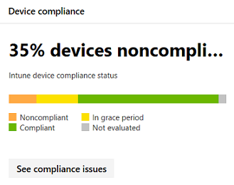

# <a name="device-monitoring-and-reporting-in-the-microsoft-365-security-center"></a>Enhets övervakning och rapportering i säkerhets Center för Microsoft 365

[!INCLUDE [Microsoft 365 Defender rebranding](../includes/microsoft-defender.md)]


Håll enheterna säkra, uppdaterade och håll potentiella hot i Microsoft 365 Security Center.

## <a name="view-device-alerts"></a>Visa enhets aviseringar

Få uppdaterade meddelanden om intrång och andra hot på dina enheter från Microsoft Defender ATP (tillgängligt med en E5-licens). I Microsoft 365 säkerhets Center övervakas de här aviseringarna på en hög nivå med önskat arbets flöde.

### <a name="monitor-high-impact-alerts"></a>Övervaka varnings aviseringar

Varje Microsoft Defender ATP-varning har en motsvarande allvarlighets grad (hög, medium, Low eller information). Det här är en potentiell påverkan på nätverket om det inte finns någon.  

Använd kortet med **allvarlighets grad för enhet** för att fokusera specifikt på meddelanden som är mer svåra och kan behöva svar direkt. Från det här kortet kan du läsa mer i Microsoft Defender Security Center-portalen.


### <a name="understand-sources-of-alerts"></a>Förstå aviserings källor

Microsoft Defender ATP utnyttjar data från ett brett utbud av säkerhets sensorer och informations källor för att generera aviseringar. Den kan till exempel använda identifierings information från Microsoft Defender Antivirus och oberoende virus kontroll från tredje part. Den kan även använda din egen anpassade Threat-information via webb tjänstens API.

Kortet för **identifiering av enhets aviseringar** visar distributionen av aviseringar per källa. Spåra aktivitet relaterade till vissa källor, särskilt dina anpassade källor. Du kan också använda kortet för att fokusera på aviseringar som kommer från sensorer som inte är konfigurerade för automatisk blockering av skadlig aktivitet eller komponenter.


Från det här kortet kan du läsa mer i Microsoft Defender Security Center-portalen.

### <a name="understand-the-types-of-threats-that-trigger-alerts"></a>Förstå vilka typer av hot som utlöser aviseringar

Microsoft Defender ATP sorterar varje varning i en kategori som representerar ett visst Stadium i angrepps kedjan eller typen av hot komponent. En upptäckt hot-aktivitet kan till exempel kategoriseras som "sido rörelse" för att indikera att det fanns ett försök att nå andra enheter i nätverket. Aktiviteten har troligt vis uppstått efter att angriparen fått ett inledande foothold. När en hot komponent identifieras kan den klassificeras brett som skadlig program vara eller specifikt som en viss hot-typ. Vissa specifika uppgifter är utpressnings tro Jan, autentiseringsuppgiften stjäla eller andra typer av skadlig eller oönskad program vara.

Kortet **enhets hot kategori** visar fördelningen av aviseringar i dessa kategorier. Använd den här informationen för att identifiera hot aktivitet, till exempel försök att stjäla autentiseringsuppgiften, som vanligt vis har högre påverkan än sociala teknik försök. Du kan också övervaka för potentiellt destruktiva hot som utpressnings tro Jan program vara.


### <a name="monitor-active-alerts"></a>Övervaka aktiva aviseringar

Status kortet för **enhets aviseringar** anger antalet aviseringar som inte har lösts och kan kräva en åtgärd. Från det här kortet kan du läsa mer i Microsoft Defender Security Center-portalen.


### <a name="monitor-classification-of-resolved-alerts"></a>Övervaka klassificering av lösta varningar

När du löser en Microsoft Defender ATP-avisering kan din säkerhets personal ange om en avisering har verifierats som:

* En verklig avisering som identifierar faktiska brott mot aktivitets-eller hot komponenter
* En falsk varning som felaktigt upptäckte normal aktivitet

**Klassificerings kortet för enhets aviseringar** visar om dina lösta meddelanden har klassificerats som sant eller falsk. Från det här kortet kan du läsa mer i Microsoft Defender Security Center-portalen.

Obs! i vissa fall är klassificerings informationen inte tillgänglig för vissa aviseringar.


### <a name="monitor-determination-of-resolved-alerts"></a>Övervaka fast ställande av lösta varningar

Tillsammans med klassificering av om en avisering är sann eller falsk under upplösningen kan din säkerhets personal ge en kontroll. En bestämning anger typen av normal eller skadlig aktivitet som hittades när aviseringen verifierades.

**Enhetens** uppställnings kort visar vilken bestämning som tillhandahålls för varje avisering.

* **Apt**: Avancerat, beständiga hot, som indikerar att den identifierade aktivitetens eller hot komponentens komponenter är en del av ett avancerat brott som är utformat för att få en foothold i det berörda nätverket  
* **Skadlig program vara**: skadlig fil eller kod
* **Säkerhets personal**: normal aktivitet genomförd av säkerhets personal
* **Säkerhets testning**: aktivitet eller komponenter som utformats för att simulera faktiska hot och förväntas utlösa säkerhets sensorer och generera aviseringar
* **Oönskad program vara**: appar och annan program vara som inte betraktas som skadlig, men på annat sätt strider mot policy eller acceptabla användnings standarder
* **Andra**: alla andra bestämningar som inte faller under de tillhandahållna typerna

Från det här kortet kan du läsa mer i Microsoft Defender säkerhets Center.


### <a name="understand-which-devices-are-at-risk"></a>Förstå vilka enheter som är utsatta för risk

**Enhets skydd** visar risk nivå för enheter. Risk nivån baseras på faktorer som typ och allvarlighets grad för aviseringar på enheten.


## <a name="monitor-and-report-status-of-intune-managed-devices"></a>Övervaka och rapportera status för Intune-hanterade enheter

Följande rapporter innehåller data från enheter som registrerats i Intune. Data från oregistrerade enheter ingår inte. Endast globala administratörer kan visa dessa kort.

Intune registrerade enhets data inkluderar:

* Kompatibilitet med enheter
* Enheter med aktiv skadlig program vara
* Typer av skadlig program vara på enheter
* Skadlig kod på enheter
* Enheter med identifiering av skadlig program vara
* Användare med identifiering av skadlig program vara

### <a name="monitor-device-compliance"></a>Övervaka kompatibilitet med enheter

**Enhetens efterlevnad** visar hur många enheter som är registrerade i Intune med konfigurations principer.



### <a name="discover-devices-with-malware-detections"></a>Upptäck enheter med identifiering av skadlig program vara

**Identifiering av enhetens skadlig kod** anger antalet Intune-registrerade enheter med skadlig kod som inte har lösts helt. En brist på upplösning kan bero på att du har väntande åtgärder, en omstart, en fullständig genomsökning, manuella användar åtgärder eller om åtgärds åtgärden inte lyckades.


### <a name="understand-the-types-of-malware-detected"></a>Förstå vilka typer av skadlig program vara som identifieras

**Typer av skadlig program vara på enheter** visar olika typer av skadlig program vara som har identifierats på enheter som har registrerats i Intune. Du kan undersöka varje typ i säkerhets Center för Microsoft 365.


### <a name="understand-the-specific-malware-detected-on-your-devices"></a>Förstå vilken skadlig program vara som identifieras på dina enheter

**Skadlig program vara på enheter** ger en lista över det specifika skadlig program vara som identifieras på dina enheter.


### <a name="understand-which-devices-have-the-most-malware"></a>Förstå vilka enheter som har flest skadligt

**Enheter med identifiering av skadlig kod** visar vilka enheter som har flest identifiering av skadlig kod. i säkerhets Center för Microsoft 365 kan du undersöka om skadlig kod är aktiv, vem som använder enheten och dess hanterings status i Intune.


### <a name="understand-which-users-have-devices-with-the-most-malware"></a>Förstå vilka användare som har enheter med flest skadligt

**Användare med identifiering av skadlig kod** visar användare med enheter som hade flest identifierings program. I Microsoft 365 säkerhets Center kan du se hur många enheter som har tilldelats till varje användare och mer information om varje enhet och typen av skadlig program vara.


## <a name="monitor-and-manage-attack-surface-reduction-rule-deployment-and-detections"></a>Övervaka och hantera distribution och identifiering av attack ytans reducerings regler

[Reglerna för att minska attack ytan (ASR)](https://docs.microsoft.com/windows/security/threat-protection/microsoft-defender-atp/attack-surface-reduction) hjälper till att förhindra åtgärder och program som vanligt vis används av skadlig program vara för att infektera enheter. Dessa regler bestämmer när och hur körbara filer kan köras. Du kan till exempel förhindra att Java Script eller VBScript startar en Hämtad körbar fil, blockerar Win32 API-samtal från Office-makron eller blockerar processer som körs från USB-enheter.


Ett kort med **regler för reducering av attack ytan** ger en översikt över drift sättningen av regler på dina enheter.

I det övre fältet på kortet visas det totala antalet enheter i följande distributions lägen:

* **Blockeringsregler**: enheter med minst en regel konfigurerad för att blockera upptäckta aktiviteter
* **Gransknings läge**: enheter utan regler som ställts in på blockera upptäckta aktiviteter, men har minst en regel inställd på att granska upptäckta aktiviteter  
* **Av**: enheter där alla ASR-regler är inaktiverade

I den nedre delen av det här kortet visas inställningar efter linje på dina enheter. Varje stapel visar antalet enheter som är inställda på att blockera, granska identifiering eller låta regeln vara avaktiverad.

### <a name="view-asr-detections"></a>Visa ASR-identifieringar

Om du vill visa detaljerad information om identifieringar av ASR-regler i nätverket väljer du **Visa identifieringar** på kortet för **reducerings regler för attack ytan** . Fliken **identifieringar** på sidan detaljerad rapport öppnas.


Diagrammet högst upp på sidan visar identifieringar som antingen blockerades eller granskats. Tabellen längst ned visar de senaste identifieringarna. Använd följande information om tabellen för att förstå vad identifieringarna är:

* **Identifierad fil**: filen, vanligt vis ett skript eller dokument, vars innehåll utlöste den misstänkta angrepps aktiviteten
* **Regel**: namn som beskriver de angrepps aktiviteter som regeln har utformats för att fånga. Läsa om befintliga ASR-regler
* **Käll program**: programmet som läste in eller utförde innehåll utlöste den misstänkta angrepps aktiviteten. Det kan vara ett legitimt program, till exempel en webbläsare, ett Office-program eller ett system verktyg som PowerShell
* **Utgivare**: den leverantör som släppte källmappen

### <a name="review-device-asr-rule-settings"></a>Granska inställningar för enhet i ASR-regler

Gå till fliken **konfiguration** och granska regel inställningar för enskilda enheter på sidan för **reducerings regler för attack yta** . Välj en enhet för att få detaljerad information om huruvida varje regel är i spärr läge, gransknings läge eller inaktive rad.


Microsoft Intune tillhandahåller hanterings funktioner för dina ASR-regler. Om du vill uppdatera dina inställningar väljer du **komma igång** under **Konfigurera enheter** på fliken för att öppna enhets hantering för Intune.

### <a name="exclude-files-from-asr-rules"></a>Utesluta filer från ASR-regler

I Microsoft 365 säkerhets Center samlas namnen på de [filer som du vill ska undantas](https://docs.microsoft.com/windows/security/threat-protection/microsoft-defender-atp/enable-attack-surface-reduction#exclude-files-and-folders-from-asr-rules) från identifiering av regler för reducering av attack ytan. Genom att utesluta filer kan du minska falska positiva identifieringar och mer säkert distribuera regler för begränsning av attack ytan i block läge.

Undantagen hanteras i Microsoft Intune, men i säkerhets Center för Microsoft 365 finns ett analys verktyg som hjälper dig att förstå filerna. Om du vill börja samla in filer som ska uteslutas går du till fliken **Lägg till undantag** på sidan **reducerings regler för attack yta** .

>[!NOTE]  
>Med verktyget analyseras eventuella reducerings regler för attack ytan, men [endast vissa regler stöder undantag](https://docs.microsoft.com/windows/security/threat-protection/microsoft-defender-atp/troubleshoot-asr).


I tabellen visas alla fil namn som identifieras av reglerna för reducering av attack ytan. Du kan välja filer för att se hur utesluta dem:

* Hur många färre identifieringar
* Hur många färre enheter rapporterar identifieringen

Om du vill ha en lista över de markerade filerna med deras fullständiga sökvägar, väljer du **Hämta undantags Sök vägar**.

Loggar för automatisk uppdatering av ASR **-regel blocket som stjälas från Windows lokala säkerhets auktoritets under system (lsass.exe)** Hämta käll programmet **lsass.exe**. Det är en normal system fil, men den identifieras som den upptäckta filen. Det innebär att den genererade listan med undantags Sök vägar inkluderar den här filen. Om du vill utesluta filen som utlöste den här regeln i stället för **lsass.exe**använder du sökvägen till käll programmet i stället för den identifierade filen.

Om du vill leta reda på käll programmet kör du följande frågor för den här [frågan](https://docs.microsoft.com/windows/security/threat-protection/microsoft-defender-atp/advanced-hunting) (identifieras enligt regel-ID 9e6c4e1f-7d60-472f-ba1a-a39ef669e4b2):

```kusto
DeviceEvents
| where Timestamp > ago(7d)
| where ActionType startswith "Asr"
| where AdditionalFields contains "9e6c4e1f-7d60-472f-ba1a-a39ef669e4b2"
| project InitiatingProcessFolderPath, InitiatingProcessFileName
```

#### <a name="check-files-for-exclusion"></a>Kontrol lera filer för uteslutning

Innan du utesluter en fil från ASR rekommenderar vi att du kontrollerar filen för att ta reda på om den inte är skadlig.

Om du vill granska en fil använder du [fil informations sidan](https://docs.microsoft.com/windows/security/threat-protection/microsoft-defender-atp/investigate-files) i Microsoft Defender säkerhets Center. Sidan visar information om förvalen och VirusTotal Antivirus täckning. Du kan också använda sidan för att skicka filen för djup analys.

Leta reda på en identifierad fil i Microsoft Defender säkerhets Center genom att söka efter alla ASR-identifieringar med följande avancerade jakt frågor:

```kusto
MiscEvents
| where EventTime > ago(7d)
| where ActionType startswith "Asr"
| project FolderPath, FileName, SHA1, InitiatingProcessFolderPath, InitiatingProcessFileName, InitiatingProcessSHA1
```

Använd **SHA1** eller **InitiatingProcessSHA1** i resultaten för att söka efter filen med hjälp av det universella Sök fältet i Microsoft Defender säkerhets Center.
