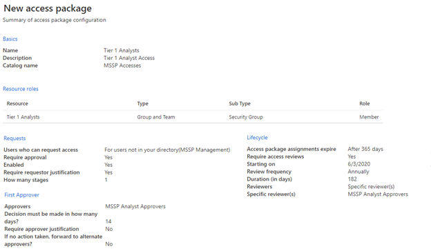

# Tillhandahålla åtkomst för hanterad säkerhetstjänstleverantör (MSSP)Provide managed security service provider (MSSP) access 

[!INCLUDE [Microsoft 365 Defender rebranding](../includes/microsoft-defender.md)]

[!INCLUDE [Prerelease](../includes/prerelease.md)]

**Gäller för:****Applies to:**

- [Microsoft 365 DefenderMicrosoft 365 Defender](./microsoft-threat-protection.md)
- [Microsoft Defender för EndpointMicrosoft Defender for Endpoint](https://go.microsoft.com/fwlink/p/?linkid=2146631)

Om du vill implementera en lösning med flera klientorganisationens delegerade åtkomst gör du följande:To implement a multi-tenant delegated access solution, take the following steps:

1. Aktivera [rollbaserad åtkomstkontroll i](/windows/security/threat-protection/microsoft-defender-atp/rbac) Defender för slutpunkt i Microsoft 365 säkerhetscenter och anslut med Azure Active Directory-grupper (Azure AD).Enable [role-based access control](/windows/security/threat-protection/microsoft-defender-atp/rbac) in Defender for Endpoint in Microsoft 365 security center and connect with Azure Active Directory (Azure AD) groups.

2. Konfigurera [styrningsåtkomstpaket](/azure/active-directory/governance/identity-governance-overview) för åtkomstbegäran och etablering.Configure [Governance Access Packages](/azure/active-directory/governance/identity-governance-overview) for access request and provisioning.

3. Hantera åtkomstförfrågningar och granskningar i [Microsoft Myaccess.](/azure/active-directory/governance/entitlement-management-request-approve)Manage access requests and audits in [Microsoft Myaccess](/azure/active-directory/governance/entitlement-management-request-approve).

## Aktivera rollbaserade åtkomstkontroller i Microsoft Defender för Slutpunkt i Microsoft 365 SäkerhetscenterEnable role-based access controls in Microsoft Defender for Endpoint in Microsoft 365 security center

1. **Skapa åtkomstgrupper för MSSP-resurser i Kund-AAD: Grupper****Create access groups for MSSP resources in Customer AAD: Groups**

    De här grupperna länkas till de roller som du skapar i Defender för Slutpunkt i Microsoft 365 säkerhetscenter.These groups will be linked to the Roles you create in Defender for Endpoint in Microsoft 365 security center. Det gör du genom att skapa tre grupper i kundens AD-klientorganisation.To do so, in the customer AD tenant, create three groups. Med den här metoden skapar vi följande grupper:In our example approach, we create the following groups:

    - Analytiker på nivå 1Tier 1 Analyst 
    - Analytiker på nivå 2Tier 2 Analyst 
    - Mssp-analytikers godkännareMSSP Analyst Approvers  

2. Skapa Defender för slutpunktsroller för lämpliga åtkomstnivåer i Customer Defender för Endpoint i Roller och grupper i Säkerhetscenter i Microsoft 365.Create Defender for Endpoint roles for appropriate access levels in Customer Defender for Endpoint in Microsoft 365 security center roles and groups.

    Åtkomstbehörigheter **> Slutpunktsroller &** grupper > Roller med ett användarkonto med behörigheten Global administratör eller Säkerhetsadministratör för att aktivera RBAC i Kundens Microsoft 365-säkerhetscenter.To enable RBAC in the customer Microsoft 365 security center, access **Permissions >  Endpoints roles & groups > Roles** with a user account with Global Administrator or Security Administrator rights.

    

    Skapa sedan RBAC-roller för att uppfylla behoven på MSSP-nivån.Then, create RBAC roles to meet MSSP SOC Tier needs. Länka de här rollerna till de skapade användargrupperna via "Tilldelade användargrupper".Link these roles to the created user groups via "Assigned user groups".

    Två möjliga roller:Two possible roles:

    - **Nivå 1-analytiker****Tier 1 Analysts**  
      Utför alla åtgärder utom live-svar och hantera säkerhetsinställningar.Perform all actions except for live response and manage security settings.

    - **Nivå 2-analytiker****Tier 2 Analysts**  
      Nivå 1-funktioner med tillägg till [live-svar](/windows/security/threat-protection/microsoft-defender-atp/live-response)Tier 1 capabilities with the addition to [live response](/windows/security/threat-protection/microsoft-defender-atp/live-response)

    Mer information finns i Använda [rollbaserad åtkomstkontroll.](/windows/security/threat-protection/microsoft-defender-atp/rbac)For more information, see [Use role-based access control](/windows/security/threat-protection/microsoft-defender-atp/rbac).

## Konfigurera styrningsåtkomstpaketConfigure Governance Access Packages

1.  **Lägg till MSSP som ansluten organisation i kund AAD: identitetsstyrning****Add MSSP as Connected Organization in Customer AAD: Identity Governance**
    
    Om du lägger till MSSP som en ansluten organisation kan MSSP begära åtkomst och tillhandahålla åtkomst.Adding the MSSP as a connected organization will allow the MSSP to request and have accesses provisioned. 

    Det gör du genom att i kundens AD-klientorganisation få åtkomst till identitetsstyrning: Ansluten organisation.To do so, in the customer AD tenant, access Identity Governance: Connected organization. Lägg till en ny organisation och sök efter din MSSP-analytiker via klientorganisations-ID eller domän.Add a new organization and search for your MSSP Analyst tenant via Tenant ID or Domain. Vi föreslår att du skapar en separat AD-klientorganisation för dina MSSP-analytiker.We suggest creating a separate AD tenant for your MSSP Analysts.

2. **Skapa en resurskatalog i Kund AAD: Identitetsstyrning****Create a resource catalog in Customer AAD: Identity Governance**

    Resurskataloger är en logisk samling åtkomstpaket som skapats i kundens AD-klientorganisation.Resource catalogs are a logical collection of access packages, created in the customer AD tenant.

    Det gör du genom att i kundens AD-klientorganisation få åtkomst till identitetsstyrning: kataloger och lägga till **ny katalog.**To do so, in the customer AD tenant,  access Identity Governance: Catalogs, and add **New Catalog**. I exemplet kallar vi det **MSSP Accesses.**In our example, we will call it **MSSP Accesses**. 

    

    Mer information finns i [Skapa en resurskatalog.](/azure/active-directory/governance/entitlement-management-catalog-create)Further more information, see [Create a catalog of resources](/azure/active-directory/governance/entitlement-management-catalog-create).

3. **Skapa åtkomstpaket för MSSP-resurser Kund AAD: Identitetsstyrning****Create access packages for MSSP resources Customer AAD: Identity Governance**

    Åtkomstpaket är den samling av rättigheter och åtkomst som en begärare kommer att beviljas vid godkännande.Access packages are the collection of rights and accesses that a requestor will be granted upon approval. 

    Det gör du genom att i kundens AD-klientorganisation få åtkomst till identitetsstyrning: Åtkomstpaket och lägga till **Nytt åtkomstpaket**.To do so, in the customer AD tenant, access Identity Governance: Access Packages, and add **New Access Package**. Skapa ett åtkomstpaket för MSSP-godkännare och varje analytiker.Create an access package for the MSSP approvers and each analyst tier. Följande analytikerkonfiguration på nivå 1 skapar till exempel ett åtkomstpaket som:For example, the following Tier 1 Analyst configuration creates an access package that:

    - Kräver att en medlem i AD-gruppens **analytiker (MSSP) godkännare godkänner** nya begärandenRequires a member of the AD group **MSSP Analyst Approvers** to authorize new requests
    - Har årliga åtkomstgranskningar, där SOC-analytiker kan begära ett åtkomsttilläggHas annual access reviews, where the SOC analysts can request an access extension
    - Kan endast begäras av användare i MSSP-klientorganisationenCan only be requested by users in the MSSP SOC Tenant
    - Access upphör automatiskt efter 365 dagarAccess auto expires after 365 days

    

    Mer information finns i [Skapa ett nytt åtkomstpaket.](/azure/active-directory/governance/entitlement-management-access-package-create)For more information, see [Create a new access package](/azure/active-directory/governance/entitlement-management-access-package-create).

4. **Länk för åtkomstbegäran till MSSP-resurser från kund AAD: identitetsstyrning****Provide access request link to MSSP resources from Customer AAD: Identity Governance**

    Länken Min åtkomstportal används av MSSP SOC-analytiker för att begära åtkomst via de åtkomstpaket som skapats.The My Access portal link is used by MSSP SOC analysts to request access via the access packages created. Länken är beständiga, vilket innebär att samma länk kan användas med tiden för nya analytiker.The link is durable, meaning the same link may be used over time for new analysts. Analytikerbegäran går i en kö för godkännande av analytiker som godkänner **MSSP.**The analyst request goes into a queue for approval by the **MSSP Analyst Approvers**.

    

    Länken finns på översiktssidan för varje åtkomstpaket.The link is located on the overview page of each access package.

## Hantera åtkomstManage access 

1. Granska och auktorisera åtkomstförfrågningar i Customer and/or MSSP myaccess.Review and authorize access requests in Customer and/or MSSP myaccess.

    Åtkomstförfrågningar hanteras i kundens My Access av medlemmar i gruppen Analysts godkännare för MSSP.Access requests are managed in the customer My Access, by members of the MSSP Analyst Approvers group.

    Det gör du genom att använda kundens myaccess med hjälp av:  `https://myaccess.microsoft.com/@<Customer Domain >` .To do so, access the customer's myaccess using:  `https://myaccess.microsoft.com/@<Customer Domain >`. 

    Exempel:  `https://myaccess.microsoft.com/@M365x440XXX.onmicrosoft.com#/`Example:  `https://myaccess.microsoft.com/@M365x440XXX.onmicrosoft.com#/`   
2. Godkänn eller neka förfrågningar i **avsnittet Godkännanden** i användargränssnittet.Approve or deny requests in the **Approvals** section of the UI.

     I det här läget har analytiker åtkomst till företaget etablerats och varje analytiker ska kunna komma åt kundens Microsoft 365 Säkerhetscenter:At this point, analyst access has been provisioned, and each analyst should be able to access the customer's Microsoft 365 Security Center: 

    `https://security.microsoft.com/?tid=<CustomerTenantId>` med de behörigheter och roller som de har tilldelats.`https://security.microsoft.com/?tid=<CustomerTenantId>` with the permissions and roles they were assigned.

> [!IMPORTANT]
> Delegerad åtkomst till Microsoft Defender för Slutpunkt i Säkerhetscenter för Microsoft 365 ger för närvarande tillgång till en enda innehavare per webbläsarfönster.Delegated access to Microsoft Defender for Endpoint in the Microsoft 365 security center currently allows access to a single tenant per browser window.