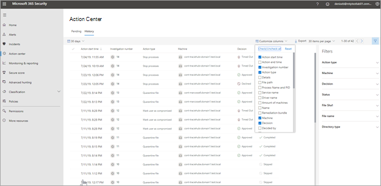

# ÅtgärdscentretThe Action center

[!INCLUDE [Microsoft 365 Defender rebranding](../includes/microsoft-defender.md)]

**Gäller för:****Applies to:**
- Microsoft 365 DefenderMicrosoft 365 Defender

Använd Åtgärdscenter ( ) för att se resultaten från aktuella och tidigare undersökningar [https://security.microsoft.com/action-center](https://security.microsoft.com/action-center) över organisationens enheter och postlådor.Use the Action center ([https://security.microsoft.com/action-center](https://security.microsoft.com/action-center)) to see the results of current and past investigations across your organization's devices and mailboxes. Beroende på typen av hot och resulterande bedömning [kan](https://docs.microsoft.com/microsoft-365/security/mtp/mtp-remediation-actions) åtgärder vidtas automatiskt eller vid godkännande av organisationens säkerhetsteam.Depending on the type of threat and resulting verdict, [remediation actions](https://docs.microsoft.com/microsoft-365/security/mtp/mtp-remediation-actions) can occur automatically or upon approval by your organization's security operations team. Alla åtgärder, oavsett om de väntar på godkännande eller redan har godkänts, konsolideras i Åtgärdscenter.All remediation actions, whether they are pending approval or were already approved, are consolidated in the Action center. 

## En "enda fönsterruta"A "single pane of glass" experience

Åtgärdscenter ger en "enda fönsterruta" för aktiviteter, till exempel:The Action center provides a "single pane of glass" experience for tasks, such as:
- Godkänna väntande åtgärderApproving pending remediation actions;
- Visa en granskningslogg över redan godkända åtgärdsåtgärder. ochViewing an audit log of already approved remediation actions; and
- Granska slutförda åtgärder.Reviewing completed remediation actions.

Ditt säkerhetsteam kan arbeta effektivare och effektivare eftersom åtgärdscentret ger en omfattande vy av Microsoft 365 Defender på jobbet.Your security operations team can operate more effectively and efficiently, because the Action center provides a comprehensive view of Microsoft 365 Defender at work.

## Gå till ÅtgärdscenterGo to the Action center

1. Gå till [https://security.microsoft.com](https://security.microsoft.com) och logga in.Go to [https://security.microsoft.com](https://security.microsoft.com) and sign in. 

2. Välj Åtgärdscenter i **navigeringsfönstret.**In the navigation pane, choose **Action center**. 

3. I Åtgärdscenter visas två flikar: **Väntande** och **Historik.**In the Action center, you'll see two tabs: **Pending** and **History**.

    - På **fliken Väntande** listor finns undersökningar som kräver granskning och godkännande av någon i din säkerhetsgrupp för att fortsätta.The **Pending** tab lists investigations that require review and approval by someone in your security operations team to continue. Granska och vidta åtgärder för väntande objekt som visas här.Make sure to review and take action on pending items you see here.

    - På **fliken** Historik visas tidigare undersökningar och åtgärder som har vidtagits automatiskt.The **History** tab lists past investigations and remediation actions that were taken automatically. Du kan visa data för den senaste dagen, veckan, månaden eller sex månaderna.You can view data for the past day, week, month, or six months.

4. Om du bara vill visa de kolumner du vill se väljer du **Anpassa kolumner.**To show only the columns you want to see, select **Customize columns**. 

5. Välj ett objekt i listan om du vill visa mer information om en undersökning.Select an item in the list to view more details about an investigation. Vyn med undersökningsinformation öppnas.The investigation details view opens. 

    - Om undersökningen gäller e-postinnehåll (t.ex. om entiteten är en postlåda), öppnas undersökningsinformation i säkerhets- & Center för efterlevnad [https://protection.office.com/threatinvestigation](https://protection.office.com/threatinvestigation) ().If the investigation pertains to email content (such as, the entity is a mailbox), investigation details open in the Security & Compliance Center ([https://protection.office.com/threatinvestigation](https://protection.office.com/threatinvestigation)). 

    - Om undersökningen involverar en enhet öppnas undersökningsinformation i säkerhetscentret [https://security.microsoft.com](https://security.microsoft.com) ().If the investigation involves a device, investigation details open in the security center ([https://security.microsoft.com](https://security.microsoft.com)). 

> [!TIP]
> Om du tror att något har missats eller identifierats felaktigt av en automatiserad undersökning och svarsfunktioner i Microsoft 365 Defender, berätta det för oss!If you think something was missed or wrongly detected by automated investigation and response features in Microsoft 365 Defender, let us know! Se hur du rapporterar falska positiva eller negativa resultat i automatisk undersökning och [svarsfunktioner (AIR) i Microsoft 365 Defender.](mtp-autoir-report-false-positives-negatives.md)See [How to report false positives/negatives in automated investigation and response (AIR) capabilities in Microsoft 365 Defender](mtp-autoir-report-false-positives-negatives.md).

## Tillgängliga åtgärderAvailable actions

När åtgärder vidtas visas de på fliken **Historik** i Åtgärdscenter.As remediation actions are taken, they're listed on the **History** tab in the Action center. Sådana åtgärder omfattar följande:Such actions include the following:

- Samla in undersökningspaketCollect investigation package 
- Isolera enhet (den här åtgärden kan ångras)Isolate device (this action can be undone) 
- Offboard-datorOffboard machine 
- Körning av släppkodRelease code execution 
- Släpp från karantänRelease from quarantine 
- Exempel på förfråganRequest sample 
- Begränsa körning av kod (den här åtgärden kan ångras)Restrict code execution (this action can be undone) 
- Kör antivirussökningRun antivirus scan 
- Stoppa och sätta i karantänStop and quarantine 

> [!NOTE]
> Förutom åtgärder som vidtas automatiskt kan teamet för säkerhetsåtgärder vidta manuella åtgärder för att hantera identifierade hot.In addition to remediation actions that are taken automatically, your security operations team can take manual actions to address detected threats. Mer information om automatiska och manuella åtgärder finns [i Åtgärder.](mtp-remediation-actions.md)For more information about automatic and manual remediation actions, see [Remediation actions](mtp-remediation-actions.md).

## ÅtgärdskällaAction source

(**NYHET!**) Som du vet samlar Microsoft 365 Defender automatisk undersökning och svarsfunktioner i flera tjänster, till exempel [Microsoft Defender](https://docs.microsoft.com/windows/security/threat-protection/microsoft-defender-atp/microsoft-defender-advanced-threat-protection) för Slutpunkt och Microsoft Defender för [Office 365.](https://docs.microsoft.com/microsoft-365/security/office-365-security/office-365-atp)(**NEW!**) As you know, Microsoft 365 Defender brings together automated investigation and response capabilities across multiple services, such as [Microsoft Defender for Endpoint](https://docs.microsoft.com/windows/security/threat-protection/microsoft-defender-atp/microsoft-defender-advanced-threat-protection) and [Microsoft Defender for Office 365](https://docs.microsoft.com/microsoft-365/security/office-365-security/office-365-atp). Det nya och förbättrade åtgärdscentret innehåller nu **kolumnen Åtgärdskälla** som visar var varje åtgärdsåtgärd kom.The new and improved Action center now includes an **Action source** column that tells you where each remediation action came from. 

I följande tabell beskrivs möjliga värden **för åtgärdskällor:**The following table describes possible **Action source** values:

| Värdet för åtgärdskällaAction source value | BeskrivningDescription |
|:-----|:---|
| **Åtgärd för manuell enhet****Manual device action** | En manuell åtgärd som vidtas på en enhet.A manual action taken on a device. Några exempel är [enhetsisolering eller](https://docs.microsoft.com/windows/security/threat-protection/microsoft-defender-atp/respond-machine-alerts#isolate-devices-from-the-network) [karantän för filer.](https://docs.microsoft.com/windows/security/threat-protection/microsoft-defender-atp/respond-file-alerts#stop-and-quarantine-files)Examples include [device isolation](https://docs.microsoft.com/windows/security/threat-protection/microsoft-defender-atp/respond-machine-alerts#isolate-devices-from-the-network) or [file quarantine](https://docs.microsoft.com/windows/security/threat-protection/microsoft-defender-atp/respond-file-alerts#stop-and-quarantine-files). |
| **Manuell e-poståtgärd****Manual email action** | En manuell åtgärd för e-post.A manual action taken on email. Ett exempel omfattar mjuk borttagning av e-postmeddelanden [eller åtgärdar ett e-postmeddelande.](https://docs.microsoft.com/microsoft-365/security/office-365-security/remediate-malicious-email-delivered-office-365)An example includes soft-deleting email messages or [remediating an email message](https://docs.microsoft.com/microsoft-365/security/office-365-security/remediate-malicious-email-delivered-office-365). |
| **Automatiserad enhetsåtgärd****Automated device action** | En automatiserad åtgärd som vidtas på en enhet, till exempel en fil eller en process.An automated action taken on an entity, such as a file or process. Exempel på automatiserade åtgärder är att skicka en fil till karantän, stoppa en process och ta bort en registernyckel.Examples of automated actions include sending a file to quarantine, stopping a process, and removing a registry key. (Se [åtgärder för åtgärder i Microsoft Defender för slutpunkt](https://docs.microsoft.com/windows/security/threat-protection/microsoft-defender-atp/manage-auto-investigation#remediation-actions).)(See [Remediation actions in Microsoft Defender for Endpoint](https://docs.microsoft.com/windows/security/threat-protection/microsoft-defender-atp/manage-auto-investigation#remediation-actions).) |
| **Automatiserad e-poståtgärd****Automated email action** | En automatiserad åtgärd för e-postinnehåll, till exempel ett e-postmeddelande, en bifogad fil eller en URL.An automated action taken on email content, such as an email message, attachment, or URL. Exempel på automatiserade åtgärder är mjuk borttagning av e-postmeddelanden, blockering av URL:er och inaktiverar vidarebefordran av extern e-post.Examples of automated actions include soft-deleting email messages, blocking URLs, and turning off external mail forwarding. (Se [åtgärder för åtgärder i Microsoft Defender för Office 365](https://docs.microsoft.com/microsoft-365/security/office-365-security/air-remediation-actions).)(See [Remediation actions in Microsoft Defender for Office 365](https://docs.microsoft.com/microsoft-365/security/office-365-security/air-remediation-actions).) |
| **Avancerad sökåtgärd****Advanced hunting action** | Åtgärder som vidtas på enheter eller e-post [med avancerad sökning.](https://docs.microsoft.com/microsoft-365/security/mtp/advanced-hunting-overview)Actions taken on devices or email with [advanced hunting](https://docs.microsoft.com/microsoft-365/security/mtp/advanced-hunting-overview). |
| **Explorer-åtgärd****Explorer action** | Åtgärder som vidtas på e-postinnehåll med [Utforskaren.](https://docs.microsoft.com/microsoft-365/security/office-365-security/threat-explorer)Actions taken on email content with [Explorer](https://docs.microsoft.com/microsoft-365/security/office-365-security/threat-explorer). |
| **Manuell svarsåtgärd****Manual live response action** | Åtgärder som vidtas på en enhet med [live-svar.](https://docs.microsoft.com/windows/security/threat-protection/microsoft-defender-atp/live-response)Actions taken on a device with [live response](https://docs.microsoft.com/windows/security/threat-protection/microsoft-defender-atp/live-response). Några exempel är att ta bort en fil, stoppa en process och ta bort en schemalagd aktivitet.Examples include deleting a file, stopping a process, and removing a scheduled task. |
| **Live response-åtgärd****Live response action** | Åtgärder som vidtas på en enhet med [Microsoft Defender för slutpunkts-API:er.](https://docs.microsoft.com/windows/security/threat-protection/microsoft-defender-atp/management-apis#microsoft-defender-for-endpoint-apis)Actions taken on a device with [Microsoft Defender for Endpoint APIs](https://docs.microsoft.com/windows/security/threat-protection/microsoft-defender-atp/management-apis#microsoft-defender-for-endpoint-apis). Exempel på åtgärder är att isolera en enhet, köra en antivirussökning och hämta information om en fil.Examples of actions include isolating a device, running an antivirus scan, and getting information about a file. |

## Behörigheter som krävs för uppgifter i ÅtgärdscenterRequired permissions for Action center tasks

Om du vill godkänna eller avvisa väntande åtgärder i Åtgärdscenter måste du ha de behörigheter som anges i följande tabell:To approve or reject pending actions in the Action center, you must have permissions assigned as listed in the following table:

|ÅtgärdsåtgärdRemediation action |Obligatoriska roller och behörigheterRequired roles and permissions |
|--|----|
|Åtgärd för Microsoft Defender för slutpunkt (enheter)Microsoft Defender for Endpoint remediation (devices) |Säkerhetsadministratörsroll som tilldelats i antingen Azure Active Directory ( [https://portal.azure.com](https://portal.azure.com) ) eller Administrationscenter för Microsoft 365 ( [https://admin.microsoft.com](https://admin.microsoft.com) )Security Administrator role assigned in either Azure Active Directory ([https://portal.azure.com](https://portal.azure.com)) or the Microsoft 365 admin center ([https://admin.microsoft.com](https://admin.microsoft.com)) --- eller ------ or --- Rollen Aktiva åtgärdsåtgärder tilldelad i Microsoft Defender för SlutpunktActive remediation actions role assigned in Microsoft Defender for Endpoint     Mer information finns i följande resurser:To learn more, see the following resources:  - [Administratörsrollbehörigheter i Azure Active Directory](https://docs.microsoft.com/azure/active-directory/users-groups-roles/directory-assign-admin-roles)- [Administrator role permissions in Azure Active Directory](https://docs.microsoft.com/azure/active-directory/users-groups-roles/directory-assign-admin-roles) - [Skapa och hantera roller för rollbaserad åtkomstkontroll (Microsoft Defender för slutpunkt)](https://docs.microsoft.com/windows/security/threat-protection/microsoft-defender-atp/user-roles)- [Create and manage roles for role-based access control (Microsoft Defender for Endpoint)](https://docs.microsoft.com/windows/security/threat-protection/microsoft-defender-atp/user-roles)  |
|Åtgärd för Microsoft Defender för Office 365 (Office-innehåll och e-post)Microsoft Defender for Office 365 remediation (Office content and email)  |Säkerhetsadministratörsroll som tilldelats i antingen Azure Active Directory ( [https://portal.azure.com](https://portal.azure.com) ) eller Administrationscenter för Microsoft 365 ( [https://admin.microsoft.com](https://admin.microsoft.com) )Security Administrator role assigned in either Azure Active Directory ([https://portal.azure.com](https://portal.azure.com)) or the Microsoft 365 admin center ([https://admin.microsoft.com](https://admin.microsoft.com)) --- och ------ and ---  Rollen Sök och rensning har tilldelats Säkerhets- & Efterlevnadscenter [https://protection.office.com](https://protection.office.com) ()Search and Purge role assigned the Security & Compliance Center ([https://protection.office.com](https://protection.office.com))   **VIKTIGT:** Om du bara har tilldelats rollen säkerhetsadministratör i Säkerhets- & och efterlevnadscenter kan du inte komma åt funktionerna i Åtgärdscenter eller Microsoft 365 Defender.**IMPORTANT**: If you have the Security Administrator role assigned only in the Security & Compliance Center, you will not be able to access the Action center or Microsoft 365 Defender capabilities. Du måste ha rollen Säkerhetsadministratör tilldelad i Azure Active Directory eller administrationscentret för Microsoft 365.You must have the Security Administrator role assigned in Azure Active Directory or the Microsoft 365 admin center.   Mer information finns i följande resurser:To learn more, see the following resources:  - [Administratörsrollbehörigheter i Azure Active Directory](https://docs.microsoft.com/azure/active-directory/users-groups-roles/directory-assign-admin-roles)- [Administrator role permissions in Azure Active Directory](https://docs.microsoft.com/azure/active-directory/users-groups-roles/directory-assign-admin-roles) - [Behörigheter i Säkerhets- & Efterlevnadscenter](https://docs.microsoft.com/microsoft-365/security/office-365-security/permissions-in-the-security-and-compliance-center)- [Permissions in the Security & Compliance Center](https://docs.microsoft.com/microsoft-365/security/office-365-security/permissions-in-the-security-and-compliance-center) |

> [!NOTE]
> Användare som har rollen Global administratör tilldelad i Azure Active Directory kan godkänna eller avvisa eventuella väntande åtgärder i Åtgärdscenter.Users who have the Global Administrator role assigned in Azure Active Directory can approve or reject any pending action in the Action center. En god metod är dock att organisationen bör begränsa antalet personer som har tilldelats rollen global administratör.However, as a best practice, your organization should limit the number of people who have the Global Administrator role assigned. Vi rekommenderar att du använder säkerhetsadministratören, aktiva åtgärdsåtgärder och sök- och rensningsroller som anges ovan för behörigheter i Åtgärdscenter.We recommend using the Security Administrator, Active remediation actions, and Search and Purge roles listed above for Action center permissions.

## Nästa stegNext steps 

- [Godkänna eller avvisa väntande åtgärder efter en automatiserad undersökningApprove or reject pending actions following an automated investigation](mtp-autoir-actions.md)
- [Visa resultatet av en automatiserad undersökningView the results of an automated investigation](mtp-autoir-results.md)

