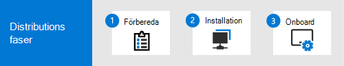

# Skapa en test labb-eller pilot miljö för Microsoft 365 DefenderCreate a Microsoft 365 Defender trial lab or pilot environment 

[!INCLUDE [Microsoft 365 Defender rebranding](../includes/microsoft-defender.md)]

**Gäller för:****Applies to:**
- Microsoft 365 DefenderMicrosoft 365 Defender

Syftet med att skapa test laboratoriet eller pilot miljön är att illustrera de omfattande och integrerade Microsoft 365 Defender-funktionerna.The purpose of creating this trial lab or pilot environment is to illustrate the comprehensive and integrated Microsoft 365 Defender capabilities. Upplev hur den här intelligenta säkerhets lösningen identifierar, hindrar, automatiskt undersöker och svarar på avancerade hot som din organisation har.Experience how this intelligent security solution detects, prevents, automatically investigates, and responds to advanced threats your organization. 

Den här guiden leder dig genom stegen för att starta utvärderings versionen av Microsoft 365 Defender baserat på de rekommenderade distributions vägarna.This guide takes you through the steps to start your Microsoft 365 Defender evaluation based on the recommended deployment paths. Målet är att hjälpa dig att konfigurera säkerhets lösningen antingen i en labb miljö med ett utvärderings konto eller i en pilot miljö i en produktion med fullständig licens.The goal is to help you set up the security solution either in a lab environment with a trial account, or in a pilot environment in production with a full license. Att förbereda utvärderings labbet eller pilot miljön hjälper dig att presentera ärenden för besluts fattare i organisationen.Preparing your trial lab or pilot environment can help you present security operation use cases to decision makers in your organization. När du är klar med dina antecknings simuleringar och är nöjd med resultatet kan du distribuera och operationalize dem i organisationen med hjälp av Microsofts tekniska Sälj experter eller experter i din organisation.When you’re done running your attack simulations and are satisfied with the results, you can fully deploy and operationalize it in your organization with the help of Microsoft Technical Sales Professionals or experts in your organization. 

Den här guiden hjälper dig:This guide will help you:
- Konfigurera labb Server och datorerSet up your lab server and computers
- Konfigurera Active Directory med användare och grupperConfigure Active Directory with users and groups
- Konfigurera och konfigurera Microsoft Defender för identitet, Microsoft Defender för Office 365, Microsoft Defender för slut punkt och säkerhet för Microsoft Cloud AppSet up and configure Microsoft Defender for Identity, Microsoft Defender for Office 365, Microsoft Defender for Endpoint, and Microsoft Cloud App Security
- Konfigurera lokala principer för servern och datorernaSet up local policies for your server and computers
- Imiterar en hot attack för att skapa en test incident eller-varning i Microsoft 365 DefenderMimic a threat attack to generate a test incident or alert in Microsoft 365 Defender

>[!IMPORTANT]
>Bäst resultat får du om du följer installations anvisningarna så nära som möjligt.For optimum results, follow the lab setup instructions as closely as possible.

## Distributions faserDeployment phases

Det finns tre faser i att skapa en test labbs miljö för Microsoft 365 Defender och distribuera den:There are three phases in creating a Microsoft 365 Defender trial lab environment and deploying it:

|FasPhase | BeskrivningDescription | 
|:-------|:-----|
|[Fas 1: förberedaPhase 1: Prepare](prepare-mtpeval.md)| Läs om vad du behöver tänka på när du distribuerar Microsoft 365 Defender i ett prov labb eller en pilot miljö:Learn what you need to consider when deploying Microsoft 365 Defender in a trial lab or pilot environment:   -Intressenter och utloggning- Stakeholders and sign-off   -Miljö överväganden- Environment considerations  -Åtkomst- Access  -Konfigurera Azure Active Directory- Azure Active Directory setup   -Konfigurations beställning- Configuration order
|[Fas 2: konfigurationPhase 2: Setup](setup-mtpeval.md)|  Vidta de första stegen för att komma åt Microsoft 365 säkerhets Center för att konfigurera utvärderings labb för Microsoft 365 Defender eller pilot miljö.Take the initial steps to access Microsoft 365 Security Center to set up your Microsoft 365 Defender trial lab or pilot environment. Du är guidad att:You'll be guided to:  -Registrera dig för Microsoft 365 E5-utvärderings version- Sign up for Microsoft 365 E5 Trial    -Konfigurera domän- Configure domain -Tilldela Microsoft 365 E5-licenser- Assign Microsoft 365 E5 licenses -Slutför installations guiden i portalen- Complete the setup wizard in the portal|
|[Steg 3: Konfigurera & inbyggtPhase 3: Configure & Onboard](config-mtpeval.md) | Konfigurera varje slut punkter för Microsoft 365 Defender pelare och inbyggda.Configure each Microsoft 365 Defender pillar and onboard endpoints. Du är guidad att:You'll be guided to:  -Konfigurera Microsoft Defender för Office 365- Configure Microsoft Defender for Office 365 -Konfigurera säkerhet för Microsoft Cloud App- Configure Microsoft Cloud App Security -Konfigurera Microsoft Defender för identitet- Configure Microsoft Defender for Identity -Konfigurera Microsoft Defender för slut punkt- Configure Microsoft Defender for Endpoint

## I omfattningIn scope

Följande aktiviteter är omfång för den här guiden:The following tasks are in scope for this guide:
-   Konfigurera Azure Active DirectorySet up Azure Active Directory
-   Konfigurera Microsoft 365 DefenderSet up Microsoft 365 Defender
    -   Registrera dig för Microsoft 365 E5-utvärdering eller Använd din fullständiga licens om du kör en pilotSign up for Microsoft 365 E5 Trial or use your full license if you're running a pilot
    -   Konfigurera domänConfigure domain
    -   Tilldela Microsoft 365 E5-licenserAssign Microsoft 365 E5 licenses
    -   Slutföra installations guiden i portalenCompleting the setup wizard within the portal
-   Konfigurera alla Microsoft 365 Defender-pelare baserat på metod tipsConfigure all Microsoft 365 Defender pillars based on best practices
    -   Microsoft Defender för Office 365Microsoft Defender for Office 365
    -   Microsoft Defender for IdentityMicrosoft Defender for Identity
    -   Microsoft Cloud App SecurityMicrosoft Cloud App Security
    -   Microsoft Defender för EndpointMicrosoft Defender for Endpoint

## Utanför omfattningOut of scope

Den här distributions guiden följer inte med:The following are out of scope of this deployment guide:

-   Konfiguration av lösningar från tredje part som kan integreras med Microsoft 365 DefenderConfiguration of third-party solutions that might integrate with Microsoft 365 Defender
-   Test av inträngda i produktions miljönPenetration testing in production environment

## Nästa stegNext step
[Fas 1: förbereda](prepare-mtpeval.md) 
[Phase 1: Prepare](prepare-mtpeval.md) 
  Förbereda utvärderings labb eller pilot miljö för Microsoft 365 DefenderPrepare your Microsoft 365 Defender trial lab or pilot environment
