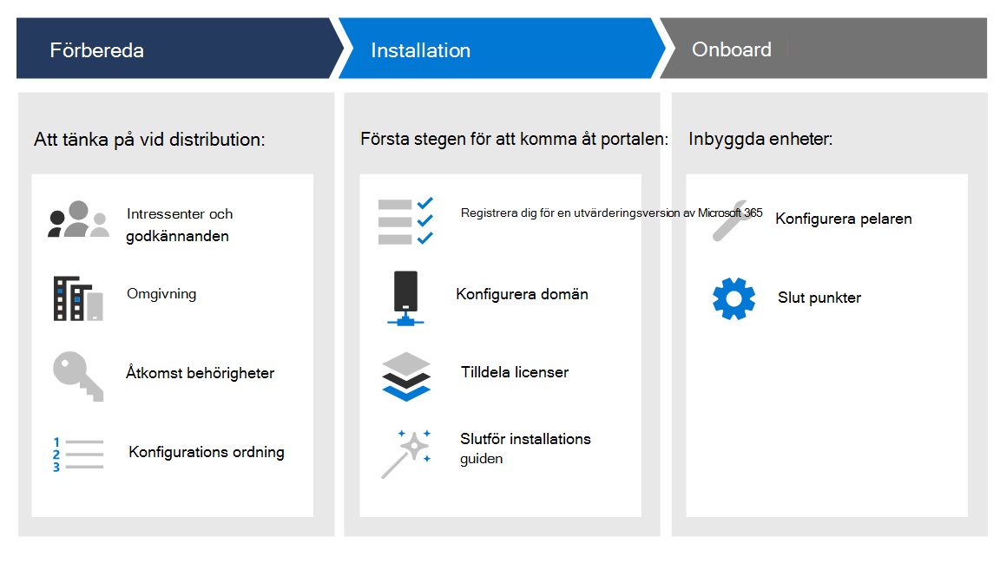

# Skapa ett testlabb eller pilotmiljö i Microsoft 365 Defender 

[!INCLUDE [Microsoft 365 Defender rebranding](../includes/microsoft-defender.md)]

**Gäller för:**
- Microsoft 365 Defender

Den här guiden hjälper dig att arbeta i en labbmiljö med användare och grupper och hjälper dig sedan genom konfigurationen av funktionerna i Microsoft 365 Defender så att du kan efterlikna en hotattack och få ett meningsfullt utvärderingsresultat. 

Syftet med att skapa den här testlabb- eller pilotmiljön är att illustrera de omfattande och integrerade funktionerna i Microsoft 365 Defender. Upplev hur den här smarta säkerhetslösningen identifierar, förhindrar, automatiskt undersöker och svarar på avancerade hot din organisation. 

Du vägleds genom stegen för att starta utvärdering av Microsoft 365 Defender baserat på de rekommenderade distributionssökvägarna. Målet är att hjälpa dig att konfigurera säkerhetslösningen antingen i en labbmiljö med ett testkonto eller i en pilotmiljö i produktion med en fullständig licens. Förberedelse av testlabb eller testmiljö kan hjälpa dig att presentera säkerhetsåtgärdsanvändning för beslutsfattare i organisationen. När du är klar med dina attackberäkningar och är nöjd med resultatet kan du helt distribuera och driftsätta det i organisationen med hjälp av Microsofts tekniska säljare eller experter i organisationen. 

I den här guiden får du hjälp med att:
- Konfigurera din labserver och dina datorer
- Konfigurera Active Directory med användare och grupper
- Konfigurera och konfigurera Microsoft Defender för identitet, Microsoft Defender för Office 365, Microsoft Defender för Slutpunkt och Microsoft Cloud App Security
- Konfigurera lokala principer för server och datorer
- Imitera en hotattack för att generera en testhändelse eller varning i Microsoft 365 Defender

>[!IMPORTANT]
>För bästa resultat följer du labinstallationsanvisningarna så nära som möjligt.

## Distributionsfaser

Det finns tre faser i att skapa en testlabbmiljö i Microsoft 365 Defender.

|Fas | Beskrivning | 
|:-------|:-----|
|[Fas 1: Förbereda](prepare-mtpeval.md)| Läs om vad du behöver tänka på när du distribuerar Microsoft 365 Defender i ett testlabb eller en testmiljö:   - Intressenter och signering   - Att tänka på när det gäller miljön  - Access  - Azure Active Directory-konfiguration   - Konfigurationsordning
|[Fas 2: Installation](setup-mtpeval.md)|  Gör så här för att komma åt Microsoft 365 Säkerhetscenter och konfigurera utvärderingslabb eller pilotmiljö för Microsoft 365 Defender. Du vägleds till:  - Registrera dig för utvärderingsversionen av Microsoft 365 E5    - Konfigurera domän - Tilldela Microsoft 365 E5-licenser - Slutför installationsguiden i portalen|
|[Fas 3: Konfigurera & registrering](config-mtpeval.md) | Konfigurera alla Microsoft 365 Defender-slutpunkter och slutpunkter för onboard. Du vägleds till:  - Konfigurera Microsoft Defender för Office 365 - Konfigurera Microsoft Cloud App-säkerhet - Konfigurera Microsoft Defender för identitet - Konfigurera Microsoft Defender för slutpunkt

När du har slutfört den här guiden skulle du ha identifierat de berörda intressenterna och de godkännanden som krävs, ha rätt åtkomstbehörighet, registrerat dig för utvärderingsversion, konfigurerade domäner och var och en av Microsoft 365 Defender-pelarna, och slutpunkterna kommer att introduceras till tjänsten.

## Viktiga funktioner

Även om Microsoft 365 Defender tillhandahåller många funktioner är det huvudsakliga syftet med den här distributionsguiden att komma igång med onboarding-enheter. Förutom introduktionen får du hjälp att komma igång med följande funktioner.

Funktion | Beskrivning 
:---|:---
Microsoft Defender för Office 365 | Hjälper till att skydda hela Office 365-organisationen från dagens hot
Microsoft Defender for Identity | Identifierar och identifierar hot för komprometterade identiteter och skadliga Insider-åtgärder.
Microsoft Cloud App Security | Ger bättre synlighet, styr data färdas och identifierar cyberhot i molntjänster.
Microsoft Defender för Endpoint | Förhindrar, identifierar och tillhandahåller svarsfunktioner för avancerade hot med omfattande slutpunktssäkerhet.

## I omfattning

Följande uppgifter omfattas av den här guiden:
-   Konfigurera Azure Active Directory
-   Konfigurera Microsoft 365 Defender
    -   Registrera dig för utvärderingsversionen av Microsoft 365 E5 eller använd din fullständiga licens om du kör en pilot
    -   Konfigurera domän
    -   Tilldela Microsoft 365 E5-licenser
    -   Slutföra installationsguiden i portalen
-   Konfigurera alla Microsoft 365 Defender-pelare baserat på metodtips
    -   Microsoft Defender för Office 365
    -   Microsoft Defender for Identity
    -   Microsoft Cloud App Security
    -   Microsoft Defender för Endpoint

## Inte omfång

Följande ingår inte i den här distributionsguiden:

-   Konfiguration av tredjepartslösningar som kan integreras med Microsoft 365 Defender
-   Test av intrång i produktionsmiljö

## Nästa steg
[Fas 1: Förbereda](prepare-mtpeval.md) 
  Förbereda utvärderingslabb eller pilotmiljö med Microsoft 365 Defender
