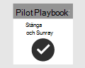

# Planera ditt pilotprojekt i Microsoft 365 Defender 

[!INCLUDE [Microsoft 365 Defender rebranding](../includes/microsoft-defender.md)]

**Gäller för:**
- Microsoft 365 Defender

| Planering| [Förberedelse](prepare-mtpeval.md) |  [Simulera attack](mtp-pilot-simulate.md) |  [Stäng och sammanfatta](mtp-pilot-close.md)|
|--|--|--|--|
|*Du är här!*| | | |

Du befinner dig för närvarande i planeringsfasen.

För att pilotprojektet ska vara lyckat måste du planera noggrant och få godkännanden från intressenterna i början. Elementen i planeringen omfattar att identifiera omfattning, användningsfall, krav och kriterier för framgång.

I den här guiden får du hjälp med att planera ditt pilotprojekt. 

>[!IMPORTANT]
>För bästa resultat följer du pilotinstruktionerna så nära som möjligt.

## Omfattning

Pilotens omfattning avgör hur omfattande testet kommer att vara, baserat på din miljö och godtagbara testmetoder. Här är några exempel på omfattningar att tänka på:
- Utvecklings- eller testmiljö som omfattar slutpunkter, servrar, domänkontrollanter.
- Produktionsmiljö med Microsoft 365, Azure, Active Directory-tjänster, slutpunkter och servrar

>[!NOTE]
>Om du inte har de fullständiga licenserna ännu kan du få utvärderingslicenser för att utvärdera [Microsoft 365 Defender](https://aka.ms/mtp-trial-lab) – planera, förbereda, konfigurera, konfigurera och köra ditt pilotprojekt. Intressenterna kommer att ha en stor roll för att underlätta processen från början till slut.

Vilka typer av operativsystem som ska utvärderas bör också definieras utifrån organisationens organisation. Detta kan inkludera följande: [Mac-slutpunkter,](https://docs.microsoft.com/windows/security/threat-protection/microsoft-defender-atp/microsoft-defender-atp-mac#system-requirements) [Linux-servrar,](https://docs.microsoft.com/windows/security/threat-protection/microsoft-defender-atp/microsoft-defender-atp-linux#system-requirements) [Windows 10-slutpunkter,](https://docs.microsoft.com/windows/security/threat-protection/microsoft-defender-atp/minimum-requirements#supported-windows-versions) [Windows Server 2016.](https://docs.microsoft.com/windows/security/threat-protection/microsoft-defender-atp/minimum-requirements#supported-windows-versions)

## Använda ärenden

Använd fall som representerar instruktioner om hur verktyget som testas är avsett att användas av de avsedda användarna. De kan utformas som användarberättelser ur en viss persons perspektiv, till exempel som en SOC-analytiker. Till exempel:
- Som SOC-analytiker behöver jag visa, korrelera, utvärdera och hantera aviseringar och händelser mellan enheter, användare och postlådor i mitt nätverk. [Incidenthantering]
- Som SOC-analytiker måste jag ha verktyget och processen att automatiskt undersöka och svara på skadliga händelser i nätverket. [Automatisk IR]
- Som SOC-analytiker måste jag söka efter data från miljön för att hitta kända och potentiella hot och misstänkta aktiviteter. [Advanced Hunting]

Kom ihåg att dessa användningsfall bör skapas inom parametrarna för den definierade omfattningen. Om till exempel testningens omfattning inte omfattar en utvärdering av verktyg som Microsoft Cloud App Security ska du använda fall som förlitar sig på det som en datakälla.

## Krav

Från listan över användningsfall kan du börja skapa krav. Kraven omfattar funktioner som ett verktyg måste ha för att uppfylla användningsfallen. Dessa krav kan delas in i kategorier som konfiguration och underhåll, stöd för integrationer och funktionsspecifika krav som möjligheten att hitta och möjligheten att skapa anpassade aviseringar.

## Testplan

Olika testmetoder kan vara lämpliga beroende på kraven. Om kravet till exempel är att utvärdera den instansen av automatisk åtgärd måste testplanen innehålla steg för att generera beteendet som utlöser en automatiserad åtgärd inom Microsoft 365 Defender. Om kravet är att identifiera ett visst beteende eller en viss attack kan testet innebära fler steg. Poängen är att ha en plan för att testa dig mot dina krav på rätt sätt.

## Kriterier för framgång

Framgångskriterierna är i slutänden fältuppsättningen som mäter mot det du testar. Oavsett om du testar Microsoft 365 Defender (eller någon annan teknik för den delen) mot andra verktyg eller för sig själv, måste det finnas några mätbara villkor för att fastställa vilket värde verktyget tillhandahåller. Utifrån omfattningen, kraven och testplanen avgör framgångskriterierna hur testet testas. Det bör vara mindre godkänt eller misslyckat och mer av en viktad bedömning utifrån dina behov. Om du till exempel vill lyckas måste ett verktyg ge ett resultat på över 80 % i vissa kritiska områden som du identifierar.

## Styrkort

Ett sätt att sammanför alla delar av planen kan vara att skapa ett styrkort. Se ett exempel på styrkort nedan:

| Användningsfall | Krav | Konfigurationskrav | Testplan | Förväntat resultat | Teststatus | Poäng | Kommentarer |
|:-------|:-------|:-------|:-------|:-------|:-------|:-------|:-------|
|Incidenthantering|- Microsoft 365 Defender    - Microsoft Defender för identitet   - Microsoft Defender för Slutpunkt   - Microsoft Cloud App Security (valfritt)|Mer information [finns i](https://aka.ms/mtp-trial-lab) förutsättningarna för att förbereda, konfigurera och konfigurera |[Simulera attack](mtp-pilot-simulate.md)   [Undersök incidenten](https://docs.microsoft.com/microsoft-365/security/mtp/mtp-pilot-simulate#investigate-an-incident) |Man kan förstå incidentens omfattning och påverkan och hantera incidenten||||
|AutoIR|- Microsoft 365 Defender   - Microsoft Defender för identitet   - Microsoft Defender för Slutpunkt |Mer information [finns i](https://aka.ms/mtp-trial-lab) förutsättningarna för att förbereda, konfigurera och konfigurera  Aktivera AutoIR  |[Simulera attack](mtp-pilot-simulate.md)   [Automatiserad undersökning](https://docs.microsoft.com/microsoft-365/security/mtp/mtp-pilot-simulate#automated-investigation-and-remediation) |Aviseringar och incidenter åtgärdas automatiskt av Microsoft 365 Defender||||
|Avancerad jakt|- Microsoft 365 Defender   - Microsoft Defender för Slutpunkt   -Microsoft Defender för Office 365 |Mer information [finns i](https://aka.ms/mtp-trial-lab) förutsättningarna för att förbereda, konfigurera och konfigurera|[Avancerad sökning](https://docs.microsoft.com/microsoft-365/security/mtp/mtp-pilot-simulate#advanced-hunting-scenario) |En undersökning kan hitta data via avancerad sökning, pivotering till berörda enheter och genom att skapa anpassade identifieringar||||

## Nästa steg
|  [Förberedelsefas](prepare-mtpeval.md) | Förbereda pilotmiljön i Microsoft 365 Defender
|:-------|:-----|
