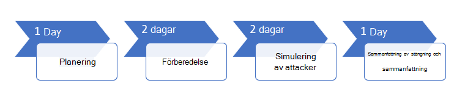

# Kör ditt pilot Microsoft Threat Protection Project 

[!INCLUDE [Microsoft 365 Defender rebranding](../includes/microsoft-defender.md)]

**Gäller för:**
- Microsoft Hotskydd

För att effektivt fastställa fördelarna och antagandet av Microsoft Threat Protection (MTP) kan du köra ett pilot projekt. Innan du aktiverar Microsoft Threat Protection i produktions miljön och börjar med definierade användnings fall är det bäst att gå igenom en planerings process för att bestämma vilka uppgifter som måste utföras i det här pilot projektet och framgång. 

## Så här använder du pilot Playbook

I den här guiden får du en översikt över Microsoft Threat Protection och steg-för-steg-instruktioner om hur du konfigurerar pilot projektet. 

Följande exempel tids linje varierar beroende på om du har rätt resurser i din miljö. Vissa identifieringar och arbets flöden kan behöva mer inlärnings tid än de andra.

>[!IMPORTANT]
>För optimalt resultat följer du pilot instruktionerna så nära som möjligt.

### Pilot Playbook faser 

Det finns fyra faser för att köra ett Microsoft Threat Protection pilot:

|Fas | Beskrivning | 
|:-------|:-----|
|  [Planering](mtp-pilot-plan.md)| Läs mer om vad du behöver tänka på innan du kör ett Microsoft Threat Protection Pilot-projekt:   -Omfattning   -Användnings fall  -Krav  -Test plan   -Villkor   -Styrkort 
|   [Förberedelse](mtp-evaluation.md)|  Få åtkomst till Microsoft 365 säkerhets Center för att konfigurera pilot miljön för Microsoft Threat Protection. Du ska vägleda dig till:  -Identifiera intressenter och inhämta en uppsägning för din pilot   -Miljö överväganden  -Åtkomst  -Konfigurera Azure Active Directory   -Konfigurations beställning   -Registrera dig för Microsoft 365 E5-utvärderings version   -Konfigurera domän  -Tilldela Microsoft 365 E5-licenser   -Slutför installations guiden i portalen|
|   [Simulering av attacker](mtp-pilot-simulate.md) | För att simulera en attack ska du vägleda dig till:  -Kontrol lera test miljö kraven  -Kör simuleringen  -Undersök en olycka  -Lös problemet 
|   [Stänga och sammanfatta](mtp-pilot-close.md) | När du har nått slutet av processen kommer du att vägleda dig till:  -Gå igenom dina slutliga utdata -Presentera dina synpunkter för dina intressenter  -Ge feedback  -Ta nästa steg 

## Nästa steg
|  [Planerings fas](mtp-pilot-plan.md) | Planera ditt Microsoft Threat Protection Pilot projekt 
|:-------|:-----|
