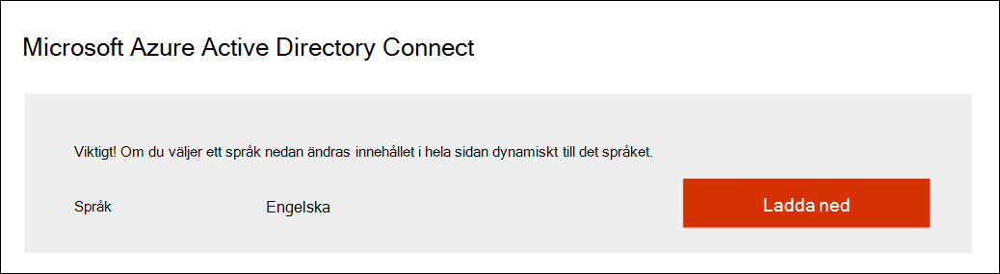
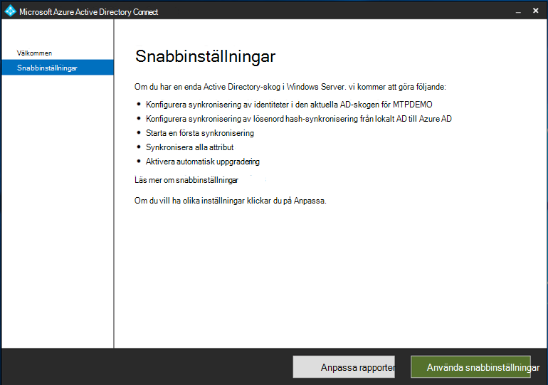

# Förbereda testlabbeta för Microsoft Threat Protection

**Gäller:**
- Microsoft Hotskydd

Att skapa en testlabbmiljö för Microsoft Threat Protection och distribuera den är en trefasprocess:

 
<table border="0" width="100%" align="center">
  <tr style="text-align:center;">
    <td align="center" style="width:25%; border:0;" bgcolor="#d5f5e3">
      <a href= "https://docs.microsoft.com/microsoft-365/security/mtp/prepare-mtpeval"> 
        
       Fas 1: Förbered</a> 
    </td>
     <td align="center"  >
      <a href="https://docs.microsoft.com/microsoft-365/security/mtp/setup-mtpeval">
        
       Fas 2: Installation</a> 
        </td>
    <td align="center">
      <a href="https://docs.microsoft.com/microsoft-365/security/mtp/config-mtpeval">
        
       Fas 3: Konfigurera & ombord</a> 
</td>
  </tr>
  <tr>
    <td style="width:25%; border:0;">
   
    </td>
    <td valign="top" style="width:25%; border:0;">
    
</td>
    <td valign="top" style="width:25%; border:0;">

</td>    
  </tr>
</table>

Du är för närvarande i förberedelsefasen.

Förberedelse är nyckeln till en lyckad distribution. Det här avsnittet hjälper dig att gå igenom vad du behöver tänka på när du förbereder dig för att skapa en testlabbmiljö för microsoft threat protection-distributionen.

## Förutsättningar
Lär dig mer om licens-, maskinvaru- och programvarukrav och andra konfigurationsinställningar för att etablera och använda Microsoft Threat Protection. Se minimikraven för [Microsoft Threat Protection](https://docs.microsoft.com/microsoft-365/security/mtp/prerequisites?view=o365-worldwide), Microsoft Defender [ATP](https://docs.microsoft.com/windows/security/threat-protection/microsoft-defender-atp/minimum-requirements), [Office 365 ATP](https://docs.microsoft.com/office365/servicedescriptions/office-365-advanced-threat-protection-service-description), [Azure ATP](https://docs.microsoft.com/azure-advanced-threat-protection/atp-prerequisites), [Microsoft Cloud App Security](https://docs.microsoft.com/azure-advanced-threat-protection/atp-prerequisites).

## Intressenter och signering
Följande avsnitt syftar till att identifiera alla intressenter som är involverade i projektet och som kan behöva signera, granska eller hålla sig informerade, även för en utvärdering eller bevis på begreppet torrkörning.

>[!NOTE]
>Alla organisationer kan inte ha en löptid för säkerhetsorganisation för att ha sådana roller. I så fall, rådgöra med din ledningsgrupp om översyn och godkännande accountabilities.

Lägg till intressenter i tabellen nedan som är lämplig för din organisation.

-   SO = Signering av detta projekt

-   R = Granska detta projekt och ge input

-   I = Informerad om detta projekt

| Namn                 | Roll                                                                                                                                                                                                          | Åtgärder |
|----------------------|---------------------------------------------------------------------------------------------------------------------------------------------------------------------------------------------------------------|--------|
| Ange namn och e-post | **Chief Information Security Officer (CISO)** *En verkställande representant som fungerar som sponsor inom organisationen för den nya teknikutbyggnaden.*                                                  | Så     |
| Ange namn och e-post | **Chef för Cyber Defense Operations Center (CDOC)** *En representant från CDOC-teamet som ansvarar för att definiera hur den här ändringen är anpassad till processerna i kundens säkerhetsoperationsteam.*       | Så     |
| Ange namn och e-post | **Säkerhetsarkitekt** *En representant från säkerhetsteamet som ansvarar för att definiera hur den här ändringen är anpassad till organisationens kärnarkitektur för säkerhet.*                         | R      |
| Ange namn och e-post | **Arbetsplatsarkitekt** *En representant från IT-teamet med ansvar för att definiera hur den här förändringen är anpassad till organisationens grundläggande arbetsplatsarkitektur.*                             | R      |
| Ange namn och e-post | **Säkerhetsanalytiker** *En representant från CDOC-teamet som kan ge indata om identifieringsfunktioner, användarupplevelse och övergripande användbarhet för den här ändringen ur ett säkerhetsoperationsperspektiv.* | Ⅰ      |

## Förbereda din Azure Active Directory
Hoppa över det här steget om du redan har aktiverat synkronisering mellan Active Directory och Azure Active Directory lokalt. Granska befintlig metodtipsdokumentation från Azure Active Directory. Följande steg är optimerade för att utvärdera Microsoft Threat Protection.

1. Gå till [Azure Active Directory-portalen](https://portal.azure.com/#blade/Microsoft_AAD_IAM/ActiveDirectoryMenuBlade) > **Azure AD Connect**. 
   

2. Klicka på **Hämta** från **Microsoft Azure Active Directory Connect** och överför den till domänkontrollanten.
  

3. Följ guiden Azure Active Directory Connect på domänkontrollanten. Läs licensvillkoren och sekretessmeddelandet och markera kryssrutan om du samtycker. Klicka på **Fortsätt**.
  

4. Navigera till **Expressinställningar**.
  

5. Ange dina globala administratörsuppgifter. Klicka på **Nästa**.
  

6. Ange företagsadministratörsuppgifter för Active Directory Domain Services. Klicka på **Nästa**.
  

7. Klicka på **Installera** för att bekräfta konfigurationen.
  

8. Grattis, du har konfigurerat Azure Active Directory Connect.
  

Nu kan du [lägga till användare och grupper i Active Directory](https://docs.microsoft.com/azure-advanced-threat-protection/atp-playbook-setup-lab#bkmk_hydrate) och konfigurera en [SAM-R-princip](https://docs.microsoft.com/azure-advanced-threat-protection/atp-playbook-setup-lab#configure-sam-r-capabilities-from-contosodc).  

## Konfigurationsordning
Tabellen nedan visar den ordning som Microsoft rekommenderar för att konfigurera Microsoft Threat Protection-komponenterna för testlabbets miljödistribution.

| Komponent                               | Beskrivning                                                                                                                                                                                                                                                                                                                                                                                                                                                                                                                                                                                                                                                                                              | Rangordning för konfigurationsordning |
|-----------------------------------------|----------------------------------------------------------------------------------------------------------------------------------------------------------------------------------------------------------------------------------------------------------------------------------------------------------------------------------------------------------------------------------------------------------------------------------------------------------------------------------------------------------------------------------------------------------------------------------------------------------------------------------------------------------------------------------------------------------|---------------------|
| Office 365 Avancerat skydd| Office 365 ATP skyddar din organisation mot skadliga hot som orsakas av e-postmeddelanden, länkar (webbadresser) och samarbetsverktyg.   [Lära sig mer.](https://docs.microsoft.com/microsoft-365/security/office-365-security/office-365-atp?view=o365-worldwide)                                                                                                                                                                                                                                             | 1                   |
|Azure Advanced Threat Protection|Azure ATP använder Active Directory-signaler för att identifiera, identifiera och undersöka avancerade hot, komprometterade identiteter och skadliga insideråtgärder som riktas mot din organisation.   [Mer information](https://docs.microsoft.com/azure-advanced-threat-protection/).| 2 |
|Microsoft Cloud App Security| Microsoft Cloud App Security är en CLOUD Access Security Broker (CASB) som fungerar på flera moln. Det ger omfattande synlighet, kontroll över dataresor och sofistikerade analyser för att identifiera och bekämpa cyberhot i alla dina molntjänster.   [Mer information](https://docs.microsoft.com/cloud-app-security/).                                                                                                                                                                                                                                                                                                                                                                       |3                   |
|Microsoft Defender Avancerat skydd | Microsoft Defender ATP-funktioner för identifiering och svar av FJ-enheter ger avancerade attackidentifieringar som är nära realtid och kan kunna tas i action. Säkerhetsanalytiker kan prioritera aviseringar effektivt, få insyn i hela omfattningen av en överträdelse och vidta svarsåtgärder för att åtgärda hot.   [Lära sig mer.](https://docs.microsoft.com/windows/security/threat-protection/microsoft-defender-atp/microsoft-defender-advanced-threat-protection)                                     |4                   |                                                                                                                                                                                                                                    

## Nästa steg
|||
|:-------|:-----|
|  [Fas 2: Installation](setup-mtpeval.md) | Konfigurera testlabbeta för Microsoft Threat Protection

