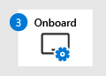

# Förbereda utvärderings labb eller pilot miljö för Microsoft 365 Defender

[!INCLUDE [Microsoft 365 Defender rebranding](../includes/microsoft-defender.md)]

**Gäller för:**
- Microsoft 365 Defender

Att skapa en test labb-eller pilot miljö för Microsoft 365 Defender och distribuera det är en process i tre steg:

| Fas 1: förbereda | [Fas 2: Konfigurera](setup-mtpeval.md) | [Fas 3: inbyggt](config-mtpeval.md) |  [Tillbaka till pilot Playbook](mtp-pilot.md) |
|--|--|--|--|
|*Nu är det här!* | || |

Du befinner dig i förberedelse fasen.

Förberedelsen är viktig för eventuell distribution. I det här avsnittet får du hjälp att ta reda på vad du behöver tänka på när du förbereder dig för att skapa ett utvärderings labb eller en pilot miljö för din Microsoft 365 Defender-distribution.

## Förutsättningar
Läs mer om licensierings-, maskinvaru-och program varu krav och andra konfigurations inställningar för att tillhandahålla och använda Microsoft 365 Defender. Se minimi kraven för [microsoft 365 Defender](https://docs.microsoft.com/microsoft-365/security/mtp/prerequisites), [Microsoft Defender för slut punkt](https://docs.microsoft.com/windows/security/threat-protection/microsoft-defender-atp/minimum-requirements), [Microsoft Defender för Office 365](https://docs.microsoft.com/office365/servicedescriptions/office-365-advanced-threat-protection-service-description), [Microsoft Defender för identitet](https://docs.microsoft.com/azure-advanced-threat-protection/atp-prerequisites), [Microsoft Cloud App-säkerhet](https://docs.microsoft.com/azure-advanced-threat-protection/atp-prerequisites).

## Intressenter och utloggning
Identifiera alla intressenter som är involverade i projektet och som kan behöva logga ut, granska eller hålla dig informerad, till exempel för utvärdering eller körning av ett pilot projekt.

>[!NOTE]
>Alla organisationer kanske inte har säkerhets organisationen förfallit att ha sådana roller. I sådant fall kan du kontakta ditt ledarskap på kontroll-och godkännande Accountabilities.

Lägg till intressenter i tabellen nedan enligt din organisation.

-   SÅ = logga ut i det här projektet

-   R = granska projektet och ange indata

-   I = informerad om det här projektet

| Namn                 | Roll                                                                                                                                                                                                          | Fattning |
|----------------------|---------------------------------------------------------------------------------------------------------------------------------------------------------------------------------------------------------------|--------|
| Ange namn och e-postadress | **Säkerhets chef från chef (ciso)** *en direktör representant som fungerar som sponsor inom organisationen för den nya teknik distributionen.*                                                  | DÅ     |
| Ange namn och e-postadress | **Huvudet på cyberterrorism försvar åtgärds Center (CDOC)** *ett ombud från CDOC-teamet som ansvarar för att bestämma hur ändringen ska justeras med processerna i säkerhets åtgärds gruppen kunder.*       | DÅ     |
| Ange namn och e-postadress | **Säkerhets arkitekt** *en representant från säkerhets teamet som ansvarar för att definiera hur ändringen justeras mot organisationens grundläggande säkerhets arkitektur.*                         | F      |
| Ange namn och e-postadress | **Workplace Architect** Skapa *en representant från IT-teamet som ansvarar för att bestämma hur ändringen ska justeras med den grundläggande arbets plats arkitekturen i organisationen.*                             | F      |
| Ange namn och e-postadress | **Säkerhetsanalytiker** är *ett ombud från CDOC-teamet som kan ge feedback om identifierings funktionerna, användar upplevelsen och totalheten i den här ändringen från ett säkerhets åtgärds perspektiv.* | I      |

## Förbereda din Azure Active Directory
Hoppa över det här steget om du redan har aktiverat synkronisering mellan Active Directory och Azure Active Directory lokalt. Läs mer i dokumentationen om metod tips från Azure Active Directory. Följande steg är optimerade för att utvärdera eller köra en pilot Microsoft 365 Defender-projekt.

1. Gå till [Azure Active Directory](https://portal.azure.com/#blade/Microsoft_AAD_IAM/ActiveDirectoryMenuBlade) -portalen > **Azure AD Connect**. 
   

2. Klicka på **Ladda ned** från **Microsoft Azure Active Directory Connect** och överför det till domänkontrollanten.
  

3. Följ guiden Anslut Azure Active Directory på domänkontrollanten. Läs licens villkoren och sekretess meddelandet och markera kryss rutan om du godkänner. Klicka på **Fortsätt**.
  

4. Navigera till **Express inställningar**.
  

5. Ange dina globala administratörs uppgifter. Klicka på **Nästa**.
  

6. Ange autentiseringsuppgifterna för företags administratören för Active Directory Domain Services. Klicka på **Nästa**.
  

7. Bekräfta konfigurationen genom att klicka på **Installera** .
  

8. Grattis! du har konfigurerat Azure Active Directory Connect.
  

Du kan [lägga till användare och grupper i Active Directory](https://docs.microsoft.com/azure-advanced-threat-protection/atp-playbook-setup-lab#bkmk_hydrate) och [Konfigurera en Sam-R-princip](https://docs.microsoft.com/azure-advanced-threat-protection/atp-playbook-setup-lab#configure-sam-r-capabilities-from-contosodc).  

## Konfigurations ordning
Följande tabell visar vilken ordning Microsoft rekommenderar för att konfigurera Microsoft 365 Defender-komponenterna för utvärderings labbet eller pilot miljö distributionen.

| Komponent                               | Beskrivning                                                                                                                                                                                                                                                                                                                                                                                                                                                                                                                                                                                                                                                                                              | Konfigurations ordning |
|-----------------------------------------|----------------------------------------------------------------------------------------------------------------------------------------------------------------------------------------------------------------------------------------------------------------------------------------------------------------------------------------------------------------------------------------------------------------------------------------------------------------------------------------------------------------------------------------------------------------------------------------------------------------------------------------------------------------------------------------------------------|---------------------|
|Microsoft Defender för Office 365|Microsoft Defender för Office 365 skyddar din organisation mot skadliga hot från e-postmeddelanden, länkar (URL: er) och samarbetsverktyg.   [Lära sig mer.](https://docs.microsoft.com/microsoft-365/security/office-365-security/office-365-atp)                                                                                                                                                                                                                                             | 9.1                   |
|Microsoft Defender for Identity|Microsoft Defender för identitet använder Active Directory-signaler för att identifiera, upptäcka och undersöka avancerade hot, kompromissade identiteter och skadliga Insider-åtgärder på din organisation.   [Mer information](https://docs.microsoft.com/azure-advanced-threat-protection/).| två |
|Microsoft Cloud App Security| Säkerhet för Microsoft Cloud App är en moln åtkomst säkerhets tjänst (CASB) som fungerar på flera moln. Det ger stor insyn, kontroll över data resor och avancerad analys för att identifiera och bekämpa Cyberthreats i alla dina moln tjänster.   [Mer information](https://docs.microsoft.com/cloud-app-security/).                                                                                                                                                                                                                                                                                                                                                                       |amp;3D                   |
|Microsoft Defender för Endpoint | Microsoft Defender för slut punkts slut punkter och svars funktioner ger avancerade angrepps regler som är nära real tids och actionable. Säkerhets analytiker kan prioritera aviseringar effektivt, få insyn i hela omfattningen av en överträdelse och vidta åtgärder för att åtgärda hot.   [Lära sig mer.](https://docs.microsoft.com/windows/security/threat-protection/microsoft-defender-atp/microsoft-defender-advanced-threat-protection)                                     |9.4                   |                                                                                                                                                                                                                                    

## Nästa steg
|  [Fas 2: konfiguration](setup-mtpeval.md) | Konfigurera utvärderings labb eller pilot miljö för Microsoft 365 Defender
|:-------|:-----|

