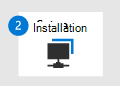

# Förbereda utvärderings labb eller pilot miljö för Microsoft 365 DefenderPrepare your Microsoft 365 Defender trial lab or pilot environment

[!INCLUDE [Microsoft 365 Defender rebranding](../includes/microsoft-defender.md)]

**Gäller för:****Applies to:**
- Microsoft 365 DefenderMicrosoft 365 Defender

Att skapa en test labb-eller pilot miljö för Microsoft 365 Defender och distribuera det är en process i tre steg:Creating a Microsoft 365 Defender trial lab or pilot environment and deploying it is a three-phase process:

| Fas 1: förberedaPhase 1: Prepare | [Fas 2: KonfigureraPhase 2: Set up](setup-mtpeval.md) | [Fas 3: inbyggtPhase 3: Onboard](config-mtpeval.md) |  [Tillbaka till pilot PlaybookBack to pilot playbook](mtp-pilot.md) |
|--|--|--|--|
|*Nu är det här!**You are here!* | || |

Du befinner dig i förberedelse fasen.You're currently in the preparation phase.

Förberedelsen är viktig för eventuell distribution.Preparation is key to any successful deployment. I det här avsnittet får du hjälp att ta reda på vad du behöver tänka på när du förbereder dig för att skapa ett utvärderings labb eller en pilot miljö för din Microsoft 365 Defender-distribution.This section will guide you through what you need to consider as you prepare to create a trial lab or pilot environment for your Microsoft 365 Defender deployment.

## FörutsättningarPrerequisites
Läs mer om licensierings-, maskinvaru-och program varu krav och andra konfigurations inställningar för att tillhandahålla och använda Microsoft 365 Defender.Learn about the licensing, hardware and software requirements, and other configuration settings to provision and use Microsoft 365 Defender. Se minimi kraven för [microsoft 365 Defender](https://docs.microsoft.com/microsoft-365/security/mtp/prerequisites), [Microsoft Defender för slut punkt](https://docs.microsoft.com/windows/security/threat-protection/microsoft-defender-atp/minimum-requirements), [Microsoft Defender för Office 365](https://docs.microsoft.com/office365/servicedescriptions/office-365-advanced-threat-protection-service-description), [Microsoft Defender för identitet](https://docs.microsoft.com/azure-advanced-threat-protection/atp-prerequisites), [Microsoft Cloud App-säkerhet](https://docs.microsoft.com/azure-advanced-threat-protection/atp-prerequisites).See the minimum requirements for [Microsoft 365 Defender](https://docs.microsoft.com/microsoft-365/security/mtp/prerequisites), [Microsoft Defender for Endpoint](https://docs.microsoft.com/windows/security/threat-protection/microsoft-defender-atp/minimum-requirements), [Microsoft Defender for Office 365](https://docs.microsoft.com/office365/servicedescriptions/office-365-advanced-threat-protection-service-description), [Microsoft Defender for Identity](https://docs.microsoft.com/azure-advanced-threat-protection/atp-prerequisites), [Microsoft Cloud App Security](https://docs.microsoft.com/azure-advanced-threat-protection/atp-prerequisites).

## Intressenter och utloggningStakeholders and sign-off
Identifiera alla intressenter som är involverade i projektet och som kan behöva logga ut, granska eller hålla dig informerad, till exempel för utvärdering eller körning av ett pilot projekt.Identify all the stakeholders that are involved in the project and who may need to sign-off, review, or stay informed, whether for evaluation or running a pilot project.

>[!NOTE]
>Alla organisationer kanske inte har säkerhets organisationen förfallit att ha sådana roller.Not all organizations might have the security organization maturity to have such roles. I sådant fall kan du kontakta ditt ledarskap på kontroll-och godkännande Accountabilities.In such case, consult with your leadership team on review and approval accountabilities.

Lägg till intressenter i tabellen nedan enligt din organisation.Add stakeholders to the table below as appropriate for your organization.

-   SÅ = logga ut i det här projektetSO = Sign-off on this project

-   R = granska projektet och ange indataR = Review this project and provide input

-   I = informerad om det här projektetI = Informed of this project

| NamnName                 | RollRole                                                                                                                                                                                                          | FattningAction |
|----------------------|---------------------------------------------------------------------------------------------------------------------------------------------------------------------------------------------------------------|--------|
| Ange namn och e-postadressEnter name and email | **Säkerhets chef från chef (ciso)** *en direktör representant som fungerar som sponsor inom organisationen för den nya teknik distributionen.***Chief Information Security Officer (CISO)** *An executive representative who serves as sponsor inside the organization for the new technology deployment.*                                                  | DÅSO     |
| Ange namn och e-postadressEnter name and email | **Huvudet på cyberterrorism försvar åtgärds Center (CDOC)** *ett ombud från CDOC-teamet som ansvarar för att bestämma hur ändringen ska justeras med processerna i säkerhets åtgärds gruppen kunder.***Head of Cyber Defense Operations Center (CDOC)** *A representative from the CDOC team in charge of defining how this change is aligned with the processes in the customers security operations team.*       | DÅSO     |
| Ange namn och e-postadressEnter name and email | **Säkerhets arkitekt** *en representant från säkerhets teamet som ansvarar för att definiera hur ändringen justeras mot organisationens grundläggande säkerhets arkitektur.***Security Architect** *A representative from the Security team in charge of defining how this change is aligned with the core Security architecture in the organization.*                         | FR      |
| Ange namn och e-postadressEnter name and email | **Workplace Architect** Skapa *en representant från IT-teamet som ansvarar för att bestämma hur ändringen ska justeras med den grundläggande arbets plats arkitekturen i organisationen.***Workplace Architect** *A representative from the IT team in charge of defining how this change is aligned with the core workplace architecture in the organization.*                             | FR      |
| Ange namn och e-postadressEnter name and email | **Säkerhetsanalytiker** är *ett ombud från CDOC-teamet som kan ge feedback om identifierings funktionerna, användar upplevelsen och totalheten i den här ändringen från ett säkerhets åtgärds perspektiv.***Security Analyst** *A representative from the CDOC team who can provide feedback on the detection capabilities, user experience, and overall usefulness of this change from a security operations perspective.* | II      |

## Förbereda din Azure Active DirectoryPrepare your Azure Active Directory
Hoppa över det här steget om du redan har aktiverat synkronisering mellan Active Directory och Azure Active Directory lokalt.Skip this step if you have already enabled synchronization between Active Directory and Azure Active Directory on premises. Läs mer i dokumentationen om metod tips från Azure Active Directory.Review existing best practices documentation from Azure Active Directory. Följande steg är optimerade för att utvärdera eller köra en pilot Microsoft 365 Defender-projekt.The following steps are optimized to evaluate or run a pilot Microsoft 365 Defender project.

1. Gå till [Azure Active Directory](https://portal.azure.com/#blade/Microsoft_AAD_IAM/ActiveDirectoryMenuBlade) -portalen > **Azure AD Connect**.Go to the [Azure Active Directory](https://portal.azure.com/#blade/Microsoft_AAD_IAM/ActiveDirectoryMenuBlade) portal > **Azure AD Connect**. 
   

2. Klicka på **Ladda ned** från **Microsoft Azure Active Directory Connect** och överför det till domänkontrollanten.Click **Download** from **Microsoft Azure Active Directory Connect** and transfer it to your Domain Controller.
  

3. Följ guiden Anslut Azure Active Directory på domänkontrollanten.On the domain controller, follow the Azure Active Directory Connect wizard. Läs licens villkoren och sekretess meddelandet och markera kryss rutan om du godkänner.Read the license terms and privacy notice and select the checkbox if you agree. Klicka på **Fortsätt**.Click **Continue**.
  

4. Navigera till **Express inställningar**.Navigate to **Express Settings**.
  

5. Ange dina globala administratörs uppgifter.Enter your global administrator credentials. Klicka på **Nästa**.Click **Next**.
  

6. Ange autentiseringsuppgifterna för företags administratören för Active Directory Domain Services.Enter your Active Directory Domain Services enterprise administrator credentials. Klicka på **Nästa**.Click **Next**.
  

7. Bekräfta konfigurationen genom att klicka på **Installera** .Click **Install** to confirm the configuration.
  

8. Grattis! du har konfigurerat Azure Active Directory Connect.Congratulations, you have successfully configured Azure Active Directory Connect.
  

Du kan [lägga till användare och grupper i Active Directory](https://docs.microsoft.com/azure-advanced-threat-protection/atp-playbook-setup-lab#bkmk_hydrate) och [Konfigurera en Sam-R-princip](https://docs.microsoft.com/azure-advanced-threat-protection/atp-playbook-setup-lab#configure-sam-r-capabilities-from-contosodc).You can now [add users and groups to Active Directory](https://docs.microsoft.com/azure-advanced-threat-protection/atp-playbook-setup-lab#bkmk_hydrate) and [configure a SAM-R policy](https://docs.microsoft.com/azure-advanced-threat-protection/atp-playbook-setup-lab#configure-sam-r-capabilities-from-contosodc).  

## Konfigurations ordningConfiguration order
Följande tabell visar vilken ordning Microsoft rekommenderar för att konfigurera Microsoft 365 Defender-komponenterna för utvärderings labbet eller pilot miljö distributionen.The following table indicates the order Microsoft recommends for configuring the Microsoft 365 Defender components for your trial lab or pilot environment deployment.

| KomponentComponent                               | BeskrivningDescription                                                                                                                                                                                                                                                                                                                                                                                                                                                                                                                                                                                                                                                                                              | Konfigurations ordningConfiguration order rank |
|-----------------------------------------|----------------------------------------------------------------------------------------------------------------------------------------------------------------------------------------------------------------------------------------------------------------------------------------------------------------------------------------------------------------------------------------------------------------------------------------------------------------------------------------------------------------------------------------------------------------------------------------------------------------------------------------------------------------------------------------------------------|---------------------|
|Microsoft Defender för Office 365Microsoft Defender for Office 365|Microsoft Defender för Office 365 skyddar din organisation mot skadliga hot från e-postmeddelanden, länkar (URL: er) och samarbetsverktyg.Microsoft Defender for Office 365 safeguards your organization against malicious threats posed by email messages, links (URLs), and collaboration tools.   [Lära sig mer.Learn more.](https://docs.microsoft.com/microsoft-365/security/office-365-security/office-365-atp)                                                                                                                                                                                                                                             | 9.11                   |
|Microsoft Defender for IdentityMicrosoft Defender for Identity|Microsoft Defender för identitet använder Active Directory-signaler för att identifiera, upptäcka och undersöka avancerade hot, kompromissade identiteter och skadliga Insider-åtgärder på din organisation.Microsoft Defender for Identity uses Active Directory signals to identify, detect, and investigate advanced threats, compromised identities, and malicious insider actions directed at your organization.   [Mer information](https://docs.microsoft.com/azure-advanced-threat-protection/).[Learn more](https://docs.microsoft.com/azure-advanced-threat-protection/).| två2 |
|Microsoft Cloud App SecurityMicrosoft Cloud App Security| Säkerhet för Microsoft Cloud App är en moln åtkomst säkerhets tjänst (CASB) som fungerar på flera moln.Microsoft Cloud App Security is a Cloud Access Security Broker (CASB) that operates on multiple clouds. Det ger stor insyn, kontroll över data resor och avancerad analys för att identifiera och bekämpa Cyberthreats i alla dina moln tjänster.It provides rich visibility, control over data travel, and sophisticated analytics to identify and combat cyberthreats across all your cloud services.   [Mer information](https://docs.microsoft.com/cloud-app-security/).[Learn more](https://docs.microsoft.com/cloud-app-security/).                                                                                                                                                                                                                                                                                                                                                                       |amp;3D3                   |
|Microsoft Defender för EndpointMicrosoft Defender for Endpoint | Microsoft Defender för slut punkts slut punkter och svars funktioner ger avancerade angrepps regler som är nära real tids och actionable.Microsoft Defender for Endpoint endpoint detection and response capabilities provide advanced attack detections that are near real-time and actionable. Säkerhets analytiker kan prioritera aviseringar effektivt, få insyn i hela omfattningen av en överträdelse och vidta åtgärder för att åtgärda hot.Security analysts can prioritize alerts effectively, gain visibility into the full scope of a breach, and take response actions to remediate threats.   [Lära sig mer.Learn more.](https://docs.microsoft.com/windows/security/threat-protection/microsoft-defender-atp/microsoft-defender-advanced-threat-protection)                                     |9.44                   |                                                                                                                                                                                                                                    

## Nästa stegNext step
|  [Fas 2: konfigurationPhase 2: Setup](setup-mtpeval.md) | Konfigurera utvärderings labb eller pilot miljö för Microsoft 365 DefenderSet up your Microsoft 365 Defender trial lab or pilot environment
|:-------|:-----|

