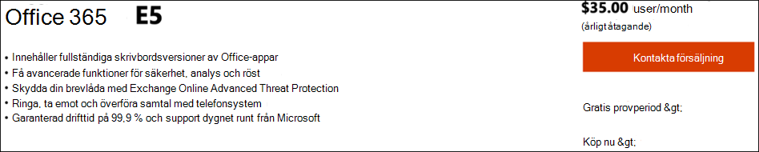
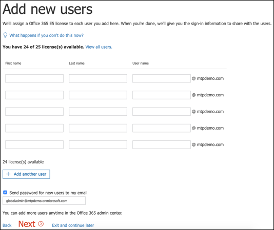
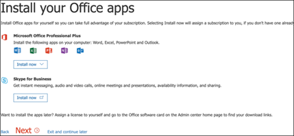
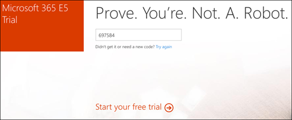

# Konfigurera utvärderings labb miljön för Microsoft Threat ProtectionSet up your Microsoft Threat Protection trial lab environment 

[!INCLUDE [Microsoft 365 Defender rebranding](../includes/microsoft-defender.md)]

**Gäller för:****Applies to:**
- Microsoft Threat ProtectionMicrosoft Threat Protection 

Att skapa ett utvärderings labb för Microsoft Threat-eller pilot miljö och distribuera det är en process i tre steg:Creating a Microsoft Threat Protection trial lab or pilot environment and deploying it is a three-phase process:

 
<table border="0" width="100%" align="center">
  <tr style="text-align:center;">
    <td align="center" style="width:25%; border:0;" >
      <a href= "https://docs.microsoft.com/microsoft-365/security/mtp/prepare-mtpeval?view=o365-worldwide"> 
        
       Fas 1: förbereda </a>Phase 1: Prepare </a> 
    </td>
     <td align="center"bgcolor="#d5f5e3">
      <a href="https://docs.microsoft.com/microsoft-365/security/mtp/setup-mtpeval?view=o365-worldwide">
        
       Fas 2: konfiguration </a>Phase 2: Setup </a> 
    </td>
    <td align="center">
      <a href="https://docs.microsoft.com/microsoft-365/security/mtp/config-mtpeval?view=o365-worldwide">
        
       Steg 3: Konfigurera & inbyggt </a>Phase 3: Configure & Onboard </a> 
</td>

  </tr>
</table>

Du befinner dig i fasen inställning.You're currently in the set up phase. Vidta de första stegen för att komma åt Microsoft 365 Security Center och konfigurera sedan utvärderings labbet eller pilot miljön.Take the initial steps to access Microsoft 365 Security Center then set up your trial lab or pilot environment.

Registrera dig för en Office 365-eller Azure Active Directory-prenumeration och generera en *. onmicrosoft.com* -klient organisation som du kan använda för att registrera dig för din Microsoft 365 E5-licens.Sign up for an Office 365 or Azure Active Directory subscription to generate a *.onmicrosoft.com* tenant that you can use to sign up for your Microsoft 365 E5 license. 

>[!NOTE]
>Om du redan har en prenumeration på Office 365 eller Azure Active Directory kan du hoppa över Office 365 E5-utvärderings-och pilot klient skapande anvisningar.If you already have an existing Office 365 or Azure Active Directory subscription, you can skip the Office 365 E5 trial or pilot tenant creation steps.

I den här fasen vägleds du:In this phase, you'll be guided to:
- Skapa en Office 365 E5-prov klientCreate an Office 365 E5 trial tenant
- Aktivera utvärderings prenumeration för Microsoft 365Enable Microsoft 365 trial subscription

## Skapa en Office 365 E5-prov klientCreate an Office 365 E5 trial tenant
>[!NOTE]
>Om du redan har en prenumeration på Office 365 eller Azure Active Directory kan du hoppa över stegen för att skapa ett Office 365 E5-prov.If you already have an existing Office 365 or Azure Active Directory subscription, you can skip the Office 365 E5 trial tenant creation steps.

1. Gå till [produkt portalen för Office 365 E5](https://www.microsoft.com/microsoft-365/business/office-365-enterprise-e5-business-software?activetab=pivot%3aoverviewtab) och välj **gratis prov**.Go to the [Office 365 E5 product portal](https://www.microsoft.com/microsoft-365/business/office-365-enterprise-e5-business-software?activetab=pivot%3aoverviewtab) and select **Free trial**.
  
  
2. Slutför utvärderings registreringen genom att ange din e-postadress (privat eller företag).Complete the trial registration by entering your email address (personal or corporate). Klicka på **Konfigurera konto**.Click **Set up account**.
   

3. Fyll i ditt förnamn, efter namn, företags telefonnummer, företags namn, företags storlek och land eller region.Fill in your first name, last name, business phone number, company name, company size, and country or region.  
   
>[!NOTE]
>Det land eller den region som du anger här bestämmer vilket område i data centret som Office 365 hanteras på.The country or region you set here determines the data center region your Office 365 will be hosted.
  
4. Välj verifierings inställningar: via SMS eller ett samtal.Choose your verification preference: through a text message or call. Klicka på **Skicka verifierings kod**.Click **Send Verification Code**. 
  

5. Ange det anpassade domän namnet för din klient organisation och klicka sedan på **Nästa**.Set the custom domain name for your tenant, then click **Next**.
   
 
6. Konfigurera den första identiteten, som är global administratör för klient organisationen.Set up the first identity, which will be a Global Administrator for the tenant. Fyll i **namn** och **lösen ord**.Fill in **Name** and **Password**. Klicka på **Registrera dig**.Click **Sign up**.
  

7. Klicka på **gå till installations programmet** för att slutföra Office 365 E5-etableringen för utvärderings version.Click **Go to Setup** to complete the Office 365 E5 trial tenant provisioning.
   

8. Anslut företags domänen till Office 365-klient organisationen.Connect your corporate domain to the Office 365 tenant. Skriver Välj **Anslut en domän som du redan äger** och skriv in ditt domän namn.[Optional] Choose **Connect a domain you already own** and type in your domain name. Klicka på **Nästa**.Click **Next**.
   
 
9. Lägga till en TXT-eller MX-post för att verifiera domänens ägarskap.Add a TXT or MX record to validate the domain ownership. När du har lagt till TXT-eller MX-posten i domänen väljer du **Verifiera**.Once you’ve added the TXT or MX record to your domain, select **Verify**.
   
 
10. Skriver Skapa fler användar konton för din klient organisation.[Optional] Create more user accounts for your tenant. Du kan hoppa över det här steget genom att klicka på **Nästa**.You can skip this step by clicking **Next**.
  
 
11. Skriver Ladda ner Office-appar.[Optional] Download Office apps. Hoppa över det här steget genom att klicka på **Nästa** .Click **Next** to skip this step. 
   

12. Skriver Migrera e-postmeddelanden.[Optional] Migrate email messages. Du kan hoppa över det här steget.Again, you can skip this step.
   
 
13. Välj online tjänster.Choose online services. Välj **Exchange** och klicka på **Nästa**.Select **Exchange** and click **Next**. 
   

14. Lägga till MX-, CNAME-och TXT-poster i din domän.Add MX, CNAME, and TXT records to your domain. När du är klar väljer du **Verifiera**.When completed, select **Verify**.
   
 
15. Grattis, du har slutfört etableringen av din Office 365-klient.Congratulations, you have completed the provisioning of your Office 365 tenant.
   

## Aktivera utvärderings prenumeration för Microsoft 365Enable Microsoft 365 trial subscription

>[!NOTE]
>Om du registrerar dig för en utvärderings version får du 25 användar licenser att använda i en månad.Signing up for a trial gives you 25 user licenses to use for a month. Mer information finns i [prova eller köpa en M365-prenumeration](https://docs.microsoft.com/microsoft-365/commerce/try-or-buy-microsoft-365#try-or-buy-a-microsoft-365-subscription-1) .See [Try or Buy an M365 subscription](https://docs.microsoft.com/microsoft-365/commerce/try-or-buy-microsoft-365#try-or-buy-a-microsoft-365-subscription-1) for details.

1. Från [Microsoft 365 administrations Center](https://admin.microsoft.com/)klickar du på **fakturering** och navigerar sedan till **inköps tjänster**.From [Microsoft 365 Admin Center](https://admin.microsoft.com/), click **Billing** and then navigate to **Purchase services**.

2. Välj **Microsoft 365 E5** och klicka på **Starta gratis prov period**.Select **Microsoft 365 E5** and click **Start free trial**. 
  

3. Välj verifierings inställningar: via SMS eller ett samtal.Choose your verification preference: through a text message or call. När du har bestämt dig anger du telefonnumret, väljer **SMS** eller **Ring mig** beroende på ditt val.Once you have decided, enter the phone number, select **Text me** or **Call me** depending on your selection.
  
 
4. Ange verifierings koden och klicka på **starta din gratis prov period**.Enter the verification code and click **Start your free trial**. 
   

5. Klicka på **prova nu** för att bekräfta utvärderings versionen av Microsoft 365 E5.Click **Try now** to confirm your Microsoft 365 E5 trial.
   
 
6. Gå till **administrations centret för Microsoft 365**-  >  **användare**  >  **Active users**.Go to the **Microsoft 365 Admin Center** > **Users** > **Active users**. Välj ditt användar konto, Välj **Hantera produkt licenser**och byt sedan licensen från Office 365 E5 till **Microsoft 365 E5**.Select your user account, select **Manage product licenses**, then swap the license from Office 365 E5 to **Microsoft 365 E5**. Klicka på **Spara**.Click **Save**.
  
 
7. Välj det globala administratörs kontot igen och klicka sedan på **hantera användar namn**.Select the global administrator account again then click **Manage username**.
   

8. Skriver Ändra domänen från *onmicrosoft.com* till din egen domän, beroende på vad du valde i föregående steg.[Optional] Change the domain from *onmicrosoft.com* to your own domain—depending on what you chose on the previous steps. Klicka på **Spara ändringar**.Click **Save changes**.
   

## Nästa stegNext step
|  [Steg 3: Konfigurera & inbyggtPhase 3: Configure & Onboard](config-mtpeval.md) | Konfigurera varje skydd mot Microsoft Threat för ditt utvärderings labb eller pilot miljö för Microsoft Threat Protection och har gjort slut punkterna.Configure each Microsoft Threat Protection pillar for your Microsoft Threat Protection trial lab or pilot environment and onboard your endpoints.
|:-------|:-----|
