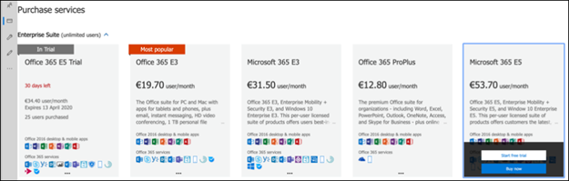

# Konfigurera testlabbeta för Microsoft Threat Protection 

**Gäller:**
- Microsoft Hotskydd 

Att skapa en testlabbmiljö för Microsoft Threat Protection och distribuera den är en trefasprocess:

 
<table border="0" width="100%" align="center">
  <tr style="text-align:center;">
    <td align="center" style="width:25%; border:0;" >
      <a href= "https://docs.microsoft.com/microsoft-365/security/mtp/prepare-mtpeval?view=o365-worldwide"> 
        
       Fas 1: Förbered</a> 
    </td>
     <td align="center"bgcolor="#d5f5e3">
      <a href="https://docs.microsoft.com/microsoft-365/security/mtp/setup-mtpeval?view=o365-worldwide">
        
       Fas 2: Installation</a> 
    </td>
    <td align="center">
      <a href="https://docs.microsoft.com/microsoft-365/security/mtp/config-mtpeval?view=o365-worldwide">
        
       Fas 3: Konfigurera & ombord</a> 
</td>

  </tr>
</table>

Du befinner dig för närvarande i ställningsfasen. Gör de första stegen för att komma åt Microsoft 365 Security Center och konfigurera sedan testlabbets miljö.

Registrera dig för en Office 365- eller Azure Active Directory-prenumeration för att generera en *.onmicrosoft.com-klient* som du kan använda för att registrera dig för din Microsoft 365 E5-licens. 

>[!NOTE]
>Om du redan har en befintlig Office 365- eller Azure Active Directory-prenumeration kan du hoppa över stegen för att skapa utvärderingsversionen av Office 365 E5-utvärderingsversionen av klientversionen av utvärderingsversionen av utvärderingsversionen av utvärderingsversionen av utvärderingsversionen av utvärderingsversionen av utvärderingsversionen av utvärderingsversionen av utvärderingsversionen av utvärderingsversionen av utvärderingsversionen av utvärderingsversionen av utvärderingsversionen av utvärderingsversionen av utvärderingsversionen av

I den här fasen guidas du till:
- Skapa en office 365 E5-utvärderingsklient
- Aktivera testprenumeration för Microsoft 365

## Skapa en office 365 E5-utvärderingsklient
>[!NOTE]
>Om du redan har en befintlig Office 365- eller Azure Active Directory-prenumeration kan du hoppa över stegen för att skapa utvärderingsversionen av Office 365 E5-utvärderingsversionen av klientversionen av utvärderingsversionen av utvärderingsversionen av utvärderingsversionen av utvärderingsversionen av utvärderingsversionen av utvärderingsversionen av utvärderingsversionen av utvärderingsversionen av utvärderingsversionen av utvärderingsversionen av utvärderingsversionen av utvärderingsversionen av utvärderingsversionen av utvärderingsversionen av

1. Gå till [produktportalen för Office 365 E5](https://www.microsoft.com/microsoft-365/business/office-365-enterprise-e5-business-software?activetab=pivot%3aoverviewtab) och välj **Kostnadsfri utvärderingsversion**.
  
  
2. Slutför provregistreringen genom att ange din e-postadress (personlig eller företagsadress). Klicka på **Konfigurera konto**.
   

3. Fyll i förnamn, efternamn, företagstelefonnummer, företagsnamn, företagsstorlek och land eller region.  
   
>[!NOTE]
>Det land eller den region som du anger här avgör vilken datacenterregion ditt Office 365 ska vara värd för.
  
4. Välj din verifieringsinställning: via ett sms eller samtal. Klicka på **Skicka verifieringskod**. 
  

5. Ange det anpassade domännamnet för din klient organisation och klicka sedan på **Nästa**.
   
 
6. Ställ in den första identiteten som kommer att vara en global administratör för klienten. Fyll i **namn** och **lösenord**. Klicka på **Registrera dig**.
  

7. Klicka på **Gå till installationsprogrammet** för att slutföra utvärderingsversionen av Office 365 E5 E5-utvärderingsversionen av klientversionen.
   

8. Anslut företagsdomänen till Office 365-klienten. [Valfritt] Välj **Anslut en domän som du redan äger** och skriv in ditt domännamn. Klicka på **Nästa**.
   
 
9. Du måste lägga till en TXT- eller MX-post för att validera domänägarskapet. När du har lagt till TXT- eller MX-posten i domänen väljer du **Verifiera**.
   
 
10. [Valfritt] Skapa fler användarkonton för din klient. Du kan hoppa över det här steget genom att klicka på **Nästa**.
  
 
11. [Valfritt] Ladda ned Office-appar. Klicka på **Nästa** om du vill hoppa över det här steget. 
   

12. [Valfritt] Migrera e-postmeddelanden. Återigen kan du hoppa över det här steget.
   
 
13. Välj onlinetjänster. Välj **Exchange** och klicka på **Nästa**. 
   

14. Lägg till MX-, CNAME- och TXT-poster i domänen. När du är klar väljer du **Verifiera**.
   
 
15. Grattis, du har slutfört etableringen av din Office 365-klientorganisation.
   

## Aktivera testprenumeration för Microsoft 365

>[!NOTE]
>När du registrerar dig för en utvärderingsversion får du 25 användarlicenser att använda under en månad. Mer information finns i [Prova eller köp en M365-prenumeration.](https://docs.microsoft.com/microsoft-365/commerce/try-or-buy-microsoft-365?view=o365-worldwide#try-or-buy-a-microsoft-365-subscription-1)

1. I [Administrationscenter för Microsoft 365](https://admin.microsoft.com/)klickar du på **Fakturering** och navigerar sedan till **Köptjänster**.

2. Välj **Microsoft 365 E5** och klicka på **Starta kostnadsfri utvärderingsversion**. 
  

3. Välj din verifieringsinställning: via ett sms eller samtal. När du har bestämt dig anger du telefonnumret, väljer **Sms:a mig** eller **Ring mig** beroende på ditt val.
  
 
4. Ange verifieringskoden och klicka på **Starta din kostnadsfria utvärderingsversion**. 
   

5. Klicka på **Försök nu** om du vill bekräfta testversionen av Microsoft 365 E5.
   
 
6. Gå till **Microsoft 365 Admin Center**  >  **Användare**Aktiva  >  **användare**. Välj ditt användarkonto, välj **Hantera produktlicenser**och byt sedan licensen från Office 365 E5 till **Microsoft 365 E5**. Klicka på **Spara**.
  
 
7. Välj det globala administratörskontot igen och klicka sedan på **Hantera användarnamn**.
   

8. [Valfritt] Ändra domänen från *onmicrosoft.com* till din egen domän – beroende på vad du valde i föregående steg. Klicka på **Spara ändringar**.
   

## Nästa steg
||| |:-------|:-----|config-onboard.png)  [Fas 3: Konfigurera & ombord](config-mtpeval.md) | Konfigurera varje Microsoft Threat Protection-pelare för testlabbmiljön för Microsoft Threat Protection och dina slutpunkter.
