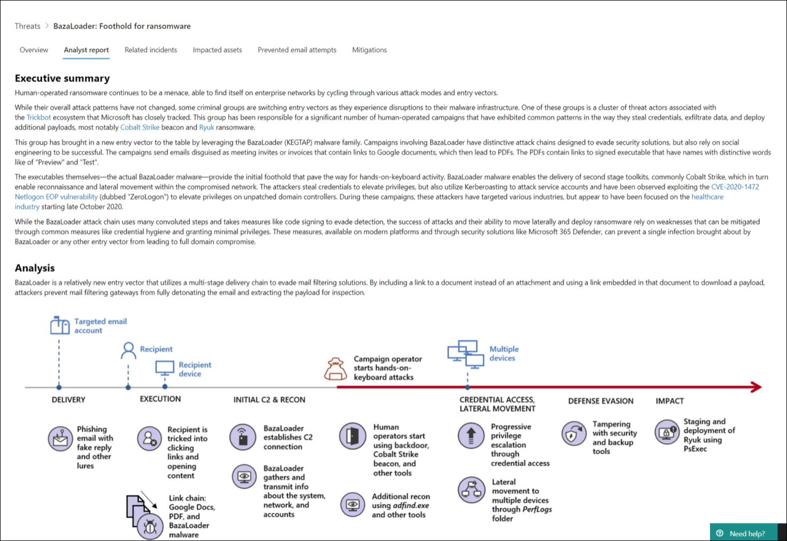

# Förstå analytikerrapporten i hotanalyser

[!INCLUDE [Microsoft 365 Defender rebranding](../includes/microsoft-defender.md)]

**Gäller för:**
- Microsoft 365 Defender

> Vill du uppleva Microsoft 365 Defender? Du kan [utvärdera det i en labbmiljö](https://aka.ms/mtp-trial-lab) eller köra [pilotprojektet i produktion.](https://aka.ms/m365d-pilotplaybook)
>

[!INCLUDE [Prerelease](../includes/prerelease.md)]

Varje [rapport om hotanalyser](threat-analytics.md) innehåller dynamiska avsnitt och ett omfattande skriftligt avsnitt som kallas _analytikerrapporten._ Öppna rapporten om de spårade hoten för att komma åt det här avsnittet och välj fliken **Analytikerrapport.**

_Avsnittet Analytikerrapport i en rapport om hotanalyser_

## Skanna analytikernas rapport 
Varje avsnitt i analytikerrapporten har utformats för att ge användbar information. Rapporterna varierar, men de flesta rapporter innehåller de avsnitt som beskrivs i följande tabell.

| Avsnittet Rapport | Beskrivning |
|--|--|
| Sammanfattning av ledningen | Översikt över hot, inklusive när man först såg dem, dess motivation, viktiga händelser, viktiga mål samt distinkta verktyg och tekniker. Du kan använda den här informationen för att ytterligare bedöma hur du ska prioritera hoten inom ramen för branschen, geografisk plats och nätverk. |
| Analys | Teknisk information om hoten, bland annat information om en attack och hur attacker kan använda en ny teknik eller attackyta | 
| MITRE ATT&observerade CK-tekniker | Hur observerade tekniker mappas till [MITRE ATT&CK-attackramverket](https://attack.mitre.org/) | 
| [Minskningar](#apply-additional-mitigations) | Rekommendationer som kan stoppa eller hjälpa till att minska påverkan på hoten. Det här avsnittet innehåller också åtgärder som inte spåras dynamiskt som en del av rapporten över hotanalyser. |
| [Information om identifiering](#understand-how-each-threat-can-be-detected) | Specifika och allmänna identifieringar från Microsofts säkerhetslösningar som kan hantera aktivitet eller komponenter som är associerade med hot. | 
| [Avancerad jakt](#find-subtle-threat-artifacts-using-advanced-hunting) | [Avancerade sökfrågor för att](advanced-hunting-overview.md) proaktivt identifiera möjliga hotaktiviteter. De flesta frågor tillhandahålls för identifiering av tillägg, särskilt för att hitta potentiellt skadliga komponenter eller beteenden som inte dynamiskt kan utvärderas som skadliga. | 
| Referenser | Microsofts och tredjepartspublikationer som används av analytiker vid skapandet av rapporten. Innehåll i hotanalyser baseras på data som validerats av Microsoft. Information från offentligt tillgängliga tredjepartskällor identifieras tydligt som sådan. | 
| Ändringslogg | Tiden då rapporten publicerades och när betydande ändringar gjordes i rapporten. |

## Tillämpa ytterligare åtgärder
Hotanalyser spårar dynamiskt [status för säkerhetsuppdateringar och säkra konfigurationer.](threat-analytics.md#mitigations-review-list-of-mitigations-and-the-status-of-your-devices) Den här informationen är tillgänglig som diagram och tabeller på **fliken Minskningar.**

Utöver de här spårade minskningarna tar analytikerna även upp åtgärder som _inte_ övervakas dynamiskt. Här är några exempel på viktiga åtgärder som inte spåras dynamiskt:

- Blockera e-postmeddelanden _med LNK-bilagor_ eller andra misstänkta filtyper
- Slumpmässiga lösenord för lokala administratörer
- Utbilda slutanvändare om nätfiske-e-post och andra hot-vektorer
- Aktivera specifika [minskningsregler för attackytan](https://docs.microsoft.com/windows/security/threat-protection/microsoft-defender-atp/attack-surface-reduction)

Du kan använda fliken Åtgärder **för** att bedöma säkerheten mot ett hot, men med hjälp av de här rekommendationerna kan du vidta ytterligare åtgärder för att förbättra säkerheten. Läs noggrant alla riktlinjer för åtgärder i analytiker och använd dem när det är möjligt.

## Förstå hur varje hot kan identifieras
Analysrapporten innehåller även funktioner för identifieringar från  Microsoft Defender för endpoint antivirus och slutpunktsidentifiering och -svar (EDR).

### Antivirusprogramsidentifiering
De här identifieringarna är tillgängliga på enheter [med Microsoft Defender Antivirus](https://docs.microsoft.com/windows/security/threat-protection/microsoft-defender-antivirus/microsoft-defender-antivirus-in-windows-10) aktiverat. När dessa identifieringar inträffar på enheter som har introducerats till Microsoft Defender för Endpoint utlöser de även aviseringar som aktiverar diagrammen i rapporten.

>[!NOTE]
>Analysrapporten visar även **allmänna** identifieringar som kan identifiera en mängd olika hot, utöver komponenter eller beteenden som är specifika för de spårade hoten. Dessa allmänna identifieringar återspeglas inte i diagrammen.

### Aviseringar om identifiering av slutpunkt och svar (EDR)
EDR-aviseringar upphöjs [för enheter som förs in i Microsoft Defender för Slutpunkt.](https://docs.microsoft.com/windows/security/threat-protection/microsoft-defender-atp/onboard-configure) Dessa varningar förlitar sig vanligtvis på säkerhetssignaler som samlas in av Microsoft Defender för Endpoint-sensor och andra slutpunktsfunktioner – till exempel antivirus, nätverksskydd, manipuleringsskydd – som fungerar som kraftfulla signalkällor.

Precis som listan med antivirusidentifieringar är vissa EDR-aviseringar utformade för att generellt flagga misstänkt beteende som kanske inte associeras med de spårade hoten. I sådana fall identifierar rapporten tydligt varningen som "allmän" och att den inte påverkar något av diagrammen i rapporten.

### E-postrelaterade identifieringar och åtgärder
E-postrelaterade identifieringar och åtgärder från Microsoft Defender för Office 365 ingår i analysrapporter utöver de slutpunktsdata som redan är tillgängliga från Microsoft Defender för Slutpunkt. 

Information om förhindrade e-postförsök ger dig inblick i om din organisation var ett mål för de hot som hanterades i analytikerrapporten, även om attacken effektivt har blockerats innan den levereras eller levereras till skräppostmappen.

## Hitta diskreta hot artefakter med avancerad sökning
Med identifieringar kan du identifiera och stoppa de spårade hoten automatiskt, men många attackaktiviteter lämnar diskreta spårningar som kräver ytterligare kontroll. Vissa attackaktiviteter har beteenden som också kan vara normala, så att de dynamiskt kan leda till driftsbrus eller till och med falska positiva identifieringar.

[Med avancerad](advanced-hunting-overview.md) sökning får du ett gränssnitt för frågor baserade på Kusto-frågespråk som gör det enklare att hitta diskreta indikatorer på hotaktivitet. Du kan också ta fram sammanhangsberoende information och kontrollera om indikatorer är kopplade till ett hot.

Avancerade sökfrågor i analytikernas rapporter har kontrollerats av Microsoft-analytiker och är klara att köra i den [avancerade frågeredigeraren för sökfrågor.](https://security.microsoft.com/advanced-hunting) Du kan också använda frågorna för att skapa anpassade identifieringsregler [som](custom-detection-rules.md) utlöser aviseringar för framtida matchningar.

>[!NOTE]
> Hotanalyser finns också tillgängliga i [Microsoft Defender för Endpoint.](https://docs.microsoft.com/windows/security/threat-protection/microsoft-defender-atp/threat-analytics) Det har dock inte dataintegreringen mellan Microsoft Defender för Office och Microsoft Defender för Slutpunkt som analys av Microsoft 365 Defender-hot har.

## Relaterade ämnen
- [Översikt över hotanalys](threat-analytics.md)
- [Hitta hot proaktivt med avancerad sökning](advanced-hunting-overview.md) 
- [Anpassade identifieringsregler](custom-detection-rules.md)
