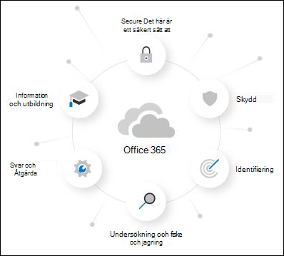

# Om utvärderingsversionen av Microsoft Defender för Office 365About the Microsoft Defender for Office 365 trial

Microsoft Defender för Office 365 skyddar organisationen mot skadliga hot som e-postmeddelanden, länkar (URL:er) och samarbetsverktyg medför.Microsoft Defender for Office 365 safeguards your organization against malicious threats that are posed by email messages, links (URLs), and collaboration tools. Defender för Office 365 innehåller:Defender for Office 365 includes:

- **Principer för hotskydd**: Definiera skyddsprinciper för hot för att ange rätt skyddsnivå för din organisation.**Threat protection policies**: Define threat-protection policies to set the appropriate level of protection for your organization.
- **Rapporter:** Visa rapporter i realtid och övervaka Defender för Office 365-prestanda i organisationen.**Reports**: View real-time reports to monitor Defender for Office 365 performance in your organization.
- **Funktioner för undersökning av hot och svar**: Använd verktygen för nya funktioner för att undersöka, förstå, simulera och förhindra hot.**Threat investigation and response capabilities**: Use leading-edge tools to investigate, understand, simulate, and prevent threats.
- **Automatiserade funktioner för undersökning och svar**: Spara tid och ansträngning för att undersöka och mildra hot.**Automated investigation and response capabilities**: Save time and effort investigating and mitigating threats.

En utvärderingsversion av Microsoft Defender för Office 365 är det enklaste sättet att prova funktionerna i Defender för Office 365, och det krävs bara några få klick för att konfigurera den.A Microsoft Defender for Office 365 trial is the easiest way to try the capabilities of Defender for Office 365, and setting it up only takes a couple of clicks. När utvärderingsversionen är klar är alla Defender för Office 365 Abonnemang 1- och Abonnemang 2-funktioner tillgängliga i organisationen i upp till 90 dagar.After the trial setup is complete, all Defender for Office 365 Plan 1 and Plan 2 capabilities are available in the organization for up to 90 days.

> [!NOTE]
> Den automatiska konfiguration som beskrivs i den här artikeln är för närvarande i offentlig förhandsversion och kanske inte är tillgänglig på din plats.The automated configuration that's described in this article is currently in Public Preview and might not be available in your location.

## VillkorTerms and conditions

Utvärderingsversionen av Defender för Office 365 finns tillgänglig i 90 dagar och kan initieras för alla dina användare.The Defender for Office 365 trial is available for 90 days and can initiated for all of your users. Mer information finns i <link to TOU> .For more information, see <link to TOU>.

## Konfigurera en utvärderingsversion av Defender för Office 365Set up a Defender for Office 365 trial

Med en utvärderingsversion kan organisationer enkelt konfigurera och konfigurera Defender för Office 365-funktioner.A trial allows organizations to easily set up and configure the Defender for Office 365 capabilities. Under installationen används principer som är exklusiva för Defender för Office 365 (specifikt Säkra bifogade [filer,](atp-safe-attachments.md)Säkra länkar och [personifieringsskydd](set-up-anti-phishing-policies.md#impersonation-settings-in-anti-phishing-policies-in-microsoft-defender-for-office-365)i principer för skräppostskydd) med standardmallen för förinställda säkerhetsprinciper. During setup, policies that are exclusive to Defender for Office 365 (specifically, [Safe Attachments](atp-safe-attachments.md), [Safe Links](atp-safe-links.md), and [impersonation protection in anti-spam policies](set-up-anti-phishing-policies.md#impersonation-settings-in-anti-phishing-policies-in-microsoft-defender-for-office-365)) are applied using the Standard template for [preset security policies](preset-security-policies.md).

Som standard är de här principerna begränsade till alla användare i organisationen, men administratörer kan anpassa principerna under eller efter installationen så att de endast gäller för specifika användare.By default, these policies are scoped to all users in the organization, but admins can customize the policies during or after setup so they apply only to specific users.

Under installationen konfigureras även MDO-svarsfunktioner (som finns i MDO P2 eller motsvarande) för hela organisationen.During setup, MDO response functionality (found in MDO P2 or equivalent) is also setup for the entire organization. Det krävs ingen principomfång.No policy scoping is required.

## LicensieringLicensing

Som en del av utvärderingsversionen tillämpas Defender för Office 365-licenser automatiskt på organisationen.As part of the trial setup, the Defender for Office 365 licenses are automatically applied to the organization. Licenserna är gratis under de första 90 dagarna.The licenses are free of charge for the first 90 days.

## BehörigheterPermissions

För att starta eller avsluta utvärderingsversionen måste du vara medlem i rollerna **global administratör** eller **säkerhetsadministratör** i Azure Active Directory.To start or end the trial, you need to be a member of the **Global Administrator** or **Security Administrator** roles in Azure Active Directory. Mer information finns i [Om administratörsroller.](https://docs.microsoft.com/microsoft-365/admin/add-users/about-admin-roles)For details, see [About admin roles](https://docs.microsoft.com/microsoft-365/admin/add-users/about-admin-roles).

## Ytterligare informationAdditional information

När du har registrerat dig för utvärderingsversionen kan det ta upp till två timmar innan ändringarna och uppdateringarna blir tillgängliga.After you enroll in the trial, it might take up to 2 hours for the changes and updates to be available. Dessutom måste administratörer logga ut och logga in igen för att se ändringarna.And, admins must log out and log back in to see the changes.

Administratörer kan inaktivera utvärderingsversionen när som helst genom att gå <> kort.Admins can disable the trial at any point by going to the <> card.

## TillgänglighetAvailability

Utvärderingsversionen av Defender för Office 365 lanseras gradvis till befintliga kunder som uppfyller specifika villkor (inklusive geografi) och som inte har befintliga licenser för Defender för Office 365 Abonnemang 1 eller Abonnemang 2 (ingår i prenumerationen eller som ett tillägg).The Defender for Office 365 trial is gradually rolling out to existing customers who meet specific criteria (including geography) and who don't have existing Defender for Office 365 Plan 1 or Plan 2 licenses (included in their subscription or as an add-on).

## Läs mer om Defender för Office 365Learn more about Defender for Office 365

Defender för Office 365 hjälper organisationer att skydda sitt företag genom att erbjuda en omfattande uppsättning funktioner.Defender for Office 365 helps organizations secure their enterprise by offering a comprehensive slate of capabilities.

Du kan också läsa mer om Defender för Office 365 i den här [interaktiva guiden.](https://techcommunity.microsoft.com/t5/video-hub/protect-your-organization-with-microsoft-365-defender/m-p/1671189)You can also learn more about Defender for Office 365 at this [interactive guide](https://techcommunity.microsoft.com/t5/video-hub/protect-your-organization-with-microsoft-365-defender/m-p/1671189).

### SkyddPrevention

En robust filtreringsstack förhindrar en mängd olika volymbaserade och riktade attacker, inklusive intrång i företags-e-post, autentiseringsuppgifter vid nätfiske, utpressningstrojaner och avancerad skadlig programvara.A robust filtering stack prevents a wide variety of volume-based and targeted attacks including business email compromise, credential phishing, ransomware, and advanced malware.

- [Principer för skydd mot nätfiske: Exklusiva inställningar i Defender för Office 365Anti-phishing policies: Exclusive settings in Defender for Office 365](set-up-anti-phishing-policies.md#exclusive-settings-in-anti-phishing-policies-in-microsoft-defender-for-office-365)
- [Säkra bifogade filerSafe Attachments](atp-safe-attachments.md)
- [Säkra länkarSafe Links](atp-safe-links.md)

### IdentifieringDetection

Branschledande AI identifierar skadligt och misstänkt innehåll och korrelerar attackmönster för att identifiera kampanjer som är utformade för att undvika skydd.Industry-leading AI detects malicious and suspicious content and correlates attack patterns to identify campaigns designed to evade protection.

- [Kampanjvyer i Microsoft Defender för Office 365Campaign Views in Microsoft Defender for Office 365](campaigns.md)

### Undersökning och fiskeInvestigation and hunting

Kraftfulla funktioner hjälper dig att identifiera, prioritera och undersöka hot, med avancerade sökfunktioner för att spåra attacker i Office 365.Powerful experiences help identify, prioritize, and investigate threats, with advanced hunting capabilities to track attacks across Office 365.

- [Hotutforskaren och identifieringar i realtidThreat Explorer and Real-time detections](threat-explorer.md)
- [Realtidsrapporter i Defender för Office 365Real-time reports in Defender for Office 365](view-reports-for-atp.md)
- [Threat Trackers – nytt och värt att uppmärksammaThreat Trackers - New and Noteworthy](threat-trackers.md)
- Integrering med [Microsoft 365 Defender](https://docs.microsoft.com/microsoft-365/security/mtp/microsoft-threat-protection)Integration with [Microsoft 365 Defender](https://docs.microsoft.com/microsoft-365/security/mtp/microsoft-threat-protection)

### Svar och åtgärdResponse and remediation

Omfattande svars- och automatiseringsfunktioner för incidenter ökar säkerhetsteamets effektivitet och effektivitet.Extensive incident response and automation capabilities amplify your security team’s effectiveness and efficiency.

- [Automatiserad undersökning och svar (AIR) i Microsoft Defender för Office 365Automated investigation and response (AIR) in Microsoft Defender for Office 365](office-365-air.md)

### Information och utbildningAwareness and training

Omfattande simulerings- och utbildningsfunktioner tillsammans med integrerade funktioner i klientprogram gör användarna mer medvetna.Rich simulation and training capabilities along with integrated experiences within client applications build user awareness.

- [Kom igång med Attack simuleringsträningGet started using Attack simulation training](attack-simulation-training-get-started.md)

### Säker säkerhetsstatusSecure posture

Rekommenderade mallar och konfigurationsinformation hjälper kunderna att få och vara säkra.Recommended templates and configuration insights help customers get and stay secure.

- [Förinställda säkerhetsprinciper i EOP och Microsoft Defender för Office 365Preset security policies in EOP and Microsoft Defender for Office 365](preset-security-policies.md)
- [Konfigurationsanalys för skyddsprinciper i EOP och Microsoft Defender för Office 365.](configuration-analyzer-for-security-policies.md)[Configuration analyzer for protection policies in EOP and Microsoft Defender for Office 365](configuration-analyzer-for-security-policies.md).

## Ge feedbackGive feedback

Din feedback hjälper oss att bli bättre på att skydda miljön mot avancerade attacker.Your feedback helps us get better at protecting your environment from advanced attacks. Dela din upplevelse och intryck av produktfunktioner och utvärderingsresultat.Share your experience and impressions of product capabilities and trial results.
