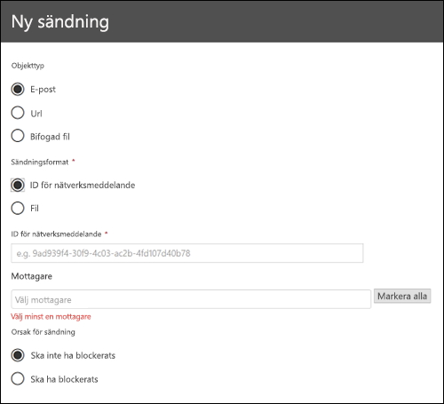
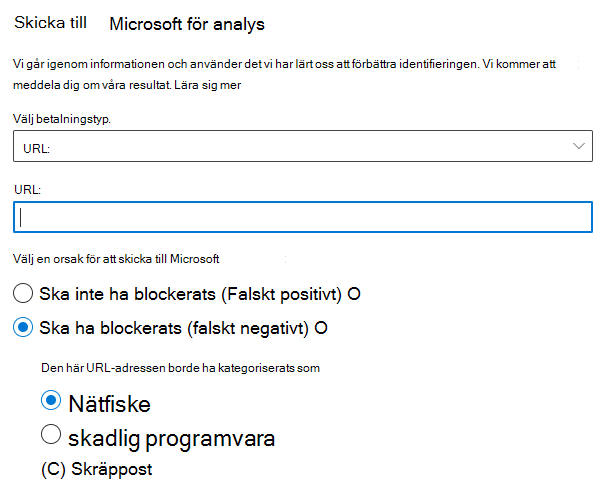
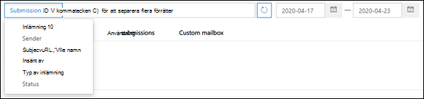
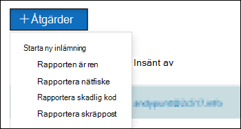

# Använd administratörs sändning för att skicka misstänkt skräp post, Phish, URL: er och filer till MicrosoftUse Admin Submission to submit suspected spam, phish, URLs, and files to Microsoft

[!INCLUDE [Microsoft 365 Defender rebranding](../includes/microsoft-defender-for-office.md)]

I Microsoft 365-organisationer med post lådor i Exchange Online kan administratörer använda & portalen för att skicka e-postmeddelanden, URL: er och bifogade filer till Microsoft för att söka.In Microsoft 365 organizations with mailboxes in Exchange Online, admins can use the Submissions portal in the Security & Compliance Center to submit email messages, URLs, and attachments to Microsoft for scanning.

När du skickar ett e-postmeddelande får du:When you submit an email message, you will get:

1. **Kontrol lera e-postauktorisering**: information om huruvida e-postauktoriseringen lyckades eller misslyckades när den levererades.**Email authentication check**: Details on whether email authentication passed or failed when it was delivered.
2. **Princip träffar**: information om eventuella principer som kan ha tillåtit eller blockera inkommande e-post till din klient organisation och Åsidosätt vårt service filter verdicts.**Policy hits**: Information about any policies that may have allowed or blocked the incoming email into your tenant, overriding our service filter verdicts.
3. **Nytto lastens rykte/spränghet**: undersökning av URL-adresser och bilagor i meddelandet.**Payload reputation/detonation**: Examination of any URLs and attachments in the message.
4. **Kurs analys**: granska gjorda av de mänskliga betygen för att bekräfta att meddelanden är skadliga.**Grader analysis**: Review done by human graders in order to confirm whether or not messages are malicious.

> [!IMPORTANT]
> Nytto lastens rykte/Spräng och betygs analyser utförs inte hos alla klient organisationer.Payload reputation/detonation and grader analysis are not done in all tenants. Informationen blockeras från att gå utanför organisationen när data inte förväntas lämna klient organisationens gräns för efterlevnad.Information is blocked from going outside the organization when data is not supposed to leave the tenant boundary for compliance purposes.

Andra sätt att skicka e-postmeddelanden, webb adresser och bilagor till Microsoft finns i [rapportera meddelanden och filer till Microsoft](report-junk-email-messages-to-microsoft.md).For other ways to submit email messages, URLs, and attachments to Microsoft, see [Report messages and files to Microsoft](report-junk-email-messages-to-microsoft.md).

## Vad behöver jag veta innan jag börjar?What do you need to know before you begin?

- Öppna säkerhets- och efterlevnadscentret på <https://protection.office.com/>.You open the Security & Compliance Center at <https://protection.office.com/>. För att gå direkt till **sändnings** sidan, Använd <https://protection.office.com/reportsubmission> .To go directly to the **Submission** page, use <https://protection.office.com/reportsubmission>.

- För att skicka meddelanden och filer till Microsoft måste du vara medlem i någon av följande roll grupper:To submit messages and files to Microsoft, you need to be a member of one of the following role groups:

  - **Organisationshantering** eller **Säkerhetsadministratör** i [Säkerhets- och efterlevnadscenter](permissions-in-the-security-and-compliance-center.md).**Organization Management** or **Security Administrator** in the [Security & Compliance Center](permissions-in-the-security-and-compliance-center.md).

  - **Organisations hantering** i [Exchange Online](https://docs.microsoft.com/Exchange/permissions-exo/permissions-exo#role-groups).**Organization Management** in [Exchange Online](https://docs.microsoft.com/Exchange/permissions-exo/permissions-exo#role-groups).

    Observera att medlemskap i den här roll gruppen krävs för att [Visa användar överföringar till den anpassade post lådan](#view-user-submissions-to-the-custom-mailbox) enligt beskrivningen längre ned i den här artikeln.Note that membership in this role group is required to [View user submissions to the custom mailbox](#view-user-submissions-to-the-custom-mailbox) as described later in this article.

- Mer information om hur användarna kan skicka meddelanden och filer till Microsoft finns i [rapportera meddelanden och filer till Microsoft](report-junk-email-messages-to-microsoft.md).For more information about how users can submit messages and files to Microsoft, see [Report messages and files to Microsoft](report-junk-email-messages-to-microsoft.md).

## Rapportera misstänkt innehåll till MicrosoftReport suspicious content to Microsoft

1. I säkerhets & Compliance Center går du till **Threat Management** -undersändningar \> , kontrollerar att du är på fliken **admin-överföring** och klickar sedan på **ny överföring**.In the Security & Compliance Center, go to **Threat management** \> **Submissions**, verify that you're on the **Admin submissions** tab, and then click **New submission**.

2. Använd  utfällbar text som visas för att skicka meddelandet, URL: en eller bifogad fil enligt beskrivningen i följande avsnitt.Use **New submission** flyout that appears to submit the message, URL, or attachment as described in the following sections.

### Skicka ett tveksamt e-postmeddelande till MicrosoftSubmit a questionable email to Microsoft

1. Välj **e-post** under **objekt typ** .In the **Object type** section, select **Email**. Använd något av följande alternativ i avsnittet **sändnings format** :In the **Submission format** section, use one of the following options:

   - **ID för nätverks meddelande**: det här är ett GUID-värde som är tillgängligt i huvudet **x-MS-Exchange-Organization-Network-meddelande-ID** i meddelandet, eller i **X-MS-Office365****Network Message ID**: This is a GUID value that's available in the **X-MS-Exchange-Organization-Network-Message-Id** header in the message, or in the **X-MS-Office365-Filtering-Correlation-Id** header in quarantined messages.

   - **Fil**: Klicka på **Välj fil**.**File**: Click **Choose file**. I dialog rutan som öppnas letar du reda på och markerar EML-eller MSG-filen och klickar sedan på **Öppna**.In the dialog that opens, find and select the .eml or .msg file, and then click **Open**.

   > [!NOTE]
   > Administratörer med Defender för Office 365 abonnemang 1 eller abonnemang 2 kan skicka meddelanden som gamla 30 dagar.Admins with Defender for Office 365 Plan 1 or Plan 2 are able to submit messages as old as 30 days. Andra administratörer kan bara gå tillbaka sju dagar.Other admins will only be able to go back 7 days.

2. Ange en eller flera mottagare som du vill köra en princip kontroll för i avsnittet **mottagare** .In the **Recipients** section, specify one or more recipients that you would like to run a policy check against. Princip kontrollen avgör om genomsökning av e-postmeddelandet kringgås på grund av principer för användare eller organisation.The policy check will determine if the email bypassed scanning due to user or organization policies.

3. Välj något av följande alternativ i avsnittet **orsak för inlämning** :In the **Reason for submission** section, select one of the following options:

   - **Ska inte ha blockerats****Should not have been blocked**

   - **Bör ha blockerats**: Välj **skräp post**, **nätfiske** eller **skadlig program vara**.**Should have been blocked**: Select **Spam**, **Phishing**, or **Malware**. Om du är osäker kan du använda ditt bästa omdöme.If you're not sure, use your best judgment.

4. När du är klar klickar du på **Skicka** .When you're finished, click the **Submit** button.

   

### Skicka en misstänkt URL till MicrosoftSend a suspect URL to Microsoft

1. Välj **URL** under **objekt typ** .In the **Object type** section, select **URL**. I rutan som visas anger du den fullständiga URL: en (till exempel `https://www.fabrikam.com/marketing.html` ).In the box that appears, enter the full URL (for example, `https://www.fabrikam.com/marketing.html`).

2. Välj något av följande alternativ i avsnittet **orsak för inlämning** :In the **Reason for submission** section, select one of the following options:

   - **Ska inte ha blockerats****Should not have been blocked**

   - **Borde ha blockerats**: Välj **nätfiske** eller **malware**.**Should have been blocked**: Select **Phishing** or **Malware**.

3. När du är klar klickar du på **Skicka** .When you're finished, click the **Submit** button.

   

### Skicka en misstänkt fil till MicrosoftSubmit a suspected file to Microsoft

1. Välj **bilaga** under **objekt typ** .In the **Object type** section, select **Attachment**.

2. Klicka på **Välj fil**.Click **Choose File**. Leta upp och markera filen i dialog rutan som öppnas och klicka sedan på **Öppna**.In the dialog that opens, find and select the file, and then click **Open**.

3. Välj något av följande alternativ i avsnittet **orsak för inlämning** :In the **Reason for submission** section, select one of the following options:

   - **Ska inte ha blockerats****Should not have been blocked**

   - **Bör ha blockerats**: **malware** är det enda alternativet och väljs automatiskt...**Should have been blocked**: **Malware** is the only choice, and is automatically selected..

4. När du är klar klickar du på **Skicka** .When you're finished, click the **Submit** button.

   

## Visa administratörs inlämningarView admin submissions

I säkerhets & Compliance Center går du till **Threat Management** -undersändningar \> , kontrollerar att du är på fliken **admin-överföring** och klickar sedan på **ny överföring**.In the Security & Compliance Center, go to **Threat management** \> **Submissions**, verify that you're on the **Admin submissions** tab, and then click **New submission**.

Högst upp på sidan kan du ange ett start datum, ett slutdatum och (som standard) som du kan filtrera efter **överförings-ID** (ett GUID-värde som är kopplat till varje överföring) genom att ange ett värde i rutan och klicka på  .Near the top of the page, you can enter a start date, an end date, and (by default) you can filter by **Submission ID** (a GUID value that's assigned to every submission) by entering a value in the box and clicking . Du kan ange flera värden avgränsade med kommatecken.You can enter multiple values separated by commas.

Om du vill ändra filter villkoren klickar du på knappen **Skicka ID** och väljer något av följande värden:To change the filter criteria, click the **Submission ID** button and choose one of the following values:

- **Avsändare****Sender**
- **Ämne/URL/fil namn****Subject/URL/File name**
- **Skickades av****Submitted by**
- **Sändnings typ****Submission type**
- **Status****Status**

Exportera resultatet genom att klicka på **Exportera** överst på sidan och välja **diagram data** eller **tabell**.To export the results, click **Export** near the top of the page and select **Chart data** or **Table**. Spara CSV-filen i dialog rutan som visas.In the dialog that appears, save the .csv file.

Under grafen finns det tre flikar: **e-post** (standard), **URL** och **bifogad fil**.Below the graph, there are three tabs: **Email** (default), **URL**, and **Attachment**.

### Visa e-postinlägg för administratörerView admin email submissions

Klicka på fliken **e-post** .Click the **Email** tab.

Du kan klicka på knappen **kolumn alternativ** nära längst ned på sidan för att lägga till eller ta bort kolumner i vyn:You can click the **Column options** button near the bottom of the page to add or remove columns from the view:

- **Datum****Date**
- **Sändnings-ID**: ett GUID-värde som tilldelats varje överföring.**Submission ID**: A GUID value that's assigned to every submission.
- **Skickades av**\***Submitted by**\*
- **Ämne**\***Subject**\*
- **Avsändare****Sender**
- **Avsändarens IP**\***Sender IP**\*
- **Sändnings typ****Submission type**
- **Leverans orsak****Delivery reason**
- **Status**\***Status**\*

  \* Om du klickar på det här värdet visas detaljerad information i utfällbar skick.\* If you click this value, detailed information is displayed in a flyout.

#### Information om att söka efter administratörs uppgifterAdmin submission rescan details

Meddelanden som skickas i administratörs inlämningar skannas in och visas i den utfällbara informationen:Messages that are submitted in admin submissions are rescanned and results shown in the details flyout:

- Om det uppstod ett fel i avsändarens e-postautentisering vid leverans tillfället.If there was a failure in the sender's email authentication at the time of delivery.
- Information om eventuella policy träffar som kan ha påverkat eller åsidosatt Verdict av ett meddelande.Information about any policy hits that could have affected or overridden the verdict of a message.
- Aktuella Spräng resultat för att se om URL-adresserna eller filerna i meddelandet är skadliga eller inte.Current detonation results to see if the URLs or files contained in the message were malicious or not.
- Feedback från betyg.Feedback from graders.

Om en åsidosättning hittas måste genomsökningen genomföras flera minuter.If an override was found, the rescan should complete in several minutes. Om det inte fanns något problem med e-postauktorisering eller leveransen påverkas inte av en åsidosättning och feedback från betyg kan ta upp till en dag.If there wasn't a problem in email authentication or delivery wasn't affected by an override, then the feedback from graders could take up to a day.

### Visa URL-överföringar för administratörerView admin URL submissions

Klicka på fliken **URL** .Click the **URL** tab.

Du kan klicka på knappen **kolumn alternativ** nära längst ned på sidan för att lägga till eller ta bort kolumner i vyn:You can click the **Column options** button near the bottom of the page to add or remove columns from the view:

- **Datum****Date**
- **Sändnings-ID****Submission ID**
- **Skickades av**\***Submitted by**\*
- **:**\***URL**\*
- **Sändnings typ****Submission type**
- **Status**\***Status**\*

  \* Om du klickar på det här värdet visas detaljerad information i utfällbar skick.\* If you click this value, detailed information is displayed in a flyout.

### Visa underlämning av administrativa bilagorView admin attachment submissions

Klicka på fliken **bifogade filer** .Click the **Attachments** tab.

Du kan klicka på knappen **kolumn alternativ** nära längst ned på sidan för att lägga till eller ta bort kolumner i vyn:You can click the **Column options** button near the bottom of the page to add or remove columns from the view:

- **Datum****Date**
- **Sändnings-ID****Submission ID**
- **Skickades av**\***Submitted by**\*
- **Fil namn**\***File name**\*
- **Sändnings typ****Submission type**
- **Status**\***Status**\*

  \* Om du klickar på det här värdet visas detaljerad information i utfällbar skick.\* If you click this value, detailed information is displayed in a flyout.

## Visa användar inlämningar till MicrosoftView user submissions to Microsoft

Om du har distribuerat [tillägget rapportera](enable-the-report-message-add-in.md)tillägget rapport- [nätfiske](enable-the-report-phish-add-in.md)eller personer som använder den [inbyggda rapporteringen i Outlook på webben](report-junk-email-and-phishing-scams-in-outlook-on-the-web-eop.md)kan du se vilka användare som rapporterar på fliken **användar överföringar** .If you've deployed the [Report Message add-in](enable-the-report-message-add-in.md), the [Report Phishing add-in](enable-the-report-phish-add-in.md), or people use the [built-in reporting in Outlook on the web](report-junk-email-and-phishing-scams-in-outlook-on-the-web-eop.md), you can see what users are reporting on the **User submissions** tab.

1. I säkerhets & Compliance Center går du till **Threat Management** - \> **inlämningar**.In the Security & Compliance Center, go to **Threat management** \> **Submissions**.

2. Välj fliken **användar överföringar** och klicka sedan på **ny överföring**.Select the **User submissions** tab, and then click **New submission**.

Du kan klicka på knappen **kolumn alternativ** nära längst ned på sidan för att lägga till eller ta bort kolumner i vyn:You can click the **Column options** button near the bottom of the page to add or remove columns from the view:

- **Skickades****Submitted on**
- **Skickades av**\***Submitted by**\*
- **Ämne**\***Subject**\*
- **Avsändare****Sender**
- **Avsändarens IP**\***Sender IP**\*
- **Sändnings typ****Submission type**

\* Om du klickar på det här värdet visas detaljerad information i utfällbar skick.\* If you click this value, detailed information is displayed in a flyout.

Högst upp på sidan kan du ange ett start datum, ett slutdatum och (som standard) som du kan filtrera efter **avsändare** genom att ange ett värde i rutan och klicka på  .Near the top of the page, you can enter a start date, an end date, and (by default) you can filter by **Sender** by entering a value in the box and clicking . Du kan ange flera värden avgränsade med kommatecken.You can enter multiple values separated by commas.

Om du vill ändra filter villkoren klickar du på knappen **avsändare** och väljer något av följande värden:To change the filter criteria, click the **Sender** button and choose one of the following values:

- **Avsändningsdomän****Sender domain**
- **Ämne****Subject**
- **Skickades av****Submitted by**
- **Sändnings typ****Submission type**
- **Avsändarens IP****Sender IP**

Exportera resultatet genom att klicka på **Exportera** överst på sidan och välja **diagram data** eller **tabell**.To export the results, click **Export** near the top of the page and select **Chart data** or **Table**. Spara CSV-filen i dialog rutan som visas.In the dialog that appears, save the .csv file.

## Visa användar inlämningar till den anpassade post lådanView user submissions to the custom mailbox

**Om** du har [konfigurerat en egen post låda](user-submission.md) för att få användardefinierade meddelanden kan du Visa och även skicka meddelanden som har levererats till rapporterings post lådan.**If** you've [configured a custom mailbox](user-submission.md) to receive user reported messages, you can view and also submit messages that were delivered to the reporting mailbox.

1. I säkerhets & Compliance Center går du till **Threat Management** - \> **inlämningar**.In the Security & Compliance Center, go to **Threat management** \> **Submissions**.

2. Välj fliken **egen post låda** .Select the **Custom mailbox** tab.

Du kan klicka på knappen **kolumn alternativ** nära längst ned på sidan för att lägga till eller ta bort kolumner i vyn:You can click the **Column options** button near the bottom of the page to add or remove columns from the view:

- **Skickades****Submitted on**
- **Skickades av**\***Submitted by**\*
- **Ämne**\***Subject**\*
- **Avsändare****Sender**
- **Avsändarens IP**\***Sender IP**\*
- **Sändnings typ****Submission type**

Högst upp på sidan kan du ange ett start datum, ett slutdatum och du kan **Filtrera efter genom** att ange ett värde i rutan och klicka på  .Near the top of the page, you can enter a start date, an end date, and you can filter by **Submitted by** by entering a value in the box and clicking . Du kan ange flera värden avgränsade med kommatecken.You can enter multiple values separated by commas.

Exportera resultatet genom att klicka på **Exportera** överst på sidan och välja **diagram data** eller **tabell**.To export the results, click **Export** near the top of the page and select **Chart data** or **Table**. Spara CSV-filen i dialog rutan som visas.In the dialog that appears, save the .csv file.

## Ångra användar inläggUndo user submissions

När en användare skickar ett misstänkt e-postmeddelande till den anpassade post lådan har användaren och administratören inget alternativ för att ångra sändningen.Once a user submits a suspicious email to the custom mailbox, the user and admin don't have an option to undo the submission. Om användaren vill återställa e-postmeddelandet kommer den att vara tillgänglig för återställning i mapparna Borttaget eller skräp post.If the user would like to recover the email, it will be available for recovery in the Deleted Items or Junk Email folders.

### Skicka meddelanden till Microsoft från den anpassade post lådanSubmit messages to Microsoft from the custom mailbox

Om du har konfigurerat den anpassade post lådan för att avlyssna användardefinierade meddelanden utan att skicka meddelanden till Microsoft kan du söka efter och skicka specifika meddelanden till Microsoft för analys.If you've configured the custom mailbox to intercept user-reported messages without sending the messages to Microsoft, you can find and send specific messages to Microsoft for analysis. Detta flyttar en användares överföring till en administratör.This effectively moves a user submission to an admin submission.

På fliken **egen post låda** väljer du ett meddelande i listan, klickar på knappen **åtgärd** och gör något av följande:On the **Custom mailbox** tab, select a message in the list, click the **Action** button, and make one of the following selections:

- **Rapport klar****Report clean**
- **Rapportera nätfiske****Report phishing**
- **Rapportera skadlig program vara****Report malware**
- **Rapportera skräp post****Report spam**

