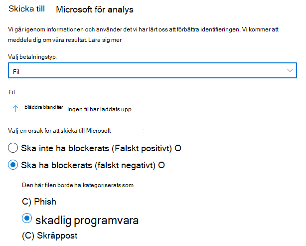
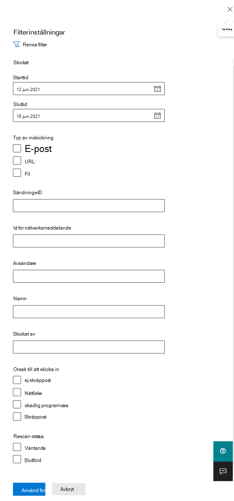
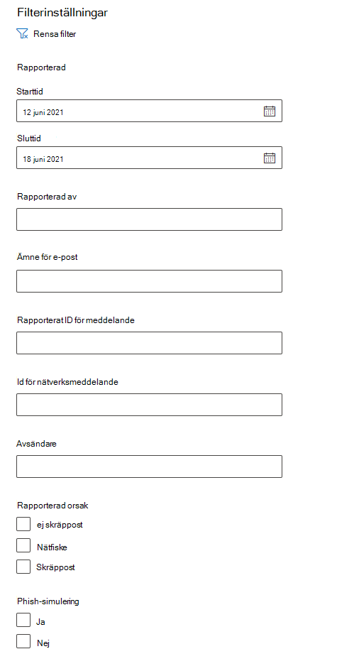
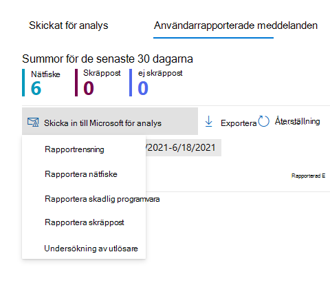

# Använd administrationsinskick för att skicka misstänkt skräppost, nättr ut, URL:er och filer till Microsoft

[!INCLUDE [Microsoft 365 Defender rebranding](../includes/microsoft-defender-for-office.md)]

**Gäller för**
- [Exchange Online Protection](exchange-online-protection-overview.md)
- [Microsoft Defender för Office 365 Abonnemang 1 och Abonnemang 2](defender-for-office-365.md)

I Microsoft 365 organisationer med Exchange Online postlådor kan administratörer använda portalen för inskickade material i Microsoft 365 Defender-portalen för att skicka e-postmeddelanden, URL-adresser och bifogade filer till Microsoft för genomsökning.

När du skickar ett e-postmeddelande får du:

- **Kontroll av e-postautentisering:** Information om e-postautentisering har godkänts eller misslyckats när den levererades.
- **Principträffar:** Information om principer som kan ha tillåtit eller blockerat inkommande e-post i klientorganisationen, åsidosätter våra tjänstfilters bedömningar.
- **Payload reputation/detonation**: Eng över alla URL:er och bifogade filer i meddelandet.
- **Gradersanalys:** Granska utförts av grader för att bekräfta om meddelanden är skadliga.

> [!IMPORTANT]
> Analys av berytning och gradering av nyttolast görs inte i alla klientorganisationen. Information blockeras från att gå utanför organisationen när data inte ska lämna klientorganisationsgränsen i efterlevnadssyfte.

Andra sätt att skicka e-postmeddelanden, URL:er och bifogade filer till Microsoft finns i [Rapportera meddelanden och filer till Microsoft.](report-junk-email-messages-to-microsoft.md)

## Vad behöver jag veta innan jag börjar?

- Du kan öppna Microsoft 365 Defender-portalen genom att gå till <https://security.microsoft.com/>. Använd för att gå **direkt till sidan** Inskickade <https://security.microsoft.com/reportsubmission> material.

- För att skicka meddelanden och filer till Microsoft måste du vara medlem i någon av följande rollgrupper:
  - **Organisationshantering** eller **säkerhetsläsare** i [Microsoft 365 Defender .](permissions-microsoft-365-security-center.md)
  - **Organisationshantering** i [Exchange Online](/Exchange/permissions-exo/permissions-exo#role-groups).

    Observera att medlemskap i den här rollgruppen krävs för att [visa användarinskick till den anpassade postlådan enligt](#view-user-submissions-to-microsoft) beskrivningen längre fram i den här artikeln.

- Mer information om hur användare kan skicka meddelanden och filer till Microsoft finns i [Rapportera meddelanden och filer till Microsoft.](report-junk-email-messages-to-microsoft.md)

## Rapportera misstänkt innehåll till Microsoft

1. I Microsoft 365 Defender går du till Skicka **e-& och** \> **samarbetsinskick.**

2. På sidan **Inskickade** kontrollerar du att fliken **Skickat** för analys är markerad och klickar sedan på Annonsikon  **analys.**

3. Använd den **utfäll plats för Skicka** till Microsoft för granskning som ser ut att skicka en bifogad fil med meddelande, URL eller e-post enligt beskrivningen i följande avsnitt.

### Skicka ett tveksamt e-postmeddelande till Microsoft

1. I rutan **Välj typ av inskickning** kontrollerar du att **E-post** är valt i listrutan.

2. Använd **något av följande alternativ i avsnittet Lägg till** nätverksmeddelande-ID eller ladda upp e-postfilen:
   - Lägg till **meddelande-ID** för e-postnätverket: Det här är ett GUID-värde som är tillgängligt i rubriken **X-MS-Exchange-Organization-Network-Message-Id** i meddelandet eller i rubriken **X-MS-Office365-Filtering-Correlation-Id** i meddelanden i karantän.
   - **Upload e-postfilen (.msg eller .eml)**: Klicka på **Bläddra bland filer.** Leta rätt på och välj .eml- eller .msg-filen i dialogrutan som öppnas och klicka sedan på **Öppna**.

   > [!NOTE]
   > Möjligheten att skicka meddelanden som gamla som 30 dagar har tillfälligt stängts av för Defender för Office 365 kunder. Administratörer kan bara gå tillbaka 7 dagar.

3. I rutan **Välj en mottagare som har ett problem** anger du den mottagare som du vill köra en principkontroll mot. Principkontrollen avgör om förbikoppling av e-post beror på användar- eller organisationsprinciper.

4. Välj **något av följande alternativ i avsnittet Välj** en orsak för att skicka till Microsoft:
   - **Bör inte ha blockerats (falskt positivt resultat)**
   - **Borde ha blockerats:**  I e-postmeddelandet ska ha kategoriserats som avsnitt som visas väljer du ett av följande värden (om du är osäker kan du använda bästa möjliga metod):
     - **Nätfiske**
     - **Skräppost**
     - **Skadlig programvara**

5. När du är klar klickar du på **skicka-knappen.**

> [!div class="mx-imgBorder"]
> 

### Skicka en misstänkt URL till Microsoft

1. I rutan **Välj överföringstyp** väljer du **URL** i listrutan.

2. I rutan **URL** som visas anger du den fullständiga webbadressen (till exempel `https://www.fabrikam.com/marketing.html` ).

3. Välj **något av följande alternativ i avsnittet Välj** en orsak för att skicka till Microsoft:
   - **Bör inte ha blockerats (falskt positivt resultat)**
   - **Borde ha blockerats:** I avsnittet Den **här url:en** borde ha kategoriserats som ett avsnitt som visas väljer du **Phish eller** **Malware**.

4. När du är klar klickar du på **skicka-knappen.**

> [!div class="mx-imgBorder"]
> 

### Skicka en misstänkt e-postbilaga till Microsoft

1. I rutan **Välj typ av inskickning** väljer **du Arkiv** i listrutan.

2. I avsnittet **Arkiv** som visas klickar du på **Bläddra bland filer**. Leta rätt på och markera filen i dialogrutan som öppnas och klicka sedan på **Öppna**.

3. Välj **något av följande alternativ i avsnittet Välj** en orsak för att skicka till Microsoft:
   - **Bör inte ha blockerats (falskt positivt resultat)**
   - **Borde ha blockerats:** I avsnittet Den här **webbadressen** borde  ha kategoriserats som visas är Skadlig programvara det enda alternativet och väljs automatiskt.

4. När du är klar klickar du på **skicka-knappen.**

> [!div class="mx-imgBorder"]
> 

## Visa administrationsinskick till Microsoft

1. I Microsoft 365 Defender går du till Skicka **e-& och** \> **samarbetsinskick.**

2. På sidan **Inlämnade uppgifter** kontrollerar du att fliken **Skickat för** analys är markerad.

   - Du kan sortera posterna genom att klicka på en tillgänglig kolumnrubrik. Klicka **på Anpassa** kolumner för att visa maximalt sju kolumner. Standardvärdena är markerade med en asterisk (\*):
     - **Namn på inskickat material**\*
     - **Avsändare**\*
     - **Skickat**\*
     - **Typ av inskickat material**\*
     - **Orsak till att skicka in**\*
     - **Rescan-status**\*
     - **Rescan-resultat**\*
     - **Filtrera bedömning**
     - **Leverans-/blockeringsorsak**
     - **Sändnings-ID**
     - **Id för nätverksmeddelande/objekt-ID**
     - **Riktning**
     - **Sender IP**
     - **BCL (Bulk compliant level)**
     - **Destination**
     - **Principåtgärd**
     - **Skickat av**

     När du är klar klickar du på **Använd**.

   - Om du vill filtrera posterna klickar du **på Filtrera**. Följande filter är tillgängliga:
     - **Skickat:** **Startdatum** **och Slutdatum**.
     - **Inskickingstyp:** **E-post, URL** eller **fil**. 
     - **Överförings-ID:** Ett GUID-värde som tilldelas till varje sändning.
     - **Id för nätverksmeddelande**
     - **Avsändare**

     När du är klar klickar du på **Använd**.

     > [!div class="mx-imgBorder"]
     > 

   - Om du vill gruppera posterna **klickar du** på Gruppera och väljer något av följande värden i listrutan:
     - **Ingen**
     - **Typ**
     - **Orsak**
     - **Status**
     - **Rescan-resultat**

   - Om du vill exportera posterna klickar du **på Exportera.** I dialogrutan som visas sparar du den .csv filen.

### Information om administratörsinskickning igen

Meddelanden som skickas i administratörsinskick granskas och resultaten visas i den utfällda utfällningen med information om inskickade inskickade meddelanden:

- Om avsändarens e-postautentisering misslyckades vid leveransen.
- Information om politiska träffar som kan ha påverkat eller åsidosatt bedömningen av ett meddelande.
- Aktuella detonationsresultat för att se om webbadresserna eller filerna i meddelandet var skadliga eller inte.
- Feedback från grader.

Om en åsidosättning hittades bör omskanningen slutföras på några minuter. Om det inte uppstod något problem i e-postautentisering eller -leverans påverkades inte av en åsidosättning, kan feedback från grader ta upp till en dag.

## Visa användarinskick till Microsoft

Om du har distribuerat tillägget Rapportmeddelande,  tillägget Rapportfiske eller om användarna använder den [inbyggda](report-junk-email-and-phishing-scams-in-outlook-on-the-web-eop.md)rapporteringen i Outlook på webben kan du se vad användarna rapporterar på meddelandefliken **Rapporterad** användare.

1. I Microsoft 365 Defender går du till Skicka **e-& och** \> **samarbetsinskick.**

2. På sidan **Inskickade** meddelanden väljer du **fliken Användarrapporterade** meddelanden.

   - Du kan sortera posterna genom att klicka på en tillgänglig kolumnrubrik. Klicka **på Anpassa** kolumner för att visa maximalt sju kolumner. Standardvärdena är markerade med en asterisk (\*):

     - **E-postämne**\*
     - **Rapporterad av**\*
     - **Rapporterad**\*
     - **Avsändare**\*
     - **Rapporterad orsak**\*
     - **Rescan-resultat**\*
     - **Rapporterat ID för meddelande**
     - **Id för nätverksmeddelande**
     - **Sender IP**
     - **Phish-simulering**

     När du är klar klickar du på **Använd**.

   - Om du vill filtrera posterna klickar du **på Filtrera**. Följande filter är tillgängliga:
     - **Rapporterat datum:** **Startdatum** **och slutdatum.**
     - **Rapporterad av**
     - **Ämne för e-post**
     - **Rapporterat ID för meddelande**
     - **Id för nätverksmeddelande**
     - **Avsändare**
     - **Rapporterad** orsak : **Inte skräppost,** **Phish** eller **Skräppost**.
     - **Phish simulering**: **Ja** eller **Nej**

     När du är klar klickar du på **Använd**.

     > [!div class="mx-imgBorder"]
     > 

   - Om du vill gruppera posterna **klickar du** på Gruppera och väljer något av följande värden i listrutan:
     - **Ingen**
     - **Orsak**
     - **Avsändare**
     - **Rapporterad av**
     - **Rescan-resultat**
     - **Phish-simulering**

   - Om du vill exportera posterna klickar du **på Exportera.** I dialogrutan som visas sparar du den .csv filen.

> [!NOTE]
> Om organisationer är konfigurerade att skicka endast användarrapporterade meddelanden till den anpassade postlådan  skickas inte rapporterade meddelanden för ny sökning och resultaten i Användarrapporterade meddelanden är alltid tomma.

### Ångra användarinskick

När en användare skickar ett misstänkt e-postmeddelande till den anpassade postlådan kan användaren och administratören inte ångra inskickat material. Om användaren vill återställa e-posten kan den återställas i mapparna Borttagna objekt eller Skräppost.

### Skicka meddelanden till Microsoft från den anpassade postlådan

Om du har konfigurerat den anpassade postlådan för att snappa upp användarrapporterade meddelanden utan att skicka meddelanden till Microsoft kan du hitta och skicka specifika meddelanden till Microsoft för analys. Då flyttas en användarinskickning till en administratörsinskickning.

På fliken **Användarrapporterade** meddelanden väljer du ett meddelande i listan, klickar på Skicka till **Microsoft** för analys och väljer sedan ett av följande värden i listrutan:

- **Rapportrensning**
- **Rapportera nätfiske**
- **Rapportera skadlig programvara**
- **Rapportera skräppost**
- **Undersökning av utlösare**

> [!div class="mx-imgBorder"]
> 
