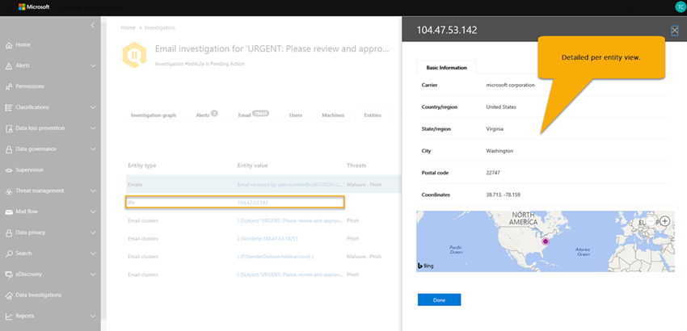

# Information och resultat av en automatiserad undersökning i Office 365

När en [automatiserad undersökning](office-365-air.md) inträffar i [Office 365 Advanced Threat Protection](office-365-atp.md)finns information om den undersökningen tillgänglig under och efter den automatiska granskningsprocessen. Om du har de behörigheter som krävs kan du visa dessa uppgifter i en undersökningsinformationsvy. Vyn Undersökningsinformation ger dig aktuell status och möjlighet att godkänna väntande åtgärder. 

## Visa detaljer om en undersökning

1. Gå [https://protection.office.com](https://protection.office.com) till och logga in. Detta tar dig till Security & Compliance Center.

2. Välj ett av följande alternativ:

    - Gå till**instrumentpanelen** **för hothantering** > . Detta tar dig till [säkerhetsinstrumentpanelen](security-dashboard.md). Air-widgetarna visas överst på [säkerhetsinstrumentpanelen](security-dashboard.md). Välj en widget, till exempel **Sammanfattning Av utredningar**.

    - Gå till **Hot management** > **Undersökningar**. 

    Båda metoderna tar dig till en lista över utredningar.

     

3. Välj ett objekt i **ID-kolumnen** i listan över undersökningar. Detta öppnar sidan för undersökningsinformation, med början i undersökningsdiagrammet i sikte.

    

   Använd de olika flikarna om du vill veta mer om undersökningen.

## Visa information om en avisering som är relaterad till en undersökning

Vissa typer av aviseringar utlöser automatisk undersökning i Office 365. Mer information finns i [Aviseringar](automated-investigation-response-office.md#alerts). Använd följande procedur för att visa information om en avisering som är associerad med en automatisk undersökning.

1. Gå [https://protection.office.com](https://protection.office.com) till och logga in. Detta tar dig till Security & Compliance Center.

2. Gå till **Hot management** > **Undersökningar**.

3. Välj ett objekt i **ID-kolumnen** i listan över undersökningar. 

4. När information om en undersökning är öppen väljer du fliken **Aviseringar.** Alla aviseringar som utlöste undersökningen listas här.

5. Markera ett objekt i listan. Ett utfällbart utfällbart material öppnas, med information om aviseringen och länkar till ytterligare information och åtgärder.

6. Granska informationen på utfällbara och, beroende på vilken avisering det gäller, vidta en åtgärd, till exempel **Lös,** **Undertryck eller** **Meddela användare**. 

    - **Lös** motsvarar att stänga en avisering
    
    - **Undertryck** orsakar att en princip inte utlöser aviseringar under en angiven tidsperiod
    
    - **Meddela användare** startar ett e-postmeddelande med användarnas e-postadresser som redan har angetts och gör det möjligt för säkerhetsoperationsteamet att skriva ett meddelande till dessa användare. (Det påminner om att skicka ett meddelande till mottagare med Hjälp av [Threat Explorer](threat-explorer.md).)  

## Så här använder du de olika flikarna

I följande avsnitt går du igenom de olika flikarna på den automatiska undersökningssidan och hur du kan använda informationen.

### Sida för automatiska utredningar

Den automatiska undersökningssidan visar organisationens undersökningar och deras aktuella tillstånd.

 
  
Du kan:
- Navigera direkt till en undersökning (välj ett **undersöknings-ID**).
- Använd filter. Välj mellan **undersökningstyp,** **Tidsintervall**, **Status**eller en kombination av dessa.
- Exportera data till en CSV-fil.

Undersökningsstatusen visar hur analysen och åtgärderna fortskrider. När undersökningen pågår ändras statusen för att ange om hot har hittats och om åtgärder har godkänts. 

|Status  |Vad det innebär  |
|---------|---------|
|Startar | Utredningen står i kö för att påbörjas inom kort |
|Kör | Utredningen har inletts och genomför sin analys |
|Inga hot hittades | Utredningen har avslutat sin analys och inga hot hittades |
|Avslutas av systemet | Utredningen lades inte ner och löpte ut efter 7 dagar |
|Väntande åtgärd | Undersökningen fann hot med åtgärder rekommenderas.  Undersökningen fortsätter att köras efter att den hittat initiala hot och rekommenderade åtgärder, så du bör kontrollera loggen innan du godkänner åtgärder för att se om analysatorer fortfarande pågår. |
|Hot hittades | Utredningen fann hot, men hoten har inte åtgärder tillgängliga inom AIR.  Det här är användaråtgärder där det inte finns någon riktning AIR-åtgärd ännu. |
|Åtgärdad | Undersökningen avslutades och åtgärdades helt (alla åtgärder godkändes) |
|Delvis åtgärdad | Undersökningen avslutades och några av de rekommenderade åtgärderna godkändes |
|Avslutad av användare | En administratör avslutade undersökningen |
|Misslyckades | Ett fel uppstod under undersökningen som hindrade den från att dra en slutsats om hot |
|Köade genom begränsning | Undersökningen väntar på analys på grund av begränsningar för systembearbetning (för att skydda tjänstens prestanda) |
|Avslutad med begränsning | Undersökningen kunde inte slutföras i tillräckligt god tid på grund av begränsningar av utredningsvolymen och systembearbetningen. Du kan återtrigga undersökningen genom att välja e-postmeddelandet i Explorer och välja åtgärden Undersök. |

### Undersökning diagram

När du öppnar en viss undersökning visas undersökningsdiagramsidan. På den här sidan visas alla olika entiteter: e-postmeddelanden, användare (och deras aktiviteter) och enheter som automatiskt undersöktes som en del av aviseringen som utlöstes.

Du kan:
- Få en visuell översikt över den aktuella undersökningen.
- Visa en sammanfattning av undersökningens varaktighet.
- Välj en nod i visualiseringen om du vill visa information om noden.
- Välj en flik överst om du vill visa information för den fliken.

### Utredning av varning

På fliken **Aviseringar** för en undersökning kan du se aviseringar som är relevanta för undersökningen. Information inkluderar den varning som utlöste undersökningen och andra korrelerade aviseringar, till exempel riskfylld inloggning, DLP-policyöverträdelser osv. Från den här sidan kan en säkerhetsanalytiker också visa ytterligare information om enskilda aviseringar.

Du kan:
- Få en visuell översikt över den aktuella utlösande aviseringen och eventuella associerade aviseringar.
- Välj en avisering i listan om du vill öppna en utfällningssida som visar fullständig aviseringsinformation.

### E-postundersökning

På fliken **E-post** för en undersökning kan du se de ursprungliga e-postmeddelandena och kluster av liknande e-postmeddelanden som identifierats som en del av undersökningen. 

Med tanke på den stora mängden e-post som användare i en organisation skickar och ta emot, plus flera användare av e-postkommunikation och attacker, processen för 
- kluster av e-postmeddelanden baserat på liknande attribut från ett meddelandehuvud, brödtext, URL och bifogade filer. 
- separera skadlig e-post från bra e-post; Och 
- vidta åtgärder för skadliga e-postmeddelanden 

kan ta lång tid. AIR automatiserar nu den här processen, vilket sparar organisationens säkerhetsteamtid och ansträngning. 

Två olika typer av e-postkluster kan identifieras under e-postanalyssteget: likhetskluster och indikatorkluster. 
- Likhetskluster är e-postmeddelanden som identifieras genom att jaga e-postmeddelanden med liknande avsändare och innehållsattribut. Dessa kluster utvärderas för skadligt innehåll baserat på de ursprungliga identifieringsresultaten. E-postkluster som innehåller tillräckligt många identifieringar av skadlig e-post anses vara skadliga.
- Indikatorkluster är e-postmeddelanden som identifieras genom att jaga samma indikatorentitet (filhage eller URL) från det ursprungliga e-postmeddelandet. När den ursprungliga filen/URL-entiteten identifieras som skadlig tillämpar AIR indikatorutlåtandet på hela klustret med e-postmeddelanden som innehåller den entiteten. En fil som identifieras som skadlig kod innebär att klustret av e-postmeddelanden som innehåller filen behandlas som e-postmeddelanden om skadlig kod.

Målet med klustring är att jaga och hitta andra relaterade e-postmeddelanden som skickas av samma avsändare som en del av en attack eller en kampanj.  I vissa fall kan legitim e-post utlösa en undersökning (t.ex. en användare rapporterar ett marknadsföringsmeddelande).  I dessa scenarier bör e-kluster identifiera att e-kluster inte är skadliga - när det på rätt sätt gör det, kommer det **inte** att indikera ett hot och inte heller kommer det att rekommendera borttagning av e-post.

**Fliken E-post** visar också e-postobjekt relaterade till undersökningen, till exempel användarrapporterade e-postuppgifter, det ursprungliga e-postmeddelandet rapporterade, e-postmeddelandena zappade på grund av skadlig kod / phish, etc.

Antalet e-postmeddelanden som identifieras på fliken E-post representerar för närvarande summan av alla e-postmeddelanden som visas på fliken **E-post.** Eftersom det finns e-postmeddelanden i flera kluster är det faktiska totala antalet e-postmeddelanden som identifierats (och påverkas av reparationsåtgärder) antalet unika e-postmeddelanden som finns i alla kluster och ursprungliga mottagares e-postmeddelanden. 

Både Explorer och AIR räknar e-postmeddelanden per mottagare, eftersom säkerhetsutlåtandena, åtgärderna och leveransplatserna varierar per mottagare. Således ett original e-postmeddelande som skickas till tre användare räknas som totalt tre e-postmeddelanden i stället för ett e-postmeddelande. Observera att det kan finnas fall där ett e-postmeddelande räknas två eller flera gånger, eftersom e-postmeddelandet kan ha flera åtgärder på den och det kan finnas flera kopior av e-postmeddelandet när alla åtgärder inträffar. Ett e-postmeddelande med skadlig kod som identifieras vid leverans kan till exempel resultera i både ett blockerat (i karantän) e-postmeddelande och ett ersatt e-postmeddelande (hotfil ersatt med en varningsfil och sedan levereras till användarens postlåda). Eftersom det finns bokstavligen två kopior av e-postmeddelandet i systemet, kan båda räknas i klusterantal. 

E-postantal beräknas vid tidpunkten för undersökningen och vissa antal beräknas om när du öppnar utfällbara undersökningsutfällbara enheter (baserat på en underliggande fråga). Antalet e-postmeddelanden som visas för e-postkluster på fliken e-post och värdet för e-postkvantitet som visas i utfällbara kluster beräknas vid tidpunkten för undersökningen och ändras inte. Antalet e-postmeddelanden som visas längst ned på e-postfliken i det utfällbara e-postklustret och antalet e-postmeddelanden som visas i Explorer återspeglar e-postmeddelanden som tagits emot efter undersökningens första analys. Således ett e-kluster som visar en ursprunglig mängd av 10 e-postmeddelanden skulle visa en e-postlista totalt 15 när ytterligare fem e-postmeddelanden anländer mellan undersökningen analysfasen och när admin granskar undersökningen.  Likaså gamla undersökningar kan börja ha större antal än Explorer frågor visar, eftersom ATP P2 löper ut data efter 7 dagar för prövningar och 30 dagar för betalda licenser.  Visar både antal historiska och aktuella räknas i olika vyer görs för att ange e-effekten vid tidpunkten för undersökningen och den aktuella effekten fram till den tidpunkt då reparationen körs.

Tänk till exempel på följande scenario. Det första klustret med tre e-postmeddelanden ansågs vara phish. Ett annat kluster av liknande meddelanden med samma IP och ämne hittades och ansågs skadliga, eftersom vissa av dem identifierades som phish under inledande identifiering. 

Du kan:
- Få en visuell översikt över de aktuella klusterresultaten och hoten som hittats.
- Klicka på en klusterentitet eller en hotlista för att öppna en utfällningssida som visar fullständig aviseringsinformation.
- Ytterligare undersöka e-kluster genom att klicka på "Öppna i Explorer" länken högst upp på fliken "E-klusterinformation"

> [!NOTE]
> I samband med e-post kan du se en volym avvikelse hot yta som en del av undersökningen. En volymavvikelse indikerar en ökning av liknande e-postmeddelanden runt händelsetiden jämfört med tidigare tidsramar. Denna topp i e-posttrafik med liknande egenskaper (t.ex. ämne och avsändare domän, kroppslikhet och avsändare IP) är typiskt för början av e-postkampanjer eller attacker. Mass-, skräppost- och legitima e-postkampanjer delar dock ofta dessa egenskaper. Volymavvikelser utgör ett potentiellt hot, och kan därför vara mindre allvarliga jämfört med skadlig kod eller phish hot som identifieras med hjälp av anti-virus motorer, detonation eller skadligt rykte.

### Användarundersökning

På fliken **Användare** kan du se alla användare som identifierats som en del av undersökningen. Användarkonton visas i undersökningen när det finns en händelse eller en indikation på att dessa användarkonton kan påverkas eller komprometteras.

I följande bild har AIR till exempel identifierat indikatorer på kompromettering och avvikelser baserat på en ny inkorgsregel som skapades. Ytterligare information (bevis) för undersökningen är tillgängliga via detaljerade vyer på den här fliken. [Microsoft Cloud App Security](https://docs.microsoft.com/cloud-app-security)

Du kan:
- Få en visuell översikt över identifierade användarresultat och risker som hittats.
- Välj en användare om du vill öppna en utfällningssida som visar fullständig aviseringsinformation.

### Maskinundersökning

På fliken **Maskiner** kan du se alla maskiner som identifierats som en del av undersökningen. 

Som en del av vissa spelböcker korrelerar AIR e-posthot mot enheter (t.ex. zapped malware). En undersökning skickar till exempel en skadlig filh hash till [Microsoft Defender ATP](https://docs.microsoft.com/windows/security/threat-protection/microsoft-defender-atp/microsoft-defender-advanced-threat-protection
) för att undersöka. Detta möjliggör automatisk undersökning av relevanta datorer för dina användare, för att säkerställa att hot åtgärdas både i molnet och över dina slutpunkter. 

Du kan:
- Få en visuell översikt över de aktuella datorerna och hoten som hittats.
- Välj en dator för att öppna en vy som finns i relaterade [Microsoft Defender ATP-undersökningar](https://docs.microsoft.com/windows/security/threat-protection/microsoft-defender-atp/automated-investigations) i Microsoft Defender Security Center.

### Undersökning av entitet

På fliken **Entiteter** kan du se de entiteter som identifierats och analyserats som en del av undersökningen. 

Här kan du se de undersökta entiteterna och information om vilka typer av entiteter som skickas, till exempel e-postmeddelanden, kluster, IP-adresser, användare med mera. Du kan också se hur många entiteter som analyserades och vilka hot som var associerade med var och en. 

Du kan:
- Få en visuell översikt över de undersökningsenheter och hot som hittats.
- Välj en entitet om du vill öppna en utfällningssida som visar information om den relaterade entiteten.

### Playbook-logg

På fliken **Logga** kan du se alla spelbokssteg som har inträffat under undersökningen. Loggen samlar in en fullständig inventering av alla analysatorer och åtgärder som slutförts av office 365 automatisk undersökningsfunktioner som en del av AIR. Det ger en tydlig bild av alla åtgärder som vidtagits, inklusive själva åtgärden, en beskrivning och varaktigheten av den faktiska från början till. 

Du kan:
- Få en visuell översikt över de steg i spelboken som tagits.
- Exportera resultaten till en CSV-fil.
- Filtrera vyn.

|Analyzer | Beskrivning |
|-----|-----|
|DLP brott utredning |Undersöka eventuella överträdelser som upptäckts av [Office 365 Data Loss Prevention](../../compliance/data-loss-prevention-policies.md) (DLP) |
|E-postindikatorer extrahering |Extrahera indikatorer från sidhuvudet, brödtexten och innehållet i ett e-postmeddelande för undersökning |
|Rykte för fil hash |Identifiera avvikelser baserat på filhÃers för användare och datorer i organisationen |
|Identifiering av e-postkluster |Analys av e-postkluster baserat på rubrik, brödtext, innehåll och webbadresser |
|Volymanalys för e-postkluster |Analys av e-postkluster baserat på utgående volymmönster för e-postflöde |
|Undersökning av postdelegering |Undersöka åtkomst till e-postdelegering för användarpostlådor relaterade till den här undersökningen |
|Undersökning av regler för vidarebefordran av e-post |Undersök eventuella regler för vidarebefordran av e-post för användarpostlådor relaterade till den här undersökningen |
|Missad skadlig kod har upptäckts |Identifiera saknad skadlig kod som levereras till användarens postlåda i organisationen |
|Detonation på begäran |Detonation på begäran utlöses för e-postmeddelanden, bilagor och webbadresser |
|Undersökning av avvikande e-post |Identifiera avvikelser baserat på historiska e-postflödessändningsmönster för användare i organisationen |
|Utgående skadlig kod och spam anomali undersökning |Identifiera skadlig kod inom och utanför organisationen, phish eller skräppost från användare i organisationen |
|Undersökning av avsändares domän |On-demand kontroll av domän rykte från [Microsoft Intelligent Security Graph](https://www.microsoft.com/security/operations/intelligence) och externa källor hot intelligens |
|Ip-undersökning av avsändare | On-demand kontroll av IP rykte från [Microsoft Intelligent Security Graph](https://www.microsoft.com/security/operations/intelligence) och externa källor hot intelligens |
|Url-klick | Undersök klick från användare som skyddas av [Office 365 ATP Safe Links](atp-safe-links.md) i organisationen |
|Undersökning av URL-rykte |On-demand check on URL rykte från [Microsoft Intelligent Security Graph](https://www.microsoft.com/security/operations/intelligence) och externa källor hot intelligens |
|Undersökning av användaraktivitet |Analysera avvikelser i användaraktivitet i [Microsoft Cloud App Security](https://docs.microsoft.com/cloud-app-security/what-is-cloud-app-security) |
|Användarrapporterad e-post indikatorer utvinning |Extrahera indikatorer från sidhuvudet, brödtexten och innehållet i [användarrapporterad e-post](enable-the-report-message-add-in.md) för undersökning |

### Rekommenderade åtgärder

På fliken **Åtgärder** kan du se alla spelboksåtgärder som rekommenderas för reparation när undersökningen har slutförts. 

Åtgärder samlar in de steg som Microsoft rekommenderar att du vidtar i slutet av en undersökning. Du kan vidta åtgärder för reparation här genom att välja en eller flera åtgärder. Om du klickar på **Godkänn** kan reparationen påbörjas. (Lämpliga behörigheter behövs - rollen Sök och rensa krävs för att köra åtgärder från Explorer och AIR). En säkerhetsläsare kan till exempel visa åtgärder men inte godkänna dem. Du behöver inte godkänna alla åtgärder. Om du inte samtycker till den rekommenderade åtgärden eller om din organisation inte väljer vissa typer av åtgärder kan du välja att **avvisa** åtgärderna eller helt enkelt ignorera dem och inte vidta några åtgärder. Om du godkänner och/eller avvisar alla åtgärder kan undersökningen avslutas helt (statusen åtgärdas), samtidigt som vissa åtgärder lämnas ofullständiga resultat i att undersökningsstatusen ändras till ett delvis åtgärdat tillstånd.

Du kan:
- Få en visuell översikt över de åtgärder som rekommenderas av spelboken.
- Välj en enskild åtgärd eller flera åtgärder.
- Godkänna eller avvisa rekommenderade åtgärder med kommentarer.
- Exportera resultaten till en CSV-fil.
- Filtrera vyn.

## Nästa steg

- [Granska och godkänna väntande åtgärder](https://review.docs.microsoft.com/microsoft-365/security/office-365-security/air-review-approve-pending-completed-actions)

- [Läs mer om automatisk undersökning och svar i Microsoft Threat Protection](https://docs.microsoft.com/microsoft-365/security/mtp/mtp-autoir)
