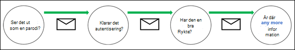
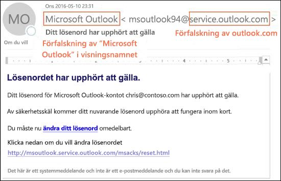
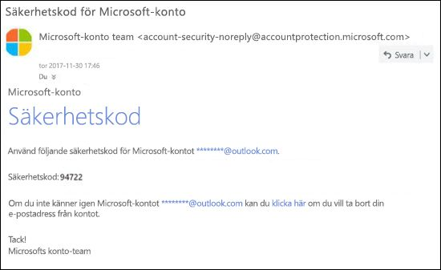

# Skydd mot förfalskning i EOPAnti-spoofing protection in EOP

För Microsoft 365-organisationer med postlådor i Exchange Online eller fristående Exchange Online Protection (EOP)-organisationer utan Exchange Online-postlådor, ingår det funktioner i EOP som hjälper till att skydda organisationen mot falska (förfalskade) avsändare.In Microsoft 365 organizations with mailboxes in Exchange Online or standalone Exchange Online Protection (EOP) organizations without Exchange Online mailboxes, EOP includes features to help protect your organization from spoofed (forged) senders.

När det gäller att skydda sina användare tar Microsoft hot om nätfiske på allvar.When it comes to protecting its users, Microsoft takes the threat of phishing seriously. Förfalskning är en vanlig teknik som används av angripare.Spoofing is a common technique that's used by attackers. **Falska meddelanden ser ut att komma från en person eller plats som inte är den verkliga källan**.**Spoofed messages appear to originate from someone or somewhere other than the actual source**. Metoden används ofta i nätfiskekampanjer som är utformade för att få tag på användaruppgifter.This technique is often used in phishing campaigns that are designed to obtain user credentials. Metoden för förfalskningsskydd i EOP undersöker särskilt förfalskningar av Från-rubriken i meddelandetexten (används för att visa meddelandets avsändare i e-postklienter).The anti-spoofing technology in EOP specifically examines forgery of the From header in the message body (used to display the message sender in email clients). När EOP är övertygat om att huvudraden Från är förfalskad identifieras meddelandet som förfalskat.When EOP has high confidence that the From header is forged, the message is identified as spoofed.

Här följer de förfalskningsskyddsmetoder som finns tillgängliga i EOP:The following anti-spoofing technologies are available in EOP:

- **Förfalskningsinformation**: granska falska meddelanden från avsändare i interna och externa domäner samt tillåt eller blockera avsändarna.**Spoof intelligence**: Review spoofed messages from senders in internal and external domains, and allow or block those senders. Mer information finns i [Konfigurera förfalskningsinformation i Microsoft 365](learn-about-spoof-intelligence.md).For more information, see [Configure spoof intelligence in Microsoft 365](learn-about-spoof-intelligence.md).

- **Principer för skydd mot nätfiske**: Med principen för skydd mot nätfiske i EOP kan du aktivera eller inaktivera förfalskningsinformation, aktivera eller inaktivera icke autentiserad avsändarinformation i Outlook samt ange åtgärder för blockerade falska avsändare (placera i skräppostmappen eller i karantän).**Anti-phishing policies**: In EOP, anti-phishing policies allow you to turn spoof intelligence on or off, turn unauthenticated sender identification in Outlook on or off, and specify the action for blocked spoofed senders (move to the Junk Email folder or quarantine). Avancerade principer för skydd mot nätfiske som är tillgängliga i Office 365 Avancerat skydd (Office 365 ATP) innehåller även inställningar för skydd mot obehörig personifiering (skyddade avsändare och domäner), inställningar för postlådeinformation och avancerade justerbara nätfisketrösklar.Advanced anti-phishing policies that are available in Office 365 Advanced Threat Protection (Office 365 ATP) also contain anti-impersonation settings (protected senders and domains), mailbox intelligence settings, and adjustable advanced phishing thresholds. Mer information finns i [Principer för skydd mot nätfiske i Microsoft 365](set-up-anti-phishing-policies.md).For more information, see [Anti-phishing policies in Microsoft 365](set-up-anti-phishing-policies.md).

- **E-postautentisering**: en integrerad del av allt förfalskningsskydd är användningen av e-postautentisering (även kallat e-postverifiering) genom SPF-, DKIM- och DMARC-poster i DNS.**Email authentication**: An integral part of any anti-spoofing effort is the use of email authentication (also known as email validation) by SPF, DKIM, and DMARC records in DNS. Du kan konfigurera dessa poster för dina domäner så att mål-e-postsystemen kan kontrollera giltigheten i meddelanden som gör anspråk på att komma från avsändare i dina domäner.You can configure these records for your domains so destination email systems can check the validity of messages that claim to be from senders in your domains. För inkommande meddelanden kräver Microsoft 365 autentisering av e-post för avsändardomäner.For inbound messages, Microsoft 365 requires email authentication for sender domains. Mer information finns i [E-postautentisering i Microsoft 365](email-validation-and-authentication.md).For more information, see [Email authentication in Microsoft 365](email-validation-and-authentication.md).

Från och med oktober 2018 är skydd mot förfalskning tillgängligt i EOP.As of October 2018, anti-spoofing protection is available in EOP. Dessförinnan fanns skydd mot förfalskning endast tillgängligt i organisationer med Office 365 ATP.Before then, anti-spoofing protection was only available in organizatons with Office 365 ATP.

EOP analyserar och blockerar meddelanden som inte kan autentiseras med kombinationen av standardmetoder för e-postautentisering och metoder för avsändaromdöme.EOP analyzes and blocks messages that can't be authenticated by the combination of standard email authentication methods and sender reputation techniques.

## Hur förfalskning används i nätfiskeattackerHow spoofing is used in phishing attacks

Förfalskade meddelanden har följande två negativa konsekvenser för användare:Spoofing messages have the following negative implications for users:

- **Falska meddelanden lurar användare**: Ett falskt meddelande kan lura en användare att klicka på en länk och lämna ut sina autentiseringsuppgifter, ladda ned skadlig kod eller svara på ett meddelande med känsligt innehåll (även kallat för business email compromise (BEC) – kompromettering av företags-e-post).**Spoofed messages deceive users**: A spoofed message might trick the recipient into clicking a link and giving up their credentials, downloading malware, or replying to a message with sensitive content (known as a business email compromise or BEC).

  Följande är ett exempel på ett nätfiskemeddelande med den falska avsändaren msoutlook94@service.outlook.com:The following message is an example of phishing that uses the spoofed sender msoutlook94@service.outlook.com:

  

  Det här meddelandet kom inte från service.outlook.com, men rubrikfältet **Från** förfalskades så att det ger intryck av att göra det.This message didn't come from service.outlook.com, but the attacker spoofed the **From** header field to make it look like it did. Det här var ett försök att lura mottagaren att klicka på **Ändra lösenords**-länken och uppge sina autentiseringsuppgifter.This was an attempt to trick the recipient into clicking the **change your password** link and giving up their credentials.

  Följande meddelande är ett exempel på BEC (business email compromise) som använder den falska e-postdomänen contoso.com:The following message is an example of BEC that uses the spoofed email domain contoso.com:

  

  Meddelandet ser äkta ut men avsändaren är i själva verket falsk.The message looks legitimate, but the sender is spoofed.

- **Användare förväxlar riktiga meddelanden med falska**: även användare som känner till nätfiske kan ha svårt att se skillnaderna mellan riktiga och falska meddelanden.**Users confuse real messages for fake ones**: Even users who know about phishing might have difficulty seeing the differences between real messages and spoofed messages.

  Följande meddelande är ett exempel på en faktisk lösenordsåterställning från Microsofts säkerhetskonto:The following message is an example of a real password reset message from the Microsoft Security account:

  

  Meddelandet kom faktiskt från Microsoft, men användarna har lärt sig att vara misstänksamma.The message really did come from Microsoft, but users have been conditioned to be suspicious. Det är nämligen svårt att se skillnad på en riktig och en falsk lösenordsåterställning, många användare ignorerar dessa meddelanden, rapporterar dem som skräppost eller rapporterar dem i onödan till Microsoft som nätfiskebedrägerier.Because it's difficult to the difference between a real password reset message and a fake one, users might ignore the message, report it as spam, or unnecessarily report the message to Microsoft as phishing.

## Olika typer av förfalskningDifferent types of spoofing

Microsoft skiljer mellan två olika typer av falska meddelanden:Microsoft differentiates between two different types of spoofed messages:

- **Förfalskning inom organisationen (“intra-org”)**: kallas även för _“self-to-self”_-förfalskning.**Intra-org spoofing**: Also known as _self-to-self_ spoofing. Till exempel:For example:

  - Avsändaren och mottagaren finns i samma domän:The sender and recipient are in the same domain:
    > Från: chris@contoso.comFrom: chris@contoso.com   Till: michelle@contoso.comTo: michelle@contoso.com

  - Avsändaren och mottagaren finns i underdomäner till samma domän:The sender and the recipient are in subdomains of the same domain:
    > Från: laura@marketing.fabrikam.comFrom: laura@marketing.fabrikam.com   Till: julia@engineering.fabrikam.comTo: julia@engineering.fabrikam.com

  - Avsändaren och mottagaren finns i olika domäner som tillhör samma organisation (d.v.s. båda domänerna är konfigurerade som [godkända domäner](https://docs.microsoft.com/exchange/mail-flow-best-practices/manage-accepted-domains/manage-accepted-domains) i samma organisation):The sender and recipient are in different domains that belong to the same organization (that is, both domains are configured as [accepted domains](https://docs.microsoft.com/exchange/mail-flow-best-practices/manage-accepted-domains/manage-accepted-domains) in the same organization):
    > Från: avsändare @ microsoft.comFrom: sender @ microsoft.com   Till: mottagare @ bing.comTo: recipient @ bing.com

    Mellanslag används i e-postadresserna för att förhindra spambot-insamling.Spaces are used in the email addresses to prevent spambot harvesting.

  Meddelanden som inte klarar [sammansatt autentisering](email-validation-and-authentication.md#composite-authentication) på grund av förfalskning inom organisationen innehåller följande värden i meddelandehuvudet:Messages that fail [composite authentication](email-validation-and-authentication.md#composite-authentication) due to intra-org spoofing contain the following header values:

  `Authentication-Results: ... compauth=fail reason=6xx`

  `X-Forefront-Antispam-Report: ...CAT:SPOOF;...SFTY:9.11`

  - `reason=6xx` tyder på förfalskning inom organisationen.`reason=6xx` indicates intra-org spoofing.

  - SFTY är meddelandets säkerhetsnivå.SFTY is the safety level of the message. 9 anger nätfiske, .11 anger förfalskning inom organisationen.9 indicates phishing, .11 indicates intra-org spoofing.

- **Förfalskningar mellan domäner**: avsändarens och mottagarens domäner skiljer sig åt och har ingen relation sinsemellan (kallas även externa domäner).**Cross-domain spoofing**: The sender and recipient domains are different, and have no relationship to each other (also known as external domains). Till exempel:For example:
    > Från: chris@contoso.comFrom: chris@contoso.com   Till: michelle@tailspintoys.comTo: michelle@tailspintoys.com

  Meddelanden som inte klarar [sammansatt autentisering](email-validation-and-authentication.md#composite-authentication) på grund av förfalskning mellan domäner innehåller följande värden i meddelandehuvudet:Messages that fail [composite authentication](email-validation-and-authentication.md#composite-authentication) due to cross-domain spoofing contain the following headers values:

  `Authentication-Results: ... compauth=fail reason=000/001`

  `X-Forefront-Antispam-Report: ...CAT:SPOOF;...SFTY:9.22`

  - `reason=000` betyder att meddelandet inte har klarat explicit e-postautentisering.`reason=000` indicates the message failed explicit email authentication. `reason=001` betyder att meddelandet inte har klarat implicit e-postautentisering.`reason=001` indicates the message failed implicit email authentication.

  - SFTY är meddelandets säkerhetsnivå.SFTY is the safety level of the message. 9 anger nätfiske, .22 anger förfalskning mellan domäner.9 indicates phishing, .22 indicates cross-domain spoofing.

Mer information om värdena för kategori och sammansatt autentisering (compauth) som är relaterade till förfalskning finns i [Meddelandehuvuden för antiskräppost i Microsoft 365](anti-spam-message-headers.md).For more information about the Category and composite authentication (compauth) values that are related to spoofing, see [Anti-spam message headers in Microsoft 365](anti-spam-message-headers.md).

Mer information om DMARC finns i [Använda DMARC för att validera e-post i Microsoft 365](use-dmarc-to-validate-email.md).For more information about DMARC, see [Use DMARC to validate email in Microsoft 365](use-dmarc-to-validate-email.md).

## Rapporter på hur många meddelanden som har markerats som falskaReports of how many messages were marked as spoofed

EOP-organisationer kan använda **falska identifieringar** rapporter i instrument panelen rapporter i säkerhets och efterlevnadscenter.EOP organizations can use the **Spoof detections** report in the Reports dashboard in the Security & Compliance Center. Mer information finns i [Rapport om falska identifieringar](view-email-security-reports.md#spoof-detections-report).For more information, see [Spoof Detections report](view-email-security-reports.md#spoof-detections-report).

Office 365 ATP-organisationen kan använda Hotutforskaren i Säkerhets- och efterlevnadscenter för att visa information om nätfiskeförsök.Office 365 ATP organization can use Threat Explorer in the Security & Compliance Center to view information about phishing attempts. Mer information finns i [Undersökning av hot och svar i Microsoft 365](office-365-ti.md).For more information, see [Microsoft 365 threat investigation and response](office-365-ti.md).

## Problem med förfalskningsskyddProblems with anti-spoofing protection

E-postlistor (även kallade diskussionslistor) är kända för att ha problem med förfalskning på grund av det sätt de vidarebefordrar meddelanden och ändrar innehållet i dem.Mailing lists (also known as discussion lists) are known to have problems with anti-spoofing due to the way they forward and modify messages.

Anta till exempel att Gabriela Laureano (glaureano@contoso.com) är intresserad av fågelskådning och går med i diskussionslistan fagelskadare@fabrikam.com. och skickar följande meddelande till listan:For example, Gabriela Laureano (glaureano@contoso.com) is interested in bird watching, joins the mailing list birdwatchers@fabrikam.com, and sends the following message to the list:

> **From:** "Gabriela Laureano" \<glaureano@contoso.com\>**From:** "Gabriela Laureano" \<glaureano@contoso.com\>   **Till:** Birdwatcherens diskussions lista \<birdwatchers@fabrikam.com\>**To:** Birdwatcher's Discussion List \<birdwatchers@fabrikam.com\>   \
\**Ämne:\** Fantastiska bilder av blåskrika på Mt. \
\**Subject:\** Great viewing of blue jays at the top of Mt. Rainier denna veckaRainier this week   Vem vill kolla in denna veckas bilder från Mt.Anyone want to check out the viewing this week from Mt. Rainier?Rainier?

E-postlistans server tar emot meddelandet, ändrar innehållet och skickar tillbaka det till medlemmarna i listan.The mailing list server receives the message, modifies its content, and replays it to the members of list. Det återgivna meddelandet har samma Från:-adress (glaureano@contoso.com) men en tagg har lagts till i ämnesraden och en sidfot har lagts till längst ned i meddelandet.The replayed message has the same From address (glaureano@contoso.com), but a tag is added to the subject line, and a footer is added to the bottom of the message. Den här typen av ändringar är vanliga i distributionslistor och kan leda till falska positiva identifieringar av förfalskning.This type of modification is common in mailing lists, and may result in false positives for spoofing.

> **From:** "Gabriela Laureano" \<glaureano@contoso.com\>**From:** "Gabriela Laureano" \<glaureano@contoso.com\>   **Till:** Birdwatcherens diskussions lista \<birdwatchers@fabrikam.com\>**To:** Birdwatcher's Discussion List \<birdwatchers@fabrikam.com\>   **Ämne:** [FÅGELSKÅDARE] Fantastiska bilder av blåskrika på Mt.**Subject:** [BIRDWATCHERS] Great viewing of blue jays at the top of Mt. Rainier denna veckaRainier this week    Vem vill kolla in denna veckas bilder från Mt.Anyone want to check out the viewing this week from Mt. Rainier?Rainier?    Meddelandet skickades till diskussionslistan Fågelskådare.This message was sent to the Birdwatchers Discussion List. Du kan avbryta prenumerationen när du vill.You can unsubscribe at any time.

Om du vill se till att e-post från distributionslistor klarar förfalskningskontroller, följer du dessa anvisningar beroende på om du har kontroll över distributionslistan:To help mailing list messages pass anti-spoofing checks, do following steps based on whether you control the mailing list:

- Din organisation äger distributionslistan:Your organization owns the mailing list:

  - Ta en titt på vanliga frågor och svar på DMARC.org: [I operate a mailing list and I want to interoperate with DMARC, what should I do?](https://dmarc.org/wiki/FAQ#I_operate_a_mailing_list_and_I_want_to_interoperate_with_DMARC.2C_what_should_I_do.3F) (Jag driver en distributionslista och vill samverka med DMARC, vad ska jag göra?).Check the FAQ at DMARC.org: [I operate a mailing list and I want to interoperate with DMARC, what should I do?](https://dmarc.org/wiki/FAQ#I_operate_a_mailing_list_and_I_want_to_interoperate_with_DMARC.2C_what_should_I_do.3F).

  - Läs anvisningarna i det här blogginlägget: [A tip for mailing list operators to interoperate with DMARC to avoid failures](https://blogs.msdn.microsoft.com/tzink/2017/03/22/a-tip-for-mailing-list-operators-to-interoperate-with-dmarc-to-avoid-failures/) (Ett tips för dem som driver distributionslistor att samverka med DMARC för att undvika fel).Read the instructions at this blog post: [A tip for mailing list operators to interoperate with DMARC to avoid failures](https://blogs.msdn.microsoft.com/tzink/2017/03/22/a-tip-for-mailing-list-operators-to-interoperate-with-dmarc-to-avoid-failures/).

  - Överväg att installera uppdateringar på distributionslistans server som stöder ARC, se [https://arc-spec.org](https://arc-spec.org/)Consider installing updates on your mailing list server to support ARC, see [https://arc-spec.org](https://arc-spec.org/)

- Din organisation äger inte distributionslistan:Your organization doesn't own the mailing list:

  - Be personen som hanterar distributionslistan att konfigurera e-postautentisering för den domän som distributionslistan vidarebefordras från.Ask the maintainer of the mailing list to configure email authentication for the domain that the mailing list is relaying from.

    När tillräckligt många avsändare svarar tillbaka till domänägare om att de bör konfigurera poster för e-postautentisering motiveras de att vidta åtgärder.When enough senders reply back to domain owners that they should set up email authentication records, it spurs them into taking action. Microsoft samarbetar också med domänägare i att publicera de nödvändiga posterna men det hjälper ännu mer när enskilda användare begär det.While Microsoft also works with domain owners to publish the required records, it helps even more when individual users request it.

  - Du kan skapa regler för Inkorgen i e-postklienten för att flytta meddelanden till Inkorgen.Create inbox rules in your email client to move messages to the Inbox. Du kan också be administratörerna att konfigurera åsidosättningar som beskrivs i [Använda förfalskningsinformation för att konfigurera tillåtna avsändare av icke autentiserad e-post](email-validation-and-authentication.md#use-spoof-intelligence-to-configure-permitted-senders-of-unauthenticated-email).You can also ask your admins to configure overrides as discussed in the [Use spoof intelligence to configure permitted senders of unauthenticated email](email-validation-and-authentication.md#use-spoof-intelligence-to-configure-permitted-senders-of-unauthenticated-email).

  - Du kan skapa ett supportärende med Microsoft 365 för att skapa en åsidosättning för distributionslistan för att behandla den som legitim.Create a support ticket with Microsoft 365 to create an override for the mailing list to treat it as legitimate. Mer information finns i [Kontakta supporten för företagsprodukter – hjälp för administratörer](../../admin/contact-support-for-business-products.md).For more information, see [Contact support for business products - Admin Help](../../admin/contact-support-for-business-products.md).

Om ingenting annat fungerar kan du rapportera meddelandet som en falsk positiv identifiering till Microsoft.If all else fails, you can report the message as a false positive to Microsoft. Mer informations finns i [Anmäla meddelanden och filer till Microsoft](report-junk-email-messages-to-microsoft.md).For more information, see [Report messages and files to Microsoft](report-junk-email-messages-to-microsoft.md).

Du kan också kontakta din administratör som kan skapa ett supportärende hos Microsoft.You may also contact your admin who can raise it as a support ticket with Microsoft. Microsofts tekniska team undersöker varför meddelandet har markerats som förfalskning.The Microsoft engineering team will investigate why the message was marked as a spoof.

## Överväganden för skydd mot förfalskningConsiderations for anti-spoofing protection

Om du är en administratör som för närvarande skickar meddelanden till Microsoft 365 måste du se till att e-postmeddelandet autentiseras på rätt sätt.If you're an admin who currently sends messages to Microsoft 365, you need to ensure that your email is properly authenticated. Annars kan det markeras som skräppost eller nätfiske.Otherwise, it might be marked as spam or phish. Mer information finns i [Lösningar för legitima avsändare som skickar icke autentiserad e-post](email-validation-and-authentication.md#solutions-for-legitimate-senders-who-are-sending-unauthenticated-email).For more information, see [Solutions for legitimate senders who are sending unauthenticated email](email-validation-and-authentication.md#solutions-for-legitimate-senders-who-are-sending-unauthenticated-email).