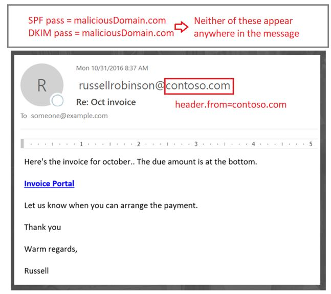
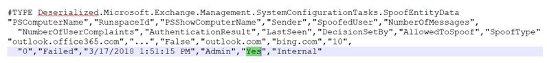
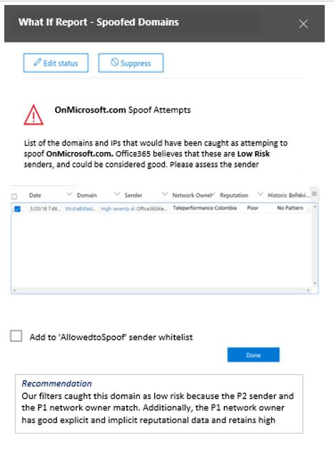

# <a name="anti-spoofing-protection-in-office-365"></a><span data-ttu-id="82626-105">Skydd mot förfalskning i Office 365</span><span class="sxs-lookup"><span data-stu-id="82626-105">Anti-spoofing protection in Office 365</span></span>

<span data-ttu-id="82626-106">I den här artikeln beskrivs hur Office 365 minimerar nätfiskeattacker som använder förfalskade avsändardomäner.</span><span class="sxs-lookup"><span data-stu-id="82626-106">This article describes how Office 365 mitigates against phishing attacks that use forged sender domains, that is, domains that are spoofed.</span></span> <span data-ttu-id="82626-107">Det uppnås genom att analyser av meddelanden och blockera sådana som inte kan autentiseras med standardmetoder för e-postautentisering eller med andra metoder för avsändaromdöme.</span><span class="sxs-lookup"><span data-stu-id="82626-107">It accomplishes this by analyzing the messages and blocking the ones that cannot be authenticated using standard email authentication methods, nor other sender reputation techniques.</span></span> <span data-ttu-id="82626-108">Den här ändringen har implementerats för att minska antalet nätfiskeattacker som organisationer i Office 365 exponeras för.</span><span class="sxs-lookup"><span data-stu-id="82626-108">This change was implemented to reduce the number of phishing attacks to which organizations in Office 365 are exposed.</span></span>

<span data-ttu-id="82626-109">I den här artikeln förklaras även varför den här ändringen görs, hur kunder kan förbereda sig för den här ändringen, hur du visar meddelanden som kommer att påverkas, hur du rapporterar meddelanden, hur du kan begränsa falska positiva identifieringar samt hur avsändare till Microsoft förbereder den här ändringen.</span><span class="sxs-lookup"><span data-stu-id="82626-109">This article also describes why this change is being made, how customers can prepare for this change, how to view messages that will be affected, how to report on messages, how to mitigate false positives, as well as how senders to Microsoft should prepare for this change.</span></span>

<span data-ttu-id="82626-110">Microsofts skydd mot förfalskning installerades ursprungligen i organisationer med en Office 365 Enterprise E5-prenumeration eller har köpt tillägget Office 365 avancerat hotskydd (ATP) för prenumerationen.</span><span class="sxs-lookup"><span data-stu-id="82626-110">Microsoft's anti-spoofing technology was initially deployed to its organizations that had an Office 365 Enterprise E5 subscription or had purchased the Office 365 Advanced Threat Protection (ATP) add-on for their subscription.</span></span> <span data-ttu-id="82626-111">Från och med oktober 2018 utökade vi skyddet även till organisationer som har Exchange Online Protection (EOP).</span><span class="sxs-lookup"><span data-stu-id="82626-111">As of October, 2018 we extended the protection to organizations that have Exchange Online Protection (EOP) as well.</span></span> <span data-ttu-id="82626-112">På grund av sättet som alla våra filter lär sig från varandra kan även Outlook.com användare påverkas.</span><span class="sxs-lookup"><span data-stu-id="82626-112">Additionally, because of the way all of our filters learn from each other, Outlook.com users may also be affected.</span></span>

## <a name="how-spoofing-is-used-in-phishing-attacks"></a><span data-ttu-id="82626-113">Hur förfalskning används i nätfiskeattacker</span><span class="sxs-lookup"><span data-stu-id="82626-113">How spoofing is used in phishing attacks</span></span>

<span data-ttu-id="82626-114">När det gäller att skydda sina användare tar Microsoft hot om nätfiske på allvar.</span><span class="sxs-lookup"><span data-stu-id="82626-114">When it comes to protecting its users, Microsoft takes the threat of phishing seriously.</span></span> <span data-ttu-id="82626-115">En av de tekniker som spammare och nätfiskare vanligtvis använder är förfalskning, som är när avsändaren förfalskas och ett meddelande visas som kommer från någon annanstans än den faktiska källan.</span><span class="sxs-lookup"><span data-stu-id="82626-115">One of the techniques that spammers and phishers commonly use is spoofing, which is when the sender is forged, and a message appears to originate from someone or somewhere other than the actual source.</span></span> <span data-ttu-id="82626-116">Tekniken används ofta i nätfiskekampanjer för att få användaruppgifter.</span><span class="sxs-lookup"><span data-stu-id="82626-116">This technique is often used in phishing campaigns designed to obtain user credentials.</span></span> <span data-ttu-id="82626-117">Microsofts skydd mot förfalskning undersöker särskilt förfalskning i ”från: huvud”, vilket är den som visas i en e-postklient som Outlook.</span><span class="sxs-lookup"><span data-stu-id="82626-117">Microsoft's Anti-spoof technology specifically examines forgery of the 'From: header' which is the one that shows up in an email client like Outlook.</span></span> <span data-ttu-id="82626-118">När Microsoft har stort förtroende för att från: header innehåller falsk data identifierar det meddelandet som en förfalskning.</span><span class="sxs-lookup"><span data-stu-id="82626-118">When Microsoft has high confidence that the From: header is spoofed, it identifies the message as a spoof.</span></span>

<span data-ttu-id="82626-119">Falska meddelanden har två negativa konsekvenser för riktiga användare:</span><span class="sxs-lookup"><span data-stu-id="82626-119">Spoofing messages have two negative implications for real life users:</span></span>

### <a name="1-spoofed-messages-deceive-users"></a><span data-ttu-id="82626-120">1. Falska meddelanden vilseleder användare</span><span class="sxs-lookup"><span data-stu-id="82626-120">1. Spoofed messages deceive users</span></span>

<span data-ttu-id="82626-121">I första hand kan falska meddelanden lura användaren att klicka på en länk och ge behörighet, hämta skadlig programvara och svara på ett meddelande med känsligt innehåll (det senare kallas för äventyra företagets e-post).</span><span class="sxs-lookup"><span data-stu-id="82626-121">First, a spoofed message may trick a user into clicking a link and giving up their credentials, downloading malware, or replying to a message with sensitive content (the latter of which is known as Business Email Compromise).</span></span> <span data-ttu-id="82626-122">Följande är till exempel ett nätfiske-meddelande med en falsk avsändare av msoutlook94@service.outlook.com:</span><span class="sxs-lookup"><span data-stu-id="82626-122">For example, the following is a phishing message with a spoofed sender of msoutlook94@service.outlook.com:</span></span>


<span data-ttu-id="82626-124">Ovan kom inte från service.outlook.com, men i stället manipulerades det av nätfiskare så att det ser ut som det gjorde det.</span><span class="sxs-lookup"><span data-stu-id="82626-124">The above did not actually come from service.outlook.com, but instead was spoofed by the phisher to make it look like it did.</span></span> <span data-ttu-id="82626-125">Det försöker lura användaren att klicka på länken i meddelandet.</span><span class="sxs-lookup"><span data-stu-id="82626-125">It is attempting to trick a user into clicking the link within the message.</span></span>

<span data-ttu-id="82626-126">Nästa exempel är att förfalska contoso.com:</span><span class="sxs-lookup"><span data-stu-id="82626-126">The next example is spoofing contoso.com:</span></span>


<span data-ttu-id="82626-128">Meddelandet ser äkta ut men är i själva verket falskt.</span><span class="sxs-lookup"><span data-stu-id="82626-128">The message looks legitimate, but in fact is a spoof.</span></span> <span data-ttu-id="82626-129">Det här nätfiskemeddelandet är en typ av kompromettering av företagets e-post som är en underkategori av nätfiske.</span><span class="sxs-lookup"><span data-stu-id="82626-129">This phishing message is a type of Business Email Compromise which is a subcategory of phishing.</span></span>

### <a name="2-users-confuse-real-messages-for-fake-ones"></a><span data-ttu-id="82626-130">2. Användare misstar riktiga meddelanden som falska</span><span class="sxs-lookup"><span data-stu-id="82626-130">2. Users confuse real messages for fake ones</span></span>

<span data-ttu-id="82626-131">För det andra skapar falska meddelanden osäkerhet för användare som känner till nätfiskemeddelanden, men inte kan se skillnaden mellan ett riktigt meddelande och ett falskt.</span><span class="sxs-lookup"><span data-stu-id="82626-131">Second, spoofed messages create uncertainty for users who know about phishing messages but cannot tell the difference between a real message and spoofed one.</span></span> <span data-ttu-id="82626-132">Följande exempel är ett exempel på ett faktiskt lösenordsåterställning från e-postadressen för Microsofts säkerhetskonto:</span><span class="sxs-lookup"><span data-stu-id="82626-132">For example, the following is an example of an actual password reset from the Microsoft Security account email address:</span></span>


<span data-ttu-id="82626-134">Meddelandet ovan kom från Microsoft, men samtidigt är användare vana vid att få nätfiskemeddelanden som kan lura dem att klicka på en länk och lämna ut sina uppgifter, ladda ned skadlig kod eller svara på ett meddelande med känsligt innehåll.</span><span class="sxs-lookup"><span data-stu-id="82626-134">The above message did come from Microsoft, but at the same time, users are used to getting phishing messages that may trick a user into clicking a link and giving up their credentials, downloading malware, or replying to a message with sensitive content.</span></span> <span data-ttu-id="82626-135">Eftersom det är svårt att avgöra skillnaden mellan en riktig lösenordsåterställning och en falsk ignorerar många användare dessa meddelanden, rapporterar dem som skräppost eller rapporterar meddelanden i onödan till Microsoft som missade nätfiskebedrägerier.</span><span class="sxs-lookup"><span data-stu-id="82626-135">Because it is difficult to tell the difference between a real password reset and a fake one, many users ignore these messages, report them as spam, or unnecessarily report the messages back to Microsoft as missed phishing scams.</span></span>

<span data-ttu-id="82626-136">För att stoppa förfalskning har e-postfilterbranschen tagit fram autentiseringsprotokoll för e-post, till exempel [SPF](set-up-spf-in-office-365-to-help-prevent-spoofing.md), [DKIM](use-dkim-to-validate-outbound-email.md)och [DMARC](use-dmarc-to-validate-email.md).</span><span class="sxs-lookup"><span data-stu-id="82626-136">To stop spoofing, the email filtering industry has developed email authentication protocols such as [SPF](set-up-spf-in-office-365-to-help-prevent-spoofing.md), [DKIM](use-dkim-to-validate-outbound-email.md), and [DMARC](use-dmarc-to-validate-email.md).</span></span> <span data-ttu-id="82626-137">DMARC förhindrar att förfalskare undersöker avsändaren av ett meddelande.</span><span class="sxs-lookup"><span data-stu-id="82626-137">DMARC prevents spoofing from examining a message's sender.</span></span> <span data-ttu-id="82626-138">Det vill säga: avsändaren som användaren ser i e-postklienten (i exemplen ovan är det service.outlook.com, outlook.com och accountprotection.microsoft.com).</span><span class="sxs-lookup"><span data-stu-id="82626-138">That is, the sender that users see in their email client (in the examples above it is service.outlook.com, outlook.com, and accountprotection.microsoft.com).</span></span> <span data-ttu-id="82626-139">Dessutom kan användarna se att domänen har godkänts i SPF- eller DKIM-kontrollen, vilket betyder att domänen har autentiserats och är därför ingen förfalskning.</span><span class="sxs-lookup"><span data-stu-id="82626-139">Furthermore, users can also see that the domain has passed SPF or DKIM, which means that the domain has been authenticated and is therefore not spoofed.</span></span> <span data-ttu-id="82626-140">En mer utförlig diskussion finns i avsnittet ”*Förstå varför e-postautentisering inte alltid är tillräckligt för att stoppa förfalskning*” senare i den här artikeln.</span><span class="sxs-lookup"><span data-stu-id="82626-140">For a more complete discussion, see the section "*Understanding why email authentication is not always enough to stop spoofing"*  later on in this article.</span></span>

<span data-ttu-id="82626-141">Men problemet är att e-postautentisering är valfritt, inte obligatoriskt.</span><span class="sxs-lookup"><span data-stu-id="82626-141">However, the problem is that email authentication records are optional, not required.</span></span> <span data-ttu-id="82626-142">Det innebär att domäner med kraftfulla autentiseringsprinciper som microsoft.com och skype.com skyddas från förfalskning medan domäner som publicerar svagare autentiseringsprinciper eller ingen princip alls, är mål för att bli förfalskade.</span><span class="sxs-lookup"><span data-stu-id="82626-142">Therefore, while domains with strong authentication policies like microsoft.com and skype.com are protected from spoofing, domains that publish weaker authentication policies, or no policy at all, are targets for being spoofed.</span></span> <span data-ttu-id="82626-143">Till och med mars 2018 har endast 9 % av företag på Fortune 500-listan publicerat starka principer för e-postautentisering.</span><span class="sxs-lookup"><span data-stu-id="82626-143">As of March 2018, only 9% of domains of companies in the Fortune 500 publish strong email authentication policies.</span></span> <span data-ttu-id="82626-144">De återstående 91 % kan förfalskas av en nätfiskare och om e-postfiltret inte upptäcker de med en annan princip kan det levereras till en slutanvändare och vilseleda användaren:</span><span class="sxs-lookup"><span data-stu-id="82626-144">The remaining 91% may be spoofed by a phisher, and unless the email filter detects it using another policy, may be delivered to an end user and deceive them:</span></span>


<span data-ttu-id="82626-146">Antalet små och medelstora företag som inte finns i Fortune 500-listan som publicerar starka principer för e-postautentisering är mindre, och ännu mindre för domäner som är utanför Nordamerika och Västeuropa.</span><span class="sxs-lookup"><span data-stu-id="82626-146">The proportion of small-to-medium sized companies that are not in the Fortune 500 that publish strong email authentication policies is smaller, and smaller still for domains that are outside of North America and western Europe.</span></span>

<span data-ttu-id="82626-147">Det här är ett stort problem, för att även om företagen kanske inte känner till hur e-postautentisering fungerar så vet nätfiskare det och utnyttjar den här bristen.</span><span class="sxs-lookup"><span data-stu-id="82626-147">This is a big problem because while enterprises may not be aware of how email authentication works, phishers do understand and take advantage of the lack of it.</span></span>

<span data-ttu-id="82626-148">Information om hur du konfigurerar SPF, DKIM och DMARC finns i avsnittet ”*Kunder med Office 365”* senare i det här dokumentet.</span><span class="sxs-lookup"><span data-stu-id="82626-148">For information on setting up SPF, DKIM, and DMARC, see the section "*Customers of Office 365"*  later on in this document.</span></span>

## <a name="stopping-spoofing-with-implicit-email-authentication"></a><span data-ttu-id="82626-149">Stoppa förfalskning med implicit e-postautentisering</span><span class="sxs-lookup"><span data-stu-id="82626-149">Stopping spoofing with implicit email authentication</span></span>

<span data-ttu-id="82626-150">Eftersom nätfiske och harpunfiske är ett sådant stort problem, och på grund av den begränsade användningen av starka principer för e-postautentisering, fortsätter Microsoft att investera i funktioner för att skydda sina kunder.</span><span class="sxs-lookup"><span data-stu-id="82626-150">Because phishing and spear phishing is such a problem, and because of the limited adoption of strong email authentication policies, Microsoft continues to invest in capabilities to protect its customers.</span></span> <span data-ttu-id="82626-151">Därför går Microsoft vidare med *implicit e-postautentisering* – om en domän inte autentiseras hanterar Microsoft den som om den har publicerade poster för e-postautentisering och behandlar den efter detta om den inte godkänns.</span><span class="sxs-lookup"><span data-stu-id="82626-151">Therefore, Microsoft is moving ahead with  *implicit email authentication* - if a domain doesn't authenticate, Microsoft will treat it as if it had published email authentication records and treat it accordingly if it doesn't pass.</span></span>

<span data-ttu-id="82626-152">För att åstadkomma detta har Microsoft skapat flera olika tillägg till vanlig e-postautentisering, till exempel avsändaromdöme, historik för avsändare/mottagare, beteendeanalys och andra avancerade metoder.</span><span class="sxs-lookup"><span data-stu-id="82626-152">To accomplish this, Microsoft has built numerous extensions to regular email authentication including sender reputation, sender/recipient history, behavioral analysis, and other advanced techniques.</span></span> <span data-ttu-id="82626-153">Ett meddelande som skickats från en domän som inte publicerar e-postautentisering markeras som förfalskning om det inte innehåller andra signaler som indikerar att det är äkta.</span><span class="sxs-lookup"><span data-stu-id="82626-153">A message sent from a domain that doesn't publish email authentication will be marked as spoof unless it contains other signals to indicate that it is legitimate.</span></span>

<span data-ttu-id="82626-154">Genom att göra detta kan användare känna sig trygga i att e-post som skickats till dem inte har förfalskats, avsändare kan känna sig trygga i att ingen imiterar deras domän och kunder med Office 365 kan tillhandahålla ett ännu bättre skydd, till exempel imitationsskydd.</span><span class="sxs-lookup"><span data-stu-id="82626-154">By doing this, end users can have confidence that an email sent to them has not been spoofed, senders can be confident that nobody is impersonating their domain, and customers of Office 365 can offer even better protection such as Impersonation protection.</span></span>

<span data-ttu-id="82626-155">Du kan läsa Microsofts allmänna meddelande i [A Sea of Phish Part 2 - Enhanced Anti-spoofing in Office 365](https://techcommunity.microsoft.com/t5/Security-Privacy-and-Compliance/Schooling-A-Sea-of-Phish-Part-2-Enhanced-Anti-spoofing/ba-p/176209) (Ett hav av nätfiskare – förbättrat skydd mot förfalskning i Office 365).</span><span class="sxs-lookup"><span data-stu-id="82626-155">To see Microsoft's general announcement, see [A Sea of Phish Part 2 - Enhanced Anti-spoofing in Office 365](https://techcommunity.microsoft.com/t5/Security-Privacy-and-Compliance/Schooling-A-Sea-of-Phish-Part-2-Enhanced-Anti-spoofing/ba-p/176209).</span></span>

## <a name="identifying-that-a-message-is-classified-as-spoofed"></a><span data-ttu-id="82626-156">Identifiera att ett meddelande har klassificerats som falskt</span><span class="sxs-lookup"><span data-stu-id="82626-156">Identifying that a message is classified as spoofed</span></span>

### <a name="composite-authentication"></a><span data-ttu-id="82626-157">Sammansatt autentisering</span><span class="sxs-lookup"><span data-stu-id="82626-157">Composite authentication</span></span>

<span data-ttu-id="82626-158">SPF, DKIM och DMARC är alla användbara men de kommunicerar inte tillräckligt om autentiseringsstatus om ett meddelande inte har explicita autentiseringsposter.</span><span class="sxs-lookup"><span data-stu-id="82626-158">While SPF, DKIM, and DMARC are all useful by themselves, they don't communicate enough authentication status in the event a message has no explicit authentication records.</span></span> <span data-ttu-id="82626-159">Därför har Microsoft utvecklat en algoritm som kombinerar flera signaler till ett enda värde som kallas sammansatt autentisering – eller compauth som en förkortning av ”Composite Authentication”.</span><span class="sxs-lookup"><span data-stu-id="82626-159">Therefore, Microsoft has developed an algorithm that combines multiple signals into a single value called Composite Authentication, or compauth for short.</span></span> <span data-ttu-id="82626-160">Kunder i Office 365 har compauth-värden stämplade i *Authentication-Results*-huvudet i meddelandehuvudena.</span><span class="sxs-lookup"><span data-stu-id="82626-160">Customers in Office 365 have compauth values stamped into the *Authentication-Results* header in the message headers.</span></span>

```text
Authentication-Results:
  compauth=<fail|pass|softpass|none> reason=<yyy>
```

|<span data-ttu-id="82626-161">**CompAuth-resultat**</span><span class="sxs-lookup"><span data-stu-id="82626-161">**CompAuth result**</span></span>|<span data-ttu-id="82626-162">**Beskrivning**</span><span class="sxs-lookup"><span data-stu-id="82626-162">**Description**</span></span>|
|:-----|:-----|
|<span data-ttu-id="82626-163">fail (fel)</span><span class="sxs-lookup"><span data-stu-id="82626-163">fail</span></span>|<span data-ttu-id="82626-164">Meddelande som misslyckats i explicit autentisering (avsändardomänen publicerade poster explicit i DNS) eller implicit autentisering (avsändardomänen publicerade inte poster i DNS, så Office 365 interpolerade resultatet som om den skulle ha publicerat poster).</span><span class="sxs-lookup"><span data-stu-id="82626-164">Message failed explicit authentication (sending domain published records explicitly in DNS) or implicit authentication (sending domain did not publish records in DNS, so Office 365 interpolated the result as if it had published records).</span></span>|
|<span data-ttu-id="82626-165">pass (godkänt)</span><span class="sxs-lookup"><span data-stu-id="82626-165">pass</span></span>|<span data-ttu-id="82626-166">Meddelandet godkändes i explicit autentisering (meddelandet godkändes i DMARC-kontrollen, eller [DMARC BestGuessPass](https://blogs.msdn.microsoft.com/tzink/2015/05/06/what-is-dmarc-bestguesspass-in-office-365)) eller i implicit autentisering med hög konfidens (avsändardomän publicerar inte poster för e-postautentisering men Office 365 har starka serversignaler på att meddelande sannolikt är äkta).</span><span class="sxs-lookup"><span data-stu-id="82626-166">Message passed explicit authentication (message passed DMARC, or [Best Guess Passed DMARC](https://blogs.msdn.microsoft.com/tzink/2015/05/06/what-is-dmarc-bestguesspass-in-office-365)) or implicit authentication with high confidence (sending domain does not publish email authentication records, but Office 365 has strong backend signals to indicate the message is likely legitimate).</span></span>|
|<span data-ttu-id="82626-167">softpass (mjukt godkännande)</span><span class="sxs-lookup"><span data-stu-id="82626-167">softpass</span></span>|<span data-ttu-id="82626-168">Meddelandet godkändes i implicit autentisering med låg till medelhög konfidens (avsändardomänen publicerar inte e-postautentisering men Office 365 har serversignaler som indikerar att meddelandet är äkta men signalen är svagare).</span><span class="sxs-lookup"><span data-stu-id="82626-168">Message passed implicit authentication with low-to-medium confidence (sending domain does not publish email authentication, but Office 365 has backend signals to indicate the message is legitimate but the strength of the signal is weaker).</span></span>|
|<span data-ttu-id="82626-169">none (ingen)</span><span class="sxs-lookup"><span data-stu-id="82626-169">none</span></span>|<span data-ttu-id="82626-170">Meddelandet autentiserades inte (eller autentiserades men matchade inte), men sammansatt autentisering tillämpades inte på grund av avsändaromdöme eller andra faktorer.</span><span class="sxs-lookup"><span data-stu-id="82626-170">Message did not authenticate (or it did authenticate but did not align), but composite authentication not applied due to sender reputation or other factors.</span></span>|

|||
|:-----|:-----|
|<span data-ttu-id="82626-171">**Orsak**</span><span class="sxs-lookup"><span data-stu-id="82626-171">**Reason**</span></span>|<span data-ttu-id="82626-172">**Beskrivning**</span><span class="sxs-lookup"><span data-stu-id="82626-172">**Description**</span></span>|
|<span data-ttu-id="82626-173">0xx</span><span class="sxs-lookup"><span data-stu-id="82626-173">0xx</span></span> |<span data-ttu-id="82626-174">Meddelandet misslyckades i sammansatt autentisering.</span><span class="sxs-lookup"><span data-stu-id="82626-174">Message failed composite authentication.</span></span><br/><span data-ttu-id="82626-175">**000** betyder att meddelandet inte har klarat DMARC, med åtgärden att avvisa eller placera i karantän.</span><span class="sxs-lookup"><span data-stu-id="82626-175">**000** means the message failed DMARC with an action of reject or quarantine.</span></span>  <br/><span data-ttu-id="82626-176">**001** betyder att meddelandet inte har klarat implicit autentisering.</span><span class="sxs-lookup"><span data-stu-id="82626-176">**001** means the message failed implicit email authentication.</span></span> <span data-ttu-id="82626-177">Det innebär att avsändardomänen inte hade publicerade poster för e-postautentisering eller hade en svagare felprincip (SPF SoftFail (lindrigt fel) eller neutral, DMARC-principen p=none).</span><span class="sxs-lookup"><span data-stu-id="82626-177">This means that the sending domain did not have email authentication records published, or if they did, they had a weaker failure policy (SPF soft fail or neutral, DMARC policy of p=none).</span></span>  <br/><span data-ttu-id="82626-178">**002** betyder att organisationen har en princip för avsändare/domän-paret som är uttryckligen förhindrad att skicka förfalskad e-post, en inställning som görs manuellt av en administratör.</span><span class="sxs-lookup"><span data-stu-id="82626-178">**002** means the organization has a policy for the sender/domain pair that is explicitly prohibited from sending spoofed email, this setting is manually set by an administrator.</span></span>  <br/><span data-ttu-id="82626-179">**010** betyder att meddelandet inte klarade DMARC, med åtgärden att avvisa eller placera i karantän, och avsändardomänen är en av organisationens godkända domäner (det här är en del av förfalskning inom organisationen (”self-to-self” eller ”intra-org”)).</span><span class="sxs-lookup"><span data-stu-id="82626-179">**010** means the message failed DMARC with an action of reject or quarantine, and the sending domain is one of your organization's accepted-domains (this is part of self-to-self, or intra-org, spoofing).</span></span>|
|<span data-ttu-id="82626-180">1xx, 2xx, 3xx, 4xx och 5xx</span><span class="sxs-lookup"><span data-stu-id="82626-180">1xx, 2xx, 3xx, 4xx, and 5xx</span></span>|<span data-ttu-id="82626-181">Motsvarar olika interna koder för varför ett meddelande har godkänts i implicit autentisering eller inte hade någon autentisering men ingen åtgärd tillämpades.</span><span class="sxs-lookup"><span data-stu-id="82626-181">Correspond to various internal codes for why a message passed implicit authentication, or had no authentication but no action was applied.</span></span>|
|<span data-ttu-id="82626-182">6xx</span><span class="sxs-lookup"><span data-stu-id="82626-182">6xx</span></span>|<span data-ttu-id="82626-183">Betyder att meddelandet inte klarade implicit e-postautentisering, och avsändardomänen är en av organisationens godkända domäner (det här är en del av förfalskning inom organisationen (”self-to-self” eller ”intra-org”)).</span><span class="sxs-lookup"><span data-stu-id="82626-183">Means the message failed implicit email authentication, and the sending domain is one of your organization's accepted domains (this is part of self-to-self, or intra-org, spoofing).</span></span>|

<span data-ttu-id="82626-184">Genom att titta på huvuden i ett meddelande kan en administratör, eller till och med en slutanvändare, avgöra hur Office 365 kommer fram till slutsatsen att avsändaren kan vara falsk.</span><span class="sxs-lookup"><span data-stu-id="82626-184">By looking at the headers of a message, an administrator or even an end user can determine how Office 365 arrives at the conclusion that the sender may be spoofed.</span></span>

### <a name="differentiating-between-different-types-of-spoofing"></a><span data-ttu-id="82626-185">Skilja mellan olika typer av förfalskning</span><span class="sxs-lookup"><span data-stu-id="82626-185">Differentiating between different types of spoofing</span></span>

<span data-ttu-id="82626-186">Microsoft skiljer mellan två olika typer av falska meddelanden:</span><span class="sxs-lookup"><span data-stu-id="82626-186">Microsoft differentiates between two different types of spoofing messages:</span></span>

#### <a name="intra-org-spoofing"></a><span data-ttu-id="82626-187">Förfalskning inom organisationen</span><span class="sxs-lookup"><span data-stu-id="82626-187">Intra-org spoofing</span></span>

<span data-ttu-id="82626-188">Det här kallas även ”self-to-self”- och ”intra-org”-förfalskning och sker när domänen i Från:-adressen är samma som, eller matchar, mottagardomänen (när mottagardomänen är en av organisationens [godkända domäner](https://docs.microsoft.com/exchange/mail-flow-best-practices/manage-accepted-domains/manage-accepted-domains)) eller när domänen i Från:-adressen är en del av samma organisation.</span><span class="sxs-lookup"><span data-stu-id="82626-188">Also known as self-to-self spoofing, this occurs when the domain in the From: address is the same as, or aligns with, the recipient domain (when recipient domain is one of your organization's [accepted domains](https://docs.microsoft.com/exchange/mail-flow-best-practices/manage-accepted-domains/manage-accepted-domains)); or, when the domain in the From: address is part of the same organization.</span></span>

<span data-ttu-id="82626-189">I exemplet nedan är avsändaren och mottagaren i samma domän (contoso.com).</span><span class="sxs-lookup"><span data-stu-id="82626-189">For example, the following has sender and recipient from the same domain (contoso.com).</span></span> <span data-ttu-id="82626-190">Blanksteg infogas i e-postadressen för att förhindra spambot-insamling på den här sidan):</span><span class="sxs-lookup"><span data-stu-id="82626-190">Spaces are inserted into the email address to prevent spambot harvesting on this page):</span></span>

> <span data-ttu-id="82626-191">Från: avsändare @ contoso.com</span><span class="sxs-lookup"><span data-stu-id="82626-191">From: sender @ contoso.com</span></span> <br/> <span data-ttu-id="82626-192">Till: mottagare @ contoso.com</span><span class="sxs-lookup"><span data-stu-id="82626-192">To: recipient @ contoso.com</span></span>

<span data-ttu-id="82626-193">I exemplet nedan är avsändaren och mottagaren anpassade efter organisationens domän (fabrikam.com):</span><span class="sxs-lookup"><span data-stu-id="82626-193">The following has the sender and recipient domains aligning with the organizational domain (fabrikam.com):</span></span>

> <span data-ttu-id="82626-194">Från: avsändare @ foo.fabrikam.com</span><span class="sxs-lookup"><span data-stu-id="82626-194">From: sender @ foo.fabrikam.com</span></span> <br/> <span data-ttu-id="82626-195">Till: mottagare @ bar.fabrikam.com</span><span class="sxs-lookup"><span data-stu-id="82626-195">To: recipient @ bar.fabrikam.com</span></span>

<span data-ttu-id="82626-196">Följande avsändar- och mottagardomäner är olika (microsoft.com och bing.com) men de tillhör samma organisation (dvs. finns bland organisationens godkända domäner):</span><span class="sxs-lookup"><span data-stu-id="82626-196">The following sender and recipient domains are different (microsoft.com and bing.com), but they belong to the same organization (that is, both are part of the organization's Accepted Domains):</span></span>

> <span data-ttu-id="82626-197">Från: avsändare @ microsoft.com</span><span class="sxs-lookup"><span data-stu-id="82626-197">From: sender @ microsoft.com</span></span> <br/> <span data-ttu-id="82626-198">Till: mottagare @ bing.com</span><span class="sxs-lookup"><span data-stu-id="82626-198">To: recipient @ bing.com</span></span>

<span data-ttu-id="82626-199">Meddelanden som inte klarar intra-org-förfalskningskontrollen innehåller följande värden i huvuden:</span><span class="sxs-lookup"><span data-stu-id="82626-199">Messages that fail intra-org spoofing contain the following values in the headers:</span></span>

`X-Forefront-Antispam-Report: ...CAT:SPM/HSPM/PHSH;...SFTY:9.11`

<span data-ttu-id="82626-200">CAT är meddelandets kategori och är normalt stämplat SPM (skräppost) men kan ibland vara HSPM (skräppost med hög konfidens) eller PHISH (nätfiske), beroende på vilka andra typer av mönster som förekommer i meddelandet.</span><span class="sxs-lookup"><span data-stu-id="82626-200">The CAT is the category of the message, and it is normally stamped as SPM (spam), but occasionally may be HSPM (high confidence spam) or PHISH (phishing) depending upon what other types of patterns occur in the message.</span></span>

<span data-ttu-id="82626-201">SFTY är meddelandet säkerhetsnivå, den första siffran (9) betyder att meddelandet är nätfiske och den andra uppsättningen siffror efter punkten (11) betyder att det är intra-org-förfalskning.</span><span class="sxs-lookup"><span data-stu-id="82626-201">The SFTY is the safety level of the message, the first digit (9) means the message is phishing, and second set of digits after the dot (11) means it is intra-org spoofing.</span></span>

<span data-ttu-id="82626-202">Det finns ingen specifik orsakskod för sammansatt autentisering för intra-org-förfalskning, som kommer att stämplas senare under 2018 (tidslinje har inte definierats än).</span><span class="sxs-lookup"><span data-stu-id="82626-202">There is no specific reason code for Composite Authentication for intra-org spoofing, that will be stamped later in 2018 (timeline not yet defined).</span></span>

#### <a name="cross-domain-spoofing"></a><span data-ttu-id="82626-203">Förfalskning mellan domäner</span><span class="sxs-lookup"><span data-stu-id="82626-203">Cross-domain spoofing</span></span>

<span data-ttu-id="82626-204">Det här sker när avsändardomänen i Från:-adressen är en extern domän utanför mottagardomänen.</span><span class="sxs-lookup"><span data-stu-id="82626-204">This occurs when the sending domain in the From: address is an external domain to the receiving organization.</span></span> <span data-ttu-id="82626-205">Meddelanden som inte klarar sammansatt autentisering på grund av förfalskning mellan domäner innehåller följande värden i huvuden:</span><span class="sxs-lookup"><span data-stu-id="82626-205">Messages that fail Composite Authentication due to cross-domain spoofing contain the following values in the headers:</span></span>

`Authentication-Results: ... compauth=fail reason=000/001`

`X-Forefront-Antispam-Report: ...CAT:SPOOF;...SFTY:9.22`

<span data-ttu-id="82626-206">I båda fallen stämplas följande röda säkerhetstips i meddelandet, eller en motsvarande som anpassas efter den mottagande postlådans språk:</span><span class="sxs-lookup"><span data-stu-id="82626-206">In both cases, the following red safety tip is stamped in the message, or an equivalent that is customized to the recipient mailbox's language:</span></span>


<span data-ttu-id="82626-208">Det är bara genom att titta på Från:-adressen och veta vad mottagarens e-postadress är, eller genom att inspektera e-posthuvuden, som du kan skilja mellan förfalskning inom organisationen och mellan domäner.</span><span class="sxs-lookup"><span data-stu-id="82626-208">It's only by looking at the From: address and knowing what your recipient email is, or by inspecting the email headers, that you can differentiate between intra-org and cross-domain spoofing.</span></span>

## <a name="how-customers-of-office-365-can-prepare-themselves-for-the-new-anti-spoofing-protection"></a><span data-ttu-id="82626-209">Hur kunder med Office 365 kan förbereda sig för det nya förfalskningsskyddet</span><span class="sxs-lookup"><span data-stu-id="82626-209">How customers of Office 365 can prepare themselves for the new anti-spoofing protection</span></span>

### <a name="information-for-administrators"></a><span data-ttu-id="82626-210">Information för administratörer</span><span class="sxs-lookup"><span data-stu-id="82626-210">Information for administrators</span></span>

<span data-ttu-id="82626-211">Som administratör för en organisation i Office 365 finns det flera delar av viktig information du bör känna till.</span><span class="sxs-lookup"><span data-stu-id="82626-211">As an administrator of an organization in Office 365, there are several key pieces of information you should be aware of.</span></span>

### <a name="understanding-why-email-authentication-is-not-always-enough-to-stop-spoofing"></a><span data-ttu-id="82626-212">Förstå varför e-postautentisering inte alltid är tillräckligt för att stoppa förfalskning</span><span class="sxs-lookup"><span data-stu-id="82626-212">Understanding why email authentication is not always enough to stop spoofing</span></span>

<span data-ttu-id="82626-213">Det nya förfalskningsskyddet förlitar sig på att e-postautentiseringen (SPF, DKIM och DMARC) inte markerar ett meddelande som förfalskning.</span><span class="sxs-lookup"><span data-stu-id="82626-213">The new anti-spoofing protection relies on email authentication (SPF, DKIM, and DMARC) to not mark a message as spoofing.</span></span> <span data-ttu-id="82626-214">Ett vanligt exempel är när en avsändardomän aldrig har publicerat SPF-poster.</span><span class="sxs-lookup"><span data-stu-id="82626-214">A common example is when a sending domain has never published SPF records.</span></span> <span data-ttu-id="82626-215">Om det inte finns några SPF-poster, eller om de är felaktigt konfigurerade, markeras ett skickat meddelande som falskt om inte Microsoft har information i serverdelen som säger att meddelandet är äkta.</span><span class="sxs-lookup"><span data-stu-id="82626-215">If there are no SPF records or they are incorrectly set up, a sent message will be marked as spoofed unless Microsoft has back-end intelligence that says the message is legitimate.</span></span>

<span data-ttu-id="82626-216">Till exempel kan ett meddelande, innan förfalskningsskydd tillämpas, se ut som nedan, utan SPF-post, DKIM-post och DMARC-post:</span><span class="sxs-lookup"><span data-stu-id="82626-216">For example, prior to anti-spoofing being deployed, a message may have looked like the following with no SPF record, no DKIM record, and no DMARC record:</span></span>

```text
Authentication-Results: spf=none (sender IP is 1.2.3.4)
  smtp.mailfrom=fabrikam.com; contoso.com; dkim=none
  (message not signed) header.d=none; contoso.com; dmarc=none
  action=none header.from=fabrikam.com;
From: sender @ fabrikam.com
To: receiver @ contoso.com
```

<span data-ttu-id="82626-217">Efter förfalskningsskydd, om du har Office 365 Enterprise E5, EOP eller ATP, så stämplas compauth-värdet:</span><span class="sxs-lookup"><span data-stu-id="82626-217">After anti-spoofing, if you have Office 365 Enterprise E5, EOP, or ATP, the compauth value is stamped:</span></span>

```text
Authentication-Results: spf=none (sender IP is 1.2.3.4)
  smtp.mailfrom=fabrikam.com; contoso.com; dkim=none
  (message not signed) header.d=none; contoso.com; dmarc=none
  action=none header.from=fabrikam.com; compauth=fail reason=001
From: sender @ fabrikam.com
To: receiver @ contoso.com
```

<span data-ttu-id="82626-218">Om fabrikam.com har åtgärdat detta genom att konfigurera en SPF-post men inte en DKIM-post så skulle det godkännas i sammansatt autentisering eftersom domänen som har godkänts i SPF matchar domänen i Från:-adressen:</span><span class="sxs-lookup"><span data-stu-id="82626-218">If fabrikam.com fixed this by setting up an SPF record but not a DKIM record, this would pass composite authentication because the domain that passed SPF aligned with the domain in the From: address:</span></span>

```text
Authentication-Results: spf=pass (sender IP is 1.2.3.4)
  smtp.mailfrom=fabrikam.com; contoso.com; dkim=none
  (message not signed) header.d=none; contoso.com; dmarc=bestguesspass
  action=none header.from=fabrikam.com; compauth=pass reason=109
From: sender @ fabrikam.com
To: receiver @ contoso.com
```

<span data-ttu-id="82626-219">Eller om de konfigurerar en DKIM-post men inte en SPF-post skulle det också godkännas i sammansatt autentisering eftersom domänen i den godkända DKIM-signaturen matchar domänen i Från:-adressen:</span><span class="sxs-lookup"><span data-stu-id="82626-219">Or, if they set up a DKIM record but not an SPF record, this would also pass composite authentication because the domain in the DKIM-Signature that passed aligned with the domain in the From: address:</span></span>

```text
Authentication-Results: spf=none (sender IP is 1.2.3.4)
  smtp.mailfrom=fabrikam.com; contoso.com; dkim=pass
  (signature was verified) header.d=outbound.fabrikam.com;
  contoso.com; dmarc=bestguesspass action=none
  header.from=fabrikam.com; compauth=pass reason=109
From: sender @ fabrikam.com
To: receiver @ contoso.com
```

<span data-ttu-id="82626-220">Men en nätfiskare kan också konfigurera SPF och DKIM och signera meddelandet med sin egen domän, men ange en annan domän i Från:-adressen.</span><span class="sxs-lookup"><span data-stu-id="82626-220">However, a phisher may also set up SPF and DKIM and sign the message with their own domain, but specify a different domain in the From: address.</span></span> <span data-ttu-id="82626-221">Varken SPF eller DKIM kräver att domänen ska matcha domänen i Från:-adressen, så om inte fabrikam.com har publicerat DMARC-poster skulle det inte markeras som förfalskning med hjälp av DMARC:</span><span class="sxs-lookup"><span data-stu-id="82626-221">Neither SPF nor DKIM requires the domain to align with the domain in the From: address, so unless fabrikam.com published DMARC records, this would not be marked as a spoof using DMARC:</span></span>

```text
Authentication-Results: spf=pass (sender IP is 5.6.7.8)
  smtp.mailfrom=maliciousDomain.com; contoso.com; dkim=pass
  (signature was verified) header.d=maliciousDomain.com;
  contoso.com; dmarc=none action=none header.from=fabrikam.com;
From: sender @ fabrikam.com
To: receiver @ contoso.com
```

<span data-ttu-id="82626-222">I e-postklienten (Outlook, Outlook på webben eller någon annan e-postklient) visas bara Från:-domänen, inte domänen i SPF eller DKIM, och det kan vilseleda användaren att tänka att meddelandet kommer från fabrikam.com, men faktiskt kommer från maliciousDomain.com.</span><span class="sxs-lookup"><span data-stu-id="82626-222">In the email client (Outlook, Outlook on the web, or any other email client), only the From: domain is displayed, not the domain in the SPF or DKIM, and that can mislead the user into thinking the message came from fabrikam.com, but actually came from maliciousDomain.com.</span></span>



<span data-ttu-id="82626-224">Av den anledningen kräver Office 365 att domänen i Från:-adressen matchar domänen i SPF- eller DKIM-signaturen, och om den inte gör det ska innehålla några andra interna signaler som anger att meddelandet är äkta.</span><span class="sxs-lookup"><span data-stu-id="82626-224">For that reason, Office 365 requires that the domain in the From: address aligns with the domain in the SPF or DKIM signature, and if it doesn't, contains some other internal signals that indicates that the message is legitimate.</span></span> <span data-ttu-id="82626-225">Annars skulle compauth-fel returneras för meddelandet.</span><span class="sxs-lookup"><span data-stu-id="82626-225">Otherwise, the message would be a compauth fail.</span></span>

```text
Authentication-Results: spf=none (sender IP is 5.6.7.8)
  smtp.mailfrom=maliciousDomain.com; contoso.com; dkim=pass
  (signature was verified) header.d=maliciousDomain.com;
  contoso.com; dmarc=none action=none header.from=contoso.com;
  compauth=fail reason=001
From: sender@contoso.com
To: someone@fabrikam.com
```

<span data-ttu-id="82626-226">Förfalskningsskyddet i Office 365 skyddar på så sätt mot domäner med ingen autentisering och mot domäner med konfigurerad autentisering men felmatchas mot domänen i Från:-adressen eftersom det är den som användaren ser och tror är avsändaren av meddelandet.</span><span class="sxs-lookup"><span data-stu-id="82626-226">Thus, Office 365 anti-spoofing protects against domains with no authentication, and against domains who set up authentication but mismatch against the domain in the From: address as that is the one that the user sees and believes is the sender of the message.</span></span> <span data-ttu-id="82626-227">Det här gäller både domäner som är utanför din organisation och domäner inom organisationen.</span><span class="sxs-lookup"><span data-stu-id="82626-227">This is true both of domains external to your organization, as well as domains within your organization.</span></span>

<span data-ttu-id="82626-228">Om du någonsin får ett meddelande som inte klarar sammansatt autentisering och markeras som falskt, trots att meddelandet har godkänts i SPF och DKIM, beror det på att domänen som har godkänts i SPF och DKIM inte matchar domänen i Från:-adressen.</span><span class="sxs-lookup"><span data-stu-id="82626-228">Therefore, if you ever receive a message that failed composite authentication and is marked as spoofed, even though the message passed SPF and DKIM, it's because the domain that passed SPF and DKIM are not aligned with the domain in the From: address.</span></span>

### <a name="understanding-changes-in-how-spoofed-emails-are-treated"></a><span data-ttu-id="82626-229">Förstå förändringar i hur falska e-postmeddelanden behandlas</span><span class="sxs-lookup"><span data-stu-id="82626-229">Understanding changes in how spoofed emails are treated</span></span>

<span data-ttu-id="82626-230">För alla organisationer i Office 365 – med eller utan ATP – är det för närvarande så att för meddelanden som inte klarar DMARC med en princip för att avvisa eller placera i karantän markeras som skräppost vidtas normalt hög konfidens-skräppoståtgärden eller ibland den vanliga skräppoståtgärden (beroende på om andra skräppostregler för identifierar meddelandet som skräppost).</span><span class="sxs-lookup"><span data-stu-id="82626-230">Currently, for all organizations in Office 365 - ATP and non-ATP - messages that fail DMARC with a policy of reject or quarantine are marked as spam and usually take the high confidence spam action, or sometimes the regular spam action (depending on whether other spam rules first identify it as spam).</span></span> <span data-ttu-id="82626-231">Vid identifiering av förfalskning inom organisationen vidtas den vanliga skräppoståtgärden.</span><span class="sxs-lookup"><span data-stu-id="82626-231">Intra-org spoof detections take the regular spam action.</span></span> <span data-ttu-id="82626-232">Det här beteende behöver inte aktiveras och kan inte inaktiveras.</span><span class="sxs-lookup"><span data-stu-id="82626-232">This behavior does not need to be enabled, nor can it be disabled.</span></span>

<span data-ttu-id="82626-233">Men falska meddelanden mellan domäner skulle innan den ändring sker genomgå vanliga skräppost-, nätfiske- och skadlig kod-kontroller och om andra delar av filtret identifierar dem som misstänkta skulle de markeras som skräppost, nätfiske respektive skadlig kod.</span><span class="sxs-lookup"><span data-stu-id="82626-233">However, for cross-domain spoofing messages, before this change they would go through regular spam, phish, and malware checks and if other parts of the filter identified them as suspicious, would mark them as spam, phish, or malware respectively.</span></span> <span data-ttu-id="82626-234">Med det nya skyddet mot förfalskning mellan domäner skulle den åtgärd som definieras i principen för Skydd mot nätfiske \> Skydd mot förfalskning vidtas för alla meddelanden som inte kan autentiseras.</span><span class="sxs-lookup"><span data-stu-id="82626-234">With the new cross-domain spoofing protection, any message that can't be authenticated will, by default, take the action defined in the Anti-phishing \> Anti-spoofing policy.</span></span> <span data-ttu-id="82626-235">Om det inte finns någon definierad princip flyttas meddelandet till användarens skräppostmapp.</span><span class="sxs-lookup"><span data-stu-id="82626-235">If one is not defined, it will be moved to a users Junk Email folder.</span></span> <span data-ttu-id="82626-236">I vissa fall läggs det röda säkerhetstipset till för mer misstänkta meddelanden.</span><span class="sxs-lookup"><span data-stu-id="82626-236">In some cases, more suspicious messages will also have the red safety tip added to the message.</span></span>

<span data-ttu-id="82626-237">Det kan leda till att vissa meddelanden som tidigare har markerats som skräppost fortfarande markeras som skräppost men nu även får det röda säkerhetstipset. I andra fall börjar meddelanden som tidigare har markerats som icke-skräppost markeras som skräppost (CAT:SPOOF) med ett rött säkerhetstips tillagt.</span><span class="sxs-lookup"><span data-stu-id="82626-237">This may result in some messages that were previously marked as spam still getting marked as spam but will now also have a red safety tip; in other cases, messages that were previously marked as non-spam will start getting marked as spam (CAT:SPOOF) with a red safety tip added.</span></span> <span data-ttu-id="82626-238">Och i andra fall skulle kunder som har flyttat all skräppost och allt nätfiske till karantän nu se dem flyttas till skräppostmappen (det här beteendet kan ändras, se [Ändra inställningar för förfalskningsskydd](#changing-your-anti-spoofing-settings)).</span><span class="sxs-lookup"><span data-stu-id="82626-238">In still other cases, customers that were moving all spam and phish to the quarantine would now see them going to the Junk Mail Folder (this behavior can be changed, see [Changing your anti-spoofing settings](#changing-your-anti-spoofing-settings)).</span></span>

<span data-ttu-id="82626-239">Ett meddelande kan förfalskas på flera olika sätt (se [Skilja mellan olika typer av förfalskning](#differentiating-between-different-types-of-spoofing) tidigare i den här artikeln) men i mars 2018 finns det inget enhetligt sätt att hantera dessa meddelanden i Office 365.</span><span class="sxs-lookup"><span data-stu-id="82626-239">There are multiple different ways a message can be spoofed (see  [Differentiating between different types of spoofing](#differentiating-between-different-types-of-spoofing) earlier in this article) but as of March 2018 the way Office 365 treats these messages is not yet unified.</span></span> <span data-ttu-id="82626-240">Följande tabell är en snabb sammanfattning, där förfalskning mellan domäner är nytt beteende:</span><span class="sxs-lookup"><span data-stu-id="82626-240">The following table is a quick summary, with Cross-domain spoofing protection being new behavior:</span></span>

|<span data-ttu-id="82626-241">**Typ av förfalskning**</span><span class="sxs-lookup"><span data-stu-id="82626-241">**Type of spoof**</span></span>|<span data-ttu-id="82626-242">**Kategori**</span><span class="sxs-lookup"><span data-stu-id="82626-242">**Category**</span></span>|<span data-ttu-id="82626-243">**Har säkerhetstips lagts till?**</span><span class="sxs-lookup"><span data-stu-id="82626-243">**Safety tip added?**</span></span>|<span data-ttu-id="82626-244">**Gäller för**</span><span class="sxs-lookup"><span data-stu-id="82626-244">**Applies to**</span></span>|
|:-----|:-----|:-----|:-----|
|<span data-ttu-id="82626-245">DMARC-fel (karantän eller avvisande)</span><span class="sxs-lookup"><span data-stu-id="82626-245">DMARC fail (quarantine or reject)</span></span>|<span data-ttu-id="82626-246">HSPM (standard), kan också vara SPM eller PHSH</span><span class="sxs-lookup"><span data-stu-id="82626-246">HSPM (default), may also be SPM or PHSH</span></span>|<span data-ttu-id="82626-247">Nej (inte än)</span><span class="sxs-lookup"><span data-stu-id="82626-247">No (not yet)</span></span>|<span data-ttu-id="82626-248">Alla Office 365-kunder, Outlook.com</span><span class="sxs-lookup"><span data-stu-id="82626-248">All Office 365 customers, Outlook.com</span></span>|
|<span data-ttu-id="82626-249">Inom organisationen</span><span class="sxs-lookup"><span data-stu-id="82626-249">Self-to-self</span></span>|<span data-ttu-id="82626-250">SPM</span><span class="sxs-lookup"><span data-stu-id="82626-250">SPM</span></span>|<span data-ttu-id="82626-251">Ja</span><span class="sxs-lookup"><span data-stu-id="82626-251">Yes</span></span>|<span data-ttu-id="82626-252">Alla Office 365-organisationer, Outlook.com</span><span class="sxs-lookup"><span data-stu-id="82626-252">All Office 365 organizations, Outlook.com</span></span>|
|<span data-ttu-id="82626-253">Mellan domäner</span><span class="sxs-lookup"><span data-stu-id="82626-253">Cross-domain</span></span>|<span data-ttu-id="82626-254">SPOOF</span><span class="sxs-lookup"><span data-stu-id="82626-254">SPOOF</span></span>|<span data-ttu-id="82626-255">Ja</span><span class="sxs-lookup"><span data-stu-id="82626-255">Yes</span></span>|<span data-ttu-id="82626-256">Kunder med Office 365 Advanced Threat Protection och E5</span><span class="sxs-lookup"><span data-stu-id="82626-256">Office 365 Advanced Threat Protection and E5 customers</span></span>|

### <a name="changing-your-anti-spoofing-settings"></a><span data-ttu-id="82626-257">Ändra inställningar för skydd mot förfalskning</span><span class="sxs-lookup"><span data-stu-id="82626-257">Changing your anti-spoofing settings</span></span>

<span data-ttu-id="82626-258">Om du vill skapa eller uppdatera inställningar för skydd mot förfalskning (flera domäner) går du till fliken Principer hothantering \> inställningar för skydd mot förfalskning och nätfiske \> i Säkerhets- och efterlevnadscenter.</span><span class="sxs-lookup"><span data-stu-id="82626-258">To create or update your (cross-domain) anti-spoofing settings, navigate to the Anti-phishing \> Anti-spoofing settings under the Threat Management \> Policy tab in the Security & Compliance Center.</span></span> <span data-ttu-id="82626-259">Om du aldrig har skapat några inställningar för skydd mot nätfiske måste du skapa en:</span><span class="sxs-lookup"><span data-stu-id="82626-259">If you have never created any anti-phishing settings, you will need to create one:</span></span>


<span data-ttu-id="82626-261">Om du redan har skapat en princip kan du välja att ändra den:</span><span class="sxs-lookup"><span data-stu-id="82626-261">If you've already created one, you can select it to modify it:</span></span>


<span data-ttu-id="82626-263">Välj den princip du precis har skapat och fortsätt genom stegen enligt beskrivningen i [Lär dig mer om förfalskningsinformation](learn-about-spoof-intelligence.md).</span><span class="sxs-lookup"><span data-stu-id="82626-263">Select the policy you just created and proceed through the steps as described in [Learn more about spoof intelligence](learn-about-spoof-intelligence.md).</span></span>


<span data-ttu-id="82626-266">Så här skapar du en princip med hjälp av PowerShell:</span><span class="sxs-lookup"><span data-stu-id="82626-266">To create a new policy by using PowerShell:</span></span>

```powershell
$org = Get-OrganizationConfig
$name = "My first anti-phishing policy for " + $org.Name
# Note: The name should not exclude 64 characters, including spaces.
# If it does, you will need to pick a smaller name.
# Next, create a new anti-phishing policy with the default values
New-AntiphishPolicy -Name $Name
# Select the domains to scope it to
# Multiple domains are specified in a comma-separated list
$domains = "domain1.com, domain2.com, domain3.com"
# Next, create the anti-phishing rule, scope it to the anti-phishing rule
New-AntiphishRule -Name $name -AntiphishPolicy $name -RecipientDomainIs $domains
```

<span data-ttu-id="82626-267">Du kan sedan ändra parametrarna för principen för förfalskningsskydd med hjälp av PowerShell genom att följande dokumentationen i [Set-AntiphishPolicy](https://docs.microsoft.com/powershell/module/exchange/advanced-threat-protection/Set-AntiPhishPolicy).</span><span class="sxs-lookup"><span data-stu-id="82626-267">You may then modify the anti-phishing policy parameters using PowerShell, following the documentation at [Set-AntiphishPolicy](https://docs.microsoft.com/powershell/module/exchange/advanced-threat-protection/Set-AntiPhishPolicy).</span></span> <span data-ttu-id="82626-268">Du kan ange $name som parameter:</span><span class="sxs-lookup"><span data-stu-id="82626-268">You may specify the $name as a parameter:</span></span>

```powershell
Set-AntiphishPolicy -Identity $name <fill in rest of parameters>
```

<span data-ttu-id="82626-269">Istället för att behöva skapa en standardprincip kommer senare under 2018 att skapas en princip åt dig som omfattar alla mottagare i din organisation så att du inte måste ange detta manuellt (skärmbilderna nedan kan ändras innan den slutliga implementeringen).</span><span class="sxs-lookup"><span data-stu-id="82626-269">Later in 2018, rather than you having to create a default policy, one will be created for you that is scoped to all the recipients in your organization so you don't have to specify it manually (the screenshots below are subject to change before the final implementation).</span></span>


<span data-ttu-id="82626-271">Till skillnad från en princip som du skapar kan du inte ta bort standardprincipen, ändra dess prioritet eller välja vilka användare, domäner eller grupper som ska omfattas av den.</span><span class="sxs-lookup"><span data-stu-id="82626-271">Unlike a policy that you create, you cannot delete the default policy, modify its priority, or choose which users, domains, or groups to scope it to.</span></span>


<span data-ttu-id="82626-273">Så här konfigurerar du standardskydd med hjälp av PowerShell:</span><span class="sxs-lookup"><span data-stu-id="82626-273">To set up your default protection by using PowerShell:</span></span>

```powershell
$defaultAntiphishPolicy = Get-AntiphishPolicy | ? {$_.IsDefault -eq $true}
Set-AntiphishPolicy -Identity $defaultAntiphishPolicy.Name -EnableAntispoofEnforcement <$true|$false>
```

<span data-ttu-id="82626-274">Du bör bara inaktivera förfalskningsskyddet om du har en annan e-postserver eller servrar framför Office 365 (mer information finns i Legitima scenarier för inaktivering av förfalskningsskydd).</span><span class="sxs-lookup"><span data-stu-id="82626-274">You should only disable anti-spoofing protection if you have another mail server or servers in front of Office 365 (see Legitimate scenarios to disable anti-spoofing for more details).</span></span>

```powershell
$defaultAntiphishPolicy = Get-AntiphishiPolicy | ? {$_.IsDefault $true}
Set-AntiphishPolicy -Identity $defaultAntiphishPolicy.Name -EnableAntispoofEnforcement $false
```

> [!IMPORTANT]
> <span data-ttu-id="82626-275">Om det första hoppet i e-postvägen är Office 365 och för många äkta e-postmeddelanden markeras som falska ska du först konfigurera avsändare som tillåts skicka falska e-postmeddelanden till din domän (se avsnittet [Hantera legitima avsändare som skickar icke-autentiserade e-postmeddelanden](#managing-legitimate-senders-who-are-sending-unauthenticated-email) i det här avsnittet).</span><span class="sxs-lookup"><span data-stu-id="82626-275">If the first hop in your email path is Office 365, and you are getting too many legitimate emails marked as spoof, you should first set up your senders that are allowed to send spoofed email to your domain (see the  [Managing legitimate senders who are sending unauthenticated email](#managing-legitimate-senders-who-are-sending-unauthenticated-email) section in this topic.</span></span> <span data-ttu-id="82626-276">Om du fortfarande får för många falska positiva identifieringar (dvs. äkta meddelanden som markeras som falska) rekommenderar vi INTE att inaktivera förfalskningsskyddet helt.</span><span class="sxs-lookup"><span data-stu-id="82626-276">If you are still getting too many false positives (that is, legitimate messages marked as spoof), we do NOT recommend disabling anti-spoofing protection altogether.</span></span> <span data-ttu-id="82626-277">Istället rekommenderar vi att du väljer grundläggande skydd istället för högt.</span><span class="sxs-lookup"><span data-stu-id="82626-277">Instead, we recommend choosing Basic instead of High protection.</span></span> <span data-ttu-id="82626-278">Det är bättre att gå igenom falska positiva identifieringar än att utsätta organisationen för falska e-postmeddelanden som i slutänden kan ge betydligt högre kostnader på lång sikt.</span><span class="sxs-lookup"><span data-stu-id="82626-278">It is better to work through false positives than to expose your organization to spoofed email which could end up imposing significantly higher costs in the long term.</span></span>

### <a name="managing-legitimate-senders-who-are-sending-unauthenticated-email"></a><span data-ttu-id="82626-279">Hantera legitima avsändare som skickar icke-autentiserade e-postmeddelanden</span><span class="sxs-lookup"><span data-stu-id="82626-279">Managing legitimate senders who are sending unauthenticated email</span></span>

<span data-ttu-id="82626-280">Office 365 håller reda på vilka som skickar icke-autentiserad e-post till organisationen.</span><span class="sxs-lookup"><span data-stu-id="82626-280">Office 365 keeps track of who is sending unauthenticated email to your organization.</span></span> <span data-ttu-id="82626-281">Om tjänsten inte bedömer avsändaren som legitim markeras e-posten med ett *compauth*-fel.</span><span class="sxs-lookup"><span data-stu-id="82626-281">If the service thinks the sender is not legitimate, it will mark it as a *compauth* failure.</span></span> <span data-ttu-id="82626-282">Det här klassificeras som falskt, men det beror på din princip för förfalskningsskydd som har tillämpats på meddelandet.</span><span class="sxs-lookup"><span data-stu-id="82626-282">This will be classified as SPOOF although it depends on your anti-spoofing policy that was applied to the message.</span></span>

<span data-ttu-id="82626-283">Men som administratör kan du ange vilka avsändare som tillåts skicka falska e-postmeddelanden, vilket åsidosätter Office 365:s beslut.</span><span class="sxs-lookup"><span data-stu-id="82626-283">However, as an administrator, you can specify which senders are permitted to send spoofed email, overriding Office 365's decision.</span></span>

#### <a name="method-1---if-your-organization-owns-the-domain-set-up-email-authentication"></a><span data-ttu-id="82626-284">Metod 1 – Konfigurera e-postautentisering om organisationen äger domänen</span><span class="sxs-lookup"><span data-stu-id="82626-284">Method 1 - If your organization owns the domain, set up email authentication</span></span>

<span data-ttu-id="82626-285">Den här metoden kan användas till att lösa förfalskning inom organisationen och förfalskning mellan domäner i fall där du äger eller interagerar med flera klientorganisationer.</span><span class="sxs-lookup"><span data-stu-id="82626-285">This method can be used to resolve intra-org spoofing, and cross-domain spoofing in cases where you own or interact with multiple tenants.</span></span> <span data-ttu-id="82626-286">Det hjälper också till att lösa förfalskning mellan domäner där du skickar till andra kunder inom Office 365 och också tredje parter med andra värdar.</span><span class="sxs-lookup"><span data-stu-id="82626-286">It also helps resolve cross-domain spoofing where you send to other customers within Office 365, and also third parties that are hosted in other providers.</span></span>

<span data-ttu-id="82626-287">Mer information finns i [Kunder som har Office 365](#customers-of-office-365).</span><span class="sxs-lookup"><span data-stu-id="82626-287">For more details, see [Customers of Office 365](#customers-of-office-365).</span></span>

#### <a name="method-2---use-spoof-intelligence-to-configure-permitted-senders-of-unauthenticated-email"></a><span data-ttu-id="82626-288">Metod 2 – Konfigurera tillåtna avsändare av icke-autentiserad e-post med förfalskningsinformation</span><span class="sxs-lookup"><span data-stu-id="82626-288">Method 2 - Use Spoof intelligence to configure permitted senders of unauthenticated email</span></span>

<span data-ttu-id="82626-289">Du kan också använda [Förfalskningsinformation](learn-about-spoof-intelligence.md) för att tillåta avsändare att skicka icke-autentiserade meddelanden till din organisation.</span><span class="sxs-lookup"><span data-stu-id="82626-289">You can also use [Spoof Intelligence](learn-about-spoof-intelligence.md) to permit senders to transmit unauthenticated messages to your organization.</span></span>

<span data-ttu-id="82626-290">För externa domäner är den falska användaren domänen i Från-adressen, medan avsändarinfrastrukturen är den avsändande IP-adressen (uppdelad på/24 CIDR-intervall) eller organisationsdomänen för PTR-posten (i skärmbilden nedan kan den avsändande IP-adressen vara 131.107.18.4 vars PTR-post är outbound.mail.protection.outlook.com och detta skulle visas som outlook.com för avsändarinfrastrukturen).</span><span class="sxs-lookup"><span data-stu-id="82626-290">For external domains, the spoofed user is the domain in the From address, while the sending infrastructure is either the sending IP address (divided up into /24 CIDR ranges), or the organizational domain of the PTR record (in the screenshot below, the sending IP might be 131.107.18.4 whose PTR record is outbound.mail.protection.outlook.com, and this would show up as outlook.com for the sending infrastructure).</span></span>

<span data-ttu-id="82626-291">För att tillåta den här avsändaren att skicka icke-autentiserad e-post ändrar du **Nej** till **Ja**.</span><span class="sxs-lookup"><span data-stu-id="82626-291">To permit this sender to send unauthenticated email, change the **No** to a **Yes**.</span></span>


<span data-ttu-id="82626-293">Du kan också använda PowerShell för att tillåta specifika användare att förfalska din domän:</span><span class="sxs-lookup"><span data-stu-id="82626-293">You can also use PowerShell to allow specific sender to spoof your domain:</span></span>

```powershell
$file = "C:\My Documents\Summary Spoofed Internal Domains and Senders.csv"
Get-PhishFilterPolicy -Detailed -SpoofAllowBlockList -SpoofType External | Export-CSV $file
```


<span data-ttu-id="82626-295">I den föregående bilden har flera radbrytningar lagts till för att skärmbilden ska få plats.</span><span class="sxs-lookup"><span data-stu-id="82626-295">In the previous image, additional line breaks have been added to make this screenshot fit.</span></span> <span data-ttu-id="82626-296">Normalt visas alla värden på en enda rad.</span><span class="sxs-lookup"><span data-stu-id="82626-296">Normally, all the values would appear on a single line.</span></span>

<span data-ttu-id="82626-297">Redigera filen och leta efter raden som motsvarar outlook.com och bing.com, och ändra AllowedToSpoof-posten från No (Nej) till Yes (Ja):</span><span class="sxs-lookup"><span data-stu-id="82626-297">Edit the file and look for the line that corresponds to outlook.com and bing.com, and change the AllowedToSpoof entry from No to Yes:</span></span>



<span data-ttu-id="82626-299">Spara filen och kör sedan:</span><span class="sxs-lookup"><span data-stu-id="82626-299">Save the file, and then run:</span></span>

```powershell
$UpdateSpoofedSenders = Get-Content -Raw "C:\My Documents\Spoofed Senders.csv"
Set-PhishFilterPolicy -Identity Default -SpoofAllowBlockList $UpdateSpoofedSenders
```

<span data-ttu-id="82626-300">Nu tillåts bing.com att skicka icke-autentiserad e-post från \*.outlook.com.</span><span class="sxs-lookup"><span data-stu-id="82626-300">This will now allow bing.com to send unauthenticated email from \*.outlook.com.</span></span>

#### <a name="method-3---create-an-allow-entry-for-the-senderrecipient-pair"></a><span data-ttu-id="82626-301">Metod 3 – Skapa en tillåta-post för avsändare/mottagare-paret</span><span class="sxs-lookup"><span data-stu-id="82626-301">Method 3 - Create an allow entry for the sender/recipient pair</span></span>

<span data-ttu-id="82626-302">Du kan också välja att kringgå all skräppostfiltrering för en viss avsändare.</span><span class="sxs-lookup"><span data-stu-id="82626-302">You can also choose to bypass all spam filtering for a particular sender.</span></span> <span data-ttu-id="82626-303">Mer information finns i blogginlägget om [hur du på ett säkert sätt lägger till en avsändare i listan över tillåta avsändaren i Office 365](https://blogs.msdn.microsoft.com/tzink/2017/11/29/how-to-securely-add-a-sender-to-an-allow-list-in-office-365/).</span><span class="sxs-lookup"><span data-stu-id="82626-303">For more details, see [How to securely add a sender to an allow list in Office 365](https://blogs.msdn.microsoft.com/tzink/2017/11/29/how-to-securely-add-a-sender-to-an-allow-list-in-office-365/).</span></span>

<span data-ttu-id="82626-304">Om du använder den här metoden hoppas skräppost över och viss nätfiskefiltrering, men inte filtrering av skadlig kod.</span><span class="sxs-lookup"><span data-stu-id="82626-304">If you use this method, it will skip spam and some of the phish filtering, but not malware filtering.</span></span>

#### <a name="method-4---contact-the-sender-and-ask-them-to-set-up-email-authentication"></a><span data-ttu-id="82626-305">Metod 4 – Kontakta avsändaren och be om konfigurering av e-postautentisering</span><span class="sxs-lookup"><span data-stu-id="82626-305">Method 4 - Contact the sender and ask them to set up email authentication</span></span>

<span data-ttu-id="82626-306">På grund av problem med skräppost och nätfiske rekommenderar Microsoft att alla avsändare konfigurerar e-postautentisering.</span><span class="sxs-lookup"><span data-stu-id="82626-306">Because of the problem of spam and phishing, Microsoft recommends all senders set up email authentication.</span></span> <span data-ttu-id="82626-307">Om du känner till en administratör för avsändardomänen kontaktar du administratören med begäran om att konfigurera e-postautentisering så att du inte behöver lägga till några åsidosättningar.</span><span class="sxs-lookup"><span data-stu-id="82626-307">If you know an administrator of the sending domain, contact them and request that they set up email authentication records so you do not have to add any overrides.</span></span> <span data-ttu-id="82626-308">Mer information finns i [Administratörer för domäner som inte är Office 365-kunder](#administrators-of-domains-that-are-not-office-365-customers)" later in this article.</span><span class="sxs-lookup"><span data-stu-id="82626-308">For more information, see [Administrators of domains that are not Office 365 customers](#administrators-of-domains-that-are-not-office-365-customers)" later in this article.</span></span>

<span data-ttu-id="82626-309">Det kan till en början vara svårt att få avsändardomäner att autentisera men med tiden, när allt fler e-postfilter markerar deras e-post som skräppost eller till och med avvisar dem så kommer de att konfigurera korrekta poster för att säkerställa bättre leverans.</span><span class="sxs-lookup"><span data-stu-id="82626-309">While it may be difficult at first to get sending domains to authenticate, over time, as more and more email filters start junking or even rejecting their email, it will cause them to set up the proper records to ensure better delivery.</span></span>

### <a name="viewing-reports-of-how-many-messages-were-marked-as-spoofed"></a><span data-ttu-id="82626-310">Visa rapporter på hur många meddelanden som har markerats som falska</span><span class="sxs-lookup"><span data-stu-id="82626-310">Viewing reports of how many messages were marked as spoofed</span></span>

<span data-ttu-id="82626-311">När principen om skydd mot förfalskning är aktiverad kan du använda hotgransknings- och svarsfunktioner för att få nummer om hur många meddelanden som markeras som nätfiske.</span><span class="sxs-lookup"><span data-stu-id="82626-311">Once your anti-spoofing policy is enabled, you can use threat investigation and response capabilities to get numbers around how many messages are marked as phish.</span></span> <span data-ttu-id="82626-312">Om du vill göra det går du till Säkerhets- och efterlevnadscenter (SCC) under Hothantering \> Explorer, konfigurera vyn till Nätfiske och gruppera efter avsändardomän eller skyddsstatus:</span><span class="sxs-lookup"><span data-stu-id="82626-312">To do this, go into the Security & Compliance Center (SCC) under Threat Management \> Explorer, set the View to Phish, and group by Sender Domain or Protection Status:</span></span>


<span data-ttu-id="82626-314">Du kan interagera med de olika rapporterna för att se hur många som har markerats so nätfiske, inklusive meddelanden som markerats som falska.</span><span class="sxs-lookup"><span data-stu-id="82626-314">You can interact with the various reports to see how many were marked as phishing, including messages marked as SPOOF.</span></span> <span data-ttu-id="82626-315">Mer information finns i [Kom igång med undersökning av och svar på hot i Office 365](office-365-ti.md).</span><span class="sxs-lookup"><span data-stu-id="82626-315">To learn more, see [Get started with Office 365 Threat investigation and response](office-365-ti.md).</span></span>

<span data-ttu-id="82626-316">Du kan inte skilja ut vilka meddelanden som har markerats på grund av förfalskning jämfört med andra typer av nätfiske (allmän nätfiske, imitering av domän och användare och så vidare).</span><span class="sxs-lookup"><span data-stu-id="82626-316">You can't yet split out which messages were marked due to spoofing as opposed to other types of phishing (general phishing, domain or user impersonation, and so on).</span></span> <span data-ttu-id="82626-317">Dock kommer du att kunna göra detta via Säkerhets och efterlevnadscenter.</span><span class="sxs-lookup"><span data-stu-id="82626-317">However, later, you will be able to do this through the Security & Compliance Center.</span></span> <span data-ttu-id="82626-318">När du har gjort det kan du använda den här rapporten som startpunkt för att identifiera avsändardomäner som kan vara legitima och som är markerade som förfalskningar på grund av misslyckad autentisering.</span><span class="sxs-lookup"><span data-stu-id="82626-318">Once you do, you can use this report as a starting place to identify sending domains that may be legitimate that are being marked as spoof due to failing authentication.</span></span>

<span data-ttu-id="82626-319">Följande skärmbild är ett förslag på hur dessa data kommer att se ut men kan ändras när de släpps:</span><span class="sxs-lookup"><span data-stu-id="82626-319">The following screenshot is a proposal for how this data will look, but may change when released:</span></span>


<span data-ttu-id="82626-321">För icke-ATP och E5-kunder kommer rapporterna att bli tillgängliga senare under Hotskyddsstatus-rapporter (TPS), men kommer att försenas med minst 24 timmar.</span><span class="sxs-lookup"><span data-stu-id="82626-321">For non-ATP and E5 customers, these reports will be available later under the Threat Protection Status (TPS) reports, but will be delayed by at least 24 hours.</span></span> <span data-ttu-id="82626-322">Den här sidan kommer att uppdateras när de integreras i Säkerhets- och efterlevnadscenter.</span><span class="sxs-lookup"><span data-stu-id="82626-322">This page will be updated as they are integrated into the Security & Compliance Center.</span></span>

### <a name="predicting-how-many-messages-will-be-marked-as-spoof"></a><span data-ttu-id="82626-323">Förutsäga hur många meddelanden som ska markeras som förfalskningar</span><span class="sxs-lookup"><span data-stu-id="82626-323">Predicting how many messages will be marked as spoof</span></span>

<span data-ttu-id="82626-324">När Office 365 uppdaterar sina inställningar så att du kan inaktivera tillämpningen av förfalskningsskyddet, eller aktivera grundläggande eller högt skydd, ges du möjlighet att se hur meddelandedispositionen ändras med olika inställningar.</span><span class="sxs-lookup"><span data-stu-id="82626-324">Once Office 365 updates its settings to let you turn the anti-spoofing enforcement Off, or on with Basic or High enforcement, you will be given the ability to see how message disposition will change at the various settings.</span></span> <span data-ttu-id="82626-325">Om förfalskningsskyddet är av kan du se hur många meddelanden som identifieras som falska om du går över till grundläggande skydd, eller om du har grundläggande skydd kan du se hur många fler meddelanden som identifieras som falska om du går över till högt skydd.</span><span class="sxs-lookup"><span data-stu-id="82626-325">That is, if anti-spoofing is Off, you will be able to see how many messages will be detected as Spoof if you turn to Basic; or, if it's Basic, you will be able to see how many more messages will be detected as Spoof if you turn it to High.</span></span>

<span data-ttu-id="82626-326">Funktionen är för närvarande under utveckling.</span><span class="sxs-lookup"><span data-stu-id="82626-326">This feature is currently under development.</span></span> <span data-ttu-id="82626-327">När mer information definieras uppdateras sidan både med skärmbilder av Säkerhets- och efterlevnadscenter och med PowerShell-exemplen.</span><span class="sxs-lookup"><span data-stu-id="82626-327">As more details are defined, this page will be updated both with screenshots of the Security and Compliance Center, and with PowerShell examples.</span></span>




### <a name="legitimate-scenarios-to-disable-anti-spoofing"></a><span data-ttu-id="82626-330">Legitima scenarier för att inaktivera förfalskningsskydd</span><span class="sxs-lookup"><span data-stu-id="82626-330">Legitimate scenarios to disable anti-spoofing</span></span>

<span data-ttu-id="82626-331">Förfalskningsskydd ger ett bättre skydd för kunder mot nätfiskeattacker och därför avråder vi starkt från att inaktivera skräppostskydd.</span><span class="sxs-lookup"><span data-stu-id="82626-331">Anti-spoofing better protects customers from phishing attacks, and therefore disabling anti-spoofing protection is strongly discouraged.</span></span> <span data-ttu-id="82626-332">Genom att inaktivera det kan du lösa några falska identifieringar på kort sikt men på längre sikt utsätts du för mer risk.</span><span class="sxs-lookup"><span data-stu-id="82626-332">By disabling it, you may resolve some short-term false positives, but long term you will be exposed to more risk.</span></span> <span data-ttu-id="82626-333">Kostnaden för att konfigurera autentisering på avsändarsidan eller göra justeringar av nätfiskeprinciperna är normalt engångshändelser eller kräver bara minimalt, periodiskt underhåll.</span><span class="sxs-lookup"><span data-stu-id="82626-333">The cost for setting up authentication on the sender side, or making adjustments in the phishing policies, are usually one-time events or require only minimal, periodic maintenance.</span></span> <span data-ttu-id="82626-334">Men kostnaden för återställning efter en nätfiskeattack där data har exponerats eller tillgångar har komprometterats är mycket högre.</span><span class="sxs-lookup"><span data-stu-id="82626-334">However, the cost to recover from a phishing attack where data has been exposed, or assets have been compromised is much higher.</span></span>

<span data-ttu-id="82626-335">Av den anledningen är det bättre att gå igenom förfalskningsskyddets falska positiva identifieringar än att inaktivera förfalskningsskyddet.</span><span class="sxs-lookup"><span data-stu-id="82626-335">For this reason, it is better to work through anti-spoofing false positives than to disable anti-spoof protection.</span></span>

<span data-ttu-id="82626-336">Men det finns ett legitimt scenario där förfalskningsskyddet ska inaktiveras och det är när det finns ytterligare e-postfiltreringsprodukter i meddelandedirigering och Office 365 inte är det första hoppet i e-postvägen:</span><span class="sxs-lookup"><span data-stu-id="82626-336">However, there is a legitimate scenario where anti-spoofing should be disabled, and that is when there are additional mail-filtering products in the message routing, and Office 365 is not the first hop in the email path:</span></span>


<span data-ttu-id="82626-338">Den andra servern kan vara en lokal Exchange-e-postserver, en e-postfiltreringsenhet som Ironport eller en annan molnbaserad tjänst.</span><span class="sxs-lookup"><span data-stu-id="82626-338">The other server may be an Exchange on-premises mail server, a mail filtering device such as Ironport, or another cloud hosted service.</span></span>

<span data-ttu-id="82626-339">Om MX-posten för mottagardomänen inte pekar på Office 365 behöver du inte inaktivera förfalskningsskydd eftersom Office 365 letar upp mottagardomänens MX-post och utelämnar förfalskningsskyddet om den pekar på en annan tjänst.</span><span class="sxs-lookup"><span data-stu-id="82626-339">If the MX record of the recipient domain does not point to Office 365, then there is no need to disable anti-spoofing because Office 365 looks up your receiving domain's MX record and suppresses anti-spoofing if it points to another service.</span></span> <span data-ttu-id="82626-340">Om du inte känner till om din domän har en annan server framför kan du använda en webbplats som MX Toolbox för att leda upp MX-posten.</span><span class="sxs-lookup"><span data-stu-id="82626-340">If you don't know if your domain has another server in front, you can use a website like MX Toolbox to look up the MX record.</span></span> <span data-ttu-id="82626-341">Det kan stå ungefär så här:</span><span class="sxs-lookup"><span data-stu-id="82626-341">It might say something like the following:</span></span>


<span data-ttu-id="82626-343">Den här domänen har en MX-post som inte pekar på Office 365 så skulle Office 365 inte tillämpa förfalskningsskydd.</span><span class="sxs-lookup"><span data-stu-id="82626-343">This domain has an MX record that does not point to Office 365, so Office 365 would not apply anti-spoofing enforcement.</span></span>

<span data-ttu-id="82626-344">Men om MX-posten för mottagardomänen *verkligen* pekar på Office 365 skulle du inaktivera förfalskningsskydd även om det finns en annan framför Office 365.</span><span class="sxs-lookup"><span data-stu-id="82626-344">However, if the MX record of the recipient domain  *does*  point to Office 365, even though there is another service in front of Office 365, then you should disable anti-spoofing.</span></span> <span data-ttu-id="82626-345">Det vanligaste exemplet är genom användningen av mottagaromskrivning:</span><span class="sxs-lookup"><span data-stu-id="82626-345">The most common example is through the use of a recipient rewrite:</span></span>


<span data-ttu-id="82626-347">MX-posten för domänen contoso.com pekar på den lokala servern medan MX-posten för domänen @office365.contoso.net pekar på Office 365 eftersom den innehåller \*.protection.outlook.com, eller \*.eo.outlook.com i MX-posten:</span><span class="sxs-lookup"><span data-stu-id="82626-347">The domain contoso.com's MX record points to the on-premises server, while the domain @office365.contoso.net's MX record points to Office 365 because it contains \*.protection.outlook.com, or \*.eo.outlook.com in the MX record:</span></span>


<span data-ttu-id="82626-349">Se till att skilja på när en mottagardomäns MX-post inte pekar på Office 365 och när den har genomgått en mottagaromskrivning.</span><span class="sxs-lookup"><span data-stu-id="82626-349">Be sure to differentiate when a recipient domain's MX record does not point to Office 365, and when it has undergone a recipient rewrite.</span></span> <span data-ttu-id="82626-350">Det är viktigt att veta skillnaden mellan dessa två fall.</span><span class="sxs-lookup"><span data-stu-id="82626-350">It is important to tell the difference between these two cases.</span></span>

<span data-ttu-id="82626-351">Om du är osäker på om din mottagardomän har genomgått en mottagaromskrivning kan du ibland se det i meddelandehuvudena.</span><span class="sxs-lookup"><span data-stu-id="82626-351">If you are unsure whether or not your receiving domain has undergone a recipient-rewrite, sometimes you can tell by looking at the message headers.</span></span>

<span data-ttu-id="82626-352">a) Titta först på huvudena i meddelandet för mottagardomänen i Authentication-Results-huvudet:</span><span class="sxs-lookup"><span data-stu-id="82626-352">a) First, look at the headers in the message for the recipient domain in the Authentication-Results header:</span></span>

```text
Authentication-Results: spf=fail (sender IP is 1.2.3.4)
  smtp.mailfrom=fabrikam.com; office365.contoso.net; dkim=fail
  (body hash did not verify) header.d=simple.fabrikam.com;
  office365.contoso.net; dmarc=none action=none
  header.from=fabrikam.com; compauth=fail reason=001
```

<span data-ttu-id="82626-353">Mottagaren finns i den fetstilta röda texten ovan, i det här fallet office365.contoso.net.</span><span class="sxs-lookup"><span data-stu-id="82626-353">The recipient domain is found in the bold red text above, in this case office365.contoso.net.</span></span> <span data-ttu-id="82626-354">Det här kan skilja sig från mottagaren i Till:-huvudet:</span><span class="sxs-lookup"><span data-stu-id="82626-354">This may be different that the recipient in the To: header:</span></span>

<span data-ttu-id="82626-355">Till: exempelmottagare \<mottagare @ contoso.com\></span><span class="sxs-lookup"><span data-stu-id="82626-355">To: Example Recipient \<recipient @ contoso.com\></span></span>

<span data-ttu-id="82626-356">Gör en MX-postsökning av den faktiska mottagardomänen.</span><span class="sxs-lookup"><span data-stu-id="82626-356">Perform an MX-record lookup of the actual recipient domain.</span></span> <span data-ttu-id="82626-357">Om den innehåller \*.protection.outlook.com, mail.messaging.microsoft.com, \*.eo.outlook.com eller mail.global.frontbridge.com betyder det att MX-posten pekar på Office 365.</span><span class="sxs-lookup"><span data-stu-id="82626-357">If it contains \*.protection.outlook.com, mail.messaging.microsoft.com, \*.eo.outlook.com, or mail.global.frontbridge.com, that means that the MX points to Office 365.</span></span>

<span data-ttu-id="82626-358">Om den inte innehåller dessa värden betyder det att MX-posten inte pekar på Office 365.</span><span class="sxs-lookup"><span data-stu-id="82626-358">If it does not contain those values, then it means that the MX does not point to Office 365.</span></span> <span data-ttu-id="82626-359">Ett verktyg du kan använda för att verifiera det här är MX Toolbox.</span><span class="sxs-lookup"><span data-stu-id="82626-359">One tool you can use to verify this is MX Toolbox.</span></span>

<span data-ttu-id="82626-360">I det här specifika exemplet säger följande att contoso.com, domänen som ser ut som mottagaren eftersom den var Till:-huvudet har en MX-post som pekar på en lokal server:</span><span class="sxs-lookup"><span data-stu-id="82626-360">For this particular example, the following says that contoso.com, the domain that looks like the recipient since it was the To: header, has MX record points to an on-prem server:</span></span>


<span data-ttu-id="82626-362">Men den faktiska mottagaren är office365.contoso.net vars MX-post pekar på Office 365:</span><span class="sxs-lookup"><span data-stu-id="82626-362">However, the actual recipient is office365.contoso.net whose MX record does point to Office 365:</span></span>


<span data-ttu-id="82626-364">Därför har det här meddelandet sannolikt genomgått en mottagaromskrivning.</span><span class="sxs-lookup"><span data-stu-id="82626-364">Therefore, this message has likely undergone a recipient-rewrite.</span></span>

<span data-ttu-id="82626-365">b) För det andra ska du se till att skilja mellan vanliga användningsfall av mottagaromskrivningar.</span><span class="sxs-lookup"><span data-stu-id="82626-365">b) Second, be sure to distinguish between common use cases of recipient rewrites.</span></span> <span data-ttu-id="82626-366">Om du ska skriva om mottagardomänen till \*.onmicrosoft.com skriver du istället om den till \*.mail.onmicrosoft.com.</span><span class="sxs-lookup"><span data-stu-id="82626-366">If you are going to rewrite the recipient domain to \*.onmicrosoft.com, instead rewrite it to \*.mail.onmicrosoft.com.</span></span>

<span data-ttu-id="82626-367">När du har identifierat den slutliga mottagardomänen som dirigeras bakom en annan server och mottagarens MX-post faktiskt pekar på Office 365 (som den har publicerats i dess DNS-poster) kan du fortsätta för att inaktivera förfalskningsskydd.</span><span class="sxs-lookup"><span data-stu-id="82626-367">Once you have identified the final recipient domain that is routed behind another server and the recipient domain's MX record actually points to Office 365 (as published in its DNS records), you may proceed to disable anti-spoofing.</span></span>

<span data-ttu-id="82626-368">Kom ihåg att du inte vill inaktivera förfalskningsskydd om domänens första hopp i dirigeringsvägen är Office 365, bara när den är bakom en eller flera tjänster.</span><span class="sxs-lookup"><span data-stu-id="82626-368">Remember, you don't want to disable anti-spoofing if the domain's first hop in the routing path is Office 365, only when it's behind one or more services.</span></span>

### <a name="how-to-disable-anti-spoofing"></a><span data-ttu-id="82626-369">Inaktivera förfalskningsskydd</span><span class="sxs-lookup"><span data-stu-id="82626-369">How to disable anti-spoofing</span></span>

<span data-ttu-id="82626-370">Om du redan har skapat en princip för förfalskningsskydd anger du $false för parametern *EnableAntispoofEnforcement*:</span><span class="sxs-lookup"><span data-stu-id="82626-370">If you already have an Anti-phishing policy created, set the *EnableAntispoofEnforcement* parameter to $false:</span></span>

```powershell
$name = "<name of policy>"
Set-AntiphishPolicy -Identity $name -EnableAntiSpoofEnforcement $false
```

<span data-ttu-id="82626-371">Om du inte vet namnet på principen (eller principerna) som ska inaktiveras kan du visa dem:</span><span class="sxs-lookup"><span data-stu-id="82626-371">If you don't know the name of the policy (or policies) to disable, you can display them:</span></span>

```powershell
Get-AntiphishPolicy | Format-List Name
```

<span data-ttu-id="82626-372">Om du inte har några befintliga principer för förfalskningsskydd kan du skapa en och sedan inaktivera den (även om du inte har en princip tillämpas ändå förfalskningsskydd, senare under 2018 skapas en standardprincip åt dig och du kan sedan inaktivera den istället för att skapa en).</span><span class="sxs-lookup"><span data-stu-id="82626-372">If you don't have any existing anti-phishing policies, you can create one and then disable it (even if you don't have a policy, anti-spoofing is still applied; later on in 2018, a default policy will be created for you and you can then disable that instead of creating one).</span></span> <span data-ttu-id="82626-373">Du måste göra detta i flera steg:</span><span class="sxs-lookup"><span data-stu-id="82626-373">You will have to do this in multiple steps:</span></span>

```powershell
$org = Get-OrganizationConfig
$name = "My first anti-phishing policy for " + $org.Name
# Note: If the name is more than 64 characters, you will need to choose a smaller one
```

```powershell
# Next, create a new anti-phishing policy with the default values
New-AntiphishPolicy -Name $Name
# Select the domains to scope it to
# Multiple domains are specified in a comma-separated list
$domains = "domain1.com, domain2.com, domain3.com"
# Next, create the anti-phishing rule, scope it to the anti-phishing rule
New-AntiphishRule -Name $name -AntiphishPolicy -RecipientDomainIs $domains
# Finally, scope the anti-phishing policy to the domains
Set-AntiphishPolicy -Identity $name -EnableAntispoofEnforcement $false
```

<span data-ttu-id="82626-374">Inaktivera skydd mot förfalskning är endast tillgängligt via cmdlet (senare blir det tillgängligt i säkerhets- och efterlevnadscenter).</span><span class="sxs-lookup"><span data-stu-id="82626-374">Disabling anti-spoofing is only available via cmdlet (later it will be available in the Security & Compliance Center).</span></span> <span data-ttu-id="82626-375">Om du inte har tillgång till PowerShell skapar du ett supportärende.</span><span class="sxs-lookup"><span data-stu-id="82626-375">If you do not have access to PowerShell, create a support ticket.</span></span>

<span data-ttu-id="82626-376">Kom ihåg att det bara ska användas för domäner som genomgår indirekt dirigering vid sändning till Office 365.</span><span class="sxs-lookup"><span data-stu-id="82626-376">Remember, this should only be applied to domains that undergo indirect routing when sent to Office 365.</span></span> <span data-ttu-id="82626-377">Motstå frestelsen att inaktivera förfalskningsskyddet eftersom vissa falska positiva identifieringar gör att i långa loppet är bättre att gå igenom dem.</span><span class="sxs-lookup"><span data-stu-id="82626-377">Resist the temptation to disable anti-spoofing because of some false positives, it will be better in the long run to work through them.</span></span>

### <a name="information-for-individual-users"></a><span data-ttu-id="82626-378">Information för enskilda användare</span><span class="sxs-lookup"><span data-stu-id="82626-378">Information for individual users</span></span>

<span data-ttu-id="82626-379">Enskilda användare är begränsade i hur de kan interagera med säkerhetstipset för förfalskningsskydd.</span><span class="sxs-lookup"><span data-stu-id="82626-379">Individual users are limited in how they can interact with the anti-spoofing safety tip.</span></span> <span data-ttu-id="82626-380">Men det finns flera saker du kan göra för att lösa vanliga scenarier.</span><span class="sxs-lookup"><span data-stu-id="82626-380">However, there are several things you can do to resolve common scenarios.</span></span>

### <a name="common-scenario-discussion-lists"></a><span data-ttu-id="82626-381">Vanligt scenario: diskussionslistor</span><span class="sxs-lookup"><span data-stu-id="82626-381">Common scenario: Discussion lists</span></span>

<span data-ttu-id="82626-382">Diskussionslistor är kända att ha problem med förfalskning på grund av det sätt de vidarebefordrar meddelandet och ändrar dess innehåll och ändå behåller den ursprungliga Från:-adressen.</span><span class="sxs-lookup"><span data-stu-id="82626-382">Discussion lists are known to have problems with anti-spoofing due to the way they forward the message and modify its contents yet retain the original From: address.</span></span>

<span data-ttu-id="82626-383">Anta till exempel att Gabriela Laureano (glaureano @ contoso.com) är intresserad av fågelskådning och går med i diskussionslistan fagelskadare @ fabrikam.com.</span><span class="sxs-lookup"><span data-stu-id="82626-383">For example, suppose Gabriela Laureano (glaureano @ contoso.com) is interested in bird watching and joins the discussion list birdwatchers @ fabrikam.com.</span></span> <span data-ttu-id="82626-384">När hon skickar ett meddelande till diskussionslistan ser det ut så här:</span><span class="sxs-lookup"><span data-stu-id="82626-384">When she send a message to the discussion list, it looks like this:</span></span>

> <span data-ttu-id="82626-385">**Från:** Gabriela Laureano \<glaureano @ contoso.com\></span><span class="sxs-lookup"><span data-stu-id="82626-385">**From:** Gabriela Laureano \<glaureano @ contoso.com\></span></span> <br/> <span data-ttu-id="82626-386">**Till:** Diskussionslistan Fågelskådare \<fagelskadare @ fabrikam.com\></span><span class="sxs-lookup"><span data-stu-id="82626-386">**To:** Birdwatcher's Discussion List \<birdwatchers @ fabrikam.com\></span></span> <br/><span data-ttu-id="82626-387"> \
\**Ämne:\** Fantastiska bilder av blåskrika på Mt.</span><span class="sxs-lookup"><span data-stu-id="82626-387"> \
\**Subject:\** Great viewing of blue jays at the top of Mt.</span></span> <span data-ttu-id="82626-388">Rainier denna vecka</span><span class="sxs-lookup"><span data-stu-id="82626-388">Rainier this week</span></span> <br/><br/><span data-ttu-id="82626-389">Vem vill kolla in denna veckas bilder från Mt.</span><span class="sxs-lookup"><span data-stu-id="82626-389">Anyone want to check out the viewing this week from Mt.</span></span> <span data-ttu-id="82626-390">Rainier?</span><span class="sxs-lookup"><span data-stu-id="82626-390">Rainier?</span></span>

<span data-ttu-id="82626-391">När e-postlistan får meddelandet formaterar den meddelandet, ändrar dess innehåll och återger det för resten av medlemmarna i diskussionslistan, som utgörs av deltagare från många olika e-postmottaren.</span><span class="sxs-lookup"><span data-stu-id="82626-391">When the email list receives the message, they format the message, modify its contents, and replay it to the rest of the members on the discussion list which, is made up of participants from many different email receivers.</span></span>

> <span data-ttu-id="82626-392">**Från:** Gabriela Laureano \<glaureano @ contoso.com\></span><span class="sxs-lookup"><span data-stu-id="82626-392">**From:** Gabriela Laureano \<glaureano @ contoso.com\></span></span> <br/> <span data-ttu-id="82626-393">**Till:** Diskussionslistan Fågelskådare \<fagelskadare @ fabrikam.com\></span><span class="sxs-lookup"><span data-stu-id="82626-393">**To:** Birdwatcher's Discussion List \<birdwatchers @ fabrikam.com\></span></span> <br/> <span data-ttu-id="82626-394">**Ämne:** [FÅGELSKÅDARE] Fantastiska bilder av blåskrika på Mt.</span><span class="sxs-lookup"><span data-stu-id="82626-394">**Subject:** [BIRDWATCHERS] Great viewing of blue jays at the top of Mt.</span></span> <span data-ttu-id="82626-395">Rainier denna vecka</span><span class="sxs-lookup"><span data-stu-id="82626-395">Rainier this week</span></span> <br/><br/> <span data-ttu-id="82626-396">Vem vill kolla in denna veckas bilder från Mt.</span><span class="sxs-lookup"><span data-stu-id="82626-396">Anyone want to check out the viewing this week from Mt.</span></span> <span data-ttu-id="82626-397">Rainier?</span><span class="sxs-lookup"><span data-stu-id="82626-397">Rainier?</span></span> <br/><br/> <span data-ttu-id="82626-398">Meddelandet skickades till diskussionslistan Fågelskådare.</span><span class="sxs-lookup"><span data-stu-id="82626-398">This message was sent to the Birdwatchers Discussion List.</span></span> <span data-ttu-id="82626-399">Du kan avbryta prenumerationen när du vill.</span><span class="sxs-lookup"><span data-stu-id="82626-399">You can unsubscribe at any time.</span></span>

<span data-ttu-id="82626-400">I det här exemplet har det återgivna meddelandet samma Från:-adress (glaureano @ contoso.com) men det ursprungliga meddelandet har ändrats genom att lägga till en tagg i ämnesraden och en sidfot längst ned i meddelandet.</span><span class="sxs-lookup"><span data-stu-id="82626-400">In this example, the replayed message has the same From: address (glaureano @ contoso.com) but the original message has been modified by adding a tag to the Subject line, and a footer to the bottom of the message.</span></span> <span data-ttu-id="82626-401">Den här typen av meddelandeändring är vanlig i distributionslistor och kan leda till falska positiva identifieringar.</span><span class="sxs-lookup"><span data-stu-id="82626-401">This type of message modification is common in mailing lists, and may result in false positives.</span></span>

<span data-ttu-id="82626-402">Om du eller någon i organisationen är administratör för distributionslistan kanske du kan konfigurera den att godkännas i förfalskningskontroller.</span><span class="sxs-lookup"><span data-stu-id="82626-402">If you or someone in your organization is an administrator of the mailing list, you may be able to configure it to pass anti-spoofing checks.</span></span>

- <span data-ttu-id="82626-403">Ta en titt på vanliga frågor och svar på DMARC.org: [I operate a mailing list and I want to interoperate with DMARC, what should I do?](https://dmarc.org/wiki/FAQ#I_operate_a_mailing_list_and_I_want_to_interoperate_with_DMARC.2C_what_should_I_do.3F) (Jag driver en distributionslista och vill samverka med DMARC, vad ska jag göra?)</span><span class="sxs-lookup"><span data-stu-id="82626-403">Check the FAQ at DMARC.org: [I operate a mailing list and I want to interoperate with DMARC, what should I do?](https://dmarc.org/wiki/FAQ#I_operate_a_mailing_list_and_I_want_to_interoperate_with_DMARC.2C_what_should_I_do.3F)</span></span>

- <span data-ttu-id="82626-404">Läs anvisningarna i det här blogginlägget: [A tip for mailing list operators to interoperate with DMARC to avoid failures](https://blogs.msdn.microsoft.com/tzink/2017/03/22/a-tip-for-mailing-list-operators-to-interoperate-with-dmarc-to-avoid-failures/) (Ett tips för dem som driver distributionslistor att samverka med DMARC för att undvika fel)</span><span class="sxs-lookup"><span data-stu-id="82626-404">Read the instructions at this blog post: [A tip for mailing list operators to interoperate with DMARC to avoid failures](https://blogs.msdn.microsoft.com/tzink/2017/03/22/a-tip-for-mailing-list-operators-to-interoperate-with-dmarc-to-avoid-failures/)</span></span>

- <span data-ttu-id="82626-405">Överväg att installera uppdateringar på distributionslistans server som stöder ARC, se [https://arc-spec.org](https://arc-spec.org/)</span><span class="sxs-lookup"><span data-stu-id="82626-405">Consider installing updates on your mailing list server to support ARC, see [https://arc-spec.org](https://arc-spec.org/)</span></span>

<span data-ttu-id="82626-406">Om du inte äger distributionslistan:</span><span class="sxs-lookup"><span data-stu-id="82626-406">If you don't own the mailing list:</span></span>

- <span data-ttu-id="82626-407">Du kan begära att innehavaren av distributionslistan för att implementera ett av de föregående alternativen (de ska även ha e-postautentisering konfigurerat för domänen som distributionslistan vidarebefordrar från).</span><span class="sxs-lookup"><span data-stu-id="82626-407">You can request the maintainer of the mailing list to implement one of the previous options (they should also have email authentication set up for the domain the mailing list is relaying from).</span></span>

- <span data-ttu-id="82626-408">Du kan skapa postlåderegler i e-postklienten för att flytta meddelanden till Inkorgen.</span><span class="sxs-lookup"><span data-stu-id="82626-408">You can create mailbox rules in your email client to move messages to the Inbox.</span></span> <span data-ttu-id="82626-409">Du kan också begära att organisationens administratörer konfigurerar regler för att tillåta, eller åsidosättningar enligt diskussionen i avsnittet [Hantera legitima avsändare som skickar icke-autentiserade e-postmeddelanden](#managing-legitimate-senders-who-are-sending-unauthenticated-email) i den här artikeln.</span><span class="sxs-lookup"><span data-stu-id="82626-409">You can also request your organization's administrators to set up allow rules, or overrides as discussed in the [Managing legitimate senders who are sending unauthenticated email](#managing-legitimate-senders-who-are-sending-unauthenticated-email)section in this topic.</span></span>

- <span data-ttu-id="82626-410">Du kan skapa ett supportärende med Office 365 för att skapa en åsidosättning för distributionslistan för att behandla den som legitim.</span><span class="sxs-lookup"><span data-stu-id="82626-410">You can create a support ticket with Office 365 to create an override for the mailing list to treat it as legitimate.</span></span>

### <a name="other-scenarios"></a><span data-ttu-id="82626-411">Andra scenarier</span><span class="sxs-lookup"><span data-stu-id="82626-411">Other scenarios</span></span>

1. <span data-ttu-id="82626-412">Om inget av ovanstående vanliga scenarier gäller för din situation rapporterar du tillbaka meddelandet som en falsk positiv identifiering till Microsoft.</span><span class="sxs-lookup"><span data-stu-id="82626-412">If neither of the above common scenarios applies to your situation, report the message as a false positive back to Microsoft.</span></span> <span data-ttu-id="82626-413">Mer information finns i avsnittet [Hur rapporterar jag meddelanden som skräppost eller icke skräppost tillbaka till Microsoft?](#how-can-i-report-spam-or-non-spam-messages-back-to-microsoft) senare i den här artikeln.</span><span class="sxs-lookup"><span data-stu-id="82626-413">For more information, see the section [How can I report spam or non-spam messages back to Microsoft?](#how-can-i-report-spam-or-non-spam-messages-back-to-microsoft) later in this article.</span></span>

2. <span data-ttu-id="82626-414">Du kan också kontakta e-postadministratören som kan skapa ett supportärende hos Microsoft.</span><span class="sxs-lookup"><span data-stu-id="82626-414">You may also contact your email administrator who can raise it as a support ticket with Microsoft.</span></span> <span data-ttu-id="82626-415">Microsofts tekniska team undersöker varför meddelandet har markerats som förfalskning.</span><span class="sxs-lookup"><span data-stu-id="82626-415">The Microsoft engineering team will investigate why the message was marked as a spoof.</span></span>

3. <span data-ttu-id="82626-416">Och om du vet vem avsändaren är och är säker på att det inte handlar om en skadlig förfalskning kan du svara avsändaren och meddela att de skickar meddelanden från en e-postserver som inte autentiserar.</span><span class="sxs-lookup"><span data-stu-id="82626-416">Additionally, if you know who the sender is and are confident they are not being maliciously spoofed, you may reply back to the sender indicating that they are sending messages from a mail server that does not authenticate.</span></span> <span data-ttu-id="82626-417">Det här leder ibland till att den ursprungliga avsändaren kontaktar sin IT-administratör som konfigurerar de nödvändiga posterna för e-postautentisering.</span><span class="sxs-lookup"><span data-stu-id="82626-417">This sometimes results in the original sender contacting their IT administrator who will set up the required email authentication records.</span></span>

   <span data-ttu-id="82626-418">När tillräckligt många avsändare svarar tillbaka till domänägare om att de bör konfigurera poster för e-postautentisering motiveras de att vidta åtgärder.</span><span class="sxs-lookup"><span data-stu-id="82626-418">When enough senders reply back to domain owners that they should set up email authentication records, it spurs them into taking action.</span></span> <span data-ttu-id="82626-419">Microsoft samarbetar också med domänägare i att publicera de nödvändiga posterna men det hjälper ännu mer när enskilda användare begär det.</span><span class="sxs-lookup"><span data-stu-id="82626-419">While Microsoft also works with domain owners to publish the required records, it helps even more when individual users request it.</span></span>

4. <span data-ttu-id="82626-420">Om du vill kan du lägga till avsändaren i listan över betrodda avsändare.</span><span class="sxs-lookup"><span data-stu-id="82626-420">Optionally, add the sender to your Safe Senders list.</span></span> <span data-ttu-id="82626-421">Men tänk på att om en nätfiskare förfalskar det kontot levereras det till din postlåda.</span><span class="sxs-lookup"><span data-stu-id="82626-421">However, be aware that if a phisher spoofs that account, it will be delivered to your mailbox.</span></span> <span data-ttu-id="82626-422">Därför bör alternativet användas sparsamt.</span><span class="sxs-lookup"><span data-stu-id="82626-422">Therefore, this option should be used sparingly.</span></span>

## <a name="how-senders-to-microsoft-should-prepare-for-anti-spoofing-protection"></a><span data-ttu-id="82626-423">Hur avsändare till Microsoft ska förbereda förfalskningsskydd</span><span class="sxs-lookup"><span data-stu-id="82626-423">How senders to Microsoft should prepare for anti-spoofing protection</span></span>

<span data-ttu-id="82626-424">Om du är administratör som för närvarande skickar meddelanden till Microsoft, antingen Office 365 eller Outlook.com, bör du se till att din e-post autentiseras då det annars kan markeras som skräppost eller nätfiske.</span><span class="sxs-lookup"><span data-stu-id="82626-424">If you are an administrator who currently sends messages to Microsoft, either Office 365 or Outlook.com, you should ensure that your email is properly authenticated otherwise it may be marked as spam or phish.</span></span>

### <a name="customers-of-office-365"></a><span data-ttu-id="82626-425">Kunder som har Office 365</span><span class="sxs-lookup"><span data-stu-id="82626-425">Customers of Office 365</span></span>

<span data-ttu-id="82626-426">Om du är Office 365-kund och du använder Office 365 till att skicka utgående e-post:</span><span class="sxs-lookup"><span data-stu-id="82626-426">If you are an Office 365 customer and you use Office 365 to send outbound email:</span></span>

- <span data-ttu-id="82626-427">[Konfigurera SPF i Office 365 för att förhindra förfalskning](set-up-spf-in-office-365-to-help-prevent-spoofing.md) för dina domäner</span><span class="sxs-lookup"><span data-stu-id="82626-427">For your domains, [Set up SPF in Office 365 to help prevent spoofing](set-up-spf-in-office-365-to-help-prevent-spoofing.md)</span></span>

- <span data-ttu-id="82626-428">[Använd DKIM för att validera utgående e-post som skickas från din egna domän i Office 365](use-dkim-to-validate-outbound-email.md) för dina primära domäner</span><span class="sxs-lookup"><span data-stu-id="82626-428">For your primary domains, [Use DKIM to validate outbound email sent from your custom domain in Office 365](use-dkim-to-validate-outbound-email.md)</span></span>

- <span data-ttu-id="82626-429">[Överväg att konfigurera DMARC-poster](use-dmarc-to-validate-email.md) för att fastställa vilka som är dina legitima avsändare</span><span class="sxs-lookup"><span data-stu-id="82626-429">[Consider setting up DMARC records](use-dmarc-to-validate-email.md) for your domain to determine who are your legitimate senders</span></span>

<span data-ttu-id="82626-430">Microsoft tillhandahåller inte detaljerade implementeringsriktlinjer för SPF, DKIM eller DMARC.</span><span class="sxs-lookup"><span data-stu-id="82626-430">Microsoft does not provide detailed implementation guidelines for each of SPF, DKIM, and DMARC.</span></span> <span data-ttu-id="82626-431">Men det finns mycket publicerad information online.</span><span class="sxs-lookup"><span data-stu-id="82626-431">However, there is a lot of information published online.</span></span> <span data-ttu-id="82626-432">Det finns även tredjepartsföretag specialiserade på att hjälpa din organisation att konfigurera poster för e-postautentisering.</span><span class="sxs-lookup"><span data-stu-id="82626-432">There are also 3rd party companies dedicated to helping your organization set up email authentication records.</span></span>

### <a name="administrators-of-domains-that-are-not-office-365-customers"></a><span data-ttu-id="82626-433">Administratörer som inte är Office 365-kunder</span><span class="sxs-lookup"><span data-stu-id="82626-433">Administrators of domains that are not Office 365 customers</span></span>

<span data-ttu-id="82626-434">Om du inte är en domän men är inte en Office 365-kund:</span><span class="sxs-lookup"><span data-stu-id="82626-434">If you are a domain administrator but are not an Office 365 customer:</span></span>

- <span data-ttu-id="82626-435">Du bör konfigurera SPF för att publicera din domäns avsändande IP-adresser och även konfigurera DKIM (om tillgängligt) för att signera meddelanden digitalt.</span><span class="sxs-lookup"><span data-stu-id="82626-435">You should set up SPF to publish your domain's sending IP addresses, and also set up DKIM (if available) to digitally sign messages.</span></span> <span data-ttu-id="82626-436">Du kan också konfigurera DMARC-poster.</span><span class="sxs-lookup"><span data-stu-id="82626-436">You may also consider setting up DMARC records.</span></span>

- <span data-ttu-id="82626-437">Om du har massavsändare som skickar e-post för din räkning ska du samarbeta med dem för att skicka e-post på ett sätt så att avsändardomänen i Från:-adressen (om den tillhör dig) matchar domänen som godkänns i SPF eller DMARC.</span><span class="sxs-lookup"><span data-stu-id="82626-437">If you have bulk senders who are transmitting email on your behalf, you should work with them to send email in a way such that the sending domain in the From: address (if it belongs to you) aligns with the domain that passes SPF or DMARC.</span></span>

- <span data-ttu-id="82626-438">Om du har lokala e-postservrar, eller skickar från en SaaS-provider, eller från en molnvärdtjänst som Microsoft Azure, GoDaddy, Rackspace, Amazon Web Services eller liknande, ska du se till att de läggs till i SPF-posten.</span><span class="sxs-lookup"><span data-stu-id="82626-438">If you have on-premises mail servers, or send from a Software-as-a-service provider, or from a cloud-hosting service like Microsoft Azure, GoDaddy, Rackspace, Amazon Web Services, or similar, you should ensure that they are added to your SPF record.</span></span>

- <span data-ttu-id="82626-439">Om du har en liten domän med en internetleverantör som värd ska du konfigurera SPF-posten enligt de anvisningar du får från internetleverantören.</span><span class="sxs-lookup"><span data-stu-id="82626-439">If you are a small domain that is hosted by an ISP, you should set up your SPF record according to the instructions that is provided to you by your ISP.</span></span> <span data-ttu-id="82626-440">De flesta internetleverantörer tillhandahåller dessa typer av anvisningar och finns på företagets supportsidor.</span><span class="sxs-lookup"><span data-stu-id="82626-440">Most ISPs provide these types of instructions and can be found on the company's support pages.</span></span>

- <span data-ttu-id="82626-441">Även om du inte har behövt publicera poster för e-postautentisering tidigare, och det fungerade bra, måste du ändå publicera poster för e-postautentisering för att skicka till Microsoft.</span><span class="sxs-lookup"><span data-stu-id="82626-441">Even if you have not had to publish email authentication records before, and it worked fine, you must still publish email authentication records to send to Microsoft.</span></span> <span data-ttu-id="82626-442">När du gör det hjälper du till i kampen mot nätfiske och minskar risken för att du, eller organisationer du skickar till, drabbas av nätfiske.</span><span class="sxs-lookup"><span data-stu-id="82626-442">By doing so, you are helping in the fight against phishing, and reducing the possibility that either you, or organizations you send to, will get phished.</span></span>

### <a name="what-if-you-dont-know-who-sends-email-as-your-domain"></a><span data-ttu-id="82626-443">Vad gäller om du inte vet vilka som skickar e-post som din domän?</span><span class="sxs-lookup"><span data-stu-id="82626-443">What if you don't know who sends email as your domain?</span></span>

<span data-ttu-id="82626-444">Många domäner publicerar inte SPF-poster eftersom de inte vet vilka alla deras avsändare är.</span><span class="sxs-lookup"><span data-stu-id="82626-444">Many domains do not publish SPF records because they do not know who all their senders are.</span></span> <span data-ttu-id="82626-445">Det är okej, du behöver inte veta vilka alla är.</span><span class="sxs-lookup"><span data-stu-id="82626-445">That's okay, you do not need to know who all of them are.</span></span> <span data-ttu-id="82626-446">Istället ska du komma igång genom att publicera en SPF-post för sådana du känner till, särskilt där din företagstrafik finns, och publicera en neutral SPF-princip, `?all`:</span><span class="sxs-lookup"><span data-stu-id="82626-446">Instead, you should get started by publishing an SPF record for the ones you do know of, especially where your corporate traffic is located, and publish a neutral SPF policy, `?all`:</span></span>

```text
fabrikam.com IN TXT "v=spf1 include:spf.fabrikam.com ?all"
```

<span data-ttu-id="82626-447">Den neutrala SPF-principen innebär att all e-post som kommer från din företagsinfrastruktur godkänns i e-postautentisering hos alla andra e-postmottagare.</span><span class="sxs-lookup"><span data-stu-id="82626-447">The neutral SPF policy means that any email that comes out of your corporate infrastructure will pass email authentication at all other email receivers.</span></span> <span data-ttu-id="82626-448">E-post som kommer från avsändare du inte känner till övergår till neutral, som är nästan samma som att inte publicera någon SPF-post alls.</span><span class="sxs-lookup"><span data-stu-id="82626-448">Email that comes from senders you don't know about will fall back to neutral, which is almost the same as publishing no SPF record at all.</span></span>

<span data-ttu-id="82626-449">När du skickar till Office 365 markeras e-post som kommer från din företagstrafik markeras som autentiserad men e-postmeddelanden som kommer från källor du inte känner till kan fortfarande markeras som förfalskningar (beroende på om Office 365 kan autentisera dem implicit).</span><span class="sxs-lookup"><span data-stu-id="82626-449">When sending to Office 365, email that comes from your corporate traffic will be marked as authenticated, but the email that comes from sources you don't know about may still be marked as spoof (depending upon whether or not Office 365 can implicitly authenticate it).</span></span> <span data-ttu-id="82626-450">Men det här är ändå en förbättring jämfört med att all e-post markeras som falsk av Office 365.</span><span class="sxs-lookup"><span data-stu-id="82626-450">However, this is still an improvement from all email being marked as spoof by Office 365.</span></span>

<span data-ttu-id="82626-451">När du har kommit igång med en SPF-post med återställningsprincipen ”alla” kan du gradvis inkludera mer och mer avsändarinfrastruktur och sedan publicera en striktare princip.</span><span class="sxs-lookup"><span data-stu-id="82626-451">Once you've gotten started with an SPF record with a fallback policy of ?all, you can gradually include more and more sending infrastructure and then publish a stricter policy.</span></span>

### <a name="what-if-you-are-the-owner-of-a-mailing-list"></a><span data-ttu-id="82626-452">Vad gäller om du äger en distributionslista?</span><span class="sxs-lookup"><span data-stu-id="82626-452">What if you are the owner of a mailing list?</span></span>

<span data-ttu-id="82626-453">Se avsnittet [Vanligt scenario: diskussionslistor](#common-scenario-discussion-lists) tidigare i den här artikeln.</span><span class="sxs-lookup"><span data-stu-id="82626-453">See the [Common scenario: Discussion lists](#common-scenario-discussion-lists) section earlier in this topic.</span></span>

### <a name="what-if-you-are-an-infrastructure-provider-such-as-an-internet-service-provider-isp-email-service-provider-esp-or-cloud-hosting-service"></a><span data-ttu-id="82626-454">Vad gäller om du är en infrastrukturleverantör, till exempel internetleverantör, e-postleverantör eller molnvärdtjänst?</span><span class="sxs-lookup"><span data-stu-id="82626-454">What if you are an infrastructure provider such as an Internet Service Provider (ISP), Email Service Provider (ESP), or cloud hosting service?</span></span>

<span data-ttu-id="82626-455">Om du är värd för en domäns e-post, och den skickar e-post, eller tillhandahåller infrastruktur som kan skicka e-post, ska du göra följande:</span><span class="sxs-lookup"><span data-stu-id="82626-455">If you host a domain's email, and it sends email, or provide hosting infrastructure that can send email, you should do the following:</span></span>

- <span data-ttu-id="82626-456">Se till att dina kunder har dokumentation som beskriver vad som ska publiceras i deras SPF-poster</span><span class="sxs-lookup"><span data-stu-id="82626-456">Ensure your customers have documentation detailing what to publish in their SPF records</span></span>

- <span data-ttu-id="82626-457">Överväg att signera DKIM-signaturer på utgående e-post även om kunden inte uttryckligen konfigurerar det (signera med en standarddomän).</span><span class="sxs-lookup"><span data-stu-id="82626-457">Consider signing DKIM-signatures on outbound email even if the customer doesn't explicitly set it up (sign with a default domain).</span></span> <span data-ttu-id="82626-458">Du kan till och med dubbelsignera e-postmeddelandet med DKIM-signaturer (en gång med kundens domän om det har konfigurerats och en andra gång med företagets DKIM-signatur)</span><span class="sxs-lookup"><span data-stu-id="82626-458">You can even double-sign the email with DKIM signatures (once with the customer's domain if they have set it up, and a second time with your company's DKIM signature)</span></span>

<span data-ttu-id="82626-459">Leveransen till Microsoft garanteras inte även om du autentiserar e-post som kommer från din plattform men det ser åtminstone till att Microsoft inte markerar din e-post som skräppost för att den inte autentiseras.</span><span class="sxs-lookup"><span data-stu-id="82626-459">Deliverability to Microsoft is not guaranteed even if you authenticate email originating from your platform, but at least it ensures that Microsoft does not junk your email because it is not authenticated.</span></span> <span data-ttu-id="82626-460">Mer information om hur Outlook.com filtrerar e-post finns på [postmastersidan för Outlook.com](https://postmaster.live.com/pm/postmaster.aspx).</span><span class="sxs-lookup"><span data-stu-id="82626-460">For more details around how Outlook.com filters email, see the [Outlook.com Postmaster page](https://postmaster.live.com/pm/postmaster.aspx).</span></span>

<span data-ttu-id="82626-461">Mer information om metodtips för tjänstleverantörer finns i [M3AAWG Mobile Messaging Best Practices for Service Providers](https://www.m3aawg.org/sites/default/files/M3AAWG-Mobile-Messaging-Best-Practices-Service-Providers-2015-08.pdf) (M3AAWG:s metodtips för mobila meddelanden för tjänstleverantörer).</span><span class="sxs-lookup"><span data-stu-id="82626-461">For more details on service providers best practices, see [M3AAWG Mobile Messaging Best Practices for Service Providers](https://www.m3aawg.org/sites/default/files/M3AAWG-Mobile-Messaging-Best-Practices-Service-Providers-2015-08.pdf).</span></span>

## <a name="frequently-asked-questions"></a><span data-ttu-id="82626-462">Vanliga frågor</span><span class="sxs-lookup"><span data-stu-id="82626-462">Frequently Asked Questions</span></span>

### <a name="why-is-microsoft-making-this-change"></a><span data-ttu-id="82626-463">Varför gör Microsoft den här ändringen?</span><span class="sxs-lookup"><span data-stu-id="82626-463">Why is Microsoft making this change?</span></span>

<span data-ttu-id="82626-464">För att påverkan av nätfiskeattacker och för att e-postautentisering har funnits i mer än 15 år anser Microsoft att risken med att fortsätt tillåta icke-autentiserad e-post är högre än risken att förlora legitim e-post.</span><span class="sxs-lookup"><span data-stu-id="82626-464">Because of the impact of phishing attacks, and because email authentication has been around for over 15 years, Microsoft believes that the risk of continue to allow unauthenticated email is higher than the risk of losing legitimate email.</span></span>

### <a name="will-this-change-cause-legitimate-email-to-be-marked-as-spam"></a><span data-ttu-id="82626-465">Innebär ändringen att e-postmeddelanden markeras som skräppost?</span><span class="sxs-lookup"><span data-stu-id="82626-465">Will this change cause legitimate email to be marked as spam?</span></span>

<span data-ttu-id="82626-466">Till en början kommer vissa meddelanden markeras som skräppost.</span><span class="sxs-lookup"><span data-stu-id="82626-466">At first, there will be some messages that are marked as spam.</span></span> <span data-ttu-id="82626-467">Men med tiden anpassas avsändarna och då blir antalet meddelanden som felaktigt märks som förfalskade försumbart för de flesta e-postvägar.</span><span class="sxs-lookup"><span data-stu-id="82626-467">However, over time, senders will adjust and then the amount of messages mislabeled as spoofed will be negligible for most email paths.</span></span>

<span data-ttu-id="82626-468">Microsoft implementerade den här funktionen flera veckor innan de distribuerade den till resten av företagets kunder.</span><span class="sxs-lookup"><span data-stu-id="82626-468">Microsoft itself first adopted this feature several weeks before deploying it to the rest of its customers.</span></span> <span data-ttu-id="82626-469">I början förekom störningar men de minskade gradvis.</span><span class="sxs-lookup"><span data-stu-id="82626-469">While there was disruption at first, it gradually declined.</span></span>

### <a name="will-microsoft-bring-this-feature-to-outlookcom-and-non-advanced-threat-protection-customers-of-office-365"></a><span data-ttu-id="82626-470">Kommer Microsoft att ta funktionen till Outlook.com och Office 365-kunder som inte har Advanced Threat Protection?</span><span class="sxs-lookup"><span data-stu-id="82626-470">Will Microsoft bring this feature to Outlook.com and non-Advanced Threat Protection customers of Office 365?</span></span>

<span data-ttu-id="82626-471">Microsofts skydd mot förfalskning installerades ursprungligen i organisationer med en Office 365 Enterprise E5-prenumeration eller har köpt tillägget Office 365 avancerat hotskydd (ATP) för prenumerationen.</span><span class="sxs-lookup"><span data-stu-id="82626-471">Microsoft's anti-spoofing technology was initially deployed to its organizations that had an Office 365 Enterprise E5 subscription or had purchased the Office 365 Advanced Threat Protection (ATP) add-on for their subscription.</span></span> <span data-ttu-id="82626-472">Från och med oktober 2018 har vi utökat skyddet till organisationer som även har Exchange Online Protection (EOP).</span><span class="sxs-lookup"><span data-stu-id="82626-472">As of October, 2018 we've extended the protection to organizations that have Exchange Online Protection (EOP) as well.</span></span> <span data-ttu-id="82626-473">I framtiden kanske vi släpper den för Outlook.com.</span><span class="sxs-lookup"><span data-stu-id="82626-473">In the future, we may release it for Outlook.com.</span></span> <span data-ttu-id="82626-474">Men om vi gör det kan det hända att vissa funktioner inte tillämpas, till exempel rapportering och anpassade åsidosättningar.</span><span class="sxs-lookup"><span data-stu-id="82626-474">However, if we do, there may be some capabilities that are not applied such as reporting and custom overrides.</span></span>

### <a name="how-can-i-report-spam-or-non-spam-messages-back-to-microsoft"></a><span data-ttu-id="82626-475">Hur kan jag rapportera spam eller inte spam-meddelanden tillbaka till Microsoft?</span><span class="sxs-lookup"><span data-stu-id="82626-475">How can I report spam or non-spam messages back to Microsoft?</span></span>

<span data-ttu-id="82626-476">Se [Anmäla meddelanden och filer till Microsoft](report-junk-email-messages-to-microsoft.md).</span><span class="sxs-lookup"><span data-stu-id="82626-476">See [Report messages and files to Microsoft](report-junk-email-messages-to-microsoft.md).</span></span>

### <a name="im-a-domain-administrator-who-doesnt-know-who-all-my-senders-are"></a><span data-ttu-id="82626-477">Jag är domänadministratör och vet inte vem alla mina avsändare är!</span><span class="sxs-lookup"><span data-stu-id="82626-477">I'm a domain administrator who doesn't know who all my senders are!</span></span>

<span data-ttu-id="82626-478">Se [Administratörer av domäner som inte är Office 365-kunder](#administrators-of-domains-that-are-not-office-365-customers).</span><span class="sxs-lookup"><span data-stu-id="82626-478">Please see [Administrators of domains that are not Office 365 customers](#administrators-of-domains-that-are-not-office-365-customers).</span></span>

### <a name="what-happens-if-i-disable-anti-spoofing-protection-for-my-organization-even-though-office-365-is-my-primary-filter"></a><span data-ttu-id="82626-479">Vad händer om jag inaktiverar förfalskningsskydd för organisationen, trots att Office 365 är mitt primära filter?</span><span class="sxs-lookup"><span data-stu-id="82626-479">What happens if I disable anti-spoofing protection for my organization, even though Office 365 is my primary filter?</span></span>

<span data-ttu-id="82626-480">Vi rekommenderar inte detta eftersom du exponeras för fler missade nätfiske- och skräppostmeddelanden.</span><span class="sxs-lookup"><span data-stu-id="82626-480">We do not recommend this because you will be exposed to more missed phishing and spam messages.</span></span> <span data-ttu-id="82626-481">Allt nätfiske är inte förfalskningar och alla förfalskningar missas inte.</span><span class="sxs-lookup"><span data-stu-id="82626-481">Not all phishing is spoofing, and not all spoofs will be missed.</span></span> <span data-ttu-id="82626-482">Men du löper högre risk än en kund som aktiverar förfalskningsskydd.</span><span class="sxs-lookup"><span data-stu-id="82626-482">However, your risk will be higher than a customer who enables anti-spoofing.</span></span>

### <a name="does-enabling-anti-spoofing-protection-mean-i-will-be-protected-from-all-phishing"></a><span data-ttu-id="82626-483">Innebär aktivering av förfalskningsskydd att jag är skyddad från allt nätfiske?</span><span class="sxs-lookup"><span data-stu-id="82626-483">Does enabling anti-spoofing protection mean I will be protected from all phishing?</span></span>

<span data-ttu-id="82626-484">Tyvärr inte, eftersom nätfiskare anpassar sig och använder andra metoder som komprometterade konton eller att konfigurera konton i kostnadsfria tjänster.</span><span class="sxs-lookup"><span data-stu-id="82626-484">Unfortunately, no, because phishers will adapt to use other techniques such as compromised accounts, or setting up accounts of free services.</span></span> <span data-ttu-id="82626-485">Men nätfiskeskydd fungerar mycket bättre för att upptäcka dessa andra typer av nätfiskemetoder eftersom skyddslagren i Office 365 är utformade att fungera tillsammans och byggs på varandra.</span><span class="sxs-lookup"><span data-stu-id="82626-485">However, anti-phishing protection works much better to detect these other types of phishing methods because Office 365's protection layers are designed work together and build on top of each other.</span></span>

### <a name="do-other-large-email-receivers-block-unauthenticated-email"></a><span data-ttu-id="82626-486">Blockerar stora e-postmottagare icke autentiserad e-post?</span><span class="sxs-lookup"><span data-stu-id="82626-486">Do other large email receivers block unauthenticated email?</span></span>

<span data-ttu-id="82626-487">Nästan alla stora e-postmottagare implementerar traditionell SPF, DKIM och DMARC.</span><span class="sxs-lookup"><span data-stu-id="82626-487">Nearly all large email receivers implement traditional SPF, DKIM, and DMARC.</span></span> <span data-ttu-id="82626-488">Vissa mottagare har andra kontroller som är striktare än bara dessa standarder men några går lika långt som Office 365 för att blockera icke-autentiserade e-postmeddelanden och behandlar dem som falska.</span><span class="sxs-lookup"><span data-stu-id="82626-488">Some receivers have other checks that are more strict than just those standards, but few go as far as Office 365 to block unauthenticated email and treat them as a spoof.</span></span> <span data-ttu-id="82626-489">Merparten av branschen blir dock mer strikt och strängare för just den här typen av e-post, särskilt på grund av nätfiske-problem.</span><span class="sxs-lookup"><span data-stu-id="82626-489">However, most of the industry is becoming more and more strict about this particular type of email, particularly because of the problem of phishing.</span></span>

### <a name="do-i-still-need-to-enable-the-advanced-spam-filter-asf-setting-spf-record-hard-fail-_markasspamspfrecordhardfail_-if-i-enable-anti-spoofing"></a><span data-ttu-id="82626-490">Måste jag fortfarande aktivera ASF-inställningen (Avancerat spamfilter) "SPF-post: hårt misslyckade" (_MarkAsSpamSpfRecordHardFail_) om jag aktiverar skydd mot förfalskning?</span><span class="sxs-lookup"><span data-stu-id="82626-490">Do I still need to enable the Advanced Spam Filter (ASF) setting "SPF record: hard fail" (_MarkAsSpamSpfRecordHardFail_) if I enable anti-spoofing?</span></span>

<span data-ttu-id="82626-491">Nej, det här alternativet är inte längre nödvändigt eftersom funktionen skydd mot förfalskning inte bara överväger SPF hårt misslyckade, utan en mycket bredare uppsättning av villkor.</span><span class="sxs-lookup"><span data-stu-id="82626-491">No, this option is no longer required because the anti-spoofing feature not only considers SPF hard fails, but a much wider set of criteria.</span></span> <span data-ttu-id="82626-492">Om du har aktiverat skydd mot förfalskning och **SPF-post: Hard Fail** (_MarkAsSpamSpfRecordHardFail_) aktiverad kommer du antagligen att få mer falska positiva identifieringar.</span><span class="sxs-lookup"><span data-stu-id="82626-492">If you have anti-spoofing enabled and the **SPF record: hard fail** (_MarkAsSpamSpfRecordHardFail_) turned on, you will probably get more false positives.</span></span>

<span data-ttu-id="82626-493">Vi rekommenderar att du inaktiverar den här funktionen eftersom den inte tillhandahålla något extra fångstalternativ för spam eller nätfiske och skulle istället generera mest falska positiva identifieringar.</span><span class="sxs-lookup"><span data-stu-id="82626-493">We recommend disabling this feature as it would provide almost no additional catch for spam or phish, and would instead generate mostly false positives.</span></span> <span data-ttu-id="82626-494">Mer information finns i [Inställningar för avancerat spamfilter (ASF) i Office 365](advanced-spam-filtering-asf-options.md).</span><span class="sxs-lookup"><span data-stu-id="82626-494">For more information, see [Advanced Spam Filter (ASF) settings in Office 365](advanced-spam-filtering-asf-options.md).</span></span>

### <a name="does-sender-rewriting-scheme-srs-help-fix-forwarded-email"></a><span data-ttu-id="82626-495">Kan Omskrivningsschema för avsändare (SRS) hjälpa till för att korrigera vidarebefordrade e-postmeddelanden?</span><span class="sxs-lookup"><span data-stu-id="82626-495">Does Sender Rewriting Scheme (SRS) help fix forwarded email?</span></span>

<span data-ttu-id="82626-496">SRS korrigerar bara delvis problemet med vidarebefordrad e-post.</span><span class="sxs-lookup"><span data-stu-id="82626-496">SRS only partially fixes the problem of forwarded email.</span></span> <span data-ttu-id="82626-497">Genom att skriva om SMTP MAIL FROM kan SRS säkerställa att det vidarebefordrade meddelanden godkänns i SPF vid nästa mål.</span><span class="sxs-lookup"><span data-stu-id="82626-497">By rewriting the SMTP MAIL FROM, SRS can ensure that the forwarded message passes SPF at the next destination.</span></span> <span data-ttu-id="82626-498">Men eftersom förfalskningsskydd baseras på Från:-adressen i kombination med MAIL FROM- eller DKIM-signeringsdomänen (eller andra signaler) räcker det inte för att förhindra att vidarebefordrade e-postmeddelanden markeras som falska.</span><span class="sxs-lookup"><span data-stu-id="82626-498">However, because anti-spoofing is based upon the From: address in combination with either the MAIL FROM or DKIM-signing domain (or other signals), it is not enough to prevent forwarded email from being marked as spoofed.</span></span>
