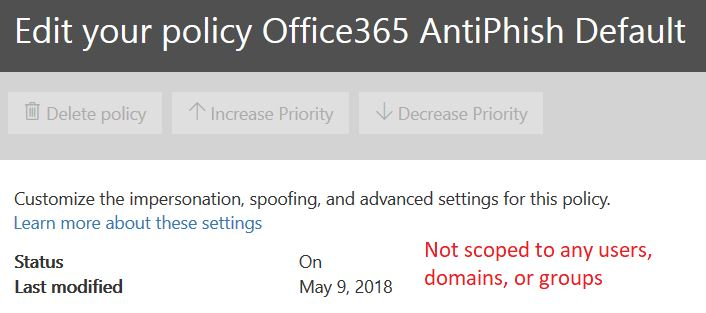
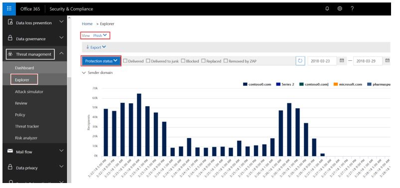
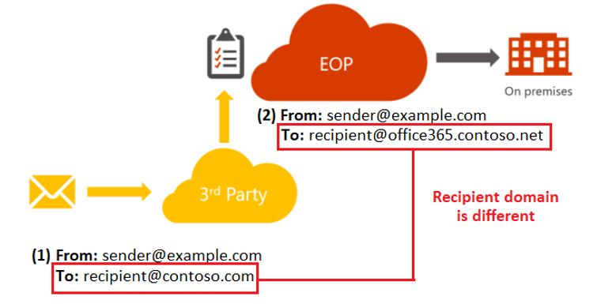
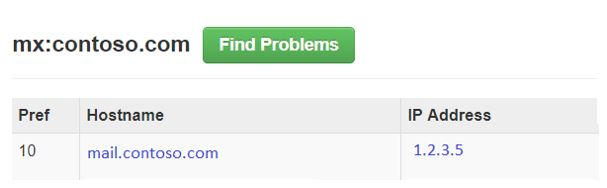

# <a name="anti-spoofing-protection-in-office-365"></a>Skydd mot förfalskning i Office 365

I den här artikeln beskrivs hur Office 365 minimerar nätfiskeattacker som använder förfalskade avsändardomäner. Det uppnås genom att analyser av meddelanden och blockera sådana som inte kan autentiseras med standardmetoder för e-postautentisering eller med andra metoder för avsändaromdöme. Den här ändringen har implementerats för att minska antalet nätfiskeattacker som organisationer i Office 365 exponeras för.

I den här artikeln förklaras även varför den här ändringen görs, hur kunder kan förbereda sig för den här ändringen, hur du visar meddelanden som kommer att påverkas, hur du rapporterar meddelanden, hur du kan begränsa falska positiva identifieringar samt hur avsändare till Microsoft förbereder den här ändringen.

Microsofts skydd mot förfalskning installerades ursprungligen i organisationer med en Office 365 Enterprise E5-prenumeration eller har köpt tillägget Office 365 avancerat hotskydd (ATP) för prenumerationen. Från och med oktober 2018 utökade vi skyddet även till organisationer som har Exchange Online Protection (EOP). På grund av sättet som alla våra filter lär sig från varandra kan även Outlook.com användare påverkas.

## <a name="how-spoofing-is-used-in-phishing-attacks"></a>Hur förfalskning används i nätfiskeattacker

När det gäller att skydda sina användare tar Microsoft hot om nätfiske på allvar. En av de tekniker som spammare och nätfiskare vanligtvis använder är förfalskning, som är när avsändaren förfalskas och ett meddelande visas som kommer från någon annanstans än den faktiska källan. Tekniken används ofta i nätfiskekampanjer för att få användaruppgifter. Microsofts skydd mot förfalskning undersöker särskilt förfalskning i ”från: huvud”, vilket är den som visas i en e-postklient som Outlook. När Microsoft har stort förtroende för att från: header innehåller falsk data identifierar det meddelandet som en förfalskning.

Falska meddelanden har två negativa konsekvenser för riktiga användare:

### <a name="1-spoofed-messages-deceive-users"></a>1. Falska meddelanden vilseleder användare

I första hand kan falska meddelanden lura användaren att klicka på en länk och ge behörighet, hämta skadlig programvara och svara på ett meddelande med känsligt innehåll (det senare kallas för äventyra företagets e-post). Följande är till exempel ett nätfiske-meddelande med en falsk avsändare av msoutlook94@service.outlook.com:


Ovan kom inte från service.outlook.com, men i stället manipulerades det av nätfiskare så att det ser ut som det gjorde det. Det försöker lura användaren att klicka på länken i meddelandet.

Nästa exempel är att förfalska contoso.com:


Meddelandet ser äkta ut men är i själva verket falskt. Det här nätfiskemeddelandet är en typ av kompromettering av företagets e-post som är en underkategori av nätfiske.

### <a name="2-users-confuse-real-messages-for-fake-ones"></a>2. Användare misstar riktiga meddelanden som falska

För det andra skapar falska meddelanden osäkerhet för användare som känner till nätfiskemeddelanden, men inte kan se skillnaden mellan ett riktigt meddelande och ett falskt. Följande exempel är ett exempel på ett faktiskt lösenordsåterställning från e-postadressen för Microsofts säkerhetskonto:


Meddelandet ovan kom från Microsoft, men samtidigt är användare vana vid att få nätfiskemeddelanden som kan lura dem att klicka på en länk och lämna ut sina uppgifter, ladda ned skadlig kod eller svara på ett meddelande med känsligt innehåll. Eftersom det är svårt att avgöra skillnaden mellan en riktig lösenordsåterställning och en falsk ignorerar många användare dessa meddelanden, rapporterar dem som skräppost eller rapporterar meddelanden i onödan till Microsoft som missade nätfiskebedrägerier.

För att stoppa förfalskning har e-postfilterbranschen tagit fram autentiseringsprotokoll för e-post, till exempel [SPF](set-up-spf-in-office-365-to-help-prevent-spoofing.md), [DKIM](use-dkim-to-validate-outbound-email.md)och [DMARC](use-dmarc-to-validate-email.md). DMARC förhindrar att förfalskare undersöker avsändaren av ett meddelande. Det vill säga: avsändaren som användaren ser i e-postklienten (i exemplen ovan är det service.outlook.com, outlook.com och accountprotection.microsoft.com). Dessutom kan användarna se att domänen har godkänts i SPF- eller DKIM-kontrollen, vilket betyder att domänen har autentiserats och är därför ingen förfalskning. En mer utförlig diskussion finns i avsnittet ”*Förstå varför e-postautentisering inte alltid är tillräckligt för att stoppa förfalskning*” senare i den här artikeln.

Men problemet är att e-postautentisering är valfritt, inte obligatoriskt. Det innebär att domäner med kraftfulla autentiseringsprinciper som microsoft.com och skype.com skyddas från förfalskning medan domäner som publicerar svagare autentiseringsprinciper eller ingen princip alls, är mål för att bli förfalskade. Till och med mars 2018 har endast 9 % av företag på Fortune 500-listan publicerat starka principer för e-postautentisering. De återstående 91 % kan förfalskas av en nätfiskare och om e-postfiltret inte upptäcker de med en annan princip kan det levereras till en slutanvändare och vilseleda användaren:


Antalet små och medelstora företag som inte finns i Fortune 500-listan som publicerar starka principer för e-postautentisering är mindre, och ännu mindre för domäner som är utanför Nordamerika och Västeuropa.

Det här är ett stort problem, för att även om företagen kanske inte känner till hur e-postautentisering fungerar så vet nätfiskare det och utnyttjar den här bristen.

Information om hur du konfigurerar SPF, DKIM och DMARC finns i avsnittet ”*Kunder med Office 365”* senare i det här dokumentet.

## <a name="stopping-spoofing-with-implicit-email-authentication"></a>Stoppa förfalskning med implicit e-postautentisering

Eftersom nätfiske och harpunfiske är ett sådant stort problem, och på grund av den begränsade användningen av starka principer för e-postautentisering, fortsätter Microsoft att investera i funktioner för att skydda sina kunder. Därför går Microsoft vidare med *implicit e-postautentisering* – om en domän inte autentiseras hanterar Microsoft den som om den har publicerade poster för e-postautentisering och behandlar den efter detta om den inte godkänns.

För att åstadkomma detta har Microsoft skapat flera olika tillägg till vanlig e-postautentisering, till exempel avsändaromdöme, historik för avsändare/mottagare, beteendeanalys och andra avancerade metoder. Ett meddelande som skickats från en domän som inte publicerar e-postautentisering markeras som förfalskning om det inte innehåller andra signaler som indikerar att det är äkta.

Genom att göra detta kan användare känna sig trygga i att e-post som skickats till dem inte har förfalskats, avsändare kan känna sig trygga i att ingen imiterar deras domän och kunder med Office 365 kan tillhandahålla ett ännu bättre skydd, till exempel imitationsskydd.

Du kan läsa Microsofts allmänna meddelande i [A Sea of Phish Part 2 - Enhanced Anti-spoofing in Office 365](https://techcommunity.microsoft.com/t5/Security-Privacy-and-Compliance/Schooling-A-Sea-of-Phish-Part-2-Enhanced-Anti-spoofing/ba-p/176209) (Ett hav av nätfiskare – förbättrat skydd mot förfalskning i Office 365).

## <a name="identifying-that-a-message-is-classified-as-spoofed"></a>Identifiera att ett meddelande har klassificerats som falskt

### <a name="composite-authentication"></a>Sammansatt autentisering

SPF, DKIM och DMARC är alla användbara men de kommunicerar inte tillräckligt om autentiseringsstatus om ett meddelande inte har explicita autentiseringsposter. Därför har Microsoft utvecklat en algoritm som kombinerar flera signaler till ett enda värde som kallas sammansatt autentisering – eller compauth som en förkortning av ”Composite Authentication”. Kunder i Office 365 har compauth-värden stämplade i *Authentication-Results*-huvudet i meddelandehuvudena.

```text
Authentication-Results:
  compauth=<fail|pass|softpass|none> reason=<yyy>
```

|**CompAuth-resultat**|**Beskrivning**|
|:-----|:-----|
|fail (fel)|Meddelande som misslyckats i explicit autentisering (avsändardomänen publicerade poster explicit i DNS) eller implicit autentisering (avsändardomänen publicerade inte poster i DNS, så Office 365 interpolerade resultatet som om den skulle ha publicerat poster).|
|pass (godkänt)|Meddelandet godkändes i explicit autentisering (meddelandet godkändes i DMARC-kontrollen, eller [DMARC BestGuessPass](https://blogs.msdn.microsoft.com/tzink/2015/05/06/what-is-dmarc-bestguesspass-in-office-365)) eller i implicit autentisering med hög konfidens (avsändardomän publicerar inte poster för e-postautentisering men Office 365 har starka serversignaler på att meddelande sannolikt är äkta).|
|softpass (mjukt godkännande)|Meddelandet godkändes i implicit autentisering med låg till medelhög konfidens (avsändardomänen publicerar inte e-postautentisering men Office 365 har serversignaler som indikerar att meddelandet är äkta men signalen är svagare).|
|none (ingen)|Meddelandet autentiserades inte (eller autentiserades men matchade inte), men sammansatt autentisering tillämpades inte på grund av avsändaromdöme eller andra faktorer.|

|||
|:-----|:-----|
|**Orsak**|**Beskrivning**|
|0xx |Meddelandet misslyckades i sammansatt autentisering.<br/>**000** betyder att meddelandet inte har klarat DMARC, med åtgärden att avvisa eller placera i karantän.  <br/>**001** betyder att meddelandet inte har klarat implicit autentisering. Det innebär att avsändardomänen inte hade publicerade poster för e-postautentisering eller hade en svagare felprincip (SPF SoftFail (lindrigt fel) eller neutral, DMARC-principen p=none).  <br/>**002** betyder att organisationen har en princip för avsändare/domän-paret som är uttryckligen förhindrad att skicka förfalskad e-post, en inställning som görs manuellt av en administratör.  <br/>**010** betyder att meddelandet inte klarade DMARC, med åtgärden att avvisa eller placera i karantän, och avsändardomänen är en av organisationens godkända domäner (det här är en del av förfalskning inom organisationen (”self-to-self” eller ”intra-org”)).|
|1xx, 2xx, 3xx, 4xx och 5xx|Motsvarar olika interna koder för varför ett meddelande har godkänts i implicit autentisering eller inte hade någon autentisering men ingen åtgärd tillämpades.|
|6xx|Betyder att meddelandet inte klarade implicit e-postautentisering, och avsändardomänen är en av organisationens godkända domäner (det här är en del av förfalskning inom organisationen (”self-to-self” eller ”intra-org”)).|

Genom att titta på huvuden i ett meddelande kan en administratör, eller till och med en slutanvändare, avgöra hur Office 365 kommer fram till slutsatsen att avsändaren kan vara falsk.

### <a name="differentiating-between-different-types-of-spoofing"></a>Skilja mellan olika typer av förfalskning

Microsoft skiljer mellan två olika typer av falska meddelanden:

#### <a name="intra-org-spoofing"></a>Förfalskning inom organisationen

Det här kallas även ”self-to-self”- och ”intra-org”-förfalskning och sker när domänen i Från:-adressen är samma som, eller matchar, mottagardomänen (när mottagardomänen är en av organisationens [godkända domäner](https://docs.microsoft.com/exchange/mail-flow-best-practices/manage-accepted-domains/manage-accepted-domains)) eller när domänen i Från:-adressen är en del av samma organisation.

I exemplet nedan är avsändaren och mottagaren i samma domän (contoso.com). Blanksteg infogas i e-postadressen för att förhindra spambot-insamling på den här sidan):

> Från: avsändare @ contoso.com <br/> Till: mottagare @ contoso.com

I exemplet nedan är avsändaren och mottagaren anpassade efter organisationens domän (fabrikam.com):

> Från: avsändare @ foo.fabrikam.com <br/> Till: mottagare @ bar.fabrikam.com

Följande avsändar- och mottagardomäner är olika (microsoft.com och bing.com) men de tillhör samma organisation (dvs. finns bland organisationens godkända domäner):

> Från: avsändare @ microsoft.com <br/> Till: mottagare @ bing.com

Meddelanden som inte klarar intra-org-förfalskningskontrollen innehåller följande värden i huvuden:

`X-Forefront-Antispam-Report: ...CAT:SPM/HSPM/PHSH;...SFTY:9.11`

CAT är meddelandets kategori och är normalt stämplat SPM (skräppost) men kan ibland vara HSPM (skräppost med hög konfidens) eller PHISH (nätfiske), beroende på vilka andra typer av mönster som förekommer i meddelandet.

SFTY är meddelandet säkerhetsnivå, den första siffran (9) betyder att meddelandet är nätfiske och den andra uppsättningen siffror efter punkten (11) betyder att det är intra-org-förfalskning.

Det finns ingen specifik orsakskod för sammansatt autentisering för intra-org-förfalskning, som kommer att stämplas senare under 2018 (tidslinje har inte definierats än).

#### <a name="cross-domain-spoofing"></a>Förfalskning mellan domäner

Det här sker när avsändardomänen i Från:-adressen är en extern domän utanför mottagardomänen. Meddelanden som inte klarar sammansatt autentisering på grund av förfalskning mellan domäner innehåller följande värden i huvuden:

`Authentication-Results: ... compauth=fail reason=000/001`

`X-Forefront-Antispam-Report: ...CAT:SPOOF;...SFTY:9.22`

I båda fallen stämplas följande röda säkerhetstips i meddelandet, eller en motsvarande som anpassas efter den mottagande postlådans språk:


Det är bara genom att titta på Från:-adressen och veta vad mottagarens e-postadress är, eller genom att inspektera e-posthuvuden, som du kan skilja mellan förfalskning inom organisationen och mellan domäner.

## <a name="how-customers-of-office-365-can-prepare-themselves-for-the-new-anti-spoofing-protection"></a>Hur kunder med Office 365 kan förbereda sig för det nya förfalskningsskyddet

### <a name="information-for-administrators"></a>Information för administratörer

Som administratör för en organisation i Office 365 finns det flera delar av viktig information du bör känna till.

### <a name="understanding-why-email-authentication-is-not-always-enough-to-stop-spoofing"></a>Förstå varför e-postautentisering inte alltid är tillräckligt för att stoppa förfalskning

Det nya förfalskningsskyddet förlitar sig på att e-postautentiseringen (SPF, DKIM och DMARC) inte markerar ett meddelande som förfalskning. Ett vanligt exempel är när en avsändardomän aldrig har publicerat SPF-poster. Om det inte finns några SPF-poster, eller om de är felaktigt konfigurerade, markeras ett skickat meddelande som falskt om inte Microsoft har information i serverdelen som säger att meddelandet är äkta.

Till exempel kan ett meddelande, innan förfalskningsskydd tillämpas, se ut som nedan, utan SPF-post, DKIM-post och DMARC-post:

```text
Authentication-Results: spf=none (sender IP is 1.2.3.4)
  smtp.mailfrom=fabrikam.com; contoso.com; dkim=none
  (message not signed) header.d=none; contoso.com; dmarc=none
  action=none header.from=fabrikam.com;
From: sender @ fabrikam.com
To: receiver @ contoso.com
```

Efter förfalskningsskydd, om du har Office 365 Enterprise E5, EOP eller ATP, så stämplas compauth-värdet:

```text
Authentication-Results: spf=none (sender IP is 1.2.3.4)
  smtp.mailfrom=fabrikam.com; contoso.com; dkim=none
  (message not signed) header.d=none; contoso.com; dmarc=none
  action=none header.from=fabrikam.com; compauth=fail reason=001
From: sender @ fabrikam.com
To: receiver @ contoso.com
```

Om fabrikam.com har åtgärdat detta genom att konfigurera en SPF-post men inte en DKIM-post så skulle det godkännas i sammansatt autentisering eftersom domänen som har godkänts i SPF matchar domänen i Från:-adressen:

```text
Authentication-Results: spf=pass (sender IP is 1.2.3.4)
  smtp.mailfrom=fabrikam.com; contoso.com; dkim=none
  (message not signed) header.d=none; contoso.com; dmarc=bestguesspass
  action=none header.from=fabrikam.com; compauth=pass reason=109
From: sender @ fabrikam.com
To: receiver @ contoso.com
```

Eller om de konfigurerar en DKIM-post men inte en SPF-post skulle det också godkännas i sammansatt autentisering eftersom domänen i den godkända DKIM-signaturen matchar domänen i Från:-adressen:

```text
Authentication-Results: spf=none (sender IP is 1.2.3.4)
  smtp.mailfrom=fabrikam.com; contoso.com; dkim=pass
  (signature was verified) header.d=outbound.fabrikam.com;
  contoso.com; dmarc=bestguesspass action=none
  header.from=fabrikam.com; compauth=pass reason=109
From: sender @ fabrikam.com
To: receiver @ contoso.com
```

Men en nätfiskare kan också konfigurera SPF och DKIM och signera meddelandet med sin egen domän, men ange en annan domän i Från:-adressen. Varken SPF eller DKIM kräver att domänen ska matcha domänen i Från:-adressen, så om inte fabrikam.com har publicerat DMARC-poster skulle det inte markeras som förfalskning med hjälp av DMARC:

```text
Authentication-Results: spf=pass (sender IP is 5.6.7.8)
  smtp.mailfrom=maliciousDomain.com; contoso.com; dkim=pass
  (signature was verified) header.d=maliciousDomain.com;
  contoso.com; dmarc=none action=none header.from=fabrikam.com;
From: sender @ fabrikam.com
To: receiver @ contoso.com
```

I e-postklienten (Outlook, Outlook på webben eller någon annan e-postklient) visas bara Från:-domänen, inte domänen i SPF eller DKIM, och det kan vilseleda användaren att tänka att meddelandet kommer från fabrikam.com, men faktiskt kommer från maliciousDomain.com.


Av den anledningen kräver Office 365 att domänen i Från:-adressen matchar domänen i SPF- eller DKIM-signaturen, och om den inte gör det ska innehålla några andra interna signaler som anger att meddelandet är äkta. Annars skulle compauth-fel returneras för meddelandet.

```text
Authentication-Results: spf=none (sender IP is 5.6.7.8)
  smtp.mailfrom=maliciousDomain.com; contoso.com; dkim=pass
  (signature was verified) header.d=maliciousDomain.com;
  contoso.com; dmarc=none action=none header.from=contoso.com;
  compauth=fail reason=001
From: sender@contoso.com
To: someone@fabrikam.com
```

Förfalskningsskyddet i Office 365 skyddar på så sätt mot domäner med ingen autentisering och mot domäner med konfigurerad autentisering men felmatchas mot domänen i Från:-adressen eftersom det är den som användaren ser och tror är avsändaren av meddelandet. Det här gäller både domäner som är utanför din organisation och domäner inom organisationen.

Om du någonsin får ett meddelande som inte klarar sammansatt autentisering och markeras som falskt, trots att meddelandet har godkänts i SPF och DKIM, beror det på att domänen som har godkänts i SPF och DKIM inte matchar domänen i Från:-adressen.

### <a name="understanding-changes-in-how-spoofed-emails-are-treated"></a>Förstå förändringar i hur falska e-postmeddelanden behandlas

För alla organisationer i Office 365 – med eller utan ATP – är det för närvarande så att för meddelanden som inte klarar DMARC med en princip för att avvisa eller placera i karantän markeras som skräppost vidtas normalt hög konfidens-skräppoståtgärden eller ibland den vanliga skräppoståtgärden (beroende på om andra skräppostregler för identifierar meddelandet som skräppost). Vid identifiering av förfalskning inom organisationen vidtas den vanliga skräppoståtgärden. Det här beteende behöver inte aktiveras och kan inte inaktiveras.

Men falska meddelanden mellan domäner skulle innan den ändring sker genomgå vanliga skräppost-, nätfiske- och skadlig kod-kontroller och om andra delar av filtret identifierar dem som misstänkta skulle de markeras som skräppost, nätfiske respektive skadlig kod. Med det nya skyddet mot förfalskning mellan domäner skulle den åtgärd som definieras i principen för Skydd mot nätfiske \> Skydd mot förfalskning vidtas för alla meddelanden som inte kan autentiseras. Om det inte finns någon definierad princip flyttas meddelandet till användarens skräppostmapp. I vissa fall läggs det röda säkerhetstipset till för mer misstänkta meddelanden.

Det kan leda till att vissa meddelanden som tidigare har markerats som skräppost fortfarande markeras som skräppost men nu även får det röda säkerhetstipset. I andra fall börjar meddelanden som tidigare har markerats som icke-skräppost markeras som skräppost (CAT:SPOOF) med ett rött säkerhetstips tillagt. Och i andra fall skulle kunder som har flyttat all skräppost och allt nätfiske till karantän nu se dem flyttas till skräppostmappen (det här beteendet kan ändras, se [Ändra inställningar för förfalskningsskydd](#changing-your-anti-spoofing-settings)).

Ett meddelande kan förfalskas på flera olika sätt (se [Skilja mellan olika typer av förfalskning](#differentiating-between-different-types-of-spoofing) tidigare i den här artikeln) men i mars 2018 finns det inget enhetligt sätt att hantera dessa meddelanden i Office 365. Följande tabell är en snabb sammanfattning, där förfalskning mellan domäner är nytt beteende:

|**Typ av förfalskning**|**Kategori**|**Har säkerhetstips lagts till?**|**Gäller för**|
|:-----|:-----|:-----|:-----|
|DMARC-fel (karantän eller avvisande)|HSPM (standard), kan också vara SPM eller PHSH|Nej (inte än)|Alla Office 365-kunder, Outlook.com|
|Inom organisationen|SPM|Ja|Alla Office 365-organisationer, Outlook.com|
|Mellan domäner|SPOOF|Ja|Kunder med Office 365 Advanced Threat Protection och E5|

### <a name="changing-your-anti-spoofing-settings"></a>Ändra inställningar för skydd mot förfalskning

Om du vill skapa eller uppdatera inställningar för skydd mot förfalskning (flera domäner) går du till fliken Principer hothantering \> inställningar för skydd mot förfalskning och nätfiske \> i Säkerhets- och efterlevnadscenter. Om du aldrig har skapat några inställningar för skydd mot nätfiske måste du skapa en:


Om du redan har skapat en princip kan du välja att ändra den:


Välj den princip du precis har skapat och fortsätt genom stegen enligt beskrivningen i [Lär dig mer om förfalskningsinformation](learn-about-spoof-intelligence.md).


Så här skapar du en princip med hjälp av PowerShell:

```powershell
$org = Get-OrganizationConfig
$name = "My first anti-phishing policy for " + $org.Name
# Note: The name should not exclude 64 characters, including spaces.
# If it does, you will need to pick a smaller name.
# Next, create a new anti-phishing policy with the default values
New-AntiphishPolicy -Name $Name
# Select the domains to scope it to
# Multiple domains are specified in a comma-separated list
$domains = "domain1.com, domain2.com, domain3.com"
# Next, create the anti-phishing rule, scope it to the anti-phishing rule
New-AntiphishRule -Name $name -AntiphishPolicy $name -RecipientDomainIs $domains
```

Du kan sedan ändra parametrarna för principen för förfalskningsskydd med hjälp av PowerShell genom att följande dokumentationen i [Set-AntiphishPolicy](https://docs.microsoft.com/powershell/module/exchange/advanced-threat-protection/Set-AntiPhishPolicy). Du kan ange $name som parameter:

```powershell
Set-AntiphishPolicy -Identity $name <fill in rest of parameters>
```

Istället för att behöva skapa en standardprincip kommer senare under 2018 att skapas en princip åt dig som omfattar alla mottagare i din organisation så att du inte måste ange detta manuellt (skärmbilderna nedan kan ändras innan den slutliga implementeringen).


Till skillnad från en princip som du skapar kan du inte ta bort standardprincipen, ändra dess prioritet eller välja vilka användare, domäner eller grupper som ska omfattas av den.



Så här konfigurerar du standardskydd med hjälp av PowerShell:

```powershell
$defaultAntiphishPolicy = Get-AntiphishPolicy | ? {$_.IsDefault -eq $true}
Set-AntiphishPolicy -Identity $defaultAntiphishPolicy.Name -EnableAntispoofEnforcement <$true|$false>
```

Du bör bara inaktivera förfalskningsskyddet om du har en annan e-postserver eller servrar framför Office 365 (mer information finns i Legitima scenarier för inaktivering av förfalskningsskydd).

```powershell
$defaultAntiphishPolicy = Get-AntiphishiPolicy | ? {$_.IsDefault $true}
Set-AntiphishPolicy -Identity $defaultAntiphishPolicy.Name -EnableAntispoofEnforcement $false
```

> [!IMPORTANT]
> Om det första hoppet i e-postvägen är Office 365 och för många äkta e-postmeddelanden markeras som falska ska du först konfigurera avsändare som tillåts skicka falska e-postmeddelanden till din domän (se avsnittet [Hantera legitima avsändare som skickar icke-autentiserade e-postmeddelanden](#managing-legitimate-senders-who-are-sending-unauthenticated-email) i det här avsnittet). Om du fortfarande får för många falska positiva identifieringar (dvs. äkta meddelanden som markeras som falska) rekommenderar vi INTE att inaktivera förfalskningsskyddet helt. Istället rekommenderar vi att du väljer grundläggande skydd istället för högt. Det är bättre att gå igenom falska positiva identifieringar än att utsätta organisationen för falska e-postmeddelanden som i slutänden kan ge betydligt högre kostnader på lång sikt.

### <a name="managing-legitimate-senders-who-are-sending-unauthenticated-email"></a>Hantera legitima avsändare som skickar icke-autentiserade e-postmeddelanden

Office 365 håller reda på vilka som skickar icke-autentiserad e-post till organisationen. Om tjänsten inte bedömer avsändaren som legitim markeras e-posten med ett *compauth*-fel. Det här klassificeras som falskt, men det beror på din princip för förfalskningsskydd som har tillämpats på meddelandet.

Men som administratör kan du ange vilka avsändare som tillåts skicka falska e-postmeddelanden, vilket åsidosätter Office 365:s beslut.

#### <a name="method-1---if-your-organization-owns-the-domain-set-up-email-authentication"></a>Metod 1 – Konfigurera e-postautentisering om organisationen äger domänen

Den här metoden kan användas till att lösa förfalskning inom organisationen och förfalskning mellan domäner i fall där du äger eller interagerar med flera klientorganisationer. Det hjälper också till att lösa förfalskning mellan domäner där du skickar till andra kunder inom Office 365 och också tredje parter med andra värdar.

Mer information finns i [Kunder som har Office 365](#customers-of-office-365).

#### <a name="method-2---use-spoof-intelligence-to-configure-permitted-senders-of-unauthenticated-email"></a>Metod 2 – Konfigurera tillåtna avsändare av icke-autentiserad e-post med förfalskningsinformation

Du kan också använda [Förfalskningsinformation](learn-about-spoof-intelligence.md) för att tillåta avsändare att skicka icke-autentiserade meddelanden till din organisation.

För externa domäner är den falska användaren domänen i Från-adressen, medan avsändarinfrastrukturen är den avsändande IP-adressen (uppdelad på/24 CIDR-intervall) eller organisationsdomänen för PTR-posten (i skärmbilden nedan kan den avsändande IP-adressen vara 131.107.18.4 vars PTR-post är outbound.mail.protection.outlook.com och detta skulle visas som outlook.com för avsändarinfrastrukturen).

För att tillåta den här avsändaren att skicka icke-autentiserad e-post ändrar du **Nej** till **Ja**.


Du kan också använda PowerShell för att tillåta specifika användare att förfalska din domän:

```powershell
$file = "C:\My Documents\Summary Spoofed Internal Domains and Senders.csv"
Get-PhishFilterPolicy -Detailed -SpoofAllowBlockList -SpoofType External | Export-CSV $file
```


I den föregående bilden har flera radbrytningar lagts till för att skärmbilden ska få plats. Normalt visas alla värden på en enda rad.

Redigera filen och leta efter raden som motsvarar outlook.com och bing.com, och ändra AllowedToSpoof-posten från No (Nej) till Yes (Ja):


Spara filen och kör sedan:

```powershell
$UpdateSpoofedSenders = Get-Content -Raw "C:\My Documents\Spoofed Senders.csv"
Set-PhishFilterPolicy -Identity Default -SpoofAllowBlockList $UpdateSpoofedSenders
```

Nu tillåts bing.com att skicka icke-autentiserad e-post från \*.outlook.com.

#### <a name="method-3---create-an-allow-entry-for-the-senderrecipient-pair"></a>Metod 3 – Skapa en tillåta-post för avsändare/mottagare-paret

Du kan också välja att kringgå all skräppostfiltrering för en viss avsändare. Mer information finns i blogginlägget om [hur du på ett säkert sätt lägger till en avsändare i listan över tillåta avsändaren i Office 365](https://blogs.msdn.microsoft.com/tzink/2017/11/29/how-to-securely-add-a-sender-to-an-allow-list-in-office-365/).

Om du använder den här metoden hoppas skräppost över och viss nätfiskefiltrering, men inte filtrering av skadlig kod.

#### <a name="method-4---contact-the-sender-and-ask-them-to-set-up-email-authentication"></a>Metod 4 – Kontakta avsändaren och be om konfigurering av e-postautentisering

På grund av problem med skräppost och nätfiske rekommenderar Microsoft att alla avsändare konfigurerar e-postautentisering. Om du känner till en administratör för avsändardomänen kontaktar du administratören med begäran om att konfigurera e-postautentisering så att du inte behöver lägga till några åsidosättningar. Mer information finns i [Administratörer för domäner som inte är Office 365-kunder](#administrators-of-domains-that-are-not-office-365-customers)" later in this article.

Det kan till en början vara svårt att få avsändardomäner att autentisera men med tiden, när allt fler e-postfilter markerar deras e-post som skräppost eller till och med avvisar dem så kommer de att konfigurera korrekta poster för att säkerställa bättre leverans.

### <a name="viewing-reports-of-how-many-messages-were-marked-as-spoofed"></a>Visa rapporter på hur många meddelanden som har markerats som falska

När principen om skydd mot förfalskning är aktiverad kan du använda hotgransknings- och svarsfunktioner för att få nummer om hur många meddelanden som markeras som nätfiske. Om du vill göra det går du till Säkerhets- och efterlevnadscenter (SCC) under Hothantering \> Explorer, konfigurera vyn till Nätfiske och gruppera efter avsändardomän eller skyddsstatus:



Du kan interagera med de olika rapporterna för att se hur många som har markerats so nätfiske, inklusive meddelanden som markerats som falska. Mer information finns i [Kom igång med undersökning av och svar på hot i Office 365](office-365-ti.md).

Du kan inte skilja ut vilka meddelanden som har markerats på grund av förfalskning jämfört med andra typer av nätfiske (allmän nätfiske, imitering av domän och användare och så vidare). Dock kommer du att kunna göra detta via Säkerhets och efterlevnadscenter. När du har gjort det kan du använda den här rapporten som startpunkt för att identifiera avsändardomäner som kan vara legitima och som är markerade som förfalskningar på grund av misslyckad autentisering.

Följande skärmbild är ett förslag på hur dessa data kommer att se ut men kan ändras när de släpps:


För icke-ATP och E5-kunder kommer rapporterna att bli tillgängliga senare under Hotskyddsstatus-rapporter (TPS), men kommer att försenas med minst 24 timmar. Den här sidan kommer att uppdateras när de integreras i Säkerhets- och efterlevnadscenter.

### <a name="predicting-how-many-messages-will-be-marked-as-spoof"></a>Förutsäga hur många meddelanden som ska markeras som förfalskningar

När Office 365 uppdaterar sina inställningar så att du kan inaktivera tillämpningen av förfalskningsskyddet, eller aktivera grundläggande eller högt skydd, ges du möjlighet att se hur meddelandedispositionen ändras med olika inställningar. Om förfalskningsskyddet är av kan du se hur många meddelanden som identifieras som falska om du går över till grundläggande skydd, eller om du har grundläggande skydd kan du se hur många fler meddelanden som identifieras som falska om du går över till högt skydd.

Funktionen är för närvarande under utveckling. När mer information definieras uppdateras sidan både med skärmbilder av Säkerhets- och efterlevnadscenter och med PowerShell-exemplen.


### <a name="legitimate-scenarios-to-disable-anti-spoofing"></a>Legitima scenarier för att inaktivera förfalskningsskydd

Förfalskningsskydd ger ett bättre skydd för kunder mot nätfiskeattacker och därför avråder vi starkt från att inaktivera skräppostskydd. Genom att inaktivera det kan du lösa några falska identifieringar på kort sikt men på längre sikt utsätts du för mer risk. Kostnaden för att konfigurera autentisering på avsändarsidan eller göra justeringar av nätfiskeprinciperna är normalt engångshändelser eller kräver bara minimalt, periodiskt underhåll. Men kostnaden för återställning efter en nätfiskeattack där data har exponerats eller tillgångar har komprometterats är mycket högre.

Av den anledningen är det bättre att gå igenom förfalskningsskyddets falska positiva identifieringar än att inaktivera förfalskningsskyddet.

Men det finns ett legitimt scenario där förfalskningsskyddet ska inaktiveras och det är när det finns ytterligare e-postfiltreringsprodukter i meddelandedirigering och Office 365 inte är det första hoppet i e-postvägen:


Den andra servern kan vara en lokal Exchange-e-postserver, en e-postfiltreringsenhet som Ironport eller en annan molnbaserad tjänst.

Om MX-posten för mottagardomänen inte pekar på Office 365 behöver du inte inaktivera förfalskningsskydd eftersom Office 365 letar upp mottagardomänens MX-post och utelämnar förfalskningsskyddet om den pekar på en annan tjänst. Om du inte känner till om din domän har en annan server framför kan du använda en webbplats som MX Toolbox för att leda upp MX-posten. Det kan stå ungefär så här:


Den här domänen har en MX-post som inte pekar på Office 365 så skulle Office 365 inte tillämpa förfalskningsskydd.

Men om MX-posten för mottagardomänen *verkligen* pekar på Office 365 skulle du inaktivera förfalskningsskydd även om det finns en annan framför Office 365. Det vanligaste exemplet är genom användningen av mottagaromskrivning:



MX-posten för domänen contoso.com pekar på den lokala servern medan MX-posten för domänen @office365.contoso.net pekar på Office 365 eftersom den innehåller \*.protection.outlook.com, eller \*.eo.outlook.com i MX-posten:


Se till att skilja på när en mottagardomäns MX-post inte pekar på Office 365 och när den har genomgått en mottagaromskrivning. Det är viktigt att veta skillnaden mellan dessa två fall.

Om du är osäker på om din mottagardomän har genomgått en mottagaromskrivning kan du ibland se det i meddelandehuvudena.

a) Titta först på huvudena i meddelandet för mottagardomänen i Authentication-Results-huvudet:

```text
Authentication-Results: spf=fail (sender IP is 1.2.3.4)
  smtp.mailfrom=fabrikam.com; office365.contoso.net; dkim=fail
  (body hash did not verify) header.d=simple.fabrikam.com;
  office365.contoso.net; dmarc=none action=none
  header.from=fabrikam.com; compauth=fail reason=001
```

Mottagaren finns i den fetstilta röda texten ovan, i det här fallet office365.contoso.net. Det här kan skilja sig från mottagaren i Till:-huvudet:

Till: exempelmottagare \<mottagare @ contoso.com\>

Gör en MX-postsökning av den faktiska mottagardomänen. Om den innehåller \*.protection.outlook.com, mail.messaging.microsoft.com, \*.eo.outlook.com eller mail.global.frontbridge.com betyder det att MX-posten pekar på Office 365.

Om den inte innehåller dessa värden betyder det att MX-posten inte pekar på Office 365. Ett verktyg du kan använda för att verifiera det här är MX Toolbox.

I det här specifika exemplet säger följande att contoso.com, domänen som ser ut som mottagaren eftersom den var Till:-huvudet har en MX-post som pekar på en lokal server:



Men den faktiska mottagaren är office365.contoso.net vars MX-post pekar på Office 365:


Därför har det här meddelandet sannolikt genomgått en mottagaromskrivning.

b) För det andra ska du se till att skilja mellan vanliga användningsfall av mottagaromskrivningar. Om du ska skriva om mottagardomänen till \*.onmicrosoft.com skriver du istället om den till \*.mail.onmicrosoft.com.

När du har identifierat den slutliga mottagardomänen som dirigeras bakom en annan server och mottagarens MX-post faktiskt pekar på Office 365 (som den har publicerats i dess DNS-poster) kan du fortsätta för att inaktivera förfalskningsskydd.

Kom ihåg att du inte vill inaktivera förfalskningsskydd om domänens första hopp i dirigeringsvägen är Office 365, bara när den är bakom en eller flera tjänster.

### <a name="how-to-disable-anti-spoofing"></a>Inaktivera förfalskningsskydd

Om du redan har skapat en princip för förfalskningsskydd anger du $false för parametern *EnableAntispoofEnforcement*:

```powershell
$name = "<name of policy>"
Set-AntiphishPolicy -Identity $name -EnableAntiSpoofEnforcement $false
```

Om du inte vet namnet på principen (eller principerna) som ska inaktiveras kan du visa dem:

```powershell
Get-AntiphishPolicy | Format-List Name
```

Om du inte har några befintliga principer för förfalskningsskydd kan du skapa en och sedan inaktivera den (även om du inte har en princip tillämpas ändå förfalskningsskydd, senare under 2018 skapas en standardprincip åt dig och du kan sedan inaktivera den istället för att skapa en). Du måste göra detta i flera steg:

```powershell
$org = Get-OrganizationConfig
$name = "My first anti-phishing policy for " + $org.Name
# Note: If the name is more than 64 characters, you will need to choose a smaller one
```

```powershell
# Next, create a new anti-phishing policy with the default values
New-AntiphishPolicy -Name $Name
# Select the domains to scope it to
# Multiple domains are specified in a comma-separated list
$domains = "domain1.com, domain2.com, domain3.com"
# Next, create the anti-phishing rule, scope it to the anti-phishing rule
New-AntiphishRule -Name $name -AntiphishPolicy -RecipientDomainIs $domains
# Finally, scope the anti-phishing policy to the domains
Set-AntiphishPolicy -Identity $name -EnableAntispoofEnforcement $false
```

Inaktivera skydd mot förfalskning är endast tillgängligt via cmdlet (senare blir det tillgängligt i säkerhets- och efterlevnadscenter). Om du inte har tillgång till PowerShell skapar du ett supportärende.

Kom ihåg att det bara ska användas för domäner som genomgår indirekt dirigering vid sändning till Office 365. Motstå frestelsen att inaktivera förfalskningsskyddet eftersom vissa falska positiva identifieringar gör att i långa loppet är bättre att gå igenom dem.

### <a name="information-for-individual-users"></a>Information för enskilda användare

Enskilda användare är begränsade i hur de kan interagera med säkerhetstipset för förfalskningsskydd. Men det finns flera saker du kan göra för att lösa vanliga scenarier.

### <a name="common-scenario-discussion-lists"></a>Vanligt scenario: diskussionslistor

Diskussionslistor är kända att ha problem med förfalskning på grund av det sätt de vidarebefordrar meddelandet och ändrar dess innehåll och ändå behåller den ursprungliga Från:-adressen.

Anta till exempel att Gabriela Laureano (glaureano @ contoso.com) är intresserad av fågelskådning och går med i diskussionslistan fagelskadare @ fabrikam.com. När hon skickar ett meddelande till diskussionslistan ser det ut så här:

> **Från:** Gabriela Laureano \<glaureano @ contoso.com\> <br/> **Till:** Diskussionslistan Fågelskådare \<fagelskadare @ fabrikam.com\> <br/> 
**Ämne:** Fantastiska bilder av blåskrika på Mt. Rainier denna vecka <br/><br/>Vem vill kolla in denna veckas bilder från Mt. Rainier?

När e-postlistan får meddelandet formaterar den meddelandet, ändrar dess innehåll och återger det för resten av medlemmarna i diskussionslistan, som utgörs av deltagare från många olika e-postmottaren.

> **Från:** Gabriela Laureano \<glaureano @ contoso.com\> <br/> **Till:** Diskussionslistan Fågelskådare \<fagelskadare @ fabrikam.com\> <br/> **Ämne:** [FÅGELSKÅDARE] Fantastiska bilder av blåskrika på Mt. Rainier denna vecka <br/><br/> Vem vill kolla in denna veckas bilder från Mt. Rainier? <br/><br/> Meddelandet skickades till diskussionslistan Fågelskådare. Du kan avbryta prenumerationen när du vill.

I det här exemplet har det återgivna meddelandet samma Från:-adress (glaureano @ contoso.com) men det ursprungliga meddelandet har ändrats genom att lägga till en tagg i ämnesraden och en sidfot längst ned i meddelandet. Den här typen av meddelandeändring är vanlig i distributionslistor och kan leda till falska positiva identifieringar.

Om du eller någon i organisationen är administratör för distributionslistan kanske du kan konfigurera den att godkännas i förfalskningskontroller.

- Ta en titt på vanliga frågor och svar på DMARC.org: [I operate a mailing list and I want to interoperate with DMARC, what should I do?](https://dmarc.org/wiki/FAQ#I_operate_a_mailing_list_and_I_want_to_interoperate_with_DMARC.2C_what_should_I_do.3F) (Jag driver en distributionslista och vill samverka med DMARC, vad ska jag göra?)

- Läs anvisningarna i det här blogginlägget: [A tip for mailing list operators to interoperate with DMARC to avoid failures](https://blogs.msdn.microsoft.com/tzink/2017/03/22/a-tip-for-mailing-list-operators-to-interoperate-with-dmarc-to-avoid-failures/) (Ett tips för dem som driver distributionslistor att samverka med DMARC för att undvika fel)

- Överväg att installera uppdateringar på distributionslistans server som stöder ARC, se [https://arc-spec.org](https://arc-spec.org/)

Om du inte äger distributionslistan:

- Du kan begära att innehavaren av distributionslistan för att implementera ett av de föregående alternativen (de ska även ha e-postautentisering konfigurerat för domänen som distributionslistan vidarebefordrar från).

- Du kan skapa postlåderegler i e-postklienten för att flytta meddelanden till Inkorgen. Du kan också begära att organisationens administratörer konfigurerar regler för att tillåta, eller åsidosättningar enligt diskussionen i avsnittet [Hantera legitima avsändare som skickar icke-autentiserade e-postmeddelanden](#managing-legitimate-senders-who-are-sending-unauthenticated-email) i den här artikeln.

- Du kan skapa ett supportärende med Office 365 för att skapa en åsidosättning för distributionslistan för att behandla den som legitim.

### <a name="other-scenarios"></a>Andra scenarier

1. Om inget av ovanstående vanliga scenarier gäller för din situation rapporterar du tillbaka meddelandet som en falsk positiv identifiering till Microsoft. Mer information finns i avsnittet [Hur rapporterar jag meddelanden som skräppost eller icke skräppost tillbaka till Microsoft?](#how-can-i-report-spam-or-non-spam-messages-back-to-microsoft) senare i den här artikeln.

2. Du kan också kontakta e-postadministratören som kan skapa ett supportärende hos Microsoft. Microsofts tekniska team undersöker varför meddelandet har markerats som förfalskning.

3. Och om du vet vem avsändaren är och är säker på att det inte handlar om en skadlig förfalskning kan du svara avsändaren och meddela att de skickar meddelanden från en e-postserver som inte autentiserar. Det här leder ibland till att den ursprungliga avsändaren kontaktar sin IT-administratör som konfigurerar de nödvändiga posterna för e-postautentisering.

   När tillräckligt många avsändare svarar tillbaka till domänägare om att de bör konfigurera poster för e-postautentisering motiveras de att vidta åtgärder. Microsoft samarbetar också med domänägare i att publicera de nödvändiga posterna men det hjälper ännu mer när enskilda användare begär det.

4. Om du vill kan du lägga till avsändaren i listan över betrodda avsändare. Men tänk på att om en nätfiskare förfalskar det kontot levereras det till din postlåda. Därför bör alternativet användas sparsamt.

## <a name="how-senders-to-microsoft-should-prepare-for-anti-spoofing-protection"></a>Hur avsändare till Microsoft ska förbereda förfalskningsskydd

Om du är administratör som för närvarande skickar meddelanden till Microsoft, antingen Office 365 eller Outlook.com, bör du se till att din e-post autentiseras då det annars kan markeras som skräppost eller nätfiske.

### <a name="customers-of-office-365"></a>Kunder som har Office 365

Om du är Office 365-kund och du använder Office 365 till att skicka utgående e-post:

- [Konfigurera SPF i Office 365 för att förhindra förfalskning](set-up-spf-in-office-365-to-help-prevent-spoofing.md) för dina domäner

- [Använd DKIM för att validera utgående e-post som skickas från din egna domän i Office 365](use-dkim-to-validate-outbound-email.md) för dina primära domäner

- [Överväg att konfigurera DMARC-poster](use-dmarc-to-validate-email.md) för att fastställa vilka som är dina legitima avsändare

Microsoft tillhandahåller inte detaljerade implementeringsriktlinjer för SPF, DKIM eller DMARC. Men det finns mycket publicerad information online. Det finns även tredjepartsföretag specialiserade på att hjälpa din organisation att konfigurera poster för e-postautentisering.

### <a name="administrators-of-domains-that-are-not-office-365-customers"></a>Administratörer som inte är Office 365-kunder

Om du inte är en domän men är inte en Office 365-kund:

- Du bör konfigurera SPF för att publicera din domäns avsändande IP-adresser och även konfigurera DKIM (om tillgängligt) för att signera meddelanden digitalt. Du kan också konfigurera DMARC-poster.

- Om du har massavsändare som skickar e-post för din räkning ska du samarbeta med dem för att skicka e-post på ett sätt så att avsändardomänen i Från:-adressen (om den tillhör dig) matchar domänen som godkänns i SPF eller DMARC.

- Om du har lokala e-postservrar, eller skickar från en SaaS-provider, eller från en molnvärdtjänst som Microsoft Azure, GoDaddy, Rackspace, Amazon Web Services eller liknande, ska du se till att de läggs till i SPF-posten.

- Om du har en liten domän med en internetleverantör som värd ska du konfigurera SPF-posten enligt de anvisningar du får från internetleverantören. De flesta internetleverantörer tillhandahåller dessa typer av anvisningar och finns på företagets supportsidor.

- Även om du inte har behövt publicera poster för e-postautentisering tidigare, och det fungerade bra, måste du ändå publicera poster för e-postautentisering för att skicka till Microsoft. När du gör det hjälper du till i kampen mot nätfiske och minskar risken för att du, eller organisationer du skickar till, drabbas av nätfiske.

### <a name="what-if-you-dont-know-who-sends-email-as-your-domain"></a>Vad gäller om du inte vet vilka som skickar e-post som din domän?

Många domäner publicerar inte SPF-poster eftersom de inte vet vilka alla deras avsändare är. Det är okej, du behöver inte veta vilka alla är. Istället ska du komma igång genom att publicera en SPF-post för sådana du känner till, särskilt där din företagstrafik finns, och publicera en neutral SPF-princip, `?all`:

```text
fabrikam.com IN TXT "v=spf1 include:spf.fabrikam.com ?all"
```

Den neutrala SPF-principen innebär att all e-post som kommer från din företagsinfrastruktur godkänns i e-postautentisering hos alla andra e-postmottagare. E-post som kommer från avsändare du inte känner till övergår till neutral, som är nästan samma som att inte publicera någon SPF-post alls.

När du skickar till Office 365 markeras e-post som kommer från din företagstrafik markeras som autentiserad men e-postmeddelanden som kommer från källor du inte känner till kan fortfarande markeras som förfalskningar (beroende på om Office 365 kan autentisera dem implicit). Men det här är ändå en förbättring jämfört med att all e-post markeras som falsk av Office 365.

När du har kommit igång med en SPF-post med återställningsprincipen ”alla” kan du gradvis inkludera mer och mer avsändarinfrastruktur och sedan publicera en striktare princip.

### <a name="what-if-you-are-the-owner-of-a-mailing-list"></a>Vad gäller om du äger en distributionslista?

Se avsnittet [Vanligt scenario: diskussionslistor](#common-scenario-discussion-lists) tidigare i den här artikeln.

### <a name="what-if-you-are-an-infrastructure-provider-such-as-an-internet-service-provider-isp-email-service-provider-esp-or-cloud-hosting-service"></a>Vad gäller om du är en infrastrukturleverantör, till exempel internetleverantör, e-postleverantör eller molnvärdtjänst?

Om du är värd för en domäns e-post, och den skickar e-post, eller tillhandahåller infrastruktur som kan skicka e-post, ska du göra följande:

- Se till att dina kunder har dokumentation som beskriver vad som ska publiceras i deras SPF-poster

- Överväg att signera DKIM-signaturer på utgående e-post även om kunden inte uttryckligen konfigurerar det (signera med en standarddomän). Du kan till och med dubbelsignera e-postmeddelandet med DKIM-signaturer (en gång med kundens domän om det har konfigurerats och en andra gång med företagets DKIM-signatur)

Leveransen till Microsoft garanteras inte även om du autentiserar e-post som kommer från din plattform men det ser åtminstone till att Microsoft inte markerar din e-post som skräppost för att den inte autentiseras. Mer information om hur Outlook.com filtrerar e-post finns på [postmastersidan för Outlook.com](https://postmaster.live.com/pm/postmaster.aspx).

Mer information om metodtips för tjänstleverantörer finns i [M3AAWG Mobile Messaging Best Practices for Service Providers](https://www.m3aawg.org/sites/default/files/M3AAWG-Mobile-Messaging-Best-Practices-Service-Providers-2015-08.pdf) (M3AAWG:s metodtips för mobila meddelanden för tjänstleverantörer).

## <a name="frequently-asked-questions"></a>Vanliga frågor

### <a name="why-is-microsoft-making-this-change"></a>Varför gör Microsoft den här ändringen?

För att påverkan av nätfiskeattacker och för att e-postautentisering har funnits i mer än 15 år anser Microsoft att risken med att fortsätt tillåta icke-autentiserad e-post är högre än risken att förlora legitim e-post.

### <a name="will-this-change-cause-legitimate-email-to-be-marked-as-spam"></a>Innebär ändringen att e-postmeddelanden markeras som skräppost?

Till en början kommer vissa meddelanden markeras som skräppost. Men med tiden anpassas avsändarna och då blir antalet meddelanden som felaktigt märks som förfalskade försumbart för de flesta e-postvägar.

Microsoft implementerade den här funktionen flera veckor innan de distribuerade den till resten av företagets kunder. I början förekom störningar men de minskade gradvis.

### <a name="will-microsoft-bring-this-feature-to-outlookcom-and-non-advanced-threat-protection-customers-of-office-365"></a>Kommer Microsoft att ta funktionen till Outlook.com och Office 365-kunder som inte har Advanced Threat Protection?

Microsofts skydd mot förfalskning installerades ursprungligen i organisationer med en Office 365 Enterprise E5-prenumeration eller har köpt tillägget Office 365 avancerat hotskydd (ATP) för prenumerationen. Från och med oktober 2018 har vi utökat skyddet till organisationer som även har Exchange Online Protection (EOP). I framtiden kanske vi släpper den för Outlook.com. Men om vi gör det kan det hända att vissa funktioner inte tillämpas, till exempel rapportering och anpassade åsidosättningar.

### <a name="how-can-i-report-spam-or-non-spam-messages-back-to-microsoft"></a>Hur kan jag rapportera spam eller inte spam-meddelanden tillbaka till Microsoft?

Se [Anmäla meddelanden och filer till Microsoft](report-junk-email-messages-to-microsoft.md).

### <a name="im-a-domain-administrator-who-doesnt-know-who-all-my-senders-are"></a>Jag är domänadministratör och vet inte vem alla mina avsändare är!

Se [Administratörer av domäner som inte är Office 365-kunder](#administrators-of-domains-that-are-not-office-365-customers).

### <a name="what-happens-if-i-disable-anti-spoofing-protection-for-my-organization-even-though-office-365-is-my-primary-filter"></a>Vad händer om jag inaktiverar förfalskningsskydd för organisationen, trots att Office 365 är mitt primära filter?

Vi rekommenderar inte detta eftersom du exponeras för fler missade nätfiske- och skräppostmeddelanden. Allt nätfiske är inte förfalskningar och alla förfalskningar missas inte. Men du löper högre risk än en kund som aktiverar förfalskningsskydd.

### <a name="does-enabling-anti-spoofing-protection-mean-i-will-be-protected-from-all-phishing"></a>Innebär aktivering av förfalskningsskydd att jag är skyddad från allt nätfiske?

Tyvärr inte, eftersom nätfiskare anpassar sig och använder andra metoder som komprometterade konton eller att konfigurera konton i kostnadsfria tjänster. Men nätfiskeskydd fungerar mycket bättre för att upptäcka dessa andra typer av nätfiskemetoder eftersom skyddslagren i Office 365 är utformade att fungera tillsammans och byggs på varandra.

### <a name="do-other-large-email-receivers-block-unauthenticated-email"></a>Blockerar stora e-postmottagare icke autentiserad e-post?

Nästan alla stora e-postmottagare implementerar traditionell SPF, DKIM och DMARC. Vissa mottagare har andra kontroller som är striktare än bara dessa standarder men några går lika långt som Office 365 för att blockera icke-autentiserade e-postmeddelanden och behandlar dem som falska. Merparten av branschen blir dock mer strikt och strängare för just den här typen av e-post, särskilt på grund av nätfiske-problem.

### <a name="do-i-still-need-to-enable-the-advanced-spam-filter-asf-setting-spf-record-hard-fail-_markasspamspfrecordhardfail_-if-i-enable-anti-spoofing"></a>Måste jag fortfarande aktivera ASF-inställningen (Avancerat spamfilter) "SPF-post: hårt misslyckade" (_MarkAsSpamSpfRecordHardFail_) om jag aktiverar skydd mot förfalskning?

Nej, det här alternativet är inte längre nödvändigt eftersom funktionen skydd mot förfalskning inte bara överväger SPF hårt misslyckade, utan en mycket bredare uppsättning av villkor. Om du har aktiverat skydd mot förfalskning och **SPF-post: Hard Fail** (_MarkAsSpamSpfRecordHardFail_) aktiverad kommer du antagligen att få mer falska positiva identifieringar.

Vi rekommenderar att du inaktiverar den här funktionen eftersom den inte tillhandahålla något extra fångstalternativ för spam eller nätfiske och skulle istället generera mest falska positiva identifieringar. Mer information finns i [Inställningar för avancerat spamfilter (ASF) i Office 365](advanced-spam-filtering-asf-options.md).

### <a name="does-sender-rewriting-scheme-srs-help-fix-forwarded-email"></a>Kan Omskrivningsschema för avsändare (SRS) hjälpa till för att korrigera vidarebefordrade e-postmeddelanden?

SRS korrigerar bara delvis problemet med vidarebefordrad e-post. Genom att skriva om SMTP MAIL FROM kan SRS säkerställa att det vidarebefordrade meddelanden godkänns i SPF vid nästa mål. Men eftersom förfalskningsskydd baseras på Från:-adressen i kombination med MAIL FROM- eller DKIM-signeringsdomänen (eller andra signaler) räcker det inte för att förhindra att vidarebefordrade e-postmeddelanden markeras som falska.
