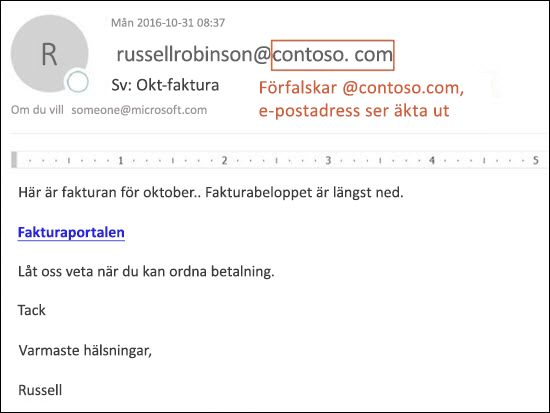
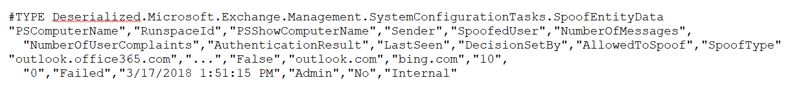
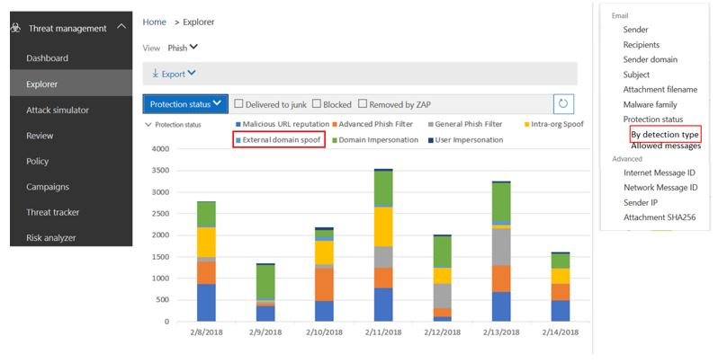

# <a name="anti-spoofing-protection-in-office-365"></a><span data-ttu-id="f182f-105">Skydd mot förfalskning i Office 365</span><span class="sxs-lookup"><span data-stu-id="f182f-105">Anti-spoofing protection in Office 365</span></span>

<span data-ttu-id="f182f-106">I den här artikeln beskrivs hur Office 365 minskar mot nätfiske-attacker som använder förfalskade avsändardomäner, d.v.s. domäner som är falska.</span><span class="sxs-lookup"><span data-stu-id="f182f-106">This article describes how Office 365 mitigates against phishing attacks that use forged sender domains, that is, domains that are spoofed.</span></span> <span data-ttu-id="f182f-107">Den åstadkommer detta genom att analysera meddelanden och blockera de som inte kan autentiseras med hjälp av vanliga metoder för e-postautentisering eller någon annan form av anseendeteknik för avsändare.</span><span class="sxs-lookup"><span data-stu-id="f182f-107">It accomplishes this by analyzing the messages and blocking the ones that cannot be authenticated using standard email authentication methods, nor other sender reputation techniques.</span></span> <span data-ttu-id="f182f-108">Den här ändringen har implementerats för att minska antalet nätfiskeattacker som organisationer i Office 365 exponeras för.</span><span class="sxs-lookup"><span data-stu-id="f182f-108">This change was implemented to reduce the number of phishing attacks to which organizations in Office 365 are exposed.</span></span>

<span data-ttu-id="f182f-109">I den här artikeln förklaras även varför den här ändringen görs, hur kunder kan förbereda sig för den här ändringen, hur du visar meddelanden som kommer att påverkas, hur du rapporterar meddelanden, hur du kan begränsa falska positiva identifieringar samt hur avsändare till Microsoft förbereder den här ändringen.</span><span class="sxs-lookup"><span data-stu-id="f182f-109">This article also describes why this change is being made, how customers can prepare for this change, how to view messages that will be affected, how to report on messages, how to mitigate false positives, as well as how senders to Microsoft should prepare for this change.</span></span>

<span data-ttu-id="f182f-110">Microsofts skydd mot förfalskning installerades ursprungligen i organisationer med en Office 365 Enterprise E5-prenumeration eller har köpt tillägget Office 365 avancerat hotskydd (ATP) för prenumerationen.</span><span class="sxs-lookup"><span data-stu-id="f182f-110">Microsoft's anti-spoofing technology was initially deployed to its organizations that had an Office 365 Enterprise E5 subscription or had purchased the Office 365 Advanced Threat Protection (ATP) add-on for their subscription.</span></span> <span data-ttu-id="f182f-111">Från och med oktober 2018 utökade vi skyddet även till organisationer som har Exchange Online Protection (EOP).</span><span class="sxs-lookup"><span data-stu-id="f182f-111">As of October, 2018 we extended the protection to organizations that have Exchange Online Protection (EOP) as well.</span></span> <span data-ttu-id="f182f-112">På grund av sättet som alla våra filter lär sig från varandra kan även Outlook.com användare påverkas.</span><span class="sxs-lookup"><span data-stu-id="f182f-112">Additionally, because of the way all of our filters learn from each other, Outlook.com users may also be affected.</span></span>

## <a name="how-spoofing-is-used-in-phishing-attacks"></a><span data-ttu-id="f182f-113">Hur förfalskning används i nätfiskeattacker</span><span class="sxs-lookup"><span data-stu-id="f182f-113">How spoofing is used in phishing attacks</span></span>

<span data-ttu-id="f182f-114">När det gäller att skydda sina användare tar Microsoft hot om nätfiske på allvar.</span><span class="sxs-lookup"><span data-stu-id="f182f-114">When it comes to protecting its users, Microsoft takes the threat of phishing seriously.</span></span> <span data-ttu-id="f182f-115">En av de tekniker som spammare och nätfiskare vanligtvis använder är förfalskning, som är när avsändaren förfalskas och ett meddelande visas som kommer från någon annanstans än den faktiska källan.</span><span class="sxs-lookup"><span data-stu-id="f182f-115">One of the techniques that spammers and phishers commonly use is spoofing, which is when the sender is forged, and a message appears to originate from someone or somewhere other than the actual source.</span></span> <span data-ttu-id="f182f-116">Tekniken används ofta i nätfiskekampanjer för att få användaruppgifter.</span><span class="sxs-lookup"><span data-stu-id="f182f-116">This technique is often used in phishing campaigns designed to obtain user credentials.</span></span> <span data-ttu-id="f182f-117">Microsofts skydd mot förfalskning undersöker särskilt förfalskning i ”från: huvud”, vilket är den som visas i en e-postklient som Outlook.</span><span class="sxs-lookup"><span data-stu-id="f182f-117">Microsoft's Anti-spoof technology specifically examines forgery of the 'From: header' which is the one that shows up in an email client like Outlook.</span></span> <span data-ttu-id="f182f-118">När Microsoft har stort förtroende för att från: header innehåller falsk data identifierar det meddelandet som en förfalskning.</span><span class="sxs-lookup"><span data-stu-id="f182f-118">When Microsoft has high confidence that the From: header is spoofed, it identifies the message as a spoof.</span></span>

<span data-ttu-id="f182f-119">Falska meddelanden har två negativa konsekvenser för riktiga användare:</span><span class="sxs-lookup"><span data-stu-id="f182f-119">Spoofing messages have two negative implications for real life users:</span></span>

### <a name="1-spoofed-messages-deceive-users"></a><span data-ttu-id="f182f-120">1. Falska meddelanden vilseleder användare</span><span class="sxs-lookup"><span data-stu-id="f182f-120">1. Spoofed messages deceive users</span></span>

<span data-ttu-id="f182f-121">I första hand kan falska meddelanden lura användaren att klicka på en länk och ge behörighet, hämta skadlig programvara och svara på ett meddelande med känsligt innehåll (det senare kallas för äventyra företagets e-post).</span><span class="sxs-lookup"><span data-stu-id="f182f-121">First, a spoofed message may trick a user into clicking a link and giving up their credentials, downloading malware, or replying to a message with sensitive content (the latter of which is known as Business Email Compromise).</span></span> <span data-ttu-id="f182f-122">Följande är till exempel ett nätfiske-meddelande med en falsk avsändare av msoutlook94@service.outlook.com:</span><span class="sxs-lookup"><span data-stu-id="f182f-122">For example, the following is a phishing message with a spoofed sender of msoutlook94@service.outlook.com:</span></span>


<span data-ttu-id="f182f-124">Ovan kom inte från service.outlook.com, men i stället manipulerades det av nätfiskare så att det ser ut som det gjorde det.</span><span class="sxs-lookup"><span data-stu-id="f182f-124">The above did not actually come from service.outlook.com, but instead was spoofed by the phisher to make it look like it did.</span></span> <span data-ttu-id="f182f-125">Det försöker lura användaren att klicka på länken i meddelandet.</span><span class="sxs-lookup"><span data-stu-id="f182f-125">It is attempting to trick a user into clicking the link within the message.</span></span>

<span data-ttu-id="f182f-126">Nästa exempel är att förfalska contoso.com:</span><span class="sxs-lookup"><span data-stu-id="f182f-126">The next example is spoofing contoso.com:</span></span>



<span data-ttu-id="f182f-128">Meddelandet ser äkta ut, men i själva verket är falskt.</span><span class="sxs-lookup"><span data-stu-id="f182f-128">The message looks legitimate, but in fact is a spoof.</span></span> <span data-ttu-id="f182f-129">Det här nätfiske-meddelandet är en typ av äventyrande av företagets e-post som är en underkategori av nätfiske.</span><span class="sxs-lookup"><span data-stu-id="f182f-129">This phishing message is a type of Business Email Compromise which is a subcategory of phishing.</span></span>

### <a name="2-users-confuse-real-messages-for-fake-ones"></a><span data-ttu-id="f182f-130">2. Användare misstar riktiga meddelanden som falska</span><span class="sxs-lookup"><span data-stu-id="f182f-130">2. Users confuse real messages for fake ones</span></span>

<span data-ttu-id="f182f-131">För det andra skapar falska meddelanden osäkerhet för användare som känner till nätfiske-meddelanden, men inte kan se skillnaden mellan ett riktigt meddelande och falsk.</span><span class="sxs-lookup"><span data-stu-id="f182f-131">Second, spoofed messages create uncertainty for users who know about phishing messages but cannot tell the difference between a real message and spoofed one.</span></span> <span data-ttu-id="f182f-132">Följande exempel är ett exempel på ett faktiskt lösenordsåterställning från e-postadressen för Microsofts säkerhetskonto:</span><span class="sxs-lookup"><span data-stu-id="f182f-132">For example, the following is an example of an actual password reset from the Microsoft Security account email address:</span></span>


<span data-ttu-id="f182f-134">Meddelandet ovan kom från Microsoft, men samtidigt är användare vana vid att få nätfiske-meddelanden som kan lura användaren att klicka på en länk och ge behörighet, hämta skadlig kod eller svara på ett meddelande med känsligt innehåll.</span><span class="sxs-lookup"><span data-stu-id="f182f-134">The above message did come from Microsoft, but at the same time, users are used to getting phishing messages that may trick a user into clicking a link and giving up their credentials, downloading malware, or replying to a message with sensitive content.</span></span> <span data-ttu-id="f182f-135">Eftersom det är svårt att tala om skillnaden mellan en riktig återställning av lösenord och ett falsk, kommer många användare att bortse från dessa meddelanden, rapportera dem som spam eller att inte alltid rapportera tillbaka till Microsoft som missade nätfiske-bedrägerier.</span><span class="sxs-lookup"><span data-stu-id="f182f-135">Because it is difficult to tell the difference between a real password reset and a fake one, many users ignore these messages, report them as spam, or unnecessarily report the messages back to Microsoft as missed phishing scams.</span></span>

<span data-ttu-id="f182f-136">För att stoppa förfalskning har industrin för e-postfilter tagit fram autentiseringsprotokoll för e-post, till exempel [SPF](https://docs.microsoft.com/office365/SecurityCompliance/set-up-spf-in-office-365-to-help-prevent-spoofing), [DKIM](https://docs.microsoft.com/office365/SecurityCompliance/use-dkim-to-validate-outbound-email)och [DMARC](https://docs.microsoft.com/office365/SecurityCompliance/use-dmarc-to-validate-email).</span><span class="sxs-lookup"><span data-stu-id="f182f-136">To stop spoofing, the email filtering industry has developed email authentication protocols such as [SPF](https://docs.microsoft.com/office365/SecurityCompliance/set-up-spf-in-office-365-to-help-prevent-spoofing), [DKIM](https://docs.microsoft.com/office365/SecurityCompliance/use-dkim-to-validate-outbound-email), and [DMARC](https://docs.microsoft.com/office365/SecurityCompliance/use-dmarc-to-validate-email).</span></span> <span data-ttu-id="f182f-137">DMARC förhindrar förfalskning från att undersöka ett meddelandes avsändare.</span><span class="sxs-lookup"><span data-stu-id="f182f-137">DMARC prevents spoofing from examining a message's sender.</span></span> <span data-ttu-id="f182f-138">Det vill säga att avsändaren som användaren ser i sin e-postklient (i exemplen ovanför det är service.outlook.com, outlook.com och accountprotection.microsoft.com).</span><span class="sxs-lookup"><span data-stu-id="f182f-138">That is, the sender that users see in their email client (in the examples above it is service.outlook.com, outlook.com, and accountprotection.microsoft.com).</span></span> <span data-ttu-id="f182f-139">Dessutom kan användare också se att domänen har passerat SPF eller DKIM, vilket innebär att domänen har autentiserats och därför inte har manipulerats.</span><span class="sxs-lookup"><span data-stu-id="f182f-139">Furthermore, users can also see that the domain has passed SPF or DKIM, which means that the domain has been authenticated and is therefore not spoofed.</span></span> <span data-ttu-id="f182f-140">Om du vill ha mer information kan du läsa avsnittet "*Förstår varför e-postautentisering inte alltid räcker för att stoppa förfalskning"* senare i den här artikeln.</span><span class="sxs-lookup"><span data-stu-id="f182f-140">For a more complete discussion, see the section "*Understanding why email authentication is not always enough to stop spoofing"*  later on in this article.</span></span>

<span data-ttu-id="f182f-141">Men problemet är att e-postautentisering är valfritt, inte obligatoriskt.</span><span class="sxs-lookup"><span data-stu-id="f182f-141">However, the problem is that email authentication records are optional, not required.</span></span> <span data-ttu-id="f182f-142">Det innebär att domäner med kraftfulla autentiseringsprinciper som microsoft.com och skype.com skyddas från förfalskning medan domäner som publicerar svagare autentiseringsprinciper eller ingen princip alls, är mål för att bli förfalskade.</span><span class="sxs-lookup"><span data-stu-id="f182f-142">Therefore, while domains with strong authentication policies like microsoft.com and skype.com are protected from spoofing, domains that publish weaker authentication policies, or no policy at all, are targets for being spoofed.</span></span> <span data-ttu-id="f182f-143">Till och med mars 2018 har endast 9 % av företag på Fortune 500-listan publicerat starka principer för e-postautentisering.</span><span class="sxs-lookup"><span data-stu-id="f182f-143">As of March 2018, only 9% of domains of companies in the Fortune 500 publish strong email authentication policies.</span></span> <span data-ttu-id="f182f-144">De återstående 91% kan vara förfalskade av en nätfiskare och om e-postfiltret inte upptäcker det med en annan princip kan det levereras till en slutanvändare och vilseleda dem:</span><span class="sxs-lookup"><span data-stu-id="f182f-144">The remaining 91% may be spoofed by a phisher, and unless the email filter detects it using another policy, may be delivered to an end user and deceive them:</span></span>


<span data-ttu-id="f182f-146">Antalet små och medelstora företag som inte finns på Fortune 500-listan som publicerat starka principer för e-postautentisering är mindre och ännu mindre för domäner som ligger utanför Nordamerika och Västeuropa.</span><span class="sxs-lookup"><span data-stu-id="f182f-146">The proportion of small-to-medium sized companies that are not in the Fortune 500 that publish strong email authentication policies is smaller, and smaller still for domains that are outside of North America and western Europe.</span></span>

<span data-ttu-id="f182f-147">Det här är ett stort problem eftersom företagen kanske inte känner till hur e-postautentisering fungerar förstår nätfiskare det och utnyttjar bristen.</span><span class="sxs-lookup"><span data-stu-id="f182f-147">This is a big problem because while enterprises may not be aware of how email authentication works, phishers do understand and take advantage of the lack of it.</span></span>

<span data-ttu-id="f182f-148">Information om hur du konfigurerar SPF, DKIM och DMARC finns i avsnittet "*Kunder med Office 365"* senare i det här dokumentet.</span><span class="sxs-lookup"><span data-stu-id="f182f-148">For information on setting up SPF, DKIM, and DMARC, see the section "*Customers of Office 365"*  later on in this document.</span></span>

## <a name="stopping-spoofing-with-implicit-email-authentication"></a><span data-ttu-id="f182f-149">Stoppa förfalskning med implicit e-postautentisering</span><span class="sxs-lookup"><span data-stu-id="f182f-149">Stopping spoofing with implicit email authentication</span></span>

<span data-ttu-id="f182f-150">Eftersom nätfiske och spetsad nätfiske är ett sådant problem och på grund av det begränsade införandet av principer för stark e-postautentisering, fortsätter Microsoft att investera i möjligheter för att skydda kunderna.</span><span class="sxs-lookup"><span data-stu-id="f182f-150">Because phishing and spear phishing is such a problem, and because of the limited adoption of strong email authentication policies, Microsoft continues to invest in capabilities to protect its customers.</span></span> <span data-ttu-id="f182f-151">Därför går Microsoft vidare med att fortsätta med *implicit e-postautentisering* – om en domän inte kan verifieras kommer Microsoft att behandla det som om den hade publicerat poster för e-postautentisering och sedan behandla den om den inte går igenom.</span><span class="sxs-lookup"><span data-stu-id="f182f-151">Therefore, Microsoft is moving ahead with  *implicit email authentication* - if a domain doesn't authenticate, Microsoft will treat it as if it had published email authentication records and treat it accordingly if it doesn't pass.</span></span>

<span data-ttu-id="f182f-152">För att göra detta har Microsoft skapat flera olika tillägg för vanlig e-postautentisering, till exempel avsändaranseende, avsändar- och mottagarhistorik, beteendeanalys och annan avancerad teknik.</span><span class="sxs-lookup"><span data-stu-id="f182f-152">To accomplish this, Microsoft has built numerous extensions to regular email authentication including sender reputation, sender/recipient history, behavioral analysis, and other advanced techniques.</span></span> <span data-ttu-id="f182f-153">Ett meddelande som skickas från en domän som inte publicerat e-postautentisering markeras som förfalskning om det inte innehåller andra signaler för att visa att det är legitimt.</span><span class="sxs-lookup"><span data-stu-id="f182f-153">A message sent from a domain that doesn't publish email authentication will be marked as spoof unless it contains other signals to indicate that it is legitimate.</span></span>

<span data-ttu-id="f182f-154">Genom att göra detta kan slutanvändarna ha förtroende för att ett e-postmeddelande som skickas till dem inte har förfalskats, avsändaren kan vara säker på att ingen imiterar deras domän och att kunder med Office 365 kan erbjuda ännu bättre skydd, t. ex. skydd mot imitering.</span><span class="sxs-lookup"><span data-stu-id="f182f-154">By doing this, end users can have confidence that an email sent to them has not been spoofed, senders can be confident that nobody is impersonating their domain, and customers of Office 365 can offer even better protection such as Impersonation protection.</span></span>

<span data-ttu-id="f182f-155">Mer information om Microsofts allmänna annonsering finns i [Ett hav av nätfiskare Del 2 – förbättrat skydd mot förfalskning i Office 365](https://techcommunity.microsoft.com/t5/Security-Privacy-and-Compliance/Schooling-A-Sea-of-Phish-Part-2-Enhanced-Anti-spoofing/ba-p/176209).</span><span class="sxs-lookup"><span data-stu-id="f182f-155">To see Microsoft's general announcement, see [A Sea of Phish Part 2 - Enhanced Anti-spoofing in Office 365](https://techcommunity.microsoft.com/t5/Security-Privacy-and-Compliance/Schooling-A-Sea-of-Phish-Part-2-Enhanced-Anti-spoofing/ba-p/176209).</span></span>

## <a name="identifying-that-a-message-is-classified-as-spoofed"></a><span data-ttu-id="f182f-156">Identifiera att ett meddelande klassificeras som falsk</span><span class="sxs-lookup"><span data-stu-id="f182f-156">Identifying that a message is classified as spoofed</span></span>

### <a name="composite-authentication"></a><span data-ttu-id="f182f-157">Sammansatt autentisering.</span><span class="sxs-lookup"><span data-stu-id="f182f-157">Composite authentication</span></span>

<span data-ttu-id="f182f-158">Medan SPF, DKIM och DMARC är alla användbara i sig själva så att de inte skickar tillräcklig autentiseringsstatus i händelse av att meddelandet inte har några uttryckliga autentiseringsposter.</span><span class="sxs-lookup"><span data-stu-id="f182f-158">While SPF, DKIM, and DMARC are all useful by themselves, they don't communicate enough authentication status in the event a message has no explicit authentication records.</span></span> <span data-ttu-id="f182f-159">Därför har Microsoft utvecklat en algoritm som kombinerar flera signaler till ett enda värde som kallas sammansatt autentisering eller förkortat till compauth.</span><span class="sxs-lookup"><span data-stu-id="f182f-159">Therefore, Microsoft has developed an algorithm that combines multiple signals into a single value called Composite Authentication, or compauth for short.</span></span> <span data-ttu-id="f182f-160">Kunderna i Office 365 har compauth-värden stämplade i rubriken för *Autentiseringsresultat* i meddelandehuvudena.</span><span class="sxs-lookup"><span data-stu-id="f182f-160">Customers in Office 365 have compauth values stamped into the *Authentication-Results* header in the message headers.</span></span>

```text
Authentication-Results:
  compauth=<fail|pass|softpass|none> reason=<yyy>
```

|<span data-ttu-id="f182f-161">**CompAuth-resultat**</span><span class="sxs-lookup"><span data-stu-id="f182f-161">**CompAuth result**</span></span>|<span data-ttu-id="f182f-162">**Beskrivning**</span><span class="sxs-lookup"><span data-stu-id="f182f-162">**Description**</span></span>|
|:-----|:-----|
|<span data-ttu-id="f182f-163">misslyckande</span><span class="sxs-lookup"><span data-stu-id="f182f-163">fail</span></span>|<span data-ttu-id="f182f-164">Meddelandet misslyckades explicit-autentisering (skickar domänpublicerade poster explicit i DNS) eller implicit autentisering (om domänen inte publicerar poster i DNS, så att Office 365 interpolerade resultatet som om det hade publicerat poster).</span><span class="sxs-lookup"><span data-stu-id="f182f-164">Message failed explicit authentication (sending domain published records explicitly in DNS) or implicit authentication (sending domain did not publish records in DNS, so Office 365 interpolated the result as if it had published records).</span></span>|
|<span data-ttu-id="f182f-165">klara</span><span class="sxs-lookup"><span data-stu-id="f182f-165">pass</span></span>|<span data-ttu-id="f182f-166">Meddelandet klarade explicit autentisering (meddelande klarade DMARC eller [Bästa gissning godkände DMARC](https://blogs.msdn.microsoft.com/tzink/2015/05/06/what-is-dmarc-bestguesspass-in-office-365)) eller implicit autentisering med högt förtroende (sändande domän publicerar inte poster i e-postautentisering, men Office 365 har starka serversignaler för att indikerar att meddelandet antagligen är giltigt.)</span><span class="sxs-lookup"><span data-stu-id="f182f-166">Message passed explicit authentication (message passed DMARC, or [Best Guess Passed DMARC](https://blogs.msdn.microsoft.com/tzink/2015/05/06/what-is-dmarc-bestguesspass-in-office-365)) or implicit authentication with high confidence (sending domain does not publish email authentication records, but Office 365 has strong backend signals to indicate the message is likely legitimate).</span></span>|
|<span data-ttu-id="f182f-167">mjukt godkännande</span><span class="sxs-lookup"><span data-stu-id="f182f-167">softpass</span></span>|<span data-ttu-id="f182f-168">Meddelandet klarade implicit autentisering med låg-till-medelhög förtroende (sändande domän publicerar inte e-postautentisering, men Office 365 har serversignaler för att indikerar att meddelandet är giltigt, men signalens legitimitet är svagare).</span><span class="sxs-lookup"><span data-stu-id="f182f-168">Message passed implicit authentication with low-to-medium confidence (sending domain does not publish email authentication, but Office 365 has backend signals to indicate the message is legitimate but the strength of the signal is weaker).</span></span>|
|<span data-ttu-id="f182f-169">ingen</span><span class="sxs-lookup"><span data-stu-id="f182f-169">none</span></span>|<span data-ttu-id="f182f-170">Meddelandet autentiserades inte (eller så autentiserades det men kunde det inte justeras), men sammansatt autentisering tillämpas inte på grund av avsändarens rykte eller andra faktorer.</span><span class="sxs-lookup"><span data-stu-id="f182f-170">Message did not authenticate (or it did authenticate but did not align), but composite authentication not applied due to sender reputation or other factors.</span></span>|

|||
|:-----|:-----|
|<span data-ttu-id="f182f-171">**Orsak**</span><span class="sxs-lookup"><span data-stu-id="f182f-171">**Reason**</span></span>|<span data-ttu-id="f182f-172">**Beskrivning**</span><span class="sxs-lookup"><span data-stu-id="f182f-172">**Description**</span></span>|
|<span data-ttu-id="f182f-173">0xx</span><span class="sxs-lookup"><span data-stu-id="f182f-173">0xx</span></span> |<span data-ttu-id="f182f-174">Meddelandet misslyckade sammansatt autentisering.</span><span class="sxs-lookup"><span data-stu-id="f182f-174">Message failed composite authentication.</span></span><br/><span data-ttu-id="f182f-175">**000** innebär att meddelandet misslyckades med att avslå eller karantän.</span><span class="sxs-lookup"><span data-stu-id="f182f-175">**000** means the message failed DMARC with an action of reject or quarantine.</span></span>  <br/><span data-ttu-id="f182f-176">**001** innebär att meddelandet misslyckades med implicit e-postautentisering.</span><span class="sxs-lookup"><span data-stu-id="f182f-176">**001** means the message failed implicit email authentication.</span></span> <span data-ttu-id="f182f-177">Det innebär att den sändande domänen inte har publicerat några poster för e-postautentiseringar eller om de har gjort det hade de en svagare policy för misslyckande (SPF mjukt misslyckande eller neutral and DMARC policy för p=ingen).</span><span class="sxs-lookup"><span data-stu-id="f182f-177">This means that the sending domain did not have email authentication records published, or if they did, they had a weaker failure policy (SPF soft fail or neutral, DMARC policy of p=none).</span></span>  <br/><span data-ttu-id="f182f-178">**002** innebär att organisationen har en princip för avsändare/domän-par som uttryckligen förbjuder från att skicka förfalskade e-postmeddelanden anges inställningen manuellt av en administratör.</span><span class="sxs-lookup"><span data-stu-id="f182f-178">**002** means the organization has a policy for the sender/domain pair that is explicitly prohibited from sending spoofed email, this setting is manually set by an administrator.</span></span>  <br/><span data-ttu-id="f182f-179">**010** innebär att meddelandet misslyckade DMARC med att avslå eller sätta i karantän och att den sändande domänen är en av organisationens godkända domäner (det här är en del av själv-till-själv eller intra-organisatoriska och förfalskningar).</span><span class="sxs-lookup"><span data-stu-id="f182f-179">**010** means the message failed DMARC with an action of reject or quarantine, and the sending domain is one of your organization's accepted-domains (this is part of self-to-self, or intra-org, spoofing).</span></span>|
|<span data-ttu-id="f182f-180">1xx, 2xx, 3xx, 4xx och 5xx</span><span class="sxs-lookup"><span data-stu-id="f182f-180">1xx, 2xx, 3xx, 4xx, and 5xx</span></span>|<span data-ttu-id="f182f-181">Motsvara olika interna koder för varför ett meddelande klarade implicit autentisering eller ingen autentisering användes, men ingen åtgärd användes.</span><span class="sxs-lookup"><span data-stu-id="f182f-181">Correspond to various internal codes for why a message passed implicit authentication, or had no authentication but no action was applied.</span></span>|
|<span data-ttu-id="f182f-182">6xx</span><span class="sxs-lookup"><span data-stu-id="f182f-182">6xx</span></span>|<span data-ttu-id="f182f-183">Innebär att meddelandet inte klarade implicit e-postautentisering och att den sändande domänen är en av organisationens godkända domäner (det här är en del av själv-till-själv eller intra-organisatoriska, förfalskning).</span><span class="sxs-lookup"><span data-stu-id="f182f-183">Means the message failed implicit email authentication, and the sending domain is one of your organization's accepted domains (this is part of self-to-self, or intra-org, spoofing).</span></span>|

<span data-ttu-id="f182f-184">Genom att titta på meddelandets rubriker kan en administratör eller till och med en slutanvändare bestämma hur Office 365 kommer till slutsatsen att avsändaren kan vara förfalskad.</span><span class="sxs-lookup"><span data-stu-id="f182f-184">By looking at the headers of a message, an administrator or even an end user can determine how Office 365 arrives at the conclusion that the sender may be spoofed.</span></span>

### <a name="differentiating-between-different-types-of-spoofing"></a><span data-ttu-id="f182f-185">Skillnader mellan olika typer av förfalskning</span><span class="sxs-lookup"><span data-stu-id="f182f-185">Differentiating between different types of spoofing</span></span>

<span data-ttu-id="f182f-186">Microsoft skiljer mellan två olika typer av förfalskade meddelanden:</span><span class="sxs-lookup"><span data-stu-id="f182f-186">Microsoft differentiates between two different types of spoofing messages:</span></span>

#### <a name="intra-org-spoofing"></a><span data-ttu-id="f182f-187">Intra-organisatorisk förfalskning</span><span class="sxs-lookup"><span data-stu-id="f182f-187">Intra-org spoofing</span></span>

<span data-ttu-id="f182f-188">Det här kallas även för själv-till-själv förfalskningar när domänen i från: adressen är samma som eller i linje med, mottagarens domän (när en mottagardomän är en av organisationens [godkända domäner](https://docs.microsoft.com/exchange/mail-flow-best-practices/manage-accepted-domains/manage-accepted-domains)). Eller när domänen i Från: adressen är en del av samma organisation.</span><span class="sxs-lookup"><span data-stu-id="f182f-188">Also known as self-to-self spoofing, this occurs when the domain in the From: address is the same as, or aligns with, the recipient domain (when recipient domain is one of your organization's [accepted domains](https://docs.microsoft.com/exchange/mail-flow-best-practices/manage-accepted-domains/manage-accepted-domains)); or, when the domain in the From: address is part of the same organization.</span></span>

<span data-ttu-id="f182f-189">Följande har till exempel avsändare och mottagare från samma domän (contoso.com).</span><span class="sxs-lookup"><span data-stu-id="f182f-189">For example, the following has sender and recipient from the same domain (contoso.com).</span></span> <span data-ttu-id="f182f-190">Mellanslag infogas i e-postadressen för att förhindra att spam-robotar skördar på den här sidan:</span><span class="sxs-lookup"><span data-stu-id="f182f-190">Spaces are inserted into the email address to prevent spambot harvesting on this page):</span></span>

> <span data-ttu-id="f182f-191">Från: avsändare @ contoso.com</span><span class="sxs-lookup"><span data-stu-id="f182f-191">From: sender @ contoso.com</span></span> <br/> <span data-ttu-id="f182f-192">Till: mottagare @ contoso.com</span><span class="sxs-lookup"><span data-stu-id="f182f-192">To: recipient @ contoso.com</span></span>

<span data-ttu-id="f182f-193">I följande har domänerna för avsändare och mottagare justerats till organisationens domän (fabrikam.com):</span><span class="sxs-lookup"><span data-stu-id="f182f-193">The following has the sender and recipient domains aligning with the organizational domain (fabrikam.com):</span></span>

> <span data-ttu-id="f182f-194">Från: avsändare @ foo.fabrikam.com</span><span class="sxs-lookup"><span data-stu-id="f182f-194">From: sender @ foo.fabrikam.com</span></span> <br/> <span data-ttu-id="f182f-195">Till: mottagare @ bar.fabrikam.com</span><span class="sxs-lookup"><span data-stu-id="f182f-195">To: recipient @ bar.fabrikam.com</span></span>

<span data-ttu-id="f182f-196">Följande domäner för avsändare och mottagare är olika (microsoft.com och bing.com), men de tillhör samma organisation (d.v.s. båda är en del av organisationens godkända domäner):</span><span class="sxs-lookup"><span data-stu-id="f182f-196">The following sender and recipient domains are different (microsoft.com and bing.com), but they belong to the same organization (that is, both are part of the organization's Accepted Domains):</span></span>

> <span data-ttu-id="f182f-197">Från: avsändare @ microsoft.com</span><span class="sxs-lookup"><span data-stu-id="f182f-197">From: sender @ microsoft.com</span></span> <br/> <span data-ttu-id="f182f-198">Till: mottagare @ bing.com</span><span class="sxs-lookup"><span data-stu-id="f182f-198">To: recipient @ bing.com</span></span>

<span data-ttu-id="f182f-199">Meddelanden som inte klarar intra-organisatorisk förfalskning innehåller följande värden i huvudena:</span><span class="sxs-lookup"><span data-stu-id="f182f-199">Messages that fail intra-org spoofing contain the following values in the headers:</span></span>

`X-Forefront-Antispam-Report: ...CAT:SPM/HSPM/PHSH;...SFTY:9.11`

<span data-ttu-id="f182f-200">CAT:en är meddelandets kategori och stämplas vanligtvis med SPM (spam), men ibland kan det hända att HSPM (spam med högt förtroende) eller PHISH (nätfiske) beroende på vilka andra typer av mönster som förekommer i meddelandet.</span><span class="sxs-lookup"><span data-stu-id="f182f-200">The CAT is the category of the message, and it is normally stamped as SPM (spam), but occasionally may be HSPM (high confidence spam) or PHISH (phishing) depending upon what other types of patterns occur in the message.</span></span>

<span data-ttu-id="f182f-201">SFTY är säkerhetsnivån i meddelandet, den första siffran (9) innebär att meddelandet är nätfiske och andra uppsättningen med siffror efter punkten (11) innebär att det är en intra-organisatorisk förfalskning.</span><span class="sxs-lookup"><span data-stu-id="f182f-201">The SFTY is the safety level of the message, the first digit (9) means the message is phishing, and second set of digits after the dot (11) means it is intra-org spoofing.</span></span>

<span data-ttu-id="f182f-202">Det finns ingen särskild orsakskod för sammansatt autentisering för intra-organisatorisk förfalskning som kommer att stämplas senare i 2018 (tidslinje har ännu inte definierats).</span><span class="sxs-lookup"><span data-stu-id="f182f-202">There is no specific reason code for Composite Authentication for intra-org spoofing, that will be stamped later in 2018 (timeline not yet defined).</span></span>

#### <a name="cross-domain-spoofing"></a><span data-ttu-id="f182f-203">Förfalskning med flera domäner</span><span class="sxs-lookup"><span data-stu-id="f182f-203">Cross-domain spoofing</span></span>

<span data-ttu-id="f182f-204">Detta inträffar när den sändande domänen i Från: adress är en extern domän till den mottagande organisationen.</span><span class="sxs-lookup"><span data-stu-id="f182f-204">This occurs when the sending domain in the From: address is an external domain to the receiving organization.</span></span> <span data-ttu-id="f182f-205">Meddelanden som inte klarade sammansatt autentisering på grund av förfalskning med flera domäner innehåller följande värden i huvudena:</span><span class="sxs-lookup"><span data-stu-id="f182f-205">Messages that fail Composite Authentication due to cross-domain spoofing contain the following values in the headers:</span></span>

`Authentication-Results: ... compauth=fail reason=000/001`

`X-Forefront-Antispam-Report: ...CAT:SPOOF;...SFTY:9.22`

<span data-ttu-id="f182f-206">I båda fallen stämplas följande röda säkerhetstips i meddelandet eller motsvarande som anpassas till mottagarens postlådas språk:</span><span class="sxs-lookup"><span data-stu-id="f182f-206">In both cases, the following red safety tip is stamped in the message, or an equivalent that is customized to the recipient mailbox's language:</span></span>


<span data-ttu-id="f182f-208">Bara genom att titta på Från: adress och veta vad din mottagande e-postadress är eller genom att inspektera e-postrubrikerna, som du kan använda för att skilja mellan intra-organisatorisk förfalskning och förfalskning mellan flera domäner.</span><span class="sxs-lookup"><span data-stu-id="f182f-208">It's only by looking at the From: address and knowing what your recipient email is, or by inspecting the email headers, that you can differentiate between intra-org and cross-domain spoofing.</span></span>

## <a name="how-customers-of-office-365-can-prepare-themselves-for-the-new-anti-spoofing-protection"></a><span data-ttu-id="f182f-209">Hur kunder som har Office 365 kan förbereda sig för nya skydd mot förfalskning</span><span class="sxs-lookup"><span data-stu-id="f182f-209">How customers of Office 365 can prepare themselves for the new anti-spoofing protection</span></span>

### <a name="information-for-administrators"></a><span data-ttu-id="f182f-210">Information för administratörer</span><span class="sxs-lookup"><span data-stu-id="f182f-210">Information for administrators</span></span>

<span data-ttu-id="f182f-211">Som administratör för en organisation i Office 365 finns det flera viktiga delar av information som du bör känna till.</span><span class="sxs-lookup"><span data-stu-id="f182f-211">As an administrator of an organization in Office 365, there are several key pieces of information you should be aware of.</span></span>

### <a name="understanding-why-email-authentication-is-not-always-enough-to-stop-spoofing"></a><span data-ttu-id="f182f-212">Förstå varför e-postautentisering inte alltid är tillräckligt för att stoppa förfalskning</span><span class="sxs-lookup"><span data-stu-id="f182f-212">Understanding why email authentication is not always enough to stop spoofing</span></span>

<span data-ttu-id="f182f-213">Det nya skydd mot förfalskning är beroende av e-postautentisering (SPF, DKIM och DMARC) för att inte markera ett meddelande som en förfalskning.</span><span class="sxs-lookup"><span data-stu-id="f182f-213">The new anti-spoofing protection relies on email authentication (SPF, DKIM, and DMARC) to not mark a message as spoofing.</span></span> <span data-ttu-id="f182f-214">Ett vanligt exempel är när en avsändande domän aldrig har publicerade SPF-poster.</span><span class="sxs-lookup"><span data-stu-id="f182f-214">A common example is when a sending domain has never published SPF records.</span></span> <span data-ttu-id="f182f-215">Om det inte finns några SPF-poster eller om de är felkonfigurerade kommer ett skickat meddelande att markeras som förfalskning, såvida inte Microsoft har information om serverdelen som säger att meddelandet är legitimt.</span><span class="sxs-lookup"><span data-stu-id="f182f-215">If there are no SPF records or they are incorrectly set up, a sent message will be marked as spoofed unless Microsoft has back-end intelligence that says the message is legitimate.</span></span>

<span data-ttu-id="f182f-216">Om du till exempel använder ett skydd mot förfalskning, kan ett meddelande visas som följande med ingen SPF-post, ingen DKIM-post och ingen DMARC-post:</span><span class="sxs-lookup"><span data-stu-id="f182f-216">For example, prior to anti-spoofing being deployed, a message may have looked like the following with no SPF record, no DKIM record, and no DMARC record:</span></span>

```text
Authentication-Results: spf=none (sender IP is 1.2.3.4)
  smtp.mailfrom=fabrikam.com; contoso.com; dkim=none
  (message not signed) header.d=none; contoso.com; dmarc=none
  action=none header.from=fabrikam.com;
From: sender @ fabrikam.com
To: receiver @ contoso.com
```

<span data-ttu-id="f182f-217">Om du har Office 365 Enterprise E5, EOP eller ATP stämplas compauth-värdet:</span><span class="sxs-lookup"><span data-stu-id="f182f-217">After anti-spoofing, if you have Office 365 Enterprise E5, EOP, or ATP, the compauth value is stamped:</span></span>

```text
Authentication-Results: spf=none (sender IP is 1.2.3.4)
  smtp.mailfrom=fabrikam.com; contoso.com; dkim=none
  (message not signed) header.d=none; contoso.com; dmarc=none
  action=none header.from=fabrikam.com; compauth=fail reason=001
From: sender @ fabrikam.com
To: receiver @ contoso.com
```

<span data-ttu-id="f182f-218">Om fabrikam.com har åtgärdats genom att konfigurera en SPF-post, men inte en DKIM-post skulle detta resultera i sammansatt autentisering eftersom domänen som klarat SPF justerad mot domänen i Från: adress:</span><span class="sxs-lookup"><span data-stu-id="f182f-218">If fabrikam.com fixed this by setting up an SPF record but not a DKIM record, this would pass composite authentication because the domain that passed SPF aligned with the domain in the From: address:</span></span>

```text
Authentication-Results: spf=pass (sender IP is 1.2.3.4)
  smtp.mailfrom=fabrikam.com; contoso.com; dkim=none
  (message not signed) header.d=none; contoso.com; dmarc=bestguesspass
  action=none header.from=fabrikam.com; compauth=pass reason=109
From: sender @ fabrikam.com
To: receiver @ contoso.com
```

<span data-ttu-id="f182f-219">Eller om de konfigurerar en DKIM-post men inte en SPF-post kommer det även att skicka sammansatt autentisering eftersom domänen i DKIM-signaturen som godkändes är justerad med domänen i Från: adress:</span><span class="sxs-lookup"><span data-stu-id="f182f-219">Or, if they set up a DKIM record but not an SPF record, this would also pass composite authentication because the domain in the DKIM-Signature that passed aligned with the domain in the From: address:</span></span>

```text
Authentication-Results: spf=none (sender IP is 1.2.3.4)
  smtp.mailfrom=fabrikam.com; contoso.com; dkim=pass
  (signature was verified) header.d=outbound.fabrikam.com;
  contoso.com; dmarc=bestguesspass action=none
  header.from=fabrikam.com; compauth=pass reason=109
From: sender @ fabrikam.com
To: receiver @ contoso.com
```

<span data-ttu-id="f182f-220">Däremot kan en nätfiskare även konfigurera SPF-och DKIM och signera meddelandet med den egna domänen, men ange en annan domän i Från: adress.</span><span class="sxs-lookup"><span data-stu-id="f182f-220">However, a phisher may also set up SPF and DKIM and sign the message with their own domain, but specify a different domain in the From: address.</span></span> <span data-ttu-id="f182f-221">Ingen SPF eller DKIM kräver att domänen stämmer överens med domänen i Från: adressen, så om fabrikam.com publiceras DMARC poster skulle detta inte markeras som en förfalskning med DMARC:</span><span class="sxs-lookup"><span data-stu-id="f182f-221">Neither SPF nor DKIM requires the domain to align with the domain in the From: address, so unless fabrikam.com published DMARC records, this would not be marked as a spoof using DMARC:</span></span>

```text
Authentication-Results: spf=pass (sender IP is 5.6.7.8)
  smtp.mailfrom=maliciousDomain.com; contoso.com; dkim=pass
  (signature was verified) header.d=maliciousDomain.com;
  contoso.com; dmarc=none action=none header.from=fabrikam.com;
From: sender @ fabrikam.com
To: receiver @ contoso.com
```

<span data-ttu-id="f182f-222">I e-postklienten (Outlook, Outlook på webben och andra e-postklienter) visas bara Från: domänen, inte domänen i SPF eller DKIM och det kan vilseleda användaren att tänka på att meddelandet kommer från fabrikam.com, men faktiskt kom från maliciousDomain.com.</span><span class="sxs-lookup"><span data-stu-id="f182f-222">In the email client (Outlook, Outlook on the web, or any other email client), only the From: domain is displayed, not the domain in the SPF or DKIM, and that can mislead the user into thinking the message came from fabrikam.com, but actually came from maliciousDomain.com.</span></span>


<span data-ttu-id="f182f-224">Av den anledningen kräver Office 365 att domänen i Från: adress justeras mot domänen i SPF- eller DKIM-signaturen och om den inte gör det, innehåller några andra interna signaler som anger att meddelandet är giltigt.</span><span class="sxs-lookup"><span data-stu-id="f182f-224">For that reason, Office 365 requires that the domain in the From: address aligns with the domain in the SPF or DKIM signature, and if it doesn't, contains some other internal signals that indicates that the message is legitimate.</span></span> <span data-ttu-id="f182f-225">Annars skulle meddelandet bli ett compauth-fel.</span><span class="sxs-lookup"><span data-stu-id="f182f-225">Otherwise, the message would be a compauth fail.</span></span>

```text
Authentication-Results: spf=none (sender IP is 5.6.7.8)
  smtp.mailfrom=maliciousDomain.com; contoso.com; dkim=pass
  (signature was verified) header.d=maliciousDomain.com;
  contoso.com; dmarc=none action=none header.from=contoso.com;
  compauth=fail reason=001
From: sender@contoso.com
To: someone@fabrikam.com
```

<span data-ttu-id="f182f-226">Därför skyddar Office 365 skydd mot förfalskning mot domäner med ingen autentisering och gentemot domäner som konfigurerat autentisering men inte överensstämmer med domänen i Från: adress som är den som användaren ser och som anses vara avsändaren av meddelandet.</span><span class="sxs-lookup"><span data-stu-id="f182f-226">Thus, Office 365 anti-spoofing protects against domains with no authentication, and against domains who set up authentication but mismatch against the domain in the From: address as that is the one that the user sees and believes is the sender of the message.</span></span> <span data-ttu-id="f182f-227">Det här gäller både domäner utanför din organisation och domäner i din organisation.</span><span class="sxs-lookup"><span data-stu-id="f182f-227">This is true both of domains external to your organization, as well as domains within your organization.</span></span>

<span data-ttu-id="f182f-228">Om du får ett meddelande om inte klarade sammansatt autentisering och som har markerats som förfalskningar, beror det på att den domän som godkände SPF och DKIM inte justeras mot domänen i Från: adress.</span><span class="sxs-lookup"><span data-stu-id="f182f-228">Therefore, if you ever receive a message that failed composite authentication and is marked as spoofed, even though the message passed SPF and DKIM, it's because the domain that passed SPF and DKIM are not aligned with the domain in the From: address.</span></span>

### <a name="understanding-changes-in-how-spoofed-emails-are-treated"></a><span data-ttu-id="f182f-229">Förstå förändringar i hur förfalskade e-postmeddelanden behandlas</span><span class="sxs-lookup"><span data-stu-id="f182f-229">Understanding changes in how spoofed emails are treated</span></span>

<span data-ttu-id="f182f-230">För närvarande är för alla organisationer i Office 365 – ATP och icke-ATP – meddelanden som inte klarar DMARC med en princip om avvisande eller karantän markeras som spam och som vanligtvis tar spam med hög förtroende eller ibland den vanliga spamåtgärden (beroende på om andra spamreglerna identifierar den först som spam).</span><span class="sxs-lookup"><span data-stu-id="f182f-230">Currently, for all organizations in Office 365 - ATP and non-ATP - messages that fail DMARC with a policy of reject or quarantine are marked as spam and usually take the high confidence spam action, or sometimes the regular spam action (depending on whether other spam rules first identify it as spam).</span></span> <span data-ttu-id="f182f-231">Identifiering av intra-organisatorisk förfalskning tar den vanliga spamåtgärden.</span><span class="sxs-lookup"><span data-stu-id="f182f-231">Intra-org spoof detections take the regular spam action.</span></span> <span data-ttu-id="f182f-232">Det här beteendet behöver inte vara aktiverat och kan inte heller inaktiveras.</span><span class="sxs-lookup"><span data-stu-id="f182f-232">This behavior does not need to be enabled, nor can it be disabled.</span></span>

<span data-ttu-id="f182f-233">Men innan den här förändringen skulle förfalskade meddelande med flera domäner gå igenom de vanliga kontrollerna för spam, nätfiske och skadlig kod och om andra delar av filtret skulle identifierar dem som misstänkta märka dem som spam, nätfiske eller skadlig kod.</span><span class="sxs-lookup"><span data-stu-id="f182f-233">However, for cross-domain spoofing messages, before this change they would go through regular spam, phish, and malware checks and if other parts of the filter identified them as suspicious, would mark them as spam, phish, or malware respectively.</span></span> <span data-ttu-id="f182f-234">Med det nya skyddet mot förfalskning med flera domäner kommer åtgärden som är definierad i principen för nätfiske \> förfalskning som standard gälla på alla meddelanden som inte kan autentiseras.</span><span class="sxs-lookup"><span data-stu-id="f182f-234">With the new cross-domain spoofing protection, any message that can't be authenticated will, by default, take the action defined in the Anti-phishing \> Anti-spoofing policy.</span></span> <span data-ttu-id="f182f-235">Om ingen är definierad flyttas det till användarens mapp för skräppost.</span><span class="sxs-lookup"><span data-stu-id="f182f-235">If one is not defined, it will be moved to a users Junk Email folder.</span></span> <span data-ttu-id="f182f-236">I vissa fall kommer mer misstänkta meddelanden också att ha det röda säkerhetstipset tilllagda i meddelandet.</span><span class="sxs-lookup"><span data-stu-id="f182f-236">In some cases, more suspicious messages will also have the red safety tip added to the message.</span></span>

<span data-ttu-id="f182f-237">Detta kan resultera i att vissa meddelanden som tidigare markerats som spam fortfarande blir markerade som spam, men de kommer också ha ett rött säkerhetstips. I andra fall kommer meddelanden som tidigare markerats som icke-spam kommer att börja markeras som spam (CAT:SPOOF) med ett rött säkerhetstips tillagt.</span><span class="sxs-lookup"><span data-stu-id="f182f-237">This may result in some messages that were previously marked as spam still getting marked as spam but will now also have a red safety tip; in other cases, messages that were previously marked as non-spam will start getting marked as spam (CAT:SPOOF) with a red safety tip added.</span></span> <span data-ttu-id="f182f-238">I andra fall ser kunder som flyttade allt spam och nätfiske till karantänen nu kommer att se att de hamnar i mappen skräppost (det här beteendet kan ändras, se [Att ändra inställningarna för din skydd mot förfalskning](#changing-your-anti-spoofing-settings)).</span><span class="sxs-lookup"><span data-stu-id="f182f-238">In still other cases, customers that were moving all spam and phish to the quarantine would now see them going to the Junk Mail Folder (this behavior can be changed, see [Changing your anti-spoofing settings](#changing-your-anti-spoofing-settings)).</span></span>

<span data-ttu-id="f182f-239">Det finns flera olika sätt för ett meddelande kan förfalskas (mer information finns i [Skillnader mellan olika typer av förfalskningar](#differentiating-between-different-types-of-spoofing) tidigare i den här artikeln) och från och med den mars 2018 kommer sättet som Office 365 behandlar dessa meddelanden inte att vara enhetliga.</span><span class="sxs-lookup"><span data-stu-id="f182f-239">There are multiple different ways a message can be spoofed (see  [Differentiating between different types of spoofing](#differentiating-between-different-types-of-spoofing) earlier in this article) but as of March 2018 the way Office 365 treats these messages is not yet unified.</span></span> <span data-ttu-id="f182f-240">I följande tabell får du en snabb sammanfattning om hur skydd mot följande med flera domäner kommer att ha nya beteenden:</span><span class="sxs-lookup"><span data-stu-id="f182f-240">The following table is a quick summary, with Cross-domain spoofing protection being new behavior:</span></span>

|<span data-ttu-id="f182f-241">**Typ av förfalskning**</span><span class="sxs-lookup"><span data-stu-id="f182f-241">**Type of spoof**</span></span>|<span data-ttu-id="f182f-242">**Kategori**</span><span class="sxs-lookup"><span data-stu-id="f182f-242">**Category**</span></span>|<span data-ttu-id="f182f-243">**Har säkerhetstips lagts till?**</span><span class="sxs-lookup"><span data-stu-id="f182f-243">**Safety tip added?**</span></span>|<span data-ttu-id="f182f-244">**Gäller för**</span><span class="sxs-lookup"><span data-stu-id="f182f-244">**Applies to**</span></span>|
|:-----|:-----|:-----|:-----|
|<span data-ttu-id="f182f-245">DMARC misslyckande (karantän eller avvisande)</span><span class="sxs-lookup"><span data-stu-id="f182f-245">DMARC fail (quarantine or reject)</span></span>|<span data-ttu-id="f182f-246">HSPM (standard), kan också vara SPM eller PHSH</span><span class="sxs-lookup"><span data-stu-id="f182f-246">HSPM (default), may also be SPM or PHSH</span></span>|<span data-ttu-id="f182f-247">Nej (inte än)</span><span class="sxs-lookup"><span data-stu-id="f182f-247">No (not yet)</span></span>|<span data-ttu-id="f182f-248">Alla Office 365-kunder, Outlook.com</span><span class="sxs-lookup"><span data-stu-id="f182f-248">All Office 365 customers, Outlook.com</span></span>|
|<span data-ttu-id="f182f-249">Själv-till-Själv</span><span class="sxs-lookup"><span data-stu-id="f182f-249">Self-to-self</span></span>|<span data-ttu-id="f182f-250">SPM</span><span class="sxs-lookup"><span data-stu-id="f182f-250">SPM</span></span>|<span data-ttu-id="f182f-251">Ja</span><span class="sxs-lookup"><span data-stu-id="f182f-251">Yes</span></span>|<span data-ttu-id="f182f-252">Alla Office 365-organisationer, Outlook.com</span><span class="sxs-lookup"><span data-stu-id="f182f-252">All Office 365 organizations, Outlook.com</span></span>|
|<span data-ttu-id="f182f-253">Flera domäner</span><span class="sxs-lookup"><span data-stu-id="f182f-253">Cross-domain</span></span>|<span data-ttu-id="f182f-254">FÖRFALSKNING</span><span class="sxs-lookup"><span data-stu-id="f182f-254">SPOOF</span></span>|<span data-ttu-id="f182f-255">Ja</span><span class="sxs-lookup"><span data-stu-id="f182f-255">Yes</span></span>|<span data-ttu-id="f182f-256">Office 365 Avancerat hotskydd och E5-kunder</span><span class="sxs-lookup"><span data-stu-id="f182f-256">Office 365 Advanced Threat Protection and E5 customers</span></span>|

### <a name="changing-your-anti-spoofing-settings"></a><span data-ttu-id="f182f-257">Ändra inställningar för skydd mot förfalskning</span><span class="sxs-lookup"><span data-stu-id="f182f-257">Changing your anti-spoofing settings</span></span>

<span data-ttu-id="f182f-258">Om du vill skapa eller uppdatera inställningar för skydd mot förfalskning (flera domäner) går du till fliken Principer hothantering \> inställningar för skydd mot förfalskning och nätfiske \> i Säkerhets- och efterlevnadscenter.</span><span class="sxs-lookup"><span data-stu-id="f182f-258">To create or update your (cross-domain) anti-spoofing settings, navigate to the Anti-phishing \> Anti-spoofing settings under the Threat Management \> Policy tab in the Security & Compliance Center.</span></span> <span data-ttu-id="f182f-259">Om du aldrig har skapat några inställningar för skydd mot nätfiske måste du skapa en:</span><span class="sxs-lookup"><span data-stu-id="f182f-259">If you have never created any anti-phishing settings, you will need to create one:</span></span>


<span data-ttu-id="f182f-261">Om du redan har skapat en kan du välja det för att ändra det:</span><span class="sxs-lookup"><span data-stu-id="f182f-261">If you've already created one, you can select it to modify it:</span></span>


<span data-ttu-id="f182f-263">Välj den princip du just skapade och gå igenom stegen som beskrivs i [Läs mer om förfalskningsinformation](learn-about-spoof-intelligence.md).</span><span class="sxs-lookup"><span data-stu-id="f182f-263">Select the policy you just created and proceed through the steps as described in [Learn more about spoof intelligence](learn-about-spoof-intelligence.md).</span></span>


<span data-ttu-id="f182f-266">Så här skapar du en ny princip med hjälp av PowerShell:</span><span class="sxs-lookup"><span data-stu-id="f182f-266">To create a new policy by using PowerShell:</span></span>

```powershell
$org = Get-OrganizationConfig
$name = "My first anti-phishing policy for " + $org.Name
# Note: The name should not exclude 64 characters, including spaces.
# If it does, you will need to pick a smaller name.
# Next, create a new anti-phishing policy with the default values
New-AntiphishPolicy -Name $Name
# Select the domains to scope it to
# Multiple domains are specified in a comma-separated list
$domains = "domain1.com, domain2.com, domain3.com"
# Next, create the anti-phishing rule, scope it to the anti-phishing rule
New-AntiphishRule -Name $name -AntiphishPolicy $name -RecipientDomainIs $domains
```

<span data-ttu-id="f182f-267">Du kan sedan ändra principparametrarna för skydd mot nätfiske med PowerShell genom att följa dokumentationen på [Konfigurera princip för skydd mot nätfiske](https://docs.microsoft.com/powershell/module/exchange/advanced-threat-protection/Set-AntiPhishPolicy).</span><span class="sxs-lookup"><span data-stu-id="f182f-267">You may then modify the anti-phishing policy parameters using PowerShell, following the documentation at [Set-AntiphishPolicy](https://docs.microsoft.com/powershell/module/exchange/advanced-threat-protection/Set-AntiPhishPolicy).</span></span> <span data-ttu-id="f182f-268">Du kan ange $name som en parameter:</span><span class="sxs-lookup"><span data-stu-id="f182f-268">You may specify the $name as a parameter:</span></span>

```powershell
Set-AntiphishPolicy -Identity $name <fill in rest of parameters>
```

<span data-ttu-id="f182f-269">Senare i 2018, i stället för att skapa en standardprincip, skapas en för dig som gäller för alla mottagare i din organisation så att du inte behöver ange den manuellt (skärmbilderna nedan kan komma att ändras före den slutliga implementationen).</span><span class="sxs-lookup"><span data-stu-id="f182f-269">Later in 2018, rather than you having to create a default policy, one will be created for you that is scoped to all the recipients in your organization so you don't have to specify it manually (the screenshots below are subject to change before the final implementation).</span></span>


<span data-ttu-id="f182f-271">Till skillnad från en princip som du skapar kan du inte ta bort standardprincipen, ändra dess prioritet eller välja vilka användare, domäner och grupper som ska omfattas av den.</span><span class="sxs-lookup"><span data-stu-id="f182f-271">Unlike a policy that you create, you cannot delete the default policy, modify its priority, or choose which users, domains, or groups to scope it to.</span></span>


<span data-ttu-id="f182f-273">Konfigurera standardskydd genom att använda PowerShell:</span><span class="sxs-lookup"><span data-stu-id="f182f-273">To set up your default protection by using PowerShell:</span></span>

```powershell
$defaultAntiphishPolicy = Get-AntiphishPolicy | ? {$_.IsDefault -eq $true}
Set-AntiphishPolicy -Identity $defaultAntiphishPolicy.Name -EnableAntispoofEnforcement <$true|$false>
```

<span data-ttu-id="f182f-274">Du bör bara inaktivera skydd mot förfalskning om du har en annan e-postserver eller servrar framför Office 365 (se legitima scenarier för att inaktivera skydd mot förfalskning för mer information).</span><span class="sxs-lookup"><span data-stu-id="f182f-274">You should only disable anti-spoofing protection if you have another mail server or servers in front of Office 365 (see Legitimate scenarios to disable anti-spoofing for more details).</span></span>

```powershell
$defaultAntiphishPolicy = Get-AntiphishiPolicy | ? {$_.IsDefault $true}
Set-AntiphishPolicy -Identity $defaultAntiphishPolicy.Name -EnableAntispoofEnforcement $false
```

> [!IMPORTANT]
> <span data-ttu-id="f182f-275">Om det första hoppet i din e-postsökväg är Office 365 och du får för många legitima e-postmeddelanden markerade som förfalskningar, bör du först konfigurera avsändarna som tillåts skicka förfalskade e-postmeddelanden till din domän (se [Hantera legitima avsändare som skickar icke autentiserad e-postmeddelanden](#managing-legitimate-senders-who-are-sending-unauthenticated-email) i det här ämnet.</span><span class="sxs-lookup"><span data-stu-id="f182f-275">If the first hop in your email path is Office 365, and you are getting too many legitimate emails marked as spoof, you should first set up your senders that are allowed to send spoofed email to your domain (see the  [Managing legitimate senders who are sending unauthenticated email](#managing-legitimate-senders-who-are-sending-unauthenticated-email) section in this topic.</span></span> <span data-ttu-id="f182f-276">Om du fortfarande får för många falska positiva identifieringar (legitima meddelanden markerade som förfalskningar) rekommenderar vi INTE att du inaktiverar skydd mot förfalskning helt.</span><span class="sxs-lookup"><span data-stu-id="f182f-276">If you are still getting too many false positives (that is, legitimate messages marked as spoof), we do NOT recommend disabling anti-spoofing protection altogether.</span></span> <span data-ttu-id="f182f-277">I stället rekommenderar vi att du väljer grundläggande istället för högt skydd.</span><span class="sxs-lookup"><span data-stu-id="f182f-277">Instead, we recommend choosing Basic instead of High protection.</span></span> <span data-ttu-id="f182f-278">Det är bättre att arbeta genom falska positiva identifieringar än att utsätta din organisation för förfalskade e-postmeddelanden som skulle kunna medföra avsevärda höga kostnader på lång sikt.</span><span class="sxs-lookup"><span data-stu-id="f182f-278">It is better to work through false positives than to expose your organization to spoofed email which could end up imposing significantly higher costs in the long term.</span></span>

### <a name="managing-legitimate-senders-who-are-sending-unauthenticated-email"></a><span data-ttu-id="f182f-279">Hantera legitima avsändare som skickar icke autentiserade e-postmeddelanden</span><span class="sxs-lookup"><span data-stu-id="f182f-279">Managing legitimate senders who are sending unauthenticated email</span></span>

<span data-ttu-id="f182f-280">Office 365 håller reda på vem som skickar icke autentiserad e-post till din organisation.</span><span class="sxs-lookup"><span data-stu-id="f182f-280">Office 365 keeps track of who is sending unauthenticated email to your organization.</span></span> <span data-ttu-id="f182f-281">Om tjänsten anser att avsändaren inte är giltig, kommer den att markeras som ett *compauth* fel.</span><span class="sxs-lookup"><span data-stu-id="f182f-281">If the service thinks the sender is not legitimate, it will mark it as a *compauth* failure.</span></span> <span data-ttu-id="f182f-282">De kommer att klassificeras som FALSKA, men det beror på vilken policy mot förfalskning som användes för meddelandet.</span><span class="sxs-lookup"><span data-stu-id="f182f-282">This will be classified as SPOOF although it depends on your anti-spoofing policy that was applied to the message.</span></span>

<span data-ttu-id="f182f-283">Men som administratör kan du ange vilka avsändare som tillåts att skicka falska e-postmeddelanden och åsidosätta Office 365-beslutet.</span><span class="sxs-lookup"><span data-stu-id="f182f-283">However, as an administrator, you can specify which senders are permitted to send spoofed email, overriding Office 365's decision.</span></span>

#### <a name="method-1---if-your-organization-owns-the-domain-set-up-email-authentication"></a><span data-ttu-id="f182f-284">Metod 1 – om din organisation äger domänen ska du konfigurera e-postautentisering</span><span class="sxs-lookup"><span data-stu-id="f182f-284">Method 1 - If your organization owns the domain, set up email authentication</span></span>

<span data-ttu-id="f182f-285">Med den här metoden kan du lösa problem med intra-organisatorisk förfalskning och förfalskningar med flera olika domäner i fall där du äger eller interagerar med flera klientorganisationer.</span><span class="sxs-lookup"><span data-stu-id="f182f-285">This method can be used to resolve intra-org spoofing, and cross-domain spoofing in cases where you own or interact with multiple tenants.</span></span> <span data-ttu-id="f182f-286">Den hjälper dig också att lösa problem med förfalskning med flera olika domäner där du skickar till andra kunder inom Office 365 och även tredje part som är värd för andra leverantörer.</span><span class="sxs-lookup"><span data-stu-id="f182f-286">It also helps resolve cross-domain spoofing where you send to other customers within Office 365, and also third parties that are hosted in other providers.</span></span>

<span data-ttu-id="f182f-287">Mer information finns i [Kunder för Office 365](#customers-of-office-365).</span><span class="sxs-lookup"><span data-stu-id="f182f-287">For more details, see [Customers of Office 365](#customers-of-office-365).</span></span>

#### <a name="method-2---use-spoof-intelligence-to-configure-permitted-senders-of-unauthenticated-email"></a><span data-ttu-id="f182f-288">Metod 2 – Använd information om förfalskning för att konfigurera tillåta avsändare för icke autentiserad e-post</span><span class="sxs-lookup"><span data-stu-id="f182f-288">Method 2 - Use Spoof intelligence to configure permitted senders of unauthenticated email</span></span>

<span data-ttu-id="f182f-289">Du kan också använda [Information om förfalskning](learn-about-spoof-intelligence.md) för att tillåta att avsändare skickar icke autentiserade meddelanden till din organisation.</span><span class="sxs-lookup"><span data-stu-id="f182f-289">You can also use [Spoof Intelligence](learn-about-spoof-intelligence.md) to permit senders to transmit unauthenticated messages to your organization.</span></span>

<span data-ttu-id="f182f-290">För externa domäner är den falska användaren domänen i Från-adressen, medan den sändande infrastrukturen är antingen den sändande IP-adressen (indelad i/24 CIDR-intervall) eller organisations domänen för PTR-posten (i skärmbilden nedan, så visas den sändande IP-131.107.18.4 vars PTR-post är outbound.mail.protection.outlook.com och detta skulle visas som outlook.com för den sändande infrastrukturen).</span><span class="sxs-lookup"><span data-stu-id="f182f-290">For external domains, the spoofed user is the domain in the From address, while the sending infrastructure is either the sending IP address (divided up into /24 CIDR ranges), or the organizational domain of the PTR record (in the screenshot below, the sending IP might be 131.107.18.4 whose PTR record is outbound.mail.protection.outlook.com, and this would show up as outlook.com for the sending infrastructure).</span></span>

<span data-ttu-id="f182f-291">Om du vill tillåta att avsändaren skickar icke autentiserade e-postmeddelanden ändrar du **Nej** till **Ja**.</span><span class="sxs-lookup"><span data-stu-id="f182f-291">To permit this sender to send unauthenticated email, change the **No** to a **Yes**.</span></span>


<span data-ttu-id="f182f-293">Du kan också använda PowerShell för att tillåta särskilda avsändare att förfalska din domän:</span><span class="sxs-lookup"><span data-stu-id="f182f-293">You can also use PowerShell to allow specific sender to spoof your domain:</span></span>

```powershell
$file = "C:\My Documents\Summary Spoofed Internal Domains and Senders.csv"
Get-PhishFilterPolicy -Detailed -SpoofAllowBlockList -SpoofType External | Export-CSV $file
```



<span data-ttu-id="f182f-295">I föregående bild har ytterligare radbrytningar lagts till så att skärmbilden får plats.</span><span class="sxs-lookup"><span data-stu-id="f182f-295">In the previous image, additional line breaks have been added to make this screenshot fit.</span></span> <span data-ttu-id="f182f-296">Vanligtvis visas alla värden på en enda rad.</span><span class="sxs-lookup"><span data-stu-id="f182f-296">Normally, all the values would appear on a single line.</span></span>

<span data-ttu-id="f182f-297">Redigera filen och leta efter raden som motsvarar outlook.com och bing.com och ändra AllowedToSpoof-inmatningen från Nej till Ja:</span><span class="sxs-lookup"><span data-stu-id="f182f-297">Edit the file and look for the line that corresponds to outlook.com and bing.com, and change the AllowedToSpoof entry from No to Yes:</span></span>


<span data-ttu-id="f182f-299">Spara filen och kör sedan:</span><span class="sxs-lookup"><span data-stu-id="f182f-299">Save the file, and then run:</span></span>

```powershell
$UpdateSpoofedSenders = Get-Content -Raw "C:\My Documents\Spoofed Senders.csv"
Set-PhishFilterPolicy -Identity Default -SpoofAllowBlockList $UpdateSpoofedSenders
```

<span data-ttu-id="f182f-300">Nu kan bing.com skicka icke autentiserade e-postmeddelanden från \*.outlook.com.</span><span class="sxs-lookup"><span data-stu-id="f182f-300">This will now allow bing.com to send unauthenticated email from \*.outlook.com.</span></span>

#### <a name="method-3---create-an-allow-entry-for-the-senderrecipient-pair"></a><span data-ttu-id="f182f-301">Metod 3 – skapa en Tillåt-post för avsändare/mottagare-par</span><span class="sxs-lookup"><span data-stu-id="f182f-301">Method 3 - Create an allow entry for the sender/recipient pair</span></span>

<span data-ttu-id="f182f-302">Du kan också välja att kringgå all spam-filtrering för en viss avsändare.</span><span class="sxs-lookup"><span data-stu-id="f182f-302">You can also choose to bypass all spam filtering for a particular sender.</span></span> <span data-ttu-id="f182f-303">Mer information finns i [Hur du säkert lägger till en avsändare i en lista över tillåtna avsändare i Office 365](https://blogs.msdn.microsoft.com/tzink/2017/11/29/how-to-securely-add-a-sender-to-an-allow-list-in-office-365/).</span><span class="sxs-lookup"><span data-stu-id="f182f-303">For more details, see [How to securely add a sender to an allow list in Office 365](https://blogs.msdn.microsoft.com/tzink/2017/11/29/how-to-securely-add-a-sender-to-an-allow-list-in-office-365/).</span></span>

<span data-ttu-id="f182f-304">Om du använder den här metoden kommer den att hoppa över spam och en del av nätfiske-filtreringen, men inte att filtrera skadlig kod.</span><span class="sxs-lookup"><span data-stu-id="f182f-304">If you use this method, it will skip spam and some of the phish filtering, but not malware filtering.</span></span>

#### <a name="method-4---contact-the-sender-and-ask-them-to-set-up-email-authentication"></a><span data-ttu-id="f182f-305">Metod 4 – kontakta avsändaren och be honom eller henne att konfigurera e-postautentisering</span><span class="sxs-lookup"><span data-stu-id="f182f-305">Method 4 - Contact the sender and ask them to set up email authentication</span></span>

<span data-ttu-id="f182f-306">På grund av problem med spam och nätfiske rekommenderar Microsoft att alla avsändare konfigurerar e-postautentisering.</span><span class="sxs-lookup"><span data-stu-id="f182f-306">Because of the problem of spam and phishing, Microsoft recommends all senders set up email authentication.</span></span> <span data-ttu-id="f182f-307">Om du känner till administratören för den sändande domänen kan du kontakta dem och begära att de konfigurerar poster för e-postautentisering så att du inte behöver lägga till några åsidosättningar.</span><span class="sxs-lookup"><span data-stu-id="f182f-307">If you know an administrator of the sending domain, contact them and request that they set up email authentication records so you do not have to add any overrides.</span></span> <span data-ttu-id="f182f-308">Om du vill ha mer information kan du läsa [Administratörer av domäner som inte är Office 365-kunder](#administrators-of-domains-that-are-not-office-365-customers)" senare i den här artikeln.</span><span class="sxs-lookup"><span data-stu-id="f182f-308">For more information, see [Administrators of domains that are not Office 365 customers](#administrators-of-domains-that-are-not-office-365-customers)" later in this article.</span></span>

<span data-ttu-id="f182f-309">Men det kan vara svårt att komma igång med att få avsändardomäner autentiserade kommer de att konfigurera korrekta poster för att försäkra bättre leverans då fler och fler e-postfilter starta att skräpa eller till och med avvisa deras meddelanden.</span><span class="sxs-lookup"><span data-stu-id="f182f-309">While it may be difficult at first to get sending domains to authenticate, over time, as more and more email filters start junking or even rejecting their email, it will cause them to set up the proper records to ensure better delivery.</span></span>

### <a name="viewing-reports-of-how-many-messages-were-marked-as-spoofed"></a><span data-ttu-id="f182f-310">Visa rapporter om hur många meddelanden som har markerats som förfalskningar</span><span class="sxs-lookup"><span data-stu-id="f182f-310">Viewing reports of how many messages were marked as spoofed</span></span>

<span data-ttu-id="f182f-311">När principen om skydd mot förfalskning är aktiverad kan du använda hotgransknings- och svarsfunktioner för att få nummer om hur många meddelanden som markeras som nätfiske.</span><span class="sxs-lookup"><span data-stu-id="f182f-311">Once your anti-spoofing policy is enabled, you can use threat investigation and response capabilities to get numbers around how many messages are marked as phish.</span></span> <span data-ttu-id="f182f-312">Om du vill göra det går du till Säkerhets- och efterlevnadscenter (SCC) under Hothantering \> Explorer, konfigurera vyn till Nätfiske och gruppera efter avsändardomän eller skyddsstatus:</span><span class="sxs-lookup"><span data-stu-id="f182f-312">To do this, go into the Security & Compliance Center (SCC) under Threat Management \> Explorer, set the View to Phish, and group by Sender Domain or Protection Status:</span></span>


<span data-ttu-id="f182f-314">Du kan interagera med olika rapporter för att se hur många som har markerats som nätfiske, inklusive meddelanden som markerats som FALSKA.</span><span class="sxs-lookup"><span data-stu-id="f182f-314">You can interact with the various reports to see how many were marked as phishing, including messages marked as SPOOF.</span></span> <span data-ttu-id="f182f-315">Mer information finns i [Kom igång med Office 365 Hotutredning och svar](office-365-ti.md).</span><span class="sxs-lookup"><span data-stu-id="f182f-315">To learn more, see [Get started with Office 365 Threat investigation and response](office-365-ti.md).</span></span>

<span data-ttu-id="f182f-316">Du kan inte skilja ut vilka meddelanden som har markerats på grund av förfalskning jämfört med andra typer av nätfiske (allmän nätfiske, imitering av domän och användare och så vidare).</span><span class="sxs-lookup"><span data-stu-id="f182f-316">You can't yet split out which messages were marked due to spoofing as opposed to other types of phishing (general phishing, domain or user impersonation, and so on).</span></span> <span data-ttu-id="f182f-317">Dock kommer du att kunna göra detta via Säkerhets och efterlevnadscenter.</span><span class="sxs-lookup"><span data-stu-id="f182f-317">However, later, you will be able to do this through the Security & Compliance Center.</span></span> <span data-ttu-id="f182f-318">När du har gjort det kan du använda den här rapporten som startpunkt för att identifiera avsändardomäner som kan vara legitima och som är markerade som förfalskningar på grund av misslyckad autentisering.</span><span class="sxs-lookup"><span data-stu-id="f182f-318">Once you do, you can use this report as a starting place to identify sending domains that may be legitimate that are being marked as spoof due to failing authentication.</span></span>

<span data-ttu-id="f182f-319">Följande skärmbild är ett förslag på hur dessa data kommer att se ut, men kan ändras när de släpps:</span><span class="sxs-lookup"><span data-stu-id="f182f-319">The following screenshot is a proposal for how this data will look, but may change when released:</span></span>



<span data-ttu-id="f182f-321">För icke-ATP och E5-kunder kommer rapporterna att bli tillgängliga senare under Hotskyddsstatus-rapporter (TPS), men kommer att försenas med minst 24 timmar.</span><span class="sxs-lookup"><span data-stu-id="f182f-321">For non-ATP and E5 customers, these reports will be available later under the Threat Protection Status (TPS) reports, but will be delayed by at least 24 hours.</span></span> <span data-ttu-id="f182f-322">Den här sidan kommer att uppdateras när de integreras i Säkerhets- och efterlevnadscenter.</span><span class="sxs-lookup"><span data-stu-id="f182f-322">This page will be updated as they are integrated into the Security & Compliance Center.</span></span>

### <a name="predicting-how-many-messages-will-be-marked-as-spoof"></a><span data-ttu-id="f182f-323">Förutsäga hur många meddelanden som ska markeras som förfalskningar</span><span class="sxs-lookup"><span data-stu-id="f182f-323">Predicting how many messages will be marked as spoof</span></span>

<span data-ttu-id="f182f-324">När Office 365 uppdaterar sina inställningar så att du kan inaktivera verkställande av skydd mot förfalskning eller aktivera med grundläggande och hög verkställande kommer du att kunna se hur meddelandedispositionen ändras med olika inställningar.</span><span class="sxs-lookup"><span data-stu-id="f182f-324">Once Office 365 updates its settings to let you turn the anti-spoofing enforcement Off, or on with Basic or High enforcement, you will be given the ability to see how message disposition will change at the various settings.</span></span> <span data-ttu-id="f182f-325">Det innebär att om skydd mot förfalskning är inaktiverat kan du se hur många meddelanden som identifieras som falska om du ändrar till standard. Eller om den är standard kommer du att kunna se hur många fler meddelanden som identifieras som falska om du sätter den till Hög.</span><span class="sxs-lookup"><span data-stu-id="f182f-325">That is, if anti-spoofing is Off, you will be able to see how many messages will be detected as Spoof if you turn to Basic; or, if it's Basic, you will be able to see how many more messages will be detected as Spoof if you turn it to High.</span></span>

<span data-ttu-id="f182f-326">Den här funktionen är för närvarande under utveckling.</span><span class="sxs-lookup"><span data-stu-id="f182f-326">This feature is currently under development.</span></span> <span data-ttu-id="f182f-327">När mer information har definierats uppdateras den här sidan både med skärmbilder av säkerhets- och efterlevnadscenter samt med PowerShell-exemplen.</span><span class="sxs-lookup"><span data-stu-id="f182f-327">As more details are defined, this page will be updated both with screenshots of the Security and Compliance Center, and with PowerShell examples.</span></span>


### <a name="legitimate-scenarios-to-disable-anti-spoofing"></a><span data-ttu-id="f182f-330">Legitima scenarier för att inaktivera skydd mot förfalskning</span><span class="sxs-lookup"><span data-stu-id="f182f-330">Legitimate scenarios to disable anti-spoofing</span></span>

<span data-ttu-id="f182f-331">Skydd mot förfalskning skyddar kunderna mot nätfiske och därför rekommenderas starkt från att inaktivera skydd mot förfalskning.</span><span class="sxs-lookup"><span data-stu-id="f182f-331">Anti-spoofing better protects customers from phishing attacks, and therefore disabling anti-spoofing protection is strongly discouraged.</span></span> <span data-ttu-id="f182f-332">Om du inaktiverar den här funktionen kan du lösa vissa kortfristiga falska positiva identifieringar, men långsiktigt kommer du att bli utsatt för större risker.</span><span class="sxs-lookup"><span data-stu-id="f182f-332">By disabling it, you may resolve some short-term false positives, but long term you will be exposed to more risk.</span></span> <span data-ttu-id="f182f-333">Kostnaden för att konfigurera autentisering på avsändarens sida eller göra justeringar av nätfiske-principer är vanligtvis engångshändelser eller kräver endast minimalt, periodiskt underhåll.</span><span class="sxs-lookup"><span data-stu-id="f182f-333">The cost for setting up authentication on the sender side, or making adjustments in the phishing policies, are usually one-time events or require only minimal, periodic maintenance.</span></span> <span data-ttu-id="f182f-334">Kostnaden för att återställa från ett nätfiske-angrepp där data har exponerats eller tillgångar har komprometterats, är mycket högre.</span><span class="sxs-lookup"><span data-stu-id="f182f-334">However, the cost to recover from a phishing attack where data has been exposed, or assets have been compromised is much higher.</span></span>

<span data-ttu-id="f182f-335">Därför är det bättre att arbeta igenom falska positiva identifieringar av förfalskningar än att inaktivera skydd mot förfalskning.</span><span class="sxs-lookup"><span data-stu-id="f182f-335">For this reason, it is better to work through anti-spoofing false positives than to disable anti-spoof protection.</span></span>

<span data-ttu-id="f182f-336">Det finns dock ett legitimt scenario där skydd mot förfalskning vara inaktiverad och det är när det finns ytterligare e-postfiltrerade produkter i meddelandets rutt och Office 365 inte är det första hoppet i e-postvägen:</span><span class="sxs-lookup"><span data-stu-id="f182f-336">However, there is a legitimate scenario where anti-spoofing should be disabled, and that is when there are additional mail-filtering products in the message routing, and Office 365 is not the first hop in the email path:</span></span>


<span data-ttu-id="f182f-338">Den andra servern kan vara en lokalt placerad Exchange e-postserver, en e-postfiltrerande enhet som IronPort eller någon annan värdtjänst för molnet.</span><span class="sxs-lookup"><span data-stu-id="f182f-338">The other server may be an Exchange on-premises mail server, a mail filtering device such as Ironport, or another cloud hosted service.</span></span>

<span data-ttu-id="f182f-339">Om MX-posten för mottagardomänen inte pekar på Office 365, behöver du inte inaktivera skydd mot förfalskning eftersom Office 365 letar upp den mottagande domänens MX-post och inaktiverar skydd mot förfalskning om det pekar på en annan tjänst.</span><span class="sxs-lookup"><span data-stu-id="f182f-339">If the MX record of the recipient domain does not point to Office 365, then there is no need to disable anti-spoofing because Office 365 looks up your receiving domain's MX record and suppresses anti-spoofing if it points to another service.</span></span> <span data-ttu-id="f182f-340">Om du inte vet om du har en annan server i din domän kan du använda en webbplats som MX-verktygslåda för att kontrollera MX-posten.</span><span class="sxs-lookup"><span data-stu-id="f182f-340">If you don't know if your domain has another server in front, you can use a website like MX Toolbox to look up the MX record.</span></span> <span data-ttu-id="f182f-341">Den kan säga något av följande:</span><span class="sxs-lookup"><span data-stu-id="f182f-341">It might say something like the following:</span></span>


<span data-ttu-id="f182f-343">Den här domänen har en MX-post som inte pekar på Office 365, så Office 365 tillämpar inte skydd mot förfalskning.</span><span class="sxs-lookup"><span data-stu-id="f182f-343">This domain has an MX record that does not point to Office 365, so Office 365 would not apply anti-spoofing enforcement.</span></span>

<span data-ttu-id="f182f-344">Om MX-posten för mottagarens domän *verkligen* pekar mot Office 365, trots att det finns en annan tjänst framför Office 365, ska du inaktivera skydd mot förfalskning.</span><span class="sxs-lookup"><span data-stu-id="f182f-344">However, if the MX record of the recipient domain  *does*  point to Office 365, even though there is another service in front of Office 365, then you should disable anti-spoofing.</span></span> <span data-ttu-id="f182f-345">Det vanligaste exemplet är att använda en omskrivning av mottagare:</span><span class="sxs-lookup"><span data-stu-id="f182f-345">The most common example is through the use of a recipient rewrite:</span></span>


<span data-ttu-id="f182f-347">MX-posten för domänen contoso.com pekar på den lokala servern medan MX-posten för domänen @office365.contoso.net pekar på Office 365 eftersom den innehåller \*.protection.outlook.com eller \*.eo.outlook.com i MX-posten:</span><span class="sxs-lookup"><span data-stu-id="f182f-347">The domain contoso.com's MX record points to the on-premises server, while the domain @office365.contoso.net's MX record points to Office 365 because it contains \*.protection.outlook.com, or \*.eo.outlook.com in the MX record:</span></span>


<span data-ttu-id="f182f-349">Se till att göra skillnad på när MX-posten för en mottagardomän inte pekar på Office 365 och när den har genomgått en omskrivning.</span><span class="sxs-lookup"><span data-stu-id="f182f-349">Be sure to differentiate when a recipient domain's MX record does not point to Office 365, and when it has undergone a recipient rewrite.</span></span> <span data-ttu-id="f182f-350">Det är viktigt att veta skillnaden mellan dessa två fall.</span><span class="sxs-lookup"><span data-stu-id="f182f-350">It is important to tell the difference between these two cases.</span></span>

<span data-ttu-id="f182f-351">Om du är osäker på att din domän har genomgått en omskrivning av mottagare eller inte kan du ibland se det genom att titta på meddelandehuvudena.</span><span class="sxs-lookup"><span data-stu-id="f182f-351">If you are unsure whether or not your receiving domain has undergone a recipient-rewrite, sometimes you can tell by looking at the message headers.</span></span>

<span data-ttu-id="f182f-352">a) börja med att titta på rubrikerna i meddelandet för mottagarens domän i rubriken verifieringsresultat:</span><span class="sxs-lookup"><span data-stu-id="f182f-352">a) First, look at the headers in the message for the recipient domain in the Authentication-Results header:</span></span>

```text
Authentication-Results: spf=fail (sender IP is 1.2.3.4)
  smtp.mailfrom=fabrikam.com; office365.contoso.net; dkim=fail
  (body hash did not verify) header.d=simple.fabrikam.com;
  office365.contoso.net; dmarc=none action=none
  header.from=fabrikam.com; compauth=fail reason=001
```

<span data-ttu-id="f182f-353">Mottagardomänen finns i den fetstilta röda texten ovan, i det här fallet office365.contoso.net.</span><span class="sxs-lookup"><span data-stu-id="f182f-353">The recipient domain is found in the bold red text above, in this case office365.contoso.net.</span></span> <span data-ttu-id="f182f-354">Det här kan vara en skillnad på att mottagaren i Till: rubrik:</span><span class="sxs-lookup"><span data-stu-id="f182f-354">This may be different that the recipient in the To: header:</span></span>

<span data-ttu-id="f182f-355">Till: exempel mottagare \<mottagare @ contoso.com\></span><span class="sxs-lookup"><span data-stu-id="f182f-355">To: Example Recipient \<recipient @ contoso.com\></span></span>

<span data-ttu-id="f182f-356">Utför en MX-postsökning av den faktiska mottagarens domän.</span><span class="sxs-lookup"><span data-stu-id="f182f-356">Perform an MX-record lookup of the actual recipient domain.</span></span> <span data-ttu-id="f182f-357">Om det innehåller \*.protection.outlook.com, mail.messaging.microsoft.com, \*.eo.outlook.com eller mail.global.frontbridge.com, innebär det att MX pekar på Office 365.</span><span class="sxs-lookup"><span data-stu-id="f182f-357">If it contains \*.protection.outlook.com, mail.messaging.microsoft.com, \*.eo.outlook.com, or mail.global.frontbridge.com, that means that the MX points to Office 365.</span></span>

<span data-ttu-id="f182f-358">Om den inte innehåller de värdena innebär det att MX inte pekar på Office 365.</span><span class="sxs-lookup"><span data-stu-id="f182f-358">If it does not contain those values, then it means that the MX does not point to Office 365.</span></span> <span data-ttu-id="f182f-359">Ett verktyg som du kan använda för att kontrollera det här är MX-verktygslåda.</span><span class="sxs-lookup"><span data-stu-id="f182f-359">One tool you can use to verify this is MX Toolbox.</span></span>

<span data-ttu-id="f182f-360">I det här exemplet säger följande att contoso.com, den domän som ser ut som mottagare eftersom den var Till: rubrik, MX-post pekar på en lokal server:</span><span class="sxs-lookup"><span data-stu-id="f182f-360">For this particular example, the following says that contoso.com, the domain that looks like the recipient since it was the To: header, has MX record points to an on-prem server:</span></span>


<span data-ttu-id="f182f-362">Den faktiska mottagaren är dock office365.contoso.net vars MX-post pekar på Office 365:</span><span class="sxs-lookup"><span data-stu-id="f182f-362">However, the actual recipient is office365.contoso.net whose MX record does point to Office 365:</span></span>


<span data-ttu-id="f182f-364">Därför har meddelandet troligen genomgått en omskrivning av mottagare.</span><span class="sxs-lookup"><span data-stu-id="f182f-364">Therefore, this message has likely undergone a recipient-rewrite.</span></span>

<span data-ttu-id="f182f-365">b) se till att skilja mellan vanliga användningsfall av omskrivna mottagare.</span><span class="sxs-lookup"><span data-stu-id="f182f-365">b) Second, be sure to distinguish between common use cases of recipient rewrites.</span></span> <span data-ttu-id="f182f-366">Om du ska skriva om mottagardomänen till \*.onmicrosoft.com skriver du i stället om den till \*. mail.onmicrosoft.com.</span><span class="sxs-lookup"><span data-stu-id="f182f-366">If you are going to rewrite the recipient domain to \*.onmicrosoft.com, instead rewrite it to \*.mail.onmicrosoft.com.</span></span>

<span data-ttu-id="f182f-367">När du har identifierat den slutliga mottagarens domän som dirigeras bakom en annan server och mottagardomänens MX-post pekar på Office 365 (som publicerad i dess DNS-poster) kan du fortsätta att inaktivera skydd mot förfalskning.</span><span class="sxs-lookup"><span data-stu-id="f182f-367">Once you have identified the final recipient domain that is routed behind another server and the recipient domain's MX record actually points to Office 365 (as published in its DNS records), you may proceed to disable anti-spoofing.</span></span>

<span data-ttu-id="f182f-368">Kom ihåg att du inte vill inaktivera skydd mot förfalskning om domänens första hopp i ruttvägen är Office 365, men bara när det ligger bakom en eller flera-tjänster.</span><span class="sxs-lookup"><span data-stu-id="f182f-368">Remember, you don't want to disable anti-spoofing if the domain's first hop in the routing path is Office 365, only when it's behind one or more services.</span></span>

### <a name="how-to-disable-anti-spoofing"></a><span data-ttu-id="f182f-369">Inaktivera skydd mot förfalskning</span><span class="sxs-lookup"><span data-stu-id="f182f-369">How to disable anti-spoofing</span></span>

<span data-ttu-id="f182f-370">Om du redan har skapat en princip för nätfiske kan du ställa in parametern *EnableAntispoofEnforcement* på $false:</span><span class="sxs-lookup"><span data-stu-id="f182f-370">If you already have an Anti-phishing policy created, set the *EnableAntispoofEnforcement* parameter to $false:</span></span>

```powershell
$name = "<name of policy>"
Set-AntiphishPolicy -Identity $name -EnableAntiSpoofEnforcement $false
```

<span data-ttu-id="f182f-371">Om du inte vet namnet på principen (eller principerna) som ska inaktiveras kan du visa dem:</span><span class="sxs-lookup"><span data-stu-id="f182f-371">If you don't know the name of the policy (or policies) to disable, you can display them:</span></span>

```powershell
Get-AntiphishPolicy | Format-List Name
```

<span data-ttu-id="f182f-372">Om du inte har några befintliga principer för nätfiske kan du skapa en och inaktivera den (även om du inte har någon policy, används inte skydd mot förfalskning. Senare under 2018 kommer en standardprincip att skapas åt dig och du kan sedan inaktivera den i stället för att skapa en).</span><span class="sxs-lookup"><span data-stu-id="f182f-372">If you don't have any existing anti-phishing policies, you can create one and then disable it (even if you don't have a policy, anti-spoofing is still applied; later on in 2018, a default policy will be created for you and you can then disable that instead of creating one).</span></span> <span data-ttu-id="f182f-373">Du måste göra detta i flera steg:</span><span class="sxs-lookup"><span data-stu-id="f182f-373">You will have to do this in multiple steps:</span></span>

```powershell
$org = Get-OrganizationConfig
$name = "My first anti-phishing policy for " + $org.Name
# Note: If the name is more than 64 characters, you will need to choose a smaller one
```

```powershell
# Next, create a new anti-phishing policy with the default values
New-AntiphishPolicy -Name $Name
# Select the domains to scope it to
# Multiple domains are specified in a comma-separated list
$domains = "domain1.com, domain2.com, domain3.com"
# Next, create the anti-phishing rule, scope it to the anti-phishing rule
New-AntiphishRule -Name $name -AntiphishPolicy -RecipientDomainIs $domains
# Finally, scope the anti-phishing policy to the domains
Set-AntiphishPolicy -Identity $name -EnableAntispoofEnforcement $false
```

<span data-ttu-id="f182f-374">Inaktivera skydd mot förfalskning är endast tillgängligt via cmdlet (senare blir det tillgängligt i säkerhets- och efterlevnadscenter).</span><span class="sxs-lookup"><span data-stu-id="f182f-374">Disabling anti-spoofing is only available via cmdlet (later it will be available in the Security & Compliance Center).</span></span> <span data-ttu-id="f182f-375">Om du inte har tillgång till PowerShell skapar du ett supportärende.</span><span class="sxs-lookup"><span data-stu-id="f182f-375">If you do not have access to PowerShell, create a support ticket.</span></span>

<span data-ttu-id="f182f-376">Kom ihåg att det bara ska användas för domäner som genomgår indirekt rutt vid sändning till Office 365.</span><span class="sxs-lookup"><span data-stu-id="f182f-376">Remember, this should only be applied to domains that undergo indirect routing when sent to Office 365.</span></span> <span data-ttu-id="f182f-377">Det är bättre att arbeta sig igenom dem än att falla för frestelsen att inaktivera skydd mot förfalskning eftersom det finns falska positiva identifieringar.</span><span class="sxs-lookup"><span data-stu-id="f182f-377">Resist the temptation to disable anti-spoofing because of some false positives, it will be better in the long run to work through them.</span></span>

### <a name="information-for-individual-users"></a><span data-ttu-id="f182f-378">Information för enskilda användare</span><span class="sxs-lookup"><span data-stu-id="f182f-378">Information for individual users</span></span>

<span data-ttu-id="f182f-379">Enskilda användare är begränsade till hur de kan samverka med säkerhetstipset för skydd mot förfalskning.</span><span class="sxs-lookup"><span data-stu-id="f182f-379">Individual users are limited in how they can interact with the anti-spoofing safety tip.</span></span> <span data-ttu-id="f182f-380">Det finns dock flera saker du kan göra för att lösa vanliga scenarier.</span><span class="sxs-lookup"><span data-stu-id="f182f-380">However, there are several things you can do to resolve common scenarios.</span></span>

### <a name="common-scenario-discussion-lists"></a><span data-ttu-id="f182f-381">Vanligt scenario: Diskussionslistor</span><span class="sxs-lookup"><span data-stu-id="f182f-381">Common scenario: Discussion lists</span></span>

<span data-ttu-id="f182f-382">Diskussionslistor har visat sig orsaka problem med skydd mot förfalskning beroende på hur de vidarebefordrar meddelandet och ändrar innehållet men behåller den ursprungliga Från: adressen.</span><span class="sxs-lookup"><span data-stu-id="f182f-382">Discussion lists are known to have problems with anti-spoofing due to the way they forward the message and modify its contents yet retain the original From: address.</span></span>

<span data-ttu-id="f182f-383">Anta till exempel att Gabriela Laureano (glaureano @ contoso.com) är intresserad av att titta på fåglar och att gå med i diskussionslistan Birdwatchers @ fabrikam.com.</span><span class="sxs-lookup"><span data-stu-id="f182f-383">For example, suppose Gabriela Laureano (glaureano @ contoso.com) is interested in bird watching and joins the discussion list birdwatchers @ fabrikam.com.</span></span> <span data-ttu-id="f182f-384">När hon skickar ett meddelande till diskussionslistan ser det ut så här:</span><span class="sxs-lookup"><span data-stu-id="f182f-384">When she send a message to the discussion list, it looks like this:</span></span>

> <span data-ttu-id="f182f-385">**Från:** Gabriela Laureano \<glaureano @ contoso.com\></span><span class="sxs-lookup"><span data-stu-id="f182f-385">**From:** Gabriela Laureano \<glaureano @ contoso.com\></span></span> <br/> <span data-ttu-id="f182f-386">**Till:** Birdwatcher diskussionslistan \<Birdwatchers @ fabrikam.com\></span><span class="sxs-lookup"><span data-stu-id="f182f-386">**To:** Birdwatcher's Discussion List \<birdwatchers @ fabrikam.com\></span></span> <br/><span data-ttu-id="f182f-387"> \
\**Ämne:\** fantastisk visning av blåskrika längst upp i Mt.</span><span class="sxs-lookup"><span data-stu-id="f182f-387"> \
\**Subject:\** Great viewing of blue jays at the top of Mt.</span></span> <span data-ttu-id="f182f-388">Rainier denna vecka</span><span class="sxs-lookup"><span data-stu-id="f182f-388">Rainier this week</span></span> <br/><br/><span data-ttu-id="f182f-389">Vem vill kolla in visningen av den här veckan från MT.</span><span class="sxs-lookup"><span data-stu-id="f182f-389">Anyone want to check out the viewing this week from Mt.</span></span> <span data-ttu-id="f182f-390">Rainier?</span><span class="sxs-lookup"><span data-stu-id="f182f-390">Rainier?</span></span>

<span data-ttu-id="f182f-391">När e-postlistan får meddelandet formateras meddelandet, ändras innehållet och spelar upp det igen till resten av medlemmarna på diskussionslistan som har skapats av deltagare från flera olika e-postmottagare.</span><span class="sxs-lookup"><span data-stu-id="f182f-391">When the email list receives the message, they format the message, modify its contents, and replay it to the rest of the members on the discussion list which, is made up of participants from many different email receivers.</span></span>

> <span data-ttu-id="f182f-392">**Från:** Gabriela Laureano \<glaureano @ contoso.com\></span><span class="sxs-lookup"><span data-stu-id="f182f-392">**From:** Gabriela Laureano \<glaureano @ contoso.com\></span></span> <br/> <span data-ttu-id="f182f-393">**Till:** Birdwatcher diskussionslistan \<Birdwatchers @ fabrikam.com\></span><span class="sxs-lookup"><span data-stu-id="f182f-393">**To:** Birdwatcher's Discussion List \<birdwatchers @ fabrikam.com\></span></span> <br/> <span data-ttu-id="f182f-394">**Ämne:** [BIRDWATCHERS] fantastisk visning av blåskrika längst upp i Mt.</span><span class="sxs-lookup"><span data-stu-id="f182f-394">**Subject:** [BIRDWATCHERS] Great viewing of blue jays at the top of Mt.</span></span> <span data-ttu-id="f182f-395">Rainier denna vecka</span><span class="sxs-lookup"><span data-stu-id="f182f-395">Rainier this week</span></span> <br/><br/> <span data-ttu-id="f182f-396">Vem vill kolla in visningen av den här veckan från MT.</span><span class="sxs-lookup"><span data-stu-id="f182f-396">Anyone want to check out the viewing this week from Mt.</span></span> <span data-ttu-id="f182f-397">Rainier?</span><span class="sxs-lookup"><span data-stu-id="f182f-397">Rainier?</span></span> <br/><br/> <span data-ttu-id="f182f-398">Meddelandet skickades till Birdwatchers diskussionslista.</span><span class="sxs-lookup"><span data-stu-id="f182f-398">This message was sent to the Birdwatchers Discussion List.</span></span> <span data-ttu-id="f182f-399">Du kan avbryta prenumerationen när du vill.</span><span class="sxs-lookup"><span data-stu-id="f182f-399">You can unsubscribe at any time.</span></span>

<span data-ttu-id="f182f-400">I det här exemplet har det omfiltrerade meddelandet samma Från: adress (glaureano @ contoso.com), men det ursprungliga meddelandet har ändrats genom att lägga till en tagg i ämnesraden och en sidfot längst ned i meddelandet.</span><span class="sxs-lookup"><span data-stu-id="f182f-400">In this example, the replayed message has the same From: address (glaureano @ contoso.com) but the original message has been modified by adding a tag to the Subject line, and a footer to the bottom of the message.</span></span> <span data-ttu-id="f182f-401">Den här typen av meddelandeändringar är gemensam i e-postlistor och kan resultera i falska positiva identifieringar.</span><span class="sxs-lookup"><span data-stu-id="f182f-401">This type of message modification is common in mailing lists, and may result in false positives.</span></span>

<span data-ttu-id="f182f-402">Om du eller någon i din organisation är administratör för distributionslistan kan du eventuellt konfigurera den så att den klarar kontroller av skydd mot förfalskning.</span><span class="sxs-lookup"><span data-stu-id="f182f-402">If you or someone in your organization is an administrator of the mailing list, you may be able to configure it to pass anti-spoofing checks.</span></span>

- <span data-ttu-id="f182f-403">Läs vanliga frågor och svar på DMARC.org: [Jag sköter en distributionslista och jag vill samarbeta med DMARC, vad ska jag göra?](https://dmarc.org/wiki/FAQ#I_operate_a_mailing_list_and_I_want_to_interoperate_with_DMARC.2C_what_should_I_do.3F)</span><span class="sxs-lookup"><span data-stu-id="f182f-403">Check the FAQ at DMARC.org: [I operate a mailing list and I want to interoperate with DMARC, what should I do?](https://dmarc.org/wiki/FAQ#I_operate_a_mailing_list_and_I_want_to_interoperate_with_DMARC.2C_what_should_I_do.3F)</span></span>

- <span data-ttu-id="f182f-404">Läs anvisningarna i det här blogginlägget: [Ett tips för distributionslistans operatörer för samverkan med DMARC för att undvika fel](https://blogs.msdn.microsoft.com/tzink/2017/03/22/a-tip-for-mailing-list-operators-to-interoperate-with-dmarc-to-avoid-failures/)</span><span class="sxs-lookup"><span data-stu-id="f182f-404">Read the instructions at this blog post: [A tip for mailing list operators to interoperate with DMARC to avoid failures](https://blogs.msdn.microsoft.com/tzink/2017/03/22/a-tip-for-mailing-list-operators-to-interoperate-with-dmarc-to-avoid-failures/)</span></span>

- <span data-ttu-id="f182f-405">Överväg att installera uppdateringar på din server för distributionslistor för att stödja ARC, se [https://arc-spec.org](https://arc-spec.org/)</span><span class="sxs-lookup"><span data-stu-id="f182f-405">Consider installing updates on your mailing list server to support ARC, see [https://arc-spec.org](https://arc-spec.org/)</span></span>

<span data-ttu-id="f182f-406">Om du inte äger distributionslistan:</span><span class="sxs-lookup"><span data-stu-id="f182f-406">If you don't own the mailing list:</span></span>

- <span data-ttu-id="f182f-407">Du kan begära att underhållaren för distributionslistan tillämpar något av de tidigare alternativen (de ska också ha konfigurerat e-postautentisering för domänen som distributionslistan vidarebefordrar från).</span><span class="sxs-lookup"><span data-stu-id="f182f-407">You can request the maintainer of the mailing list to implement one of the previous options (they should also have email authentication set up for the domain the mailing list is relaying from).</span></span>

- <span data-ttu-id="f182f-408">Du kan skapa regler för e-postlådan i din e-postklient för att flytta meddelanden till Inkorgen.</span><span class="sxs-lookup"><span data-stu-id="f182f-408">You can create mailbox rules in your email client to move messages to the Inbox.</span></span> <span data-ttu-id="f182f-409">Du kan också begära att organisationens administratörer ska kunna konfigurera regler för att tillåter eller åsidosätta som beskrivs i avsnittet [Hantering av legitima avsändare som skickar icke autentiserad e-postmeddelanden](#managing-legitimate-senders-who-are-sending-unauthenticated-email) i det här ämnet.</span><span class="sxs-lookup"><span data-stu-id="f182f-409">You can also request your organization's administrators to set up allow rules, or overrides as discussed in the [Managing legitimate senders who are sending unauthenticated email](#managing-legitimate-senders-who-are-sending-unauthenticated-email)section in this topic.</span></span>

- <span data-ttu-id="f182f-410">Du kan skapa ett supportärende med Office 365 för att skapa en åsidosättning för distributionslistan så att den behandlas som legitim.</span><span class="sxs-lookup"><span data-stu-id="f182f-410">You can create a support ticket with Office 365 to create an override for the mailing list to treat it as legitimate.</span></span>

### <a name="other-scenarios"></a><span data-ttu-id="f182f-411">Andra scenarier</span><span class="sxs-lookup"><span data-stu-id="f182f-411">Other scenarios</span></span>

1. <span data-ttu-id="f182f-412">Om inget av ovanstående vanliga scenarier gäller för din situation kan du rapportera meddelandet som falskt positivt tillbaka till Microsoft.</span><span class="sxs-lookup"><span data-stu-id="f182f-412">If neither of the above common scenarios applies to your situation, report the message as a false positive back to Microsoft.</span></span> <span data-ttu-id="f182f-413">Om du vill ha mer information kan du läsa avsnittet [Hur rapporterar jag spam- eller inte spam-meddelanden tillbaka till Microsoft?](#how-can-i-report-spam-or-non-spam-messages-back-to-microsoft) senare i den här artikeln.</span><span class="sxs-lookup"><span data-stu-id="f182f-413">For more information, see the section [How can I report spam or non-spam messages back to Microsoft?](#how-can-i-report-spam-or-non-spam-messages-back-to-microsoft) later in this article.</span></span>

2. <span data-ttu-id="f182f-414">Du kan också kontakta din e-postadministratör som kan skapa ett supportärende med Microsoft.</span><span class="sxs-lookup"><span data-stu-id="f182f-414">You may also contact your email administrator who can raise it as a support ticket with Microsoft.</span></span> <span data-ttu-id="f182f-415">Microsofts teknikerteam undersöker varför meddelandet har markerats som falska.</span><span class="sxs-lookup"><span data-stu-id="f182f-415">The Microsoft engineering team will investigate why the message was marked as a spoof.</span></span>

3. <span data-ttu-id="f182f-416">Om du vet vem som är avsändaren och är säker på att de inte uppsåtligt är förfalskade kan du svara dig tillbaka till avsändaren som anger att de skickar meddelanden från en e-postserver som inte autentiseras.</span><span class="sxs-lookup"><span data-stu-id="f182f-416">Additionally, if you know who the sender is and are confident they are not being maliciously spoofed, you may reply back to the sender indicating that they are sending messages from a mail server that does not authenticate.</span></span> <span data-ttu-id="f182f-417">Det resulterar ibland i att den ursprungliga avsändaren kontaktar sin IT-administratör och som konfigurerar de autentiseringsposter för e-post som krävs.</span><span class="sxs-lookup"><span data-stu-id="f182f-417">This sometimes results in the original sender contacting their IT administrator who will set up the required email authentication records.</span></span>

   <span data-ttu-id="f182f-418">Om det finns tillräckligt med avsändare svarar domänägare att de ska konfigurera poster för e-postautentisering kan det leda till åtgärder.</span><span class="sxs-lookup"><span data-stu-id="f182f-418">When enough senders reply back to domain owners that they should set up email authentication records, it spurs them into taking action.</span></span> <span data-ttu-id="f182f-419">Microsoft samarbetar även med domänägare för att publicera nödvändiga poster, men det hjälper ännu mer när enskilda användare begär det.</span><span class="sxs-lookup"><span data-stu-id="f182f-419">While Microsoft also works with domain owners to publish the required records, it helps even more when individual users request it.</span></span>

4. <span data-ttu-id="f182f-420">Om du vill kan du lägga till avsändaren i listan med betrodda avsändare.</span><span class="sxs-lookup"><span data-stu-id="f182f-420">Optionally, add the sender to your Safe Senders list.</span></span> <span data-ttu-id="f182f-421">Tänk dock på att om ett nätfiskare förfalskar kontot kommer det att levereras till din e-postlåda.</span><span class="sxs-lookup"><span data-stu-id="f182f-421">However, be aware that if a phisher spoofs that account, it will be delivered to your mailbox.</span></span> <span data-ttu-id="f182f-422">Därför bör alternativet användas sparsamt.</span><span class="sxs-lookup"><span data-stu-id="f182f-422">Therefore, this option should be used sparingly.</span></span>

## <a name="how-senders-to-microsoft-should-prepare-for-anti-spoofing-protection"></a><span data-ttu-id="f182f-423">Hur avsändare till Microsoft ska förbereda skydd mot förfalskning</span><span class="sxs-lookup"><span data-stu-id="f182f-423">How senders to Microsoft should prepare for anti-spoofing protection</span></span>

<span data-ttu-id="f182f-424">Om du är administratör som för närvarande skickar meddelanden till Microsoft, antingen Office 365 eller Outlook.com, bör du kontrollera att din e-post autentiseras. I annat fall kan det bero på att den har markerats som spam eller nätfiske.</span><span class="sxs-lookup"><span data-stu-id="f182f-424">If you are an administrator who currently sends messages to Microsoft, either Office 365 or Outlook.com, you should ensure that your email is properly authenticated otherwise it may be marked as spam or phish.</span></span>

### <a name="customers-of-office-365"></a><span data-ttu-id="f182f-425">Kunder som har Office 365</span><span class="sxs-lookup"><span data-stu-id="f182f-425">Customers of Office 365</span></span>

<span data-ttu-id="f182f-426">Om du är Office 365-kund och använder Office 365 för att skicka utgående e-post:</span><span class="sxs-lookup"><span data-stu-id="f182f-426">If you are an Office 365 customer and you use Office 365 to send outbound email:</span></span>

- <span data-ttu-id="f182f-427">[Konfigurera SPF i Office 365 för att förhindra förfalskning](set-up-spf-in-office-365-to-help-prevent-spoofing.md) för dina domäner</span><span class="sxs-lookup"><span data-stu-id="f182f-427">For your domains, [Set up SPF in Office 365 to help prevent spoofing](set-up-spf-in-office-365-to-help-prevent-spoofing.md)</span></span>

- <span data-ttu-id="f182f-428">[Använd DKIM för att validera utgående e-post som skickas från din egna domän i Office 365](use-dkim-to-validate-outbound-email.md) för dina primära domäner</span><span class="sxs-lookup"><span data-stu-id="f182f-428">For your primary domains, [Use DKIM to validate outbound email sent from your custom domain in Office 365](use-dkim-to-validate-outbound-email.md)</span></span>

- <span data-ttu-id="f182f-429">[Överväg att konfigurera DMARC poster](use-dmarc-to-validate-email.md) för din domän för att avgöra vem som är din legitima avsändare</span><span class="sxs-lookup"><span data-stu-id="f182f-429">[Consider setting up DMARC records](use-dmarc-to-validate-email.md) for your domain to determine who are your legitimate senders</span></span>

<span data-ttu-id="f182f-430">Microsoft tillhandahåller inga detaljerade riktlinjer för implementering för SPF, DKIM och DMARC.</span><span class="sxs-lookup"><span data-stu-id="f182f-430">Microsoft does not provide detailed implementation guidelines for each of SPF, DKIM, and DMARC.</span></span> <span data-ttu-id="f182f-431">Det finns emellertid mycket information som publiceras online.</span><span class="sxs-lookup"><span data-stu-id="f182f-431">However, there is a lot of information published online.</span></span> <span data-ttu-id="f182f-432">Det finns även tredje parts-företag som arbetar för att hjälpa din organisation att konfigurera e-postautentiseringar.</span><span class="sxs-lookup"><span data-stu-id="f182f-432">There are also 3rd party companies dedicated to helping your organization set up email authentication records.</span></span>

### <a name="administrators-of-domains-that-are-not-office-365-customers"></a><span data-ttu-id="f182f-433">Administratörer av domäner som inte är Office 365-kunder</span><span class="sxs-lookup"><span data-stu-id="f182f-433">Administrators of domains that are not Office 365 customers</span></span>

<span data-ttu-id="f182f-434">Om du är domänadministratör men inte är en Office 365-kund:</span><span class="sxs-lookup"><span data-stu-id="f182f-434">If you are a domain administrator but are not an Office 365 customer:</span></span>

- <span data-ttu-id="f182f-435">Du bör konfigurera SPF för att publicera domänens sändande IP-adresser och även konfigurera DKIM (om tillgängligt) för att digitalt signera meddelanden.</span><span class="sxs-lookup"><span data-stu-id="f182f-435">You should set up SPF to publish your domain's sending IP addresses, and also set up DKIM (if available) to digitally sign messages.</span></span> <span data-ttu-id="f182f-436">Du kan också överväga att konfigurera DMARC-poster.</span><span class="sxs-lookup"><span data-stu-id="f182f-436">You may also consider setting up DMARC records.</span></span>

- <span data-ttu-id="f182f-437">Om du har avsändare av massutskick som skickar e-post åt dig ska du arbeta med dem för att skicka e-post på ett sätt som gör att den sändande domänen i Från: adress (om den tillhör dig) stämmer överens med den domän som vidarebefordrar SPF- eller DMARC.</span><span class="sxs-lookup"><span data-stu-id="f182f-437">If you have bulk senders who are transmitting email on your behalf, you should work with them to send email in a way such that the sending domain in the From: address (if it belongs to you) aligns with the domain that passes SPF or DMARC.</span></span>

- <span data-ttu-id="f182f-438">Om du har lokala e-postservrar eller skickar från en programvaruleverantör eller från en molnbaserade tjänst som Microsoft Azure, GoDaddy, Rackspace, Amazon Web Services eller liknande ska du se till att de läggs till i SPF-posten.</span><span class="sxs-lookup"><span data-stu-id="f182f-438">If you have on-premises mail servers, or send from a Software-as-a-service provider, or from a cloud-hosting service like Microsoft Azure, GoDaddy, Rackspace, Amazon Web Services, or similar, you should ensure that they are added to your SPF record.</span></span>

- <span data-ttu-id="f182f-439">Om du är en liten domän som finns på en Internetleverantör ska du konfigurera SPF-posten enligt anvisningarna som tillhandahålls av din Internetleverantör.</span><span class="sxs-lookup"><span data-stu-id="f182f-439">If you are a small domain that is hosted by an ISP, you should set up your SPF record according to the instructions that is provided to you by your ISP.</span></span> <span data-ttu-id="f182f-440">De flesta Internetleverantörer tillhandahåller dessa typer av instruktioner och finns på företagets supportsidor.</span><span class="sxs-lookup"><span data-stu-id="f182f-440">Most ISPs provide these types of instructions and can be found on the company's support pages.</span></span>

- <span data-ttu-id="f182f-441">Även om du inte har publicerat poster för e-postautentisering tidigare och den fungerat bra måste du ändå publicera poster för e-postautentisering som ska skickas till Microsoft.</span><span class="sxs-lookup"><span data-stu-id="f182f-441">Even if you have not had to publish email authentication records before, and it worked fine, you must still publish email authentication records to send to Microsoft.</span></span> <span data-ttu-id="f182f-442">Tack vare detta kommer du att hjälpa till att bekämpa nätfiske och minska risken för att du eller organisationer som du skickar till blir nätfiskade.</span><span class="sxs-lookup"><span data-stu-id="f182f-442">By doing so, you are helping in the fight against phishing, and reducing the possibility that either you, or organizations you send to, will get phished.</span></span>

### <a name="what-if-you-dont-know-who-sends-email-as-your-domain"></a><span data-ttu-id="f182f-443">Vad gör jag om du inte vet vem som skickar e-post som din domän?</span><span class="sxs-lookup"><span data-stu-id="f182f-443">What if you don't know who sends email as your domain?</span></span>

<span data-ttu-id="f182f-444">Många domäner publicerar inte SPF-poster eftersom de inte vet vem alla deras avsändare är.</span><span class="sxs-lookup"><span data-stu-id="f182f-444">Many domains do not publish SPF records because they do not know who all their senders are.</span></span> <span data-ttu-id="f182f-445">Du behöver inte känna till vem alla är.</span><span class="sxs-lookup"><span data-stu-id="f182f-445">That's okay, you do not need to know who all of them are.</span></span> <span data-ttu-id="f182f-446">I stället ska du komma igång genom att publicera en SPF-post för de som du känner till, särskilt där din företagstrafik ligger och publicera en neutral SPF-princip `?all`:</span><span class="sxs-lookup"><span data-stu-id="f182f-446">Instead, you should get started by publishing an SPF record for the ones you do know of, especially where your corporate traffic is located, and publish a neutral SPF policy, `?all`:</span></span>

```text
fabrikam.com IN TXT "v=spf1 include:spf.fabrikam.com ?all"
```

<span data-ttu-id="f182f-447">Den neutrala SPF-principen innebär att e-post som kommer från din företags infrastruktur ska skicka e-post till alla andra e-postmottagare.</span><span class="sxs-lookup"><span data-stu-id="f182f-447">The neutral SPF policy means that any email that comes out of your corporate infrastructure will pass email authentication at all other email receivers.</span></span> <span data-ttu-id="f182f-448">E-post från avsändare som du inte vet om kommer att gå tillbaka till neutral, som är nästan detsamma som att publicera ingen SPF-post alls.</span><span class="sxs-lookup"><span data-stu-id="f182f-448">Email that comes from senders you don't know about will fall back to neutral, which is almost the same as publishing no SPF record at all.</span></span>

<span data-ttu-id="f182f-449">När du skickar till Office 365 kommer e-post som kommer från din företagstrafik att markeras som autentiserad, men e-postmeddelandet från källor som du inte vet om kan fortfarande markeras som förfalskningar (beroende på om Office 365 kan användas för att verifiera det).</span><span class="sxs-lookup"><span data-stu-id="f182f-449">When sending to Office 365, email that comes from your corporate traffic will be marked as authenticated, but the email that comes from sources you don't know about may still be marked as spoof (depending upon whether or not Office 365 can implicitly authenticate it).</span></span> <span data-ttu-id="f182f-450">Det är dock fortfarande en förbättring gentemot att alla e-postmeddelanden markeras som falska för Office 365.</span><span class="sxs-lookup"><span data-stu-id="f182f-450">However, this is still an improvement from all email being marked as spoof by Office 365.</span></span>

<span data-ttu-id="f182f-451">När du har börjat med en SPF-post med en princip för fallback för ?alla kan du gradvis ta med mer och mer sändande infrastruktur och sedan publicera en striktare policy.</span><span class="sxs-lookup"><span data-stu-id="f182f-451">Once you've gotten started with an SPF record with a fallback policy of ?all, you can gradually include more and more sending infrastructure and then publish a stricter policy.</span></span>

### <a name="what-if-you-are-the-owner-of-a-mailing-list"></a><span data-ttu-id="f182f-452">Vad gör jag om du äger en distributionslista?</span><span class="sxs-lookup"><span data-stu-id="f182f-452">What if you are the owner of a mailing list?</span></span>

<span data-ttu-id="f182f-453">Se avsnittet [Vanligt scenario: Diskussionslistor](#common-scenario-discussion-lists) tidigare i det här ämnet.</span><span class="sxs-lookup"><span data-stu-id="f182f-453">See the [Common scenario: Discussion lists](#common-scenario-discussion-lists) section earlier in this topic.</span></span>

### <a name="what-if-you-are-an-infrastructure-provider-such-as-an-internet-service-provider-isp-email-service-provider-esp-or-cloud-hosting-service"></a><span data-ttu-id="f182f-454">Vad gör jag om du är en infrastrukturleverantör, t. ex. en Internetleverantör (ISP), e-postleverantör (ESP) eller en molnvärdtjänst?</span><span class="sxs-lookup"><span data-stu-id="f182f-454">What if you are an infrastructure provider such as an Internet Service Provider (ISP), Email Service Provider (ESP), or cloud hosting service?</span></span>

<span data-ttu-id="f182f-455">Om du är värd för domänens e-post och skickar e-post eller tillhandahåller värdinfrastruktur som kan skicka e-post, ska du göra följande:</span><span class="sxs-lookup"><span data-stu-id="f182f-455">If you host a domain's email, and it sends email, or provide hosting infrastructure that can send email, you should do the following:</span></span>

- <span data-ttu-id="f182f-456">Se till att dina kunder har dokumentation som beskriver vad som ska publiceras i sina SPF-poster</span><span class="sxs-lookup"><span data-stu-id="f182f-456">Ensure your customers have documentation detailing what to publish in their SPF records</span></span>

- <span data-ttu-id="f182f-457">Överväg DKIM-signaturer i utgående e-post även om kunden inte explicit konfigurerar den (logga in med en standarddomän).</span><span class="sxs-lookup"><span data-stu-id="f182f-457">Consider signing DKIM-signatures on outbound email even if the customer doesn't explicitly set it up (sign with a default domain).</span></span> <span data-ttu-id="f182f-458">Du kan till och med dubbelsignera e-postmeddelandet med DKIM-signaturer (en gång med kundens domän om de har konfigurerat det och en andra gång med företagets DKIM-signatur)</span><span class="sxs-lookup"><span data-stu-id="f182f-458">You can even double-sign the email with DKIM signatures (once with the customer's domain if they have set it up, and a second time with your company's DKIM signature)</span></span>

<span data-ttu-id="f182f-459">Leveransbarhet till Microsoft garanteras inte om du autentiserat att e-postmeddelandet kommer från din plattform, men det försäkrar åtminstone att Microsoft inte markerar ditt e-post som skräppost eftersom det inte är autentiserat.</span><span class="sxs-lookup"><span data-stu-id="f182f-459">Deliverability to Microsoft is not guaranteed even if you authenticate email originating from your platform, but at least it ensures that Microsoft does not junk your email because it is not authenticated.</span></span> <span data-ttu-id="f182f-460">Mer information om hur Outlook.com filtrerar e-post finns på sidan [Outlook.com Postmaster](https://postmaster.live.com/pm/postmaster.aspx).</span><span class="sxs-lookup"><span data-stu-id="f182f-460">For more details around how Outlook.com filters email, see the [Outlook.com Postmaster page](https://postmaster.live.com/pm/postmaster.aspx).</span></span>

<span data-ttu-id="f182f-461">Mer information om metodtips för tjänstleverantörer finns i [M3AAWG Metodtips om mobila meddelanden för tjänsteleverantörer](https://www.m3aawg.org/sites/default/files/M3AAWG-Mobile-Messaging-Best-Practices-Service-Providers-2015-08.pdf).</span><span class="sxs-lookup"><span data-stu-id="f182f-461">For more details on service providers best practices, see [M3AAWG Mobile Messaging Best Practices for Service Providers](https://www.m3aawg.org/sites/default/files/M3AAWG-Mobile-Messaging-Best-Practices-Service-Providers-2015-08.pdf).</span></span>

## <a name="frequently-asked-questions"></a><span data-ttu-id="f182f-462">Vanliga frågor</span><span class="sxs-lookup"><span data-stu-id="f182f-462">Frequently Asked Questions</span></span>

### <a name="why-is-microsoft-making-this-change"></a><span data-ttu-id="f182f-463">Varför gör Microsoft den här ändringen?</span><span class="sxs-lookup"><span data-stu-id="f182f-463">Why is Microsoft making this change?</span></span>

<span data-ttu-id="f182f-464">Tack vare effekten av nätfiskeattacker och eftersom e-postautentisering har funnits i mer än 15 år, anser Microsoft att risken för att fortsätta att tillåta icke autentiserad e-post är högre än risken för att legitima e-postmeddelanden försvinner.</span><span class="sxs-lookup"><span data-stu-id="f182f-464">Because of the impact of phishing attacks, and because email authentication has been around for over 15 years, Microsoft believes that the risk of continue to allow unauthenticated email is higher than the risk of losing legitimate email.</span></span>

### <a name="will-this-change-cause-legitimate-email-to-be-marked-as-spam"></a><span data-ttu-id="f182f-465">Innebär det att legitima e-postmeddelanden markeras som spam?</span><span class="sxs-lookup"><span data-stu-id="f182f-465">Will this change cause legitimate email to be marked as spam?</span></span>

<span data-ttu-id="f182f-466">I början kommer det att finnas vissa meddelanden som är markerade som spam.</span><span class="sxs-lookup"><span data-stu-id="f182f-466">At first, there will be some messages that are marked as spam.</span></span> <span data-ttu-id="f182f-467">Med tiden justerar avsändare dock och sedan blir antalet felmärkta som förfalskade för de flesta e-sökvägar att vara försumbara.</span><span class="sxs-lookup"><span data-stu-id="f182f-467">However, over time, senders will adjust and then the amount of messages mislabeled as spoofed will be negligible for most email paths.</span></span>

<span data-ttu-id="f182f-468">Microsoft antog först den här funktionen flera veckor innan den distribueras till de övriga kunderna.</span><span class="sxs-lookup"><span data-stu-id="f182f-468">Microsoft itself first adopted this feature several weeks before deploying it to the rest of its customers.</span></span> <span data-ttu-id="f182f-469">Trots att det var störningar först avtog det gradvis.</span><span class="sxs-lookup"><span data-stu-id="f182f-469">While there was disruption at first, it gradually declined.</span></span>

### <a name="will-microsoft-bring-this-feature-to-outlookcom-and-non-advanced-threat-protection-customers-of-office-365"></a><span data-ttu-id="f182f-470">Kommer Microsoft att använda den här funktionen för Outlook.com och kunder som inte har Office 365 avancerat hotskydd?</span><span class="sxs-lookup"><span data-stu-id="f182f-470">Will Microsoft bring this feature to Outlook.com and non-Advanced Threat Protection customers of Office 365?</span></span>

<span data-ttu-id="f182f-471">Microsofts skydd mot förfalskning installerades ursprungligen i organisationer med en Office 365 Enterprise E5-prenumeration eller har köpt tillägget Office 365 avancerat hotskydd (ATP) för prenumerationen.</span><span class="sxs-lookup"><span data-stu-id="f182f-471">Microsoft's anti-spoofing technology was initially deployed to its organizations that had an Office 365 Enterprise E5 subscription or had purchased the Office 365 Advanced Threat Protection (ATP) add-on for their subscription.</span></span> <span data-ttu-id="f182f-472">Från och med oktober 2018 har vi utökat skyddet även till organisationer som har Exchange Online Protection (EOP).</span><span class="sxs-lookup"><span data-stu-id="f182f-472">As of October, 2018 we've extended the protection to organizations that have Exchange Online Protection (EOP) as well.</span></span> <span data-ttu-id="f182f-473">I framtiden kan vi eventuellt släppa ut det för Outlook.com.</span><span class="sxs-lookup"><span data-stu-id="f182f-473">In the future, we may release it for Outlook.com.</span></span> <span data-ttu-id="f182f-474">Men om vi gör det kan det finnas en del funktioner som inte tillämpas, t. ex. rapportering och anpassade åsidosättningar.</span><span class="sxs-lookup"><span data-stu-id="f182f-474">However, if we do, there may be some capabilities that are not applied such as reporting and custom overrides.</span></span>

### <a name="how-can-i-report-spam-or-non-spam-messages-back-to-microsoft"></a><span data-ttu-id="f182f-475">Hur kan jag rapportera spam eller inte spam-meddelanden tillbaka till Microsoft?</span><span class="sxs-lookup"><span data-stu-id="f182f-475">How can I report spam or non-spam messages back to Microsoft?</span></span>

<span data-ttu-id="f182f-476">Se [Anmäla meddelanden och filer till Microsoft](report-junk-email-messages-to-microsoft.md).</span><span class="sxs-lookup"><span data-stu-id="f182f-476">See [Report messages and files to Microsoft](report-junk-email-messages-to-microsoft.md).</span></span>

### <a name="im-a-domain-administrator-who-doesnt-know-who-all-my-senders-are"></a><span data-ttu-id="f182f-477">Jag är domänadministratör och vet inte vem alla mina avsändare är!</span><span class="sxs-lookup"><span data-stu-id="f182f-477">I'm a domain administrator who doesn't know who all my senders are!</span></span>

<span data-ttu-id="f182f-478">Information om [Administratörer av domäner som inte är Office 365-kunder](#administrators-of-domains-that-are-not-office-365-customers).</span><span class="sxs-lookup"><span data-stu-id="f182f-478">Please see [Administrators of domains that are not Office 365 customers](#administrators-of-domains-that-are-not-office-365-customers).</span></span>

### <a name="what-happens-if-i-disable-anti-spoofing-protection-for-my-organization-even-though-office-365-is-my-primary-filter"></a><span data-ttu-id="f182f-479">Vad händer om jag inaktiverar skydd mot förfalskning för min organisation även om Office 365 är mitt primära filter?</span><span class="sxs-lookup"><span data-stu-id="f182f-479">What happens if I disable anti-spoofing protection for my organization, even though Office 365 is my primary filter?</span></span>

<span data-ttu-id="f182f-480">Vi rekommenderar inte det här eftersom du kommer att exponeras för fler missade nätfiske- och spam-meddelanden.</span><span class="sxs-lookup"><span data-stu-id="f182f-480">We do not recommend this because you will be exposed to more missed phishing and spam messages.</span></span> <span data-ttu-id="f182f-481">All nätfiske är inte förfalskningar och alla förfalskningar tas inte med.</span><span class="sxs-lookup"><span data-stu-id="f182f-481">Not all phishing is spoofing, and not all spoofs will be missed.</span></span> <span data-ttu-id="f182f-482">Risken blir dock högre än för en kund som aktiverar skydd mot förfalskning.</span><span class="sxs-lookup"><span data-stu-id="f182f-482">However, your risk will be higher than a customer who enables anti-spoofing.</span></span>

### <a name="does-enabling-anti-spoofing-protection-mean-i-will-be-protected-from-all-phishing"></a><span data-ttu-id="f182f-483">Innebär aktivering av skydd mot förfalskning att jag skyddas mot all nätfiske?</span><span class="sxs-lookup"><span data-stu-id="f182f-483">Does enabling anti-spoofing protection mean I will be protected from all phishing?</span></span>

<span data-ttu-id="f182f-484">Nej, eftersom nätfiskare kommer att anpassa sig till att använda andra metoder, t. ex. komprometterade konton eller att konfigurera konton från kostnadsfria tjänster.</span><span class="sxs-lookup"><span data-stu-id="f182f-484">Unfortunately, no, because phishers will adapt to use other techniques such as compromised accounts, or setting up accounts of free services.</span></span> <span data-ttu-id="f182f-485">Skydd mot nätfiske fungerar emellertid mycket bättre för att identifiera dessa andra typer av metoder för nätfiske eftersom skyddslagren för Office 365 är utformat tillsammans och bygger ovanpå varandra.</span><span class="sxs-lookup"><span data-stu-id="f182f-485">However, anti-phishing protection works much better to detect these other types of phishing methods because Office 365's protection layers are designed work together and build on top of each other.</span></span>

### <a name="do-other-large-email-receivers-block-unauthenticated-email"></a><span data-ttu-id="f182f-486">Blockerar andra stora e-postmottagare icke autentiserad e-post?</span><span class="sxs-lookup"><span data-stu-id="f182f-486">Do other large email receivers block unauthenticated email?</span></span>

<span data-ttu-id="f182f-487">Nästan alla stora e-postmottagare implementerar traditionellt SPF, DKIM och DMARC.</span><span class="sxs-lookup"><span data-stu-id="f182f-487">Nearly all large email receivers implement traditional SPF, DKIM, and DMARC.</span></span> <span data-ttu-id="f182f-488">Vissa mottagare har andra kontroller som är striktare än bara sådana standarder, men få går lika långt som Office 365 för blockering av icke autentiserad e-post och hantera dem som falska.</span><span class="sxs-lookup"><span data-stu-id="f182f-488">Some receivers have other checks that are more strict than just those standards, but few go as far as Office 365 to block unauthenticated email and treat them as a spoof.</span></span> <span data-ttu-id="f182f-489">Merparten av branschen blir dock mer strikt och strängare för just den här typen av e-post, särskilt på grund av nätfiske-problem.</span><span class="sxs-lookup"><span data-stu-id="f182f-489">However, most of the industry is becoming more and more strict about this particular type of email, particularly because of the problem of phishing.</span></span>

### <a name="do-i-still-need-to-enable-the-advanced-spam-filter-asf-setting-spf-record-hard-fail-_markasspamspfrecordhardfail_-if-i-enable-anti-spoofing"></a><span data-ttu-id="f182f-490">Måste jag fortfarande aktivera ASF-inställningen (Avancerat spamfilter) "SPF-post: hårt misslyckade" (_MarkAsSpamSpfRecordHardFail_) om jag aktiverar skydd mot förfalskning?</span><span class="sxs-lookup"><span data-stu-id="f182f-490">Do I still need to enable the Advanced Spam Filter (ASF) setting "SPF record: hard fail" (_MarkAsSpamSpfRecordHardFail_) if I enable anti-spoofing?</span></span>

<span data-ttu-id="f182f-491">Nej, det här alternativet är inte längre nödvändigt eftersom funktionen skydd mot förfalskning inte bara överväger SPF hårt misslyckade, utan en mycket bredare uppsättning av villkor.</span><span class="sxs-lookup"><span data-stu-id="f182f-491">No, this option is no longer required because the anti-spoofing feature not only considers SPF hard fails, but a much wider set of criteria.</span></span> <span data-ttu-id="f182f-492">Om du har aktiverat skydd mot förfalskning och **SPF-post: Hard Fail** (_MarkAsSpamSpfRecordHardFail_) aktiverad kommer du antagligen att få mer falska positiva identifieringar.</span><span class="sxs-lookup"><span data-stu-id="f182f-492">If you have anti-spoofing enabled and the **SPF record: hard fail** (_MarkAsSpamSpfRecordHardFail_) turned on, you will probably get more false positives.</span></span>

<span data-ttu-id="f182f-493">Vi rekommenderar att du inaktiverar den här funktionen eftersom den inte tillhandahålla något extra fångstalternativ för spam eller nätfiske och skulle istället generera mest falska positiva identifieringar.</span><span class="sxs-lookup"><span data-stu-id="f182f-493">We recommend disabling this feature as it would provide almost no additional catch for spam or phish, and would instead generate mostly false positives.</span></span> <span data-ttu-id="f182f-494">Mer information finns i [Inställningar för avancerat spamfilter (ASF) i Office 365](advanced-spam-filtering-asf-options.md).</span><span class="sxs-lookup"><span data-stu-id="f182f-494">For more information, see [Advanced Spam Filter (ASF) settings in Office 365](advanced-spam-filtering-asf-options.md).</span></span>

### <a name="does-sender-rewriting-scheme-srs-help-fix-forwarded-email"></a><span data-ttu-id="f182f-495">Kan Omskrivningsschema för avsändare (SRS) hjälpa till för att korrigera vidarebefordrade e-postmeddelanden?</span><span class="sxs-lookup"><span data-stu-id="f182f-495">Does Sender Rewriting Scheme (SRS) help fix forwarded email?</span></span>

<span data-ttu-id="f182f-496">Med SRS korrigeras bara delvis problemet med vidarebefordrade e-postmeddelanden.</span><span class="sxs-lookup"><span data-stu-id="f182f-496">SRS only partially fixes the problem of forwarded email.</span></span> <span data-ttu-id="f182f-497">Om du skriver om SMTP MAIL FROM kan SRS säkerställa att det vidarebefordrade meddelandet klarar SPF vid nästa mål.</span><span class="sxs-lookup"><span data-stu-id="f182f-497">By rewriting the SMTP MAIL FROM, SRS can ensure that the forwarded message passes SPF at the next destination.</span></span> <span data-ttu-id="f182f-498">Men eftersom skydd mot förfalskning baseras på Från: adress i kombination med antingen MAIL FROM eller DKIM-signeringsdomän (eller andra signaler) är det inte tillräckligt att förhindra att vidarebefordrade e-postmeddelanden markeras som falska.</span><span class="sxs-lookup"><span data-stu-id="f182f-498">However, because anti-spoofing is based upon the From: address in combination with either the MAIL FROM or DKIM-signing domain (or other signals), it is not enough to prevent forwarded email from being marked as spoofed.</span></span>
