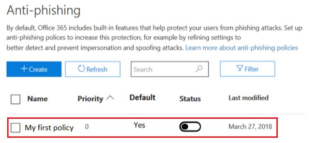
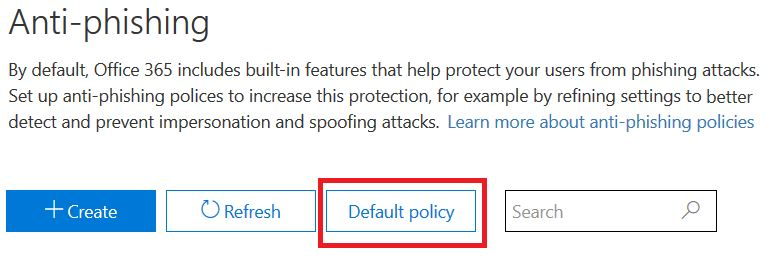
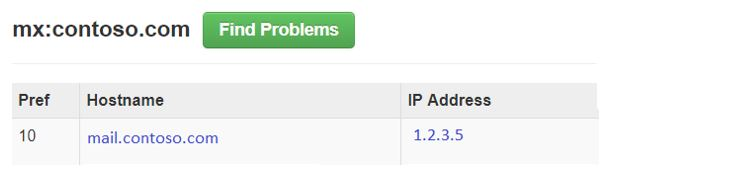

# <a name="anti-spoofing-protection-in-office-365"></a>Skydd mot förfalskning i Office 365

I den här artikeln beskrivs hur Office 365 minskar mot nätfiske-attacker som använder förfalskade avsändardomäner, d.v.s. domäner som är falska. Den åstadkommer detta genom att analysera meddelanden och blockera de som inte kan autentiseras med hjälp av vanliga metoder för e-postautentisering eller någon annan form av anseendeteknik för avsändare. Den här ändringen har implementerats för att minska antalet nätfiskeattacker som organisationer i Office 365 exponeras för.

I den här artikeln förklaras även varför den här ändringen görs, hur kunder kan förbereda sig för den här ändringen, hur du visar meddelanden som kommer att påverkas, hur du rapporterar meddelanden, hur du kan begränsa falska positiva identifieringar samt hur avsändare till Microsoft förbereder den här ändringen.

Microsofts skydd mot förfalskning installerades ursprungligen i organisationer med en Office 365 Enterprise E5-prenumeration eller har köpt tillägget Office 365 avancerat hotskydd (ATP) för prenumerationen. Från och med oktober 2018 utökade vi skyddet även till organisationer som har Exchange Online Protection (EOP). På grund av sättet som alla våra filter lär sig från varandra kan även Outlook.com användare påverkas.

## <a name="how-spoofing-is-used-in-phishing-attacks"></a>Hur förfalskning används i nätfiskeattacker

När det gäller att skydda sina användare tar Microsoft hot om nätfiske på allvar. En av de tekniker som spammare och nätfiskare vanligtvis använder är förfalskning, som är när avsändaren förfalskas och ett meddelande visas som kommer från någon annanstans än den faktiska källan. Tekniken används ofta i nätfiskekampanjer för att få användaruppgifter. Microsofts skydd mot förfalskning undersöker särskilt förfalskning i ”från: huvud”, vilket är den som visas i en e-postklient som Outlook. När Microsoft har stort förtroende för att från: header innehåller falsk data identifierar det meddelandet som en förfalskning.

Falska meddelanden har två negativa konsekvenser för riktiga användare:

### <a name="1-spoofed-messages-deceive-users"></a>1. Falska meddelanden vilseleder användare

I första hand kan falska meddelanden lura användaren att klicka på en länk och ge behörighet, hämta skadlig programvara och svara på ett meddelande med känsligt innehåll (det senare kallas för äventyra företagets e-post). Följande är till exempel ett nätfiske-meddelande med en falsk avsändare av msoutlook94@service.outlook.com:


Ovan kom inte från service.outlook.com, men i stället manipulerades det av nätfiskare så att det ser ut som det gjorde det. Det försöker lura användaren att klicka på länken i meddelandet.

Nästa exempel är att förfalska contoso.com:


Meddelandet ser äkta ut, men i själva verket är falskt. Det här nätfiske-meddelandet är en typ av äventyrande av företagets e-post som är en underkategori av nätfiske.

### <a name="2-users-confuse-real-messages-for-fake-ones"></a>2. Användare misstar riktiga meddelanden som falska

För det andra skapar falska meddelanden osäkerhet för användare som känner till nätfiske-meddelanden, men inte kan se skillnaden mellan ett riktigt meddelande och falsk. Följande exempel är ett exempel på ett faktiskt lösenordsåterställning från e-postadressen för Microsofts säkerhetskonto:


Meddelandet ovan kom från Microsoft, men samtidigt är användare vana vid att få nätfiske-meddelanden som kan lura användaren att klicka på en länk och ge behörighet, hämta skadlig kod eller svara på ett meddelande med känsligt innehåll. Eftersom det är svårt att tala om skillnaden mellan en riktig återställning av lösenord och ett falsk, kommer många användare att bortse från dessa meddelanden, rapportera dem som spam eller att inte alltid rapportera tillbaka till Microsoft som missade nätfiske-bedrägerier.

För att stoppa förfalskning har industrin för e-postfilter tagit fram autentiseringsprotokoll för e-post, till exempel [SPF](https://docs.microsoft.com/office365/SecurityCompliance/set-up-spf-in-office-365-to-help-prevent-spoofing), [DKIM](https://docs.microsoft.com/office365/SecurityCompliance/use-dkim-to-validate-outbound-email)och [DMARC](https://docs.microsoft.com/office365/SecurityCompliance/use-dmarc-to-validate-email). DMARC förhindrar förfalskning från att undersöka ett meddelandes avsändare. Det vill säga att avsändaren som användaren ser i sin e-postklient (i exemplen ovanför det är service.outlook.com, outlook.com och accountprotection.microsoft.com). Dessutom kan användare också se att domänen har passerat SPF eller DKIM, vilket innebär att domänen har autentiserats och därför inte har manipulerats. Om du vill ha mer information kan du läsa avsnittet "*Förstår varför e-postautentisering inte alltid räcker för att stoppa förfalskning"* senare i den här artikeln.

Men problemet är att e-postautentisering är valfritt, inte obligatoriskt. Det innebär att domäner med kraftfulla autentiseringsprinciper som microsoft.com och skype.com skyddas från förfalskning medan domäner som publicerar svagare autentiseringsprinciper eller ingen princip alls, är mål för att bli förfalskade. Till och med mars 2018 har endast 9 % av företag på Fortune 500-listan publicerat starka principer för e-postautentisering. De återstående 91% kan vara förfalskade av en nätfiskare och om e-postfiltret inte upptäcker det med en annan princip kan det levereras till en slutanvändare och vilseleda dem:


Antalet små och medelstora företag som inte finns på Fortune 500-listan som publicerat starka principer för e-postautentisering är mindre och ännu mindre för domäner som ligger utanför Nordamerika och Västeuropa.

Det här är ett stort problem eftersom företagen kanske inte känner till hur e-postautentisering fungerar förstår nätfiskare det och utnyttjar bristen.

Information om hur du konfigurerar SPF, DKIM och DMARC finns i avsnittet "*Kunder med Office 365"* senare i det här dokumentet.

## <a name="stopping-spoofing-with-implicit-email-authentication"></a>Stoppa förfalskning med implicit e-postautentisering

Eftersom nätfiske och spetsad nätfiske är ett sådant problem och på grund av det begränsade införandet av principer för stark e-postautentisering, fortsätter Microsoft att investera i möjligheter för att skydda kunderna. Därför går Microsoft vidare med att fortsätta med *implicit e-postautentisering* – om en domän inte kan verifieras kommer Microsoft att behandla det som om den hade publicerat poster för e-postautentisering och sedan behandla den om den inte går igenom.

För att göra detta har Microsoft skapat flera olika tillägg för vanlig e-postautentisering, till exempel avsändaranseende, avsändar- och mottagarhistorik, beteendeanalys och annan avancerad teknik. Ett meddelande som skickas från en domän som inte publicerat e-postautentisering markeras som förfalskning om det inte innehåller andra signaler för att visa att det är legitimt.

Genom att göra detta kan slutanvändarna ha förtroende för att ett e-postmeddelande som skickas till dem inte har förfalskats, avsändaren kan vara säker på att ingen imiterar deras domän och att kunder med Office 365 kan erbjuda ännu bättre skydd, t. ex. skydd mot imitering.

Mer information om Microsofts allmänna annonsering finns i [Ett hav av nätfiskare Del 2 – förbättrat skydd mot förfalskning i Office 365](https://techcommunity.microsoft.com/t5/Security-Privacy-and-Compliance/Schooling-A-Sea-of-Phish-Part-2-Enhanced-Anti-spoofing/ba-p/176209).

## <a name="identifying-that-a-message-is-classified-as-spoofed"></a>Identifiera att ett meddelande klassificeras som falsk

### <a name="composite-authentication"></a>Sammansatt autentisering.

Medan SPF, DKIM och DMARC är alla användbara i sig själva så att de inte skickar tillräcklig autentiseringsstatus i händelse av att meddelandet inte har några uttryckliga autentiseringsposter. Därför har Microsoft utvecklat en algoritm som kombinerar flera signaler till ett enda värde som kallas sammansatt autentisering eller förkortat till compauth. Kunderna i Office 365 har compauth-värden stämplade i rubriken för *Autentiseringsresultat* i meddelandehuvudena.

```text
Authentication-Results:
  compauth=<fail|pass|softpass|none> reason=<yyy>
```

|**CompAuth-resultat**|**Beskrivning**|
|:-----|:-----|
|misslyckande|Meddelandet misslyckades explicit-autentisering (skickar domänpublicerade poster explicit i DNS) eller implicit autentisering (om domänen inte publicerar poster i DNS, så att Office 365 interpolerade resultatet som om det hade publicerat poster).|
|klara|Meddelandet klarade explicit autentisering (meddelande klarade DMARC eller [Bästa gissning godkände DMARC](https://blogs.msdn.microsoft.com/tzink/2015/05/06/what-is-dmarc-bestguesspass-in-office-365)) eller implicit autentisering med högt förtroende (sändande domän publicerar inte poster i e-postautentisering, men Office 365 har starka serversignaler för att indikerar att meddelandet antagligen är giltigt.)|
|mjukt godkännande|Meddelandet klarade implicit autentisering med låg-till-medelhög förtroende (sändande domän publicerar inte e-postautentisering, men Office 365 har serversignaler för att indikerar att meddelandet är giltigt, men signalens legitimitet är svagare).|
|ingen|Meddelandet autentiserades inte (eller så autentiserades det men kunde det inte justeras), men sammansatt autentisering tillämpas inte på grund av avsändarens rykte eller andra faktorer.|

|||
|:-----|:-----|
|**Orsak**|**Beskrivning**|
|0xx |Meddelandet misslyckade sammansatt autentisering.<br/>**000** innebär att meddelandet misslyckades med att avslå eller karantän.  <br/>**001** innebär att meddelandet misslyckades med implicit e-postautentisering. Det innebär att den sändande domänen inte har publicerat några poster för e-postautentiseringar eller om de har gjort det hade de en svagare policy för misslyckande (SPF mjukt misslyckande eller neutral and DMARC policy för p=ingen).  <br/>**002** innebär att organisationen har en princip för avsändare/domän-par som uttryckligen förbjuder från att skicka förfalskade e-postmeddelanden anges inställningen manuellt av en administratör.  <br/>**010** innebär att meddelandet misslyckade DMARC med att avslå eller sätta i karantän och att den sändande domänen är en av organisationens godkända domäner (det här är en del av själv-till-själv eller intra-organisatoriska och förfalskningar).|
|1xx, 2xx, 3xx, 4xx och 5xx|Motsvara olika interna koder för varför ett meddelande klarade implicit autentisering eller ingen autentisering användes, men ingen åtgärd användes.|
|6xx|Innebär att meddelandet inte klarade implicit e-postautentisering och att den sändande domänen är en av organisationens godkända domäner (det här är en del av själv-till-själv eller intra-organisatoriska, förfalskning).|

Genom att titta på meddelandets rubriker kan en administratör eller till och med en slutanvändare bestämma hur Office 365 kommer till slutsatsen att avsändaren kan vara förfalskad.

### <a name="differentiating-between-different-types-of-spoofing"></a>Skillnader mellan olika typer av förfalskning

Microsoft skiljer mellan två olika typer av förfalskade meddelanden:

#### <a name="intra-org-spoofing"></a>Intra-organisatorisk förfalskning

Det här kallas även för själv-till-själv förfalskningar när domänen i från: adressen är samma som eller i linje med, mottagarens domän (när en mottagardomän är en av organisationens [godkända domäner](https://docs.microsoft.com/exchange/mail-flow-best-practices/manage-accepted-domains/manage-accepted-domains)). Eller när domänen i Från: adressen är en del av samma organisation.

Följande har till exempel avsändare och mottagare från samma domän (contoso.com). Mellanslag infogas i e-postadressen för att förhindra att spam-robotar skördar på den här sidan:

> Från: avsändare @ contoso.com <br/> Till: mottagare @ contoso.com

I följande har domänerna för avsändare och mottagare justerats till organisationens domän (fabrikam.com):

> Från: avsändare @ foo.fabrikam.com <br/> Till: mottagare @ bar.fabrikam.com

Följande domäner för avsändare och mottagare är olika (microsoft.com och bing.com), men de tillhör samma organisation (d.v.s. båda är en del av organisationens godkända domäner):

> Från: avsändare @ microsoft.com <br/> Till: mottagare @ bing.com

Meddelanden som inte klarar intra-organisatorisk förfalskning innehåller följande värden i huvudena:

`X-Forefront-Antispam-Report: ...CAT:SPM/HSPM/PHSH;...SFTY:9.11`

CAT:en är meddelandets kategori och stämplas vanligtvis med SPM (spam), men ibland kan det hända att HSPM (spam med högt förtroende) eller PHISH (nätfiske) beroende på vilka andra typer av mönster som förekommer i meddelandet.

SFTY är säkerhetsnivån i meddelandet, den första siffran (9) innebär att meddelandet är nätfiske och andra uppsättningen med siffror efter punkten (11) innebär att det är en intra-organisatorisk förfalskning.

Det finns ingen särskild orsakskod för sammansatt autentisering för intra-organisatorisk förfalskning som kommer att stämplas senare i 2018 (tidslinje har ännu inte definierats).

#### <a name="cross-domain-spoofing"></a>Förfalskning med flera domäner

Detta inträffar när den sändande domänen i Från: adress är en extern domän till den mottagande organisationen. Meddelanden som inte klarade sammansatt autentisering på grund av förfalskning med flera domäner innehåller följande värden i huvudena:

`Authentication-Results: ... compauth=fail reason=000/001`

`X-Forefront-Antispam-Report: ...CAT:SPOOF;...SFTY:9.22`

I båda fallen stämplas följande röda säkerhetstips i meddelandet eller motsvarande som anpassas till mottagarens postlådas språk:


Bara genom att titta på Från: adress och veta vad din mottagande e-postadress är eller genom att inspektera e-postrubrikerna, som du kan använda för att skilja mellan intra-organisatorisk förfalskning och förfalskning mellan flera domäner.

## <a name="how-customers-of-office-365-can-prepare-themselves-for-the-new-anti-spoofing-protection"></a>Hur kunder som har Office 365 kan förbereda sig för nya skydd mot förfalskning

### <a name="information-for-administrators"></a>Information för administratörer

Som administratör för en organisation i Office 365 finns det flera viktiga delar av information som du bör känna till.

### <a name="understanding-why-email-authentication-is-not-always-enough-to-stop-spoofing"></a>Förstå varför e-postautentisering inte alltid är tillräckligt för att stoppa förfalskning

Det nya skydd mot förfalskning är beroende av e-postautentisering (SPF, DKIM och DMARC) för att inte markera ett meddelande som en förfalskning. Ett vanligt exempel är när en avsändande domän aldrig har publicerade SPF-poster. Om det inte finns några SPF-poster eller om de är felkonfigurerade kommer ett skickat meddelande att markeras som förfalskning, såvida inte Microsoft har information om serverdelen som säger att meddelandet är legitimt.

Om du till exempel använder ett skydd mot förfalskning, kan ett meddelande visas som följande med ingen SPF-post, ingen DKIM-post och ingen DMARC-post:

```text
Authentication-Results: spf=none (sender IP is 1.2.3.4)
  smtp.mailfrom=fabrikam.com; contoso.com; dkim=none
  (message not signed) header.d=none; contoso.com; dmarc=none
  action=none header.from=fabrikam.com;
From: sender @ fabrikam.com
To: receiver @ contoso.com
```

Om du har Office 365 Enterprise E5, EOP eller ATP stämplas compauth-värdet:

```text
Authentication-Results: spf=none (sender IP is 1.2.3.4)
  smtp.mailfrom=fabrikam.com; contoso.com; dkim=none
  (message not signed) header.d=none; contoso.com; dmarc=none
  action=none header.from=fabrikam.com; compauth=fail reason=001
From: sender @ fabrikam.com
To: receiver @ contoso.com
```

Om fabrikam.com har åtgärdats genom att konfigurera en SPF-post, men inte en DKIM-post skulle detta resultera i sammansatt autentisering eftersom domänen som klarat SPF justerad mot domänen i Från: adress:

```text
Authentication-Results: spf=pass (sender IP is 1.2.3.4)
  smtp.mailfrom=fabrikam.com; contoso.com; dkim=none
  (message not signed) header.d=none; contoso.com; dmarc=bestguesspass
  action=none header.from=fabrikam.com; compauth=pass reason=109
From: sender @ fabrikam.com
To: receiver @ contoso.com
```

Eller om de konfigurerar en DKIM-post men inte en SPF-post kommer det även att skicka sammansatt autentisering eftersom domänen i DKIM-signaturen som godkändes är justerad med domänen i Från: adress:

```text
Authentication-Results: spf=none (sender IP is 1.2.3.4)
  smtp.mailfrom=fabrikam.com; contoso.com; dkim=pass
  (signature was verified) header.d=outbound.fabrikam.com;
  contoso.com; dmarc=bestguesspass action=none
  header.from=fabrikam.com; compauth=pass reason=109
From: sender @ fabrikam.com
To: receiver @ contoso.com
```

Däremot kan en nätfiskare även konfigurera SPF-och DKIM och signera meddelandet med den egna domänen, men ange en annan domän i Från: adress. Ingen SPF eller DKIM kräver att domänen stämmer överens med domänen i Från: adressen, så om fabrikam.com publiceras DMARC poster skulle detta inte markeras som en förfalskning med DMARC:

```text
Authentication-Results: spf=pass (sender IP is 5.6.7.8)
  smtp.mailfrom=maliciousDomain.com; contoso.com; dkim=pass
  (signature was verified) header.d=maliciousDomain.com;
  contoso.com; dmarc=none action=none header.from=fabrikam.com;
From: sender @ fabrikam.com
To: receiver @ contoso.com
```

I e-postklienten (Outlook, Outlook på webben och andra e-postklienter) visas bara Från: domänen, inte domänen i SPF eller DKIM och det kan vilseleda användaren att tänka på att meddelandet kommer från fabrikam.com, men faktiskt kom från maliciousDomain.com.


Av den anledningen kräver Office 365 att domänen i Från: adress justeras mot domänen i SPF- eller DKIM-signaturen och om den inte gör det, innehåller några andra interna signaler som anger att meddelandet är giltigt. Annars skulle meddelandet bli ett compauth-fel.

```text
Authentication-Results: spf=none (sender IP is 5.6.7.8)
  smtp.mailfrom=maliciousDomain.com; contoso.com; dkim=pass
  (signature was verified) header.d=maliciousDomain.com;
  contoso.com; dmarc=none action=none header.from=contoso.com;
  compauth=fail reason=001
From: sender@contoso.com
To: someone@fabrikam.com
```

Därför skyddar Office 365 skydd mot förfalskning mot domäner med ingen autentisering och gentemot domäner som konfigurerat autentisering men inte överensstämmer med domänen i Från: adress som är den som användaren ser och som anses vara avsändaren av meddelandet. Det här gäller både domäner utanför din organisation och domäner i din organisation.

Om du får ett meddelande om inte klarade sammansatt autentisering och som har markerats som förfalskningar, beror det på att den domän som godkände SPF och DKIM inte justeras mot domänen i Från: adress.

### <a name="understanding-changes-in-how-spoofed-emails-are-treated"></a>Förstå förändringar i hur förfalskade e-postmeddelanden behandlas

För närvarande är för alla organisationer i Office 365 – ATP och icke-ATP – meddelanden som inte klarar DMARC med en princip om avvisande eller karantän markeras som spam och som vanligtvis tar spam med hög förtroende eller ibland den vanliga spamåtgärden (beroende på om andra spamreglerna identifierar den först som spam). Identifiering av intra-organisatorisk förfalskning tar den vanliga spamåtgärden. Det här beteendet behöver inte vara aktiverat och kan inte heller inaktiveras.

Men innan den här förändringen skulle förfalskade meddelande med flera domäner gå igenom de vanliga kontrollerna för spam, nätfiske och skadlig kod och om andra delar av filtret skulle identifierar dem som misstänkta märka dem som spam, nätfiske eller skadlig kod. Med det nya skyddet mot förfalskning med flera domäner kommer åtgärden som är definierad i principen för nätfiske \> förfalskning som standard gälla på alla meddelanden som inte kan autentiseras. Om ingen är definierad flyttas det till användarens mapp för skräppost. I vissa fall kommer mer misstänkta meddelanden också att ha det röda säkerhetstipset tilllagda i meddelandet.

Detta kan resultera i att vissa meddelanden som tidigare markerats som spam fortfarande blir markerade som spam, men de kommer också ha ett rött säkerhetstips. I andra fall kommer meddelanden som tidigare markerats som icke-spam kommer att börja markeras som spam (CAT:SPOOF) med ett rött säkerhetstips tillagt. I andra fall ser kunder som flyttade allt spam och nätfiske till karantänen nu kommer att se att de hamnar i mappen skräppost (det här beteendet kan ändras, se [Att ändra inställningarna för din skydd mot förfalskning](#changing-your-anti-spoofing-settings)).

Det finns flera olika sätt för ett meddelande kan förfalskas (mer information finns i [Skillnader mellan olika typer av förfalskningar](#differentiating-between-different-types-of-spoofing) tidigare i den här artikeln) och från och med den mars 2018 kommer sättet som Office 365 behandlar dessa meddelanden inte att vara enhetliga. I följande tabell får du en snabb sammanfattning om hur skydd mot följande med flera domäner kommer att ha nya beteenden:

|**Typ av förfalskning**|**Kategori**|**Har säkerhetstips lagts till?**|**Gäller för**|
|:-----|:-----|:-----|:-----|
|DMARC misslyckande (karantän eller avvisande)|HSPM (standard), kan också vara SPM eller PHSH|Nej (inte än)|Alla Office 365-kunder, Outlook.com|
|Själv-till-Själv|SPM|Ja|Alla Office 365-organisationer, Outlook.com|
|Flera domäner|FÖRFALSKNING|Ja|Office 365 Avancerat hotskydd och E5-kunder|

### <a name="changing-your-anti-spoofing-settings"></a>Ändra inställningar för skydd mot förfalskning

Om du vill skapa eller uppdatera inställningar för skydd mot förfalskning (flera domäner) går du till fliken Principer hothantering \> inställningar för skydd mot förfalskning och nätfiske \> i Säkerhets- och efterlevnadscenter. Om du aldrig har skapat några inställningar för skydd mot nätfiske måste du skapa en:


Om du redan har skapat en kan du välja det för att ändra det:



Välj den princip du just skapade och gå igenom stegen som beskrivs i [Läs mer om förfalskningsinformation](learn-about-spoof-intelligence.md).


Så här skapar du en ny princip med hjälp av PowerShell:

```powershell
$org = Get-OrganizationConfig
$name = "My first anti-phishing policy for " + $org.Name
# Note: The name should not exclude 64 characters, including spaces.
# If it does, you will need to pick a smaller name.
# Next, create a new anti-phishing policy with the default values
New-AntiphishPolicy -Name $Name
# Select the domains to scope it to
# Multiple domains are specified in a comma-separated list
$domains = "domain1.com, domain2.com, domain3.com"
# Next, create the anti-phishing rule, scope it to the anti-phishing rule
New-AntiphishRule -Name $name -AntiphishPolicy $name -RecipientDomainIs $domains
```

Du kan sedan ändra principparametrarna för skydd mot nätfiske med PowerShell genom att följa dokumentationen på [Konfigurera princip för skydd mot nätfiske](https://docs.microsoft.com/powershell/module/exchange/advanced-threat-protection/Set-AntiPhishPolicy). Du kan ange $name som en parameter:

```powershell
Set-AntiphishPolicy -Identity $name <fill in rest of parameters>
```

Senare i 2018, i stället för att skapa en standardprincip, skapas en för dig som gäller för alla mottagare i din organisation så att du inte behöver ange den manuellt (skärmbilderna nedan kan komma att ändras före den slutliga implementationen).



Till skillnad från en princip som du skapar kan du inte ta bort standardprincipen, ändra dess prioritet eller välja vilka användare, domäner och grupper som ska omfattas av den.


Konfigurera standardskydd genom att använda PowerShell:

```powershell
$defaultAntiphishPolicy = Get-AntiphishPolicy | ? {$_.IsDefault -eq $true}
Set-AntiphishPolicy -Identity $defaultAntiphishPolicy.Name -EnableAntispoofEnforcement <$true|$false>
```

Du bör bara inaktivera skydd mot förfalskning om du har en annan e-postserver eller servrar framför Office 365 (se legitima scenarier för att inaktivera skydd mot förfalskning för mer information).

```powershell
$defaultAntiphishPolicy = Get-AntiphishiPolicy | ? {$_.IsDefault $true}
Set-AntiphishPolicy -Identity $defaultAntiphishPolicy.Name -EnableAntispoofEnforcement $false
```

> [!IMPORTANT]
> Om det första hoppet i din e-postsökväg är Office 365 och du får för många legitima e-postmeddelanden markerade som förfalskningar, bör du först konfigurera avsändarna som tillåts skicka förfalskade e-postmeddelanden till din domän (se [Hantera legitima avsändare som skickar icke autentiserad e-postmeddelanden](#managing-legitimate-senders-who-are-sending-unauthenticated-email) i det här ämnet. Om du fortfarande får för många falska positiva identifieringar (legitima meddelanden markerade som förfalskningar) rekommenderar vi INTE att du inaktiverar skydd mot förfalskning helt. I stället rekommenderar vi att du väljer grundläggande istället för högt skydd. Det är bättre att arbeta genom falska positiva identifieringar än att utsätta din organisation för förfalskade e-postmeddelanden som skulle kunna medföra avsevärda höga kostnader på lång sikt.

### <a name="managing-legitimate-senders-who-are-sending-unauthenticated-email"></a>Hantera legitima avsändare som skickar icke autentiserade e-postmeddelanden

Office 365 håller reda på vem som skickar icke autentiserad e-post till din organisation. Om tjänsten anser att avsändaren inte är giltig, kommer den att markeras som ett *compauth* fel. De kommer att klassificeras som FALSKA, men det beror på vilken policy mot förfalskning som användes för meddelandet.

Men som administratör kan du ange vilka avsändare som tillåts att skicka falska e-postmeddelanden och åsidosätta Office 365-beslutet.

#### <a name="method-1---if-your-organization-owns-the-domain-set-up-email-authentication"></a>Metod 1 – om din organisation äger domänen ska du konfigurera e-postautentisering

Med den här metoden kan du lösa problem med intra-organisatorisk förfalskning och förfalskningar med flera olika domäner i fall där du äger eller interagerar med flera klientorganisationer. Den hjälper dig också att lösa problem med förfalskning med flera olika domäner där du skickar till andra kunder inom Office 365 och även tredje part som är värd för andra leverantörer.

Mer information finns i [Kunder för Office 365](#customers-of-office-365).

#### <a name="method-2---use-spoof-intelligence-to-configure-permitted-senders-of-unauthenticated-email"></a>Metod 2 – Använd information om förfalskning för att konfigurera tillåta avsändare för icke autentiserad e-post

Du kan också använda [Information om förfalskning](learn-about-spoof-intelligence.md) för att tillåta att avsändare skickar icke autentiserade meddelanden till din organisation.

För externa domäner är den falska användaren domänen i Från-adressen, medan den sändande infrastrukturen är antingen den sändande IP-adressen (indelad i/24 CIDR-intervall) eller organisations domänen för PTR-posten (i skärmbilden nedan, så visas den sändande IP-131.107.18.4 vars PTR-post är outbound.mail.protection.outlook.com och detta skulle visas som outlook.com för den sändande infrastrukturen).

Om du vill tillåta att avsändaren skickar icke autentiserade e-postmeddelanden ändrar du **Nej** till **Ja**.


Du kan också använda PowerShell för att tillåta särskilda avsändare att förfalska din domän:

```powershell
$file = "C:\My Documents\Summary Spoofed Internal Domains and Senders.csv"
Get-PhishFilterPolicy -Detailed -SpoofAllowBlockList -SpoofType External | Export-CSV $file
```


I föregående bild har ytterligare radbrytningar lagts till så att skärmbilden får plats. Vanligtvis visas alla värden på en enda rad.

Redigera filen och leta efter raden som motsvarar outlook.com och bing.com och ändra AllowedToSpoof-inmatningen från Nej till Ja:


Spara filen och kör sedan:

```powershell
$UpdateSpoofedSenders = Get-Content -Raw "C:\My Documents\Spoofed Senders.csv"
Set-PhishFilterPolicy -Identity Default -SpoofAllowBlockList $UpdateSpoofedSenders
```

Nu kan bing.com skicka icke autentiserade e-postmeddelanden från \*.outlook.com.

#### <a name="method-3---create-an-allow-entry-for-the-senderrecipient-pair"></a>Metod 3 – skapa en Tillåt-post för avsändare/mottagare-par

Du kan också välja att kringgå all spam-filtrering för en viss avsändare. Mer information finns i [Hur du säkert lägger till en avsändare i en lista över tillåtna avsändare i Office 365](https://blogs.msdn.microsoft.com/tzink/2017/11/29/how-to-securely-add-a-sender-to-an-allow-list-in-office-365/).

Om du använder den här metoden kommer den att hoppa över spam och en del av nätfiske-filtreringen, men inte att filtrera skadlig kod.

#### <a name="method-4---contact-the-sender-and-ask-them-to-set-up-email-authentication"></a>Metod 4 – kontakta avsändaren och be honom eller henne att konfigurera e-postautentisering

På grund av problem med spam och nätfiske rekommenderar Microsoft att alla avsändare konfigurerar e-postautentisering. Om du känner till administratören för den sändande domänen kan du kontakta dem och begära att de konfigurerar poster för e-postautentisering så att du inte behöver lägga till några åsidosättningar. Om du vill ha mer information kan du läsa [Administratörer av domäner som inte är Office 365-kunder](#administrators-of-domains-that-are-not-office-365-customers)" senare i den här artikeln.

Men det kan vara svårt att komma igång med att få avsändardomäner autentiserade kommer de att konfigurera korrekta poster för att försäkra bättre leverans då fler och fler e-postfilter starta att skräpa eller till och med avvisa deras meddelanden.

### <a name="viewing-reports-of-how-many-messages-were-marked-as-spoofed"></a>Visa rapporter om hur många meddelanden som har markerats som förfalskningar

När principen om skydd mot förfalskning är aktiverad kan du använda hotgransknings- och svarsfunktioner för att få nummer om hur många meddelanden som markeras som nätfiske. Om du vill göra det går du till Säkerhets- och efterlevnadscenter (SCC) under Hothantering \> Explorer, konfigurera vyn till Nätfiske och gruppera efter avsändardomän eller skyddsstatus:


Du kan interagera med olika rapporter för att se hur många som har markerats som nätfiske, inklusive meddelanden som markerats som FALSKA. Mer information finns i [Kom igång med Office 365 Hotutredning och svar](office-365-ti.md).

Du kan inte skilja ut vilka meddelanden som har markerats på grund av förfalskning jämfört med andra typer av nätfiske (allmän nätfiske, imitering av domän och användare och så vidare). Dock kommer du att kunna göra detta via Säkerhets och efterlevnadscenter. När du har gjort det kan du använda den här rapporten som startpunkt för att identifiera avsändardomäner som kan vara legitima och som är markerade som förfalskningar på grund av misslyckad autentisering.

Följande skärmbild är ett förslag på hur dessa data kommer att se ut, men kan ändras när de släpps:


För icke-ATP och E5-kunder kommer rapporterna att bli tillgängliga senare under Hotskyddsstatus-rapporter (TPS), men kommer att försenas med minst 24 timmar. Den här sidan kommer att uppdateras när de integreras i Säkerhets- och efterlevnadscenter.

### <a name="predicting-how-many-messages-will-be-marked-as-spoof"></a>Förutsäga hur många meddelanden som ska markeras som förfalskningar

När Office 365 uppdaterar sina inställningar så att du kan inaktivera verkställande av skydd mot förfalskning eller aktivera med grundläggande och hög verkställande kommer du att kunna se hur meddelandedispositionen ändras med olika inställningar. Det innebär att om skydd mot förfalskning är inaktiverat kan du se hur många meddelanden som identifieras som falska om du ändrar till standard. Eller om den är standard kommer du att kunna se hur många fler meddelanden som identifieras som falska om du sätter den till Hög.

Den här funktionen är för närvarande under utveckling. När mer information har definierats uppdateras den här sidan både med skärmbilder av säkerhets- och efterlevnadscenter samt med PowerShell-exemplen.


### <a name="legitimate-scenarios-to-disable-anti-spoofing"></a>Legitima scenarier för att inaktivera skydd mot förfalskning

Skydd mot förfalskning skyddar kunderna mot nätfiske och därför rekommenderas starkt från att inaktivera skydd mot förfalskning. Om du inaktiverar den här funktionen kan du lösa vissa kortfristiga falska positiva identifieringar, men långsiktigt kommer du att bli utsatt för större risker. Kostnaden för att konfigurera autentisering på avsändarens sida eller göra justeringar av nätfiske-principer är vanligtvis engångshändelser eller kräver endast minimalt, periodiskt underhåll. Kostnaden för att återställa från ett nätfiske-angrepp där data har exponerats eller tillgångar har komprometterats, är mycket högre.

Därför är det bättre att arbeta igenom falska positiva identifieringar av förfalskningar än att inaktivera skydd mot förfalskning.

Det finns dock ett legitimt scenario där skydd mot förfalskning vara inaktiverad och det är när det finns ytterligare e-postfiltrerade produkter i meddelandets rutt och Office 365 inte är det första hoppet i e-postvägen:


Den andra servern kan vara en lokalt placerad Exchange e-postserver, en e-postfiltrerande enhet som IronPort eller någon annan värdtjänst för molnet.

Om MX-posten för mottagardomänen inte pekar på Office 365, behöver du inte inaktivera skydd mot förfalskning eftersom Office 365 letar upp den mottagande domänens MX-post och inaktiverar skydd mot förfalskning om det pekar på en annan tjänst. Om du inte vet om du har en annan server i din domän kan du använda en webbplats som MX-verktygslåda för att kontrollera MX-posten. Den kan säga något av följande:



Den här domänen har en MX-post som inte pekar på Office 365, så Office 365 tillämpar inte skydd mot förfalskning.

Om MX-posten för mottagarens domän *verkligen* pekar mot Office 365, trots att det finns en annan tjänst framför Office 365, ska du inaktivera skydd mot förfalskning. Det vanligaste exemplet är att använda en omskrivning av mottagare:


MX-posten för domänen contoso.com pekar på den lokala servern medan MX-posten för domänen @office365.contoso.net pekar på Office 365 eftersom den innehåller \*.protection.outlook.com eller \*.eo.outlook.com i MX-posten:


Se till att göra skillnad på när MX-posten för en mottagardomän inte pekar på Office 365 och när den har genomgått en omskrivning. Det är viktigt att veta skillnaden mellan dessa två fall.

Om du är osäker på att din domän har genomgått en omskrivning av mottagare eller inte kan du ibland se det genom att titta på meddelandehuvudena.

a) börja med att titta på rubrikerna i meddelandet för mottagarens domän i rubriken verifieringsresultat:

```text
Authentication-Results: spf=fail (sender IP is 1.2.3.4)
  smtp.mailfrom=fabrikam.com; office365.contoso.net; dkim=fail
  (body hash did not verify) header.d=simple.fabrikam.com;
  office365.contoso.net; dmarc=none action=none
  header.from=fabrikam.com; compauth=fail reason=001
```

Mottagardomänen finns i den fetstilta röda texten ovan, i det här fallet office365.contoso.net. Det här kan vara en skillnad på att mottagaren i Till: rubrik:

Till: exempel mottagare \<mottagare @ contoso.com\>

Utför en MX-postsökning av den faktiska mottagarens domän. Om det innehåller \*.protection.outlook.com, mail.messaging.microsoft.com, \*.eo.outlook.com eller mail.global.frontbridge.com, innebär det att MX pekar på Office 365.

Om den inte innehåller de värdena innebär det att MX inte pekar på Office 365. Ett verktyg som du kan använda för att kontrollera det här är MX-verktygslåda.

I det här exemplet säger följande att contoso.com, den domän som ser ut som mottagare eftersom den var Till: rubrik, MX-post pekar på en lokal server:


Den faktiska mottagaren är dock office365.contoso.net vars MX-post pekar på Office 365:


Därför har meddelandet troligen genomgått en omskrivning av mottagare.

b) se till att skilja mellan vanliga användningsfall av omskrivna mottagare. Om du ska skriva om mottagardomänen till \*.onmicrosoft.com skriver du i stället om den till \*. mail.onmicrosoft.com.

När du har identifierat den slutliga mottagarens domän som dirigeras bakom en annan server och mottagardomänens MX-post pekar på Office 365 (som publicerad i dess DNS-poster) kan du fortsätta att inaktivera skydd mot förfalskning.

Kom ihåg att du inte vill inaktivera skydd mot förfalskning om domänens första hopp i ruttvägen är Office 365, men bara när det ligger bakom en eller flera-tjänster.

### <a name="how-to-disable-anti-spoofing"></a>Inaktivera skydd mot förfalskning

Om du redan har skapat en princip för nätfiske kan du ställa in parametern *EnableAntispoofEnforcement* på $false:

```powershell
$name = "<name of policy>"
Set-AntiphishPolicy -Identity $name -EnableAntiSpoofEnforcement $false
```

Om du inte vet namnet på principen (eller principerna) som ska inaktiveras kan du visa dem:

```powershell
Get-AntiphishPolicy | Format-List Name
```

Om du inte har några befintliga principer för nätfiske kan du skapa en och inaktivera den (även om du inte har någon policy, används inte skydd mot förfalskning. Senare under 2018 kommer en standardprincip att skapas åt dig och du kan sedan inaktivera den i stället för att skapa en). Du måste göra detta i flera steg:

```powershell
$org = Get-OrganizationConfig
$name = "My first anti-phishing policy for " + $org.Name
# Note: If the name is more than 64 characters, you will need to choose a smaller one
```

```powershell
# Next, create a new anti-phishing policy with the default values
New-AntiphishPolicy -Name $Name
# Select the domains to scope it to
# Multiple domains are specified in a comma-separated list
$domains = "domain1.com, domain2.com, domain3.com"
# Next, create the anti-phishing rule, scope it to the anti-phishing rule
New-AntiphishRule -Name $name -AntiphishPolicy -RecipientDomainIs $domains
# Finally, scope the anti-phishing policy to the domains
Set-AntiphishPolicy -Identity $name -EnableAntispoofEnforcement $false
```

Inaktivera skydd mot förfalskning är endast tillgängligt via cmdlet (senare blir det tillgängligt i säkerhets- och efterlevnadscenter). Om du inte har tillgång till PowerShell skapar du ett supportärende.

Kom ihåg att det bara ska användas för domäner som genomgår indirekt rutt vid sändning till Office 365. Det är bättre att arbeta sig igenom dem än att falla för frestelsen att inaktivera skydd mot förfalskning eftersom det finns falska positiva identifieringar.

### <a name="information-for-individual-users"></a>Information för enskilda användare

Enskilda användare är begränsade till hur de kan samverka med säkerhetstipset för skydd mot förfalskning. Det finns dock flera saker du kan göra för att lösa vanliga scenarier.

### <a name="common-scenario-discussion-lists"></a>Vanligt scenario: Diskussionslistor

Diskussionslistor har visat sig orsaka problem med skydd mot förfalskning beroende på hur de vidarebefordrar meddelandet och ändrar innehållet men behåller den ursprungliga Från: adressen.

Anta till exempel att Gabriela Laureano (glaureano @ contoso.com) är intresserad av att titta på fåglar och att gå med i diskussionslistan Birdwatchers @ fabrikam.com. När hon skickar ett meddelande till diskussionslistan ser det ut så här:

> **Från:** Gabriela Laureano \<glaureano @ contoso.com\> <br/> **Till:** Birdwatcher diskussionslistan \<Birdwatchers @ fabrikam.com\> <br/> 
**Ämne:** fantastisk visning av blåskrika längst upp i Mt. Rainier denna vecka <br/><br/>Vem vill kolla in visningen av den här veckan från MT. Rainier?

När e-postlistan får meddelandet formateras meddelandet, ändras innehållet och spelar upp det igen till resten av medlemmarna på diskussionslistan som har skapats av deltagare från flera olika e-postmottagare.

> **Från:** Gabriela Laureano \<glaureano @ contoso.com\> <br/> **Till:** Birdwatcher diskussionslistan \<Birdwatchers @ fabrikam.com\> <br/> **Ämne:** [BIRDWATCHERS] fantastisk visning av blåskrika längst upp i Mt. Rainier denna vecka <br/><br/> Vem vill kolla in visningen av den här veckan från MT. Rainier? <br/><br/> Meddelandet skickades till Birdwatchers diskussionslista. Du kan avbryta prenumerationen när du vill.

I det här exemplet har det omfiltrerade meddelandet samma Från: adress (glaureano @ contoso.com), men det ursprungliga meddelandet har ändrats genom att lägga till en tagg i ämnesraden och en sidfot längst ned i meddelandet. Den här typen av meddelandeändringar är gemensam i e-postlistor och kan resultera i falska positiva identifieringar.

Om du eller någon i din organisation är administratör för distributionslistan kan du eventuellt konfigurera den så att den klarar kontroller av skydd mot förfalskning.

- Läs vanliga frågor och svar på DMARC.org: [Jag sköter en distributionslista och jag vill samarbeta med DMARC, vad ska jag göra?](https://dmarc.org/wiki/FAQ#I_operate_a_mailing_list_and_I_want_to_interoperate_with_DMARC.2C_what_should_I_do.3F)

- Läs anvisningarna i det här blogginlägget: [Ett tips för distributionslistans operatörer för samverkan med DMARC för att undvika fel](https://blogs.msdn.microsoft.com/tzink/2017/03/22/a-tip-for-mailing-list-operators-to-interoperate-with-dmarc-to-avoid-failures/)

- Överväg att installera uppdateringar på din server för distributionslistor för att stödja ARC, se [https://arc-spec.org](https://arc-spec.org/)

Om du inte äger distributionslistan:

- Du kan begära att underhållaren för distributionslistan tillämpar något av de tidigare alternativen (de ska också ha konfigurerat e-postautentisering för domänen som distributionslistan vidarebefordrar från).

- Du kan skapa regler för e-postlådan i din e-postklient för att flytta meddelanden till Inkorgen. Du kan också begära att organisationens administratörer ska kunna konfigurera regler för att tillåter eller åsidosätta som beskrivs i avsnittet [Hantering av legitima avsändare som skickar icke autentiserad e-postmeddelanden](#managing-legitimate-senders-who-are-sending-unauthenticated-email) i det här ämnet.

- Du kan skapa ett supportärende med Office 365 för att skapa en åsidosättning för distributionslistan så att den behandlas som legitim.

### <a name="other-scenarios"></a>Andra scenarier

1. Om inget av ovanstående vanliga scenarier gäller för din situation kan du rapportera meddelandet som falskt positivt tillbaka till Microsoft. Om du vill ha mer information kan du läsa avsnittet [Hur rapporterar jag spam- eller inte spam-meddelanden tillbaka till Microsoft?](#how-can-i-report-spam-or-non-spam-messages-back-to-microsoft) senare i den här artikeln.

2. Du kan också kontakta din e-postadministratör som kan skapa ett supportärende med Microsoft. Microsofts teknikerteam undersöker varför meddelandet har markerats som falska.

3. Om du vet vem som är avsändaren och är säker på att de inte uppsåtligt är förfalskade kan du svara dig tillbaka till avsändaren som anger att de skickar meddelanden från en e-postserver som inte autentiseras. Det resulterar ibland i att den ursprungliga avsändaren kontaktar sin IT-administratör och som konfigurerar de autentiseringsposter för e-post som krävs.

   Om det finns tillräckligt med avsändare svarar domänägare att de ska konfigurera poster för e-postautentisering kan det leda till åtgärder. Microsoft samarbetar även med domänägare för att publicera nödvändiga poster, men det hjälper ännu mer när enskilda användare begär det.

4. Om du vill kan du lägga till avsändaren i listan med betrodda avsändare. Tänk dock på att om ett nätfiskare förfalskar kontot kommer det att levereras till din e-postlåda. Därför bör alternativet användas sparsamt.

## <a name="how-senders-to-microsoft-should-prepare-for-anti-spoofing-protection"></a>Hur avsändare till Microsoft ska förbereda skydd mot förfalskning

Om du är administratör som för närvarande skickar meddelanden till Microsoft, antingen Office 365 eller Outlook.com, bör du kontrollera att din e-post autentiseras. I annat fall kan det bero på att den har markerats som spam eller nätfiske.

### <a name="customers-of-office-365"></a>Kunder som har Office 365

Om du är Office 365-kund och använder Office 365 för att skicka utgående e-post:

- [Konfigurera SPF i Office 365 för att förhindra förfalskning](set-up-spf-in-office-365-to-help-prevent-spoofing.md) för dina domäner

- [Använd DKIM för att validera utgående e-post som skickas från din egna domän i Office 365](use-dkim-to-validate-outbound-email.md) för dina primära domäner

- [Överväg att konfigurera DMARC poster](use-dmarc-to-validate-email.md) för din domän för att avgöra vem som är din legitima avsändare

Microsoft tillhandahåller inga detaljerade riktlinjer för implementering för SPF, DKIM och DMARC. Det finns emellertid mycket information som publiceras online. Det finns även tredje parts-företag som arbetar för att hjälpa din organisation att konfigurera e-postautentiseringar.

### <a name="administrators-of-domains-that-are-not-office-365-customers"></a>Administratörer av domäner som inte är Office 365-kunder

Om du är domänadministratör men inte är en Office 365-kund:

- Du bör konfigurera SPF för att publicera domänens sändande IP-adresser och även konfigurera DKIM (om tillgängligt) för att digitalt signera meddelanden. Du kan också överväga att konfigurera DMARC-poster.

- Om du har avsändare av massutskick som skickar e-post åt dig ska du arbeta med dem för att skicka e-post på ett sätt som gör att den sändande domänen i Från: adress (om den tillhör dig) stämmer överens med den domän som vidarebefordrar SPF- eller DMARC.

- Om du har lokala e-postservrar eller skickar från en programvaruleverantör eller från en molnbaserade tjänst som Microsoft Azure, GoDaddy, Rackspace, Amazon Web Services eller liknande ska du se till att de läggs till i SPF-posten.

- Om du är en liten domän som finns på en Internetleverantör ska du konfigurera SPF-posten enligt anvisningarna som tillhandahålls av din Internetleverantör. De flesta Internetleverantörer tillhandahåller dessa typer av instruktioner och finns på företagets supportsidor.

- Även om du inte har publicerat poster för e-postautentisering tidigare och den fungerat bra måste du ändå publicera poster för e-postautentisering som ska skickas till Microsoft. Tack vare detta kommer du att hjälpa till att bekämpa nätfiske och minska risken för att du eller organisationer som du skickar till blir nätfiskade.

### <a name="what-if-you-dont-know-who-sends-email-as-your-domain"></a>Vad gör jag om du inte vet vem som skickar e-post som din domän?

Många domäner publicerar inte SPF-poster eftersom de inte vet vem alla deras avsändare är. Du behöver inte känna till vem alla är. I stället ska du komma igång genom att publicera en SPF-post för de som du känner till, särskilt där din företagstrafik ligger och publicera en neutral SPF-princip `?all`:

```text
fabrikam.com IN TXT "v=spf1 include:spf.fabrikam.com ?all"
```

Den neutrala SPF-principen innebär att e-post som kommer från din företags infrastruktur ska skicka e-post till alla andra e-postmottagare. E-post från avsändare som du inte vet om kommer att gå tillbaka till neutral, som är nästan detsamma som att publicera ingen SPF-post alls.

När du skickar till Office 365 kommer e-post som kommer från din företagstrafik att markeras som autentiserad, men e-postmeddelandet från källor som du inte vet om kan fortfarande markeras som förfalskningar (beroende på om Office 365 kan användas för att verifiera det). Det är dock fortfarande en förbättring gentemot att alla e-postmeddelanden markeras som falska för Office 365.

När du har börjat med en SPF-post med en princip för fallback för ?alla kan du gradvis ta med mer och mer sändande infrastruktur och sedan publicera en striktare policy.

### <a name="what-if-you-are-the-owner-of-a-mailing-list"></a>Vad gör jag om du äger en distributionslista?

Se avsnittet [Vanligt scenario: Diskussionslistor](#common-scenario-discussion-lists) tidigare i det här ämnet.

### <a name="what-if-you-are-an-infrastructure-provider-such-as-an-internet-service-provider-isp-email-service-provider-esp-or-cloud-hosting-service"></a>Vad gör jag om du är en infrastrukturleverantör, t. ex. en Internetleverantör (ISP), e-postleverantör (ESP) eller en molnvärdtjänst?

Om du är värd för domänens e-post och skickar e-post eller tillhandahåller värdinfrastruktur som kan skicka e-post, ska du göra följande:

- Se till att dina kunder har dokumentation som beskriver vad som ska publiceras i sina SPF-poster

- Överväg DKIM-signaturer i utgående e-post även om kunden inte explicit konfigurerar den (logga in med en standarddomän). Du kan till och med dubbelsignera e-postmeddelandet med DKIM-signaturer (en gång med kundens domän om de har konfigurerat det och en andra gång med företagets DKIM-signatur)

Leveransbarhet till Microsoft garanteras inte om du autentiserat att e-postmeddelandet kommer från din plattform, men det försäkrar åtminstone att Microsoft inte markerar ditt e-post som skräppost eftersom det inte är autentiserat. Mer information om hur Outlook.com filtrerar e-post finns på sidan [Outlook.com Postmaster](https://postmaster.live.com/pm/postmaster.aspx).

Mer information om metodtips för tjänstleverantörer finns i [M3AAWG Metodtips om mobila meddelanden för tjänsteleverantörer](https://www.m3aawg.org/sites/default/files/M3AAWG-Mobile-Messaging-Best-Practices-Service-Providers-2015-08.pdf).

## <a name="frequently-asked-questions"></a>Vanliga frågor

### <a name="why-is-microsoft-making-this-change"></a>Varför gör Microsoft den här ändringen?

Tack vare effekten av nätfiskeattacker och eftersom e-postautentisering har funnits i mer än 15 år, anser Microsoft att risken för att fortsätta att tillåta icke autentiserad e-post är högre än risken för att legitima e-postmeddelanden försvinner.

### <a name="will-this-change-cause-legitimate-email-to-be-marked-as-spam"></a>Innebär det att legitima e-postmeddelanden markeras som spam?

I början kommer det att finnas vissa meddelanden som är markerade som spam. Med tiden justerar avsändare dock och sedan blir antalet felmärkta som förfalskade för de flesta e-sökvägar att vara försumbara.

Microsoft antog först den här funktionen flera veckor innan den distribueras till de övriga kunderna. Trots att det var störningar först avtog det gradvis.

### <a name="will-microsoft-bring-this-feature-to-outlookcom-and-non-advanced-threat-protection-customers-of-office-365"></a>Kommer Microsoft att använda den här funktionen för Outlook.com och kunder som inte har Office 365 avancerat hotskydd?

Microsofts skydd mot förfalskning installerades ursprungligen i organisationer med en Office 365 Enterprise E5-prenumeration eller har köpt tillägget Office 365 avancerat hotskydd (ATP) för prenumerationen. Från och med oktober 2018 har vi utökat skyddet även till organisationer som har Exchange Online Protection (EOP). I framtiden kan vi eventuellt släppa ut det för Outlook.com. Men om vi gör det kan det finnas en del funktioner som inte tillämpas, t. ex. rapportering och anpassade åsidosättningar.

### <a name="how-can-i-report-spam-or-non-spam-messages-back-to-microsoft"></a>Hur kan jag rapportera spam eller inte spam-meddelanden tillbaka till Microsoft?

Du kan antingen använda [tillägget Rapportera meddelande för Outlook](https://support.office.com/article/b5caa9f1-cdf3-4443-af8c-ff724ea719d2) eller om det inte är installerat, [Skicka spam, inte spam och nätfiske-meddelanden till Microsoft för analys](submit-spam-non-spam-and-phishing-scam-messages-to-microsoft-for-analysis.md).

### <a name="im-a-domain-administrator-who-doesnt-know-who-all-my-senders-are"></a>Jag är domänadministratör och vet inte vem alla mina avsändare är!

Information om [Administratörer av domäner som inte är Office 365-kunder](#administrators-of-domains-that-are-not-office-365-customers).

### <a name="what-happens-if-i-disable-anti-spoofing-protection-for-my-organization-even-though-office-365-is-my-primary-filter"></a>Vad händer om jag inaktiverar skydd mot förfalskning för min organisation även om Office 365 är mitt primära filter?

Vi rekommenderar inte det här eftersom du kommer att exponeras för fler missade nätfiske- och spam-meddelanden. All nätfiske är inte förfalskningar och alla förfalskningar tas inte med. Risken blir dock högre än för en kund som aktiverar skydd mot förfalskning.

### <a name="does-enabling-anti-spoofing-protection-mean-i-will-be-protected-from-all-phishing"></a>Innebär aktivering av skydd mot förfalskning att jag skyddas mot all nätfiske?

Nej, eftersom nätfiskare kommer att anpassa sig till att använda andra metoder, t. ex. komprometterade konton eller att konfigurera konton från kostnadsfria tjänster. Skydd mot nätfiske fungerar emellertid mycket bättre för att identifiera dessa andra typer av metoder för nätfiske eftersom skyddslagren för Office 365 är utformat tillsammans och bygger ovanpå varandra.

### <a name="do-other-large-email-receivers-block-unauthenticated-email"></a>Blockerar andra stora e-postmottagare icke autentiserad e-post?

Nästan alla stora e-postmottagare implementerar traditionellt SPF, DKIM och DMARC. Vissa mottagare har andra kontroller som är striktare än bara sådana standarder, men få går lika långt som Office 365 för blockering av icke autentiserad e-post och hantera dem som falska. Merparten av branschen blir dock mer strikt och strängare för just den här typen av e-post, särskilt på grund av nätfiske-problem.

### <a name="do-i-still-need-to-enable-the-advanced-spam-filter-asf-setting-spf-record-hard-fail-_markasspamspfrecordhardfail_-if-i-enable-anti-spoofing"></a>Måste jag fortfarande aktivera ASF-inställningen (Avancerat spamfilter) "SPF-post: hårt misslyckade" (_MarkAsSpamSpfRecordHardFail_) om jag aktiverar skydd mot förfalskning?

Nej, det här alternativet är inte längre nödvändigt eftersom funktionen skydd mot förfalskning inte bara överväger SPF hårt misslyckade, utan en mycket bredare uppsättning av villkor. Om du har aktiverat skydd mot förfalskning och **SPF-post: Hard Fail** (_MarkAsSpamSpfRecordHardFail_) aktiverad kommer du antagligen att få mer falska positiva identifieringar.

Vi rekommenderar att du inaktiverar den här funktionen eftersom den inte tillhandahålla något extra fångstalternativ för spam eller nätfiske och skulle istället generera mest falska positiva identifieringar. Mer information finns i [Inställningar för avancerat spamfilter (ASF) i Office 365](advanced-spam-filtering-asf-options.md).

### <a name="does-sender-rewriting-scheme-srs-help-fix-forwarded-email"></a>Kan Omskrivningsschema för avsändare (SRS) hjälpa till för att korrigera vidarebefordrade e-postmeddelanden?

Med SRS korrigeras bara delvis problemet med vidarebefordrade e-postmeddelanden. Om du skriver om SMTP MAIL FROM kan SRS säkerställa att det vidarebefordrade meddelandet klarar SPF vid nästa mål. Men eftersom skydd mot förfalskning baseras på Från: adress i kombination med antingen MAIL FROM eller DKIM-signeringsdomän (eller andra signaler) är det inte tillräckligt att förhindra att vidarebefordrade e-postmeddelanden markeras som falska.
