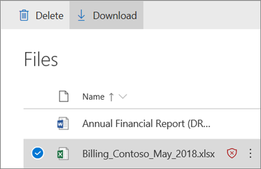

# ATP för SharePoint, OneDrive och Microsoft TeamsATP for SharePoint, OneDrive, and Microsoft Teams

[!INCLUDE [Microsoft 365 Defender rebranding](../includes/microsoft-defender-for-office.md)]

## Översikt över Office 365 ATP för SharePoint, OneDrive och Microsoft TeamsOverview of Office 365 ATP for SharePoint, OneDrive, and Microsoft Teams

Folk delar regelbundet filer och samarbetar med SharePoint, OneDrive och Microsoft Teams.People regularly share files and collaborate using SharePoint, OneDrive, and Microsoft Teams. Med [Office 365 Avancerat skydd](office-365-atp.md) (ATP) kan din organisation samar beta på ett säkrare sätt.With [Office 365 Advanced Threat Protection](office-365-atp.md) (ATP), your organization can collaborate in a safer manner. ATP hjälper till att upptäcka och blockera filer som identifieras som skadliga på grupp webbplatser och dokument bibliotek.ATP helps detect and block files that are identified as malicious in team sites and document libraries.

## Så fungerar Office 365 ATPHow Office 365 ATP operates

När en fil i SharePoint Online, OneDrive för företag och Microsoft Teams har identifierats som skadlig, integreras ATP direkt med fil arkiven för att låsa den filen.When a file in SharePoint Online, OneDrive for Business, and Microsoft Teams has been identified as malicious, ATP directly integrates with the file stores to lock that file. Följande bild visar ett exempel på en skadlig fil som identifieras i ett bibliotek.The following image shows an example of a malicious file detected in a library.

Även om den blockerade filen fortfarande visas i dokument biblioteket och webb-, mobil-eller Skriv bords program går det inte att öppna, kopiera, flytta eller dela den blockerade filen.Although the blocked file is still listed in the document library and web, mobile, or desktop applications, the blocked file cannot be opened, copied, moved, or shared. Det går att ta bort en blockerad fil.People can, however, delete a blocked file. Här är ett exempel på vad som ser ut på en användares mobila enhet:Here's an example of what that looks like on a user's mobile device:

Beroende på hur Microsoft 365 har kon figurer ATS kan folk eller kanske inte kunna ladda ned en blockerad fil.Depending on how Microsoft 365 is configured, people might or might not have the ability to download a blocked file. Så här laddar du ned en blockerad fil på en användares mobila enhet:Here's what downloading a blocked file looks like on a user's mobile device:

Mer information finns i [Aktivera Office 365 ATP för SharePoint, OneDrive och Microsoft Teams](turn-on-atp-for-spo-odb-and-teams.md).To learn more, see [Turn on Office 365 ATP for SharePoint, OneDrive, and Microsoft Teams](turn-on-atp-for-spo-odb-and-teams.md).

## Tänk på följande sakerKeep these points in mind

- ATP kommer inte att söka igenom alla filer i SharePoint Online, OneDrive för företag eller Microsoft Teams.ATP will not scan every single file in SharePoint Online, OneDrive for Business, or Microsoft Teams. Detta är avsiktligt.This is by design. Filer skannas asynkront, genom en process där delnings-och gäst aktivitets händelser används tillsammans med smarta heuristik och hot signaler.Files are scanned asynchronously, through a process that uses sharing and guest activity events along with smart heuristics and threat signals to identify malicious files.

- Kontrol lera att dina SharePoint-webbplatser är konfigurerade för att använda den [moderna upplevelsen](https://docs.microsoft.com/sharepoint/guide-to-sharepoint-modern-experience).Make sure your SharePoint sites are configured to use the [Modern experience](https://docs.microsoft.com/sharepoint/guide-to-sharepoint-modern-experience). När en fil identifieras som skadlig och blockerad kan andra se att det har hänt med den moderna upplevelsen, men inte i klassiskt läge.When a file is identified as malicious and blocked, people can see that this has occurred in the Modern experience, but not the Classic view. ATP-skydd gäller om den moderna upplevelsen eller vyn Klassisk används; visuella indikatorer som en fil är blockerade är bara att presentera i den moderna upplevelsen.ATP protection applies whether the Modern experience or the Classic view is used; however, visual indicators that a file is blocked are present only in the Modern experience.

- Filer som identifieras som skadliga i SharePoint Online, OneDrive för företag eller Microsoft Teams visas i [rapporter för Office 365 Avancerat skydd för hotet](view-reports-for-atp.md) och i [Utforskaren (och i real tid)](threat-explorer.md).Files that are identified as malicious in SharePoint Online, OneDrive for Business, or Microsoft Teams will show up in [reports for Office 365 Advanced Threat Protection](view-reports-for-atp.md) and in [Explorer (and real-time detections)](threat-explorer.md).

- ATP är en del av organisationens övergripande hot skydds strategi, som inkluderar skydd mot skräp post samt säkra länkar och säkra bifogade filer.ATP is part of your organization's overall threat protection strategy, which includes anti-spam and anti-malware protection, as well as Safe Links and Safe Attachments. Mer information finns i [skydda mot hot i Office 365](protect-against-threats.md).To learn more, see [Protect against threats in Office 365](protect-against-threats.md).

- En SharePoint Online-administratör kan bestämma om andra ska kunna hämta filer som identifieras som skadliga.A SharePoint Online administrator can determine whether to enable people to download files that are detected as malicious. Det gör du genom att köra PowerShell-cmdleten Set-SPOTenant med hjälp av en DisallowInfectedFileDownload-parameter (se [aktivera Office 365 ATP för SharePoint, OneDrive och Microsoft Teams](turn-on-atp-for-spo-odb-and-teams.md)).This is done by running the Set-SPOTenant PowerShell cmdlet using a DisallowInfectedFileDownload parameter (see [Turn on Office 365 ATP for SharePoint, OneDrive, and Microsoft Teams](turn-on-atp-for-spo-odb-and-teams.md)).

## Karantän i ATP för SharePoint Online, OneDrive för företag och Microsoft TeamsQuarantine in ATP for SharePoint Online, OneDrive for Business, and Microsoft Teams

 Från [och med](quarantine-email-messages.md) den här inledningen kan 2018 i säkerhets &amp; Center utökas till ATP för SharePoint Online, OneDrive för företag och Microsoft Teams.Beginning in late May 2018, [quarantine](quarantine-email-messages.md) capabilities in the Security &amp; Compliance Center are being extended to ATP for SharePoint Online, OneDrive for Business, and Microsoft Teams.

När en fil i SharePoint Online, OneDrive för företag eller Microsoft Teams identifieras som skadlig är det förutom ATP som blockerar filen från att öppnas eller delas, den filen ingår i en lista över objekt i karantän.When a file in SharePoint Online, OneDrive for Business, or Microsoft Teams is identified as malicious, in addition to ATP blocking the file from being opened or shared, that file is included in a list of quarantined items. (I säkerhets &amp; Compliance Center, gå till **Threat Management** \> **Granska** \> **karantän** och filtrera efter **filer**.)(In the Security &amp; Compliance Center, go to **Threat management** \> **Review** \> **Quarantine** and filter for **Files**.)

Om du är en del av säkerhets gruppen Microsoft 365 för företag och har de behörigheter som krävs [för säkerhets &amp; kontroll Center](permissions-in-the-security-and-compliance-center.md)kan du ladda ned, släppa, rapportera och ta bort filer som identifieras som skadligt för ATP från karantän.If you're part of your organization's Microsoft 365 for business security team and have the necessary [permissions assigned in the Security &amp; Compliance Center](permissions-in-the-security-and-compliance-center.md), you can download, release, report, and delete files that are detected as malicious by ATP from quarantine.

- Om du **släpper och rapporterar** en fil tas spärr blocket för ATP bort från filen på respektive grupp webbplats eller dokument bibliotek för SharePoint, OneDrive eller Microsoft Teams.**Releasing and reporting** a file removes the ATP block on the file in the respective team site or document library for SharePoint, OneDrive, or Microsoft Teams. Då kan användarna öppna, dela och ladda ned filen.Users are then able to open, share, and download the file. Och när alternativet **Skicka rapport till Microsoft** är markerat rapporteras filen som falsk till Microsoft.And, when the **Send report to Microsoft** option is selected, the file is reported as a false positive to Microsoft.

- Om du **tar bort en fil** tas filen bort från karantänen. filen är dock fortfarande förhindrad att öppnas eller delas.**Deleting a file** removes the file from quarantine; however, the file is still blocked from being opened or shared. Filen måste också tas bort i sitt respektive dokument bibliotek eller på en grupp webbplats (SharePoint Online, OneDrive för företag eller Microsoft Teams).The file must also be deleted in its respective document library or team site (SharePoint Online, OneDrive for Business, or Microsoft Teams).

- Om du **laddar ned en fil** kan du ladda ned och analysera filen för alla falska positiva positiv.**Downloading a file** enables you to download and analyze the file for any false positives.

## Nästa stegNext steps

 - [Turn on Office 365 ATP for SharePoint, OneDrive, and Microsoft TeamsTurn on Office 365 ATP for SharePoint, OneDrive, and Microsoft Teams](turn-on-atp-for-spo-odb-and-teams.md)

 - [Visa information om skadliga filer som identifieras i SharePoint, OneDrive eller Microsoft TeamsView information about malicious files detected in SharePoint, OneDrive, or Microsoft Teams](malicious-files-detected-in-spo-odb-or-teams.md)

