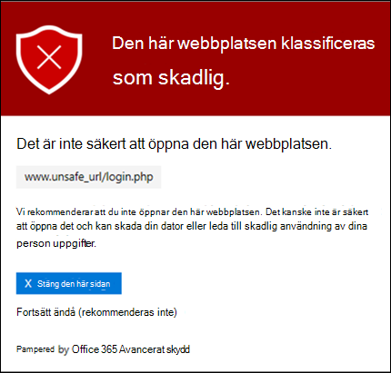
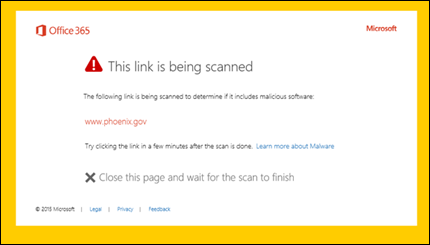

# Varnings sidor för säkraste ATP-länkarATP Safe Links warning pages

[!INCLUDE [Microsoft 365 Defender rebranding](../includes/microsoft-defender-for-office.md)]

> [!IMPORTANT]
> Den här artikeln är avsedd för företagskunder som har [Office 365 Avancerat skydd](office-365-atp.md).This article is intended for business customers who have [Office 365 Advanced Threat Protection](office-365-atp.md). Om du använder Outlook.com, Microsoft 365 eller Microsoft 365 personal och du letar efter information om säkra länkar i Outlook kan du läsa mer i [avancerad Outlook.com-säkerhet](https://support.microsoft.com/office/882d2243-eab9-4545-a58a-b36fee4a46e2).If you are using Outlook.com, Microsoft 365 Family, or Microsoft 365 Personal, and you're looking for information about Safe Links in Outlook, see [Advanced Outlook.com security](https://support.microsoft.com/office/882d2243-eab9-4545-a58a-b36fee4a46e2).

[Office 365 Avancerat skydd](office-365-atp.md) (ATP) skyddar din organisation från nätfiske-försök och skadlig program vara via funktioner, till exempel [säkra säkerhets länkar](atp-safe-links.md), [ATP-säkra bilagor](atp-safe-attachments.md)och [skydd mot nätfiske](anti-phishing-protection.md).[Office 365 Advanced Threat Protection](office-365-atp.md) (ATP) helps protect your organization from phishing attempts and malware through features, such as [ATP Safe Links](atp-safe-links.md), [ATP Safe Attachments](atp-safe-attachments.md), and [anti-phishing protection](anti-phishing-protection.md). När skydd är på plats kontrol leras länkar (URL: er) i e-postmeddelanden och Office-dokument.When protection is in place, links (URLs) in email messages and Office documents are checked. Om en URL identifieras som misstänkt eller skadlig kanske du hindras från att öppna URL: en när du klickar på den.If a URL is identified as suspicious or malicious, you might be blocked from opening the URL when you click it. I stället för att gå direkt till webbplatsen visas en varnings sida i stället.Instead of going directly to the site, you might see a warning page instead.

Läs den här artikeln om du vill se exempel på varnings sidor som kan visas tillsammans med de senaste uppdateringarna av varnings sidor.Read this article to see examples of warning pages that might appear, along with recent updates to warning pages.

## Exempel på varnings sidorExamples of warning pages

### ATP skannar länkenATP is scanning the link

En URL skannas via säkrare för ATP.A URL is being scanned by ATP Safe Links. Du kan behöva vänta en liten stund för att försöka med länken igen.You might have to wait a few moments to try the link again.

### En URL finns i ett misstänkt e-postmeddelandeA URL is in a suspicious email message

URL-adressen finns i ett e-postmeddelande som liknar andra e-postmeddelanden som anses vara misstänkt.The URL is in an email message that seems similar to other email messages that are considered suspicious. Vi rekommenderar att du dubbelklickar på e-postmeddelandet innan du fortsätter till webbplatsen.We recommend that you double-check the email message before proceeding to the site.

### En URL-adress finns i ett meddelande som identifieras som ett nät fiske försökA URL is in a message identified as a phishing attempt

URL-adressen finns i ett e-postmeddelande som har identifierats som nätfiske-attack.The URL is in an email message that has been identified as a phishing attack. Därför blockeras alla URL-adresser i e-postmeddelandet.As a result, all URLs in the email message are blocked. Vi rekommenderar att du inte fortsätter till webbplatsen.We recommend that you do not proceed to the site.

### En webbplats har identifierats som skadligA site has been identified as malicious

URL: en pekar på en webbplats som har identifierats som skadlig.The URL points to a site that has been identified as malicious.    Vi rekommenderar att du inte fortsätter till webbplatsen.We recommend that you do not proceed to the site.

### En webbplats är blockeradA site is blocked

URL-adressen är blockerad för din organisation.The URL is blocked for your organization. Det finns flera orsaker till att en URL kan vara blockerad.There are several reasons why a URL might be blocked. Vi rekommenderar att du kontaktar organisationens Microsoft 365 för företag-administratör.We recommend that you contact your organization's Microsoft 365 for business administrator.

### Ett fel har inträffatAn error has occurred

Ett fel har inträffat och URL-adressen kan inte öppnas.Some kind of error has occurred, and the URL cannot be opened.

## Senaste uppdateringar av varnings sidorRecent updates to warning pages

Flera varnings sidor uppdaterades nyligen för Office 365 ATP.Several warning pages were recently updated for Office 365 ATP. Om du inte redan ser de uppdaterade sidorna är det snart.If you're not already seeing the updated pages, you will soon. Uppdateringarna innehåller ett nytt färg schema, mer information och möjligheten att gå vidare till en webbplats trots den angivna varningen och rekommendationerna.The updates include a new color scheme, more details, and the ability to proceed to a site despite the given warning and recommendations.

### URL-genomsökning pågårURL scan in progress

Ursprunglig varnings sida:Original warning page:

Uppdaterad varnings sida:Updated warning page:

### Varning om skadlig webbplatsMalicious site warning

Ursprunglig varnings sida:Original warning page:

Uppdaterad varnings sida:Updated warning page:

### Blockerad URL-varningBlocked URL warning

Ursprunglig varnings sida:Original warning page:

Uppdaterad varnings sida:Updated warning page:

### Varnings sidan "felet uppstod""Error occurred" warning page

Ursprunglig varnings sida:Original warning page:

Uppdaterad varnings sida:Updated warning page:

