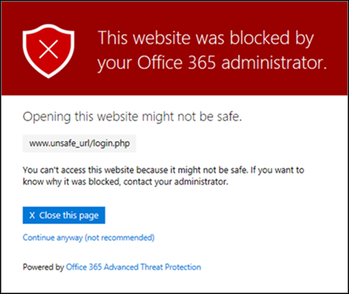

# Varningssidor för Office 365 ATP-säkra länkarOffice 365 ATP Safe Links warning pages

> [!IMPORTANT]
> Den här artikeln är avsedd för företagskunder som har [Office 365 Avancerat skydd](office-365-atp.md).This article is intended for business customers who have [Office 365 Advanced Threat Protection](office-365-atp.md). Om du använder Outlook.com, Office 365 Home eller Office 365 Personal och letar efter information om säkra länkar i Outlook läser du [Avancerad Outlook.com säkerhet](https://support.office.com/article/882d2243-eab9-4545-a58a-b36fee4a46e2).If you are using Outlook.com, Office 365 Home, or Office 365 Personal, and you're looking for information about Safe Links in Outlook, see [Advanced Outlook.com security](https://support.office.com/article/882d2243-eab9-4545-a58a-b36fee4a46e2).

[Office 365 Advanced Threat Protection](office-365-atp.md) (ATP) hjälper till att skydda din organisation från nätfiskeförsök och skadlig kod genom funktioner, till exempel [ATP Safe Links,](atp-safe-links.md) [ATP Safe Attachments](atp-safe-attachments.md)och [anti-phishing protection](anti-phishing-protection.md).[Office 365 Advanced Threat Protection](office-365-atp.md) (ATP) helps protect your organization from phishing attempts and malware through features, such as [ATP Safe Links](atp-safe-links.md), [ATP Safe Attachments](atp-safe-attachments.md), and [anti-phishing protection](anti-phishing-protection.md). När skydd är på plats kontrolleras länkar (URL:er) i e-postmeddelanden och Office-dokument.When protection is in place, links (URLs) in email messages and Office documents are checked. Om en webbadress identifieras som misstänkt eller skadlig kan du blockeras från att öppna webbadressen när du klickar på den.If a URL is identified as suspicious or malicious, you might be blocked from opening the URL when you click it. I stället för att gå direkt till webbplatsen kan du se en varningssida i stället.Instead of going directly to the site, you might see a warning page instead.

Läs den här artikeln om du vill se exempel på varningssidor som kan visas, tillsammans med de senaste uppdateringarna av varningssidor.Read this article to see examples of warning pages that might appear, along with recent updates to warning pages.

## Exempel på varningssidorExamples of warning pages

### ATP skannar länkenATP is scanning the link

En URL genomsöks av ATP Safe Links.A URL is being scanned by ATP Safe Links. Du kanske måste vänta en stund för att försöka länken igen.You might have to wait a few moments to try the link again.

### En WEBBADRESS finns i ett misstänkt e-postmeddelandeA URL is in a suspicious email message

Webbadressen finns i ett e-postmeddelande som liknar andra e-postmeddelanden som anses misstänkta.The URL is in an email message that seems similar to other email messages that are considered suspicious. Vi rekommenderar att du dubbelkollar e-postmeddelandet innan du fortsätter till webbplatsen.We recommend that you double-check the email message before proceeding to the site.

### En webbadress finns i ett meddelande som identifieras som ett nätfiskeförsökA URL is in a message identified as a phishing attempt

Webbadressen finns i ett e-postmeddelande som har identifierats som en nätfiskeattack.The URL is in an email message that has been identified as a phishing attack. Därför blockeras alla webbadresser i e-postmeddelandet.As a result, all URLs in the email message are blocked. Vi rekommenderar att du inte fortsätter till webbplatsen.We recommend that you do not proceed to the site.

### En webbplats har identifierats som skadligA site has been identified as malicious

Webbadressen pekar på en webbplats som har identifierats som skadlig.The URL points to a site that has been identified as malicious.    Vi rekommenderar att du inte fortsätter till webbplatsen.We recommend that you do not proceed to the site.

### En webbplats är blockeradA site is blocked

WEBBADRESSEN är blockerad för din organisation.The URL is blocked for your organization. Det finns flera orsaker till att en webbadress kan blockeras.There are several reasons why a URL might be blocked. Vi rekommenderar att du kontaktar organisationens Office 365-administratör.We recommend that you contact your organization's Office 365 administrator.

### Ett fel har inträffatAn error has occurred

Någon form av fel har inträffat och url:en kan inte öppnas.Some kind of error has occurred, and the URL cannot be opened.

## Senaste uppdateringarna av varningssidorRecent updates to warning pages

Flera varningssidor har nyligen uppdaterats för Office 365 ATP.Several warning pages were recently updated for Office 365 ATP. Om du inte redan ser de uppdaterade sidorna kommer du snart.If you're not already seeing the updated pages, you will soon. Uppdateringarna inkluderar ett nytt färgschema, mer information och möjligheten att gå vidare till en webbplats trots den givna varningen och rekommendationerna.The updates include a new color scheme, more details, and the ability to proceed to a site despite the given warning and recommendations.

### URL-genomsökning pågårURL scan in progress

Ursprunglig varningssida:Original warning page:

Uppdaterad varningssida:Updated warning page:

### Varning för skadlig webbplatsMalicious site warning

Ursprunglig varningssida:Original warning page:

Uppdaterad varningssida:Updated warning page:

### Varning för blockerad WEBBADRESSBlocked URL warning

Ursprunglig varningssida:Original warning page:

Uppdaterad varningssida:Updated warning page:

### Varningssida "Fel uppstod""Error occurred" warning page

Ursprunglig varningssida:Original warning page:

Uppdaterad varningssida:Updated warning page:

