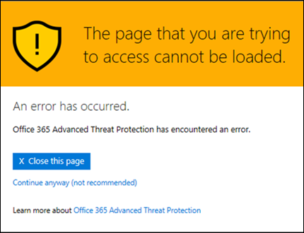

# Varnings sidor för säkraste ATP-länkar

[!INCLUDE [Microsoft 365 Defender rebranding](../includes/microsoft-defender-for-office.md)]

> [!IMPORTANT]
> Den här artikeln är avsedd för företagskunder som har [Office 365 Avancerat skydd](office-365-atp.md). Om du använder Outlook.com, Microsoft 365 eller Microsoft 365 personal och du letar efter information om säkra länkar i Outlook kan du läsa mer i [avancerad Outlook.com-säkerhet](https://support.microsoft.com/office/882d2243-eab9-4545-a58a-b36fee4a46e2).

[Office 365 Avancerat skydd](office-365-atp.md) (ATP) skyddar din organisation från nätfiske-försök och skadlig program vara via funktioner, till exempel [säkra säkerhets länkar](atp-safe-links.md), [ATP-säkra bilagor](atp-safe-attachments.md)och [skydd mot nätfiske](anti-phishing-protection.md). När skydd är på plats kontrol leras länkar (URL: er) i e-postmeddelanden och Office-dokument. Om en URL identifieras som misstänkt eller skadlig kanske du hindras från att öppna URL: en när du klickar på den. I stället för att gå direkt till webbplatsen visas en varnings sida i stället.

Läs den här artikeln om du vill se exempel på varnings sidor som kan visas tillsammans med de senaste uppdateringarna av varnings sidor.

## Exempel på varnings sidor

### ATP skannar länken

En URL skannas via säkrare för ATP. Du kan behöva vänta en liten stund för att försöka med länken igen.

### En URL finns i ett misstänkt e-postmeddelande

URL-adressen finns i ett e-postmeddelande som liknar andra e-postmeddelanden som anses vara misstänkt. Vi rekommenderar att du dubbelklickar på e-postmeddelandet innan du fortsätter till webbplatsen.

### En URL-adress finns i ett meddelande som identifieras som ett nät fiske försök

URL-adressen finns i ett e-postmeddelande som har identifierats som nätfiske-attack. Därför blockeras alla URL-adresser i e-postmeddelandet. Vi rekommenderar att du inte fortsätter till webbplatsen.

### En webbplats har identifierats som skadlig

URL: en pekar på en webbplats som har identifierats som skadlig.    Vi rekommenderar att du inte fortsätter till webbplatsen.

### En webbplats är blockerad

URL-adressen är blockerad för din organisation. Det finns flera orsaker till att en URL kan vara blockerad. Vi rekommenderar att du kontaktar organisationens Microsoft 365 för företag-administratör.

### Ett fel har inträffat

Ett fel har inträffat och URL-adressen kan inte öppnas.

## Senaste uppdateringar av varnings sidor

Flera varnings sidor uppdaterades nyligen för Office 365 ATP. Om du inte redan ser de uppdaterade sidorna är det snart. Uppdateringarna innehåller ett nytt färg schema, mer information och möjligheten att gå vidare till en webbplats trots den angivna varningen och rekommendationerna.

### URL-genomsökning pågår

Ursprunglig varnings sida:

Uppdaterad varnings sida:

### Varning om skadlig webbplats

Ursprunglig varnings sida:

Uppdaterad varnings sida:

### Blockerad URL-varning

Ursprunglig varnings sida:

Uppdaterad varnings sida:

### Varnings sidan "felet uppstod"

Ursprunglig varnings sida:

Uppdaterad varnings sida:

